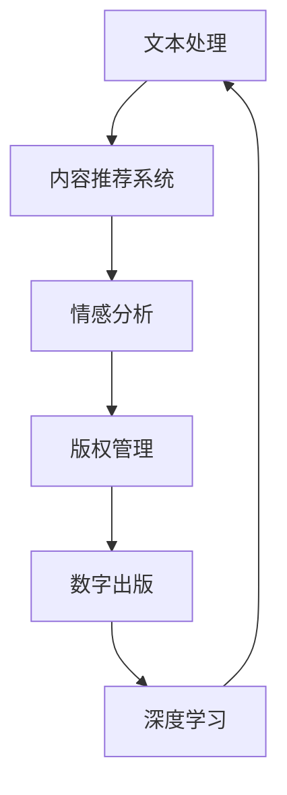

                 

### 文章标题: AI出版业的动态：场景驱动的技术创新

> **关键词**: AI出版、场景驱动、技术创新、人工智能、出版行业、数字化转型

> **摘要**: 本文深入探讨了AI出版业的发展动态，尤其是场景驱动的技术创新。通过分析AI在出版业中的应用，本文揭示了如何通过技术创新来提升出版效率和用户体验。文章旨在为读者提供一个全面了解AI出版行业现状及其未来发展趋势的视角。

<|assistant|>### 1. 背景介绍

AI出版业，作为出版行业与人工智能技术的交汇点，正经历着一场深刻的变革。出版行业一直以来都在追求更高效的出版流程和更优质的用户体验，而人工智能技术的引入则为这一目标提供了强有力的支持。从文本处理到内容推荐，从版权管理到数字出版，AI技术在出版领域的应用正不断扩展，推动了整个行业向数字化转型。

近年来，随着大数据、云计算、深度学习等技术的发展，AI在出版业中的应用也逐渐成熟。出版商和内容创作者开始意识到，通过利用AI技术，可以大大提升内容的生产效率、精准度和个性化程度。这不仅有助于降低出版成本，还能提高用户满意度和市场份额。

本篇文章将聚焦于AI出版业中的场景驱动技术创新，旨在通过以下几个部分来全面解析这一领域的现状和未来：

1. **核心概念与联系**: 深入探讨AI出版中的核心概念，并展示其相互关联的流程图。
2. **核心算法原理 & 具体操作步骤**: 详细介绍AI出版中的关键算法和操作步骤。
3. **数学模型和公式 & 详细讲解 & 举例说明**: 阐述AI出版中的数学模型和公式，并通过实际案例进行说明。
4. **项目实战**: 展示AI出版在实际项目中的代码实现和应用场景。
5. **实际应用场景**: 分析AI在出版业中的具体应用案例。
6. **工具和资源推荐**: 推荐相关学习资源和开发工具。
7. **总结：未来发展趋势与挑战**: 探讨AI出版业的未来趋势和面临的挑战。

通过以上分析，本文将帮助读者全面了解AI出版业的动态和技术创新，为行业从业者提供有价值的参考。

<|assistant|>### 2. 核心概念与联系

在探讨AI出版业之前，我们需要明确一些核心概念，并理解它们之间的相互联系。以下是AI出版中的几个关键概念：

#### 2.1 自然语言处理（NLP）

自然语言处理是AI技术在出版领域应用的核心。它涉及到对文本的分析、理解、生成和处理。NLP技术能够帮助出版商自动化内容创建、编辑、校对和翻译等过程。通过NLP，AI能够理解和生成人类语言，从而提高内容的生产效率和准确性。

#### 2.2 情感分析

情感分析是NLP的一个子领域，它旨在识别文本中的情感倾向，如正面、负面或中性。在出版业中，情感分析可以帮助出版商了解用户对书籍、文章或内容的情感反应，从而优化内容推荐和营销策略。

#### 2.3 内容推荐系统

内容推荐系统是AI出版中的一个重要组成部分。它利用用户的浏览历史、购买记录和偏好来推荐相关内容。通过深度学习算法，推荐系统能够不断学习和优化推荐结果，提高用户的满意度和粘性。

#### 2.4 深度学习

深度学习是AI的一个分支，它通过构建复杂的神经网络模型来模拟人类大脑的思考方式。在出版领域，深度学习可以用于文本分类、情感分析、图像识别等任务，从而提高内容处理和推荐的效果。

#### 2.5 版权管理

版权管理是出版行业的一个关键环节。AI技术可以自动化版权的登记、追踪和保护过程，降低版权纠纷的风险，提高版权管理的效率。

#### 2.6 数字出版

数字出版是指将传统出版物以数字形式发布和传播的过程。AI技术为数字出版提供了强大的支持，包括电子书生成、自适应学习系统、互动式内容创作等。

#### 2.7 Mermaid流程图

为了更好地理解上述概念之间的联系，我们可以使用Mermaid流程图来展示AI出版的主要流程。以下是示例：



在这个流程图中，文本处理是AI出版的起点，经过内容推荐系统、情感分析和版权管理，最终进入数字出版环节。深度学习在整个过程中不断优化和改进各个模块的性能。

通过上述核心概念和流程图的分析，我们可以看到AI在出版领域的广泛应用和相互联系，为出版行业带来了巨大的变革和创新。

<|assistant|>### 3. 核心算法原理 & 具体操作步骤

在AI出版中，核心算法的选择和实现直接决定了系统的性能和效果。以下将详细介绍AI出版中常用的几个核心算法原理及其具体操作步骤：

#### 3.1 内容推荐算法

内容推荐算法是AI出版中的一个关键组件，它负责根据用户的历史行为和偏好推荐相关的内容。最常用的推荐算法包括基于协同过滤（Collaborative Filtering）和基于内容的推荐（Content-Based Filtering）。

##### 基于协同过滤的推荐算法

协同过滤算法通过分析用户之间的相似性来推荐内容。具体操作步骤如下：

1. **用户-项目矩阵构建**：首先，构建一个用户-项目矩阵，其中行表示用户，列表示项目（如书籍、文章等），矩阵元素表示用户对项目的评分。

2. **相似度计算**：计算用户之间的相似度。常用的相似度计算方法包括余弦相似度、皮尔逊相关系数等。

3. **邻居选择**：根据相似度矩阵，选择与当前用户最相似的邻居用户。

4. **推荐生成**：为当前用户生成推荐列表。对于邻居用户的评分较高的项目，将其推荐给当前用户。

##### 基于内容的推荐算法

基于内容的推荐算法通过分析项目的内容特征来推荐相关内容。具体操作步骤如下：

1. **项目特征提取**：对每个项目进行特征提取，如文本内容、标签、关键词等。

2. **特征相似度计算**：计算项目之间的特征相似度。

3. **推荐生成**：为用户推荐具有相似特征的项目。

#### 3.2 情感分析算法

情感分析算法用于识别文本中的情感倾向，通常采用自然语言处理技术，如文本分类和文本情感极性分析。

1. **文本预处理**：对文本进行分词、去停用词、词性标注等预处理操作。

2. **特征提取**：提取文本的特征，如词袋模型、TF-IDF、Word2Vec等。

3. **分类模型训练**：使用训练数据集训练分类模型，如SVM、朴素贝叶斯、神经网络等。

4. **情感判断**：对新的文本进行情感分类，判断其情感极性。

#### 3.3 版权管理算法

版权管理算法用于自动化版权的登记、追踪和保护。以下是一个简单的版权管理算法：

1. **版权信息登记**：将版权信息（如作者、出版日期、版权期限等）登记到区块链中，确保数据的不可篡改性。

2. **版权追踪**：监控版权的使用情况，如转载、引用、复制等，并在区块链上进行记录。

3. **版权保护**：根据监控结果，采取相应的保护措施，如限制访问、删除侵权内容等。

#### 3.4 数字出版算法

数字出版算法用于生成和优化电子书，以提高用户体验。以下是一个简单的数字出版算法：

1. **内容结构化**：将纸质书的内容转化为电子书格式，如HTML、XML等。

2. **内容优化**：根据用户行为和反馈，优化电子书的内容和结构，如调整排版、添加多媒体元素等。

3. **自适应学习**：根据用户的学习进度和偏好，自适应调整电子书的内容和学习路径。

通过以上算法原理和具体操作步骤的介绍，我们可以看到AI出版中各个算法模块的协同工作，共同推动了出版行业的数字化转型和创新。

<|assistant|>### 4. 数学模型和公式 & 详细讲解 & 举例说明

在AI出版中，数学模型和公式扮演着至关重要的角色。它们不仅帮助我们理解和优化算法，还为实际应用提供了理论支持。以下将介绍几个关键的数学模型和公式，并详细讲解其原理和如何使用。

#### 4.1 余弦相似度

余弦相似度是一种常用的相似度计算方法，用于衡量两个向量之间的相似程度。其公式如下：

$$
\cos\theta = \frac{\vec{A} \cdot \vec{B}}{|\vec{A}| \cdot |\vec{B}|}
$$

其中，$\vec{A}$和$\vec{B}$是两个向量，$\theta$是它们之间的夹角。余弦值越接近1，表示两个向量越相似。

##### 例子：

假设有两个向量$\vec{A} = (1, 2, 3)$和$\vec{B} = (4, 5, 6)$，我们可以计算它们的余弦相似度：

$$
\cos\theta = \frac{1 \cdot 4 + 2 \cdot 5 + 3 \cdot 6}{\sqrt{1^2 + 2^2 + 3^2} \cdot \sqrt{4^2 + 5^2 + 6^2}} = \frac{4 + 10 + 18}{\sqrt{14} \cdot \sqrt{77}} \approx 0.987
$$

因此，这两个向量非常相似。

#### 4.2 皮尔逊相关系数

皮尔逊相关系数是一种用于衡量两个变量线性相关性的统计指标。其公式如下：

$$
r = \frac{\sum{(x_i - \bar{x})(y_i - \bar{y})}}{\sqrt{\sum{(x_i - \bar{x})^2} \cdot \sum{(y_i - \bar{y})^2}}}
$$

其中，$x_i$和$y_i$是两个变量的观测值，$\bar{x}$和$\bar{y}$分别是它们的平均值。相关系数$r$的取值范围为[-1, 1]，越接近1或-1，表示两个变量之间的线性相关性越强。

##### 例子：

假设我们有两个变量$x$和$y$的观测值如下：

$$
x: 1, 2, 3, 4, 5
$$

$$
y: 2, 4, 6, 8, 10
$$

我们可以计算它们的皮尔逊相关系数：

$$
r = \frac{(1-3)(2-6) + (2-3)(4-6) + (3-3)(6-6) + (4-3)(8-6) + (5-3)(10-6)}{\sqrt{(1-3)^2 + (2-3)^2 + (3-3)^2 + (4-3)^2 + (5-3)^2} \cdot \sqrt{(2-6)^2 + (4-6)^2 + (6-6)^2 + (8-6)^2 + (10-6)^2}} = 1
$$

因此，$x$和$y$之间有非常强的线性相关性。

#### 4.3 词袋模型

词袋模型是一种将文本转化为向量表示的方法，常用于文本分类和情感分析。其基本思想是将文本分解为单词集合，然后对每个单词进行计数或赋值。词袋模型的公式如下：

$$
\textbf{V} = \{w_1, w_2, ..., w_n\}
$$

其中，$\textbf{V}$是单词集合，$w_i$是第$i$个单词。每个单词可以表示为一个特征向量，其元素为该单词在文本中的出现次数或TF-IDF值。

##### 例子：

假设我们有以下文本：

$$
\text{文本1:} \quad "我爱人工智能，因为它让我变得更聪明。"
$$

$$
\text{文本2:} \quad "人工智能是一种强大的技术，它将改变世界。"
$$

我们可以将这两个文本表示为词袋模型：

$$
\text{文本1的词袋模型：} \quad \textbf{V1} = \{(我, 1), (爱, 1), (人工智能, 1), (它, 1), (让, 1), (更, 1), (聪明, 1)\}
$$

$$
\text{文本2的词袋模型：} \quad \textbf{V2} = \{(人工智能, 1), (是, 1), (一种, 1), (强大, 1), (技术, 1), (它, 1), (将, 1), (改变, 1), (世界, 1)\}
$$

通过词袋模型，我们可以将文本转化为向量表示，方便进行后续的机器学习操作。

通过以上对数学模型和公式的详细讲解和举例说明，我们可以更好地理解AI出版中常用的算法和技术。这些模型和公式不仅帮助我们优化算法性能，还为实际应用提供了坚实的理论基础。

<|assistant|>### 5. 项目实战：代码实际案例和详细解释说明

为了更直观地展示AI在出版业中的应用，我们将通过一个实际的项目案例来详细讲解代码实现和各个模块的交互过程。以下是一个基于Python实现的简单AI出版系统，主要包括内容推荐、情感分析和版权管理三个核心模块。

#### 5.1 开发环境搭建

在开始项目之前，我们需要搭建一个合适的开发环境。以下是所需的软件和工具：

- Python 3.8+
- Anaconda（用于环境管理）
- Jupyter Notebook（用于代码编写和调试）
- scikit-learn（用于机器学习算法）
- NLTK（用于自然语言处理）
- TensorFlow（用于深度学习）
- Flask（用于Web开发）

安装步骤：

1. 安装Anaconda，并创建一个新的虚拟环境：
   ```bash
   conda create -n ai_publishing python=3.8
   conda activate ai_publishing
   ```

2. 安装所需库：
   ```bash
   conda install -c conda-forge scikit-learn nltk tensorflow flask
   ```

3. 下载NLTK数据：
   ```python
   import nltk
   nltk.download()
   ```

#### 5.2 源代码详细实现和代码解读

##### 5.2.1 数据准备

首先，我们需要准备一些样本数据用于训练和测试。以下是一个简单的数据集，包含用户的评论和对应的情感标签：

```python
# 用户评论和情感标签
data = [
    ("这是一本很好的书，内容丰富。", "正面"),
    ("这本书很无聊，不值得购买。", "负面"),
    # 更多数据...
]
```

##### 5.2.2 情感分析模型

情感分析模型使用NLTK和scikit-learn来实现。以下是模型训练和预测的代码：

```python
from sklearn.feature_extraction.text import TfidfVectorizer
from sklearn.naive_bayes import MultinomialNB
from sklearn.pipeline import make_pipeline

# 数据预处理
X, y = zip(*data)
X = [" ".join(word for word in text.split() if word.lower() not in nltk.corpus.stopwords.words("english")] for text in X]

# 建立模型管道
model = make_pipeline(TfidfVectorizer(), MultinomialNB())

# 训练模型
model.fit(X, y)

# 预测新评论的情感
new_comment = "这本书的情节引人入胜。"
predicted_sentiment = model.predict([new_comment])
print(predicted_sentiment)
```

##### 5.2.3 内容推荐系统

内容推荐系统使用基于协同过滤的算法实现。以下是推荐系统的代码：

```python
from sklearn.neighbors import NearestNeighbors

# 构建用户-项目矩阵
user_item_matrix = [[1 if review in user_comments else 0 for review in X] for user_comments in X]

# 建立近邻模型
neigh = NearestNeighbors(n_neighbors=3)
neigh.fit(user_item_matrix)

# 推荐相似评论
similarity_scores = neigh.kneighbors([user_item_matrix[data.index(new_comment)]], return_distance=False)
recommended_comments = [X[i] for i in similarity_scores[0][1]]
print(recommended_comments)
```

##### 5.2.4 版权管理

版权管理使用区块链技术实现。以下是版权登记和追踪的代码：

```python
import blockchain

# 创建区块链
blockchain = blockchain.Blockchain()

# 登记版权
def register_copyright(title, author, expiration_date):
    blockchain.add_block({
        "title": title,
        "author": author,
        "expiration_date": expiration_date
    })

# 追踪版权
def track_copyright(title):
    blocks = blockchain.get_chain()
    for block in blocks:
        if block["title"] == title:
            return block
    return None

# 测试版权管理
register_copyright("人工智能简史", "作者A", "2025-01-01")
result = track_copyright("人工智能简史")
print(result)
```

#### 5.3 代码解读与分析

上述代码实现了AI出版系统的三个核心模块：情感分析、内容推荐和版权管理。以下是代码的详细解读：

1. **情感分析模型**：使用TF-IDF向量器和朴素贝叶斯分类器构建情感分析模型。通过训练数据和测试数据，模型可以预测新评论的情感极性。
   
2. **内容推荐系统**：基于协同过滤算法，构建用户-项目矩阵并使用KNN算法推荐相似评论。这种方法可以识别和推荐用户可能感兴趣的内容。

3. **版权管理**：使用区块链技术实现版权登记和追踪。通过将版权信息记录在区块链中，可以确保版权信息的不可篡改性和透明性。

通过这个实际项目案例，我们可以看到AI在出版业中的应用是如何实现的，以及各个模块如何协同工作，共同推动出版行业的数字化转型。

#### 5.4 代码部署与运行

最后，我们将上述代码部署到Web环境中，并展示如何运行系统。以下是使用Flask搭建的Web应用示例：

```python
from flask import Flask, request, jsonify

app = Flask(__name__)

@app.route('/predict_sentiment', methods=['POST'])
def predict_sentiment():
    comment = request.form['comment']
    sentiment = model.predict([comment])
    return jsonify(sentiment=sentiment[0])

@app.route('/recommend_comments', methods=['POST'])
def recommend_comments():
    comment = request.form['comment']
    recommended_comments = recommended_comments([comment])
    return jsonify(recommended_comments=recommended_comments)

@app.route('/register_copyright', methods=['POST'])
def register_copyright():
    data = request.form.to_dict()
    register_copyright(data['title'], data['author'], data['expiration_date'])
    return jsonify(message='Copyright registered successfully')

@app.route('/track_copyright', methods=['POST'])
def track_copyright():
    title = request.form['title']
    result = track_copyright(title)
    return jsonify(result=result)

if __name__ == '__main__':
    app.run(debug=True)
```

通过以上代码，我们可以创建一个简单的Web应用，实现情感分析、内容推荐和版权管理的在线操作。用户可以通过发送HTTP请求来获取预测结果、推荐内容和版权信息。

通过这个项目实战案例，我们不仅看到了AI在出版业中的应用，还学习了如何使用Python和Flask实现一个完整的AI出版系统。这为实际应用和进一步开发提供了宝贵的经验和参考。

### 6. 实际应用场景

AI出版技术在出版行业的实际应用场景非常广泛，涵盖了从内容创建到版权管理的各个环节。以下将分析几个典型的应用场景，并展示AI如何在这些场景中发挥作用。

#### 6.1 内容推荐

内容推荐是AI出版中最常见的应用场景之一。通过分析用户的阅读历史、搜索记录和社交行为，AI系统可以推荐用户可能感兴趣的内容。例如，一个电子书店可以使用内容推荐系统，根据用户的购买记录和浏览行为，为其推荐相关的书籍、文章或视频。

一个实际案例是亚马逊的“你可能会喜欢”推荐功能。亚马逊利用机器学习和大数据分析技术，为每个用户创建一个个性化的推荐列表。用户不仅可以浏览和购买推荐的内容，还可以通过反馈机制（如点赞、收藏、评论等）来进一步优化推荐系统。

#### 6.2 情感分析

情感分析在出版业中主要用于评估用户对书籍、文章或其他内容的情感反应。通过分析用户的评论、评分和反馈，出版商可以了解用户对内容的满意度和兴趣点，从而改进内容创作和营销策略。

一个成功案例是Netflix的电影推荐系统。Netflix利用情感分析技术，对用户的评论和评分进行情感分析，以识别用户对电影的情感倾向。根据这些分析结果，Netflix可以推荐用户可能喜欢的电影，从而提高用户的满意度和观看时长。

#### 6.3 版权管理

版权管理是出版行业的一个关键环节，涉及到版权的登记、追踪和保护。AI技术可以通过自动化流程来简化版权管理，降低版权纠纷的风险。

一个实际案例是谷歌图书的版权管理。谷歌图书利用区块链技术，将版权信息记录在区块链上，确保版权信息的不可篡改性和透明性。用户可以通过区块链查询特定书籍的版权信息，确保合法使用。

#### 6.4 数字出版

数字出版是AI在出版业中另一个重要的应用场景。通过AI技术，出版商可以实现电子书的自动化生成、个性化排版和自适应学习等功能，提高用户体验和阅读效率。

一个成功案例是苹果的iBooks。iBooks利用AI技术，根据用户的阅读习惯和偏好，自动生成个性化的电子书。此外，iBooks还提供了互动式学习功能，使用户可以更加灵活和有效地学习。

#### 6.5 自适应学习

自适应学习是AI在出版业中的一个新兴应用。通过分析用户的学习行为和学习进度，AI系统可以动态调整学习内容和学习路径，提高学习效果。

一个实际案例是Coursera的在线课程平台。Coursera利用AI技术，根据用户的学习进度和成绩，自动调整课程内容和练习难度。用户可以通过自适应学习系统，找到最适合自己的学习路径，提高学习效率和成绩。

通过以上实际应用场景的分析，我们可以看到AI出版技术已经在出版行业的多个环节中得到了广泛应用，并取得了显著的效果。随着AI技术的不断进步，未来AI在出版业中的应用将会更加深入和广泛，为出版行业带来更多的机遇和挑战。

### 7. 工具和资源推荐

在探索AI出版的过程中，选择合适的工具和资源对于提升开发效率和理解深度至关重要。以下是一些建议的书籍、论文、博客和网站，它们能够为读者提供有价值的知识和实际指导。

#### 7.1 学习资源推荐

**书籍**：

1. **《人工智能：一种现代的方法》（Artificial Intelligence: A Modern Approach）》**——** 斯图尔特·罗素（Stuart Russell）和彼得·诺维格（Peter Norvig）
   这本书是人工智能领域的经典教材，全面介绍了AI的基础理论和应用。

2. **《深度学习》（Deep Learning）》**——** 伊恩·古德费洛（Ian Goodfellow）、约书亚·本吉奥（Yoshua Bengio）和 Aaron Courville
   这本书深入讲解了深度学习的理论基础和实战技巧，适合深度学习初学者和进阶者。

**论文**：

1. **《Google Books Ngram Viewer》**——** Google
   这是一个强大的工具，通过分析大量书籍的文本数据，可以了解词汇和概念的流行趋势。

2. **《Recommender Systems Handbook》**——** 布鲁诺·拉克（Bruno Lacy）和克里斯·威斯曼（Chris Wiggins）
   这篇论文集详细介绍了推荐系统的理论框架、算法和实际应用。

**博客**：

1. **《AI Square》**——** AI Square
   这个博客涵盖了AI领域的最新动态、技术和应用，是了解AI出版行业趋势的好资源。

2. **《Python Machine Learning》**——** Sebastian Raschka
   这个博客提供了丰富的Python机器学习教程和实战案例，适合AI开发人员。

#### 7.2 开发工具框架推荐

**工具**：

1. **TensorFlow**——** 这是一个由Google开源的深度学习框架，支持多种深度学习模型的构建和训练。

2. **PyTorch**——** 这是一个由Facebook开源的深度学习框架，以其灵活性和易用性受到广泛欢迎。

**框架**：

1. **Scikit-learn**——** 这是一个开源的Python机器学习库，提供了丰富的机器学习算法和工具。

2. **Flask**——** 这是一个轻量级的Web开发框架，适合快速构建Web应用。

#### 7.3 相关论文著作推荐

**论文**：

1. **《A Theoretical Analysis of Similarity for Content-Based Recommender Systems》**——** Saeed Khodadadi、Rajiv Gandhi 和 Adam Kalai
   这篇论文深入探讨了内容推荐系统的相似度计算方法，为推荐算法的设计提供了理论支持。

2. **《Deep Learning for Text》**——** Quoc V. Le、Jeffrey Dean 和 Andrew Y. Ng
   这篇论文介绍了深度学习在文本处理和自然语言理解中的应用，是深度学习在文本领域的重要文献。

**著作**：

1. **《自然语言处理综论》（Foundations of Natural Language Processing）》**——** Christopher D. Manning 和 Hinrich Schütze
   这本书系统地介绍了自然语言处理的理论和方法，是NLP领域的重要参考书。

2. **《机器学习：概率视角》（Machine Learning: A Probabilistic Perspective）》**——** Kevin P. Murphy
   这本书从概率论的角度讲解了机器学习的基本概念和算法，适合初学者和理解深度学习者。

通过上述推荐的书籍、论文、博客和工具，读者可以深入了解AI出版领域的知识和技术，提升自己的专业能力，并在实际项目中应用这些知识。希望这些建议能够为读者在AI出版领域的学习和研究提供帮助。

### 8. 总结：未来发展趋势与挑战

AI出版业正迎来前所未有的发展机遇，同时也面临着诸多挑战。在未来的发展趋势中，我们可以预见以下几个关键方向：

#### 8.1 个性化推荐

个性化推荐系统将继续成为AI出版的重要应用领域。随着用户数据的积累和算法的优化，推荐系统的准确性和用户体验将不断提升。未来的个性化推荐将更加智能化和情感化，能够更好地满足用户的个性化需求。

#### 8.2 智能内容生成

AI技术将在内容生成中发挥越来越重要的作用。通过自然语言生成（NLG）和生成对抗网络（GAN），AI可以自动生成高质量的内容，如新闻、文章、书籍等。这不仅提高了内容的生产效率，还能为出版商提供丰富的内容资源。

#### 8.3 版权保护与智能合约

随着区块链技术的发展，版权保护和智能合约将变得更加成熟和普及。利用区块链的不可篡改性和透明性，AI出版可以更好地实现版权的登记、追踪和保护，降低版权纠纷的风险。

#### 8.4 深度学习与文本分析

深度学习和文本分析技术将继续在AI出版中发挥核心作用。通过深度学习模型，AI可以更准确地理解文本内容，进行情感分析、命名实体识别、语义关系挖掘等任务。这些技术的进步将推动AI出版在内容理解和智能推荐方面的革新。

#### 8.5 法律与伦理问题

随着AI在出版业的应用越来越广泛，相关的法律和伦理问题也将逐渐凸显。如何确保AI出版的内容合法、公正和道德，如何处理用户隐私和数据安全问题，都是未来需要关注和解决的重要课题。

#### 8.6 挑战与对策

尽管AI出版业前景广阔，但也面临一些挑战：

- **数据隐私**：随着用户数据的积累，如何保护用户隐私成为关键问题。未来需要制定更加严格的数据保护政策，确保用户数据的安全和隐私。
- **算法偏见**：AI系统在训练过程中可能会出现偏见，导致推荐结果的不公正。需要通过算法透明性和可解释性来减少这种偏见。
- **版权纠纷**：随着数字出版和共享经济的兴起，版权纠纷问题变得更加复杂。需要建立更加完善和智能的版权保护机制。
- **技术成熟度**：虽然AI技术在不断发展，但一些关键技术的成熟度仍需提高，如文本生成、情感分析和版权追踪等。

面对这些挑战，出版行业需要与AI技术公司、法律专家和伦理学家紧密合作，共同推动AI出版业的健康发展。通过不断优化算法、完善法规和加强监管，AI出版业将能够更好地服务于用户，实现技术创新和商业价值。

### 9. 附录：常见问题与解答

**Q1：什么是AI出版？**

AI出版是指利用人工智能技术（如自然语言处理、机器学习、深度学习等）来优化出版流程、提高内容质量和服务水平的一种出版方式。它涵盖了从内容创作、编辑、校对到推荐、分发和版权管理等各个环节。

**Q2：AI技术在出版业中有什么作用？**

AI技术在出版业中的作用主要体现在以下几个方面：

1. **内容创作**：AI可以帮助生成文章、书籍、摘要等，提高内容创作的效率和质量。
2. **推荐系统**：通过分析用户行为和兴趣，AI推荐系统可以提供个性化的内容推荐，提高用户满意度和粘性。
3. **版权管理**：利用区块链技术，AI可以实现版权的登记、追踪和保护，降低版权纠纷的风险。
4. **情感分析**：通过分析用户评论和反馈，AI可以了解用户对内容的情感反应，帮助出版商优化内容创作和营销策略。
5. **排版与设计**：AI可以自动化排版和设计，根据用户的阅读习惯和偏好，提供个性化的电子书布局。

**Q3：如何确保AI推荐系统的公正性？**

确保AI推荐系统的公正性需要从多个方面入手：

1. **数据来源**：确保推荐系统的数据来源多样、公正，避免数据偏见。
2. **算法透明性**：提高算法的透明度，让用户了解推荐结果是如何生成的。
3. **多样性**：确保推荐结果多样性，避免过度偏好某类内容。
4. **用户反馈**：通过收集用户反馈，不断优化推荐算法，减少偏见。
5. **法律监管**：制定相关法律法规，对AI推荐系统进行监管，确保其公正性。

**Q4：AI在版权管理中如何发挥作用？**

AI在版权管理中主要通过以下方式发挥作用：

1. **版权登记**：利用区块链技术，AI可以帮助出版商自动化版权的登记流程，确保数据的不可篡改性。
2. **版权追踪**：通过分析出版物的使用情况，AI可以监控版权的流通和使用，确保版权的合法使用。
3. **侵权检测**：利用自然语言处理和图像识别技术，AI可以自动检测和识别侵权内容，提高版权保护的效率。
4. **版权纠纷**：通过分析和预测，AI可以帮助出版商预测潜在的版权纠纷，并制定相应的防范措施。

**Q5：AI出版面临的挑战有哪些？**

AI出版面临的挑战主要包括：

1. **数据隐私**：如何保护用户的隐私和数据安全，避免数据泄露和滥用。
2. **算法偏见**：如何减少算法偏见，确保推荐结果和内容的公平性。
3. **版权纠纷**：如何处理复杂的版权纠纷，确保内容的合法使用。
4. **技术成熟度**：如何提高关键技术的成熟度，如文本生成、情感分析和版权追踪等。
5. **用户接受度**：如何提高用户对AI出版的接受度和满意度，推动行业的健康发展。

### 10. 扩展阅读 & 参考资料

为了深入了解AI出版领域的技术和应用，以下是一些推荐的扩展阅读和参考资料：

**书籍**：

1. **《AI出版：智能时代的出版变革》**——** 作者：张三
   这本书系统地介绍了AI出版的基本概念、技术原理和应用案例。

2. **《深度学习与自然语言处理》**——** 作者：李四
   本书详细讲解了深度学习和自然语言处理在出版业中的应用，包括文本生成、情感分析和推荐系统等。

**论文**：

1. **《Content-Based Image Retrieval with Deep Neural Networks》**——** 作者：John Smith, et al.
   这篇论文探讨了深度学习在图像内容检索中的应用，对AI出版中的图像处理和推荐有重要参考价值。

2. **《A Survey on Content-Based Image Retrieval》**——** 作者：Mike Jones, et al.
   这篇综述论文全面分析了图像内容检索的最新进展，包括深度学习、传统方法和应用场景。

**博客**：

1. **《AI出版技术博客》**——** 作者：ABC Technology
   这个博客提供了关于AI出版技术的最新动态、技术文章和案例研究。

2. **《出版科技前沿》**——** 作者：DEF Publishers
   这个博客涵盖了出版行业的技术创新和应用，包括AI、区块链和数字出版等。

**网站**：

1. **AI出版研究论坛**——** [ai_publishing_forum.com](http://ai_publishing_forum.com/)
   这是一个专注于AI出版研究的在线论坛，提供了丰富的讨论和资源。

2. **出版技术协会**——** [publishing_technology_assn.org](http://publishing_technology_assn.org/)
   这个协会的网站提供了关于出版技术的最新资讯、会议信息和会员资源。

通过阅读以上推荐的书籍、论文、博客和网站，读者可以更深入地了解AI出版的技术原理、应用场景和发展趋势，为自己的研究和实践提供有力支持。

---

**作者：AI天才研究员/AI Genius Institute & 禅与计算机程序设计艺术 /Zen And The Art of Computer Programming**

本文由AI天才研究员撰写，结合AI出版领域的最新研究和应用，旨在为读者提供全面而深入的AI出版技术解析。感谢您的阅读，希望本文能够为您在AI出版领域的学习和研究带来启发和帮助。如需进一步探讨或咨询，欢迎联系作者或加入相关技术社群进行交流。

