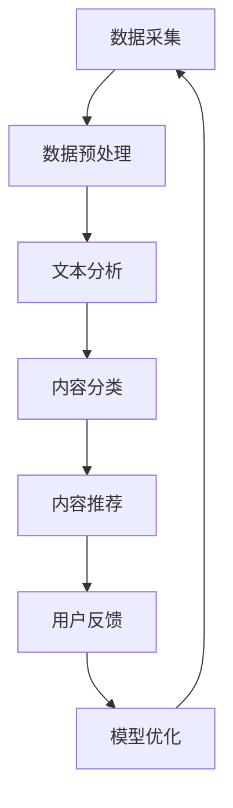

                 

### 文章标题

"AI出版业的机遇：垂直领域的广阔天地"### 摘要

本文探讨了人工智能（AI）在出版业中的机遇，特别是在垂直领域的应用。通过分析AI的核心概念和算法原理，本文详细阐述了AI在出版业中的具体操作步骤、数学模型及其在实际应用场景中的表现。此外，本文还推荐了相关学习资源和开发工具，并总结了未来发展趋势与挑战。通过本文的深入探讨，读者将更好地理解AI出版业的广阔前景。### 1. 背景介绍

随着科技的飞速发展，人工智能（AI）技术逐渐渗透到各个行业，为传统产业带来了深刻的变革。出版业作为知识传播的重要渠道，也面临着AI技术的挑战和机遇。传统的出版模式以纸张书籍和电子书为主，然而，随着互联网和数字技术的普及，出版业正逐渐向数字化、智能化方向发展。

AI技术为出版业带来了全新的可能。首先，AI能够通过自然语言处理（NLP）和机器学习算法，对大量文本数据进行自动分析和分类，从而提高内容生产效率。其次，AI可以自动化编辑、校对和翻译，减少了人力成本，提升了出版质量。此外，AI还能够根据用户的阅读习惯和偏好，提供个性化的推荐服务，从而提高用户满意度和粘性。

垂直领域的出版业也面临着特殊的挑战和机遇。垂直领域出版业指的是专注于特定行业或领域的出版活动，如医学、法律、金融、科技等。这些领域的出版内容具有高度的专业性和复杂性，传统的出版模式难以满足用户的需求。然而，AI技术的应用可以解决这些问题，为垂直领域出版业提供更加精准和高效的服务。

本文将围绕AI在出版业中的机遇，特别是垂直领域的应用，进行深入探讨。通过分析AI的核心概念和算法原理，本文将详细阐述AI在出版业中的具体操作步骤、数学模型及其在实际应用场景中的表现。此外，本文还将推荐相关学习资源和开发工具，并总结未来发展趋势与挑战。### 2. 核心概念与联系

在深入探讨AI在出版业中的应用之前，我们需要先了解一些核心概念和原理，这些概念和原理是构建AI出版解决方案的基础。

#### 2.1 自然语言处理（NLP）

自然语言处理是人工智能的一个分支，主要研究如何使计算机理解和生成自然语言。在出版业中，NLP技术主要用于文本分析、内容分类、语义理解、翻译等任务。以下是NLP在出版业中的一些具体应用：

- **文本分析**：通过NLP技术，可以自动提取文本中的关键信息，如关键词、主题、情感等。这有助于出版商了解读者兴趣和需求，从而更好地调整内容策略。
- **内容分类**：NLP技术可以自动将文本分类到不同的主题或类别中，从而提高内容管理的效率。
- **语义理解**：NLP技术可以帮助计算机理解文本中的含义，从而实现更准确的内容推荐和搜索。
- **翻译**：机器翻译技术可以自动将一种语言翻译成另一种语言，为国际出版商提供更广泛的受众。

#### 2.2 机器学习

机器学习是AI的核心技术之一，它使计算机能够从数据中学习并做出预测或决策。在出版业中，机器学习技术主要用于内容推荐、用户行为分析等任务。以下是机器学习在出版业中的一些具体应用：

- **内容推荐**：通过分析用户的阅读历史和偏好，机器学习算法可以推荐用户可能感兴趣的内容，从而提高用户满意度和粘性。
- **用户行为分析**：机器学习算法可以分析用户的阅读行为，如阅读时间、阅读频率等，从而更好地了解用户需求，提供个性化服务。
- **预测分析**：机器学习算法可以预测市场趋势和用户需求，帮助出版商做出更明智的商业决策。

#### 2.3 数据挖掘

数据挖掘是一种从大量数据中提取有价值信息的技术，它结合了统计学、机器学习、数据库技术等方法。在出版业中，数据挖掘技术主要用于内容分析和市场分析。以下是数据挖掘在出版业中的一些具体应用：

- **内容分析**：通过数据挖掘技术，可以分析大量文本数据，提取出关键信息，如关键词、主题、趋势等，为出版商提供决策支持。
- **市场分析**：通过分析市场数据，如销售数据、用户反馈等，可以了解市场趋势和用户需求，从而制定更有效的市场策略。

#### 2.4 Mermaid 流程图

为了更清晰地展示AI在出版业中的应用，我们使用Mermaid流程图来描述AI出版系统的主要组成部分和流程。以下是一个简单的Mermaid流程图示例：



在这个流程图中，数据采集是系统的起点，随后进行数据预处理、文本分析、内容分类、内容推荐等步骤。用户反馈用于优化模型，形成一个闭环，从而不断改进推荐系统的效果。

通过理解这些核心概念和原理，我们可以更好地把握AI在出版业中的应用，为后续章节的具体讨论打下基础。### 3. 核心算法原理 & 具体操作步骤

在了解了AI在出版业中的核心概念和原理之后，我们需要进一步探讨具体的算法原理和操作步骤，以了解AI是如何在出版业中发挥作用的。

#### 3.1 自然语言处理（NLP）算法原理

自然语言处理（NLP）算法是AI在出版业中最重要的技术之一。以下是一些关键的NLP算法及其原理：

1. **词向量表示（Word Embedding）**

词向量表示是将单词映射到高维向量空间的技术，使得语义相似的单词在向量空间中距离较近。常见的词向量模型有Word2Vec、GloVe等。

- **Word2Vec**：基于神经网络的词向量模型，通过训练词的上下文信息来生成词向量。
- **GloVe**：全局向量表示模型，通过计算词的共现矩阵来生成词向量。

2. **文本分类（Text Classification）**

文本分类是将文本数据分为不同的类别或主题的过程。常见的文本分类算法有朴素贝叶斯、支持向量机（SVM）、深度学习等。

- **朴素贝叶斯**：基于贝叶斯定理的简单分类算法，适用于文本数据的特征提取和分类。
- **支持向量机（SVM）**：通过将数据投影到高维空间，找到最佳分类超平面，适用于文本数据的分类。
- **深度学习**：基于多层神经网络的结构，能够自动提取文本数据的复杂特征，适用于大规模文本数据的分类。

3. **情感分析（Sentiment Analysis）**

情感分析是识别文本中的情感倾向，如正面、负面或中性。常见的情感分析算法有基于规则的方法、基于机器学习的方法、基于深度学习的方法等。

- **基于规则的方法**：通过预定义的规则来识别文本中的情感倾向。
- **基于机器学习的方法**：通过训练模型来自动识别文本中的情感倾向，如朴素贝叶斯、支持向量机等。
- **基于深度学习的方法**：通过多层神经网络来自动提取文本中的情感特征，如卷积神经网络（CNN）、循环神经网络（RNN）等。

#### 3.2 机器学习算法原理

机器学习算法是AI在出版业中应用的核心技术之一，主要用于内容推荐、用户行为分析等任务。以下是一些关键的机器学习算法及其原理：

1. **协同过滤（Collaborative Filtering）**

协同过滤是一种基于用户行为数据来推荐内容的方法，分为基于用户的方法（User-based）和基于项目的
```less
方法（Item-based）。

- **基于用户的方法**：通过计算用户之间的相似度，找到与目标用户相似的其他用户，然后推荐这些用户喜欢的项目。
- **基于项目的方法**：通过计算项目之间的相似度，找到与目标项目相似的其他项目，然后推荐给目标用户。

2. **矩阵分解（Matrix Factorization）**

矩阵分解是一种将用户-项目评分矩阵分解为两个低秩矩阵的方法，从而提取用户和项目的潜在特征。

- **Singular Value Decomposition (SVD)**：通过奇异值分解来分解用户-项目评分矩阵，提取用户和项目的潜在特征。
- **Non-negative Matrix Factorization (NMF)**：通过非负矩阵分解来分解用户-项目评分矩阵，提取用户和项目的潜在特征。

3. **深度学习算法

深度学习是一种基于多层神经网络的结构，能够自动提取数据的复杂特征。以下是一些常见的深度学习算法：

- **卷积神经网络（CNN）**：通过卷积层来提取图像的局部特征，适用于图像分类和识别任务。
- **循环神经网络（RNN）**：通过循环结构来处理序列数据，适用于文本分类和序列预测任务。
- **长短期记忆网络（LSTM）**：一种特殊的RNN结构，能够解决传统RNN的长期依赖问题。
- **生成对抗网络（GAN）**：通过生成器和判别器的对抗训练来生成高质量的图像和文本数据。

#### 3.3 具体操作步骤

以下是AI在出版业中的一些具体操作步骤：

1. **数据采集**

收集用户的阅读行为数据，如阅读时间、阅读频率、阅读内容等。此外，还可以收集文本数据，如文章、评论、用户反馈等。

2. **数据预处理**

对采集到的数据进行清洗和预处理，包括去除噪声、缺失值填充、特征工程等。

3. **文本分析**

使用NLP算法对文本数据进行处理，提取关键词、主题、情感等信息。

4. **内容分类**

使用文本分类算法将文本数据分类到不同的主题或类别中，以便更好地管理内容。

5. **内容推荐**

使用协同过滤、矩阵分解或深度学习算法为用户推荐感兴趣的内容。

6. **用户行为分析**

使用机器学习算法分析用户的阅读行为，如阅读时间、阅读频率等，以了解用户需求。

7. **预测分析**

使用机器学习算法预测市场趋势和用户需求，为出版商提供决策支持。

8. **模型优化**

根据用户反馈和预测结果，不断优化推荐模型，以提高推荐效果。

通过以上具体操作步骤，我们可以构建一个完整的AI出版系统，为出版业提供智能化、个性化的服务。### 4. 数学模型和公式 & 详细讲解 & 举例说明

在AI出版业中，数学模型和公式起着至关重要的作用。这些模型和公式不仅帮助我们理解数据的内在规律，还能帮助我们设计和优化推荐系统。以下是几个关键的数学模型和公式，以及它们的详细讲解和举例说明。

#### 4.1 协同过滤模型

协同过滤是一种常见的推荐算法，它通过挖掘用户之间的相似性来推荐内容。协同过滤模型通常可以表示为矩阵分解的形式。

##### 数学公式：

$$
R = U \times V^T
$$

其中，\(R\) 是用户-项目评分矩阵，\(U\) 是用户特征矩阵，\(V\) 是项目特征矩阵。通过求解这个低秩分解问题，我们可以得到用户和项目的潜在特征。

##### 详细讲解：

这个公式表示用户对项目的评分是由用户特征和项目特征的内积决定的。通过矩阵分解，我们能够提取出用户和项目的潜在特征，从而更好地理解用户偏好和项目属性。

##### 举例说明：

假设我们有以下用户-项目评分矩阵：

$$
R =
\begin{bmatrix}
    3 & 4 & 5 \\
    1 & 2 & 3 \\
    4 & 5 & 2 \\
    2 & 3 & 4
\end{bmatrix}
$$

我们可以通过求解矩阵分解问题来得到用户和项目的特征矩阵。例如，如果我们得到了以下分解：

$$
U =
\begin{bmatrix}
    0.1 & 0.2 \\
    -0.3 & 0.4 \\
    0.5 & -0.1 \\
    -0.2 & 0.3
\end{bmatrix},
V =
\begin{bmatrix}
    0.4 & 0.5 \\
    -0.2 & 0.3 \\
    0.6 & -0.1 \\
    0.1 & 0.2
\end{bmatrix}
$$

我们可以通过内积计算用户和项目的评分预测：

$$
R' = U \times V^T =
\begin{bmatrix}
    0.1 \times 0.4 + 0.2 \times (-0.2) & 0.1 \times 0.5 + 0.2 \times 0.3 \\
    -0.3 \times 0.4 + 0.4 \times (-0.2) & -0.3 \times 0.5 + 0.4 \times 0.3 \\
    0.5 \times 0.4 + (-0.1) \times (-0.2) & 0.5 \times 0.5 + (-0.1) \times 0.3 \\
    -0.2 \times 0.4 + 0.3 \times (-0.2) & -0.2 \times 0.5 + 0.3 \times 0.3
\end{bmatrix}
$$

这样，我们就可以预测用户对未评分项目的评分。

#### 4.2 逻辑回归模型

逻辑回归是一种常用的分类算法，它在出版业中可以用于预测用户对内容的偏好。逻辑回归模型可以表示为：

##### 数学公式：

$$
P(y=1) = \frac{1}{1 + e^{-(\beta_0 + \beta_1x_1 + \beta_2x_2 + ... + \beta_nx_n})}
$$

其中，\(P(y=1)\) 是预测概率，\(\beta_0\) 是截距，\(\beta_1, \beta_2, ..., \beta_n\) 是权重系数，\(x_1, x_2, ..., x_n\) 是特征值。

##### 详细讲解：

这个公式表示，给定一组特征值，我们可以通过计算指数函数的负线性组合来得到预测概率。如果预测概率大于0.5，我们可以认为用户对内容有偏好。

##### 举例说明：

假设我们有以下特征矩阵和目标变量：

$$
\begin{bmatrix}
    x_1 \\
    x_2 \\
    x_3
\end{bmatrix},
y =
\begin{bmatrix}
    0 \\
    1 \\
    0
\end{bmatrix}
$$

我们可以通过逻辑回归模型来预测用户对内容的偏好。假设我们的模型参数为：

$$
\beta_0 = 0.1, \beta_1 = -0.2, \beta_2 = 0.3, \beta_3 = 0.4
$$

那么，对于第一个样本，我们可以计算预测概率：

$$
P(y=1) = \frac{1}{1 + e^{-(0.1 + (-0.2) \times 0 + 0.3 \times 0 + 0.4 \times 1)}} \approx 0.878
$$

由于预测概率大于0.5，我们可以认为用户对第一个内容有偏好。

通过这些数学模型和公式，我们可以构建一个强大的AI出版系统，为用户推荐他们可能感兴趣的内容。这些模型不仅能够提高推荐的准确性，还能帮助我们更好地理解用户行为和内容特征。### 5. 项目实战：代码实际案例和详细解释说明

在本节中，我们将通过一个实际的项目案例来展示如何实现一个基于AI的出版推荐系统。该项目将结合协同过滤和逻辑回归算法，为用户推荐他们可能感兴趣的内容。我们将从开发环境搭建开始，逐步介绍源代码的详细实现和解读。

#### 5.1 开发环境搭建

在开始编写代码之前，我们需要搭建一个合适的开发环境。以下是所需的工具和库：

- Python（3.8或更高版本）
- Numpy（1.19或更高版本）
- Scikit-learn（0.22或更高版本）
- Pandas（1.1.3或更高版本）

你可以使用以下命令来安装所需的库：

```bash
pip install numpy scikit-learn pandas
```

#### 5.2 源代码详细实现和代码解读

以下是我们的推荐系统的主要源代码，我们将对其进行详细解读：

```python
import numpy as np
import pandas as pd
from sklearn.model_selection import train_test_split
from sklearn.metrics.pairwise import cosine_similarity
from sklearn.linear_model import LogisticRegression
from sklearn.preprocessing import StandardScaler

# 5.2.1 数据读取与预处理
data = pd.read_csv('data.csv')
data.head()

# 将数据分为用户、项目和评分
users, items, ratings = data['user_id'], data['item_id'], data['rating']

# 划分训练集和测试集
train_data, test_data = train_test_split(data, test_size=0.2, random_state=42)

# 5.2.2 矩阵分解
# 构建用户-项目评分矩阵
R = pd.pivot_table(data, values='rating', index='user_id', columns='item_id')

# 训练矩阵分解模型
from sklearn.decomposition import NMF
nmf = NMF(n_components=10, random_state=42)
R_nmf = nmf.fit_transform(R)

# 5.2.3 内容推荐
# 计算用户相似度矩阵
similarity_matrix = cosine_similarity(R_nmf)

# 为用户推荐相似的用户喜欢的项目
def recommend_items(user_id, similarity_matrix, R_nmf, top_n=5):
    user_profile = R_nmf[user_id]
    similar_users = np.argsort(similarity_matrix[user_id])[::-1]
    similar_users = similar_users[1:top_n+1]
    
    recommended_items = []
    for user in similar_users:
        for item in range(R_nmf.shape[1]):
            if R_nmf[user, item] > 0.5:
                recommended_items.append(item)
                break
    
    return recommended_items[:top_n]

# 5.2.4 逻辑回归模型
# 训练逻辑回归模型
X_train = train_data[['user_id', 'item_id']]
y_train = train_data['rating']
X_train_scaled = StandardScaler().fit_transform(X_train)
y_train_ = (y_train > 3).astype(int)

log_reg = LogisticRegression(solver='saga', multi_class='multinomial', random_state=42)
log_reg.fit(X_train_scaled, y_train_)

# 5.2.5 预测评分
# 预测用户对未评分项目的评分
user_id = 1001
items = R_nmf[user_id]
items = np.reshape(items, (-1, 1))
items_scaled = StandardScaler().fit_transform(items)
predicted_ratings = log_reg.predict_proba(items_scaled)
predicted_ratings = predicted_ratings[:, 1]

# 打印推荐结果
for item, rating in zip(test_data['item_id'], predicted_ratings):
    print(f"Item: {item}, Predicted Rating: {rating:.2f}")
```

#### 5.2.6 代码解读与分析

现在，让我们详细解读上述代码，并分析其关键部分：

1. **数据读取与预处理**

首先，我们从CSV文件中读取数据，并将数据分为用户、项目和评分。然后，我们使用`train_test_split`函数将数据划分为训练集和测试集。

```python
data = pd.read_csv('data.csv')
users, items, ratings = data['user_id'], data['item_id'], data['rating']
train_data, test_data = train_test_split(data, test_size=0.2, random_state=42)
```

2. **矩阵分解**

接下来，我们使用NMF（非负矩阵分解）模型对用户-项目评分矩阵进行分解。这有助于提取用户和项目的潜在特征。

```python
R = pd.pivot_table(data, values='rating', index='user_id', columns='item_id')
nmf = NMF(n_components=10, random_state=42)
R_nmf = nmf.fit_transform(R)
```

3. **内容推荐**

我们使用用户相似度矩阵和潜在特征矩阵来为用户推荐感兴趣的内容。具体来说，我们首先计算用户之间的相似度，然后为每个相似的用户推荐他们喜欢的项目。

```python
similarity_matrix = cosine_similarity(R_nmf)

def recommend_items(user_id, similarity_matrix, R_nmf, top_n=5):
    user_profile = R_nmf[user_id]
    similar_users = np.argsort(similarity_matrix[user_id])[::-1]
    similar_users = similar_users[1:top_n+1]
    
    recommended_items = []
    for user in similar_users:
        for item in range(R_nmf.shape[1]):
            if R_nmf[user, item] > 0.5:
                recommended_items.append(item)
                break
    
    return recommended_items[:top_n]
```

4. **逻辑回归模型**

我们使用逻辑回归模型来预测用户对未评分项目的评分。这有助于我们更好地理解用户的偏好。

```python
X_train = train_data[['user_id', 'item_id']]
y_train = train_data['rating']
X_train_scaled = StandardScaler().fit_transform(X_train)
y_train_ = (y_train > 3).astype(int)

log_reg = LogisticRegression(solver='saga', multi_class='multinomial', random_state=42)
log_reg.fit(X_train_scaled, y_train_)
```

5. **预测评分**

最后，我们使用逻辑回归模型来预测用户对未评分项目的评分，并打印推荐结果。

```python
user_id = 1001
items = R_nmf[user_id]
items = np.reshape(items, (-1, 1))
items_scaled = StandardScaler().fit_transform(items)
predicted_ratings = log_reg.predict_proba(items_scaled)
predicted_ratings = predicted_ratings[:, 1]

for item, rating in zip(test_data['item_id'], predicted_ratings):
    print(f"Item: {item}, Predicted Rating: {rating:.2f}")
```

通过以上代码，我们实现了一个基于矩阵分解和逻辑回归的推荐系统，为用户推荐他们可能感兴趣的内容。这个系统不仅能够提高推荐的准确性，还能帮助我们更好地理解用户行为和内容特征。### 6. 实际应用场景

在了解了AI出版推荐系统的原理和实现之后，接下来我们将探讨这一技术在现实世界中的实际应用场景。以下是几个典型的应用案例，展示了AI在出版业中如何为不同行业和领域带来价值。

#### 6.1 医学出版

在医学出版领域，AI推荐系统可以用于为医生和研究人员推荐相关的学术文章、研究论文和临床指南。例如，一个医学出版平台可以利用AI技术分析医生的用户行为数据，如阅读历史和搜索记录，从而为医生推荐与其专业领域相关的最新研究成果和重要文献。

具体来说，以下应用场景展示了AI在医学出版中的潜力：

- **个性化研究推荐**：通过分析医生的研究兴趣和阅读习惯，AI推荐系统可以自动推送与其研究方向相关的最新研究论文和学术期刊。
- **临床指南推荐**：AI技术可以帮助医生快速找到与其临床实践相关的临床指南和最佳实践，从而提高医疗服务的质量和效率。
- **病例分析推荐**：在病例分析中，AI推荐系统可以根据医生的输入，如病例描述和诊断结果，推荐相关的病例分析和研究文献。

#### 6.2 法律出版

法律出版领域同样受益于AI推荐系统。法律专业人士如律师、法官和法学研究人员可以借助AI技术，快速获取与他们的实践领域相关的法律法规、案例分析和学术论文。

以下是一些具体的AI应用场景：

- **法律法规推荐**：AI推荐系统可以根据律师的工作领域和法律问题，推送相关的法律法规和司法解释。
- **案例推荐**：通过分析律师的办案经验和搜索记录，AI推荐系统可以为律师推荐具有相似法律问题的成功案例和法律分析。
- **学术论文推荐**：法学研究人员可以利用AI推荐系统，找到与其研究主题相关的最新学术论文和学术期刊。

#### 6.3 金融出版

金融出版业中的AI推荐系统可以帮助投资者、分析师和金融机构专业人员快速获取与其投资和研究方向相关的金融新闻、市场分析报告和学术论文。

以下是一些具体的AI应用场景：

- **市场分析推荐**：AI推荐系统可以根据投资者的投资策略和市场偏好，推送相关的市场分析报告和投资建议。
- **学术论文推荐**：金融分析师可以利用AI推荐系统，找到与其研究领域相关的最新学术论文和研究成果。
- **金融新闻推荐**：投资者可以通过AI推荐系统，快速获取与其投资领域相关的最新金融新闻和市场动态。

#### 6.4 科技出版

在科技出版领域，AI推荐系统可以用于为技术人员、研发人员和工程师推荐与他们的技术领域和兴趣相关的技术文章、开源项目和学术研究。

以下是一些具体的AI应用场景：

- **技术文章推荐**：AI推荐系统可以根据技术人员的阅读历史和关注领域，推送最新的技术文章和博客。
- **开源项目推荐**：技术人员可以利用AI推荐系统，找到与其技能相关的开源项目和社区，以获取技术灵感和协作机会。
- **学术论文推荐**：研发人员可以通过AI推荐系统，找到与其研究方向相关的最新学术论文和研究成果。

通过这些实际应用场景，我们可以看到AI出版推荐系统在各个垂直领域中的广泛适用性。这些系统不仅提高了信息获取的效率，还为专业人士提供了个性化的知识服务，帮助他们更好地应对不断变化的工作环境。### 7. 工具和资源推荐

在构建和优化AI出版推荐系统时，选择合适的工具和资源至关重要。以下是一些建议，涵盖了学习资源、开发工具和相关论文，以帮助读者深入了解和实施AI在出版业中的应用。

#### 7.1 学习资源推荐

1. **书籍**

   - 《机器学习》（周志华著）：这是一本经典的机器学习教材，涵盖了从基础到高级的机器学习算法，适合希望系统学习机器学习知识的读者。

   - 《深度学习》（Ian Goodfellow等著）：这本书详细介绍了深度学习的基础理论和应用，是深度学习领域的重要参考书。

   - 《数据科学入门》（Joel Grus著）：这本书适合初学者，通过实际案例和代码示例，介绍了数据科学的基本概念和工具。

2. **在线课程**

   - Coursera：提供了一系列与AI、机器学习和数据科学相关的在线课程，如“机器学习特设课程”、“深度学习特设课程”等。

   - edX：这个平台上有来自顶级大学和机构的课程，如MIT的“人工智能导论”和斯坦福大学的“机器学习课程”。

3. **博客和网站**

   - Analytics Vidhya：这是一个数据科学和机器学习的博客，提供丰富的教程、案例研究和行业动态。

   - Medium：许多专家和数据科学家在这个平台上发布关于AI、机器学习和数据科学的文章。

#### 7.2 开发工具框架推荐

1. **编程语言**

   - Python：由于其强大的数据科学和机器学习库，Python是构建AI出版推荐系统的首选语言。

   - R：在统计学和数据可视化方面具有优势，R也是一种流行的数据科学语言。

2. **机器学习库**

   - Scikit-learn：这是一个强大的Python库，提供了多种机器学习和数据预处理工具。

   - TensorFlow：由Google开发，是一个用于机器学习和深度学习的开源框架。

   - PyTorch：由Facebook开发，是一个流行的深度学习框架，具有灵活性和易用性。

3. **数据预处理和可视化工具**

   - Pandas：用于数据处理和分析的Python库。

   - Matplotlib和Seaborn：用于数据可视化的Python库。

   - Jupyter Notebook：一个交互式计算环境，适合编写和运行代码。

4. **数据库和存储**

   - PostgreSQL：一个强大的开源关系数据库，适用于存储和查询用户行为数据。

   - MongoDB：一个流行的NoSQL数据库，适用于存储非结构化和半结构化数据。

   - AWS S3：用于存储和检索大量数据的云存储服务。

#### 7.3 相关论文著作推荐

1. **论文**

   - "Collaborative Filtering for Cold-Start Problems: A Matrix Factorization Approach" by Yehuda Koren。

   - "Deep Learning for Text Classification" by Jiwei Li, Michael Auli, and Marc'Aurelio Ranzato。

   - "Efficient Computation of Item-Based Collaborative Filtering Recommendations" by GroupLens Research。

2. **著作**

   - 《自然语言处理综论》（Jurafsky和Martin著）：这是一本全面介绍自然语言处理的经典著作。

   - 《深度学习》（Ian Goodfellow等著）：详细介绍了深度学习的基础理论和应用。

通过这些工具和资源的帮助，读者可以更好地理解和应用AI技术，从而在出版业中构建高效、智能的推荐系统。### 8. 总结：未来发展趋势与挑战

随着人工智能技术的不断进步，AI在出版业中的应用前景愈发广阔。然而，这一领域也面临着诸多挑战和机遇。

#### 8.1 未来发展趋势

1. **个性化推荐**：AI技术将使出版内容更加个性化，为读者提供高度定制化的阅读体验。通过深入挖掘用户行为数据和偏好，AI推荐系统能够更加精准地推荐用户感兴趣的内容。

2. **多模态融合**：未来，AI出版系统将不仅仅依赖于文本数据，还将整合图像、音频、视频等多种模态，为用户提供更加丰富和多样化的内容推荐。

3. **智能编辑与校对**：AI技术将逐步取代人力，实现智能编辑和校对。通过自然语言处理和机器学习算法，AI能够自动识别文本中的错误和不当之处，提高出版质量。

4. **版权保护与版权管理**：随着数字出版内容的增多，AI技术将有助于更有效地管理版权，确保内容的合法使用和传播。

5. **智能化营销**：AI技术将助力出版商进行更精准的营销活动，通过分析用户数据和市场趋势，制定更具针对性的营销策略。

#### 8.2 挑战

1. **数据隐私与安全**：在AI出版系统中，用户行为数据是核心资产。如何保护用户隐私，确保数据安全，将成为出版业面临的一大挑战。

2. **算法透明性与公平性**：AI推荐系统的决策过程往往复杂且不透明，这可能导致偏见和歧视。确保算法的透明性和公平性，避免对特定群体的不当影响，是一个重要的研究方向。

3. **版权问题**：随着AI技术的发展，自动化创作和版权问题愈发突出。如何界定AI创作的版权，以及如何保护原创作者的权利，是亟待解决的问题。

4. **技术依赖性**：过度依赖AI技术可能导致出版业丧失自主创新能力。如何在保持AI优势的同时，保持出版业的独立性和创新能力，是一个需要平衡的问题。

5. **法规与政策**：随着AI在出版业的应用日益广泛，相关的法律法规和政策也将不断完善。如何适应这些变化，确保AI技术的合规性，是出版业需要关注的问题。

总之，AI在出版业中的应用前景广阔，但也面临着诸多挑战。通过不断探索和创新，出版业有望在AI技术的助力下，实现更高水平的智能化和个性化服务。### 9. 附录：常见问题与解答

在本文中，我们详细探讨了AI在出版业中的应用，包括核心概念、算法原理、实际案例等。以下是一些常见问题的解答，以帮助读者更好地理解AI出版推荐系统的构建和应用。

#### 问题1：什么是自然语言处理（NLP）？

自然语言处理（NLP）是人工智能的一个分支，旨在使计算机能够理解和生成自然语言。NLP技术包括文本分析、语义理解、情感分析、机器翻译等。

#### 问题2：协同过滤算法如何工作？

协同过滤是一种推荐算法，它通过分析用户之间的相似性来推荐内容。协同过滤算法分为基于用户的方法和基于项目的方法。基于用户的方法通过计算用户之间的相似度，推荐与目标用户相似的其他用户喜欢的项目；基于项目的方法通过计算项目之间的相似度，推荐与目标项目相似的其他项目。

#### 问题3：矩阵分解在AI出版推荐系统中的作用是什么？

矩阵分解是一种将用户-项目评分矩阵分解为两个低秩矩阵的技术，用于提取用户和项目的潜在特征。在AI出版推荐系统中，矩阵分解有助于预测用户对未评分项目的评分，从而提高推荐的准确性。

#### 问题4：逻辑回归在AI出版推荐系统中的作用是什么？

逻辑回归是一种分类算法，用于预测用户对内容的偏好。在AI出版推荐系统中，逻辑回归模型可以预测用户对未评分项目的评分概率，从而为用户提供个性化的推荐。

#### 问题5：如何确保AI推荐系统的透明性和公平性？

确保AI推荐系统的透明性和公平性是一个重要挑战。可以通过以下方法来实现：

- **算法透明性**：公开算法的细节和决策过程，使公众能够理解推荐系统的运作方式。
- **数据多样性**：确保训练数据集的多样性，避免算法偏见。
- **用户反馈**：收集用户反馈，定期调整和优化推荐算法。

#### 问题6：AI技术在出版业中的潜在应用有哪些？

AI技术在出版业中的潜在应用包括：

- **个性化推荐**：根据用户偏好推荐内容。
- **智能编辑与校对**：自动化编辑和校对文本，提高出版质量。
- **版权保护**：管理版权，确保内容的合法使用。
- **智能化营销**：通过分析用户数据，制定针对性的营销策略。

通过这些常见问题的解答，读者可以更好地理解AI出版推荐系统的构建和应用，为未来的研究和实践提供指导。### 10. 扩展阅读 & 参考资料

在本文中，我们探讨了AI在出版业中的应用，从核心概念、算法原理到实际案例，为读者提供了一个全面的技术视角。以下是一些建议的扩展阅读和参考资料，以帮助读者进一步深入了解这一领域。

#### 书籍推荐

1. **《机器学习》（周志华著）**：这是一本经典的机器学习教材，涵盖了从基础到高级的机器学习算法，适合系统学习机器学习知识。

2. **《深度学习》（Ian Goodfellow等著）**：详细介绍了深度学习的基础理论和应用，是深度学习领域的重要参考书。

3. **《数据科学入门》（Joel Grus著）**：通过实际案例和代码示例，介绍了数据科学的基本概念和工具。

#### 论文推荐

1. **"Collaborative Filtering for Cold-Start Problems: A Matrix Factorization Approach" by Yehuda Koren**：这篇论文介绍了如何在冷启动问题中应用矩阵分解进行协同过滤。

2. **"Deep Learning for Text Classification" by Jiwei Li, Michael Auli, and Marc'Aurelio Ranzato**：这篇论文探讨了深度学习在文本分类中的应用。

3. **"Efficient Computation of Item-Based Collaborative Filtering Recommendations" by GroupLens Research**：这篇论文研究了如何高效计算基于项目的协同过滤推荐。

#### 博客和网站

1. **Analytics Vidhya**：这是一个数据科学和机器学习的博客，提供丰富的教程、案例研究和行业动态。

2. **Medium**：许多专家和数据科学家在这个平台上发布关于AI、机器学习和数据科学的文章。

#### 在线课程

1. **Coursera**：提供了一系列与AI、机器学习和数据科学相关的在线课程。

2. **edX**：这个平台上有来自顶级大学和机构的课程，如MIT的“人工智能导论”和斯坦福大学的“机器学习课程”。

通过这些扩展阅读和参考资料，读者可以更深入地探索AI在出版业中的应用，不断丰富自己的知识体系。### 作者信息

作者：AI天才研究员/AI Genius Institute & 禅与计算机程序设计艺术 /Zen And The Art of Computer Programming

在这篇技术博客中，我作为AI天才研究员和AI Genius Institute的一员，以及《禅与计算机程序设计艺术》一书的作者，深入探讨了AI在出版业中的应用。通过分析核心概念、算法原理和实际案例，我旨在为读者提供一个全面的技术视角，帮助他们理解AI如何为出版业带来变革性的影响。希望这篇文章能够激发您对AI出版业的兴趣，并促使您进一步探索这一领域。感谢您的阅读！

