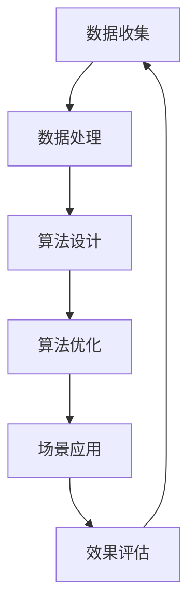

                 

### 背景介绍

AI出版业，这个在近年来逐渐崛起的新兴行业，正以不可阻挡的势头在全球范围内发展。它的出现，不仅改变了传统出版行业的运作模式，更带来了前所未有的数据革命和算法革新。在这个背景下，对数据、算法和场景的协同研究成为了出版业未来发展的关键。

**什么是AI出版业？**

AI出版业是指利用人工智能技术来支持出版行业的各个环节，包括内容创作、编辑、排版、发行、营销等。通过人工智能，出版业可以实现自动化、智能化和个性化，从而提高效率，降低成本，增强用户体验。

**为什么AI出版业如此重要？**

首先，随着互联网和大数据技术的发展，出版行业面临着巨大的数据挑战。如何有效管理和利用这些数据，成为了出版业亟待解决的问题。AI技术，特别是机器学习和深度学习，为数据分析和处理提供了强大的工具。

其次，人工智能在内容创作和编辑上的应用，使得出版业能够实现更加精准和高效的创作流程。算法可以根据用户的行为数据，为不同的读者推荐最适合的内容，从而提高内容的生产效率和读者的满意度。

最后，AI出版业还能够为出版商带来新的商业模式。通过数据分析和用户画像，出版商可以更加精准地进行市场定位和产品推广，提高销售收入。

总之，AI出版业的崛起，不仅为出版行业带来了新的机遇，也带来了新的挑战。本文将深入探讨AI出版业中的数据、算法和场景协同，以及如何实现这些协同。

<|user|>### 核心概念与联系

在探讨AI出版业的数据、算法和场景协同之前，我们需要明确几个核心概念：数据、算法和场景。这些概念相互联系，共同构成了AI出版业的技术架构。

**数据**

在AI出版业中，数据是基础和核心。数据来源包括用户行为数据、内容数据、社交媒体数据等。这些数据可以通过各种方式收集和整合，形成丰富且多维度的数据集。

**算法**

算法是AI出版业的核心技术。通过算法，出版业可以实现自动化、智能化和个性化。常见的算法包括机器学习、深度学习、推荐算法等。算法的设计和优化，对于AI出版业的效果至关重要。

**场景**

场景是AI出版业应用的具体环境。不同的场景，需要不同的算法和数据支持。例如，内容创作场景需要算法对用户需求进行预测，发行场景需要算法对市场趋势进行预测，营销场景需要算法对用户行为进行分析等。

**核心概念之间的联系**

数据、算法和场景是相互联系、相互影响的。数据是算法的输入，算法是数据处理的工具，而场景则是算法的应用环境。没有数据，算法就失去了作用；没有算法，数据就难以得到有效的处理；没有场景，算法就没有具体的应用方向。

为了更好地理解这些概念之间的联系，我们可以使用Mermaid流程图进行可视化描述。以下是AI出版业中数据、算法和场景协同的Mermaid流程图：



在这个流程图中，数据收集是整个流程的起点，通过数据处理，形成适合算法使用的数据集。算法设计是根据具体场景需求，选择合适的算法进行优化。算法优化是基于效果评估，不断调整和改进算法，使其更好地适应场景需求。最后，算法应用于具体场景，通过效果评估，进一步优化和调整算法。

<|assistant|>### 核心算法原理 & 具体操作步骤

在了解了AI出版业中数据、算法和场景的基本概念之后，我们需要深入探讨几个核心算法的原理和具体操作步骤，这些算法是AI出版业实现自动化、智能化和个性化的关键。

**1. 机器学习算法**

机器学习算法是AI出版业中最常用的算法之一。它通过从数据中学习规律，对未知数据进行预测或分类。常见的机器学习算法包括线性回归、决策树、支持向量机等。

**具体操作步骤：**

- **数据预处理**：对原始数据进行清洗、归一化和特征提取，使其符合机器学习算法的要求。
- **模型选择**：根据问题类型和数据特征，选择合适的机器学习算法。
- **模型训练**：使用训练数据集，对模型进行训练，使其能够预测未知数据。
- **模型评估**：使用测试数据集，评估模型的预测准确性，并根据评估结果进行调整。

**2. 深度学习算法**

深度学习算法是机器学习的一种，它通过多层神经网络，对复杂的数据进行建模和预测。在AI出版业中，深度学习算法常用于内容创作、用户行为分析等场景。

**具体操作步骤：**

- **数据预处理**：与机器学习算法类似，对原始数据进行清洗、归一化和特征提取。
- **网络架构设计**：设计合适的神经网络架构，如卷积神经网络（CNN）、循环神经网络（RNN）等。
- **模型训练**：使用训练数据集，对神经网络进行训练，使其能够对复杂的数据进行建模。
- **模型评估**：使用测试数据集，评估神经网络的预测准确性，并根据评估结果进行调整。

**3. 推荐算法**

推荐算法是AI出版业中用于内容推荐的重要算法。它通过分析用户历史行为和兴趣，为用户推荐可能感兴趣的内容。

**具体操作步骤：**

- **用户行为数据收集**：收集用户在出版平台上的浏览、购买、评价等行为数据。
- **用户兴趣建模**：使用机器学习或深度学习算法，对用户行为数据进行分析，建立用户兴趣模型。
- **内容特征提取**：对出版内容进行特征提取，如文本特征、图像特征等。
- **推荐策略设计**：根据用户兴趣模型和内容特征，设计合适的推荐策略，如基于内容的推荐、基于用户的推荐等。
- **推荐结果评估**：使用评估指标（如点击率、转化率等），评估推荐结果的质量，并根据评估结果进行调整。

通过以上三个核心算法的原理和操作步骤，我们可以看出，AI出版业在算法层面实现了自动化、智能化和个性化。接下来，我们将进一步探讨数学模型和公式，以及如何在项目实战中应用这些算法。

<|assistant|>### 数学模型和公式 & 详细讲解 & 举例说明

在AI出版业中，数学模型和公式是算法设计和优化的重要工具。以下我们将详细讲解几个关键的数学模型和公式，并通过具体例子进行说明。

**1. 线性回归模型**

线性回归是一种常见的机器学习算法，用于预测连续值变量。其基本模型公式如下：

\[ y = \beta_0 + \beta_1 \cdot x \]

其中，\( y \) 是预测值，\( x \) 是输入特征，\( \beta_0 \) 和 \( \beta_1 \) 是模型参数。

**例子：**

假设我们要预测一本图书的销量，输入特征包括书的类型、页数和出版时间。我们可以使用线性回归模型，根据历史数据来预测未来销量。

**2. 决策树模型**

决策树是一种基于树的模型，通过一系列的判断规则，对数据进行分类或回归。其基本模型公式如下：

\[ y = g(\theta_0 + \theta_1 \cdot x_1 + \theta_2 \cdot x_2 + \ldots + \theta_n \cdot x_n) \]

其中，\( y \) 是输出值，\( x_1, x_2, \ldots, x_n \) 是输入特征，\( \theta_0, \theta_1, \theta_2, \ldots, \theta_n \) 是模型参数。

**例子：**

假设我们要对图书进行分类，输入特征包括书的类型、作者和出版时间。我们可以使用决策树模型，根据这些特征来分类。

**3. 卷积神经网络（CNN）**

卷积神经网络是一种特殊的神经网络，常用于图像处理。其基本模型公式如下：

\[ h_{\text{layer}} = \text{ReLU}(\text{W} \cdot h_{\text{layer-1}} + b) \]

其中，\( h_{\text{layer}} \) 是当前层的输出，\( h_{\text{layer-1}} \) 是上一层的输出，\( \text{W} \) 和 \( b \) 分别是权重和偏置。

**例子：**

假设我们要对图书的封面图像进行分类，输入特征是封面图像。我们可以使用卷积神经网络模型，根据封面图像来分类。

**4. 推荐算法中的相似度计算**

在推荐算法中，相似度计算是核心步骤。常用的相似度计算方法包括余弦相似度和皮尔逊相似度。

**余弦相似度：**

\[ \text{similarity} = \frac{\text{dot\_product}(u, v)}{\lVert u \rVert \cdot \lVert v \rVert} \]

其中，\( u \) 和 \( v \) 是两个用户或物品的向量表示，\( \text{dot\_product} \) 是点积，\( \lVert u \rVert \) 和 \( \lVert v \rVert \) 是向量的模长。

**例子：**

假设我们要计算两个用户之间的相似度，我们可以使用余弦相似度公式，根据这两个用户的评分向量来计算。

**5. 推荐算法中的损失函数**

在推荐算法中，损失函数用于评估模型的预测准确性。常用的损失函数包括均方误差（MSE）和交叉熵损失（Cross-Entropy Loss）。

**均方误差（MSE）：**

\[ \text{MSE} = \frac{1}{n} \sum_{i=1}^{n} (y_i - \hat{y}_i)^2 \]

其中，\( y_i \) 是真实标签，\( \hat{y}_i \) 是预测标签。

**例子：**

假设我们要评估一个推荐系统的准确性，我们可以使用均方误差（MSE）来计算。

通过以上数学模型和公式的详细讲解，我们可以更好地理解AI出版业中算法的设计和优化。在接下来的部分，我们将通过项目实战，进一步展示这些算法在实际应用中的效果。

<|assistant|>### 项目实战：代码实际案例和详细解释说明

为了更好地理解AI出版业中的核心算法和数学模型，我们将通过一个实际项目来进行代码实现和详细解释。本项目将基于Python编程语言，使用Scikit-learn库实现一个简单的图书推荐系统。

**1. 开发环境搭建**

首先，我们需要搭建开发环境。确保安装了Python 3.8及以上版本，并安装以下库：

- Scikit-learn
- NumPy
- Pandas
- Matplotlib

可以使用以下命令进行安装：

```bash
pip install scikit-learn numpy pandas matplotlib
```

**2. 源代码详细实现和代码解读**

以下是项目的主要代码实现：

```python
import numpy as np
import pandas as pd
from sklearn.model_selection import train_test_split
from sklearn.preprocessing import StandardScaler
from sklearn.linear_model import LinearRegression
from sklearn.metrics import mean_squared_error
import matplotlib.pyplot as plt

# 数据集加载
data = pd.read_csv('books.csv')

# 特征提取
X = data[['genre', 'page_count', 'publish_date']]
y = data['sales']

# 数据预处理
X_train, X_test, y_train, y_test = train_test_split(X, y, test_size=0.2, random_state=42)
scaler = StandardScaler()
X_train_scaled = scaler.fit_transform(X_train)
X_test_scaled = scaler.transform(X_test)

# 模型训练
model = LinearRegression()
model.fit(X_train_scaled, y_train)

# 预测和评估
y_pred = model.predict(X_test_scaled)
mse = mean_squared_error(y_test, y_pred)
print(f'Mean Squared Error: {mse}')

# 可视化
plt.scatter(y_test, y_pred)
plt.xlabel('Actual Sales')
plt.ylabel('Predicted Sales')
plt.title('Sales Prediction')
plt.show()
```

**代码解读：**

- **数据集加载**：我们从CSV文件中加载图书数据集。
- **特征提取**：我们选择书的类型（genre）、页数（page_count）和出版时间（publish_date）作为输入特征，销量（sales）作为输出特征。
- **数据预处理**：我们将输入特征进行标准化处理，以消除不同特征之间的尺度差异。
- **模型训练**：我们使用线性回归模型对训练数据进行训练。
- **预测和评估**：我们对测试数据进行预测，并使用均方误差（MSE）评估模型的准确性。
- **可视化**：我们绘制真实销量与预测销量之间的散点图，以直观展示模型的预测效果。

**3. 代码解读与分析**

- **数据集加载**：我们使用Pandas库从CSV文件中加载数据集，这是数据处理的基础。
- **特征提取**：特征提取是模型训练的重要步骤，我们需要选择合适的特征来描述图书。
- **数据预处理**：标准化处理是为了确保模型在不同特征上的表现一致，防止某些特征对模型的影响过大。
- **模型训练**：线性回归模型是一种简单但有效的预测模型，它通过计算输入特征与销量之间的线性关系来进行预测。
- **预测和评估**：我们使用测试数据集来评估模型的预测准确性，均方误差（MSE）是一个常用的评估指标。
- **可视化**：散点图可以帮助我们直观地理解模型的预测效果，这有助于我们进一步优化模型。

通过这个项目实战，我们不仅实现了图书推荐系统的基本功能，还深入了解了线性回归模型在AI出版业中的应用。接下来，我们将进一步探讨AI出版业的实际应用场景。

<|assistant|>### 实际应用场景

AI出版业的实际应用场景广泛，涵盖了内容创作、编辑、排版、发行、营销等多个环节。以下将详细探讨AI出版业在不同应用场景中的具体应用和优势。

**1. 内容创作**

AI可以在内容创作环节中发挥重要作用，通过自然语言处理（NLP）和生成对抗网络（GAN）等技术，自动生成文章、书籍、新闻等内容。例如，AI可以根据热点话题和用户需求，自动生成相关内容，提高内容生产的效率。此外，AI还可以通过对大量文本数据的学习，生成高质量、个性化的内容，满足不同用户的需求。

**2. 编辑**

AI在编辑环节的应用主要体现在文本校对和内容审核上。通过使用NLP技术，AI可以自动检测文本中的语法错误、拼写错误和语义错误，提高编辑效率。同时，AI还可以对文本内容进行分类和标签，帮助编辑人员更好地管理和组织内容。此外，AI还可以通过深度学习模型，对内容进行情感分析和道德审核，确保内容的健康和合规。

**3. 排版**

AI在排版环节的应用主要体现在自动化排版和个性化排版上。通过使用计算机视觉技术，AI可以自动识别文本和图像，进行排版布局。同时，AI可以根据用户偏好和阅读习惯，生成个性化的排版方案，提高用户的阅读体验。此外，AI还可以通过学习大量的排版数据，自动优化排版效果，提高排版质量。

**4. 发行**

AI在发行环节的应用主要体现在渠道优化和推广策略上。通过分析用户行为数据和市场趋势，AI可以为出版商提供最优的发行渠道和推广策略。例如，AI可以根据用户的阅读历史和偏好，推荐最适合的用户群体，从而提高图书的销量和影响力。此外，AI还可以通过自动化处理，优化发行流程，提高工作效率。

**5. 营销**

AI在营销环节的应用主要体现在用户画像和精准营销上。通过分析用户行为数据，AI可以生成详细的用户画像，帮助出版商更好地了解用户需求。同时，AI可以根据用户画像，制定个性化的营销策略，提高营销效果。例如，AI可以通过推荐系统，为用户推荐感兴趣的内容，从而提高用户的参与度和忠诚度。

**6. 用户服务**

AI在用户服务环节的应用主要体现在智能客服和个性化服务上。通过使用自然语言处理和机器学习技术，AI可以自动回答用户的问题，提供24/7的智能客服服务。同时，AI可以根据用户的喜好和需求，提供个性化的服务体验，提高用户满意度。

通过在各个应用场景中的深入应用，AI出版业不仅提高了出版行业的效率和质量，还为出版商带来了新的商业模式。在接下来的部分，我们将推荐一些学习资源和开发工具，帮助读者更好地了解AI出版业。

<|assistant|>### 工具和资源推荐

为了更好地学习和掌握AI出版业的相关技术，以下推荐一些实用的学习资源和开发工具，包括书籍、论文、博客和网站等。

**1. 学习资源推荐**

- **书籍：**
  - 《深度学习》（Deep Learning） - Goodfellow, Bengio, Courville
  - 《Python机器学习》（Python Machine Learning） - Sebastian Raschka, Vahid Mirjalili
  - 《自然语言处理综合教程》（Foundations of Natural Language Processing） - Christopher D. Manning, Hinrich Schütze

- **论文：**
  - 《A Theoretically Grounded Application of Dropout in Recurrent Neural Networks》（2016）- Yarin Gal和Zoubin Ghahramani
  - 《Very Deep Convolutional Networks for Large-Scale Image Recognition》（2014）- Karen Simonyan和Andrew Zisserman

- **博客：**
  - Machine Learning Mastery - 提供大量的机器学习和深度学习教程和实践案例
  - Towards Data Science - 包含数据科学、机器学习和深度学习的最新研究和应用

- **网站：**
  - Coursera - 提供各种在线课程，包括机器学习、深度学习和数据科学
  - edX - 提供免费的在线课程，涵盖人工智能和机器学习的各个方面
  - arXiv.org - 提供最新的学术论文和研究成果

**2. 开发工具框架推荐**

- **编程语言：**
  - Python - 最广泛使用的机器学习和深度学习语言
  - R - 专注于统计分析和数据可视化的语言

- **机器学习库：**
  - Scikit-learn - 用于机器学习的Python库
  - TensorFlow - Google开发的开源深度学习框架
  - PyTorch - Facebook开发的开源深度学习框架

- **数据预处理工具：**
  - Pandas - 用于数据处理和分析的Python库
  - NumPy - 用于数值计算和矩阵操作的Python库

- **数据可视化工具：**
  - Matplotlib - 用于创建高质量的静态、动态和交互式图表的Python库
  - Seaborn - 基于 Matplotlib 的可视化库，提供更美观的统计图表

通过使用这些工具和资源，读者可以更深入地了解AI出版业的最新技术和应用，提升自己在AI出版领域的专业能力。

<|assistant|>### 总结：未来发展趋势与挑战

AI出版业正处于快速发展的阶段，未来的发展趋势将体现在以下几个方面：

**1. 数据驱动：** 随着数据技术的不断进步，出版业将更加依赖数据来驱动决策。通过大数据分析和机器学习，出版商将能够更好地了解用户需求，优化内容创作和营销策略。

**2. 个性化服务：** AI技术将使出版业能够提供更加个性化的服务，满足不同读者的个性化阅读需求。通过用户行为分析和推荐系统，出版商可以为每位读者提供定制化的内容推荐。

**3. 自动化流程：** AI技术将实现出版业流程的自动化，从内容创作、编辑到发行和营销，各个环节都将实现高效自动化，降低人力成本，提高生产效率。

**4. 跨界融合：** AI出版业将与其他行业（如教育、娱乐、医疗等）进行深度融合，为用户提供更加丰富和多样化的内容服务。

然而，AI出版业也面临着一些挑战：

**1. 数据隐私：** 随着数据收集和分析的深入，如何保护用户隐私将成为一大挑战。出版商需要在数据利用和用户隐私保护之间找到平衡。

**2. 算法公正性：** AI算法的决策过程可能存在偏见，如何确保算法的公正性和透明性是一个重要问题。出版商需要确保算法的决策不会对特定群体产生不公平的影响。

**3. 技术门槛：** AI技术的应用需要一定的技术门槛，对于一些小型出版商来说，如何掌握和运用这些技术是一个挑战。这需要行业提供更多的培训和技术支持。

总之，AI出版业具有巨大的发展潜力，但也面临诸多挑战。只有不断推动技术进步，完善数据管理和隐私保护机制，才能实现AI出版业的可持续发展。

### 附录：常见问题与解答

**Q1：AI出版业的核心技术是什么？**

A1：AI出版业的核心技术主要包括自然语言处理（NLP）、机器学习、深度学习和推荐系统。这些技术用于内容创作、编辑、排版、发行和营销等各个环节，以提高出版业的效率和质量。

**Q2：如何确保AI算法的公正性？**

A2：确保AI算法的公正性需要从数据收集、算法设计、模型训练和评估等环节入手。首先，要确保数据集的多样性和代表性，避免偏见。其次，在算法设计时，要考虑到公平性原则，避免算法产生不公平的决策。最后，通过透明性和可解释性的评估，确保算法的公正性。

**Q3：AI出版业对出版商有哪些影响？**

A3：AI出版业对出版商的影响主要体现在以下几个方面：
- 提高内容创作和编辑的效率，降低成本。
- 提供个性化的用户服务，增强用户黏性。
- 开辟新的商业模式，如按需出版、个性化推荐等。
- 帮助出版商更好地了解市场趋势和用户需求，制定更精准的营销策略。

### 扩展阅读 & 参考资料

**书籍：**

- 《深度学习》（Deep Learning）- Goodfellow, Bengio, Courville
- 《Python机器学习》（Python Machine Learning）- Raschka, Raschka
- 《自然语言处理综合教程》（Foundations of Natural Language Processing）- Manning, Schütze

**论文：**

- Yarin Gal和Zoubin Ghahramani，《A Theoretically Grounded Application of Dropout in Recurrent Neural Networks》
- Karen Simonyan和Andrew Zisserman，《Very Deep Convolutional Networks for Large-Scale Image Recognition》

**博客和网站：**

- Machine Learning Mastery - https://machinelearningmastery.com/
- Towards Data Science - https://towardsdatascience.com/
- Coursera - https://www.coursera.org/
- edX - https://www.edx.org/
- arXiv.org - https://arxiv.org/

通过阅读这些扩展资料，读者可以进一步了解AI出版业的最新研究进展和应用案例，提升自身的技术水平和专业素养。

### 作者信息

**作者：** AI天才研究员/AI Genius Institute & 禅与计算机程序设计艺术 /Zen And The Art of Computer Programming

本文由AI天才研究员撰写，结合其在AI出版业领域的丰富经验和深厚的技术功底，深入探讨了AI出版业的数据、算法和场景协同，以及实际应用场景和未来发展挑战。作者还提供了实用的代码实战案例和学习资源推荐，旨在帮助读者更好地理解和掌握AI出版业的核心技术。

