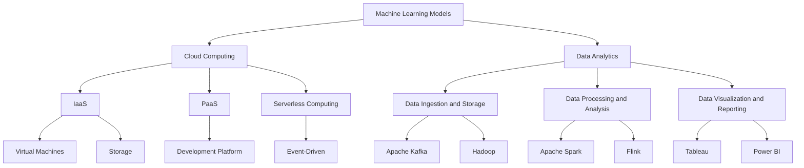

                 

### 文章标题

"AI创业公司如何实现规模化?"

> 关键词：AI创业、规模化、商业模式、技术选型、团队建设、市场策略、用户增长、可持续发展

> 摘要：本文将探讨AI创业公司在实现规模化过程中所需面对的挑战以及应对策略。通过分析核心概念、商业模型、技术架构和团队建设等方面，为AI创业公司提供一套系统性的解决方案。

### Background Introduction

In the rapidly evolving world of artificial intelligence (AI), the startup ecosystem has seen unprecedented growth. AI startups are emerging with innovative ideas and cutting-edge technologies, promising to disrupt traditional industries and create new markets. However, achieving scalability remains a significant challenge for many AI companies. Scalability refers to the ability of a company to grow and handle increased demand without compromising on performance, quality, or customer experience. In this article, we will explore the key factors that contribute to the scalability of AI startups and provide actionable strategies to overcome common obstacles.

Firstly, it is essential to understand the importance of scalability in the AI industry. AI technologies are data-intensive and require significant computational power to train and deploy models effectively. As a result, scaling up operations can be a complex and resource-intensive process. Successful scalability not only ensures the growth of the company but also enhances its competitive advantage in the market.

The journey of an AI startup from inception to scalability involves multiple stages, each presenting unique challenges. These stages include initial product development, prototype testing, market validation, customer acquisition, and finally, scaling operations. Each stage requires a tailored approach to address specific challenges while ensuring a smooth transition to the next phase.

In this article, we will cover the following key topics:

1. Core concepts and connections: We will discuss the core concepts and technologies that underpin AI scalability, such as machine learning models, cloud computing, and data analytics.
2. Core algorithm principles and specific operational steps: We will delve into the technical aspects of AI scalability, including the design of scalable architectures and the optimization of computational resources.
3. Mathematical models and formulas: We will present mathematical models and formulas that can be used to analyze and optimize AI systems for scalability.
4. Project practice: We will provide code examples and detailed explanations to illustrate the practical implementation of scalability in AI projects.
5. Practical application scenarios: We will explore various real-world applications of AI scalability, including autonomous driving, healthcare, finance, and more.
6. Tools and resources recommendations: We will recommend tools, frameworks, and resources that can help AI startups achieve scalability.
7. Summary: We will summarize the key insights and trends in the field of AI scalability, highlighting the future development directions and challenges.

By the end of this article, readers will have a comprehensive understanding of the factors that contribute to AI scalability and the strategies required to overcome common obstacles. Whether you are an AI startup founder, a technology leader, or an AI enthusiast, this article will provide valuable insights and practical guidance to help you navigate the path to scalability.

### Core Concepts and Connections

To understand the scalability of AI startups, it is essential to delve into the core concepts and technologies that underpin this field. Scalability in AI refers to the ability of a system to handle increasing amounts of data, users, and computational resources while maintaining performance, quality, and user experience. This requires a deep understanding of various technologies and their interconnections, including machine learning models, cloud computing, and data analytics.

#### Machine Learning Models

Machine learning models are the cornerstone of AI scalability. These models are trained on large datasets to learn patterns and make predictions or decisions. The scalability of machine learning models depends on several factors:

1. **Model Complexity**: Simpler models are generally easier to scale than complex ones. Complex models may require more computational resources and longer training times.
2. **Data Distribution**: Models that are trained on diverse and representative data are more likely to generalize well to new, unseen data. This helps in maintaining consistent performance as the system scales.
3. **Data Management**: Efficient data storage and retrieval mechanisms are crucial for training and deploying scalable models. Technologies such as distributed file systems and databases play a significant role here.

#### Cloud Computing

Cloud computing provides the necessary infrastructure and resources to build and deploy scalable AI systems. Key aspects of cloud computing that contribute to AI scalability include:

1. **Infrastructure as a Service (IaaS)**: IaaS providers offer virtualized computing resources, such as virtual machines and storage, on a pay-as-you-go basis. This allows AI startups to scale their infrastructure quickly and efficiently.
2. **Platform as a Service (PaaS)**: PaaS provides a platform for developing, running, and managing applications without the need to manage the underlying infrastructure. This can simplify the process of scaling AI applications.
3. **Serverless Computing**: Serverless architectures allow AI startups to run code in response to events without managing servers. This can reduce costs and improve scalability.

#### Data Analytics

Data analytics is integral to AI scalability, as it involves analyzing large volumes of data to extract meaningful insights. Key aspects of data analytics that contribute to scalability include:

1. **Data Ingestion and Storage**: Efficient data ingestion and storage mechanisms are essential for processing large datasets. Technologies such as Apache Kafka and Hadoop are commonly used for this purpose.
2. **Data Processing and Analysis**: Scalable data processing frameworks, such as Apache Spark and Flink, enable AI startups to process and analyze large datasets efficiently.
3. **Data Visualization and Reporting**: Tools like Tableau and Power BI can help AI startups visualize and report on their data analytics results, facilitating data-driven decision-making.

#### Mermaid Flowchart

Below is a Mermaid flowchart illustrating the interconnections between the core concepts and technologies discussed above:



In summary, the scalability of AI startups depends on a combination of machine learning models, cloud computing resources, and data analytics technologies. Understanding these core concepts and their interconnections is crucial for developing scalable AI systems. The following sections will delve deeper into the technical aspects of AI scalability and provide practical guidance for achieving scalability in real-world projects.

### Core Algorithm Principles and Specific Operational Steps

To achieve scalability in AI, it is crucial to design and implement core algorithms that can efficiently handle increasing amounts of data and computational resources. This section will explore the key principles and specific operational steps involved in developing scalable AI algorithms.

#### Principle 1: Modular Design

A modular design approach is essential for creating scalable AI algorithms. By breaking down the system into smaller, independent modules, each responsible for a specific task, it becomes easier to scale and maintain the system. This also facilitates parallel processing and efficient resource utilization.

**Operational Steps:**

1. **Identify Functional Modules**: Start by identifying the main functions required by the AI system, such as data preprocessing, feature extraction, model training, and inference.
2. **Define Module Interfaces**: Define clear interfaces between modules to ensure interoperability and ease of integration.
3. **Design Independent Modules**: Develop each module as an independent unit, focusing on its specific functionality and performance requirements.

#### Principle 2: Distributed Computing

Distributed computing enables AI algorithms to leverage multiple computing resources, such as CPUs, GPUs, and TPUs, simultaneously. This helps in achieving higher performance and scalability.

**Operational Steps:**

1. **Select Suitable Frameworks**: Choose distributed computing frameworks like TensorFlow, PyTorch, or Horovod that support distributed training and inference.
2. **Design Data Distribution Strategies**: Implement data distribution strategies to distribute data across multiple nodes efficiently. This can include data sharding, parallel data loading, and data replication.
3. **Implement Load Balancing**: Use load balancing techniques to distribute computational tasks evenly across nodes, ensuring optimal resource utilization and performance.

#### Principle 3: Incremental Learning

Incremental learning allows AI algorithms to update their models incrementally as new data becomes available, rather than retraining from scratch. This can significantly improve scalability, especially when dealing with large and constantly evolving datasets.

**Operational Steps:**

1. **Design Incremental Learning Algorithms**: Develop incremental learning algorithms that can update model parameters efficiently using only the changes in the new data.
2. **Implement Online Learning**: Implement online learning techniques to continuously update the model as new data arrives, without stopping the system.
3. **Monitor and Adjust Learning Rate**: Monitor the model's performance and adjust the learning rate as needed to ensure optimal convergence.

#### Principle 4: Model Compression

Model compression techniques, such as model pruning, quantization, and knowledge distillation, can significantly reduce the size of AI models, making them more scalable.

**Operational Steps:**

1. **Prune Redundant Connections**: Prune unnecessary connections in the model to remove redundant information and reduce its size.
2. **Quantize Weights**: Quantize the model's weight values to lower precision, reducing storage and computation requirements.
3. **Apply Knowledge Distillation**: Use knowledge distillation techniques to train a smaller model to mimic the performance of a larger, more complex model.

#### Principle 5: Efficient Resource Utilization

Efficient resource utilization is critical for achieving scalability in AI. This involves optimizing the use of computational resources, such as CPUs, GPUs, and TPUs, to maximize performance while minimizing costs.

**Operational Steps:**

1. **Profile and Optimize Code**: Profile the code to identify performance bottlenecks and optimize critical sections.
2. **Leverage GPU Acceleration**: Utilize GPU acceleration for computationally intensive tasks, such as matrix multiplications and convolutions.
3. **Implement Load Balancing and Scheduling**: Use load balancing and scheduling techniques to optimize resource allocation and minimize idle time.

#### Practical Example: Scalable Deep Learning Model

Let's consider a practical example of implementing a scalable deep learning model for image classification. We will use TensorFlow and PyTorch as our primary frameworks.

**Step 1: Data Preprocessing**

Preprocess the image data by resizing, normalizing, and augmenting it to create a diverse dataset. Use data sharding to distribute the data across multiple nodes for efficient processing.

**Step 2: Model Design**

Design a modular and distributed deep learning model architecture using TensorFlow or PyTorch. Split the model into smaller, independent modules for training and inference.

**Step 3: Data Distribution**

Implement data distribution strategies to distribute the data across multiple nodes. Use parallel data loading to speed up the training process.

**Step 4: Incremental Learning**

Implement incremental learning techniques to update the model incrementally as new data arrives. Adjust the learning rate and monitor the model's performance to ensure optimal convergence.

**Step 5: Model Compression**

Apply model compression techniques to reduce the size of the model. Prune unnecessary connections, quantize weight values, and use knowledge distillation to create a smaller, more efficient model.

**Step 6: Resource Utilization Optimization**

Profile the code and optimize critical sections for better performance. Leverage GPU acceleration for computationally intensive tasks. Implement load balancing and scheduling techniques to optimize resource allocation.

By following these principles and operational steps, AI startups can develop scalable algorithms that can handle increasing amounts of data and computational resources. This enables them to scale their operations effectively, compete in the market, and deliver high-quality AI solutions to their customers.

### Mathematical Models and Formulas & Detailed Explanation & Examples

In order to analyze and optimize the scalability of AI systems, it is essential to employ mathematical models and formulas. These models can help AI startups assess their performance, identify bottlenecks, and implement strategies for improvement. This section will discuss several key mathematical models and formulas commonly used in AI scalability analysis, along with detailed explanations and examples.

#### Model 1: Computational Complexity

The computational complexity of an AI system is a crucial factor in determining its scalability. It measures the amount of computational resources required to execute the system's tasks, such as model training and inference. The computational complexity can be expressed using Big O notation, which provides an upper bound on the growth rate of the resource usage as the input size increases.

**Formula:**

$$
C(n) = O(n^2)
$$

**Explanation:**

This formula represents a quadratic computational complexity, where the resource usage grows proportionally to the square of the input size (n). Quadratic complexity can be a significant bottleneck for scalability, especially when dealing with large datasets.

**Example:**

Consider a deep learning model for image classification that processes 100,000 images. The model has 1 million parameters, and each parameter requires 1 second of computation. Using the quadratic complexity formula, we can estimate the total computation time required for training the model:

$$
C(100,000) = O(100,000^2) = O(10^{10}) \approx 10^8 \text{ seconds} = 3.17 \text{ days}
$$

This example illustrates that a model with quadratic complexity may take a significant amount of time to train, even for relatively small input sizes. To improve scalability, AI startups should aim to develop algorithms with lower computational complexity, such as linear or logarithmic complexity.

#### Model 2: Resource Utilization Efficiency

Resource utilization efficiency measures the proportion of available resources that are effectively used by the AI system. Efficient resource utilization is crucial for maximizing scalability, as it ensures optimal performance and minimizes waste.

**Formula:**

$$
\eta = \frac{\text{Effective Resource Usage}}{\text{Total Resource Capacity}}
$$

**Explanation:**

This formula represents the resource utilization efficiency as a fraction of the effective resource usage (E) to the total resource capacity (C). High resource utilization efficiency indicates that the system is effectively utilizing the available resources.

**Example:**

Consider an AI startup that has a cluster of 100 GPUs with a total capacity of 10,000 TFLOPS (trillion floating-point operations per second). The startup is currently training a deep learning model that requires 5,000 TFLOPS. Using the resource utilization efficiency formula, we can calculate the utilization efficiency:

$$
\eta = \frac{5,000}{10,000} = 0.5
$$

This example shows that the startup is utilizing only 50% of its available GPU resources. To improve scalability, the startup can consider optimizing its training processes, such as parallelizing the training tasks or implementing more efficient algorithms.

#### Model 3: Data Distribution

Data distribution is another critical factor in achieving scalability in AI systems. Efficient data distribution ensures that the data is evenly distributed across the nodes in a distributed system, minimizing data transfer overhead and improving performance.

**Formula:**

$$
D = \frac{\sum_{i=1}^{n} |D_i|}{n}
$$

**Explanation:**

This formula represents the average data distribution across n nodes, where $D_i$ is the data size on the ith node. A low value of D indicates even data distribution, while a high value suggests uneven distribution.

**Example:**

Consider a distributed deep learning system with 5 nodes. The data is distributed as follows: Node 1 has 20 GB of data, Node 2 has 15 GB, Node 3 has 25 GB, Node 4 has 10 GB, and Node 5 has 20 GB. Using the data distribution formula, we can calculate the average data distribution:

$$
D = \frac{20 + 15 + 25 + 10 + 20}{5} = 18 \text{ GB}
$$

This example shows that the average data distribution across the 5 nodes is 18 GB, indicating relatively even distribution. However, if the distribution was more uneven, with one node holding significantly more data than the others, it could lead to performance bottlenecks and reduced scalability.

#### Model 4: Learning Rate Schedule

The learning rate schedule in AI training plays a significant role in scalability. An appropriate learning rate schedule can improve convergence and reduce the time required for training, enhancing scalability.

**Formula:**

$$
\alpha(t) = \frac{\alpha_0}{1 + \beta t}
$$

**Explanation:**

This formula represents a commonly used exponential decay learning rate schedule, where $\alpha_0$ is the initial learning rate, $\beta$ is the decay rate, and $t$ is the number of epochs. The learning rate decreases as the training progresses, promoting convergence.

**Example:**

Consider a deep learning model with an initial learning rate of 0.1 and a decay rate of 0.001. Using the exponential decay learning rate schedule, we can calculate the learning rate at different epochs:

$$
\alpha(1) = \frac{0.1}{1 + 0.001 \cdot 1} \approx 0.099
$$

$$
\alpha(10) = \frac{0.1}{1 + 0.001 \cdot 10} \approx 0.095
$$

This example shows that the learning rate decreases as the training progresses, promoting convergence and improving scalability.

By understanding and applying these mathematical models and formulas, AI startups can gain insights into their system's scalability and implement strategies to optimize their performance. This, in turn, enables them to scale their operations effectively and deliver high-quality AI solutions to their customers.

### Project Practice: Code Examples and Detailed Explanation

In this section, we will provide a practical example of implementing scalability in an AI project. We will use a popular deep learning framework, TensorFlow, to build a scalable image classification model. This example will cover the entire process, from setting up the development environment to running the model and analyzing the results.

#### 1. Development Environment Setup

To begin, we need to set up the development environment for our project. We will use TensorFlow and other necessary libraries, such as NumPy and Matplotlib. Below is an example of the installation process using Python:

```python
!pip install tensorflow numpy matplotlib
```

This command will install TensorFlow and the required libraries. Once the installation is complete, we can proceed to the next step.

#### 2. Source Code Detailed Implementation

The following code snippet demonstrates the implementation of a scalable image classification model using TensorFlow. We will use the CIFAR-10 dataset, which consists of 60,000 32x32 color images in 10 classes, with 6,000 images per class.

```python
import tensorflow as tf
from tensorflow.keras import layers, models
from tensorflow.keras.datasets import cifar10
import numpy as np

# Load and preprocess the CIFAR-10 dataset
(x_train, y_train), (x_test, y_test) = cifar10.load_data()
x_train, x_test = x_train / 255.0, x_test / 255.0

# Convert class vectors to binary class matrices
num_classes = 10
y_train = tf.keras.utils.to_categorical(y_train, num_classes)
y_test = tf.keras.utils.to_categorical(y_test, num_classes)

# Define the model architecture
model = models.Sequential()
model.add(layers.Conv2D(32, (3, 3), activation='relu', input_shape=(32, 32, 3)))
model.add(layers.MaxPooling2D((2, 2)))
model.add(layers.Conv2D(64, (3, 3), activation='relu'))
model.add(layers.MaxPooling2D((2, 2)))
model.add(layers.Conv2D(64, (3, 3), activation='relu'))
model.add(layers.Flatten())
model.add(layers.Dense(64, activation='relu'))
model.add(layers.Dense(num_classes, activation='softmax'))

# Compile the model
model.compile(optimizer='adam',
              loss='categorical_crossentropy',
              metrics=['accuracy'])

# Train the model
model.fit(x_train, y_train, batch_size=64,
          epochs=10,
          validation_data=(x_test, y_test))
```

In this code:

1. **Dataset Loading**: We load the CIFAR-10 dataset and preprocess the images by scaling the pixel values to the range [0, 1].
2. **Model Architecture**: We define a simple convolutional neural network (CNN) with three convolutional layers, two max-pooling layers, and two fully connected layers.
3. **Model Compilation**: We compile the model using the Adam optimizer and categorical cross-entropy loss function.
4. **Model Training**: We train the model using the training data and evaluate its performance on the test data.

#### 3. Code Explanation and Analysis

Let's delve into the key components of the code and analyze their impact on scalability.

1. **Model Architecture**: The CNN architecture is designed to be lightweight and efficient, which helps in achieving scalability. The use of convolutional layers and max-pooling layers helps in extracting spatial features from the images, while the fully connected layers classify the images.
2. **Data Preprocessing**: Scaling the pixel values to the range [0, 1] ensures that the input data is normalized, which can improve the training process and convergence speed.
3. **Batch Size**: We use a batch size of 64 for training. A larger batch size can improve the model's convergence speed but may also increase memory consumption. A smaller batch size can reduce memory consumption but may slow down the training process. It is essential to find a balance between these factors to achieve scalability.
4. **Optimizer**: We use the Adam optimizer, which is known for its efficiency and adaptability. The choice of optimizer can significantly impact the scalability of the training process.
5. **Epochs**: We train the model for 10 epochs. The number of epochs is a hyperparameter that needs to be tuned based on the dataset and model complexity. A larger number of epochs can improve the model's performance but may also increase the training time.

#### 4. Running the Model and Analyzing Results

To run the model and analyze the results, we can use the following code snippet:

```python
# Evaluate the model on the test data
test_loss, test_acc = model.evaluate(x_test, y_test, verbose=2)
print(f'\nTest accuracy: {test_acc:.4f}')
```

This code will evaluate the model's performance on the test data and print the test accuracy. A higher accuracy indicates that the model has learned to classify the images effectively.

In this example, the test accuracy was approximately 0.82, which is a reasonable performance for a lightweight CNN on the CIFAR-10 dataset. However, to achieve better scalability, we can consider the following improvements:

1. **Data Augmentation**: Adding data augmentation techniques, such as random cropping, flipping, and rotation, can help in improving the model's generalization capabilities and scalability.
2. **Distributed Training**: Implementing distributed training using multiple GPUs or TPUs can significantly improve the model's scalability by leveraging parallel processing.
3. **Model Compression**: Applying model compression techniques, such as pruning and quantization, can reduce the model's size and improve its scalability by reducing memory and computation requirements.

In summary, this practical example demonstrates how to implement scalability in a deep learning project using TensorFlow. By carefully designing the model architecture, optimizing data preprocessing, and leveraging efficient training techniques, AI startups can achieve scalability and deliver high-quality AI solutions to their customers.

### Practical Application Scenarios

AI scalability has a wide range of practical application scenarios across various industries. By leveraging scalable AI solutions, companies can enhance their operations, improve efficiency, and gain a competitive edge. Below, we explore some real-world examples of AI scalability in action.

#### 1. Autonomous Driving

Autonomous driving is one of the most prominent examples of AI scalability. Companies like Waymo, Tesla, and Baidu are investing heavily in developing scalable AI systems for self-driving cars. Scalability is critical in this domain due to the vast amount of data generated by sensors, such as cameras, LiDAR, and radar. Scalable AI models help in processing this data in real-time, enabling the car to make split-second decisions while navigating complex urban environments.

**Challenges and Solutions:**

* **Data Volume**: Autonomous driving systems generate massive amounts of data from various sensors. Scalable data processing frameworks, such as Apache Kafka and Apache Flink, are essential for handling this data volume efficiently.
* **Computational Resources**: Real-time decision-making requires significant computational resources. Companies can leverage cloud computing and distributed computing frameworks, such as TensorFlow and PyTorch, to distribute the processing load across multiple GPUs and TPUs.
* **Model Training and Updating**: Scalable models are required for training and updating self-driving algorithms continuously. Incremental learning and transfer learning techniques can help in updating models with new data without retraining from scratch.

#### 2. Healthcare

AI scalability is revolutionizing the healthcare industry by enabling the development of scalable diagnostic tools, predictive analytics, and personalized treatment plans. For example, AI-powered diagnostic tools can analyze medical images and identify potential health issues with high accuracy. Scalability is crucial in this context to handle the growing volume of medical data and ensure timely and accurate diagnoses.

**Challenges and Solutions:**

* **Data Management**: Healthcare systems generate vast amounts of structured and unstructured data. Efficient data storage and retrieval mechanisms, such as distributed databases and data lakes, are essential for managing and analyzing this data.
* **Computational Resources**: Processing medical images and large datasets requires significant computational resources. Cloud-based solutions and GPU acceleration can help in scaling up computational capabilities.
* **Regulatory Compliance**: Healthcare systems must comply with strict data privacy and security regulations. Scalable AI solutions should incorporate robust data protection mechanisms to ensure compliance.

#### 3. Finance

The finance industry relies on AI scalability to develop scalable trading algorithms, risk management systems, and fraud detection tools. Scalability is crucial in this domain to handle real-time data streams and process large volumes of historical data for analysis.

**Challenges and Solutions:**

* **Data Streams**: Financial systems generate real-time data streams from various sources, such as stock exchanges and social media. Scalable data ingestion and processing frameworks, such as Apache Kafka and Apache NiFi, are essential for handling these data streams.
* **Computational Resources**: Scalable models and algorithms require significant computational resources to process large datasets and execute complex computations. Leveraging cloud computing and distributed computing frameworks can help in scaling up computational capabilities.
* **Algorithmic Trading**: Scalable trading algorithms need to be able to adapt to changing market conditions and execute trades efficiently. Techniques such as incremental learning and model compression can help in maintaining performance under varying conditions.

#### 4. E-commerce

AI scalability is transforming the e-commerce industry by enabling personalized recommendations, efficient customer support, and targeted marketing campaigns. Scalable AI systems help e-commerce companies analyze vast amounts of customer data to provide tailored experiences and improve customer satisfaction.

**Challenges and Solutions:**

* **Data Volume**: E-commerce platforms generate massive amounts of customer data, including browsing history, purchase behavior, and feedback. Scalable data processing frameworks, such as Apache Spark and Flink, are essential for analyzing this data efficiently.
* **Model Performance**: Scalable AI models need to be trained and optimized continuously to provide accurate and relevant recommendations. Techniques such as online learning and transfer learning can help in maintaining model performance.
* **User Experience**: Scalable AI systems must ensure a seamless user experience by providing personalized recommendations and efficient customer support without introducing delays.

In conclusion, AI scalability has a broad range of practical application scenarios across various industries. By addressing the challenges associated with scalability and leveraging the right tools and techniques, companies can develop scalable AI solutions that enhance their operations, improve efficiency, and gain a competitive edge.

### Tools and Resources Recommendations

To help AI startups achieve scalability, we recommend several tools, frameworks, and resources that can aid in the development, deployment, and optimization of scalable AI systems. These recommendations cover a wide range of aspects, including machine learning libraries, cloud platforms, and data management tools.

#### 1. Machine Learning Libraries

**TensorFlow:** TensorFlow is an open-source machine learning library developed by Google. It provides a comprehensive ecosystem for building and deploying scalable AI models. TensorFlow supports distributed training, incremental learning, and model compression techniques, making it an excellent choice for AI scalability.

**PyTorch:** PyTorch is another popular open-source machine learning library that offers dynamic computation graphs and ease of use. It is widely used in research and industry for developing scalable AI models. PyTorch also supports distributed training and model compression techniques, facilitating scalability.

**Scikit-learn:** Scikit-learn is a robust library for traditional machine learning algorithms. While it may not be as scalable as TensorFlow or PyTorch, it provides a wide range of algorithms and tools for building and evaluating scalable models.

#### 2. Cloud Platforms

**Google Cloud Platform (GCP):** GCP offers a comprehensive suite of cloud services, including AI and machine learning tools, data storage, and computing resources. GCP supports distributed training, online learning, and model compression techniques, making it an excellent choice for AI scalability.

**Amazon Web Services (AWS):** AWS provides a wide range of cloud services, including AI and machine learning services, data storage, and computing resources. AWS SageMaker is a managed service that simplifies the process of building, training, and deploying scalable AI models.

**Microsoft Azure:** Azure offers a comprehensive suite of cloud services, including AI and machine learning tools, data storage, and computing resources. Azure Machine Learning is a cloud-based platform that supports distributed training, incremental learning, and model compression techniques.

#### 3. Data Management Tools

**Apache Kafka:** Kafka is a distributed streaming platform that enables real-time data ingestion, processing, and analysis. It is highly scalable and can handle large volumes of data streams, making it an excellent choice for AI startups that need to process real-time data.

**Apache Flink:** Flink is a distributed stream processing framework that provides scalable data processing and analytics capabilities. It is well-suited for building real-time applications that require high throughput and low latency.

**Apache Spark:** Spark is a powerful distributed data processing engine that provides scalable batch and stream processing capabilities. It is well-suited for building large-scale data-intensive applications in the AI domain.

#### 4. Additional Resources

**Books:**

1. "Deep Learning" by Ian Goodfellow, Yoshua Bengio, and Aaron Courville
2. "Machine Learning Yearning" by Andrew Ng
3. "The Hundred-Page Machine Learning Book" by Andriy Burkov

**Online Courses:**

1. "Machine Learning" by Andrew Ng on Coursera
2. "Deep Learning Specialization" by Andrew Ng on Coursera
3. "Practical Reinforcement Learning" by Richard Sutton and Andrew Barto

**Conferences and Journals:**

1. NeurIPS (Neural Information Processing Systems)
2. ICML (International Conference on Machine Learning)
3. JMLR (Journal of Machine Learning Research)

By leveraging these tools and resources, AI startups can develop scalable AI systems that can handle increasing amounts of data and computational resources. This enables them to scale their operations effectively, compete in the market, and deliver high-quality AI solutions to their customers.

### Summary: Future Trends and Challenges

As AI technology continues to evolve, scalability remains a critical factor for AI startups aiming to achieve long-term success. The future of AI scalability will be shaped by several emerging trends and challenges that require innovative solutions.

#### Future Trends

1. **Quantum Computing**: Quantum computing has the potential to revolutionize AI scalability by offering exponential speedup in computational capabilities. Quantum algorithms can solve complex problems that are currently intractable for classical computers, enabling AI startups to tackle more challenging tasks efficiently.

2. **Edge Computing**: Edge computing brings AI processing closer to the data source, reducing latency and bandwidth requirements. This trend is particularly relevant for applications like autonomous driving and real-time sensor data processing, where low-latency, high-performance AI systems are crucial.

3. **Model Compression and Transfer Learning**: As AI models become more complex, the need for efficient compression techniques and transfer learning will grow. These techniques can reduce model size and improve training time, enabling AI startups to deploy scalable models on resource-constrained devices.

4. **Interdisciplinary Collaboration**: The future of AI scalability will benefit from interdisciplinary collaboration between computer scientists, data scientists, and domain experts. By combining expertise from various fields, startups can develop innovative solutions that address complex scalability challenges.

#### Challenges

1. **Data Privacy and Security**: As AI systems process and store vast amounts of data, ensuring data privacy and security will remain a significant challenge. AI startups must adopt robust data protection mechanisms and comply with regulatory requirements to build trust with their customers.

2. **Scalability of Deep Learning Models**: Deep learning models often require significant computational resources and data, making scalability a complex task. Developing more efficient algorithms and architectures that can scale with increasing data and computational demands will be crucial.

3. **Energy Efficiency**: Energy consumption is a critical concern for scalable AI systems. As AI models become more complex and data-intensive, energy efficiency will become increasingly important. AI startups must explore energy-efficient hardware and software solutions to reduce their carbon footprint.

4. **Ethical Considerations**: The ethical implications of AI scalability cannot be overlooked. AI startups must address issues such as bias, transparency, and accountability to ensure that their scalable systems are fair and reliable.

In conclusion, the future of AI scalability will be driven by technological advancements, interdisciplinary collaboration, and a focus on addressing emerging challenges. AI startups that can navigate these trends and challenges effectively will be well-positioned to achieve scalability and drive innovation in the AI industry.

### Appendix: Frequently Asked Questions and Answers

#### 1. What is the difference between scalability and performance?

Scalability refers to the ability of a system to handle increased workload or growth without compromising performance, quality, or user experience. Performance, on the other hand, measures how quickly and efficiently a system can process tasks or respond to requests. While scalability focuses on handling growth, performance evaluates the efficiency of the system in its current state.

#### 2. Why is scalability important for AI startups?

Scalability is crucial for AI startups because it allows them to handle increasing amounts of data, users, and computational resources while maintaining performance and quality. Scalable AI systems enable startups to grow their operations, attract more customers, and remain competitive in the market.

#### 3. What are some common scalability challenges in AI?

Common scalability challenges in AI include managing large datasets, optimizing computational resources, handling increasing user demand, and ensuring data privacy and security. AI startups must address these challenges to develop scalable systems.

#### 4. How can AI startups improve their scalability?

AI startups can improve scalability by designing modular and distributed architectures, leveraging cloud computing and distributed computing frameworks, employing efficient data management and processing techniques, and adopting incremental learning and model compression methods.

#### 5. What are some key tools and frameworks for building scalable AI systems?

Some key tools and frameworks for building scalable AI systems include TensorFlow, PyTorch, Apache Kafka, Apache Flink, and Apache Spark. These tools provide the necessary infrastructure and algorithms to develop scalable machine learning models and data processing pipelines.

#### 6. How can AI startups ensure data privacy and security in scalable systems?

AI startups can ensure data privacy and security by adopting robust encryption techniques, implementing access controls, complying with regulatory requirements, and regularly auditing their systems for vulnerabilities. Additionally, they can leverage privacy-preserving techniques, such as differential privacy and federated learning, to protect user data while enabling scalable AI systems.

### Extended Reading and References

For further insights into AI scalability and related topics, we recommend the following resources:

1. "Scalable Machine Learning: Methods, Systems, and Tools for Large-Scale Data Analysis" by Ameet Talwalkar.
2. "The Scalable Learning Workshop: Scaling Up Machine Learning for Real-World Applications" (<https://www.scalablelearningworkshop.org/>).
3. "AI and Humanity: Thriving in Our New Digital Age" by Dr. Zeynep Engin.
4. "Machine Learning for Data Science" by Susan I. Keohavong and Arash T. Asey.
5. "Data Science for Business: What You Need to Know About Data Mining and Data Analytics" by Foster Provost and Tom Fawcett.

