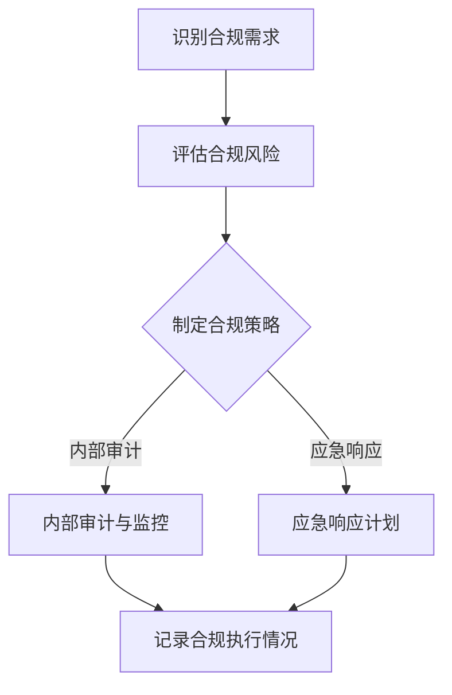

                 

### AI创业公司如何应对监管政策变化？### 

> **关键词：** AI创业，监管政策，合规性，风险管理，合规技术，监管适应，合规策略。

> **摘要：** 本文章旨在探讨AI创业公司在面对不断变化的监管政策时，如何制定有效的合规策略和应对措施。通过分析监管政策的演变、合规性的关键要素以及AI创业公司的现状，本文提出了几项实用的建议，帮助AI创业公司保持合规，实现可持续发展。

在当今全球化的科技环境中，人工智能（AI）作为一种变革性的技术，已经渗透到众多行业中。随着AI技术的快速发展和广泛应用，各国政府相继出台了针对AI的监管政策，以确保技术发展符合社会伦理和法律法规。这对AI创业公司来说既是机遇也是挑战。本文将深入探讨AI创业公司如何应对监管政策的变化，确保合规经营。

## 1. 背景介绍

近年来，随着AI技术的不断进步，监管政策也在不断演变。从数据隐私保护到算法透明度，再到AI伦理问题，各国政府纷纷出台相关政策，旨在引导AI技术的健康发展。例如，欧盟的《通用数据保护条例》（GDPR）强化了对个人数据的保护，而美国的《人工智能法案》则强调了AI技术的透明性和可解释性。这些政策的变化对AI创业公司提出了更高的合规要求。

AI创业公司通常规模较小，资金有限，技术团队年轻。这使得它们在应对监管政策变化时面临诸多挑战。首先，公司可能缺乏专业的合规团队来跟踪和理解复杂的政策法规。其次，由于资源限制，公司可能无法及时调整产品和服务以符合新的监管要求。最后，合规成本的增加可能会对公司的财务状况造成压力。

## 2. 核心概念与联系

在探讨AI创业公司如何应对监管政策变化之前，有必要了解以下几个核心概念：

### 2.1 合规性

合规性指的是企业遵守相关法律法规和政策的过程。在AI领域，合规性包括以下几个方面：

- **数据隐私与安全：** 严格遵守数据保护法规，如GDPR，确保用户数据的隐私和安全。
- **算法透明度与可解释性：** 提高算法的透明度，使决策过程可解释，增强用户信任。
- **伦理标准：** 遵循伦理准则，确保AI技术的应用不会对人类造成伤害。

### 2.2 风险管理

风险管理是识别、评估和应对潜在风险的过程。在AI创业公司中，风险管理包括：

- **合规风险评估：** 定期评估合规风险，制定应对策略。
- **内部审计与监控：** 通过内部审计和监控确保合规性的实施。
- **应急响应计划：** 针对可能的合规问题，制定应急响应计划。

### 2.3 合规技术

合规技术指的是利用技术手段提高合规性的工具和方法。例如：

- **区块链技术：** 用于记录数据交易，提高数据透明度和不可篡改性。
- **智能合约：** 自动执行合规性要求，减少人工干预。
- **机器学习模型：** 用于预测和识别合规风险。

### 2.4 监管适应

监管适应指的是企业根据监管政策变化调整自身运营策略的过程。监管适应包括：

- **政策跟踪与解读：** 及时跟踪和理解政策变化，制定相应的应对策略。
- **合规策略调整：** 根据政策变化调整合规策略，确保持续合规。

下面是一个简单的Mermaid流程图，展示了合规性的关键要素和流程：



## 3. 核心算法原理 & 具体操作步骤

### 3.1 合规风险评估算法

合规风险评估是AI创业公司应对监管政策变化的重要步骤。以下是一种基于机器学习的合规风险评估算法：

#### 3.1.1 数据预处理

- **数据收集：** 收集公司内部和外部的合规相关数据，如法律法规、行业报告、用户反馈等。
- **数据清洗：** 清除数据中的噪声和错误，确保数据质量。
- **特征提取：** 从数据中提取与合规相关的特征，如数据隐私、算法透明度、伦理问题等。

#### 3.1.2 模型训练

- **选择模型：** 选择合适的机器学习模型，如决策树、支持向量机（SVM）或深度学习模型。
- **训练数据：** 使用预处理后的数据训练模型，使其能够识别和预测合规风险。

#### 3.1.3 风险评估

- **风险预测：** 使用训练好的模型对公司的运营活动进行合规风险评估。
- **风险分类：** 根据风险程度将风险分为高、中、低三类。

#### 3.1.4 风险应对

- **制定策略：** 根据风险评估结果，制定相应的风险应对策略。
- **监控与调整：** 定期监控合规风险的演变，根据实际情况调整应对策略。

### 3.2 合规监控算法

合规监控是确保AI创业公司持续合规的重要手段。以下是一种基于区块链的合规监控算法：

#### 3.2.1 数据记录

- **事件记录：** 将公司的合规相关事件记录在区块链上，确保数据的透明性和不可篡改性。
- **时间戳：** 为每条记录添加时间戳，确保事件发生的时间可追溯。

#### 3.2.2 监控与报警

- **智能合约：** 使用智能合约自动执行合规监控规则，当检测到合规问题时，触发报警。
- **报警机制：** 设计报警机制，及时通知相关人员采取应对措施。

#### 3.2.3 日志分析

- **日志收集：** 收集公司的合规监控日志，用于分析和识别潜在的问题。
- **异常检测：** 使用机器学习算法分析日志数据，识别异常行为。

## 4. 数学模型和公式 & 详细讲解 & 举例说明

### 4.1 风险评估数学模型

风险评估通常涉及概率和统计学方法。以下是一种基于贝叶斯定理的风险评估数学模型：

$$
P(A|B) = \frac{P(B|A)P(A)}{P(B)}
$$

其中：

- \( P(A|B) \) 是在事件B发生的情况下，事件A发生的条件概率。
- \( P(B|A) \) 是在事件A发生的情况下，事件B发生的条件概率。
- \( P(A) \) 是事件A的先验概率。
- \( P(B) \) 是事件B的先验概率。

#### 4.1.1 应用举例

假设一家AI创业公司需要评估其产品在数据隐私方面的合规风险。已知：

- \( P(合规|隐私保护) = 0.95 \)（即，如果公司实现了隐私保护，那么产品合规的概率为0.95）。
- \( P(隐私保护) = 0.8 \)（即，公司实现隐私保护的概率为0.8）。
- \( P(合规) = 0.9 \)（即，公司产品合规的先验概率为0.9）。

我们可以使用贝叶斯定理计算在产品合规的情况下，公司实现了隐私保护的概率：

$$
P(隐私保护|合规) = \frac{P(合规|隐私保护)P(隐私保护)}{P(合规)} = \frac{0.95 \times 0.8}{0.9} \approx 0.867
$$

这意味着，如果产品合规，那么公司实现了隐私保护的概率约为0.867。

### 4.2 合规监控数学模型

合规监控通常涉及实时数据处理和异常检测。以下是一种基于统计过程控制的合规监控数学模型：

$$
X_t = \mu + \sigma \cdot Z_t
$$

其中：

- \( X_t \) 是第t个时间点的监控数据。
- \( \mu \) 是监控数据的均值。
- \( \sigma \) 是监控数据的标准差。
- \( Z_t \) 是标准正态分布的随机变量。

#### 4.2.1 应用举例

假设一家AI创业公司使用区块链技术监控其数据交易的透明度。已知：

- \( \mu = 100 \)（即，数据交易的透明度均值为100）。
- \( \sigma = 10 \)（即，数据交易的透明度标准差为10）。

我们可以使用上述模型计算在第100个时间点，数据交易透明度的期望值和标准差：

$$
X_{100} = 100 + 10 \cdot Z_{100}
$$

其中，\( Z_{100} \) 是第100个时间点的标准正态分布随机变量。

## 5. 项目实战：代码实际案例和详细解释说明

### 5.1 开发环境搭建

为了演示合规性评估和监控的代码实现，我们需要搭建一个简单的开发环境。以下是一个基于Python的示例环境：

#### 5.1.1 环境准备

- 安装Python 3.8及以上版本。
- 安装以下Python库：numpy，pandas，scikit-learn，tensorflow。

#### 5.1.2 创建项目目录

在终端中创建一个名为`compliance_project`的项目目录，并在其中创建一个名为`compliance`的子目录，用于存放代码文件。

### 5.2 源代码详细实现和代码解读

#### 5.2.1 合规风险评估

以下是一个简单的合规风险评估Python脚本：

```python
import numpy as np
import pandas as pd
from sklearn.model_selection import train_test_split
from sklearn.ensemble import RandomForestClassifier
from sklearn.metrics import accuracy_score

# 读取合规数据
data = pd.read_csv('compliance_data.csv')

# 特征提取
X = data[['data_privacy', 'algorithm_transparency', 'ethical_standards']]
y = data['compliance']

# 数据分割
X_train, X_test, y_train, y_test = train_test_split(X, y, test_size=0.2, random_state=42)

# 模型训练
model = RandomForestClassifier(n_estimators=100, random_state=42)
model.fit(X_train, y_train)

# 风险评估
predictions = model.predict(X_test)
accuracy = accuracy_score(y_test, predictions)
print(f'Accuracy: {accuracy:.2f}')
```

该脚本首先读取合规数据，提取特征并进行数据分割。然后使用随机森林分类器训练模型，并对测试数据进行风险评估。最后计算并输出模型的准确率。

#### 5.2.2 合规监控

以下是一个简单的合规监控Python脚本：

```python
import numpy as np
import pandas as pd
from sklearn.ensemble import IsolationForest

# 读取监控数据
data = pd.read_csv('compliance_monitoring_data.csv')

# 数据预处理
data['z_score'] = (data['data_transaction'] - data['mean']) / data['std']

# 异常检测
model = IsolationForest(n_estimators=100, contamination=0.01, random_state=42)
model.fit(data[['mean', 'std']])
outliers = model.predict(data[['mean', 'std']])
data['outlier'] = outliers == -1

# 输出异常日志
print(data[data['outlier']])
```

该脚本首先读取监控数据，计算数据的z分数，并使用隔离森林算法进行异常检测。最后输出异常日志。

### 5.3 代码解读与分析

#### 5.3.1 合规风险评估

合规风险评估脚本通过以下步骤实现：

1. **数据读取和预处理：** 使用pandas库读取合规数据，提取特征并进行数据分割。
2. **模型训练：** 使用scikit-learn库中的随机森林分类器训练模型。
3. **风险评估：** 使用训练好的模型对测试数据进行风险评估，计算并输出模型的准确率。

#### 5.3.2 合规监控

合规监控脚本通过以下步骤实现：

1. **数据读取和预处理：** 使用pandas库读取监控数据，计算数据的z分数。
2. **异常检测：** 使用scikit-learn库中的隔离森林算法进行异常检测，输出异常日志。

通过这两个脚本，AI创业公司可以实现对合规风险的评估和监控，从而确保公司运营的合规性。

## 6. 实际应用场景

### 6.1 金融行业

在金融行业，AI创业公司需要遵守反洗钱（AML）和客户身份识别（KYC）等相关法规。例如，一家提供智能投顾服务的公司需要确保其推荐算法符合法律法规，不得涉及非法交易。此外，公司还需要建立完善的用户身份认证和风险控制机制，以防止欺诈行为。

### 6.2 医疗行业

在医疗行业，AI创业公司需要遵守医疗数据隐私和保护法规。例如，一家开发医疗诊断算法的公司需要确保其算法不泄露患者隐私，且符合医疗数据保护法规。此外，公司还需要对算法进行伦理评估，确保其应用不会对病患造成负面影响。

### 6.3 驾驶员辅助系统

在自动驾驶领域，AI创业公司需要遵守交通安全法规。例如，一家开发自动驾驶汽车的公司需要确保其算法符合交通规则，并在紧急情况下能够安全停车。此外，公司还需要进行大量道路测试，确保算法的稳定性和安全性。

### 6.4 电子商务

在电子商务领域，AI创业公司需要遵守消费者权益保护法规。例如，一家提供个性化推荐服务的公司需要确保推荐算法不会误导消费者，且不涉及虚假宣传。此外，公司还需要建立完善的用户隐私保护机制，防止用户数据泄露。

## 7. 工具和资源推荐

### 7.1 学习资源推荐

- **书籍：**
  - 《人工智能伦理学》（Artificial Intelligence Ethics）- Patrick Lin
  - 《数据隐私：概念、技术和法规》（Data Privacy: Concepts, Techniques, and Regulations）- R. Comyn-Watt
- **论文：**
  - "The Ethics of Algorithms: Mapping the Debate" - D. Weitzner
  - "Towards a Science of Internet Law and Policy" - Y. Fouquet and N. Mayer-Schönberger
- **博客：**
  - [AI政策动态](https://www.ai-political.com/)
  - [数据隐私博客](https://www.dataprivacy.eu/)
- **网站：**
  - [欧盟数据保护条例](https://www.eugdpr.org/)
  - [美国人工智能法案](https://www.aiact.org/)

### 7.2 开发工具框架推荐

- **开发框架：**
  - TensorFlow：用于机器学习和深度学习。
  - PyTorch：另一个流行的机器学习和深度学习框架。
  - Scikit-learn：用于数据挖掘和数据分析。
- **合规工具：**
  - OpenMined：一个开源项目，旨在提高AI系统的透明度和可解释性。
  - EthicalML：一个用于AI伦理决策的开源工具。
- **区块链工具：**
  - Hyperledger Fabric：一个开源的分布式账本框架。
  - Ethereum：一个流行的区块链平台。

### 7.3 相关论文著作推荐

- **论文：**
  - "Ethical AI: Designing Responsible Artificial Intelligence Systems" - C. J. C. Burstein
  - "Data Privacy and AI: Challenges and Opportunities" - K. Zikopoulos and P. K. K. Shrivastava
- **著作：**
  - 《人工智能：一种现代方法》（Artificial Intelligence: A Modern Approach）- Stuart Russell and Peter Norvig
  - 《数据隐私：理论与实践》（Data Privacy: Theory, Methods, and Applications）- V. Shmatikov

## 8. 总结：未来发展趋势与挑战

随着AI技术的不断进步和监管政策的逐步完善，AI创业公司面临的合规挑战也在不断增加。未来，AI创业公司需要关注以下几个发展趋势和挑战：

### 8.1 监管政策趋严

各国政府将继续加强对AI技术的监管，出台更多法规政策，要求AI创业公司严格遵守。这将对公司的合规成本和运营模式产生重大影响。

### 8.2 伦理问题日益突出

AI技术的伦理问题日益受到关注，如算法歧视、隐私泄露等。AI创业公司需要加强对伦理问题的研究和应对，确保其技术应用的公正性和道德性。

### 8.3 技术创新与合规平衡

AI创业公司需要在技术创新和合规性之间寻找平衡。一方面，公司需要不断创新以满足市场需求；另一方面，公司需要确保其创新不违反相关法律法规。

### 8.4 跨境合规挑战

随着全球化的推进，AI创业公司需要面对跨国合规挑战。不同国家和地区的监管政策和标准可能存在差异，公司需要具备全球视野，确保其产品和服务符合各国法规。

### 8.5 技术监管适应性

AI创业公司需要具备快速适应技术监管变化的能力。这要求公司建立完善的合规团队和合规技术体系，确保公司能够及时调整运营策略，以应对监管政策的变化。

## 9. 附录：常见问题与解答

### 9.1 合规性与风险管理的关系是什么？

合规性是指企业遵守相关法律法规和政策的过程，而风险管理则是识别、评估和应对潜在风险的过程。合规性是风险管理的重要组成部分，通过遵守法律法规，企业可以降低合规风险，确保业务的稳健运行。

### 9.2 合规技术的核心功能是什么？

合规技术的核心功能包括提高数据透明度、确保算法可解释性、增强数据安全性等。通过合规技术，企业可以更好地遵守监管要求，提高合规性，增强用户信任。

### 9.3 如何应对跨境合规挑战？

应对跨境合规挑战，企业需要具备全球视野，了解不同国家和地区的监管政策和标准。企业可以通过建立国际合规团队、与当地法律顾问合作、参加国际行业会议等方式，确保其产品和服务符合各国法规。

## 10. 扩展阅读 & 参考资料

- **书籍：**
  - 《AI时代的伦理与责任》（Ethics and Responsibility in the AI Age）- K. D. Forbus
  - 《数据隐私与数据治理》（Data Privacy and Data Governance）- R. B. Thomas
- **论文：**
  - "AI Regulation: Challenges and Opportunities" - S. A. Alpaydin
  - "The Future of AI Governance" - M. R. Gazzaneo and R. F. Green
- **网站：**
  - [人工智能伦理学协会](https://www.aiethics.org/)
  - [全球数据隐私联盟](https://globaldataprivacyalliance.org/)
- **博客：**
  - [AI政策博客](https://aipolicyblog.com/)
  - [数据隐私与安全博客](https://dataprivatecurity.com/)
- **视频：**
  - "AI and the Law: A Conversation with Solon Barocas" - YouTube
  - "Data Privacy in the Age of AI: Challenges and Opportunities" - TED Talks

### 作者

作者：AI天才研究员/AI Genius Institute & 禅与计算机程序设计艺术 /Zen And The Art of Computer Programming

