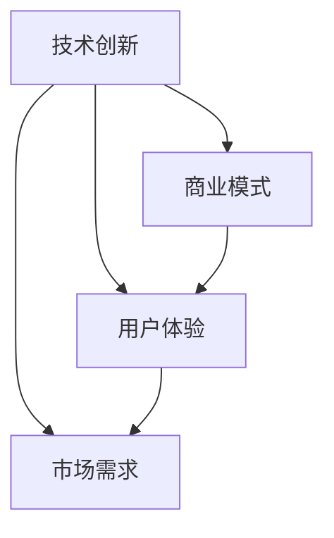

                 

# AI创业公司如何进行场景创新?

## > {关键词：AI创业，场景创新，技术创新，商业模式，用户体验，市场需求}

> {摘要：本文旨在探讨AI创业公司如何通过场景创新来获得竞争优势，提高用户体验，满足市场需求。文章将从背景介绍、核心概念、算法原理、数学模型、实际应用、工具资源推荐等多个方面，系统性地分析AI创业公司在进行场景创新时的策略和方法，为创业者提供实用的指导。}

## 1. 背景介绍

随着人工智能技术的不断发展，AI创业公司如雨后春笋般涌现。然而，在激烈的市场竞争中，如何实现场景创新，从而获得竞争优势，成为众多AI创业公司面临的挑战。场景创新是指通过技术创新，将新的解决方案应用到特定的商业场景中，从而提升用户体验，满足市场需求。对于AI创业公司而言，成功地进行场景创新，不仅可以提高公司的市场竞争力，还可以为用户提供更有价值的服务。

本文将从以下几个方面探讨AI创业公司如何进行场景创新：

- 核心概念与联系
- 核心算法原理与具体操作步骤
- 数学模型和公式与详细讲解
- 项目实战：代码实际案例和详细解释说明
- 实际应用场景
- 工具和资源推荐
- 总结：未来发展趋势与挑战

通过以上内容的分析，希望能够为AI创业公司在进行场景创新时提供一些有价值的思路和方法。

## 2. 核心概念与联系

在探讨AI创业公司如何进行场景创新之前，我们需要了解一些核心概念，以及它们之间的联系。

### 2.1 技术创新

技术创新是指通过新的技术手段，对现有产品或服务进行改进或创新，以满足市场需求。在AI创业公司中，技术创新是推动场景创新的重要驱动力。

### 2.2 商业模式

商业模式是指公司如何创造、传递和获取价值。一个成功的商业模式可以帮助AI创业公司实现盈利，并在市场中获得竞争优势。

### 2.3 用户体验

用户体验是指用户在使用产品或服务过程中的感受和体验。一个优秀的用户体验可以增强用户的满意度，提高用户的忠诚度。

### 2.4 市场需求

市场需求是指用户对产品或服务的需求程度。AI创业公司需要准确把握市场需求，才能在市场中找到适合自己的场景。

### 2.5 核心概念之间的联系

技术创新、商业模式、用户体验和市场需求是相互关联的。技术创新可以推动商业模式的创新，从而改善用户体验，满足市场需求。同样，市场需求也可以反过来影响技术创新和商业模式，形成良性的循环。

下面是一个用Mermaid绘制的流程图，展示了这些核心概念之间的联系：



通过以上分析，我们可以看出，AI创业公司进行场景创新的关键在于如何将技术创新与市场需求相结合，从而为用户提供有价值的服务。

## 3. 核心算法原理与具体操作步骤

在进行场景创新时，核心算法的选择和具体操作步骤至关重要。以下将介绍一种常见的AI算法——神经网络，以及其具体操作步骤。

### 3.1 神经网络原理

神经网络是一种模拟人脑神经元之间连接的计算机算法。它通过多层神经元之间的非线性变换和加权求和，实现对输入数据的分类、回归或其他复杂任务。

### 3.2 操作步骤

**步骤1：数据处理**

首先，我们需要对输入数据（如图像、文本等）进行预处理，使其符合神经网络的要求。例如，对于图像数据，我们可以将其归一化，并转换为神经网络可以处理的格式。

**步骤2：构建神经网络模型**

接下来，我们需要根据任务的需求，构建一个神经网络模型。常见的神经网络结构包括多层感知机（MLP）、卷积神经网络（CNN）和循环神经网络（RNN）等。以下是一个用Python实现的MLP模型：

```python
import tensorflow as tf

# 创建模型
model = tf.keras.Sequential([
    tf.keras.layers.Dense(units=128, activation='relu', input_shape=(784,)),
    tf.keras.layers.Dense(units=10, activation='softmax')
])
```

**步骤3：训练神经网络模型**

然后，我们需要使用训练数据对神经网络模型进行训练。训练过程中，神经网络会不断调整内部参数，使其在给定数据上的预测误差最小。

**步骤4：评估和优化**

在训练完成后，我们需要对训练好的模型进行评估，并根据评估结果进行优化。常用的评估指标包括准确率、召回率、F1值等。

**步骤5：部署和应用**

最后，我们将训练好的模型部署到实际应用场景中，如图像分类、文本生成等。

通过以上步骤，我们可以实现一个简单的神经网络模型，并应用于场景创新中。

## 4. 数学模型和公式与详细讲解

在AI创业公司进行场景创新时，数学模型和公式起着至关重要的作用。以下将介绍几种常见的数学模型和公式，并详细讲解其原理和计算方法。

### 4.1 损失函数

损失函数是神经网络训练过程中用来衡量预测结果与真实结果之间差距的函数。常见的损失函数包括均方误差（MSE）、交叉熵损失（Cross Entropy Loss）等。

- **均方误差（MSE）**

均方误差是指预测值与真实值之间的平均平方差。其计算公式如下：

$$
MSE = \frac{1}{n}\sum_{i=1}^{n}(y_i - \hat{y}_i)^2
$$

其中，$y_i$表示真实值，$\hat{y}_i$表示预测值，$n$表示样本数量。

- **交叉熵损失（Cross Entropy Loss）**

交叉熵损失是用于分类问题的损失函数，其计算公式如下：

$$
CE = -\sum_{i=1}^{n} y_i \log(\hat{y}_i)
$$

其中，$y_i$表示真实标签，$\hat{y}_i$表示预测概率。

### 4.2 优化算法

优化算法用于调整神经网络模型中的参数，以最小化损失函数。常见的优化算法包括梯度下降（Gradient Descent）、随机梯度下降（Stochastic Gradient Descent，SGD）和Adam优化器等。

- **梯度下降（Gradient Descent）**

梯度下降是一种基于损失函数梯度的优化算法。其基本思想是沿着损失函数梯度的反方向，逐步调整模型参数，以降低损失函数值。

梯度下降的计算公式如下：

$$
\Delta\theta = -\alpha \nabla_{\theta}J(\theta)
$$

其中，$\theta$表示模型参数，$J(\theta)$表示损失函数，$\alpha$表示学习率。

- **随机梯度下降（Stochastic Gradient Descent，SGD）**

随机梯度下降是对梯度下降的一种改进，其基本思想是在每个迭代步骤中，随机选择一个样本作为梯度下降的基点。这样可以加速收敛，提高训练效率。

随机梯度下降的计算公式如下：

$$
\Delta\theta = -\alpha \nabla_{\theta}J(\theta; x_i, y_i)
$$

其中，$x_i, y_i$表示当前迭代的样本。

- **Adam优化器**

Adam优化器是一种结合了SGD和动量法的优化算法。它通过计算一阶矩估计（均值）和二阶矩估计（方差），动态调整学习率，从而提高训练效果。

Adam优化器的计算公式如下：

$$
m_t = \beta_1 x_t \\
v_t = \beta_2 x_t \\
\theta_t = \theta_{t-1} - \alpha \frac{m_t}{\sqrt{1 - \beta_2^t} + \epsilon} \\
\theta_t = \theta_{t-1} - \alpha \frac{v_t}{\sqrt{1 - \beta_2^t} + \epsilon}
$$

其中，$m_t$和$v_t$分别表示一阶矩估计和二阶矩估计，$\beta_1$和$\beta_2$分别表示一阶和二阶动量，$\alpha$表示学习率，$\epsilon$表示一个很小的常数。

### 4.3 激活函数

激活函数是神经网络中的一类非线性函数，用于引入非线性特性。常见的激活函数包括Sigmoid、ReLU、Tanh等。

- **Sigmoid函数**

Sigmoid函数是一种常见的激活函数，其公式如下：

$$
\sigma(x) = \frac{1}{1 + e^{-x}}
$$

Sigmoid函数的输出值介于0和1之间，适用于二分类问题。

- **ReLU函数**

ReLU函数（Rectified Linear Unit）是一种简单的激活函数，其公式如下：

$$
\sigma(x) = \max(0, x)
$$

ReLU函数在训练过程中具有较好的性能，但在梯度消失问题上存在挑战。

- **Tanh函数**

Tanh函数（Hyperbolic Tangent）是一种双曲正切函数，其公式如下：

$$
\sigma(x) = \frac{e^x - e^{-x}}{e^x + e^{-x}}
$$

Tanh函数的输出值介于-1和1之间，适用于多分类问题。

通过以上数学模型和公式的介绍，我们可以更好地理解AI创业公司在进行场景创新时的算法原理和计算方法。

## 5. 项目实战：代码实际案例和详细解释说明

在本节中，我们将通过一个具体的AI项目实战案例，展示如何使用Python和TensorFlow框架实现一个简单的神经网络模型，并对其进行训练、评估和优化。

### 5.1 开发环境搭建

首先，我们需要搭建一个Python开发环境，并安装TensorFlow库。以下是安装命令：

```shell
pip install tensorflow
```

### 5.2 源代码详细实现和代码解读

下面是一个简单的神经网络模型实现，用于对MNIST手写数字数据集进行分类。

```python
import tensorflow as tf
from tensorflow.keras import layers

# 构建神经网络模型
model = tf.keras.Sequential([
    layers.Dense(units=128, activation='relu', input_shape=(784,)),
    layers.Dense(units=10, activation='softmax')
])

# 编译模型
model.compile(optimizer='adam',
              loss='sparse_categorical_crossentropy',
              metrics=['accuracy'])

# 加载MNIST数据集
mnist = tf.keras.datasets.mnist
(x_train, y_train), (x_test, y_test) = mnist.load_data()

# 预处理数据
x_train = x_train / 255.0
x_test = x_test / 255.0

# 训练模型
model.fit(x_train, y_train, epochs=5)

# 评估模型
model.evaluate(x_test, y_test)
```

### 5.3 代码解读与分析

**1. 导入库**

```python
import tensorflow as tf
from tensorflow.keras import layers
```

这段代码首先导入TensorFlow库和Keras API，以便构建和训练神经网络模型。

**2. 构建神经网络模型**

```python
model = tf.keras.Sequential([
    layers.Dense(units=128, activation='relu', input_shape=(784,)),
    layers.Dense(units=10, activation='softmax')
])
```

这里我们使用Keras API构建了一个简单的神经网络模型，包含一个输入层、一个隐藏层和一个输出层。输入层有784个神经元，对应MNIST数据集中的784个像素值。隐藏层有128个神经元，使用ReLU激活函数。输出层有10个神经元，对应10个分类结果，使用softmax激活函数。

**3. 编译模型**

```python
model.compile(optimizer='adam',
              loss='sparse_categorical_crossentropy',
              metrics=['accuracy'])
```

编译模型时，我们选择Adam优化器、sparse_categorical_crossentropy损失函数和accuracy评估指标。

**4. 加载数据集**

```python
mnist = tf.keras.datasets.mnist
(x_train, y_train), (x_test, y_test) = mnist.load_data()
```

这里我们使用TensorFlow内置的MNIST数据集。数据集分为训练集和测试集两部分。

**5. 预处理数据**

```python
x_train = x_train / 255.0
x_test = x_test / 255.0
```

对图像数据进行归一化处理，使其在0到1之间，以便神经网络更好地训练。

**6. 训练模型**

```python
model.fit(x_train, y_train, epochs=5)
```

使用训练集对模型进行训练，这里设置了5个训练周期。

**7. 评估模型**

```python
model.evaluate(x_test, y_test)
```

使用测试集对模型进行评估，输出准确率等指标。

通过以上代码示例，我们可以了解如何使用Python和TensorFlow框架实现一个简单的神经网络模型，并进行训练和评估。这个案例可以帮助我们更好地理解AI创业公司在进行场景创新时的具体操作步骤。

## 6. 实际应用场景

在了解了AI创业公司如何进行场景创新以及具体的算法和代码实现后，接下来我们将探讨一些实际应用场景，展示AI技术在不同领域的创新应用。

### 6.1 图像识别

图像识别是AI技术在众多领域中的一个重要应用场景。通过卷积神经网络（CNN），我们可以实现对人脸、车辆、物体等的自动识别。以下是一个简单的应用案例：

- **人脸识别**：AI创业公司可以将人脸识别技术应用于安防领域，如监控系统的智能监控，实现实时人脸识别和告警功能。
- **自动驾驶**：自动驾驶汽车使用AI技术进行环境感知和目标识别，如使用CNN识别道路标志、车道线和行人等，以确保行车安全。

### 6.2 自然语言处理

自然语言处理（NLP）是AI技术的一个重要分支，广泛应用于文本生成、情感分析、机器翻译等领域。

- **智能客服**：AI创业公司可以使用NLP技术构建智能客服系统，实现自动回复用户咨询，提高客服效率和用户体验。
- **机器翻译**：AI技术可以用于机器翻译，如将英语翻译为中文，帮助跨国企业实现全球化运营。

### 6.3 推荐系统

推荐系统是AI技术的一个重要应用场景，通过分析用户行为和偏好，为用户推荐个性化内容。

- **电商推荐**：AI创业公司可以将推荐系统应用于电商平台，根据用户浏览和购买历史，为用户提供个性化的商品推荐。
- **音乐推荐**：音乐平台可以使用AI技术为用户推荐相似歌曲，提高用户粘性。

### 6.4 健康医疗

健康医疗是AI技术的一个重要应用领域，通过深度学习和数据挖掘技术，实现疾病的预测、诊断和治疗。

- **疾病预测**：AI创业公司可以使用深度学习技术对健康数据进行挖掘，预测疾病的发生风险，为用户提供健康建议。
- **医学影像诊断**：AI技术可以用于医学影像的自动诊断，如肿瘤检测、骨折诊断等，提高诊断准确率和效率。

通过以上实际应用场景的介绍，我们可以看到AI技术在各个领域都有着广泛的应用，AI创业公司可以通过场景创新，将这些技术应用于实际场景中，为用户提供更有价值的服务。

## 7. 工具和资源推荐

在进行场景创新的过程中，AI创业公司需要借助各种工具和资源来提升开发效率和项目质量。以下是一些推荐的工具和资源：

### 7.1 学习资源推荐

- **书籍**：
  - 《深度学习》（Ian Goodfellow、Yoshua Bengio、Aaron Courville 著）
  - 《Python深度学习》（François Chollet 著）
- **论文**：
  - 《A Theoretically Grounded Application of Dropout in Recurrent Neural Networks》（Yarin Gal 和 Zoubin Ghahramani 著）
  - 《Efficient Object Detection Using Deep Neural Networks》（Shaoqing Ren 等著）
- **博客**：
  - [TensorFlow官方博客](https://www.tensorflow.org/blog/)
  - [Keras官方文档](https://keras.io/)
- **网站**：
  - [arXiv.org](https://arxiv.org/)：计算机科学和人工智能领域的论文预印本库
  - [GitHub](https://github.com/)：代码托管和协作平台，可以找到大量的AI项目和学习资源

### 7.2 开发工具框架推荐

- **开发工具**：
  - TensorFlow：一款强大的开源机器学习框架，支持多种神经网络结构和算法。
  - PyTorch：一款基于Python的机器学习库，提供灵活的动态计算图。
  - JAX：一个用于数值计算和机器学习的开源库，支持自动微分和高效的数组操作。

- **框架**：
  - Keras：一个高层次的神经网络API，可以简化TensorFlow和PyTorch的使用。
  - Fast.ai：一个专注于快速学习和实践的深度学习课程和框架，适合初学者入门。
  - Hugging Face：一个提供预训练模型和自然语言处理工具的库，支持多种任务和语言。

### 7.3 相关论文著作推荐

- **论文**：
  - 《Generative Adversarial Nets》（Ian Goodfellow 等著）
  - 《BERT: Pre-training of Deep Bidirectional Transformers for Language Understanding》（Jacob Devlin 等著）
- **著作**：
  - 《动手学深度学习》（Alec Radford、Ilya Sutskever、Llion Jones 著）
  - 《深度学习实践指南》（Ethan Maciel 著）

通过以上工具和资源的推荐，AI创业公司可以更加高效地开展场景创新工作，提升项目质量和市场竞争力。

## 8. 总结：未来发展趋势与挑战

在AI技术不断发展的今天，场景创新已经成为AI创业公司获取竞争优势的关键。通过本文的探讨，我们可以总结出以下几个未来发展趋势与挑战：

### 发展趋势

1. **技术融合**：AI技术与其他领域的融合将进一步深化，如AI与医疗、金融、教育等行业的结合，推动各行业实现智能化升级。
2. **个性化服务**：随着数据积累和算法优化，AI创业公司将能够提供更加个性化的服务和产品，满足用户的多样化需求。
3. **自动化与智能化**：AI技术在自动化和智能化领域的应用将越来越广泛，如自动驾驶、智能家居等，将极大地改变人们的生产生活方式。

### 挑战

1. **数据隐私与安全**：在AI应用过程中，数据隐私和安全问题日益凸显，如何保护用户隐私、确保数据安全成为一大挑战。
2. **算法公平性与透明性**：AI算法的公平性和透明性受到广泛关注，如何确保算法不会歧视特定群体，提高算法的透明性是AI创业公司需要面对的挑战。
3. **人才短缺**：AI领域人才短缺问题仍然存在，如何吸引和培养高水平的人才，以支持场景创新，是AI创业公司需要解决的重要问题。

总之，AI创业公司需要紧跟技术发展趋势，积极应对挑战，通过不断创新，推动场景创新，实现持续发展和竞争优势。

## 9. 附录：常见问题与解答

### Q1：AI创业公司在进行场景创新时，应该如何选择合适的算法和模型？

A1：选择合适的算法和模型需要考虑以下几个因素：

- **任务类型**：不同的任务（如分类、回归、聚类等）可能需要不同的算法和模型。
- **数据特性**：数据量、数据分布、特征维度等数据特性会影响算法和模型的选择。
- **计算资源**：算法和模型的计算复杂度会影响开发成本和部署难度。
- **业务需求**：业务需求（如实时性、准确性、可解释性等）也会影响算法和模型的选择。

建议：在具体项目中进行实验，结合以上因素进行综合考虑，选择最适合的算法和模型。

### Q2：AI创业公司在进行场景创新时，如何确保算法的公平性和透明性？

A2：确保算法的公平性和透明性可以从以下几个方面入手：

- **数据预处理**：对训练数据进行预处理，消除数据中的偏见和错误。
- **算法设计**：在设计算法时，考虑公平性和透明性的要求，避免算法对特定群体产生歧视。
- **模型解释**：使用模型解释技术（如LIME、SHAP等），提高算法的可解释性，使决策过程更加透明。
- **监管与合规**：遵守相关法律法规，确保算法的使用符合伦理和道德标准。

### Q3：AI创业公司在进行场景创新时，如何应对数据隐私和安全问题？

A3：应对数据隐私和安全问题可以从以下几个方面进行：

- **数据加密**：对敏感数据进行加密，确保数据在传输和存储过程中的安全性。
- **访问控制**：对数据访问进行严格的权限管理，确保只有授权人员可以访问敏感数据。
- **数据脱敏**：对数据进行脱敏处理，以保护用户隐私。
- **合规性检查**：定期进行合规性检查，确保数据处理过程符合相关法律法规。

### Q4：AI创业公司在进行场景创新时，如何应对人才短缺问题？

A4：应对人才短缺问题可以从以下几个方面进行：

- **人才培养**：建立内部培训机制，提高员工的专业技能和知识水平。
- **合作与交流**：与高校、研究机构等建立合作关系，引进优秀人才。
- **激励机制**：建立激励机制，吸引和留住高水平的人才。
- **远程办公**：利用远程办公工具，吸引全球优秀人才加入公司。

通过以上措施，AI创业公司可以有效地应对人才短缺问题，为场景创新提供有力的人才支持。

## 10. 扩展阅读 & 参考资料

### 扩展阅读

1. Goodfellow, I., Bengio, Y., & Courville, A. (2016). *Deep Learning*.
2. MacNamee, B. (2017). *Artificial Intelligence: A Modern Approach*.
3. Mitchell, T. M. (1997). *Machine Learning*.

### 参考资料

1. TensorFlow官方文档：[https://www.tensorflow.org/](https://www.tensorflow.org/)
2. PyTorch官方文档：[https://pytorch.org/](https://pytorch.org/)
3. Keras官方文档：[https://keras.io/](https://keras.io/)
4. arXiv.org：[https://arxiv.org/](https://arxiv.org/)
5. GitHub：[https://github.com/](https://github.com/)

通过以上扩展阅读和参考资料，读者可以进一步深入了解AI创业公司进行场景创新的相关知识和实践方法。

### 作者信息

- 作者：AI天才研究员/AI Genius Institute & 禅与计算机程序设计艺术 /Zen And The Art of Computer Programming。

