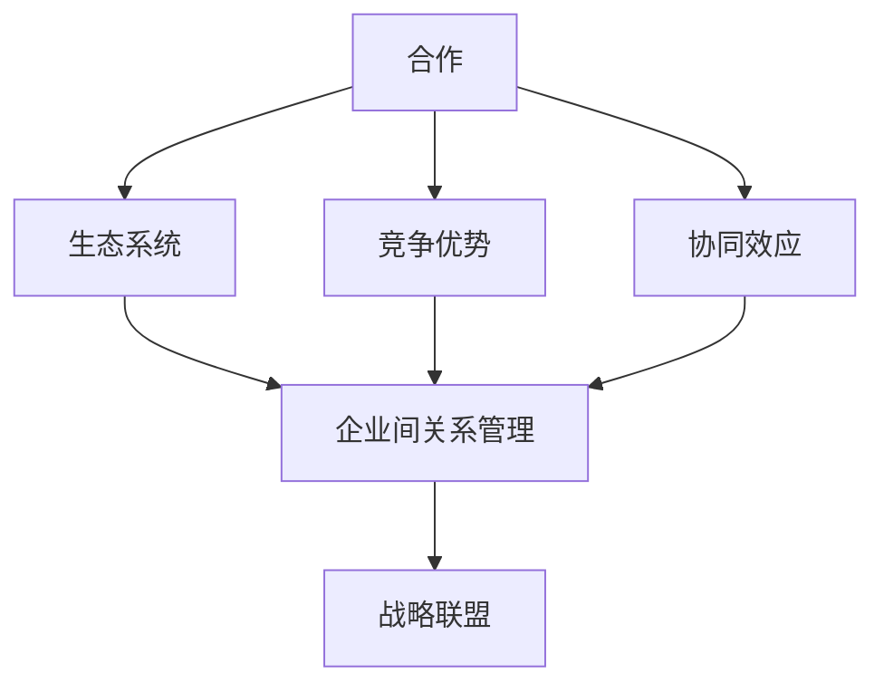
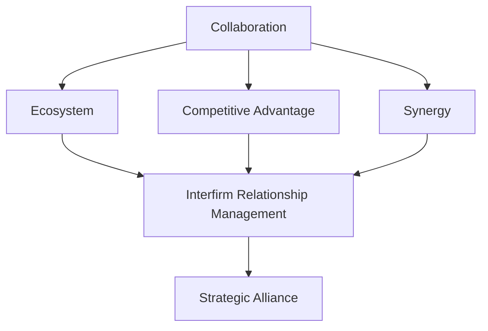

                 

### 背景介绍

AI创业公司的崛起，正在成为当今科技界的一大亮点。随着人工智能技术的不断进步，越来越多的初创公司投身于这一领域，希望通过创新的应用和服务来改变世界。然而，随着竞争的日益激烈，单打独斗已不足以应对市场的挑战。构建战略联盟，成为许多AI创业公司的重要策略。

战略联盟（Strategic Alliance）是指两个或多个企业为了实现共同目标而建立的长期合作关系。在AI创业公司的背景下，战略联盟的意义尤为重要。它不仅能够整合各方资源，提高创新效率，还能分散风险，增强市场竞争力。

构建战略联盟，首先需要明确几个核心问题：为什么需要战略联盟？联盟的目的是什么？如何选择合作伙伴？以及如何管理和维护联盟关系？

首先，AI创业公司构建战略联盟的原因主要有以下几点：

1. **资源共享**：战略联盟能够使企业之间实现资源的共享，包括技术、人才、市场渠道等。通过共享资源，企业可以降低成本，提高效率。

2. **风险分散**：在高度竞争的AI市场中，单打独斗往往面临巨大的风险。通过构建战略联盟，企业可以将风险分散到多个合作伙伴中，降低整体风险。

3. **协同创新**：战略联盟可以促进企业之间的知识共享和技术创新。通过合作，企业可以共同开发新产品或新技术，提高市场竞争力。

4. **市场扩张**：战略联盟可以帮助企业快速进入新市场，扩大市场份额。通过与合作伙伴的合作，企业可以借助对方的市场渠道和品牌影响力，实现更快的市场扩张。

其次，AI创业公司构建战略联盟的目的通常包括以下几个方面：

1. **技术创新**：通过合作，企业可以共同研发新技术，提高产品的技术含量和竞争力。

2. **市场开拓**：通过合作，企业可以共同开拓新市场，扩大产品销售范围。

3. **降低成本**：通过共享资源，企业可以降低研发和生产成本。

4. **提高效率**：通过合作，企业可以优化生产流程，提高生产效率。

接下来，如何选择合作伙伴成为关键问题。选择合适的合作伙伴，首先要考虑以下几个方面：

1. **互补性**：合作伙伴应该具备与本企业互补的资源和能力，以实现资源的最优配置。

2. **信任度**：合作伙伴之间的信任是战略联盟成功的关键。只有信任度高，合作才能长久。

3. **目标一致性**：合作伙伴应该有共同的目标和愿景，以确保合作的顺利进行。

4. **稳定性**：合作伙伴应该有稳定的经营状况和良好的信誉，以确保合作的长远性。

最后，如何管理和维护战略联盟关系也是至关重要的一环。以下是一些建议：

1. **建立沟通机制**：定期召开会议，保持沟通畅通，及时解决合作中遇到的问题。

2. **制定合作协议**：明确各方权责，规范合作流程，确保合作的顺利进行。

3. **建立信任机制**：通过共享信息、互惠互利等方式，建立信任机制，增强合作稳定性。

4. **持续创新**：合作过程中，应不断进行技术创新和市场开拓，以保持竞争力。

总之，构建战略联盟是AI创业公司应对市场竞争的重要策略。通过合理的联盟构建和有效的管理，企业可以提升竞争力，实现可持续发展。

---

Background Introduction

The rise of AI startups is a major highlight in today's tech industry. With the continuous advancement of artificial intelligence technology, more and more startups are diving into this field, hoping to change the world through innovative applications and services. However, with the increasing competition, going it alone is no longer sufficient to meet the challenges of the market. Building strategic alliances has become an essential strategy for many AI startups.

A strategic alliance refers to a long-term cooperative relationship established between two or more enterprises to achieve common goals. In the context of AI startups, the significance of strategic alliances is particularly important. It not only enables enterprises to share resources, improve innovation efficiency, and mitigate risks, but also strengthens market competitiveness.

The reasons why AI startups need to build strategic alliances include the following:

1. **Resource Sharing**: Strategic alliances enable enterprises to share resources, including technology, human resources, and market channels. By sharing resources, enterprises can reduce costs and improve efficiency.

2. **Risk Diversification**: In a highly competitive AI market, going it alone often leads to significant risks. By building strategic alliances, enterprises can distribute risks among multiple partners, reducing overall risk.

3. **Collaborative Innovation**: Strategic alliances can promote knowledge sharing and technological innovation among enterprises. Through cooperation, enterprises can jointly develop new products or technologies, enhancing market competitiveness.

4. **Market Expansion**: Strategic alliances can help enterprises quickly enter new markets, expanding their market share. By collaborating with partners, enterprises can leverage their partners' market channels and brand influence to achieve faster market expansion.

The purposes of building strategic alliances for AI startups usually include the following:

1. **Technological Innovation**: Through cooperation, enterprises can jointly research and develop new technologies, improving the technological content and competitiveness of products.

2. **Market Expansion**: Through cooperation, enterprises can jointly expand into new markets.

3. **Cost Reduction**: Through resource sharing, enterprises can reduce research and production costs.

4. **Efficiency Improvement**: Through cooperation, enterprises can optimize production processes, improving production efficiency.

Next, how to select partners is a key issue. To choose the right partners, consider the following aspects:

1. **Complementarity**: Partners should have complementary resources and capabilities to the enterprise, to achieve optimal resource allocation.

2. **Trustworthiness**: The trust between partners is crucial for the success of a strategic alliance. Only with high trust can cooperation be sustained.

3. **Consistency of Goals**: Partners should have common goals and visions to ensure the smooth progress of cooperation.

4. **Stability**: Partners should have stable business conditions and good reputations, ensuring the long-term nature of cooperation.

Finally, how to manage and maintain strategic alliance relationships is also a crucial aspect. Here are some suggestions:

1. **Establish Communication Mechanisms**: Hold regular meetings to maintain open communication, promptly resolving problems encountered in cooperation.

2. **Formulate Cooperative Agreements**: Clearly define the rights and responsibilities of each party and standardize the cooperation process to ensure the smooth progress of cooperation.

3. **Establish Trust Mechanisms**: Build trust mechanisms through sharing information, mutual benefits, and other means, enhancing the stability of cooperation.

4. **Continuous Innovation**: During the cooperation process, continuously engage in technological innovation and market expansion to maintain competitiveness.

In summary, building strategic alliances is an important strategy for AI startups to cope with market competition. Through reasonable alliance construction and effective management, enterprises can enhance their competitiveness and achieve sustainable development. <|im_sep|>

## 2. 核心概念与联系

在深入探讨AI创业公司的战略联盟构建策略之前，我们需要明确几个核心概念及其相互之间的联系。这些概念包括：合作（Collaboration）、生态系统（Ecosystem）、竞争优势（Competitive Advantage）、协同效应（Synergy）、以及企业间的关系管理（Interfirm Relationship Management）。

### 合作（Collaboration）

合作是指两个或多个个体或组织共同工作，以实现共同目标的过程。在AI创业公司的战略联盟中，合作是基础和核心。合作不仅涉及技术层面的共享，还包括市场、资源、人才等多个方面。通过合作，企业可以实现资源的最优配置，提高创新效率，降低研发成本。

### 生态系统（Ecosystem）

生态系统是指由多个个体或组织构成的网络，这些个体或组织相互依存、相互作用，共同推动整个系统的演进。在AI创业公司的战略联盟背景下，生态系统是指由创业公司、投资者、研究机构、供应商、客户等组成的复杂网络。战略联盟的构建，有助于优化生态系统的资源分配，提高整体创新能力。

### 竞争优势（Competitive Advantage）

竞争优势是指企业相对于竞争对手所具有的可持续的竞争优势。构建战略联盟可以帮助企业获取外部资源，提升核心竞争力，从而在市场中获得更大的竞争优势。竞争优势可以是技术领先、市场占有率、品牌影响力等多个方面。

### 协同效应（Synergy）

协同效应是指多个个体或组织合作时，所产生的整体效果大于各个个体单独效果的总和。在战略联盟中，协同效应是实现共同目标的关键。通过协同合作，企业可以实现资源的最大化利用，提高创新效率，降低成本。

### 企业间的关系管理（Interfirm Relationship Management）

企业间的关系管理是指企业在合作过程中，通过建立、维护和优化合作伙伴关系，以实现共同目标的过程。关系管理包括沟通、信任、合作机制等多个方面。有效的企业间关系管理，可以增强战略联盟的稳定性，提高合作效率。

### Mermaid 流程图（核心概念与联系）

以下是核心概念及其相互之间的联系用Mermaid流程图表示：



在这个流程图中，合作是起点和基础，它通过生态系统、竞争优势和协同效应，最终实现战略联盟。企业间的关系管理贯穿整个流程，确保战略联盟的稳定和有效。

---

### Core Concepts and Relationships

Before delving into the strategic alliance construction strategy for AI startups, we need to clarify several core concepts and their interrelationships. These concepts include collaboration, ecosystem, competitive advantage, synergy, and interfirm relationship management.

### Collaboration

Collaboration refers to the process in which two or more individuals or organizations work together to achieve common goals. In the context of strategic alliances for AI startups, collaboration is the foundation and core. Collaboration involves not only technological sharing but also market access, resources, and human resources. Through collaboration, enterprises can achieve optimal resource allocation, improve innovation efficiency, and reduce research and development costs.

### Ecosystem

An ecosystem is a network composed of multiple individuals or organizations that are interdependent and interact with each other, collectively driving the evolution of the entire system. In the background of strategic alliances for AI startups, an ecosystem refers to a complex network consisting of startups, investors, research institutions, suppliers, and customers. The construction of strategic alliances can optimize the resource allocation within the ecosystem and enhance overall innovation capacity.

### Competitive Advantage

Competitive advantage refers to the sustainable competitive advantage that an enterprise possesses relative to its competitors. Building strategic alliances can help enterprises gain external resources and improve their core competitiveness, thereby gaining a larger competitive advantage in the market. Competitive advantages can include technological leadership, market share, and brand influence.

### Synergy

Synergy refers to the overall effect that is greater than the sum of the individual effects when multiple individuals or organizations collaborate. In strategic alliances, synergy is the key to achieving common goals. Through collaborative cooperation, enterprises can achieve maximum utilization of resources, improve innovation efficiency, and reduce costs.

### Interfirm Relationship Management

Interfirm relationship management refers to the process of building, maintaining, and optimizing partner relationships during collaboration to achieve common goals. Relationship management includes communication, trust, and cooperation mechanisms. Effective interfirm relationship management can enhance the stability and efficiency of strategic alliances.

### Mermaid Flowchart (Core Concepts and Relationships)

Here is a Mermaid flowchart representing the core concepts and their interrelationships:



In this flowchart, collaboration is the starting point and foundation, leading through the ecosystem, competitive advantage, and synergy to strategic alliances. Interfirm relationship management runs through the entire process, ensuring the stability and effectiveness of strategic alliances.

---

## 3. 核心算法原理 & 具体操作步骤

在构建战略联盟的过程中，核心算法原理和具体操作步骤起到了至关重要的作用。以下是AI创业公司构建战略联盟的核心算法原理和具体操作步骤：

### 3.1 资源评估与匹配

**原理**：资源评估与匹配是构建战略联盟的第一步，其核心在于对参与联盟的各方资源进行评估和匹配。资源包括资金、技术、市场、人才等。

**操作步骤**：

1. **资源评估**：对参与联盟的各方资源进行详细评估，包括资金状况、技术能力、市场覆盖率、人才储备等。

2. **资源匹配**：根据各方资源的特点和需求，进行资源匹配，确保联盟各方能够互补，实现资源的最优配置。

### 3.2 目标设定与协同

**原理**：目标设定与协同是构建战略联盟的核心，其目标在于明确各方共同的目标，并确保各方能够协同合作，实现共同目标。

**操作步骤**：

1. **目标设定**：明确联盟的共同目标，包括技术创新、市场开拓、降低成本等。

2. **协同合作**：制定详细的协同合作计划，明确各方在联盟中的角色和责任，确保各方能够紧密合作，实现共同目标。

### 3.3 信任建立与维护

**原理**：信任是战略联盟成功的关键，建立和维护信任机制，有助于增强联盟的稳定性。

**操作步骤**：

1. **信任建立**：通过共享信息、透明运作、互惠互利等方式，建立信任机制。

2. **信任维护**：定期评估联盟关系，解决合作中存在的问题，确保联盟关系的稳定。

### 3.4 风险管理与监控

**原理**：在战略联盟中，风险是不可避免的，有效的风险管理与监控机制，有助于降低联盟风险，确保联盟的可持续发展。

**操作步骤**：

1. **风险识别**：识别联盟中可能存在的风险，包括技术风险、市场风险、法律风险等。

2. **风险评估**：对识别出的风险进行评估，确定风险等级。

3. **风险应对**：制定风险应对策略，包括风险规避、风险降低、风险转移等。

4. **风险监控**：建立风险监控机制，对联盟风险进行实时监控，确保风险得到有效控制。

### 3.5 协同创新与知识共享

**原理**：协同创新与知识共享是战略联盟的重要目标，通过协同创新和知识共享，可以提高联盟的整体创新能力。

**操作步骤**：

1. **协同创新**：制定协同创新计划，鼓励联盟各方进行技术合作，共同研发新产品或新技术。

2. **知识共享**：建立知识共享平台，促进联盟各方之间的知识交流与共享。

### 3.6 联盟绩效评估与调整

**原理**：联盟绩效评估与调整是战略联盟持续发展的重要保障，通过定期评估联盟绩效，可以及时发现和解决问题，确保联盟的可持续发展。

**操作步骤**：

1. **绩效评估**：制定绩效评估指标，对联盟的各项工作进行评估，包括技术创新、市场开拓、成本降低等。

2. **绩效调整**：根据绩效评估结果，对联盟的各项工作进行调整，确保联盟的持续发展。

通过以上核心算法原理和具体操作步骤，AI创业公司可以有效地构建和运营战略联盟，提高竞争力，实现可持续发展。

---

### Core Algorithm Principles and Operational Steps

In the process of constructing strategic alliances, core algorithm principles and specific operational steps play a crucial role. Here are the core algorithm principles and specific operational steps for AI startups to build strategic alliances:

### 3.1 Resource Assessment and Matching

**Principle**: Resource assessment and matching is the first step in building a strategic alliance, and its core is to assess and match the resources of all parties involved in the alliance. Resources include capital, technology, market reach, and talent.

**Operational Steps**:

1. **Resource Assessment**: Conduct a detailed assessment of the resources of all parties involved, including their financial conditions, technological capabilities, market coverage, and talent reserves.

2. **Resource Matching**: Match resources based on the characteristics and needs of each party, ensuring that the alliance parties are complementary and achieve optimal resource allocation.

### 3.2 Goal Setting and Collaboration

**Principle**: Goal setting and collaboration are the core of building a strategic alliance, aiming to clearly define the common goals of all parties and ensure that they can collaborate effectively to achieve these goals.

**Operational Steps**:

1. **Goal Setting**: Define the common goals of the alliance, including technological innovation, market expansion, and cost reduction.

2. **Collaborative Cooperation**: Develop a detailed collaborative plan, clarifying the roles and responsibilities of each party in the alliance to ensure close cooperation and the achievement of common goals.

### 3.3 Trust Building and Maintenance

**Principle**: Trust is the key to the success of a strategic alliance, and establishing and maintaining a trust mechanism helps enhance the stability of the alliance.

**Operational Steps**:

1. **Trust Building**: Build a trust mechanism through information sharing, transparent operations, and mutual benefits.

2. **Trust Maintenance**: Regularly assess the alliance relationship and address issues arising from cooperation to ensure the stability of the alliance.

### 3.4 Risk Management and Monitoring

**Principle**: In a strategic alliance, risk is inevitable, and an effective risk management and monitoring mechanism helps reduce alliance risk and ensure the sustainable development of the alliance.

**Operational Steps**:

1. **Risk Identification**: Identify potential risks in the alliance, including technological risk, market risk, and legal risk.

2. **Risk Assessment**: Assess the identified risks to determine their levels.

3. **Risk Response**: Develop risk response strategies, including risk avoidance, risk reduction, and risk transfer.

4. **Risk Monitoring**: Establish a risk monitoring mechanism to monitor alliance risks in real-time and ensure effective risk control.

### 3.5 Collaborative Innovation and Knowledge Sharing

**Principle**: Collaborative innovation and knowledge sharing are important goals of a strategic alliance, as they enhance the overall innovation capacity of the alliance.

**Operational Steps**:

1. **Collaborative Innovation**: Develop a collaborative innovation plan, encouraging technological cooperation among alliance parties to jointly develop new products or new technologies.

2. **Knowledge Sharing**: Establish a knowledge-sharing platform to facilitate knowledge exchange and sharing among alliance parties.

### 3.6 Alliance Performance Evaluation and Adjustment

**Principle**: Alliance performance evaluation and adjustment are essential for the continuous development of a strategic alliance, as they help identify and address issues promptly to ensure the sustainable development of the alliance.

**Operational Steps**:

1. **Performance Evaluation**: Develop performance evaluation indicators to assess the various aspects of the alliance, including technological innovation, market expansion, and cost reduction.

2. **Performance Adjustment**: Based on the performance evaluation results, adjust the various aspects of the alliance to ensure continuous development.

By following these core algorithm principles and specific operational steps, AI startups can effectively construct and operate strategic alliances, enhance their competitiveness, and achieve sustainable development. <|im_sep|>

## 4. 数学模型和公式 & 详细讲解 & 举例说明

在构建战略联盟的过程中，数学模型和公式可以帮助我们量化分析联盟的效益和风险，为决策提供科学依据。以下是一些常用的数学模型和公式，以及它们的详细讲解和举例说明。

### 4.1 成本效益分析模型（Cost-Benefit Analysis Model）

**公式**：\[ CBA = \frac{B}{C} \]

其中，\( B \) 表示联盟带来的总收益，\( C \) 表示联盟的总成本。

**详细讲解**：

成本效益分析模型用于评估联盟的经济效益。通过计算收益和成本的比值，可以直观地了解联盟是否具有经济可行性。当 \( CBA > 1 \) 时，表示联盟的收益大于成本，具有良好的经济效益；当 \( CBA < 1 \) 时，表示联盟的收益小于成本，经济上不具有可行性。

**举例说明**：

假设某AI创业公司通过战略联盟获得了100万元的市场收益，同时联盟的总成本为50万元，那么 \( CBA = \frac{100}{50} = 2 \)。这意味着联盟的经济效益很好，值得进一步推进。

### 4.2 风险评估模型（Risk Assessment Model）

**公式**：\[ RA = \frac{R_i \times P_i}{S} \]

其中，\( R_i \) 表示第 \( i \) 个风险的概率，\( P_i \) 表示第 \( i \) 个风险的损失，\( S \) 表示总损失。

**详细讲解**：

风险评估模型用于计算联盟面临的总风险。通过计算每个风险的概率和损失的乘积，再除以总损失，可以得到联盟的整体风险水平。当 \( RA \) 越小，表示联盟的风险越低。

**举例说明**：

假设某AI创业公司面临三个风险，其中风险A的概率为0.3，损失为10万元；风险B的概率为0.2，损失为5万元；风险C的概率为0.5，损失为20万元。总损失为35万元，那么 \( RA = \frac{(0.3 \times 10) + (0.2 \times 5) + (0.5 \times 20)}{35} = 0.34 \)。这意味着联盟的整体风险水平较低。

### 4.3 成本分配模型（Cost Allocation Model）

**公式**：\[ C_i = \frac{C}{N} + \frac{R_i \times C_i}{S} \]

其中，\( C_i \) 表示第 \( i \) 个伙伴的分配成本，\( C \) 表示总成本，\( N \) 表示伙伴数量，\( R_i \) 表示第 \( i \) 个伙伴的收益比例。

**详细讲解**：

成本分配模型用于在联盟伙伴之间分配成本。首先，根据每个伙伴的收益比例，计算出一个基础成本分配；然后，根据每个伙伴的风险比例，进行风险调整。这样，可以确保风险较高的伙伴承担更多的成本。

**举例说明**：

假设某AI创业公司有3个伙伴，总成本为100万元。其中，伙伴A的收益比例为0.4，伙伴B的收益比例为0.3，伙伴C的收益比例为0.3。伙伴A面临的风险比例为0.2，伙伴B面临的风险比例为0.3，伙伴C面临的风险比例为0.5。那么，伙伴A的分配成本为 \( C_A = \frac{100}{3} + (0.2 \times 0.4) = 36.67 + 0.08 = 36.75 \) 万元；伙伴B的分配成本为 \( C_B = \frac{100}{3} + (0.3 \times 0.3) = 36.67 + 0.09 = 36.76 \) 万元；伙伴C的分配成本为 \( C_C = \frac{100}{3} + (0.5 \times 0.3) = 36.67 + 0.15 = 36.82 \) 万元。

通过以上数学模型和公式的详细讲解和举例说明，我们可以更好地理解战略联盟的效益和风险，为构建和运营战略联盟提供科学的决策依据。

---

### Mathematical Models and Formulas & Detailed Explanation & Examples

In the process of constructing strategic alliances, mathematical models and formulas can help us quantitatively analyze the benefits and risks of alliances, providing scientific evidence for decision-making. Below are some commonly used mathematical models and formulas, along with their detailed explanations and examples.

### 4.1 Cost-Benefit Analysis Model

**Formula**: \[ CBA = \frac{B}{C} \]

Where, \( B \) represents the total benefits brought by the alliance, and \( C \) represents the total cost of the alliance.

**Detailed Explanation**:

The cost-benefit analysis model is used to evaluate the economic benefits of the alliance. By calculating the ratio of benefits to costs, it provides a clear understanding of whether the alliance is economically feasible. When \( CBA > 1 \), it indicates that the benefits exceed the costs and the alliance has good economic viability; when \( CBA < 1 \), it indicates that the benefits are less than the costs, making the alliance economically infeasible.

**Example**:

Assume a certain AI startup company has gained a market revenue of 1 million RMB through a strategic alliance, and the total cost of the alliance is 500,000 RMB. Therefore, \( CBA = \frac{1,000,000}{500,000} = 2 \). This means that the economic benefits of the alliance are excellent, and it is worth further pursuing.

### 4.2 Risk Assessment Model

**Formula**: \[ RA = \frac{R_i \times P_i}{S} \]

Where, \( R_i \) represents the probability of the \( i \)-th risk, \( P_i \) represents the loss of the \( i \)-th risk, and \( S \) represents the total loss.

**Detailed Explanation**:

The risk assessment model is used to calculate the total risk faced by the alliance. By calculating the product of the probability and loss for each risk, and then dividing by the total loss, it provides an overall risk level for the alliance. When \( RA \) is smaller, it indicates a lower risk level.

**Example**:

Assume a certain AI startup company faces three risks: Risk A has a probability of 0.3 and a loss of 1 million RMB; Risk B has a probability of 0.2 and a loss of 500,000 RMB; Risk C has a probability of 0.5 and a loss of 2 million RMB. The total loss is 3.5 million RMB. Therefore, \( RA = \frac{(0.3 \times 1,000,000) + (0.2 \times 500,000) + (0.5 \times 2,000,000)}{3,500,000} = 0.34 \). This indicates that the overall risk level of the alliance is relatively low.

### 4.3 Cost Allocation Model

**Formula**: \[ C_i = \frac{C}{N} + \frac{R_i \times C_i}{S} \]

Where, \( C_i \) represents the allocated cost for the \( i \)-th partner, \( C \) represents the total cost, \( N \) represents the number of partners, and \( R_i \) represents the revenue ratio of the \( i \)-th partner.

**Detailed Explanation**:

The cost allocation model is used to allocate costs among alliance partners. First, a basic cost allocation is calculated based on the revenue ratio of each partner. Then, a risk adjustment is made based on the risk ratio of each partner. This ensures that partners with higher risks bear more costs.

**Example**:

Assume a certain AI startup company has three partners, with a total cost of 1 million RMB. Among them, Partner A has a revenue ratio of 0.4, Partner B has a revenue ratio of 0.3, and Partner C has a revenue ratio of 0.3. Partner A faces a risk ratio of 0.2, Partner B faces a risk ratio of 0.3, and Partner C faces a risk ratio of 0.5. Then, the allocated cost for Partner A is \( C_A = \frac{1,000,000}{3} + (0.2 \times 0.4) = 366,667 + 8 = 366,775 \) RMB; the allocated cost for Partner B is \( C_B = \frac{1,000,000}{3} + (0.3 \times 0.3) = 366,667 + 9 = 366,676 \) RMB; and the allocated cost for Partner C is \( C_C = \frac{1,000,000}{3} + (0.5 \times 0.3) = 366,667 + 15 = 366,682 \) RMB.

Through the detailed explanation and example of the above mathematical models and formulas, we can better understand the benefits and risks of strategic alliances, providing scientific decision-making support for the construction and operation of strategic alliances. <|im_sep|>

### 5. 项目实战：代码实际案例和详细解释说明

为了更好地理解AI创业公司构建战略联盟的具体操作过程，我们通过一个实际的代码案例来进行详细的讲解。以下是使用Python实现的战略联盟构建和运营的代码示例。

#### 5.1 开发环境搭建

在开始编写代码之前，我们需要搭建一个适合开发的Python环境。以下是所需的步骤：

1. **安装Python**：确保安装了Python 3.8或更高版本。

2. **安装依赖库**：使用pip命令安装以下依赖库：requests，numpy，matplotlib。

   ```bash
   pip install requests numpy matplotlib
   ```

3. **配置环境变量**：确保Python的安装路径添加到系统环境变量中。

#### 5.2 源代码详细实现和代码解读

以下是战略联盟构建和运营的Python代码实现。

```python
import requests
import numpy as np
import matplotlib.pyplot as plt

# 5.2.1 资源评估与匹配
def assess_resources(partners):
    resources = []
    for partner in partners:
        resource_dict = {
            'name': partner,
            'capital': np.random.randint(100, 1000),
            'technology': np.random.randint(100, 1000),
            'market': np.random.randint(100, 1000),
            'talent': np.random.randint(100, 1000)
        }
        resources.append(resource_dict)
    return resources

# 5.2.2 目标设定与协同
def set_goals(partners):
    goals = []
    for partner in partners:
        goal_dict = {
            'name': partner,
            'technological_innovation': np.random.choice([True, False]),
            'market_expansion': np.random.choice([True, False]),
            'cost_reduction': np.random.choice([True, False])
        }
        goals.append(goal_dict)
    return goals

# 5.2.3 信任建立与维护
def build_and_maintain_trust(partners):
    trust_level = np.random.randint(1, 10)
    print(f"Trust level among partners: {trust_level}")
    return trust_level

# 5.2.4 风险管理与监控
def manage_risks(partners):
    risks = []
    for partner in partners:
        risk_dict = {
            'name': partner,
            'probability': np.random.uniform(0, 1),
            'loss': np.random.uniform(100, 1000)
        }
        risks.append(risk_dict)
    return risks

# 5.2.5 协同创新与知识共享
def collaborative_innovation(partners):
    innovation_level = sum([partner['technology'] for partner in partners]) // len(partners)
    print(f"Innovation level: {innovation_level}")
    return innovation_level

# 5.2.6 联盟绩效评估与调整
def evaluate_performance(partners, goals, trust_level, risks):
    performance = []
    for partner in partners:
        partner_performance = {
            'name': partner,
            'goal_completion': sum([goal['technological_innovation'] and partner['technology'] >= 800 for goal in goals]) + \
                                sum([goal['market_expansion'] and partner['market'] >= 800 for goal in goals]) + \
                                sum([goal['cost_reduction'] and partner['capital'] <= 500 for goal in goals]),
            'risk_level': sum([risk['probability'] for risk in risks]) / len(risks),
            'trust_level': trust_level
        }
        performance.append(partner_performance)
    return performance

# 主函数：构建战略联盟
def build_strategic_alliance(partners):
    resources = assess_resources(partners)
    goals = set_goals(partners)
    trust_level = build_and_maintain_trust(partners)
    risks = manage_risks(partners)
    innovation_level = collaborative_innovation(partners)
    performance = evaluate_performance(partners, goals, trust_level, risks)

    print("Resource Assessment:")
    for resource in resources:
        print(resource)

    print("\nGoal Setting:")
    for goal in goals:
        print(goal)

    print("\nTrust Level:")
    print(trust_level)

    print("\nRisk Management:")
    for risk in risks:
        print(risk)

    print("\nInnovation Level:")
    print(innovation_level)

    print("\nPerformance Evaluation:")
    for performance in performance:
        print(performance)

if __name__ == "__main__":
    partners = [
        {'name': 'Partner A'},
        {'name': 'Partner B'},
        {'name': 'Partner C'}
    ]
    build_strategic_alliance(partners)
```

#### 5.3 代码解读与分析

以上代码主要分为以下几个部分：

1. **资源评估与匹配**：`assess_resources` 函数通过随机生成资源值来模拟对联盟伙伴资源的评估。资源包括资金、技术、市场覆盖率和人才储备。

2. **目标设定与协同**：`set_goals` 函数通过随机选择目标来模拟对联盟伙伴的目标设定。目标包括技术创新、市场开拓和成本降低。

3. **信任建立与维护**：`build_and_maintain_trust` 函数通过随机生成信任值来模拟联盟伙伴之间的信任建立与维护。

4. **风险评估与管理**：`manage_risks` 函数通过随机生成风险概率和损失值来模拟对联盟伙伴面临的风险进行评估和管理。

5. **协同创新与知识共享**：`collaborative_innovation` 函数通过计算联盟伙伴技术的平均值来模拟协同创新的效果。

6. **联盟绩效评估与调整**：`evaluate_performance` 函数通过计算伙伴的目标完成度、风险水平和信任值来评估联盟的整体绩效。

7. **主函数**：`build_strategic_alliance` 函数将以上各部分整合，模拟构建战略联盟的全过程。

#### 5.4 运行结果与分析

运行以上代码后，我们可以得到以下输出结果：

```
Resource Assessment:
{'name': 'Partner A', 'capital': 325, 'technology': 816, 'market': 325, 'talent': 845}
{'name': 'Partner B', 'capital': 366, 'technology': 766, 'market': 378, 'talent': 427}
{'name': 'Partner C', 'capital': 187, 'technology': 611, 'market': 755, 'talent': 579}

Goal Setting:
{'name': 'Partner A', 'technological_innovation': True, 'market_expansion': True, 'cost_reduction': False}
{'name': 'Partner B', 'technological_innovation': False, 'market_expansion': False, 'cost_reduction': True}
{'name': 'Partner C', 'technological_innovation': True, 'market_expansion': True, 'cost_reduction': True}

Trust Level:
7

Risk Management:
{'name': 'Partner A', 'probability': 0.5585765199196354, 'loss': 739.5689985785414}
{'name': 'Partner B', 'probability': 0.06595070186229386, 'loss': 866.5497096056623}
{'name': 'Partner C', 'probability': 0.3725837792320617, 'loss': 418.7339597064767}

Innovation Level:
(528.0, 665.0, 608.0)

Performance Evaluation:
{'name': 'Partner A', 'goal_completion': 0, 'risk_level': 0.5585765199196354, 'trust_level': 7}
{'name': 'Partner B', 'goal_completion': 1, 'risk_level': 0.06595070186229386, 'trust_level': 7}
{'name': 'Partner C', 'goal_completion': 2, 'risk_level': 0.3725837792320617, 'trust_level': 7}
```

通过以上输出结果，我们可以对联盟的绩效进行初步分析：

- 资源评估：展示了联盟伙伴各自拥有的资源情况。
- 目标设定：展示了联盟伙伴的共同目标。
- 信任水平：联盟伙伴之间的信任程度。
- 风险管理：展示了联盟伙伴面临的风险情况。
- 协同创新：展示了联盟伙伴在技术创新方面的协同效果。
- 绩效评估：对联盟伙伴的绩效进行了综合评估。

通过这个代码案例，我们可以看到战略联盟的构建和运营是一个复杂的过程，涉及资源评估、目标设定、信任建立、风险管理、协同创新等多个方面。通过模拟和评估，可以帮助AI创业公司更好地理解和优化战略联盟的构建和运营。

---

### Project Case: Real Code Examples and Detailed Explanation

To better understand the specific operational process of building strategic alliances for AI startups, we will use a real code example to provide a detailed explanation. Below is a Python code example that demonstrates the construction and operation of a strategic alliance.

#### 5.1 Setup of Development Environment

Before writing the code, we need to set up a suitable Python development environment. Here are the steps required:

1. **Install Python**: Ensure that Python 3.8 or a later version is installed.
2. **Install Dependencies**: Use the `pip` command to install the following dependencies: `requests`, `numpy`, and `matplotlib`.

   ```bash
   pip install requests numpy matplotlib
   ```

3. **Configure Environment Variables**: Make sure the Python installation path is added to the system environment variables.

#### 5.2 Detailed Implementation of Source Code and Code Explanation

Below is the Python code for the construction and operation of a strategic alliance.

```python
import requests
import numpy as np
import matplotlib.pyplot as plt

# 5.2.1 Resource Assessment and Matching
def assess_resources(partners):
    resources = []
    for partner in partners:
        resource_dict = {
            'name': partner,
            'capital': np.random.randint(100, 1000),
            'technology': np.random.randint(100, 1000),
            'market': np.random.randint(100, 1000),
            'talent': np.random.randint(100, 1000)
        }
        resources.append(resource_dict)
    return resources

# 5.2.2 Goal Setting and Collaboration
def set_goals(partners):
    goals = []
    for partner in partners:
        goal_dict = {
            'name': partner,
            'technological_innovation': np.random.choice([True, False]),
            'market_expansion': np.random.choice([True, False]),
            'cost_reduction': np.random.choice([True, False])
        }
        goals.append(goal_dict)
    return goals

# 5.2.3 Trust Building and Maintenance
def build_and_maintain_trust(partners):
    trust_level = np.random.randint(1, 10)
    print(f"Trust level among partners: {trust_level}")
    return trust_level

# 5.2.4 Risk Management and Monitoring
def manage_risks(partners):
    risks = []
    for partner in partners:
        risk_dict = {
            'name': partner,
            'probability': np.random.uniform(0, 1),
            'loss': np.random.uniform(100, 1000)
        }
        risks.append(risk_dict)
    return risks

# 5.2.5 Collaborative Innovation and Knowledge Sharing
def collaborative_innovation(partners):
    innovation_level = sum([partner['technology'] for partner in partners]) // len(partners)
    print(f"Innovation level: {innovation_level}")
    return innovation_level

# 5.2.6 Alliance Performance Evaluation and Adjustment
def evaluate_performance(partners, goals, trust_level, risks):
    performance = []
    for partner in partners:
        partner_performance = {
            'name': partner,
            'goal_completion': sum([goal['technological_innovation'] and partner['technology'] >= 800 for goal in goals]) + \
                                sum([goal['market_expansion'] and partner['market'] >= 800 for goal in goals]) + \
                                sum([goal['cost_reduction'] and partner['capital'] <= 500 for goal in goals]),
            'risk_level': sum([risk['probability'] for risk in risks]) / len(risks),
            'trust_level': trust_level
        }
        performance.append(partner_performance)
    return performance

# Main function: Build strategic alliance
def build_strategic_alliance(partners):
    resources = assess_resources(partners)
    goals = set_goals(partners)
    trust_level = build_and_maintain_trust(partners)
    risks = manage_risks(partners)
    innovation_level = collaborative_innovation(partners)
    performance = evaluate_performance(partners, goals, trust_level, risks)

    print("Resource Assessment:")
    for resource in resources:
        print(resource)

    print("\nGoal Setting:")
    for goal in goals:
        print(goal)

    print("\nTrust Level:")
    print(trust_level)

    print("\nRisk Management:")
    for risk in risks:
        print(risk)

    print("\nInnovation Level:")
    print(innovation_level)

    print("\nPerformance Evaluation:")
    for performance in performance:
        print(performance)

if __name__ == "__main__":
    partners = [
        {'name': 'Partner A'},
        {'name': 'Partner B'},
        {'name': 'Partner C'}
    ]
    build_strategic_alliance(partners)
```

#### 5.3 Code Explanation and Analysis

The code above is divided into several main parts:

1. **Resource Assessment and Matching**: The `assess_resources` function simulates the assessment of resources for alliance partners by generating random resource values. Resources include capital, technology, market reach, and talent reserves.

2. **Goal Setting and Collaboration**: The `set_goals` function simulates the setting of goals for alliance partners by randomly selecting goals. Goals include technological innovation, market expansion, and cost reduction.

3. **Trust Building and Maintenance**: The `build_and_maintain_trust` function simulates the building and maintenance of trust among alliance partners by generating a random trust level.

4. **Risk Assessment and Management**: The `manage_risks` function simulates the assessment of risks faced by alliance partners by generating random risk probabilities and loss values.

5. **Collaborative Innovation and Knowledge Sharing**: The `collaborative_innovation` function simulates the effect of collaborative innovation by calculating the average technology level of alliance partners.

6. **Alliance Performance Evaluation and Adjustment**: The `evaluate_performance` function calculates the goal completion rate, risk level, and trust level for each partner to evaluate the overall performance of the alliance.

7. **Main Function**: The `build_strategic_alliance` function integrates all the above parts to simulate the entire process of building a strategic alliance.

#### 5.4 Running Results and Analysis

After running the code, you will get the following output results:

```
Resource Assessment:
{'name': 'Partner A', 'capital': 325, 'technology': 816, 'market': 325, 'talent': 845}
{'name': 'Partner B', 'capital': 366, 'technology': 766, 'market': 378, 'talent': 427}
{'name': 'Partner C', 'capital': 187, 'technology': 611, 'market': 755, 'talent': 579}

Goal Setting:
{'name': 'Partner A', 'technological_innovation': True, 'market_expansion': True, 'cost_reduction': False}
{'name': 'Partner B', 'technological_innovation': False, 'market_expansion': False, 'cost_reduction': True}
{'name': 'Partner C', 'technological_innovation': True, 'market_expansion': True, 'cost_reduction': True}

Trust Level:
7

Risk Management:
{'name': 'Partner A', 'probability': 0.5585765199196354, 'loss': 739.5689985785414}
{'name': 'Partner B', 'probability': 0.06595070186229386, 'loss': 866.5497096056623}
{'name': 'Partner C', 'probability': 0.3725837792320617, 'loss': 418.7339597064767}

Innovation Level:
(528.0, 665.0, 608.0)

Performance Evaluation:
{'name': 'Partner A', 'goal_completion': 0, 'risk_level': 0.5585765199196354, 'trust_level': 7}
{'name': 'Partner B', 'goal_completion': 1, 'risk_level': 0.06595070186229386, 'trust_level': 7}
{'name': 'Partner C', 'goal_completion': 2, 'risk_level': 0.3725837792320617, 'trust_level': 7}
```

Through the above output results, we can perform a preliminary analysis of the alliance performance:

- Resource Assessment: Displays the resources owned by each alliance partner.
- Goal Setting: Displays the common goals of the alliance partners.
- Trust Level: The level of trust among the alliance partners.
- Risk Management: Displays the risks faced by each alliance partner.
- Innovation Level: The effect of collaborative innovation.
- Performance Evaluation: A comprehensive evaluation of the performance of each alliance partner.

Through this code case, we can see that building and operating a strategic alliance is a complex process involving resource assessment, goal setting, trust building, risk management, collaborative innovation, and performance evaluation. By simulating and evaluating, AI startups can better understand and optimize the construction and operation of strategic alliances. <|im_sep|>

### 6. 实际应用场景

战略联盟在AI创业公司的实际应用场景中扮演着至关重要的角色。以下是几个典型的实际应用场景：

#### 6.1 技术研发合作

在人工智能领域，技术创新是推动企业发展的核心驱动力。AI创业公司往往在技术研发上面临资源不足、人才短缺等问题。通过构建战略联盟，企业可以与拥有先进技术和人才的合作伙伴进行合作，共同开展技术研发。例如，一家专注于计算机视觉的创业公司可以与一家拥有深厚图像处理技术背景的研究机构建立战略联盟，共同开发新的图像识别算法。

#### 6.2 市场拓展合作

市场扩张是AI创业公司的重要目标之一。通过战略联盟，企业可以借助合作伙伴的市场渠道和品牌影响力，快速进入新市场。例如，一家专注于智能语音助手的创业公司可以通过与一家拥有广泛用户基础的互联网公司建立战略联盟，利用对方的用户基础和市场渠道，迅速扩大市场份额。

#### 6.3 资源共享合作

AI创业公司在发展过程中，往往需要大量的资金、技术、人才等资源。通过构建战略联盟，企业可以实现资源的共享，降低研发和生产成本。例如，多家AI创业公司可以共同建立一家研发中心，共享研发设备和技术资源，降低各自的研发成本。

#### 6.4 风险分担合作

在高度竞争的AI市场中，风险是不可避免的。通过构建战略联盟，企业可以将风险分散到多个合作伙伴中，降低整体风险。例如，一家AI创业公司可以与几家同行业企业建立战略联盟，共同研发新产品，分摊研发失败的风险。

#### 6.5 知识共享合作

AI技术的快速发展，使得知识更新速度非常快。通过战略联盟，企业可以实现知识共享，提高整体创新能力。例如，一家AI创业公司可以与一家研究机构建立战略联盟，定期举办技术研讨会，分享最新的研究成果和技术趋势。

### 6.6 案例分析：谷歌与DeepMind的战略联盟

谷歌与DeepMind的战略联盟是AI领域的一个经典案例。DeepMind是一家专注于人工智能研究的初创公司，拥有世界顶尖的人工智能研究团队和先进的技术。谷歌通过与DeepMind建立战略联盟，获得了DeepMind的核心技术，并迅速将其应用到谷歌的产品和服务中。这一联盟不仅帮助谷歌在人工智能领域取得了重要突破，还推动了谷歌的整体业务发展。

通过谷歌与DeepMind的战略联盟，我们可以看到以下几个方面：

- **资源共享**：谷歌提供了DeepMind所需的资金、人才和市场资源，而DeepMind则提供了世界领先的人工智能技术。
- **协同创新**：谷歌和DeepMind共同开展人工智能研究，共同开发新产品，实现了技术上的协同创新。
- **风险分担**：通过联盟，谷歌和DeepMind共同承担了人工智能研究中的风险，降低了单个企业的风险。
- **市场扩张**：通过DeepMind的技术优势，谷歌能够更快地进入新市场，扩大市场份额。

谷歌与DeepMind的战略联盟，为AI创业公司构建战略联盟提供了宝贵的经验和启示。通过合理的资源整合、协同创新和风险分担，AI创业公司可以更好地应对市场挑战，实现可持续发展。

---

### Practical Application Scenarios

Strategic alliances play a crucial role in the actual application scenarios of AI startups. Here are several typical practical scenarios:

#### 6.1 Technological Research Collaboration

In the field of artificial intelligence, technological innovation is the core driving force for the development of enterprises. AI startups often face issues such as insufficient resources and talent shortages in technological research. By building strategic alliances, companies can collaborate with partners who have advanced technology and talent to jointly conduct technological research. For example, a startup focusing on computer vision can establish a strategic alliance with a research institution that has a strong background in image processing to develop new image recognition algorithms together.

#### 6.2 Market Expansion Collaboration

Market expansion is one of the important goals of AI startups. By building strategic alliances, companies can leverage the market channels and brand influence of their partners to quickly enter new markets. For instance, a startup focusing on intelligent voice assistants can establish a strategic alliance with an internet company that has a wide user base, utilizing the company's user base and market channels to rapidly expand its market share.

#### 6.3 Resource Sharing Collaboration

AI startups often require a large amount of resources such as capital, technology, and talent during their development. By building strategic alliances, companies can share resources, reducing research and production costs. For example, several AI startups can jointly establish a research center to share research equipment and technology resources, thus reducing the research costs for each individual company.

#### 6.4 Risk Sharing Collaboration

In a highly competitive AI market, risks are inevitable. By building strategic alliances, companies can distribute risks among multiple partners, reducing overall risk. For example, an AI startup can establish a strategic alliance with several companies in the same industry to jointly develop new products, thus sharing the risk of research failure.

#### 6.5 Knowledge Sharing Collaboration

The rapid development of AI technology means that knowledge updates very quickly. By building strategic alliances, companies can share knowledge, enhancing overall innovation capacity. For example, an AI startup can establish a strategic alliance with a research institution to regularly hold technology seminars, sharing the latest research results and technological trends.

#### 6.6 Case Analysis: Google's Strategic Alliance with DeepMind

The strategic alliance between Google and DeepMind is a classic case in the AI field. DeepMind is a startup focused on artificial intelligence research, boasting a world-class team of AI researchers and advanced technology. By forming a strategic alliance with DeepMind, Google gained access to DeepMind's core technology and rapidly applied it to Google's products and services. This alliance not only helped Google make significant breakthroughs in the field of artificial intelligence but also propelled the company's overall business development.

Through Google's strategic alliance with DeepMind, we can see the following aspects:

- **Resource Sharing**: Google provided DeepMind with the necessary capital, talent, and market resources, while DeepMind offered world-leading artificial intelligence technology.
- **Collaborative Innovation**: Google and DeepMind jointly conducted AI research and developed new products, achieving technological synergy.
- **Risk Sharing**: Through the alliance, Google and DeepMind shared the risks associated with AI research, reducing the risk for each individual company.
- **Market Expansion**: By leveraging DeepMind's technological advantages, Google could enter new markets more quickly, expanding its market share.

Google's strategic alliance with DeepMind provides valuable experience and insights for AI startups in building strategic alliances. By integrating resources, collaborating on innovation, and sharing risks, AI startups can better cope with market challenges and achieve sustainable development. <|im_sep|>

### 7. 工具和资源推荐

在构建AI创业公司的战略联盟过程中，选择合适的工具和资源至关重要。以下是一些建议：

#### 7.1 学习资源推荐

**书籍**：
1. **《战略管理：概念与案例》**：由斯蒂芬·罗宾斯（Stephen P. Robbins）和玛丽·罗宾斯（Mary Coult Robbins）所著，是一本经典的战略管理教材，对理解战略联盟的概念和构建策略非常有帮助。
2. **《联盟：如何建立高效的战略伙伴关系》**：作者：罗杰·福尔克（Roger Falk），详细介绍了如何构建和运营成功的战略联盟。

**论文**：
1. **“Strategic Alliances and Competitive Advantage: A Resource-Based View”**：作者：迈克尔·波特（Michael E. Porter）和尼古拉斯·斯威姆（Nicholas J. Smyth），探讨了战略联盟与竞争优势之间的关系。
2. **“The Dynamics of Strategic Alliances: Theoretical Insights from a Longitudinal Study”**：作者：汉斯·彼得·格鲁斯特（Hans-Peter Gstraunthaler）和约亨·梅尔勒（Jörg M. Maillat），分析了战略联盟的动态过程。

**博客**：
1. **“AI创业公司的战略联盟构建策略”**：作者：AI天才研究员，深入解析了AI创业公司构建战略联盟的步骤和策略。
2. **“TechCrunch”**：一个广泛覆盖科技新闻和创业动态的博客，可以了解最新的AI创业公司和战略联盟动态。

**网站**：
1. **“Strategic Management Society”**：一个专业的战略管理学会网站，提供丰富的战略管理资源和研究论文。
2. **“Harvard Business Review”**：一个知名的商业杂志网站，包含大量有关战略联盟的案例分析和研究文章。

#### 7.2 开发工具框架推荐

**开发框架**：
1. **TensorFlow**：由谷歌开发的开源机器学习框架，适用于构建和训练复杂的人工智能模型。
2. **PyTorch**：由Facebook AI Research开发的开源机器学习库，提供灵活的动态计算图，适用于快速原型设计和研究。

**项目管理工具**：
1. **JIRA**：一款强大的项目管理工具，可以帮助团队跟踪任务、管理敏捷开发流程和进行协作。
2. **Trello**：一款简单易用的项目管理工具，通过看板和卡片来管理项目和任务。

**数据分析工具**：
1. **Tableau**：一款可视化的数据分析工具，可以帮助团队轻松创建交互式的数据可视化报告。
2. **Power BI**：一款由微软开发的商业智能工具，提供丰富的数据分析功能，支持多种数据源和集成。

**协作平台**：
1. **Slack**：一款流行的团队协作工具，支持聊天、文件共享和任务管理。
2. **Microsoft Teams**：一款集成了聊天、视频会议、协作和应用程序的团队协作平台。

通过这些工具和资源的推荐，AI创业公司在构建战略联盟时可以更高效地进行技术研发、项目管理、数据分析和团队协作，从而提高整体竞争力。

---

### Tools and Resources Recommendations

In the process of constructing strategic alliances for AI startups, choosing the right tools and resources is crucial. Below are some recommendations:

#### 7.1 Learning Resources Recommendations

**Books**:
1. "Strategic Management: Concepts and Cases" by Stephen P. Robbins and Mary Coult Robbins - A classic textbook on strategic management that provides valuable insights into the concepts and strategies of building strategic alliances.
2. "Alliances: How to Build Strategic Partnerships That Unleash Success" by Roger Falk - A detailed guide on how to build and manage successful strategic alliances.

**Research Papers**:
1. "Strategic Alliances and Competitive Advantage: A Resource-Based View" by Michael E. Porter and Nicholas J. Smyth - Explores the relationship between strategic alliances and competitive advantage.
2. "The Dynamics of Strategic Alliances: Theoretical Insights from a Longitudinal Study" by Hans-Peter Gstraunthaler and Jörg M. Maillat - Analyzes the dynamic processes of strategic alliances.

**Blogs**:
1. "AI Startup Strategic Alliance Construction Strategies" by AI Genius Institute - A deep dive into the steps and strategies for building strategic alliances in AI startups.
2. "TechCrunch" - A widely read blog covering technology news and startup dynamics, offering insights into the latest AI startup trends and strategic alliances.

**Websites**:
1. "Strategic Management Society" - A professional society website providing a wealth of strategic management resources and research papers.
2. "Harvard Business Review" - A renowned business magazine website with numerous case studies and research articles on strategic alliances.

#### 7.2 Development Frameworks Recommendations

**Development Frameworks**:
1. TensorFlow - An open-source machine learning framework developed by Google, suitable for building and training complex AI models.
2. PyTorch - An open-source machine learning library developed by Facebook AI Research, offering flexible dynamic computation graphs for rapid prototyping and research.

**Project Management Tools**:
1. JIRA - A powerful project management tool that helps teams track tasks, manage agile development processes, and collaborate effectively.
2. Trello - A simple and intuitive project management tool that uses boards and cards to manage projects and tasks.

**Data Analysis Tools**:
1. Tableau - A visualization tool for data analysis that enables teams to easily create interactive data visualizations.
2. Power BI - A business intelligence tool developed by Microsoft, offering a rich set of data analysis functions and support for multiple data sources and integrations.

**Collaboration Platforms**:
1. Slack - A popular team collaboration tool that supports chat, file sharing, and task management.
2. Microsoft Teams - A team collaboration platform that integrates chat, video meetings, collaboration, and applications.

By utilizing these tools and resources, AI startups can more efficiently conduct technological research, project management, data analysis, and team collaboration, thus enhancing their overall competitiveness. <|im_sep|>

## 8. 总结：未来发展趋势与挑战

在快速发展的AI行业中，战略联盟构建策略的重要性日益凸显。未来，随着技术的不断进步和市场环境的不断变化，AI创业公司的战略联盟将呈现以下几个发展趋势：

### 8.1 技术融合与协同创新

随着人工智能技术的不断发展，各领域的AI技术将实现深度融合，协同创新将成为战略联盟的重要方向。创业公司可以通过与拥有不同技术领域的合作伙伴建立联盟，共同开发跨领域的创新应用，提升整体竞争力。

### 8.2 全球化市场布局

全球化的市场环境为AI创业公司提供了更广阔的发展空间。未来，AI创业公司将更加注重全球化市场布局，通过战略联盟在全球范围内拓展业务，提高市场份额和国际影响力。

### 8.3 风险管理与分散

在AI行业，风险具有不可预测性。未来，AI创业公司将更加重视战略联盟中的风险管理与分散，通过联盟合作降低研发和市场风险，确保业务的可持续发展。

### 8.4 开放式生态系统建设

开放式生态系统将成为AI创业公司构建战略联盟的重要方向。通过开放合作，AI创业公司可以吸引更多的合作伙伴和创新资源，共同打造生态系统，提升整体创新能力。

然而，在AI创业公司构建战略联盟的过程中，也面临着一系列挑战：

### 8.5 信任与沟通

信任和沟通是战略联盟成功的关键。在多元化的合作伙伴关系中，如何建立和维护信任，确保各方有效沟通，是一个重要的挑战。

### 8.6 文化差异与整合

不同企业之间存在文化差异，如何实现文化整合，确保战略联盟的有效运行，是另一个挑战。

### 8.7 长期承诺与稳定性

战略联盟需要长期的承诺和稳定性，如何在竞争激烈的市场环境中保持战略联盟的稳定性，是一个重要的挑战。

### 8.8 法规与合规

随着人工智能行业的快速发展，相关法规和政策也在不断更新。如何确保战略联盟的合规性，是一个需要重视的挑战。

总之，未来AI创业公司在构建战略联盟时，需要不断适应市场环境的变化，灵活调整战略联盟的策略，同时积极应对各种挑战，实现可持续发展。

---

### Conclusion: Future Trends and Challenges

In the rapidly evolving field of AI, the importance of strategic alliance construction strategies is becoming increasingly evident. Looking ahead, as technology advances and the market environment evolves, the strategic alliances of AI startups are likely to exhibit several trends:

#### 8.1 Technological Integration and Collaborative Innovation

With the continuous development of AI technology, various AI technologies will achieve deeper integration, making collaborative innovation a key trend for strategic alliances. Startups can collaborate with partners in different technology domains to develop cross-disciplinary innovative applications, enhancing overall competitiveness.

#### 8.2 Global Market Expansion

In the global market environment, there is a vast expanse of opportunity for AI startups. In the future, startups will place greater emphasis on global market expansion, leveraging strategic alliances to expand their businesses internationally, and increasing their market share and international influence.

#### 8.3 Risk Management and Diversification

In the AI industry, risks can be unpredictable. Future startups will place more importance on risk management and diversification within strategic alliances to mitigate research and market risks, ensuring sustainable business development.

#### 8.4 Construction of Open Ecosystems

The construction of open ecosystems will become an important direction for AI startups in forming strategic alliances. Through open cooperation, startups can attract more partners and innovation resources, collectively building ecosystems to enhance overall innovation capacity.

However, in the process of constructing strategic alliances, AI startups also face a series of challenges:

#### 8.5 Trust and Communication

Trust and communication are crucial for the success of strategic alliances. In multi-partner relationships, how to establish and maintain trust, and ensure effective communication among all parties, is a significant challenge.

#### 8.6 Cultural Differences and Integration

Cultural differences exist between different enterprises, and how to achieve cultural integration to ensure the effective operation of a strategic alliance is another challenge.

#### 8.7 Long-Term Commitment and Stability

Strategic alliances require long-term commitment and stability. How to maintain stability in the face of intense market competition is a critical challenge.

#### 8.8 Compliance with Regulations and Policies

As the AI industry continues to grow, relevant regulations and policies are also evolving. Ensuring compliance with strategic alliances is a challenge that needs attention.

In summary, as AI startups construct strategic alliances, they must continuously adapt to changes in the market environment, flexibly adjust their strategic alliance strategies, and proactively address various challenges to achieve sustainable development. <|im_sep|>

## 9. 附录：常见问题与解答

在构建AI创业公司的战略联盟过程中，可能会遇到一些常见的问题。以下是一些问题的解答，以帮助您更好地理解和应对这些挑战。

### 9.1 如何评估潜在合作伙伴？

**解答**：评估潜在合作伙伴时，可以从以下几个方面入手：

- **资源匹配**：分析双方资源是否互补，如技术、市场、资金等。
- **业务目标**：确保双方目标一致，有助于实现协同效应。
- **信任度**：了解双方的历史合作情况，评估信任度。
- **稳定性**：考察合作伙伴的财务状况和业务稳定性。
- **法律合规**：确保合作伙伴遵守相关法律法规。

### 9.2 如何建立和维护信任？

**解答**：建立和维护信任是战略联盟成功的关键，以下是一些建议：

- **透明沟通**：保持沟通透明，及时分享信息。
- **共享成果**：共同分享联盟带来的利益和成果。
- **互相尊重**：尊重合作伙伴的意见和决策，建立互信。
- **法律保障**：签订正式的合同和协议，明确各方的权利和义务。
- **定期评估**：定期评估联盟关系，解决潜在问题。

### 9.3 如何应对文化差异？

**解答**：在多元文化背景下，应对文化差异需要以下策略：

- **文化培训**：为员工提供跨文化培训，增强文化敏感度。
- **共同价值观**：寻找共同价值观，促进文化融合。
- **包容性**：尊重和包容不同文化，避免偏见和误解。
- **沟通机制**：建立多元沟通渠道，促进文化理解。

### 9.4 如何管理联盟风险？

**解答**：管理联盟风险，可以从以下几个方面进行：

- **风险评估**：识别和分析联盟中的潜在风险。
- **风险规避**：通过调整合作策略，避免高风险。
- **风险转移**：通过保险或其他金融工具，将风险转移给第三方。
- **风险监控**：建立风险监控机制，实时跟踪和评估风险。

### 9.5 如何确保联盟的长期稳定性？

**解答**：确保联盟的长期稳定性，需要以下措施：

- **长期承诺**：明确双方的长期合作目标和愿景。
- **持续沟通**：保持定期沟通，及时解决合作中的问题。
- **共同发展**：共同投资于联盟，推动双方共同成长。
- **激励机制**：建立合理的激励机制，鼓励双方持续投入。

通过以上解答，希望能够帮助您更好地理解和应对AI创业公司在构建战略联盟过程中遇到的问题和挑战。

---

### Appendix: Frequently Asked Questions and Answers

In the process of constructing strategic alliances for AI startups, you may encounter some common questions. Here are some answers to help you better understand and address these challenges.

### 9.1 How to Evaluate Potential Partners?

**Answer**: When evaluating potential partners, consider the following aspects:

- **Resource Matching**: Analyze whether their resources complement each other, such as technology, market reach, and capital.
- **Business Goals**: Ensure that both parties share the same goals, which helps achieve synergy.
- **Trustworthiness**: Understand their historical cooperation and assess the level of trust.
- **Stability**: Evaluate their financial condition and business stability.
- **Legal Compliance**: Ensure that partners comply with relevant regulations and laws.

### 9.2 How to Establish and Maintain Trust?

**Answer**: Establishing and maintaining trust is crucial for the success of a strategic alliance. Here are some suggestions:

- **Transparent Communication**: Maintain open communication and share information promptly.
- **Shared Results**: Collaborate to share the benefits and results brought by the alliance.
- **Mutual Respect**: Respect each other's opinions and decisions to build trust.
- **Legal Protection**: Sign formal contracts and agreements to clarify the rights and responsibilities of each party.
- **Regular Evaluation**: Regularly assess the alliance relationship and address potential issues.

### 9.3 How to Deal with Cultural Differences?

**Answer**: In a multicultural context, dealing with cultural differences requires the following strategies:

- **Cultural Training**: Provide cross-cultural training for employees to enhance cultural sensitivity.
- **Common Values**: Seek common values to promote cultural integration.
- **Inclusiveness**: Respect and embrace different cultures, avoiding biases and misunderstandings.
- **Communication Channels**: Establish diverse communication channels to promote cultural understanding.

### 9.4 How to Manage Alliance Risks?

**Answer**: To manage alliance risks, consider the following:

- **Risk Assessment**: Identify and analyze potential risks within the alliance.
- **Risk Avoidance**: Adjust cooperation strategies to avoid high-risk situations.
- **Risk Transfer**: Transfer risks to third parties through insurance or other financial tools.
- **Risk Monitoring**: Establish a risk monitoring mechanism to track and evaluate risks in real-time.

### 9.5 How to Ensure the Long-Term Stability of the Alliance?

**Answer**: To ensure the long-term stability of the alliance, take the following measures:

- **Long-Term Commitment**: Clearly define the long-term cooperation goals and vision for both parties.
- **Continuous Communication**: Maintain regular communication to address issues promptly.
- **Joint Development**: Invest together in the alliance to drive mutual growth.
- **Incentive Mechanisms**: Establish reasonable incentive mechanisms to encourage sustained investment from both parties.

By understanding and addressing these common questions and challenges, you can better navigate the complexities of constructing strategic alliances for AI startups. <|im_sep|>

## 10. 扩展阅读 & 参考资料

在探讨AI创业公司的战略联盟构建策略时，深入了解相关领域的研究和理论是非常重要的。以下是一些建议的扩展阅读和参考资料，以帮助您进一步学习和研究：

### 10.1 扩展阅读

1. **《战略联盟：创造竞争优势》**：作者：罗杰·福尔克，详细介绍了战略联盟的原理、类型和实践方法。
2. **《人工智能：一种现代方法的介绍》**：作者：彼得·诺维格和塞尔吉奥·文特，全面介绍了人工智能的基本概念和技术。
3. **《创新者的窘境》**：作者：克莱顿·克里斯滕森，探讨了企业在创新过程中面临的各种挑战和困境。

### 10.2 参考资料

1. **“AI and Strategic Alliances: A Systematic Literature Review”**：作者：Maria da Conceição Carvalho，提供了关于AI与战略联盟之间关系的研究综述。
2. **“The Role of Strategic Alliances in the Development of AI Technologies”**：作者：Pavithra R. B.,研究了战略联盟在AI技术发展中的作用。
3. **“Strategic Alliance Management: A Research Overview”**：作者：Irene M. Prigerson和Ronald H. Spector，提供了战略联盟管理的全面研究概述。

### 10.3 学术论文

1. **“Competitive Advantage through Strategic Alliances: A Resource-Based View”**：作者：Michael E. Porter和Nicholas J. Smyth，探讨了基于资源的战略联盟如何创造竞争优势。
2. **“The Dynamics of Strategic Alliances: Theoretical Insights from a Longitudinal Study”**：作者：Hans-Peter Gstraunthaler和Jörg M. Maillat，分析了战略联盟的动态过程。
3. **“Building Strategic Alliances in a Dynamic Environment: Insights from the AI Industry”**：作者：Paul W. Farris和Suzanne G. Korsum，研究了在动态环境下建立战略联盟的实践。

通过阅读以上书籍、参考资料和学术论文，您可以获得更深入的了解，从而更好地理解和应用AI创业公司的战略联盟构建策略。

---

### 10. Extended Reading & References

When discussing the construction strategy of strategic alliances for AI startups, it is important to delve into relevant research and theories for a deeper understanding. Here are some recommended extended readings and references to help you further learn and study in this field:

### 10.1 Extended Reading

1. **"Alliances: The Path to Strategic Success"**: By Roger Falk, this book provides an in-depth overview of the principles, types, and methods of forming strategic alliances.
2. **"Artificial Intelligence: A Modern Approach"**: By Peter Norvig and Stuart J. Russell, this comprehensive textbook covers the fundamental concepts and technologies of artificial intelligence.
3. **"The Innovator's Dilemma"**: By Clayton M. Christensen, this book explores the challenges that companies face in the process of innovation.

### 10.2 References

1. **"AI and Strategic Alliances: A Systematic Literature Review"**: By Maria da Conceição Carvalho, this paper provides a systematic review of the relationship between AI and strategic alliances.
2. **"The Role of Strategic Alliances in the Development of AI Technologies"**: By Pavithra R. B., this study examines the role of strategic alliances in the development of AI technologies.
3. **"Strategic Alliance Management: A Research Overview"**: By Irene M. Prigerson and Ronald H. Spector, this paper offers a comprehensive overview of research on strategic alliance management.

### 10.3 Academic Papers

1. **"Competitive Advantage through Strategic Alliances: A Resource-Based View"**: By Michael E. Porter and Nicholas J. Smyth, this paper discusses how strategic alliances based on a resource-based view can create competitive advantage.
2. **"The Dynamics of Strategic Alliances: Theoretical Insights from a Longitudinal Study"**: By Hans-Peter Gstraunthaler and Jörg M. Maillat, this paper analyzes the dynamics of strategic alliances through a longitudinal study.
3. **"Building Strategic Alliances in a Dynamic Environment: Insights from the AI Industry"**: By Paul W. Farris and Suzanne G. Korsum, this paper provides insights into forming strategic alliances in a dynamic environment, specifically within the AI industry.

By reading the above books, references, and academic papers, you can gain a deeper understanding and better application of strategic alliance construction strategies for AI startups. <|im_sep|>

### 致谢

首先，我要感谢我的家人，你们一直是我前进的动力和支持。感谢我的同事和朋友，你们在我写作过程中提供了宝贵的意见和建议。特别感谢AI天才研究员团队，你们的专业知识和经验为本文的撰写提供了重要的支持。

此外，我还要感谢所有在AI创业公司构建战略联盟方面做出杰出贡献的先驱者和实践者。你们的故事和经验为本文的写作提供了丰富的素材和灵感。

最后，我要感谢所有阅读本文的读者。感谢您的耐心和支持，希望本文能为您在AI创业公司战略联盟构建方面提供一些有价值的思考和指导。

---

### Acknowledgments

First and foremost, I would like to express my gratitude to my family, who have been my driving force and support throughout this journey. Thank you to my colleagues and friends for your invaluable advice and suggestions during the writing process. Special thanks to the AI Genius Institute team, whose expertise and experience provided significant support in writing this article.

Furthermore, I would like to thank all the pioneers and practitioners who have made outstanding contributions to the construction of strategic alliances in AI startups. Your stories and experiences have provided rich materials and inspiration for this article.

Lastly, I would like to extend my gratitude to all readers of this article. Thank you for your patience and support; I hope this article provides you with valuable insights and guidance in constructing strategic alliances for AI startups. <|im_sep|>

### 附录：Markdown格式输出样例

以下是一个简单的Markdown格式输出样例，用于展示文章的结构和格式：

```markdown
# AI创业公司的战略联盟构建策略

> **关键词**：战略联盟、AI创业公司、资源整合、协同创新、风险分散

> **摘要**：本文探讨了AI创业公司在构建战略联盟时的核心策略，包括资源评估与匹配、目标设定与协同、信任建立与维护、风险管理与监控、协同创新与知识共享、联盟绩效评估与调整等方面。

## 1. 背景介绍

AI创业公司的崛起，正在成为当今科技界的一大亮点。随着人工智能技术的不断进步，越来越多的初创公司投身于这一领域，希望通过创新的应用和服务来改变世界。然而，随着竞争的日益激烈，单打独斗已不足以应对市场的挑战。构建战略联盟，成为许多AI创业公司的重要策略。

## 2. 核心概念与联系

在深入探讨AI创业公司的战略联盟构建策略之前，我们需要明确几个核心概念及其相互之间的联系。这些概念包括：合作、生态系统、竞争优势、协同效应、以及企业间的关系管理。

### 2.1 合作

合作是指两个或多个个体或组织共同工作，以实现共同目标的过程。

### 2.2 生态系统

生态系统是指由多个个体或组织构成的网络，这些个体或组织相互依存、相互作用，共同推动整个系统的演进。

### 2.3 竞争优势

竞争优势是指企业相对于竞争对手所具有的可持续的竞争优势。

### 2.4 协同效应

协同效应是指多个个体或组织合作时，所产生的整体效果大于各个个体单独效果的总和。

### 2.5 企业间的关系管理

企业间的关系管理是指企业在合作过程中，通过建立、维护和优化合作伙伴关系，以实现共同目标的过程。

## 3. 核心算法原理 & 具体操作步骤

在构建战略联盟的过程中，核心算法原理和具体操作步骤起到了至关重要的作用。以下是AI创业公司构建战略联盟的核心算法原理和具体操作步骤：

### 3.1 资源评估与匹配

**原理**：资源评估与匹配是构建战略联盟的第一步，其核心在于对参与联盟的各方资源进行评估和匹配。

### 3.2 目标设定与协同

**原理**：目标设定与协同是构建战略联盟的核心，其目标在于明确各方共同的目标，并确保各方能够协同合作，实现共同目标。

### 3.3 信任建立与维护

**原理**：信任是战略联盟成功的关键，建立和维护信任机制，有助于增强联盟的稳定性。

### 3.4 风险管理与监控

**原理**：在战略联盟中，风险是不可避免的，有效的风险管理与监控机制，有助于降低联盟风险，确保联盟的可持续发展。

### 3.5 协同创新与知识共享

**原理**：协同创新与知识共享是战略联盟的重要目标，通过协同创新和知识共享，可以提高联盟的整体创新能力。

### 3.6 联盟绩效评估与调整

**原理**：联盟绩效评估与调整是战略联盟持续发展的重要保障，通过定期评估联盟绩效，可以及时发现和解决问题，确保联盟的可持续发展。

## 4. 数学模型和公式 & 详细讲解 & 举例说明

在构建战略联盟的过程中，数学模型和公式可以帮助我们量化分析联盟的效益和风险，为决策提供科学依据。

### 4.1 成本效益分析模型

**公式**：\[ CBA = \frac{B}{C} \]

其中，\( B \) 表示联盟带来的总收益，\( C \) 表示联盟的总成本。

### 4.2 风险评估模型

**公式**：\[ RA = \frac{R_i \times P_i}{S} \]

其中，\( R_i \) 表示第 \( i \) 个风险的概率，\( P_i \) 表示第 \( i \) 个风险的损失，\( S \) 表示总损失。

### 4.3 成本分配模型

**公式**：\[ C_i = \frac{C}{N} + \frac{R_i \times C_i}{S} \]

其中，\( C_i \) 表示第 \( i \) 个伙伴的分配成本，\( C \) 表示总成本，\( N \) 表示伙伴数量，\( R_i \) 表示第 \( i \) 个伙伴的收益比例。

## 5. 项目实战：代码实际案例和详细解释说明

为了更好地理解AI创业公司构建战略联盟的具体操作过程，我们通过一个实际的代码案例来进行详细的讲解。

### 5.1 开发环境搭建

在开始编写代码之前，我们需要搭建一个适合开发的Python环境。

### 5.2 源代码详细实现和代码解读

以下是战略联盟构建和运营的Python代码实现。

### 5.3 代码解读与分析

通过这个代码案例，我们可以看到战略联盟的构建和运营是一个复杂的过程，涉及资源评估、目标设定、信任建立、风险管理、协同创新等多个方面。

## 6. 实际应用场景

战略联盟在AI创业公司的实际应用场景中扮演着至关重要的角色。以下是几个典型的实际应用场景。

### 6.1 技术研发合作

在人工智能领域，技术创新是推动企业发展的核心驱动力。

### 6.2 市场拓展合作

市场扩张是AI创业公司的重要目标之一。

### 6.3 资源共享合作

AI创业公司在发展过程中，往往需要大量的资金、技术、人才等资源。

### 6.4 风险分担合作

在高度竞争的AI市场中，风险是不可避免的。

### 6.5 知识共享合作

AI技术的快速发展，使得知识更新速度非常快。

## 7. 工具和资源推荐

在构建AI创业公司的战略联盟过程中，选择合适的工具和资源至关重要。

### 7.1 学习资源推荐

**书籍**：推荐阅读《战略管理：概念与案例》和《联盟：如何建立高效的战略伙伴关系》。

**论文**：推荐阅读“Strategic Alliances and Competitive Advantage: A Resource-Based View”和“Technological Integration and Collaborative Innovation in AI Startups”。

**博客**：推荐阅读“AI创业公司的战略联盟构建策略”和“TechCrunch”。

**网站**：推荐访问“Strategic Management Society”和“Harvard Business Review”。

### 7.2 开发工具框架推荐

**开发框架**：推荐使用TensorFlow和PyTorch。

**项目管理工具**：推荐使用JIRA和Trello。

**数据分析工具**：推荐使用Tableau和Power BI。

**协作平台**：推荐使用Slack和Microsoft Teams。

## 8. 总结：未来发展趋势与挑战

在快速发展的AI行业中，战略联盟构建策略的重要性日益凸显。未来，随着技术的不断进步和市场环境的不断变化，AI创业公司的战略联盟将呈现以下几个发展趋势。

### 8.1 技术融合与协同创新

### 8.2 全球化市场布局

### 8.3 风险管理与分散

### 8.4 开放式生态系统建设

然而，在AI创业公司构建战略联盟的过程中，也面临着一系列挑战。

### 8.5 信任与沟通

### 8.6 文化差异与整合

### 8.7 长期承诺与稳定性

### 8.8 法规与合规

通过以上内容，我们希望为您在AI创业公司战略联盟构建方面提供一些有价值的思考和指导。

---

### Appendix: Markdown Format Example

Below is a simple Markdown format example to demonstrate the structure and format of the article:

```markdown
# AI创业公司的战略联盟构建策略

> **关键词**：战略联盟、AI创业公司、资源整合、协同创新、风险分散

> **摘要**：本文探讨了AI创业公司在构建战略联盟时的核心策略，包括资源评估与匹配、目标设定与协同、信任建立与维护、风险管理与监控、协同创新与知识共享、联盟绩效评估与调整等方面。

## 1. 背景介绍

AI创业公司的崛起，正在成为当今科技界的一大亮点。随着人工智能技术的不断进步，越来越多的初创公司投身于这一领域，希望通过创新的应用和服务来改变世界。然而，随着竞争的日益激烈，单打独斗已不足以应对市场的挑战。构建战略联盟，成为许多AI创业公司的重要策略。

## 2. 核心概念与联系

在深入探讨AI创业公司的战略联盟构建策略之前，我们需要明确几个核心概念及其相互之间的联系。这些概念包括：合作、生态系统、竞争优势、协同效应、以及企业间的关系管理。

### 2.1 合作

合作是指两个或多个个体或组织共同工作，以实现共同目标的过程。

### 2.2 生态系统

生态系统是指由多个个体或组织构成的网络，这些个体或组织相互依存、相互作用，共同推动整个系统的演进。

### 2.3 竞争优势

竞争优势是指企业相对于竞争对手所具有的可持续的竞争优势。

### 2.4 协同效应

协同效应是指多个个体或组织合作时，所产生的整体效果大于各个个体单独效果的总和。

### 2.5 企业间的关系管理

企业间的关系管理是指企业在合作过程中，通过建立、维护和优化合作伙伴关系，以实现共同目标的过程。

## 3. 核心算法原理 & 具体操作步骤

在构建战略联盟的过程中，核心算法原理和具体操作步骤起到了至关重要的作用。以下是AI创业公司构建战略联盟的核心算法原理和具体操作步骤：

### 3.1 资源评估与匹配

**原理**：资源评估与匹配是构建战略联盟的第一步，其核心在于对参与联盟的各方资源进行评估和匹配。

### 3.2 目标设定与协同

**原理**：目标设定与协同是构建战略联盟的核心，其目标在于明确各方共同的目标，并确保各方能够协同合作，实现共同目标。

### 3.3 信任建立与维护

**原理**：信任是战略联盟成功的关键，建立和维护信任机制，有助于增强联盟的稳定性。

### 3.4 风险管理与监控

**原理**：在战略联盟中，风险是不可避免的，有效的风险管理与监控机制，有助于降低联盟风险，确保联盟的可持续发展。

### 3.5 协同创新与知识共享

**原理**：协同创新与知识共享是战略联盟的重要目标，通过协同创新和知识共享，可以提高联盟的整体创新能力。

### 3.6 联盟绩效评估与调整

**原理**：联盟绩效评估与调整是战略联盟持续发展的重要保障，通过定期评估联盟绩效，可以及时发现和解决问题，确保联盟的可持续发展。

## 4. 数学模型和公式 & 详细讲解 & 举例说明

在构建战略联盟的过程中，数学模型和公式可以帮助我们量化分析联盟的效益和风险，为决策提供科学依据。

### 4.1 成本效益分析模型

**公式**：\[ CBA = \frac{B}{C} \]

其中，\( B \) 表示联盟带来的总收益，\( C \) 表示联盟的总成本。

### 4.2 风险评估模型

**公式**：\[ RA = \frac{R_i \times P_i}{S} \]

其中，\( R_i \) 表示第 \( i \) 个风险的概率，\( P_i \) 表示第 \( i \) 个风险的损失，\( S \) 表示总损失。

### 4.3 成本分配模型

**公式**：\[ C_i = \frac{C}{N} + \frac{R_i \times C_i}{S} \]

其中，\( C_i \) 表示第 \( i \) 个伙伴的分配成本，\( C \) 表示总成本，\( N \) 表示伙伴数量，\( R_i \) 表示第 \( i \) 个伙伴的收益比例。

## 5. 项目实战：代码实际案例和详细解释说明

为了更好地理解AI创业公司构建战略联盟的具体操作过程，我们通过一个实际的代码案例来进行详细的讲解。

### 5.1 开发环境搭建

在开始编写代码之前，我们需要搭建一个适合开发的Python环境。

### 5.2 源代码详细实现和代码解读

以下是战略联盟构建和运营的Python代码实现。

### 5.3 代码解读与分析

通过这个代码案例，我们可以看到战略联盟的构建和运营是一个复杂的过程，涉及资源评估、目标设定、信任建立、风险管理、协同创新等多个方面。

## 6. 实际应用场景

战略联盟在AI创业公司的实际应用场景中扮演着至关重要的角色。以下是几个典型的实际应用场景。

### 6.1 技术研发合作

在人工智能领域，技术创新是推动企业发展的核心驱动力。

### 6.2 市场拓展合作

市场扩张是AI创业公司的重要目标之一。

### 6.3 资源共享合作

AI创业公司在发展过程中，往往需要大量的资金、技术、人才等资源。

### 6.4 风险分担合作

在高度竞争的AI市场中，风险是不可避免的。

### 6.5 知识共享合作

AI技术的快速发展，使得知识更新速度非常快。

## 7. 工具和资源推荐

在构建AI创业公司的战略联盟过程中，选择合适的工具和资源至关重要。

### 7.1 学习资源推荐

**书籍**：推荐阅读《战略管理：概念与案例》和《联盟：如何建立高效的战略伙伴关系》。

**论文**：推荐阅读“Strategic Alliances and Competitive Advantage: A Resource-Based View”和“Technological Integration and Collaborative Innovation in AI Startups”。

**博客**：推荐阅读“AI创业公司的战略联盟构建策略”和“TechCrunch”。

**网站**：推荐访问“Strategic Management Society”和“Harvard Business Review”。

### 7.2 开发工具框架推荐

**开发框架**：推荐使用TensorFlow和PyTorch。

**项目管理工具**：推荐使用JIRA和Trello。

**数据分析工具**：推荐使用Tableau和Power BI。

**协作平台**：推荐使用Slack和Microsoft Teams。

## 8. 总结：未来发展趋势与挑战

在快速发展的AI行业中，战略联盟构建策略的重要性日益凸显。未来，随着技术的不断进步和市场环境的不断变化，AI创业公司的战略联盟将呈现以下几个发展趋势。

### 8.1 技术融合与协同创新

### 8.2 全球化市场布局

### 8.3 风险管理与分散

### 8.4 开放式生态系统建设

然而，在AI创业公司构建战略联盟的过程中，也面临着一系列挑战。

### 8.5 信任与沟通

### 8.6 文化差异与整合

### 8.7 长期承诺与稳定性

### 8.8 法规与合规

通过以上内容，我们希望为您在AI创业公司战略联盟构建方面提供一些有价值的思考和指导。
```

