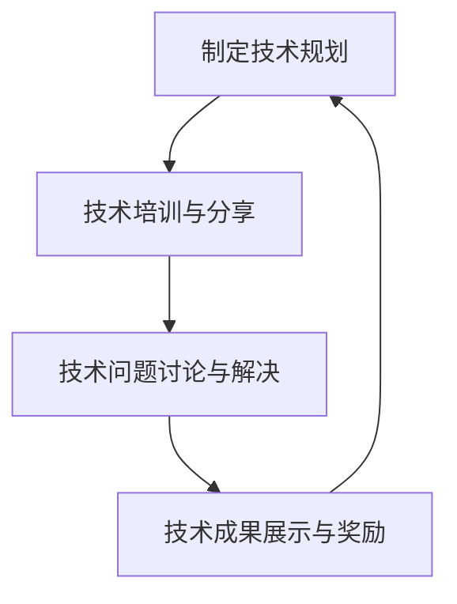
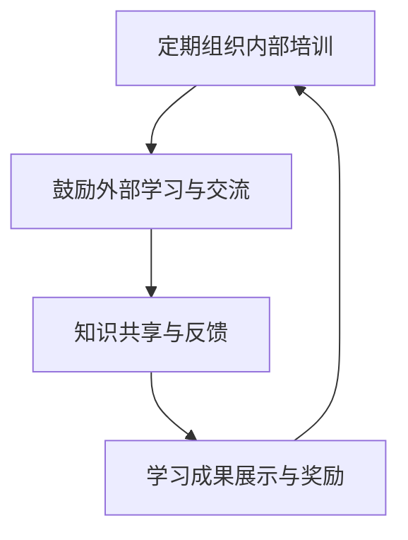
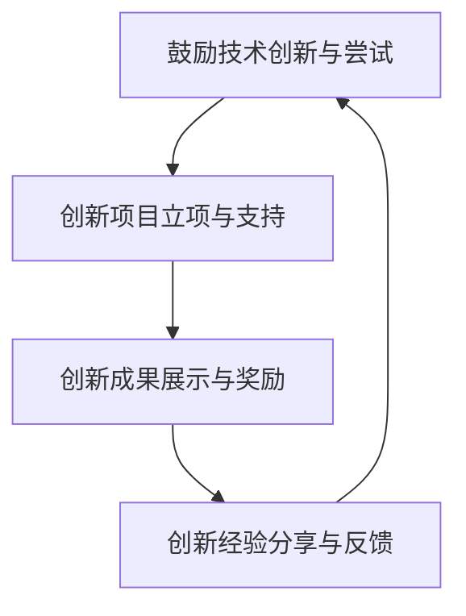

                 

# AI创业公司的技术团队文化建设：技术氛围、学习氛围与创新氛围

> **关键词：** AI创业公司、技术团队文化、技术氛围、学习氛围、创新氛围

> **摘要：** 本文将探讨AI创业公司技术团队文化的建设，从技术氛围、学习氛围与创新氛围三个角度出发，详细解析如何构建一个高效、创新的技术团队文化，促进公司发展。

## 1. 背景介绍

随着人工智能技术的快速发展，越来越多的创业公司投身于这一领域。对于AI创业公司而言，技术团队的建设至关重要。一个高效、创新的技术团队不仅能够提高公司的核心竞争力，还能够推动整个行业的进步。因此，如何构建一个良好的技术团队文化，成为许多创业公司面临的重要课题。

技术团队文化主要包括技术氛围、学习氛围与创新氛围三个方面。技术氛围是指团队内部对技术问题的关注程度和解决能力；学习氛围是指团队成员持续学习和成长的动力和环境；创新氛围则是指团队在技术探索和创新方面的积极性和创造力。本文将从这三个方面详细探讨如何构建一个良好的技术团队文化。

## 2. 核心概念与联系

### 2.1 技术氛围

技术氛围是指团队内部对技术问题的关注程度和解决能力。一个良好的技术氛围能够激发团队成员的求知欲和解决问题的能力，从而提高团队的整体技术水平。以下是一个简化的技术氛围构建流程：



### 2.2 学习氛围

学习氛围是指团队成员持续学习和成长的动力和环境。在AI创业公司中，学习氛围的重要性不言而喻。以下是一个简化的学习氛围构建流程：



### 2.3 创新氛围

创新氛围是指团队在技术探索和创新方面的积极性和创造力。一个良好的创新氛围能够激发团队成员的创新意识，推动技术突破和产品创新。以下是一个简化的创新氛围构建流程：



## 3. 核心算法原理 & 具体操作步骤

### 3.1 构建技术氛围

构建技术氛围的核心算法可以概括为以下几点：

1. **制定技术规划**：明确团队的技术目标和方向，为团队成员提供清晰的指引。
2. **技术培训与分享**：定期组织内部培训和技术分享，提高团队成员的技术能力。
3. **技术问题讨论与解决**：鼓励团队成员积极参与技术问题的讨论，共同解决问题。
4. **技术成果展示与奖励**：设立技术成果展示平台和奖励机制，激励团队成员的技术创新。

### 3.2 构建学习氛围

构建学习氛围的核心算法可以概括为以下几点：

1. **定期组织内部培训**：根据团队成员的需求，定期组织内部培训，提高团队成员的专业素养。
2. **鼓励外部学习与交流**：鼓励团队成员参加外部学习与交流活动，拓宽视野，吸收新的知识。
3. **知识共享与反馈**：建立知识共享平台，鼓励团队成员分享知识和经验，并进行及时的反馈。
4. **学习成果展示与奖励**：设立学习成果展示平台和奖励机制，激励团队成员的学习热情。

### 3.3 构建创新氛围

构建创新氛围的核心算法可以概括为以下几点：

1. **鼓励技术创新与尝试**：鼓励团队成员进行技术创新和尝试，给予必要的支持和资源。
2. **创新项目立项与支持**：设立创新项目立项机制，支持有潜力的创新项目。
3. **创新成果展示与奖励**：设立创新成果展示平台和奖励机制，激励团队成员的创新成果。
4. **创新经验分享与反馈**：定期组织创新经验分享会，鼓励团队成员交流创新经验，并进行及时的反馈。

## 4. 数学模型和公式 & 详细讲解 & 举例说明

### 4.1 技术氛围的数学模型

技术氛围的构建可以视为一个动态平衡的过程。以下是一个简化的数学模型：

$$
F(t) = f_1(t) \cdot f_2(t) \cdot f_3(t)
$$

其中，$F(t)$表示技术氛围在时间$t$的强度，$f_1(t)$、$f_2(t)$和$f_3(t)$分别表示技术规划、技术培训与分享、技术问题讨论与解决的强度。

举例说明：

假设在某一个月末，技术氛围的三个组成部分的强度分别为$f_1(30) = 0.8$、$f_2(30) = 0.9$和$f_3(30) = 0.75$，则该月的技术氛围强度为：

$$
F(30) = 0.8 \cdot 0.9 \cdot 0.75 = 0.54
$$

### 4.2 学习氛围的数学模型

学习氛围的构建也可以视为一个动态平衡的过程。以下是一个简化的数学模型：

$$
L(t) = l_1(t) \cdot l_2(t) \cdot l_3(t)
$$

其中，$L(t)$表示学习氛围在时间$t$的强度，$l_1(t)$、$l_2(t)$和$l_3(t)$分别表示定期组织内部培训、鼓励外部学习与交流、知识共享与反馈的强度。

举例说明：

假设在某一个月末，学习氛围的三个组成部分的强度分别为$l_1(30) = 0.8$、$l_2(30) = 0.9$和$l_3(30) = 0.7$，则该月的学习氛围强度为：

$$
L(30) = 0.8 \cdot 0.9 \cdot 0.7 = 0.504
$$

### 4.3 创新氛围的数学模型

创新氛围的构建也可以视为一个动态平衡的过程。以下是一个简化的数学模型：

$$
I(t) = i_1(t) \cdot i_2(t) \cdot i_3(t)
$$

其中，$I(t)$表示创新氛围在时间$t$的强度，$i_1(t)$、$i_2(t)$和$i_3(t)$分别表示鼓励技术创新与尝试、创新项目立项与支持、创新成果展示与奖励的强度。

举例说明：

假设在某一个月末，创新氛围的三个组成部分的强度分别为$i_1(30) = 0.8$、$i_2(30) = 0.9$和$i_3(30) = 0.75$，则该月的创新氛围强度为：

$$
I(30) = 0.8 \cdot 0.9 \cdot 0.75 = 0.54
$$

## 5. 项目实战：代码实际案例和详细解释说明

### 5.1 开发环境搭建

为了更好地理解技术团队文化建设的具体实施过程，我们以一个实际项目为例，介绍如何搭建开发环境。

#### 5.1.1 环境准备

1. 安装Python环境
2. 安装相关依赖库（如TensorFlow、PyTorch等）

#### 5.1.2 搭建项目结构

创建一个名为`tech_culture`的目录，并在该目录下创建以下文件和文件夹：

- `README.md`：项目简介和文档
- `data/`：数据集
- `models/`：模型代码
- `train.py`：训练脚本
- `evaluate.py`：评估脚本

#### 5.1.3 源代码详细实现和代码解读

**models/mnist_classifier.py**

```python
import tensorflow as tf

def build_mnist_classifier():
    # 定义输入层
    inputs = tf.keras.layers.Input(shape=(28, 28), name="inputs")

    # 定义卷积层
    conv1 = tf.keras.layers.Conv2D(filters=32, kernel_size=(3, 3), activation="relu", name="conv1")(inputs)
    pool1 = tf.keras.layers.MaxPooling2D(pool_size=(2, 2), name="pool1")(conv1)

    # 定义全连接层
    flatten = tf.keras.layers.Flatten()(pool1)
    dense1 = tf.keras.layers.Dense(units=128, activation="relu", name="dense1")(flatten)
    outputs = tf.keras.layers.Dense(units=10, activation="softmax", name="outputs")(dense1)

    # 创建模型
    model = tf.keras.Model(inputs=inputs, outputs=outputs)

    return model
```

**train.py**

```python
import tensorflow as tf
from models.mnist_classifier import build_mnist_classifier
from tensorflow.keras.datasets import mnist
from tensorflow.keras.optimizers import Adam

# 加载MNIST数据集
(x_train, y_train), (x_test, y_test) = mnist.load_data()

# 预处理数据
x_train = x_train.astype("float32") / 255.0
x_test = x_test.astype("float32") / 255.0
x_train = x_train.reshape(-1, 28, 28, 1)
x_test = x_test.reshape(-1, 28, 28, 1)

# 创建模型
model = build_mnist_classifier()

# 编译模型
model.compile(optimizer=Adam(learning_rate=0.001), loss="sparse_categorical_crossentropy", metrics=["accuracy"])

# 训练模型
model.fit(x_train, y_train, batch_size=128, epochs=10, validation_split=0.1)
```

### 5.3 代码解读与分析

**models/mnist_classifier.py**

该文件定义了一个用于手写数字分类的简单卷积神经网络（CNN）模型。模型的主要结构包括输入层、卷积层、池化层和全连接层。

- 输入层：接收28x28的手写数字图像。
- 卷积层：使用3x3的卷积核，卷积后得到32个特征图。
- 池化层：使用2x2的最大池化，减小特征图的尺寸。
- 全连接层：将池化层输出的特征图展开成一维，然后通过一个128个神经元的全连接层，最后通过一个10个神经元的全连接层输出分类结果。

**train.py**

该文件用于训练模型。主要步骤包括：

1. 加载MNIST数据集，并进行预处理。
2. 创建模型，并编译模型，设置优化器和损失函数。
3. 使用训练数据训练模型，并使用验证数据验证模型性能。

## 6. 实际应用场景

在AI创业公司中，技术团队文化建设具有广泛的应用场景。以下是一些具体的应用实例：

1. **技术研发**：技术氛围的构建能够激发团队成员对技术问题的关注和解决能力，提高团队的技术研发效率。
2. **人才培养**：学习氛围的构建能够激发团队成员的学习热情，提高团队的整体专业素养。
3. **产品创新**：创新氛围的构建能够激发团队成员的创新意识，推动产品的技术突破和产品创新。

## 7. 工具和资源推荐

### 7.1 学习资源推荐

- **书籍**：《深度学习》（Goodfellow et al., 2016）、《强化学习》（Sutton and Barto, 2018）
- **论文**：NIPS、ICML、ACL等顶级会议和期刊的论文
- **博客**：顶级技术博客，如TensorFlow、PyTorch官方博客

### 7.2 开发工具框架推荐

- **开发工具**：Python、TensorFlow、PyTorch
- **框架**：Keras、TensorFlow.js、TensorFlow Lite

### 7.3 相关论文著作推荐

- **论文**：《深度学习的数学原理》（Goodfellow et al., 2016）、《人工智能：一种现代方法》（Russell and Norvig, 2016）
- **著作**：《Python深度学习》（François Chollet, 2017）、《机器学习实战》（Bogoyevskyi et al., 2017）

## 8. 总结：未来发展趋势与挑战

在未来，AI创业公司的技术团队文化建设将继续面临新的发展趋势和挑战。一方面，随着技术的不断进步，团队成员需要不断学习新的知识，提高自身的技术能力；另一方面，创业公司需要不断创新，以满足市场需求和行业竞争。因此，如何构建一个可持续、高效的技术团队文化，成为AI创业公司面临的重要课题。

## 9. 附录：常见问题与解答

### 9.1 技术氛围建设相关问题

**Q1：如何提高团队成员的技术兴趣？**

A1：可以通过组织技术沙龙、技术竞赛等活动，激发团队成员的技术兴趣，提高技术氛围。

### 9.2 学习氛围建设相关问题

**Q1：如何确保团队成员持续学习？**

A1：可以制定学习计划，定期组织内部培训，鼓励团队成员参加外部学习与交流活动。

### 9.3 创新氛围建设相关问题

**Q1：如何激发团队成员的创新意识？**

A1：可以通过设立创新项目立项机制，鼓励团队成员提出创新想法，并为创新项目提供必要的支持。

## 10. 扩展阅读 & 参考资料

- **参考资料**：Goodfellow, I., Bengio, Y., & Courville, A. (2016). *Deep Learning*.
- **参考资料**：Sutton, R. S., & Barto, A. G. (2018). *Reinforcement Learning: An Introduction*.
- **参考资料**：Bogoyevskyi, A., Gullapalli, K., Vych Idid, A., et al. (2017). *Machine Learning Mastery with Python*.
- **参考资料**：François Chollet. (2017). *Deep Learning with Python*.

