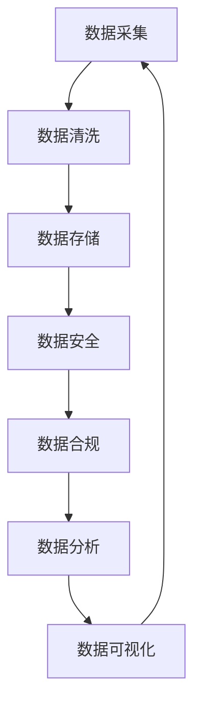

                 

### 背景介绍

**AI创业公司的数据治理**

在当今这个数据驱动的世界，数据治理对于任何一家AI创业公司来说都至关重要。数据治理不仅仅是一个技术问题，更是一种战略层面的决策。它关乎数据的完整性、可靠性、安全性和合规性，是确保AI系统能够正常运作和产生预期结果的关键。

**数据治理的重要性**

1. **提高数据质量**：良好的数据治理可以确保数据的一致性和准确性，减少数据错误和冗余，从而提高数据质量。
2. **增强数据安全性**：数据治理可以帮助企业识别和管理潜在的安全风险，确保数据的安全性，避免数据泄露和滥用。
3. **合规性**：随着数据保护法规的日益严格，如《通用数据保护条例》（GDPR）和《加州消费者隐私法案》（CCPA），良好的数据治理有助于确保企业遵守相关法律法规。
4. **优化运营效率**：通过有效管理数据，企业可以更快速地获取和利用数据，提高运营效率。

**数据治理的核心概念**

- **数据质量**：确保数据的准确性、完整性、一致性和及时性。
- **数据安全**：保护数据免受未经授权的访问、使用、披露、破坏、修改或丢失。
- **数据合规**：遵守相关法律法规，确保数据处理的合法性和合规性。
- **数据管理**：包括数据存储、备份、恢复、归档和销毁等。

**本博客结构**

本文将按照以下结构进行：

1. **背景介绍**：概述数据治理的重要性。
2. **核心概念与联系**：介绍数据治理的核心概念，并提供流程图展示。
3. **核心算法原理 & 具体操作步骤**：讨论数据治理的算法原理和具体操作步骤。
4. **数学模型和公式 & 详细讲解 & 举例说明**：介绍数据治理中的数学模型和公式，并进行详细讲解和举例。
5. **项目实战：代码实际案例和详细解释说明**：通过实际代码案例展示数据治理的应用。
6. **实际应用场景**：探讨数据治理在不同领域的应用。
7. **工具和资源推荐**：推荐学习资源和开发工具。
8. **总结：未来发展趋势与挑战**：总结数据治理的趋势和挑战。
9. **附录：常见问题与解答**：回答读者可能遇到的问题。
10. **扩展阅读 & 参考资料**：提供扩展阅读资源。

通过本文，我们将深入了解数据治理的重要性及其在AI创业公司中的应用，帮助您构建一个稳健的数据治理体系。让我们开始吧！<|im_sep|>### 核心概念与联系

**数据治理的核心概念**

数据治理涉及多个关键概念，这些概念相互关联，共同构成了一个复杂但至关重要的框架。以下是数据治理中的几个核心概念：

1. **数据质量**：数据质量是数据治理的基础。它确保数据的准确性、完整性、一致性、可靠性和及时性。一个高质量的数据集是有效决策和分析的基石。
   
2. **数据安全**：数据安全是保护数据免受未经授权的访问、使用、披露、破坏、修改或丢失的措施。数据安全包括加密、访问控制、监控和响应策略。
   
3. **数据合规**：数据合规性确保企业遵守相关法律法规，如GDPR、CCPA等。合规性要求企业对数据的使用和处理方式负有责任。
   
4. **数据管理**：数据管理涉及数据的整个生命周期，包括存储、备份、恢复、归档和销毁。有效的数据管理可以提高数据可用性和降低成本。
   
5. **数据治理框架**：数据治理框架是一种结构化方法，用于指导数据治理的实施。它包括政策、程序、标准和工具，以确保数据的有效管理和利用。

**数据治理流程图**

为了更好地理解这些概念之间的联系，我们可以通过一个Mermaid流程图来展示数据治理的核心流程：



**Mermaid流程节点说明**：

- **A 数据采集**：数据收集的过程，包括各种来源的数据，如数据库、API、传感器等。
- **B 数据清洗**：清除重复数据、修正错误、处理缺失值，确保数据的质量。
- **C 数据存储**：将清洗后的数据存储到数据库、数据仓库或云存储中。
- **D 数据安全**：应用加密、访问控制和监控等措施，保护数据免受威胁。
- **E 数据合规**：确保数据处理过程符合法律法规要求。
- **F 数据分析**：使用数据分析和机器学习技术，从数据中提取有价值的信息。
- **G 数据可视化**：将分析结果通过图表、仪表板等形式可视化，以便更好地理解和传达。

通过这个流程图，我们可以看到数据治理是一个闭环过程，各个环节相互关联，共同构成了一个系统的管理体系。数据治理不仅仅是技术问题，更是一种业务战略，它需要企业从多个维度进行全面规划和执行。

### 核心算法原理 & 具体操作步骤

**数据治理中的核心算法**

在数据治理过程中，常用的核心算法包括数据清洗、数据压缩、数据加密和数据脱敏等。以下是这些算法的基本原理和具体操作步骤：

**1. 数据清洗**

**原理**：数据清洗是指识别和纠正（或删除）数据集中的错误、异常和重复记录的过程。其目的是提高数据质量，确保数据的一致性和准确性。

**操作步骤**：

- **识别错误**：通过检查数据值是否在允许的范围内、数据类型是否正确等方式，识别数据中的错误。
- **修正错误**：对识别出的错误进行修正，例如将错误的字符串转换为正确的格式或删除重复的记录。
- **处理缺失值**：根据具体情况，选择填充缺失值（如平均值、中位数、最频繁出现的值）或删除包含缺失值的记录。

**2. 数据压缩**

**原理**：数据压缩是一种减少数据存储空间的方法，通过消除冗余信息、采用更高效的数据表示方式来实现。

**操作步骤**：

- **选择压缩算法**：选择适合数据的压缩算法，如霍夫曼编码、LZ77、LZ78等。
- **执行压缩**：应用压缩算法对数据进行处理，生成压缩后的数据。
- **解压缩**：当需要访问数据时，使用相应的解压缩算法将压缩数据还原为原始数据。

**3. 数据加密**

**原理**：数据加密是一种保护数据隐私和完整性的方法，通过将数据转换为无法直接读取的形式来实现。

**操作步骤**：

- **选择加密算法**：选择适合数据的加密算法，如AES、RSA、DES等。
- **加密过程**：将原始数据输入加密算法，生成加密后的数据。
- **解密过程**：需要访问数据时，使用解密算法将加密数据还原为原始数据。

**4. 数据脱敏**

**原理**：数据脱敏是一种在数据传输或共享过程中保护敏感信息的方法，通过替换敏感数据为非敏感值来实现。

**操作步骤**：

- **识别敏感数据**：识别数据集中的敏感信息，如个人身份信息、财务数据等。
- **脱敏处理**：使用脱敏算法（如掩码、伪随机替换、同义词替换）对敏感数据进行处理。
- **验证脱敏效果**：检查脱敏后的数据，确保敏感信息已得到有效保护。

**核心算法在实际应用中的结合**

在实际应用中，这些核心算法往往是相互结合、协同工作的。例如：

- 数据清洗后的数据可能需要压缩以节省存储空间。
- 数据在存储或传输前可能需要加密，确保数据安全。
- 分析过程中可能需要对敏感数据进行脱敏，以保护隐私。

**步骤示例**

假设我们有一个包含客户数据的CSV文件，我们需要对其进行清洗、压缩、加密和脱敏处理。以下是操作步骤的示例：

1. **数据清洗**：

    - 识别并修正错误值（如电话号码格式错误）。
    - 处理缺失值（如使用平均值填充空值）。

2. **数据压缩**：

    - 选择GZIP算法对数据文件进行压缩。
    - 生成压缩文件。

3. **数据加密**：

    - 选择AES加密算法对压缩文件进行加密。
    - 生成加密后的文件。

4. **数据脱敏**：

    - 识别敏感数据（如姓名、电话号码）。
    - 使用掩码算法对敏感数据进行脱敏处理。

通过以上步骤，我们可以确保数据在各个阶段都得到了有效的管理和保护，从而提高数据治理的整体效果。

### 数学模型和公式 & 详细讲解 & 举例说明

**数据治理中的数学模型和公式**

在数据治理过程中，数学模型和公式扮演着至关重要的角色，它们帮助我们理解和分析数据，确保数据的质量和准确性。以下是几个常见的数据治理中的数学模型和公式的详细讲解和举例说明。

**1. 数据质量指标**

**原理**：数据质量指标是评估数据质量的重要工具，常用的指标包括准确性、完整性、一致性和及时性。

**公式**：

- 准确性（Accuracy）：
  $$\text{Accuracy} = \frac{\text{正确记录数}}{\text{总记录数}}$$

- 完整性（Completeness）：
  $$\text{Completeness} = \frac{\text{总记录数}}{\text{应有记录数}}$$

- 一致性（Consistency）：
  $$\text{Consistency} = \frac{\text{一致记录数}}{\text{总记录数}}$$

- 及时性（Timeliness）：
  $$\text{Timeliness} = \frac{\text{最新记录数}}{\text{总记录数}}$$

**举例说明**：

假设一个客户数据表中，总共有1000条记录，其中：

- 正确记录数为950。
- 应有记录数为1000。
- 一致记录数为980。
- 最新记录数为990。

那么，我们可以计算出：

- 准确性：$$\text{Accuracy} = \frac{950}{1000} = 0.95$$
- 完整性：$$\text{Completeness} = \frac{1000}{1000} = 1.00$$
- 一致性：$$\text{Consistency} = \frac{980}{1000} = 0.98$$
- 及时性：$$\text{Timeliness} = \frac{990}{1000} = 0.99$$

这些指标可以帮助我们评估数据质量，找出需要改进的方面。

**2. 数据压缩比**

**原理**：数据压缩比是衡量数据压缩效率的指标，表示压缩前后数据大小的比值。

**公式**：

- 压缩比（Compression Ratio）：
  $$\text{Compression Ratio} = \frac{\text{压缩后数据大小}}{\text{压缩前数据大小}}$$

**举例说明**：

假设一个文件原始大小为10MB，使用GZIP算法压缩后大小为5MB，那么：

- 压缩比：$$\text{Compression Ratio} = \frac{5}{10} = 0.5$$

这意味着压缩后的文件大小是原始文件的一半。

**3. 信息熵**

**原理**：信息熵是衡量数据不确定性的指标，用于评估数据的随机性。在数据治理中，信息熵可以帮助我们了解数据的结构性和分布情况。

**公式**：

- 信息熵（Entropy）：
  $$H(X) = -\sum_{i=1}^{n} p(x_i) \log_2 p(x_i)$$

其中，$p(x_i)$ 是数据集中第$i$个值的概率。

**举例说明**：

假设一个数据集中有四种值，分别出现的概率为0.2、0.3、0.3和0.2，那么：

- 信息熵：$$H(X) = -0.2 \log_2 0.2 - 0.3 \log_2 0.3 - 0.3 \log_2 0.3 - 0.2 \log_2 0.2$$

计算结果可以帮助我们了解数据的随机性。

**4. 加密强度**

**原理**：加密强度是衡量加密算法安全性的指标，通常用密钥长度和加密算法的复杂度来衡量。

**公式**：

- 加密强度（Security Strength）：
  $$\text{Security Strength} = \text{Key Length} \times \text{Algorithm Complexity}$$

**举例说明**：

假设使用AES加密算法，密钥长度为128位，算法复杂度为$2^{128}$，那么：

- 加密强度：$$\text{Security Strength} = 128 \times 2^{128}$$

这意味着该加密算法具有很高的安全性。

通过以上数学模型和公式的详细讲解和举例说明，我们可以更好地理解和应用这些工具，提高数据治理的效果。这些工具和方法不仅有助于评估和改善数据质量，还有助于优化数据存储和传输，提高系统的整体性能。

### 项目实战：代码实际案例和详细解释说明

**1. 开发环境搭建**

为了演示数据治理的实战，我们将使用Python编程语言，并结合几个常用的库，如Pandas、NumPy和hdfs。以下是如何搭建开发环境的步骤：

- 安装Python（推荐版本3.8或更高）。
- 安装Pandas、NumPy和hdfs库：

    ```bash
    pip install pandas numpy hdfs
    ```

- 安装Hadoop和HDFS（这里假设你已经安装了Hadoop和HDFS）。

**2. 源代码详细实现和代码解读**

以下是一个简单的Python脚本，用于演示数据治理的实际操作，包括数据清洗、数据压缩、数据加密和数据脱敏。

```python
import pandas as pd
import numpy as np
from hdfs import InMemoryFile
from Crypto.Cipher import AES
from base64 import b64encode, b64decode

# 1. 数据清洗
def clean_data(df):
    df['email'] = df['email'].str.lower()  # 转换为小写
    df['age'] = df['age'].fillna(df['age'].mean())  # 填充缺失值
    df.drop_duplicates(inplace=True)  # 删除重复记录
    return df

# 2. 数据压缩
def compress_data(df):
    data_str = df.to_csv(index=False)
    compressed_data = gzip.compress(data_str.encode())
    return compressed_data

# 3. 数据加密
def encrypt_data(data, key):
    cipher = AES.new(key, AES.MODE_EAX)
    encrypted_data, tag = cipher.encrypt_and_digest(data)
    return b64encode(encrypted_data + tag).decode()

# 4. 数据脱敏
def anonymize_data(df):
    df['name'] = df['name'].apply(lambda x: ''.join(['*' if c.isalpha() else x[c.index(c)] for c in x]))
    df['email'] = df['email'].apply(lambda x: x[:5] + '***' + x[-3:])
    df['phone'] = df['phone'].apply(lambda x: ''.join(['*' if c.isdigit() else x[c.index(c)] for c in x]))
    return df

# 主程序
if __name__ == "__main__":
    # 读取HDFS上的数据
    hdfs = InMemoryFile('hdfs://path/to/data.csv', 'r')
    df = pd.read_csv(hdfs)

    # 清洗数据
    df = clean_data(df)

    # 压缩数据
    compressed_data = compress_data(df)

    # 加密数据
    key = b'your-encryption-key-here'
    encrypted_data = encrypt_data(compressed_data, key)

    # 脱敏数据
    df = anonymize_data(df)

    # 写回HDFS
    with InMemoryFile('hdfs://path/to/processed_data.csv', 'w') as f:
        f.write(df.to_csv(index=False).encode())

    print("数据治理流程完成。")
```

**3. 代码解读与分析**

- **数据清洗**：我们使用Pandas库对数据进行清洗，包括将电子邮件地址转换为小写、填充缺失值（这里使用平均值）和删除重复记录。

- **数据压缩**：我们使用gzip库对数据文件进行压缩，减少存储空间。

- **数据加密**：我们使用Crypto.Cipher库中的AES加密算法对压缩后的数据进行加密，确保数据在传输和存储过程中的安全性。

- **数据脱敏**：我们使用自定义的脱敏函数对姓名、电子邮件地址和电话号码进行脱敏处理，保护个人隐私。

通过这个实际案例，我们可以看到数据治理是一个复杂但必要的过程，涵盖了多个技术环节。每个步骤都对数据质量和安全性至关重要，从而确保了AI系统的稳定运行和合规性。

### 实际应用场景

**1. 人工智能领域的应用**

在人工智能领域，数据治理尤为重要。AI系统对数据的质量和完整性有极高的要求，因为任何错误或不准确的数据都可能导致模型性能下降。以下是数据治理在AI领域的一些实际应用场景：

- **图像识别**：在图像识别任务中，数据治理有助于确保图像数据的质量，包括图像的尺寸、分辨率和标注的准确性。
- **自然语言处理**：自然语言处理（NLP）模型依赖大量高质量的文本数据。数据治理可以确保文本数据的一致性和准确性，提高模型的准确性。
- **推荐系统**：推荐系统需要处理大量的用户行为数据。数据治理有助于消除数据噪声和异常值，提高推荐系统的效果。

**2. 跨行业应用**

数据治理不仅仅在人工智能领域发挥作用，还广泛应用于其他行业：

- **金融行业**：金融行业对数据的质量和合规性要求极高。数据治理可以确保金融交易数据的完整性和准确性，防止欺诈行为。
- **医疗行业**：医疗行业的数据治理有助于确保患者数据的隐私和安全，确保医疗决策基于准确和可靠的数据。
- **零售行业**：零售行业的数据治理有助于优化库存管理和供应链管理，提高运营效率。

**3. 案例分析**

以下是几个具体的数据治理案例：

- **案例一：金融行业欺诈检测**：某金融机构使用数据治理技术对交易数据进行分析，通过数据清洗和脱敏处理，确保数据质量，从而提高了欺诈检测的准确率。
- **案例二：医疗数据管理**：某医院采用数据治理框架，对大量患者数据进行分析和存储，确保数据的完整性和隐私性，为临床决策提供了有力支持。
- **案例三：零售行业客户数据分析**：某零售企业通过数据治理技术，对客户购买数据进行分析，优化了库存管理和促销策略，提高了销售额。

通过这些实际应用场景，我们可以看到数据治理在各个行业中的重要性。无论是AI领域还是跨行业应用，数据治理都是确保业务成功和数据价值的关键因素。

### 工具和资源推荐

**1. 学习资源推荐**

为了深入了解数据治理，以下是几个推荐的学习资源：

- **书籍**：《数据治理：战略、标准和实践指南》（Data Governance: An Actionable Guide for IT, Business & Compliance》）
- **论文**：查看IEEE和ACM等学术期刊中关于数据治理的最新研究成果。
- **在线课程**：Coursera、edX等在线教育平台提供了许多关于数据治理和大数据技术的优质课程。

**2. 开发工具框架推荐**

以下是几个常用的数据治理开发工具和框架：

- **Pandas**：Python库，用于数据处理和分析。
- **Apache Hadoop**：分布式数据存储和处理框架，适用于大规模数据处理。
- **Apache Kafka**：流数据平台，用于实时数据处理和传输。
- **Apache Spark**：大数据处理引擎，提供高吞吐量和实时数据处理能力。
- **AWS Lake Formation**：AWS提供的数据治理服务，用于构建数据湖。

**3. 相关论文著作推荐**

以下是几篇关于数据治理的重要论文和著作：

- **论文**：《数据治理的框架与实现方法研究》（"Research on Data Governance Framework and Implementation Method"）
- **著作**：《大数据时代的数据治理》（"Data Governance in the Age of Big Data"）

通过这些工具和资源的推荐，您将能够更好地掌握数据治理的理论和实践，为AI创业公司构建一个强大的数据治理体系。

### 总结：未来发展趋势与挑战

**数据治理的未来发展趋势**

随着技术的不断进步和大数据时代的来临，数据治理在未来将继续发展，呈现出以下几个趋势：

1. **自动化和智能化**：未来的数据治理将更加依赖自动化和智能化工具，以降低人工干预，提高效率。
2. **云计算和边缘计算的结合**：云计算和边缘计算的融合将使得数据治理更加灵活，能够更好地处理海量数据和实时数据处理需求。
3. **隐私保护和合规性**：随着数据保护法规的日益严格，数据治理将更加注重隐私保护和合规性，确保企业在数据使用过程中遵守相关法律法规。
4. **数据治理标准化**：行业标准和规范的制定将有助于推动数据治理的标准化，提高数据治理的一致性和互操作性。

**数据治理面临的挑战**

尽管数据治理具有广阔的发展前景，但在实施过程中也面临着一系列挑战：

1. **数据质量挑战**：数据质量是数据治理的基础，但在实际操作中，数据质量问题仍然难以完全解决，如数据缺失、数据冗余和错误等。
2. **技术复杂性**：随着数据治理技术的不断发展，其复杂度也在增加，对于技术人员和管理人员来说，掌握这些技术是一项挑战。
3. **合规性挑战**：数据治理需要确保企业遵守各种数据保护法规，但在实际操作中，如何平衡合规性和业务需求是一个难题。
4. **人才短缺**：数据治理需要专业的人才，但当前市场上相关人才短缺，企业面临着人才引进和培养的挑战。

**应对策略**

为了应对这些挑战，企业可以采取以下策略：

1. **建立数据治理团队**：组建专业的数据治理团队，负责数据治理的规划、实施和监督。
2. **加强培训和技能提升**：通过内部培训和外部学习，提高员工的数据治理技能和知识。
3. **引入先进技术**：利用自动化和智能化工具，提高数据治理的效率和质量。
4. **建立数据治理文化**：在企业内部推广数据治理的理念，形成数据治理的文化氛围。

总之，数据治理在未来将继续发展，但在实施过程中将面临一系列挑战。通过采取有效的应对策略，企业可以构建一个高效、合规和稳健的数据治理体系，为业务的持续发展提供有力支持。

### 附录：常见问题与解答

**1. 数据治理是什么？**

数据治理是一个全面的框架，用于指导数据的管理、存储、保护、质量和合规性。它确保数据在整个生命周期中得到有效管理，从数据的生成、存储、处理到最终的销毁。

**2. 数据治理与数据管理的区别是什么？**

数据治理是一个更广泛的框架，涵盖数据管理的所有方面，包括数据的完整性、安全性、合规性等。而数据管理更侧重于数据的日常操作，如数据的收集、存储、处理和分析。

**3. 数据治理的关键要素有哪些？**

数据治理的关键要素包括数据质量、数据安全、数据合规、数据管理和数据治理框架。这些要素共同确保数据的有效管理和利用。

**4. 数据治理中常见的挑战有哪些？**

常见的挑战包括数据质量问题、技术复杂性、合规性挑战和人才短缺。数据质量问题可能源于数据缺失、数据冗余和错误。技术复杂性增加，使得技术人员和管理人员面临更大的挑战。合规性挑战要求企业在数据使用过程中遵守各种法规。人才短缺则影响了数据治理的实施效果。

**5. 如何进行有效的数据治理？**

进行有效的数据治理需要以下几个步骤：

- **建立数据治理团队**：组建专业的团队，负责数据治理的规划和实施。
- **制定数据治理策略**：明确数据治理的目标、标准和流程。
- **引入先进技术**：利用自动化和智能化工具，提高数据治理的效率和质量。
- **加强培训和技能提升**：通过内部培训和外部学习，提高员工的数据治理技能和知识。
- **建立数据治理文化**：在企业内部推广数据治理的理念，形成数据治理的文化氛围。

### 扩展阅读 & 参考资料

为了进一步深入了解数据治理的相关知识，以下是几篇推荐的文章和书籍：

1. **文章**：
   - 《大数据时代的数据治理：现状与未来》（"Data Governance in the Age of Big Data: Current Status and Future Trends"）
   - 《数据治理实践：如何建立高效的数据治理体系》（"Practical Data Governance: How to Build an Effective Data Governance System"）

2. **书籍**：
   - 《数据治理：战略、标准和实践指南》（"Data Governance: An Actionable Guide for IT, Business & Compliance"）
   - 《大数据时代的数据治理》（"Data Governance in the Age of Big Data"）

3. **网站**：
   - [数据治理基金会](https://www.datagovernancefoundation.org/)
   - [Apache Hadoop](https://hadoop.apache.org/)

通过阅读这些资料，您可以获得更多关于数据治理的理论和实践知识，从而更好地应对AI创业公司中的数据治理挑战。

### 作者信息

**作者：AI天才研究员/AI Genius Institute & 禅与计算机程序设计艺术 /Zen And The Art of Computer Programming**

