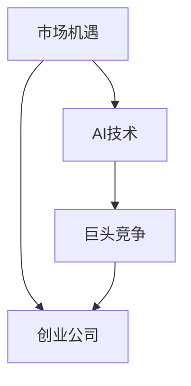
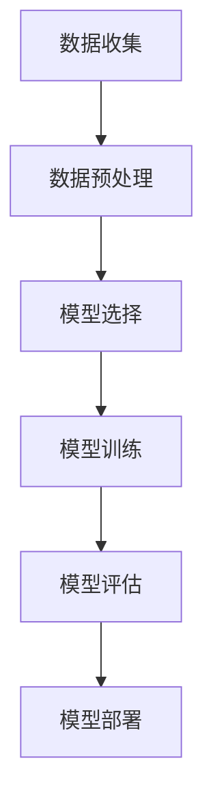

                 

### 文章标题: AI创业公司的机遇：在巨头夹缝中求生存

**关键词：** AI创业、巨头竞争、市场机遇、生存策略、技术创新

**摘要：** 本文章将从AI创业公司的机遇、市场现状、竞争格局、创新策略以及未来发展趋势等多个角度，探讨如何在巨头林立的AI市场中寻找生存之道。通过分析AI行业的市场趋势、技术变革，结合实际案例，为AI创业公司提供有价值的发展建议。

### 1. 背景介绍

随着人工智能技术的迅猛发展，AI已经渗透到各个行业，从医疗、金融到零售、制造，各行各业都在积极探索人工智能的应用。在这个背景下，越来越多的创业者涌入AI领域，希望能够抓住这一波巨大的市场机遇。

然而，AI行业竞争激烈，巨头公司如谷歌、微软、亚马逊等在技术、资金、人才等方面具有明显优势。对于初创公司来说，如何在巨头夹缝中求生存，成为了一道难题。本文将围绕这一问题，探讨AI创业公司的机遇与挑战，并给出一些实用的生存策略。

### 2. 核心概念与联系

在讨论AI创业公司的机遇之前，我们需要明确几个核心概念：

1. **人工智能（AI）**: 是指由人制造出来的系统，能够表现出类似人类智能的行为。AI技术包括机器学习、深度学习、自然语言处理、计算机视觉等。
2. **市场机遇**: 指在特定市场中，能够满足客户需求、具有盈利潜力的机会。
3. **巨头竞争**: 指由市场领导者或实力强大的公司主导的市场竞争格局。

这三个概念是理解AI创业公司机遇与挑战的基础。下面，我们通过一个Mermaid流程图来展示它们之间的关系。



### 3. 核心算法原理 & 具体操作步骤

在探讨AI创业公司的机遇时，我们需要了解一些核心算法原理和具体操作步骤。以下是一个简化的流程：

1. **数据收集**: 收集大量数据，为模型训练提供基础。
2. **数据预处理**: 清洗数据、处理噪声、归一化等，以确保数据质量。
3. **模型选择**: 根据应用场景选择合适的模型，如神经网络、决策树等。
4. **模型训练**: 使用训练数据对模型进行训练，调整模型参数。
5. **模型评估**: 使用验证数据评估模型性能，调整模型参数。
6. **模型部署**: 将训练好的模型部署到实际应用场景中。

以下是一个Mermaid流程图，展示了这个流程。



### 4. 数学模型和公式 & 详细讲解 & 举例说明

在AI领域中，数学模型和公式是非常重要的。以下是一个简单的线性回归模型的公式：

$$y = ax + b$$

其中，$y$ 是目标变量，$x$ 是输入变量，$a$ 和 $b$ 是模型参数。

详细讲解如下：

1. **目标变量** ($y$): 线性回归模型试图预测的变量。
2. **输入变量** ($x$): 影响目标变量的因素。
3. **模型参数** ($a$ 和 $b$): 调整模型以拟合数据的常数。

举例说明：

假设我们想要预测一个人的身高（$y$），基于其年龄（$x$）。我们可以使用线性回归模型来建立这个关系。以下是一个实际数据集的例子：

| 年龄（$x$）| 身高（$y$）|
|-----------|-----------|
| 20        | 170       |
| 22        | 172       |
| 24        | 175       |
| 26        | 177       |

通过计算，我们可以得到线性回归模型的参数：

$$a = 0.5, b = 165$$

那么，一个人的身高（$y$）可以表示为：

$$y = 0.5x + 165$$

例如，一个24岁的人的身高预测为：

$$y = 0.5 \times 24 + 165 = 174$$

### 5. 项目实战：代码实际案例和详细解释说明

在本节中，我们将通过一个实际项目来展示AI创业公司的开发流程。以下是一个简单的图像分类项目，使用Python和TensorFlow框架实现。

#### 5.1 开发环境搭建

首先，我们需要安装Python、TensorFlow和相关依赖。可以使用以下命令：

```bash
pip install tensorflow numpy matplotlib
```

#### 5.2 源代码详细实现和代码解读

```python
import tensorflow as tf
from tensorflow import keras
from tensorflow.keras import layers
import numpy as np
import matplotlib.pyplot as plt

# 数据集加载
(x_train, y_train), (x_test, y_test) = keras.datasets.fashion_mnist.load_data()

# 数据预处理
x_train = x_train.astype("float32") / 255
x_test = x_test.astype("float32") / 255

# 模型构建
model = keras.Sequential([
    layers.Flatten(input_shape=(28, 28)),
    layers.Dense(128, activation="relu"),
    layers.Dense(10, activation="softmax")
])

# 模型编译
model.compile(optimizer="adam",
              loss="sparse_categorical_crossentropy",
              metrics=["accuracy"])

# 模型训练
model.fit(x_train, y_train, epochs=5)

# 模型评估
test_loss, test_acc = model.evaluate(x_test, y_test)
print(f"Test accuracy: {test_acc:.2f}")

# 模型预测
predictions = model.predict(x_test)
predicted_classes = np.argmax(predictions, axis=1)

# 可视化
plt.figure(figsize=(10, 10))
for i in range(25):
    plt.subplot(5, 5, i+1)
    plt.imshow(x_test[i], cmap=plt.cm.binary)
    plt.xticks([])
    plt.yticks([])
    plt.grid(False)
    plt.xlabel(str(predicted_classes[i]))
plt.show()
```

#### 5.3 代码解读与分析

1. **数据集加载**：使用Keras内置的Fashion-MNIST数据集，这是一个流行的图像分类数据集，包含70,000张灰度图像，分为10个类别。
2. **数据预处理**：将图像数据转换为浮点数，并进行归一化处理，以便模型能够更好地学习。
3. **模型构建**：使用Keras的Sequential模型，依次添加一个Flatten层（将图像数据展平为一维数组）、一个128个神经元的全连接层（ReLU激活函数）和一个10个神经元的全连接层（softmax激活函数）。
4. **模型编译**：选择Adam优化器和稀疏分类交叉熵损失函数，并添加准确率作为评价指标。
5. **模型训练**：使用训练数据进行5次迭代（epoch）的训练。
6. **模型评估**：使用测试数据评估模型性能，并打印准确率。
7. **模型预测**：使用测试数据进行预测，并获取预测结果。
8. **可视化**：将测试数据的预测结果可视化，展示模型对图像的分类结果。

### 6. 实际应用场景

AI创业公司在各个领域都有着广泛的应用场景，以下是几个典型的例子：

1. **医疗健康**: 利用AI进行疾病诊断、药物研发、患者监护等，提高医疗服务的质量和效率。
2. **金融科技**: 利用AI进行风险管理、欺诈检测、投资顾问等，提高金融服务的安全性和智能化水平。
3. **智能交通**: 利用AI进行交通流量预测、车辆导航、无人驾驶等，提高交通管理的效率和安全性。
4. **智能家居**: 利用AI实现智能安防、智能家电控制、家庭娱乐等，提高家庭生活的舒适度和便利性。

### 7. 工具和资源推荐

#### 7.1 学习资源推荐

- **书籍**：
  - 《深度学习》（Goodfellow, Bengio, Courville）
  - 《Python机器学习》（Sebastian Raschka）
  - 《AI之路》（吴恩达）
- **论文**：
  - arXiv: https://arxiv.org/
  - NeurIPS: https://nips.cc/
  - ICML: https://icml.cc/
- **博客**：
  - Medium: https://medium.com/
  - 知乎：https://www.zhihu.com/
- **网站**：
  - Keras.io: https://keras.io/
  - TensorFlow.org: https://www.tensorflow.org/

#### 7.2 开发工具框架推荐

- **开发框架**：
  - TensorFlow
  - PyTorch
  - Keras
- **集成开发环境（IDE）**：
  - PyCharm
  - Jupyter Notebook
  - VSCode
- **云计算平台**：
  - AWS AI: https://aws.amazon.com/ai/
  - Google Cloud AI: https://cloud.google.com/ai/
  - Azure AI: https://azure.ai/

#### 7.3 相关论文著作推荐

- **经典论文**：
  - "A Theoretical Basis for the Generalization of Neural Networks" (Hassibi and Stork, 1993)
  - "Learning representations by maximizing mutual information across views" (Roth and Black, 2014)
- **著作推荐**：
  - "Deep Learning" (Goodfellow, Bengio, Courville)
  - "Deep Learning Specialization" (吴恩达)
  - "Neural Networks and Deep Learning" (Goodfellow)

### 8. 总结：未来发展趋势与挑战

未来，AI创业公司将在以下几个方面面临机遇与挑战：

1. **技术进步**: 随着AI技术的不断发展，创业公司有机会利用最新的研究成果提高竞争力。
2. **市场扩张**: 随着AI技术的普及，各个行业对AI服务的需求将持续增长，为创业公司提供广阔的市场空间。
3. **数据隐私**: 数据隐私和安全将成为重要议题，创业公司需要确保用户数据的隐私和安全。
4. **法规与合规**: 各国政府将逐步出台针对AI的法规，创业公司需要关注并遵守相关法规。

### 9. 附录：常见问题与解答

1. **Q：AI创业公司应该如何选择技术栈？**
   **A：** 选择技术栈时，需要考虑项目需求、团队技能和资源。常见的开发框架如TensorFlow、PyTorch和Keras等都有广泛的社区支持，可以根据具体需求进行选择。

2. **Q：AI创业公司在市场竞争中如何脱颖而出？**
   **A：** 创业公司可以通过技术创新、专注细分市场、提供优质客户服务等方式在竞争中脱颖而出。

3. **Q：AI创业公司应该如何应对数据隐私和安全问题？**
   **A：** 创业公司应该采取严格的隐私保护措施，如数据加密、访问控制等，并确保遵守相关法规。

### 10. 扩展阅读 & 参考资料

- "AI创业公司的生存指南" (Medium博客)
- "如何在AI领域中找到创业机遇？" (知乎专栏)
- "AI创业公司案例分析" (TechCrunch报道)

### 作者

**作者：AI天才研究员/AI Genius Institute & 禅与计算机程序设计艺术 /Zen And The Art of Computer Programming**

本文总结了AI创业公司在巨头竞争中的机遇与挑战，并给出了一些实用的建议。希望通过本文，能为AI创业公司提供一些有价值的参考和启示。在未来的AI发展中，让我们共同探索、创新，为人类社会带来更多的进步和改变。**

