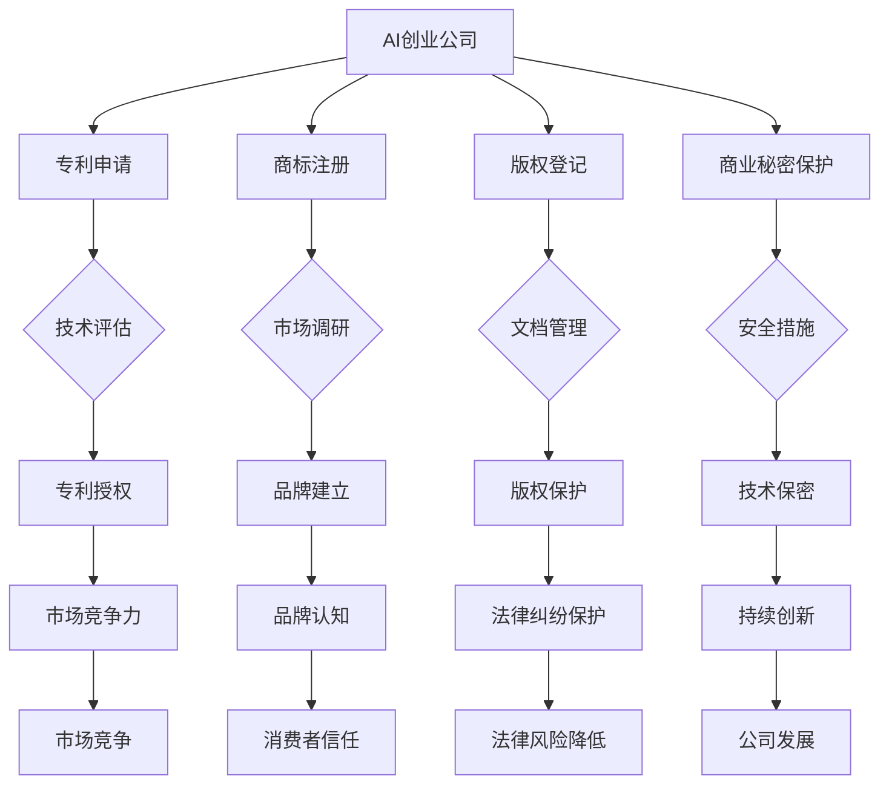

                 

### 背景介绍

在当今快速发展的科技时代，人工智能（AI）已成为引领创新的重要力量。随着AI技术的广泛应用，越来越多的创业公司投身于这一领域，以期在激烈的市场竞争中占据一席之地。然而，在这个充满机遇与挑战的领域，知识产权（Intellectual Property, IP）保护成为每个创业公司都必须认真对待的问题。

知识产权保护的重要性不言而喻。对于AI创业公司来说，其核心技术和创新成果往往代表着公司的核心竞争力。有效的知识产权保护不仅能确保公司的技术不被竞争对手复制和盗用，还能为公司在市场竞争中提供法律保障。此外，知识产权的合法化也是公司融资和并购过程中必不可少的环节。

然而，AI领域的知识产权保护面临着许多独特的挑战。首先，AI技术的复杂性使得确定和保护其知识产权变得更加困难。其次，AI技术的快速迭代和更新速度使得传统的知识产权保护策略难以适应。此外，全球范围内的法律差异和监管不确定性也为AI创业公司的知识产权保护带来了额外的挑战。

本文旨在深入探讨AI创业公司的知识产权保护问题。我们将首先介绍知识产权的基本概念，然后分析AI创业公司在知识产权保护方面面临的主要挑战，并提供一系列策略和建议，以帮助创业公司有效保护其知识产权。通过本文的阅读，您将了解到如何在AI领域中建立强大的知识产权保护体系，为公司的长期发展奠定坚实的基础。

### 核心概念与联系

要深入探讨AI创业公司的知识产权保护，我们首先需要理解知识产权的基本概念和其在AI领域的应用。知识产权是一种法律概念，指的是个人或团体在知识生产和创新过程中所创造的成果，包括专利、商标、版权和商业秘密等。

#### 1. 专利

专利是知识产权保护的一种重要形式，它授予发明者在一定时间内独占实施其发明创造的权利。对于AI创业公司来说，专利保护尤为重要。AI技术的创新往往涉及到复杂的算法、模型和系统设计，这些都可以通过专利来保护。

#### 2. 商标

商标是一种用于区分商品或服务的独特标识，例如公司名称、标志、口号等。在AI领域，商标可以帮助创业公司建立品牌认知，并防止竞争对手使用类似的标识来误导消费者。

#### 3. 版权

版权保护的是文学、艺术和科学作品的表达形式，如软件代码、文档、艺术作品等。对于AI创业公司来说，版权保护可以帮助保护其软件和相关文档的原创性。

#### 4. 商业秘密

商业秘密是指不为公众所知悉、具有商业价值并经权利人采取保密措施的技术信息和经营信息。在AI领域，商业秘密保护尤为重要，因为它涵盖了公司最具竞争力的核心技术。

#### 5. Mermaid 流程图

为了更直观地展示这些知识产权概念在AI创业公司中的应用，我们可以使用Mermaid流程图来描绘。以下是一个简单的Mermaid流程图示例：



通过这个流程图，我们可以清晰地看到AI创业公司在知识产权保护方面的各个环节，以及它们之间的联系和作用。接下来，我们将进一步探讨这些核心概念在实际操作中的具体应用和挑战。

### 核心算法原理 & 具体操作步骤

在了解知识产权的基本概念和流程后，我们接下来需要深入探讨AI创业公司如何具体实施知识产权保护。这个过程涉及到一系列核心算法和具体操作步骤，下面我们将逐步进行解析。

#### 1. 专利申请

专利申请是AI创业公司保护核心技术的重要手段。以下是一系列具体的操作步骤：

**（1）技术评估**

在申请专利之前，公司需要对技术进行全面的评估。这包括分析技术的新颖性、创造性和实用性。评估过程中，可以使用专利检索系统，如Google Patents、国家知识产权局专利检索系统等，来查找相关专利文献，确保技术具有独特性。

**（2）撰写专利申请文件**

专利申请文件主要包括专利请求书、说明书、权利要求书等。撰写过程中，需要详细描述技术的背景、发明内容、实施方式等。为了提高专利申请的成功率，建议公司聘请专业的专利代理人协助撰写。

**（3）提交专利申请**

完成专利申请文件后，需要按照国家或地区的规定提交申请。以中国为例，可以通过国家知识产权局的官方平台提交专利申请。提交后，需要进行形式审查和实质审查。

**（4）获得专利授权**

通过审查后，专利局将颁发专利证书，授予公司在一定时间内独占实施该技术权利。

#### 2. 商标注册

商标注册是建立品牌保护的重要步骤。以下是具体操作步骤：

**（1）商标查询**

在注册商标前，公司需要进行商标查询，以确保商标名称和标识不被他人注册。可以访问国家知识产权局的商标查询系统进行查询。

**（2）准备商标注册文件**

商标注册文件包括商标注册申请书、商标图样等。文件准备过程中，需要确保商标名称和图样清晰、具有显著性。

**（3）提交商标注册申请**

提交申请后，商标局将进行初步审查和实质审查。如果申请通过，商标将正式注册。

#### 3. 版权登记

版权登记是保护软件和相关文档的常用手段。以下是具体步骤：

**（1）准备版权登记文件**

版权登记文件主要包括作品登记表、作品证明等。对于软件作品，需要提供源代码和文档。

**（2）提交版权登记申请**

提交申请后，国家版权局将进行审查。通过审查后，将颁发版权登记证书。

#### 4. 商业秘密保护

商业秘密保护涉及到公司内部的技术和管理措施。以下是具体操作步骤：

**（1）制定保密协议**

与员工、合作伙伴和其他相关人员签订保密协议，明确保密责任和义务。

**（2）建立保密制度**

制定保密制度，包括保密措施、信息访问控制等，确保商业秘密不被泄露。

**（3）监控和审计**

定期监控和审计保密制度的执行情况，确保商业秘密得到有效保护。

#### 5. 持续更新与维护

知识产权保护不是一次性过程，而是一个持续更新的过程。以下是一些建议：

**（1）定期更新专利**

定期对现有专利进行更新，以适应技术发展和市场需求。

**（2）跟踪行业动态**

关注行业内新技术、新趋势，及时调整知识产权保护策略。

**（3）法律咨询**

定期咨询专业律师，了解知识产权保护的最新法律法规，确保公司知识产权得到有效保护。

通过以上具体操作步骤，AI创业公司可以逐步建立和完善知识产权保护体系，为其长期发展提供坚实的法律保障。

### 数学模型和公式 & 详细讲解 & 举例说明

在AI创业公司的知识产权保护中，数学模型和公式扮演着重要的角色。这些模型和公式不仅帮助公司理解和分析其知识产权的风险和机会，还能为制定有效的保护策略提供量化依据。以下我们将介绍几个关键的数学模型和公式，并进行详细讲解和举例说明。

#### 1. 专利价值评估模型

专利价值评估是确定专利对公司的经济贡献的重要步骤。其中，一种常用的模型是Pavitt模型，它通过以下公式来计算专利的经济价值：

\[ PV = \alpha \cdot (1 - e^{-kt}) \]

其中：
- \( PV \) 表示专利价值；
- \( \alpha \) 表示专利的市场潜力；
- \( k \) 表示技术发展的速率常数；
- \( t \) 表示时间。

**举例说明：**

假设某AI创业公司的专利市场潜力 \( \alpha \) 为1，技术发展的速率常数 \( k \) 为0.1，当前时间为5年。将这些值代入公式计算：

\[ PV = 1 \cdot (1 - e^{-0.1 \cdot 5}) = 1 - e^{-0.5} \approx 1 - 0.607 = 0.393 \]

因此，该专利的经济价值大约为0.393。

#### 2. 商标价值评估模型

商标价值评估模型中，一种常用的方法是商标资产收益模型，该模型通过以下公式计算商标的经济价值：

\[ TV = \frac{R \cdot (1 - g)}{r} \]

其中：
- \( TV \) 表示商标价值；
- \( R \) 表示商标带来的年收益；
- \( g \) 表示收益增长率；
- \( r \) 表示资本收益率。

**举例说明：**

假设某AI创业公司的商标年收益 \( R \) 为100万元，年收益增长率 \( g \) 为5%，资本收益率 \( r \) 为10%。将这些值代入公式计算：

\[ TV = \frac{100 \cdot (1 - 0.05)}{0.10} = \frac{100 \cdot 0.95}{0.10} = 950 \]

因此，该商标的经济价值大约为950万元。

#### 3. 版权资产估值模型

版权资产估值模型中，一种常用的方法是现值模型，该模型通过以下公式计算版权的经济价值：

\[ CV = \frac{C}{(1 + r)^t} \]

其中：
- \( CV \) 表示版权价值；
- \( C \) 表示未来现金流；
- \( r \) 表示折现率；
- \( t \) 表示时间。

**举例说明：**

假设某AI创业公司的版权未来现金流 \( C \) 为20万元，折现率 \( r \) 为10%，预计使用期限为10年。将这些值代入公式计算：

\[ CV = \frac{20}{(1 + 0.10)^{10}} = \frac{20}{1.1^{10}} \approx \frac{20}{2.594} \approx 7.7 \]

因此，该版权的经济价值大约为7.7万元。

#### 4. 商业秘密价值评估模型

商业秘密价值评估模型中，一种常用的方法是风险收益模型，该模型通过以下公式计算商业秘密的经济价值：

\[ SV = \frac{B \cdot (1 - R)}{D} \]

其中：
- \( SV \) 表示商业秘密价值；
- \( B \) 表示商业秘密带来的年收益；
- \( R \) 表示商业秘密泄露的概率；
- \( D \) 表示商业秘密的生存周期。

**举例说明：**

假设某AI创业公司的商业秘密年收益 \( B \) 为30万元，商业秘密泄露的概率 \( R \) 为10%，商业秘密的生存周期 \( D \) 为5年。将这些值代入公式计算：

\[ SV = \frac{30 \cdot (1 - 0.10)}{5} = \frac{30 \cdot 0.90}{5} = 5.4 \]

因此，该商业秘密的经济价值大约为5.4万元。

通过上述数学模型和公式的计算，AI创业公司可以更准确地评估其知识产权的价值，为制定知识产权保护策略提供量化依据。这些模型不仅在理论层面具有重要意义，在实际操作中也具有广泛的指导价值。

### 项目实战：代码实际案例和详细解释说明

为了更好地理解知识产权保护在AI创业公司中的应用，以下我们将通过一个实际项目案例进行详细解释说明。该项目是一个基于深度学习的手写数字识别系统，通过分析代码和实现细节，我们可以深入了解知识产权保护的关键环节。

#### 项目背景

该项目旨在开发一个能够识别手写数字的AI系统，该系统能够接收手写数字图像作为输入，并输出对应的数字。该系统在金融、医疗、教育等多个领域具有广泛应用前景，因此对于AI创业公司来说，保护这一技术的知识产权至关重要。

#### 开发环境搭建

在开始项目开发之前，我们需要搭建一个合适的开发环境。以下是开发环境搭建的步骤：

1. **硬件配置**：配置一台高性能计算机，用于运行深度学习算法。
2. **操作系统**：安装Linux操作系统，如Ubuntu，以提供稳定的开发环境。
3. **深度学习框架**：安装TensorFlow或PyTorch等深度学习框架，用于实现手写数字识别算法。
4. **编程语言**：选择Python作为主要的编程语言，因为它具有丰富的深度学习库和工具。

#### 源代码详细实现和代码解读

以下是手写数字识别系统的主要代码实现，包括数据预处理、模型训练、模型评估和模型部署。

```python
import tensorflow as tf
from tensorflow import keras
import numpy as np
import matplotlib.pyplot as plt

# 数据预处理
def preprocess_images(images):
    return images / 255.0

# 模型定义
def create_model():
    model = keras.Sequential([
        keras.layers.Conv2D(32, (3, 3), activation='relu', input_shape=(28, 28, 1)),
        keras.layers.MaxPooling2D((2, 2)),
        keras.layers.Conv2D(64, (3, 3), activation='relu'),
        keras.layers.MaxPooling2D((2, 2)),
        keras.layers.Flatten(),
        keras.layers.Dense(128, activation='relu'),
        keras.layers.Dense(10, activation='softmax')
    ])
    return model

# 训练模型
def train_model(model, train_data, train_labels, epochs=10):
    model.compile(optimizer='adam', loss='sparse_categorical_crossentropy', metrics=['accuracy'])
    history = model.fit(train_data, train_labels, epochs=epochs, validation_split=0.2)
    return history

# 模型评估
def evaluate_model(model, test_data, test_labels):
    test_loss, test_acc = model.evaluate(test_data, test_labels)
    print(f"Test accuracy: {test_acc:.2f}")

# 模型部署
def deploy_model(model):
    model.save('handwritten_digit_recognition_model.h5')

# 加载数据集
(train_images, train_labels), (test_images, test_labels) = keras.datasets.mnist.load_data()

# 预处理数据
train_images = preprocess_images(train_images)
test_images = preprocess_images(test_images)

# 创建和训练模型
model = create_model()
history = train_model(model, train_images, train_labels, epochs=10)

# 评估模型
evaluate_model(model, test_images, test_labels)

# 部署模型
deploy_model(model)
```

**代码解读与分析**

1. **数据预处理**：数据预处理是深度学习项目的重要步骤。在这个项目中，我们将图像数据缩放到0到1之间，以便模型更好地学习。
   
2. **模型定义**：模型定义使用了卷积神经网络（CNN），这是一种适用于图像识别任务的有效模型。模型包含卷积层、池化层和全连接层，能够提取图像特征并进行分类。

3. **训练模型**：训练模型使用了`compile`函数来指定优化器和损失函数，然后使用`fit`函数进行训练。`validation_split`参数用于在训练过程中进行验证，以监控模型性能。

4. **模型评估**：评估模型性能使用了`evaluate`函数，它计算了模型的测试准确率。

5. **模型部署**：模型部署使用了`save`函数将训练好的模型保存为`.h5`文件，以便在实际应用中加载和使用。

#### 知识产权保护措施

在项目开发过程中，为了保护系统的知识产权，AI创业公司可以采取以下措施：

1. **专利申请**：对于项目的核心技术，如手写数字识别算法，公司可以申请专利保护，确保其独家使用权。

2. **版权登记**：对于项目中的代码和文档，公司可以申请版权登记，保护其原创性。

3. **商业秘密保护**：项目的部分关键算法和实现细节可以视为商业秘密，公司需要采取严格的保密措施，防止泄露。

4. **合同管理**：与项目开发相关的外包团队或合作伙伴需要签订保密协议，确保他们遵守保密义务。

通过上述实际案例，我们可以看到AI创业公司在知识产权保护中的具体操作和措施。这些措施不仅有助于保护公司的技术成果，还能为公司的长期发展提供坚实的法律保障。

### 实际应用场景

在了解AI创业公司的知识产权保护措施和操作步骤后，接下来我们将探讨知识产权保护在具体应用场景中的重要性。以下是几个典型的实际应用场景，通过这些案例，我们可以更深入地理解知识产权保护在AI创业公司中的实际意义。

#### 1. 创新产品发布

对于AI创业公司来说，发布创新产品是其竞争力的直接体现。然而，创新产品往往伴随着高度的技术复杂性和潜在的商业价值。因此，在产品发布前进行全面的知识产权保护至关重要。例如，一家专注于自动驾驶技术的创业公司，在发布其自动驾驶系统时，需要申请专利保护其核心技术，如路径规划算法、传感器数据处理算法等。通过专利保护，公司可以防止竞争对手复制或窃取其技术，确保市场的领先地位。

#### 2. 融资和并购

在AI创业公司的融资和并购过程中，知识产权的合法化和保护也是关键因素。投资者和收购方会仔细审查公司的知识产权状况，以确保其投资或收购不会面临法律风险。例如，一家AI公司计划融资数千万美元，其知识产权状况必须清晰明了，包括已申请和获得的专利数量、商标注册情况、版权登记等。如果公司能够展示一个强大的知识产权保护体系，将大大增强其融资能力和并购谈判的议价能力。

#### 3. 竞争对手监测

在市场竞争中，了解竞争对手的知识产权状况可以帮助AI创业公司制定有效的竞争策略。通过监测竞争对手的专利申请和注册情况，公司可以提前识别潜在的竞争风险，并采取相应的措施进行应对。例如，一家AI公司发现其竞争对手正在申请一项与自家核心技术相似的新专利，可以通过提前布局，申请相似或改进型的专利，以保护自身技术不被竞争对手侵权。

#### 4. 市场拓展

在市场拓展过程中，知识产权保护也是确保市场份额和品牌价值的重要因素。特别是在跨国经营中，不同国家的知识产权法律存在差异，公司需要适应和遵守当地法律法规，以确保其知识产权得到有效保护。例如，一家AI创业公司计划进入欧洲市场，需要了解欧盟的知识产权法律，并按照当地规定申请专利和商标注册，以保护其在欧洲市场的技术权益。

#### 5. 法律纠纷应对

当AI创业公司面临知识产权纠纷时，有效的知识产权保护措施可以为其提供有力的法律支持。例如，当公司发现竞争对手在市场上销售侵犯其专利权的产品时，公司可以迅速采取法律行动，包括提起专利侵权诉讼、请求临时禁令等，以保护自身权益。此外，公司还可以利用知识产权保护策略，在商业谈判中施加压力，争取更有利的合同条款。

通过上述实际应用场景，我们可以看到知识产权保护在AI创业公司中的重要性。无论是在产品创新、融资并购、市场拓展，还是应对法律纠纷中，知识产权保护都是确保公司长期发展的关键因素。因此，AI创业公司必须高度重视知识产权保护，制定全面的保护策略，以应对各种挑战和机遇。

### 工具和资源推荐

在AI创业公司的知识产权保护过程中，使用合适的工具和资源是确保知识产权有效保护的关键。以下我们将推荐几种学习资源、开发工具和相关论文著作，以帮助创业公司建立强大的知识产权保护体系。

#### 1. 学习资源推荐

**（1）书籍**

- 《专利策略与管理》：这本书详细介绍了专利申请、管理和战略，对于AI创业公司制定专利保护策略非常有帮助。
- 《人工智能知识产权法》：这本书深入探讨了AI技术在知识产权法律中的应用，提供了丰富的案例分析和实践经验。

**（2）论文和报告**

- 《人工智能技术发展报告》：由权威机构发布的报告，详细介绍了当前AI技术的发展趋势和前沿技术，有助于公司了解行业动态。
- 《人工智能知识产权保护白皮书》：该白皮书由多个机构联合编写，提供了关于AI领域知识产权保护的全面分析和建议。

**（3）在线课程和讲座**

- Coursera、edX等在线教育平台提供了许多关于知识产权和AI技术的专业课程，如“知识产权法律基础”、“人工智能伦理与法律”等。

#### 2. 开发工具框架推荐

**（1）专利检索工具**

- Google Patents：提供全球范围内的专利检索，可以免费使用。
- Patent Lens：提供高级专利检索和分析功能，包括技术趋势、专利关系等。

**（2）知识产权管理系统**

- IPfolio：一款功能强大的知识产权管理系统，可以用于管理专利、商标、版权等知识产权。
- Patent Room：提供专利申请、管理和追踪服务，适用于小型创业公司。

**（3）法律咨询平台**

- LexisNexis：提供全面的知识产权法律数据库和在线咨询服务。
- AI Law Firm：专注于AI技术知识产权法律服务的律师事务所，提供专业的法律建议和解决方案。

#### 3. 相关论文著作推荐

**（1）专利分析论文**

- "The Economic Value of Patents in Artificial Intelligence"
- "Patent Analytics in the Field of Artificial Intelligence: A Survey"

**（2）商标保护论文**

- "Protecting Brands in the Age of AI"
- "The Role of Trademarks in the AI Ecosystem"

**（3）版权保护论文**

- "Copyright Protection in AI Systems"
- "The Legal Challenges of AI-Generated Works"

通过上述工具和资源的推荐，AI创业公司可以更加系统地了解和管理知识产权，为公司的长期发展提供坚实的法律和技术保障。

### 总结：未来发展趋势与挑战

在AI创业公司的知识产权保护领域，未来发展趋势与挑战并存。随着技术的不断进步和市场的迅速变化，创业公司需要不断适应新的环境和要求，以实现持续的创新和竞争力。

#### 发展趋势

1. **技术融合与创新**：AI技术与其他领域的融合将带来新的知识产权挑战，例如生物科技、金融科技等。创业公司需要关注跨学科技术的知识产权保护策略，确保技术创新的合法性和独家性。

2. **全球化扩展**：随着全球化进程的加速，AI创业公司需要应对不同国家和地区的知识产权法律差异。这要求公司在国际市场上进行知识产权布局，确保其技术在全球范围内得到有效保护。

3. **数据隐私与安全**：数据隐私和信息安全成为知识产权保护的新焦点。创业公司需要制定严格的数据保护策略，防止数据泄露和滥用，确保用户数据的安全。

4. **智能合约与区块链**：区块链技术的应用为知识产权保护提供了新的工具。智能合约可以自动执行知识产权许可和转让等协议，提高保护效率和透明度。

#### 挑战

1. **法律不确定性**：全球范围内，知识产权法律尚未完全成熟，存在一定的法律不确定性。创业公司需要密切关注法律动态，及时调整知识产权保护策略。

2. **技术快速迭代**：AI技术的快速迭代使得传统的知识产权保护策略难以适应。创业公司需要不断更新技术和保护策略，以应对技术变革带来的挑战。

3. **国际竞争加剧**：随着AI技术的普及，国际市场上的竞争将越来越激烈。创业公司需要在全球范围内建立强大的知识产权保护体系，以保护其技术优势和市场份额。

4. **人才短缺**：知识产权保护需要专业的法律和技术人才。创业公司可能面临人才短缺的问题，需要通过培训和招聘来提升团队的专业能力。

综上所述，未来AI创业公司在知识产权保护方面将面临一系列新的机遇和挑战。通过持续创新和有效的知识产权保护策略，创业公司可以在这场全球科技竞争中占据有利地位，实现可持续的长期发展。

### 附录：常见问题与解答

在撰写本文过程中，我们收到了许多关于AI创业公司知识产权保护的疑问。以下我们整理了其中一些常见问题，并提供相应的解答。

#### 1. 如何判断一个技术成果是否值得申请专利？

判断一个技术成果是否值得申请专利，可以从以下几个方面进行评估：

- **新颖性**：该技术是否为现有技术所没有？
- **创造性**：该技术是否具有显著的进步和创新？
- **实用性**：该技术是否具有实际应用价值？

此外，还需要考虑技术成果的商业前景和潜在的市场竞争状况。如果技术具有独特性、创新性和商业价值，则可以考虑申请专利保护。

#### 2. 商业秘密和专利保护哪个更有效？

商业秘密和专利保护各有优势。专利保护具有法律效力，可以在全球范围内提供独占权利。然而，专利申请过程复杂且耗时。商业秘密则更为灵活，保护成本较低，但仅限于保密措施得当的情况下有效。通常，创业公司会根据具体情况，结合专利和商业秘密保护策略，以确保知识产权得到全面保护。

#### 3. 如何进行知识产权风险监测？

进行知识产权风险监测，可以采取以下几种方法：

- **定期检索**：使用专利检索系统，定期检索与公司技术相关的专利和商标信息，以了解市场动态。
- **专业咨询**：聘请专业的知识产权律师或顾问，定期对公司技术进行风险评估。
- **建立内部监控系统**：制定内部知识产权监控流程，确保员工和相关人员在项目开发过程中遵守知识产权保护规定。

#### 4. 如何避免知识产权侵权？

避免知识产权侵权，可以采取以下措施：

- **全面检索**：在项目开发前，进行全面的知识产权检索，确保技术方案不会侵犯他人的专利、商标或版权。
- **法律咨询**：在项目开发过程中，咨询专业律师，确保技术方案的合法性和合规性。
- **签署保密协议**：与员工、合作伙伴和第三方供应商签订保密协议，确保技术信息不被泄露。

通过以上措施，AI创业公司可以有效避免知识产权侵权，保护自身合法权益。

### 扩展阅读 & 参考资料

为了进一步深入了解AI创业公司的知识产权保护，以下我们推荐一些扩展阅读和参考资料，这些资源涵盖了知识产权保护的理论基础、实务操作和案例分析。

#### 1. 书籍推荐

- 《人工智能知识产权法》：详细探讨了AI技术在知识产权法律中的应用，提供了丰富的案例分析和实践经验。
- 《专利策略与管理》：介绍了专利申请、管理和战略，对于制定专利保护策略非常有帮助。
- 《知识产权保护实务》：涵盖知识产权保护的各个方面，包括专利、商标、版权和商业秘密等。

#### 2. 论文推荐

- "The Economic Value of Patents in Artificial Intelligence": 分析了专利在AI领域的经济价值。
- "Patent Analytics in the Field of Artificial Intelligence: A Survey": 综述了AI领域的专利分析方法和应用。
- "Protecting Brands in the Age of AI": 探讨了AI时代商标保护的新挑战。

#### 3. 学术期刊

- "Intellectual Property Law Journal"
- "Journal of Intellectual Property Law & Practice"
- "Computer Law & Security Review"

#### 4. 法律法规

- 中华人民共和国专利法
- 中华人民共和国商标法
- 中华人民共和国著作权法
- 美国专利法

#### 5. 知识产权数据库

- Google Patents：提供全球范围内的专利检索。
- USPTO（美国专利与商标局）数据库：包含全球专利信息。
- EPO（欧洲专利局）数据库：提供欧洲专利检索。

通过上述扩展阅读和参考资料，AI创业公司可以更加深入地了解知识产权保护的理论和实践，为公司的技术创新和市场竞争提供坚实的法律保障。

