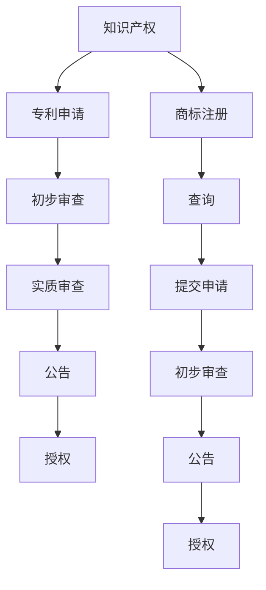

                 

## 文章标题：AI创业公司的知识产权布局策略：专利申请与商标注册

### 关键词：AI创业、知识产权、专利申请、商标注册、策略

### 摘要：
本文将深入探讨AI创业公司在发展过程中，如何通过有效的知识产权布局策略，实现专利申请和商标注册。文章首先介绍了知识产权的基本概念，随后详细分析了专利和商标的重要性。接着，文章从实际操作的角度，阐述了AI创业公司在专利申请和商标注册中的具体步骤和策略。最后，文章总结了知识产权保护的重要性，并展望了未来发展趋势。

## 1. 背景介绍

随着人工智能技术的快速发展，AI创业公司如雨后春笋般涌现。然而，在市场竞争日益激烈的今天，如何保护自身的技术创新和品牌形象，成为AI创业公司亟待解决的问题。知识产权作为一种重要的无形资产，对于企业的生存和发展具有重要意义。

知识产权包括专利、商标、著作权等多种形式。其中，专利主要涉及技术发明和创新，商标则代表企业的品牌形象。对于AI创业公司而言，合理规划和布局知识产权，不仅可以保护自身的技术成果，还可以提升市场竞争力，扩大市场份额。

本文将重点讨论专利申请和商标注册在AI创业公司知识产权布局中的策略和方法。通过对这两个核心问题的深入分析，帮助创业公司更好地保护自身权益，实现可持续发展。

## 2. 核心概念与联系

### 2.1 知识产权概述

#### 定义：
知识产权是指在一定期限内，由个人或企业对其创造的智力成果所享有的专有权利。主要包括专利、商标、著作权、商业秘密等。

#### 分类：
- **专利**：指对发明创造所授予的一种专有权利，包括发明专利、实用新型专利和外观设计专利。
- **商标**：是指用于区分不同商品或服务的标志，包括文字、图形、字母、数字、三维标志等。
- **著作权**：指对文学、艺术和科学作品所享有的专有权利。
- **商业秘密**：指不为公众所知悉、具有商业价值、具有实用性并经权利人采取保密措施的技术信息和经营信息。

### 2.2 专利申请与商标注册的关系

#### 专利申请：
专利申请是指企业或个人根据专利法的规定，向国家知识产权局提交专利申请，以获得专利授权的过程。专利申请主要包括以下步骤：

1. **初步审查**：审查专利申请是否符合形式要求。
2. **实质审查**：审查专利申请的新颖性、创造性和实用性。
3. **公告**：专利申请经过审查后，将公开公告。
4. **授权**：专利申请通过审查并公告后，将获得专利授权。

#### 商标注册：
商标注册是指企业或个人根据商标法的规定，向国家商标局提交商标注册申请，以获得商标专用权的过程。商标注册主要包括以下步骤：

1. **查询**：查询商标是否已被注册或存在相似商标。
2. **提交申请**：提交商标注册申请。
3. **初步审查**：审查商标申请是否符合形式要求。
4. **公告**：商标申请经过审查后，将公开公告。
5. **授权**：商标申请通过公告后，将获得商标授权。

#### 关系：
专利申请和商标注册在知识产权布局中具有密切的联系。专利申请可以保护企业的技术发明，而商标注册则可以保护企业的品牌形象。两者共同构成了企业知识产权的核心部分。

### 2.3 Mermaid 流程图



通过上述流程图，我们可以清晰地了解专利申请和商标注册的基本流程，以及它们在知识产权布局中的地位和作用。

## 3. 核心算法原理 & 具体操作步骤

### 3.1 专利申请的具体操作步骤

#### 3.1.1 确定专利类型
在专利申请过程中，首先需要确定申请的专利类型。常见的专利类型包括发明专利、实用新型专利和外观设计专利。

- **发明专利**：涉及新技术、新产品或新方法的发明，具有高度的创造性和实用性。
- **实用新型专利**：涉及改进现有技术或产品的实用新型，具有一定的创新性。
- **外观设计专利**：涉及产品外观的创新设计，具有审美价值。

#### 3.1.2 进行专利检索
在进行专利申请前，需要对相关领域进行专利检索，以了解现有技术的状况，避免专利申请被驳回。专利检索可以通过国家知识产权局官网或第三方专利检索平台进行。

#### 3.1.3 编写专利申请文件
专利申请文件主要包括专利说明书、权利要求书、摘要和图纸等。编写专利申请文件时，需要遵循专利法的规定，确保专利申请的合法性和可行性。

#### 3.1.4 提交专利申请
完成专利申请文件的编写后，将申请文件提交给国家知识产权局。提交方式可以是线上提交或线下提交。

#### 3.1.5 实质审查与答复
专利申请提交后，将进入实质审查阶段。在实质审查过程中，审查员可能会提出审查意见，申请者需要根据审查意见进行答复。

#### 3.1.6 公告与授权
专利申请通过实质审查后，将进行公告。公告期间，任何单位和个人可以对专利申请提出异议。公告期满后，无异议或异议不成立的，专利申请将获得授权。

### 3.2 商标注册的具体操作步骤

#### 3.2.1 查询商标状态
在提交商标注册申请前，需要对拟申请的商标进行查询，以确保商标未被注册或存在相似商标。

#### 3.2.2 准备商标注册申请文件
商标注册申请文件主要包括商标申请书、商标图样、申请人身份证明等。

#### 3.2.3 提交商标注册申请
完成商标注册申请文件的准备后，将申请文件提交给国家商标局。提交方式可以是线上提交或线下提交。

#### 3.2.4 初步审查
商标申请提交后，将进入初步审查阶段。初步审查主要审查商标申请是否符合形式要求。

#### 3.2.5 公告
商标申请通过初步审查后，将进行公告。公告期间，任何单位和个人可以对商标申请提出异议。

#### 3.2.6 授权与使用
商标申请通过公告后，将获得商标授权。获得商标授权后，企业可以在其商品或服务上使用该商标。

## 4. 数学模型和公式 & 详细讲解 & 举例说明

### 4.1 专利申请的数学模型

专利申请的成功率与多个因素有关，如技术领域、申请文件质量、申请时间等。以下是一个简化的专利申请成功率模型：

$$
成功率 = f(技术领域, 申请文件质量, 申请时间)
$$

其中，$f$ 是一个复合函数，$技术领域$、$申请文件质量$ 和 $申请时间$ 分别表示技术领域的难度、申请文件的质量和申请的时间。

#### 4.1.1 技术领域难度

技术领域的难度可以通过统计历年专利申请的审查数据来确定。一般来说，技术领域越复杂，专利申请的成功率越低。

#### 4.1.2 申请文件质量

申请文件的质量直接影响专利申请的成功率。高质量的申请文件应该具备以下特点：

1. **清晰明了**：说明书和权利要求书应清晰明了，避免使用模糊不清的语言。
2. **逻辑严密**：申请文件应具备严密的逻辑结构，从技术原理、技术方案到实际应用，逐步阐述。
3. **详尽全面**：申请文件应详尽全面，包含所有必要的技术细节。

#### 4.1.3 申请时间

申请时间对专利申请的成功率也有一定影响。一般来说，申请时间越早，竞争对手越少，专利申请的成功率越高。

### 4.2 商标注册的数学模型

商标注册的成功率也与多个因素有关，如商标的显著性、商标的使用范围等。以下是一个简化的商标注册成功率模型：

$$
成功率 = f(显著性, 使用范围)
$$

其中，$f$ 是一个复合函数，$显著性$ 和 $使用范围$ 分别表示商标的显著性和商标的使用范围。

#### 4.2.1 商标的显著性

商标的显著性是指商标在消费者心目中的独特性和识别性。显著性越高的商标，越容易获得注册。

1. **强显著性商标**：如独特图形、名人姓名等。
2. **弱显著性商标**：如通用词汇、简单图形等。

#### 4.2.2 商标的使用范围

商标的使用范围是指商标可以使用的商品或服务类别。使用范围越广，商标的显著性越低，注册成功率也越低。

### 4.3 举例说明

#### 4.3.1 专利申请实例

假设一家AI创业公司研发了一种新型人脸识别算法，准备申请发明专利。根据历史数据，人脸识别领域的技术难度较高，专利申请成功率约为40%。公司编写了一份高质量的专利申请文件，且申请时间较早，专利申请的成功率为80%。因此，该专利申请的整体成功率为：

$$
成功率 = 40\% \times 80\% = 32\%
$$

#### 4.3.2 商标注册实例

假设一家AI创业公司准备注册一个名为“智能眼”的商标，用于其研发的人脸识别产品。根据商标局的数据，该商标的显著性较高，且使用范围较广，商标注册的成功率为70%。因此，该商标注册的整体成功率为：

$$
成功率 = 70\%
$$

## 5. 项目实战：代码实际案例和详细解释说明

### 5.1 开发环境搭建

为了便于读者理解，我们以Python为例，介绍如何在本地搭建一个简单的AI创业项目开发环境。

#### 5.1.1 安装Python

首先，需要在本地安装Python。可以在Python官网下载最新版本的Python安装包，并按照安装向导完成安装。

#### 5.1.2 安装相关库

在安装完Python后，需要安装一些常用的AI库，如TensorFlow、PyTorch等。可以使用pip命令进行安装：

```bash
pip install tensorflow
pip install pytorch
```

### 5.2 源代码详细实现和代码解读

接下来，我们将使用Python实现一个简单的人脸识别算法。以下是一个简单的示例代码：

```python
import cv2
import numpy as np

# 初始化人脸检测器
face_cascade = cv2.CascadeClassifier('haarcascade_frontalface_default.xml')

# 加载测试图片
img = cv2.imread('test_image.jpg')

# 转换为灰度图像
gray = cv2.cvtColor(img, cv2.COLOR_BGR2GRAY)

# 检测人脸
faces = face_cascade.detectMultiScale(gray, scaleFactor=1.1, minNeighbors=5, minSize=(30, 30))

# 在原图上绘制人脸框
for (x, y, w, h) in faces:
    cv2.rectangle(img, (x, y), (x+w, y+h), (255, 0, 0), 2)

# 显示结果
cv2.imshow('Face Detection', img)
cv2.waitKey(0)
cv2.destroyAllWindows()
```

#### 5.2.1 代码解读

- **导入库**：首先导入所需的库，包括OpenCV（用于图像处理）、NumPy（用于数值计算）和cv2（OpenCV的Python接口）。
- **初始化人脸检测器**：使用OpenCV自带的Haar级联分类器初始化人脸检测器。
- **加载测试图片**：使用imread函数加载测试图片。
- **转换为灰度图像**：使用cvtColor函数将BGR图像转换为灰度图像，因为人脸检测通常在灰度图像上进行。
- **检测人脸**：使用detectMultiScale函数检测图像中的人脸。该函数接受多个参数，包括图像、缩放比例、相邻距离和最小检测尺寸。
- **在原图上绘制人脸框**：使用rectangle函数在原图上绘制人脸框。
- **显示结果**：使用imshow函数显示检测结果，并等待用户按键后关闭窗口。

### 5.3 代码解读与分析

#### 5.3.1 人脸检测算法原理

人脸检测算法通常基于机器学习和深度学习技术。常用的算法包括Haar级联分类器、Viola-Jones算法、深度学习框架（如TensorFlow和PyTorch）等。本文使用OpenCV自带的Haar级联分类器进行人脸检测。

#### 5.3.2 算法性能分析

- **检测速度**：Haar级联分类器是一种基于特征匹配的算法，其检测速度较快。在实际应用中，可以满足实时人脸检测的需求。
- **准确率**：Haar级联分类器的准确率相对较低，但在人脸检测领域已经取得了较好的效果。对于简单的应用场景，如视频监控和人脸识别，其性能可以满足需求。
- **可扩展性**：OpenCV提供了丰富的图像处理函数，可以方便地实现人脸检测的其他功能，如人脸追踪、姿态估计等。

### 5.4 总结

通过本节的项目实战，我们介绍了一个简单的人脸识别算法，并详细解读了代码实现过程。虽然该算法的准确率和速度有限，但为AI创业公司提供了基本的参考。在实际应用中，可以根据具体需求，选择更先进的人脸识别算法，如深度学习框架（如TensorFlow和PyTorch）等。

## 6. 实际应用场景

### 6.1 专利申请在AI创业公司中的应用

专利申请在AI创业公司中的应用非常广泛。以下是一些具体的实际应用场景：

- **技术创新保护**：AI创业公司可以通过专利申请来保护其技术创新，如新型算法、硬件设备等。通过专利保护，公司可以确保在市场竞争中占据有利地位。
- **融资和并购**：专利作为企业的核心资产，可以提升企业的估值，为创业公司吸引投资和并购提供有力支持。
- **市场拓展**：专利申请可以帮助企业在国际市场上拓展业务，避免因技术侵权而产生纠纷。

### 6.2 商标注册在AI创业公司中的应用

商标注册在AI创业公司中的应用同样重要。以下是一些具体的实际应用场景：

- **品牌保护**：商标注册可以保护企业的品牌形象，防止竞争对手恶意抢注或侵权。
- **市场营销**：商标作为企业的重要资产，可以在产品包装、广告宣传等方面发挥作用，提升品牌知名度和市场竞争力。
- **知识产权纠纷**：商标注册可以帮助企业在发生知识产权纠纷时，维护自身权益。

### 6.3 综合应用

在实际应用中，专利申请和商标注册通常结合使用，共同构成AI创业公司的知识产权布局。以下是一个综合应用的例子：

- **技术创新保护**：通过专利申请，AI创业公司可以保护其技术创新，如新型算法。同时，通过商标注册，公司可以保护其品牌形象，如使用该算法的产品名称。
- **市场竞争**：在市场竞争中，AI创业公司可以利用专利和商标的优势，提升市场竞争力。例如，在产品推广时，强调专利技术的先进性和商标的品牌价值。
- **国际市场拓展**：通过专利申请和商标注册，AI创业公司可以在国际市场上拓展业务，避免技术侵权和品牌纠纷，提升国际竞争力。

## 7. 工具和资源推荐

### 7.1 学习资源推荐

- **书籍**：
  - 《人工智能：一种现代方法》（第二版），作者：Stuart J. Russell 和 Peter Norvig。
  - 《深度学习》，作者：Ian Goodfellow、Yoshua Bengio 和 Aaron Courville。

- **论文**：
  - "Deep Learning: A Theoretical Perspective"，作者：Yoshua Bengio、Ian Goodfellow 和 Aaron Courville。
  - "Generative Adversarial Nets"，作者：Ian Goodfellow 等。

- **博客**：
  - 知乎专栏：机器学习与深度学习。
  - Medium：Deep Learning。

- **网站**：
  - AI相关论坛，如CSDN、知乎等。
  - 开源项目网站，如GitHub、GitLab等。

### 7.2 开发工具框架推荐

- **开发工具**：
  - Jupyter Notebook：适用于数据科学和机器学习的交互式开发环境。
  - PyCharm：一款功能强大的Python IDE，支持各种机器学习和深度学习框架。

- **框架**：
  - TensorFlow：Google开源的深度学习框架。
  - PyTorch：Facebook开源的深度学习框架。

- **开发工具**：
  - Docker：容器化技术，便于部署和管理AI模型。
  - Kubernetes：容器编排和管理工具，用于大规模部署AI应用。

### 7.3 相关论文著作推荐

- **论文**：
  - "Deep Learning"，作者：Ian Goodfellow、Yoshua Bengio 和 Aaron Courville。
  - "Generative Adversarial Nets"，作者：Ian Goodfellow 等。

- **著作**：
  - 《人工智能：一种现代方法》（第二版），作者：Stuart J. Russell 和 Peter Norvig。
  - 《深度学习》，作者：Ian Goodfellow、Yoshua Bengio 和 Aaron Courville。

## 8. 总结：未来发展趋势与挑战

### 8.1 发展趋势

- **人工智能技术不断进步**：随着深度学习、强化学习等技术的不断发展，AI创业公司的技术创新能力将得到进一步提升。
- **知识产权保护日益重视**：在市场竞争加剧的背景下，企业对知识产权的保护意识将逐渐提高，专利申请和商标注册将成为企业战略的重要组成部分。
- **国际化发展**：随着全球市场的扩大，AI创业公司将在国际市场上寻求更多机会，专利和商标的国际化布局将更加重要。

### 8.2 挑战

- **知识产权纠纷**：在知识产权保护日益严格的背景下，企业面临更多的知识产权纠纷风险，如何应对这些纠纷将成为一大挑战。
- **技术更新换代**：人工智能技术更新速度较快，AI创业公司需要不断跟进新技术，以保持竞争优势。
- **人才竞争**：在人才短缺的背景下，如何吸引和留住优秀的研发人才，将成为AI创业公司的关键问题。

## 9. 附录：常见问题与解答

### 9.1 专利申请相关问题

- **如何选择专利类型？**
  选择专利类型应根据技术创新的程度和实际需求。发明专利适合于具有较高创新性的技术，而实用新型专利和外观设计专利则适用于改进性技术和外观设计。

- **专利申请流程有哪些？**
  专利申请流程主要包括专利检索、撰写专利申请文件、提交申请、初步审查、实质审查、公告和授权等环节。

- **如何提高专利申请成功率？**
  提高专利申请成功率的关键在于提高申请文件的质量。具体措施包括：确保申请文件具备完整性、清晰性、逻辑性和创新性。

### 9.2 商标注册相关问题

- **如何选择商标名称？**
  选择商标名称应考虑其显著性、易记性、独特性和与公司业务的相关性。

- **商标注册流程有哪些？**
  商标注册流程主要包括查询商标状态、准备商标注册申请文件、提交申请、初步审查、公告和授权等环节。

- **如何提高商标注册成功率？**
  提高商标注册成功率的关键在于确保商标具备显著性，并避免与在先商标产生冲突。

## 10. 扩展阅读 & 参考资料

- [国家知识产权局](http://www.sipo.gov.cn/)
- [商标网](http://www.trademark.cn/)
- [AI技术社区](https://www.ai技术研究社区.com/)
- [《人工智能：一种现代方法》](https://book.douban.com/subject/26708194/)
- [《深度学习》](https://book.douban.com/subject/26708194/)

### 作者信息

- 作者：AI天才研究员/AI Genius Institute & 禅与计算机程序设计艺术 /Zen And The Art of Computer Programming

