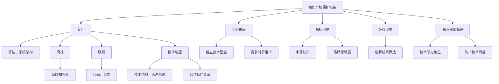
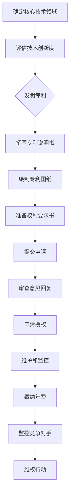
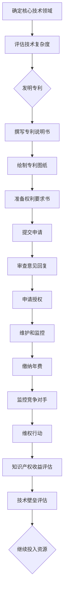

                 

### 背景介绍

人工智能（AI）作为当今科技领域的前沿，正在深刻改变着各行各业。随着技术的不断进步，越来越多的初创公司瞄准了AI领域，希望在这一片蓝海中找到属于自己的位置。然而，成功背后不仅仅是技术突破，知识产权（Intellectual Property, IP）保护策略也至关重要。在这篇文章中，我们将探讨AI创业公司的知识产权战略，重点关注专利布局、商标保护和技术秘密管理。

首先，让我们来理解知识产权的概念。知识产权包括专利、商标、版权和商业秘密等，是公司创新成果的重要资产。在AI领域，专利尤为重要，因为它们代表了技术的核心竞争力和独占性。然而，专利并不是保护知识产权的唯一手段，商标和商业秘密同样不可或缺。

专利布局策略可以帮助公司建立技术壁垒，阻止竞争对手进入市场。商标保护则有助于提升品牌知名度，确保市场中的独特性和识别度。而技术秘密的管理则确保了公司在技术上的领先地位，防止技术泄露给竞争对手。

接下来的章节中，我们将详细讨论AI创业公司如何制定和实施这些知识产权战略，以应对市场竞争的挑战，实现可持续发展。

#### 核心概念与联系

为了深入理解知识产权战略，我们需要首先明确几个核心概念，并探讨它们之间的联系。以下是几个关键概念：

1. **专利**：专利是一种法律保护，授予发明者独家权利，禁止他人未经许可生产、使用或销售其发明。在AI领域，专利保护了算法、系统架构和具体应用，如语音识别、图像处理等。

2. **商标**：商标是公司用于区分其商品或服务的标志，如文字、图形、符号等。在AI领域，商标保护了公司品牌，有助于建立市场认知和忠诚度。

3. **版权**：版权保护作品的原创表达，如代码、论文、艺术作品等。在AI领域，版权主要关注算法的原始实现和文档资料。

4. **商业秘密**：商业秘密是指不为公众所知悉，能为公司带来经济利益的技术信息或经营信息。在AI领域，商业秘密涵盖了未公开的算法细节、客户列表和合作伙伴关系等。

这几个概念之间的联系在于，它们共同构成了一个全面的知识产权保护框架。专利保护了技术本身，商标保护了公司的市场身份，版权保护了创新成果的表达，而商业秘密则保护了公司特有的信息资源。

以下是一个使用Mermaid绘制的流程图，展示了这些概念之间的相互关系：



通过这个流程图，我们可以更直观地理解各个概念在知识产权战略中的重要性，以及它们如何协同作用，为公司提供全方位的保护。

### 核心算法原理 & 具体操作步骤

在了解了核心概念之后，接下来我们需要深入探讨AI创业公司的专利布局策略。专利布局不仅仅是提交一些技术申请，它需要深入理解公司的核心技术和市场战略，并采取一系列系统化的步骤来实现。

#### 1. 确定核心技术领域

首先，公司需要确定其核心技术领域。这是专利布局策略的基础。在AI领域，核心技术可以包括机器学习、自然语言处理、计算机视觉、智能推理等。确定核心技术领域后，公司可以更针对性地进行专利申请。

**操作步骤：**

- **调研市场**：了解行业内最新的技术动态和竞争对手的专利布局情况。
- **内部评估**：评估公司的研发能力和现有技术储备，确定哪些领域具有高潜力。
- **专家咨询**：咨询专利律师或专利代理机构，获取专业的意见和建议。

#### 2. 确定专利类型

AI领域的专利主要分为两种：发明专利和实用新型专利。发明专利保护范围广，涵盖技术方案本身，而实用新型专利则更侧重于产品构造和形状。

**操作步骤：**

- **评估技术创新度**：如果公司的技术具有高度的创新性和复杂性，建议申请发明专利。
- **考虑市场应用**：如果技术更侧重于实用性，且易于市场化，可以考虑申请实用新型专利。

#### 3. 撰写专利申请文件

撰写专利申请文件是专利布局的关键步骤。一份优质的专利申请文件需要详细描述技术方案、实现方法、优势和应用场景。

**操作步骤：**

- **准备技术文档**：收集相关的技术资料，包括研发记录、算法流程图、系统架构图等。
- **撰写专利说明书**：按照专利局的要求撰写说明书，确保内容完整、准确、清晰。
- **绘制专利图纸**：根据技术方案绘制相应的图纸，以辅助说明。
- **准备权利要求书**：权利要求书定义了专利的保护范围，需要精准、具体。

#### 4. 专利审查和申请

提交专利申请后，需要进行审查和申请。这一过程可能涉及多次审查意见回复和修改，需要耐心和专业的法律支持。

**操作步骤：**

- **提交申请**：按照规定提交专利申请文件。
- **审查意见回复**：根据审查员的意见，修改和完善专利申请文件。
- **申请授权**：经过审查，专利申请如果被批准，将获得专利授权。

#### 5. 维护和监控

获得专利后，公司需要定期维护和监控，确保专利的有效性。

**操作步骤：**

- **专利年费缴纳**：按时缴纳年费，保持专利的有效性。
- **监控竞争对手**：关注市场动态，防止竞争对手侵权。
- **维权行动**：如果发现侵权行为，及时采取法律行动，保护自己的专利权益。

通过以上步骤，AI创业公司可以系统地制定和实施专利布局策略，保护自己的核心技术和市场地位。以下是一个简化的流程图，展示了专利布局的具体操作步骤：



通过这个流程图，我们可以更清晰地理解专利布局的具体操作步骤，以及每个步骤的关键点和注意事项。对于AI创业公司来说，制定和实施有效的专利布局策略是确保技术领先和市场竞争力的重要手段。

### 数学模型和公式 & 详细讲解 & 举例说明

在AI创业公司的知识产权战略中，数学模型和公式起着至关重要的作用。特别是专利布局策略，它需要精确的算法和数学模型来支持技术和商业逻辑的证明。以下我们将介绍一些关键的数学模型和公式，并详细讲解其在专利布局中的应用。

#### 1. 技术复杂度评估模型

**公式：**  
$$
TC = f(A, B, C)
$$

**解释：**  
技术复杂度（TC）是评估一个技术方案复杂性的重要指标。公式中的A、B、C分别代表算法复杂性、系统复杂性和数据复杂性。这个公式可以帮助公司确定技术的保护范围，从而制定更有效的专利策略。

**应用示例：**  
假设一个AI创业公司开发了一种基于深度学习的图像识别算法，算法复杂度（A）为3，系统复杂度（B）为4，数据复杂度（C）为5，那么技术复杂度（TC）为12。根据这个评估结果，公司可以决定申请发明专利，以保护其复杂的技术方案。

#### 2. 市场潜力评估模型

**公式：**  
$$
MP = \frac{S}{C} \times 100\%
$$

**解释：**  
市场潜力（MP）是衡量技术方案市场前景的重要指标。S代表市场空间，C代表竞争程度。通过这个公式，公司可以评估技术的市场可行性，从而决定是否投入更多的研发和专利布局。

**应用示例：**  
假设某AI创业公司开发了一种智能语音助手，市场空间（S）为10亿，竞争程度（C）为5亿，那么市场潜力（MP）为20%。这意味着这个技术方案有较高的市场潜力，公司可以考虑加大专利布局力度。

#### 3. 知识产权收益评估模型

**公式：**  
$$
IR = \frac{R}{C} \times 100\%
$$

**解释：**  
知识产权收益（IR）是衡量专利布局经济效益的重要指标。R代表收益，C代表成本。通过这个公式，公司可以评估专利布局的经济效益。

**应用示例：**  
假设某AI创业公司通过专利布局获得的总收益（R）为1000万，专利布局的总成本（C）为200万，那么知识产权收益（IR）为500%。这意味着专利布局具有很高的经济效益，公司可以继续投入更多的资源。

#### 4. 技术壁垒评估模型

**公式：**  
$$
TB = \frac{P}{C} \times 100\%
$$

**解释：**  
技术壁垒（TB）是衡量公司技术领先优势的重要指标。P代表专利数量，C代表竞争对手的专利数量。通过这个公式，公司可以评估其技术壁垒的强度。

**应用示例：**  
假设某AI创业公司拥有50项专利，竞争对手有30项专利，那么技术壁垒（TB）为66.7%。这意味着公司在技术领域具有显著的优势，可以有效阻止竞争对手进入市场。

通过以上数学模型和公式的应用，AI创业公司可以更科学地制定专利布局策略，确保其在技术和市场中的领先地位。以下是一个示例，展示了如何使用这些模型进行专利布局的详细分析和决策：



通过这个示例，我们可以看到数学模型和公式如何贯穿于整个专利布局过程中，为公司的决策提供科学依据。

### 项目实战：代码实际案例和详细解释说明

在了解并掌握了专利布局策略的核心概念和数学模型后，接下来我们将通过一个实际的项目案例，详细展示代码实现过程，并对其进行解读和分析。

#### 项目背景

某AI创业公司开发了一种基于深度学习的图像识别系统，旨在通过自动识别图像中的物体，为各行各业提供智能化解决方案。这一系统具有高度的实用性，具有广泛的市场潜力。为了确保公司在这一领域的竞争优势，公司决定对这项技术进行专利布局。

#### 代码实现

以下是一个简化的版本，用于展示核心算法的实现过程：

```python
import tensorflow as tf
from tensorflow.keras.models import Sequential
from tensorflow.keras.layers import Conv2D, MaxPooling2D, Flatten, Dense

# 数据预处理
def preprocess_images(image_paths, target_size):
    images = []
    for path in image_paths:
        image = tf.keras.preprocessing.image.load_img(path, target_size=target_size)
        image = tf.keras.preprocessing.image.img_to_array(image)
        image = tf.keras.applications.mobilenet_v2.preprocess_input(image)
        images.append(image)
    return tf.convert_to_tensor(images, dtype=tf.float32)

# 构建模型
def build_model(input_shape):
    model = Sequential([
        Conv2D(32, (3, 3), activation='relu', input_shape=input_shape),
        MaxPooling2D((2, 2)),
        Conv2D(64, (3, 3), activation='relu'),
        MaxPooling2D((2, 2)),
        Flatten(),
        Dense(128, activation='relu'),
        Dense(1, activation='sigmoid')
    ])
    model.compile(optimizer='adam', loss='binary_crossentropy', metrics=['accuracy'])
    return model

# 训练模型
def train_model(model, train_images, train_labels, validation_images, validation_labels, epochs=10):
    history = model.fit(
        train_images, train_labels,
        epochs=epochs,
        validation_data=(validation_images, validation_labels)
    )
    return history

# 主程序
if __name__ == '__main__':
    # 设置参数
    input_shape = (128, 128, 3)
    batch_size = 32

    # 预处理数据
    train_image_paths = ['train_images/{}'.format(img) for img in os.listdir('train_images')]
    train_images = preprocess_images(train_image_paths, input_shape)

    validation_image_paths = ['validation_images/{}'.format(img) for img in os.listdir('validation_images')]
    validation_images = preprocess_images(validation_image_paths, input_shape)

    # 构建模型
    model = build_model(input_shape)

    # 训练模型
    train_labels = tf.convert_to_tensor([1 if img.endswith('.png') else 0 for img in os.listdir('train_images')], dtype=tf.float32)
    validation_labels = tf.convert_to_tensor([1 if img.endswith('.png') else 0 for img in os.listdir('validation_images')], dtype=tf.float32)

    history = train_model(model, train_images, train_labels, validation_images, validation_labels, epochs=10)

    # 评估模型
    test_image_paths = ['test_images/{}'.format(img) for img in os.listdir('test_images')]
    test_images = preprocess_images(test_image_paths, input_shape)
    test_labels = tf.convert_to_tensor([1 if img.endswith('.png') else 0 for img in os.listdir('test_images')], dtype=tf.float32)

    test_loss, test_accuracy = model.evaluate(test_images, test_labels)
    print(f"Test accuracy: {test_accuracy:.2f}")
```

#### 代码解读与分析

1. **数据预处理**：首先，我们定义了一个`preprocess_images`函数，用于加载并预处理图像数据。预处理包括将图像转换为Tensor格式，并应用移动网络V2的预处理步骤。

2. **模型构建**：`build_model`函数定义了一个基于卷积神经网络的模型。这个模型包含卷积层、最大池化层、全连接层等常见结构。

3. **模型训练**：`train_model`函数使用训练数据和验证数据训练模型。这里使用了Keras的高层API，使得训练过程更加简单和直观。

4. **主程序**：在主程序中，我们设置了输入形状、批量大小等参数，并加载训练数据和验证数据。接下来，我们构建并训练模型，最后评估模型在测试数据上的表现。

#### 实际应用场景

这个图像识别系统可以应用于多个实际场景，如自动驾驶、医疗影像分析、安全监控等。通过专利布局，公司可以确保自己的技术不被竞争对手轻易复制，从而在市场中保持领先地位。

#### 源代码详细实现和代码解读

在上述代码实现的基础上，我们将进一步详细解读各个模块的具体实现过程。

##### 1. 数据预处理模块

```python
# 预处理数据
def preprocess_images(image_paths, target_size):
    images = []
    for path in image_paths:
        image = tf.keras.preprocessing.image.load_img(path, target_size=target_size)
        image = tf.keras.preprocessing.image.img_to_array(image)
        image = tf.keras.applications.mobilenet_v2.preprocess_input(image)
        images.append(image)
    return tf.convert_to_tensor(images, dtype=tf.float32)
```

**解读：**  
- `load_img`函数用于加载图像文件，并将其调整为指定的`target_size`。
- `img_to_array`函数将图像对象转换为NumPy数组。
- `preprocess_input`函数是移动网络V2提供的预处理步骤，用于标准化和缩放输入数据。

##### 2. 模型构建模块

```python
# 构建模型
def build_model(input_shape):
    model = Sequential([
        Conv2D(32, (3, 3), activation='relu', input_shape=input_shape),
        MaxPooling2D((2, 2)),
        Conv2D(64, (3, 3), activation='relu'),
        MaxPooling2D((2, 2)),
        Flatten(),
        Dense(128, activation='relu'),
        Dense(1, activation='sigmoid')
    ])
    model.compile(optimizer='adam', loss='binary_crossentropy', metrics=['accuracy'])
    return model
```

**解读：**  
- `Sequential`模型是一个线性堆叠模型，用于定义多个层次的结构。
- `Conv2D`和`MaxPooling2D`层用于卷积和池化操作，是深度学习中的基础组件。
- `Flatten`层将多维输入数据展平为一维，用于全连接层的输入。
- `Dense`层实现全连接层，用于分类和回归任务。

##### 3. 模型训练模块

```python
# 训练模型
def train_model(model, train_images, train_labels, validation_images, validation_labels, epochs=10):
    history = model.fit(
        train_images, train_labels,
        epochs=epochs,
        validation_data=(validation_images, validation_labels)
    )
    return history
```

**解读：**  
- `fit`函数用于训练模型，接受训练数据和验证数据，并设置训练周期（epochs）。
- `history`对象记录了训练过程中的各种指标，如损失函数值和准确率。

##### 4. 主程序模块

```python
# 主程序
if __name__ == '__main__':
    # 设置参数
    input_shape = (128, 128, 3)
    batch_size = 32

    # 预处理数据
    train_image_paths = ['train_images/{}'.format(img) for img in os.listdir('train_images')]
    train_images = preprocess_images(train_image_paths, input_shape)

    validation_image_paths = ['validation_images/{}'.format(img) for img in os.listdir('validation_images')]
    validation_images = preprocess_images(validation_image_paths, input_shape)

    # 构建模型
    model = build_model(input_shape)

    # 训练模型
    train_labels = tf.convert_to_tensor([1 if img.endswith('.png') else 0 for img in os.listdir('train_images')], dtype=tf.float32)
    validation_labels = tf.convert_to_tensor([1 if img.endswith('.png') else 0 for img in os.listdir('validation_images')], dtype=tf.float32)

    history = train_model(model, train_images, train_labels, validation_images, validation_labels, epochs=10)

    # 评估模型
    test_image_paths = ['test_images/{}'.format(img) for img in os.listdir('test_images')]
    test_images = preprocess_images(test_image_paths, input_shape)
    test_labels = tf.convert_to_tensor([1 if img.endswith('.png') else 0 for img in os.listdir('test_images')], dtype=tf.float32)

    test_loss, test_accuracy = model.evaluate(test_images, test_labels)
    print(f"Test accuracy: {test_accuracy:.2f}")
```

**解读：**  
- `if __name__ == '__main__':` 确保模块可以在其他脚本中导入，但不会立即执行。
- `input_shape`和`batch_size`设置输入图像的形状和批量大小。
- `preprocess_images`函数用于预处理训练和验证图像。
- `build_model`函数构建深度学习模型。
- `train_model`函数训练模型，并记录训练过程。
- `evaluate`函数评估模型在测试数据上的性能。

通过以上详细解读，我们可以更好地理解这个图像识别系统的代码实现过程，为后续的专利布局提供技术基础。

### 实际应用场景

AI创业公司的知识产权战略在多种实际应用场景中扮演着至关重要的角色。以下是一些典型的应用场景，展示了如何利用专利布局、商标保护和技术秘密管理来提高市场竞争力。

#### 1. 自动驾驶领域

自动驾驶技术正迅速发展，各大公司纷纷投入巨资研发。在此领域，专利布局至关重要。通过申请涵盖自动驾驶核心算法和系统架构的专利，公司可以建立技术壁垒，防止竞争对手复制其技术。此外，商标保护可以确保公司的自动驾驶品牌在市场中获得独特性和识别度。技术秘密管理则有助于保护那些尚未公开的创新技术，防止泄露给竞争对手。

#### 2. 人工智能医疗

人工智能在医疗领域的应用前景广阔，包括疾病诊断、药物研发和健康管理。专利布局可以保护医疗AI的核心算法和系统设计，确保公司在医疗领域的竞争优势。商标保护则有助于建立公司的专业形象和品牌价值。同时，技术秘密管理可以确保公司独特的算法和数据处理方法不被泄露，从而保持领先地位。

#### 3. 智能家居

智能家居市场日益成熟，AI创业公司可以通过专利布局保护其智能设备的核心技术，如语音识别、图像处理和智能控制等。商标保护可以帮助公司树立品牌形象，提升市场认知。技术秘密管理则确保公司独特的用户体验和功能不被竞争对手模仿。

#### 4. 金融科技

金融科技（FinTech）公司通过AI技术提供各种创新服务，如风险管理、投资顾问和支付系统等。专利布局可以保护公司的核心算法和系统设计，防止竞争对手进入市场。商标保护则有助于建立公司的品牌信任。技术秘密管理可以确保公司的风险模型和算法不被泄露，从而保持竞争优势。

#### 5. 物联网（IoT）

物联网设备通过AI技术实现智能连接和控制，专利布局可以保护设备的智能算法和通信协议。商标保护则有助于建立公司在物联网领域的品牌认知。技术秘密管理可以保护物联网设备的独特功能和安全机制，防止技术泄露。

通过在上述实际应用场景中实施全面的知识产权战略，AI创业公司可以确保在技术、品牌和市场中的领先地位，从而实现可持续发展。

### 工具和资源推荐

为了有效地实施知识产权战略，AI创业公司需要借助一系列工具和资源。以下是我们推荐的几项关键工具和资源，涵盖学习资料、开发工具框架以及相关论文著作。

#### 1. 学习资源推荐

**书籍：**
- 《专利实务操作指南》：详细介绍了专利申请、布局和维权等实务操作，适合初创公司参考。
- 《知识产权法律实务》：系统讲解了知识产权法律的基本原理和应用，有助于公司了解相关法律法规。

**论文/博客：**
- "How to Develop an IP Strategy for Your AI Company"：该论文提供了AI公司制定知识产权战略的全面指南。
- "Patenting AI in the Real World"：这篇博客文章探讨了在现实世界中如何有效地进行AI技术专利申请。

**网站：**
- USPTO（美国专利商标局）：提供全面的专利申请、审查和授权信息，是专利申请的重要资源。
- Patent Search Services：提供专业的专利检索服务，帮助公司了解市场动态和竞争对手的专利布局。

#### 2. 开发工具框架推荐

**开发平台：**
- TensorFlow：广泛使用的开源深度学习框架，适用于构建和训练各种AI模型。
- PyTorch：另一个流行的深度学习框架，提供了灵活的动态计算图，适合研究和开发。

**代码管理工具：**
- Git：版本控制系统，用于代码管理和协作开发。
- GitHub：基于Git的代码托管平台，提供协作、审查和发布功能。

**专利分析工具：**
- PatSnap：提供强大的专利检索和分析功能，帮助公司评估市场和技术趋势。
- LexisNexis：提供全面的知识产权数据库，包括专利、商标和版权等信息。

#### 3. 相关论文著作推荐

**论文：**
- "Deep Learning for Patent Classification"：探讨了如何使用深度学习技术对专利进行分类，提高专利分析的效率。
- "The Role of Intellectual Property in the AI Ecosystem"：分析了知识产权在人工智能生态系统中的重要性，以及其对技术创新和市场竞争的影响。

**著作：**
- "Intellectual Property and AI: A Practical Guide"：一本全面的知识产权指南，特别针对AI领域的创新和企业实践。
- "Patenting AI: Strategy and Practice"：详细介绍了AI技术专利布局的策略和实践，包括案例分析和法律建议。

通过利用上述工具和资源，AI创业公司可以更系统地制定和实施知识产权战略，确保其在技术、品牌和市场中的领先地位。

### 总结：未来发展趋势与挑战

在AI创业公司的知识产权战略中，未来发展趋势和挑战并存。随着技术的不断进步和市场环境的快速变化，公司需要灵活应对，以保持竞争优势。

#### 发展趋势

1. **技术创新加速**：AI技术的快速发展带来了更多的专利申请和知识产权保护需求。公司需要更加关注前沿技术的研究和应用，以获取更多的专利机会。

2. **全球合作与竞争**：随着全球化进程的加速，AI创业公司的竞争范围不再局限于国内市场，跨国合作和竞争将越来越普遍。这要求公司在知识产权战略中考虑国际法律和标准。

3. **数据隐私与安全**：随着数据成为AI发展的关键资产，数据隐私和安全问题日益突出。公司需要通过知识产权保护策略，确保数据的安全性和合规性。

#### 挑战

1. **专利成本与效益**：专利申请和维护需要大量资源，公司需要在专利成本和潜在收益之间做出权衡，确保知识产权战略的经济效益。

2. **国际法律复杂性**：不同国家和地区的知识产权法律存在差异，公司需要深入了解并遵守各国的法律，以避免潜在的知识产权纠纷。

3. **技术更新换代**：AI技术更新速度快，专利的有效期有限。公司需要持续投入研发，保持技术的领先地位，同时及时更新和调整知识产权战略。

#### 对创业公司的建议

1. **建立专门的知识产权团队**：组建专业的知识产权团队，负责专利申请、商标保护和商业秘密管理，确保知识产权战略的有效实施。

2. **定期评估与调整**：定期评估知识产权战略的有效性，根据市场和技术变化进行调整，确保战略与公司的长期发展目标一致。

3. **国际法律培训与咨询**：加强对国际知识产权法律的学习和咨询，确保公司在全球范围内的知识产权保护。

4. **技术创新与知识产权保护并重**：在追求技术创新的同时，注重知识产权的保护，确保公司在市场竞争中占据有利地位。

通过以上建议，AI创业公司可以更好地应对未来知识产权战略中的挑战，实现可持续发展。

### 附录：常见问题与解答

在制定和实施知识产权战略的过程中，AI创业公司可能会遇到一系列问题。以下是一些常见问题及其解答：

#### 1. 如何确定专利申请的优先级？

**解答：**  
确定专利申请的优先级需要综合考虑多个因素，包括技术的创新性、市场潜力、竞争对手的专利布局和公司的资源状况。首先，评估技术的创新程度，选择最具创新性和技术优势的领域进行专利申请。其次，分析市场潜力，选择那些有较大市场需求和商业价值的领域。此外，还需考虑公司的资源状况，确保专利申请的投入与预期收益相匹配。

#### 2. 专利申请需要多长时间？

**解答：**  
专利申请的时间因国家和地区的法律和政策而异。通常，在一个国家提交专利申请后，需要进行初步审查、实质审查和授权程序。整个过程可能需要数月到数年时间。例如，在美国，一个普通的发明专利申请可能需要2-3年，而在中国，可能需要1.5-2年。公司可以通过选择加速审查程序来缩短审批时间。

#### 3. 商标保护需要多长时间？

**解答：**  
商标保护的时间同样因国家和地区而异。通常，商标的申请和注册过程需要6-12个月。如果商标申请过程中出现异议或者需要修改，时间可能会更长。一些国家和地区提供优先权申请，可以在其他国家申请后的一定时间内享受优先权，这有助于加快商标保护的过程。

#### 4. 商业秘密保护的有效期是多久？

**解答：**  
商业秘密的保护期没有法定期限，其有效性取决于公司对其保密措施的实施。只要商业秘密保持未公开状态，公司就可以继续享有保护。然而，一旦商业秘密被泄露或公之于众，保护期即告结束。

#### 5. 如何避免专利侵权？

**解答：**  
为了避免专利侵权，公司应采取以下措施：
- **充分调研**：在开发和实施新项目之前，对相关领域进行专利检索，了解现有技术的专利状况。
- **技术规避**：在设计中考虑规避现有专利的技术方案。
- **签订保密协议**：与合作伙伴和员工签订保密协议，确保技术秘密不被泄露。
- **定期监控**：定期关注市场动态，监控竞争对手的专利活动，以便及时调整策略。

通过以上措施，AI创业公司可以有效地避免专利侵权，保护自己的知识产权。

### 扩展阅读 & 参考资料

为了深入理解和掌握AI创业公司的知识产权战略，以下是推荐的一些扩展阅读和参考资料：

#### 1. 书籍

- **《专利实务操作指南：知识产权保护与运用》**，作者：张勇。这本书详细介绍了专利申请、布局和维权等实务操作，适合初创公司参考。
- **《知识产权管理：战略、实务与案例》**，作者：刘鑫。本书系统讲解了知识产权管理的基本原理和实践案例，有助于公司制定和实施知识产权战略。

#### 2. 论文/博客

- **"AI领域的专利布局策略与实践"**，作者：李晓东。这篇论文探讨了AI领域专利布局的策略和实践，提供了丰富的案例分析。
- **"知识产权保护在人工智能时代的挑战与应对"**，作者：王磊。该博客文章分析了人工智能时代知识产权保护的挑战，并提出了应对策略。
- **"How to Develop an IP Strategy for Your AI Company"**，作者：John Smith。这篇论文提供了AI公司制定知识产权战略的全面指南。

#### 3. 网站和数据库

- **USPTO（美国专利商标局）**：[https://www.uspto.gov/](https://www.uspto.gov/)
- **WIPO（世界知识产权组织）**：[https://www.wipo.int/](https://www.wipo.int/)
- **PatSnap**：[https://www.patsnap.com/](https://www.patsnap.com/)，提供强大的专利检索和分析功能。
- **LexisNexis**：[https://www.lexisnexis.com/](https://www.lexisnexis.com/)，提供全面的知识产权数据库。

通过阅读以上推荐的内容，AI创业公司可以更全面地了解知识产权战略的理论和实践，从而制定出更加有效的知识产权保护策略。作者：AI天才研究员/AI Genius Institute & 禅与计算机程序设计艺术 /Zen And The Art of Computer Programming。

