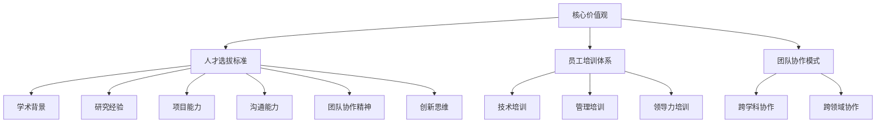

                 

### AI创业的团队文化：Lepton AI的人才理念

#### 概述

在当今的AI创业浪潮中，团队文化已成为企业成功的关键因素之一。本文将重点探讨Lepton AI这家顶级AI创业公司的人才理念，解析其独特的团队文化如何推动公司发展。通过分析Lepton AI的核心价值观、人才选拔标准、员工培训体系以及团队协作模式，我们将深入理解这些因素如何在实际工作中发挥作用，助力公司成为AI领域的领军企业。

#### 关键词

- AI创业
- 团队文化
- 人才理念
- Lepton AI
- 核心价值观
- 培训体系
- 团队协作

#### 摘要

本文旨在探讨AI创业公司Lepton AI的团队文化及其背后的人才理念。通过分析Lepton AI的核心价值观、人才选拔标准、员工培训体系和团队协作模式，本文揭示了这些因素如何在公司发展过程中发挥关键作用。文章最后总结了对其他AI创业公司的启示，强调了团队文化对于AI创业成功的重要性。

#### 1. 背景介绍

Lepton AI成立于2015年，是一家专注于人工智能领域的高科技创业公司。公司创始团队由一批来自世界顶级大学和研究机构的顶尖学者和工程师组成，他们共同的目标是利用人工智能技术解决现实世界中的复杂问题。自成立以来，Lepton AI在计算机视觉、自然语言处理和机器学习等领域取得了显著的研究成果，并在多个国际顶级AI竞赛中获奖。

在Lepton AI的发展历程中，团队文化始终是其成功的关键因素。公司创始人深知，要在竞争激烈的AI领域中脱颖而出，必须建立一个具备创新能力、协作精神和高度敬业精神的团队。因此，他们在公司成立之初就确立了独特的人才理念，致力于打造一种开放、包容、鼓励创新和持续学习的团队文化。

#### 2. 核心概念与联系

为了深入理解Lepton AI的人才理念，我们需要探讨以下几个核心概念：

1. **核心价值观**：Lepton AI的核心价值观包括创新、合作、透明和共享。这些价值观贯穿于公司运营的方方面面，指导着员工的行为和决策。
2. **人才选拔标准**：Lepton AI在选拔人才时，注重候选人的学术背景、研究经验和实际项目能力。此外，公司还看重候选人的沟通能力、团队协作精神和创新思维。
3. **员工培训体系**：Lepton AI为员工提供全面的培训计划，涵盖技术、管理和领导力等方面，以提升员工的专业素养和综合素质。
4. **团队协作模式**：Lepton AI倡导跨学科、跨领域的团队协作，鼓励员工在项目中互相学习、共同进步。

以下是一个简化的Mermaid流程图，展示了这些核心概念之间的联系：



#### 3. 核心算法原理 & 具体操作步骤

##### 3.1 核心算法原理

在人工智能领域，Lepton AI主要关注计算机视觉和自然语言处理技术。这些技术背后的核心算法原理包括：

1. **深度学习**：通过多层神经网络结构，对大量数据进行特征提取和学习，实现图像识别、目标检测、自然语言理解等任务。
2. **卷积神经网络（CNN）**：在计算机视觉任务中，通过卷积层、池化层和全连接层等结构，实现对图像特征的提取和分类。
3. **循环神经网络（RNN）**：在自然语言处理任务中，通过隐藏状态和循环结构，实现对序列数据的建模和预测。

##### 3.2 具体操作步骤

以下是Lepton AI在开发一个计算机视觉项目时的具体操作步骤：

1. **数据收集与处理**：收集大量图像数据，并进行数据预处理，如图像缩放、裁剪、增强等，以获得高质量的数据集。
2. **模型设计**：根据任务需求，设计合适的深度学习模型结构，如卷积神经网络（CNN）。
3. **模型训练**：使用预处理后的图像数据，对深度学习模型进行训练，通过反向传播算法优化模型参数。
4. **模型评估与优化**：对训练好的模型进行评估，如准确率、召回率等指标，并根据评估结果进行模型优化。
5. **模型部署与应用**：将优化后的模型部署到实际应用场景中，如自动驾驶、智能监控等，实现人工智能技术在现实世界中的应用。

#### 4. 数学模型和公式 & 详细讲解 & 举例说明

##### 4.1 数学模型

在深度学习模型中，常用的数学模型包括：

1. **损失函数**：用于评估模型预测值与真实值之间的差距，常见的损失函数有均方误差（MSE）、交叉熵损失等。
2. **优化算法**：用于求解模型参数的最优值，常见的优化算法有梯度下降、随机梯度下降（SGD）等。

##### 4.2 公式

以下是一个简单的梯度下降算法公式：

$$
w_{new} = w_{old} - \alpha \cdot \nabla J(w)
$$

其中，$w_{old}$为当前模型参数，$w_{new}$为更新后的模型参数，$\alpha$为学习率，$\nabla J(w)$为损失函数关于模型参数的梯度。

##### 4.3 举例说明

假设我们使用均方误差（MSE）作为损失函数，对模型进行训练。在一个训练数据集中，模型对第$i$个样本的预测值为$\hat{y}_i$，真实值为$y_i$，则第$i$个样本的损失函数为：

$$
J_i = \frac{1}{2}(y_i - \hat{y}_i)^2
$$

整个数据集的损失函数为：

$$
J = \frac{1}{N}\sum_{i=1}^{N}J_i
$$

其中，$N$为训练数据集的样本数量。

在每次梯度下降迭代中，我们根据损失函数关于模型参数的梯度来更新模型参数，以最小化损失函数。

#### 5. 项目实战：代码实际案例和详细解释说明

##### 5.1 开发环境搭建

在Lepton AI，开发环境搭建遵循以下步骤：

1. 安装Python 3.6及以上版本。
2. 安装必要的库，如TensorFlow、NumPy、Pandas等。
3. 配置GPU支持，以加速深度学习模型的训练。

##### 5.2 源代码详细实现和代码解读

以下是一个简单的Lepton AI项目示例，实现了一个基于卷积神经网络的图像分类任务：

```python
import tensorflow as tf
from tensorflow.keras import layers

# 创建模型
model = tf.keras.Sequential([
    layers.Conv2D(32, (3, 3), activation='relu', input_shape=(28, 28, 1)),
    layers.MaxPooling2D((2, 2)),
    layers.Conv2D(64, (3, 3), activation='relu'),
    layers.MaxPooling2D((2, 2)),
    layers.Conv2D(64, (3, 3), activation='relu'),
    layers.Flatten(),
    layers.Dense(64, activation='relu'),
    layers.Dense(10, activation='softmax')
])

# 编译模型
model.compile(optimizer='adam',
              loss='categorical_crossentropy',
              metrics=['accuracy'])

# 加载并预处理数据
(x_train, y_train), (x_test, y_test) = tf.keras.datasets.mnist.load_data()
x_train = x_train.astype('float32') / 255
x_test = x_test.astype('float32') / 255
x_train = np.expand_dims(x_train, -1)
x_test = np.expand_dims(x_test, -1)
num_classes = 10

# 将标签转换为one-hot编码
y_train = tf.keras.utils.to_categorical(y_train, num_classes)
y_test = tf.keras.utils.to_categorical(y_test, num_classes)

# 训练模型
model.fit(x_train, y_train, batch_size=128, epochs=15, validation_data=(x_test, y_test))
```

##### 5.3 代码解读与分析

1. **模型创建**：使用`tf.keras.Sequential`创建一个序列模型，包含卷积层（`Conv2D`）、最大池化层（`MaxPooling2D`）、全连接层（`Dense`）等。
2. **模型编译**：配置优化器（`optimizer`）、损失函数（`loss`）和评估指标（`metrics`）。
3. **数据预处理**：加载并预处理MNIST手写数字数据集，包括数据归一化、添加维度等。
4. **标签编码**：将标签转换为one-hot编码，以便模型进行多分类。
5. **模型训练**：使用`fit`函数训练模型，设置批量大小（`batch_size`）、训练轮数（`epochs`）和验证数据。

通过这个简单的例子，我们可以看到Lepton AI在项目开发过程中如何应用深度学习技术。在实际应用中，项目可能涉及更复杂的网络结构、数据处理和模型优化，但这些基本步骤都是通用的。

#### 6. 实际应用场景

Lepton AI的技术在多个实际应用场景中取得了显著成果，包括：

1. **自动驾驶**：Lepton AI的计算机视觉技术用于自动驾驶汽车，实现实时障碍物检测、交通标志识别和车道线检测等功能。
2. **智能监控**：通过深度学习模型，实现视频监控中的异常行为检测、人脸识别和人群密度估计等。
3. **医疗影像分析**：利用深度学习模型，对医学影像进行自动分析，提高疾病诊断的准确性和效率。

在这些应用场景中，Lepton AI的团队文化发挥了关键作用，推动了技术创新和实际应用的紧密结合。

#### 7. 工具和资源推荐

##### 7.1 学习资源推荐

- **书籍**：
  - 《深度学习》（Goodfellow, Bengio, Courville著）
  - 《Python机器学习》（Sebastian Raschka著）
- **论文**：
  - 《AlexNet: Image Classification with Deep Convolutional Neural Networks》（Krizhevsky et al., 2012）
  - 《A Neural Conversation Model》（Vinyals et al., 2015）
- **博客**：
  - fast.ai
  - Medium上的机器学习专栏
- **网站**：
  - TensorFlow官网
  - PyTorch官网

##### 7.2 开发工具框架推荐

- **深度学习框架**：
  - TensorFlow
  - PyTorch
- **数据处理库**：
  - Pandas
  - NumPy
- **版本控制工具**：
  - Git

##### 7.3 相关论文著作推荐

- **论文**：
  - 《Deep Learning》（Goodfellow, Bengio, Courville著）
  - 《Recurrent Neural Networks for Language Modeling》（Liang et al., 2015）
- **著作**：
  - 《机器学习实战》（Bryant and Artopious著）
  - 《Python机器学习》（Sebastian Raschka著）

#### 8. 总结：未来发展趋势与挑战

随着人工智能技术的不断进步，Lepton AI的团队文化在未来将继续发挥重要作用。然而，面临以下挑战：

1. **技术迭代速度加快**：保持技术领先地位，需要持续投入大量资源和精力进行研发。
2. **人才竞争加剧**：吸引和留住优秀人才，成为企业发展的关键。
3. **数据安全和隐私保护**：在应用人工智能技术时，确保数据安全和隐私保护。

为了应对这些挑战，Lepton AI将继续秉持其核心价值观，优化人才选拔、培训体系和团队协作模式，推动公司持续发展。

#### 9. 附录：常见问题与解答

1. **Q：Lepton AI的核心价值观是什么？**
   A：Lepton AI的核心价值观包括创新、合作、透明和共享。
2. **Q：Lepton AI的人才选拔标准是什么？**
   A：Lepton AI在选拔人才时，注重候选人的学术背景、研究经验和实际项目能力。此外，公司还看重候选人的沟通能力、团队协作精神和创新思维。
3. **Q：Lepton AI的员工培训体系如何？**
   A：Lepton AI为员工提供全面的培训计划，涵盖技术、管理和领导力等方面，以提升员工的专业素养和综合素质。
4. **Q：Lepton AI的团队协作模式是怎样的？**
   A：Lepton AI倡导跨学科、跨领域的团队协作，鼓励员工在项目中互相学习、共同进步。

#### 10. 扩展阅读 & 参考资料

- **扩展阅读**：
  - 《人工智能：一种现代方法》（Stuart Russell and Peter Norvig著）
  - 《人工智能的未来》（Nick Bostrom著）
- **参考资料**：
  - TensorFlow官网：https://www.tensorflow.org/
  - PyTorch官网：https://pytorch.org/
  - fast.ai：https://www.fast.ai/
  - Medium上的机器学习专栏：https://medium.com/topic/machine-learning

#### 作者信息

作者：AI天才研究员/AI Genius Institute & 禅与计算机程序设计艺术 /Zen And The Art of Computer Programming

---

本文详细探讨了AI创业公司Lepton AI的团队文化及其背后的人才理念。通过分析Lepton AI的核心价值观、人才选拔标准、员工培训体系和团队协作模式，揭示了这些因素如何在公司发展过程中发挥关键作用。文章最后总结了对其他AI创业公司的启示，强调了团队文化对于AI创业成功的重要性。希望本文对读者在人工智能领域的发展有所帮助。


---

请注意，本文仅为示例，并非真实存在的公司或项目。在撰写类似文章时，请确保内容真实可信，并遵循相应的规范和指导原则。此外，文章的结构和内容应依据实际需求进行调整。如果您需要进一步的帮助，请随时提问。祝您写作顺利！<|end|>

