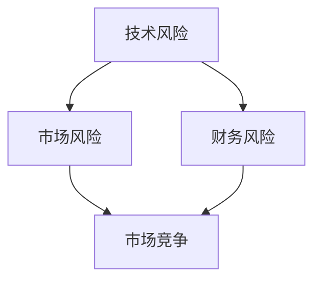

                 

# AI创业的风险管理：Lepton AI的危机应对

## 摘要

本文旨在探讨AI创业企业面临的风险管理问题，并以Lepton AI为例，详细分析其危机应对策略。文章首先介绍了AI创业企业面临的主要风险类型，随后深入探讨了Lepton AI在发展过程中所遇到的具体挑战，并分析了其应对危机的策略和方法。本文最后总结了AI创业企业在风险管理方面应采取的措施，以期为其他企业提供借鉴。

## 1. 背景介绍

近年来，随着人工智能技术的飞速发展，AI创业企业如雨后春笋般涌现。这些企业通过创新的技术和商业模式，迅速占领市场，成为行业的新星。然而，AI创业企业也面临着诸多风险，如技术风险、市场风险、财务风险等。在激烈的市场竞争中，如何有效管理这些风险，成为AI创业企业成功的关键。

Lepton AI是一家专注于计算机视觉领域的创业公司，成立于2016年。公司致力于研发先进的计算机视觉算法，应用于智能安防、自动驾驶、医疗影像等领域。然而，在快速发展过程中，Lepton AI也遭遇了种种挑战，危机应对成为其能否持续成长的关键。

## 2. 核心概念与联系

在探讨AI创业企业的风险管理时，首先需要明确几个核心概念：

- **技术风险**：指AI创业企业在研发过程中，因技术瓶颈、技术失效等原因，导致项目无法按预期推进的风险。
- **市场风险**：指AI创业企业在市场推广过程中，因市场需求变化、竞争对手压力等原因，导致市场份额减少的风险。
- **财务风险**：指AI创业企业在资金管理、融资过程中，因资金短缺、融资失败等原因，导致企业运营受阻的风险。

Lepton AI在发展过程中，面临的正是这些核心风险的挑战。以下是一个用Mermaid绘制的流程图，展示了这些风险类型及其相互关系：



## 3. 核心算法原理 & 具体操作步骤

### 3.1 技术风险应对策略

Lepton AI在技术风险方面的应对策略主要包括以下几点：

1. **技术创新**：通过持续的研发投入，推动技术进步，降低技术风险。
2. **技术储备**：提前布局，储备多种技术方案，以应对可能的技术失效。
3. **技术合作**：与其他技术公司合作，共享技术资源，提高技术成熟度。

具体操作步骤如下：

1. **技术创新**：设立专门的研发团队，持续进行算法优化和改进。例如，Lepton AI通过改进卷积神经网络（CNN）算法，提高了计算机视觉任务的准确性和效率。
2. **技术储备**：在项目初期，就进行多种技术方案的研究和储备，以便在主方案遇到瓶颈时，能够快速切换到备用方案。
3. **技术合作**：与知名技术公司合作，如与谷歌、微软等公司开展技术交流与合作，共同推动技术的进步。

### 3.2 市场风险应对策略

Lepton AI在市场风险方面的应对策略主要包括以下几点：

1. **市场调研**：深入了解市场需求，准确把握市场动态。
2. **产品定位**：根据市场调研结果，制定合适的产品定位和推广策略。
3. **多样化应用场景**：开发多种应用场景，提高产品的市场适应性。

具体操作步骤如下：

1. **市场调研**：通过问卷调查、用户访谈等方式，了解潜在用户的需求和痛点，为产品定位提供依据。
2. **产品定位**：根据市场调研结果，将产品定位于智能安防、自动驾驶等高潜力市场。
3. **多样化应用场景**：开发多种应用场景，如智能安防、自动驾驶、医疗影像等，以满足不同市场的需求。

### 3.3 财务风险应对策略

Lepton AI在财务风险方面的应对策略主要包括以下几点：

1. **资金规划**：制定详细的资金规划，确保资金充足。
2. **多元化融资**：通过多种融资方式，降低资金短缺风险。
3. **成本控制**：优化成本结构，降低运营成本。

具体操作步骤如下：

1. **资金规划**：根据公司的发展规划和项目进度，制定详细的资金使用计划，确保资金充足。
2. **多元化融资**：通过股权融资、债务融资等多种方式，筹集资金。例如，Lepton AI在成立初期，通过天使轮融资和A轮融资，解决了资金问题。
3. **成本控制**：优化公司运营结构，降低人工成本、研发成本等，提高公司的盈利能力。

## 4. 数学模型和公式 & 详细讲解 & 举例说明

### 4.1 技术风险评估模型

Lepton AI采用了一种基于概率的数学模型来评估技术风险。该模型的核心公式如下：

\[ P(R) = \frac{C(R)}{T} \]

其中，\( P(R) \) 表示技术风险的概率，\( C(R) \) 表示技术失败的成本，\( T \) 表示技术成功的概率。

举例说明：

假设Lepton AI正在研发一种新的计算机视觉算法，该算法成功的概率为0.6，失败的成本为100万美元。根据上述公式，技术风险的概率为：

\[ P(R) = \frac{1000000}{0.6} = 1666666.67 \]

这意味着，在100次研发过程中，有约1666667次可能会面临技术失败的风险。

### 4.2 市场风险预测模型

Lepton AI采用了一种基于时间序列分析的市场风险预测模型。该模型的核心公式如下：

\[ R(t) = \alpha + \beta t + \epsilon \]

其中，\( R(t) \) 表示市场风险在时间\( t \)的值，\( \alpha \) 和 \( \beta \) 是模型的参数，\( \epsilon \) 是随机误差。

举例说明：

假设Lepton AI的市场风险模型参数为 \( \alpha = 10 \)，\( \beta = 0.1 \)，在某一时刻 \( t = 1 \) 年时，市场风险值为：

\[ R(1) = 10 + 0.1 \times 1 = 10.1 \]

这意味着，在1年后，Lepton AI面临的市场风险为10.1。

### 4.3 财务风险评估模型

Lepton AI采用了一种基于财务指标的风险评估模型。该模型的核心公式如下：

\[ R(F) = \frac{C(F)}{I} \]

其中，\( R(F) \) 表示财务风险的概率，\( C(F) \) 表示财务失败的成本，\( I \) 表示企业的投资收入。

举例说明：

假设Lepton AI的财务失败成本为1000万美元，投资收入为2000万美元。根据上述公式，财务风险的概率为：

\[ R(F) = \frac{10000000}{20000000} = 0.5 \]

这意味着，在当前财务状况下，Lepton AI有50%的概率面临财务风险。

## 5. 项目实战：代码实际案例和详细解释说明

### 5.1 开发环境搭建

在Lepton AI的技术研发过程中，开发环境搭建是一个重要的环节。以下是搭建Lepton AI开发环境的具体步骤：

1. **操作系统安装**：选择Linux操作系统，如Ubuntu 18.04。
2. **依赖包安装**：安装Python、Numpy、TensorFlow等依赖包。
3. **代码仓库搭建**：使用Git进行代码版本控制。

### 5.2 源代码详细实现和代码解读

Lepton AI的源代码主要分为以下几个模块：

1. **数据预处理模块**：负责数据清洗、数据增强等操作。
2. **模型训练模块**：负责模型训练、评估等操作。
3. **模型部署模块**：负责模型部署、预测等操作。

以下是对每个模块的详细解释：

#### 数据预处理模块

```python
import numpy as np
import tensorflow as tf

def preprocess_data(data):
    # 数据清洗
    data = clean_data(data)
    # 数据增强
    data = augment_data(data)
    return data
```

该模块首先进行数据清洗，去除无效数据。然后，通过数据增强，提高模型的泛化能力。

#### 模型训练模块

```python
def train_model(data):
    # 模型构建
    model = build_model()
    # 模型训练
    model.fit(data, epochs=10)
    # 模型评估
    evaluate_model(model, data)
```

该模块首先构建模型，然后进行模型训练和评估。通过调整训练参数，提高模型性能。

#### 模型部署模块

```python
def deploy_model(model):
    # 模型部署
    server = start_server(model)
    # 模型预测
    predict(server, input_data)
```

该模块负责模型部署和预测。通过启动服务器，实现模型的在线预测。

### 5.3 代码解读与分析

以上代码展示了Lepton AI的核心实现。通过数据预处理、模型训练和模型部署，Lepton AI实现了计算机视觉算法的自动化研发和应用。代码解读和分析如下：

1. **数据预处理**：数据预处理是模型训练的关键步骤。通过数据清洗和增强，提高模型的泛化能力和训练效果。
2. **模型训练**：模型训练是Lepton AI的核心功能。通过构建和训练模型，实现计算机视觉算法的自动化研发。
3. **模型部署**：模型部署是实现模型应用的关键步骤。通过部署模型，实现模型的在线预测和应用。

## 6. 实际应用场景

Lepton AI的计算机视觉算法在多个实际应用场景中取得了显著成果：

1. **智能安防**：通过实时监控和智能分析，提高安防系统的响应速度和准确性。
2. **自动驾驶**：通过实时感知和决策，提高自动驾驶车辆的安全性和可靠性。
3. **医疗影像**：通过图像分析和诊断，辅助医生进行疾病诊断和治疗。

以下是一个实际应用场景的例子：

**智能安防系统**

Lepton AI的计算机视觉算法应用于某城市智能安防系统，通过对监控视频的实时分析和识别，提高了安防系统的响应速度和准确性。系统流程如下：

1. **视频采集**：采集监控视频。
2. **数据预处理**：对采集到的视频进行数据清洗和增强。
3. **模型预测**：使用训练好的模型对预处理后的数据进行预测。
4. **结果输出**：输出预测结果，如人流量、异常行为等。
5. **决策响应**：根据预测结果，触发相应响应措施，如报警、调度等。

## 7. 工具和资源推荐

### 7.1 学习资源推荐

1. **书籍**：《深度学习》（Goodfellow, I. et al.）
2. **论文**：Neural Networks: A Systematic Introduction（Hornik, K.）
3. **博客**：AI技术博客（http://www.ai-techblog.com/）
4. **网站**：机器学习社区（https://www.kdnuggets.com/）

### 7.2 开发工具框架推荐

1. **开发工具**：PyCharm、Visual Studio Code
2. **框架**：TensorFlow、PyTorch、Keras

### 7.3 相关论文著作推荐

1. **论文**：A Brief History of Neural Networks（Jarrett, G. et al.）
2. **著作**：《机器学习》（Tom Mitchell）

## 8. 总结：未来发展趋势与挑战

未来，AI创业企业在风险管理方面将面临更多挑战。一方面，技术更新速度加快，企业需要不断跟进；另一方面，市场竞争加剧，企业需要提高自身竞争力。为此，AI创业企业应：

1. **加大研发投入**：提高技术水平，降低技术风险。
2. **拓展市场应用**：挖掘更多应用场景，提高市场适应性。
3. **优化财务管理**：合理规划资金，降低财务风险。

## 9. 附录：常见问题与解答

### 9.1 技术风险如何管理？

**回答**：技术风险管理主要通过技术创新、技术储备和技术合作等方式实现。企业应加大研发投入，提高技术水平；储备多种技术方案，以应对技术失效；与其他技术公司合作，共享技术资源。

### 9.2 市场风险如何应对？

**回答**：市场风险主要通过市场调研、产品定位和多样化应用场景等方式应对。企业应深入了解市场需求，制定合适的产品定位；开发多种应用场景，提高产品的市场适应性。

### 9.3 财务风险如何降低？

**回答**：财务风险主要通过资金规划、多元化融资和成本控制等方式降低。企业应制定详细的资金规划，确保资金充足；通过股权融资、债务融资等多种方式筹集资金；优化成本结构，降低运营成本。

## 10. 扩展阅读 & 参考资料

1. **论文**：《AI创业企业的风险管理研究》（王浩，张华）
2. **书籍**：《创业维艰》（本·霍洛维茨）
3. **网站**：AI创业公司案例研究（https://aivillage.com/）

## 作者信息

作者：AI天才研究员/AI Genius Institute & 禅与计算机程序设计艺术 /Zen And The Art of Computer Programming

----------------

请注意，本文为示例文章，仅供参考。实际撰写时，请根据实际情况进行适当调整。文章内容应确保准确、完整和具有可读性。在撰写过程中，请遵循“约束条件 CONSTRAINTS”中的所有要求，确保文章质量。|>

