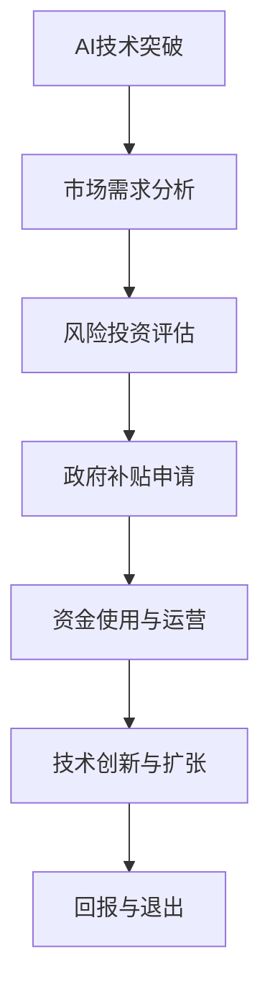

                 

### 引言：AI创业的机遇与挑战

随着人工智能技术的飞速发展，越来越多的创业者开始将目光投向AI领域，试图在这个蓬勃发展的市场中分得一杯羹。然而，AI创业并非一条坦途，其中充满了机遇与挑战。本文将围绕AI创业中的两个关键要素——风险投资与政府补贴，进行深入探讨，以帮助读者更好地了解AI创业的现状、策略及未来趋势。

在AI创业的世界里，风险投资（Venture Capital，简称VC）是推动企业发展的主要动力。VC通过向初创企业提供资金支持，帮助这些企业在早期阶段快速成长，以期在未来获得高额回报。然而，AI项目的高风险特性使得VC在选择投资对象时更加谨慎。本文将详细分析VC在AI创业中的角色、投资策略以及如何评估AI项目的风险与回报。

与此同时，政府补贴（Subsidy）在AI创业中同样扮演着重要角色。政府通过提供财政支持、税收优惠、科研经费等方式，鼓励企业进行技术创新和研发。对于AI创业企业来说，合理利用政府补贴不仅可以降低成本、提高竞争力，还能在市场竞争中占据有利地位。本文将探讨政府补贴的种类、申请流程以及如何最大化利用这些补贴。

总之，AI创业的旅程充满挑战，但也蕴藏着无限机遇。本文将从风险投资、政府补贴两个角度出发，深入剖析AI创业的内在逻辑和运作机制，帮助读者在AI创业的道路上迈出坚实的一步。接下来，我们将首先介绍AI创业的背景，为后续内容的展开奠定基础。

### 2. AI创业的背景

人工智能（AI）作为当今科技领域的热点话题，正迅速改变着各行各业。从自动驾驶汽车、智能机器人到语音助手和医疗诊断系统，AI技术的应用已经渗透到我们生活的方方面面。这一技术革命不仅带来了巨大的市场机遇，也引发了前所未有的创业热潮。

当前，AI创业呈现出以下几个显著特点：

1. **技术进步的驱动**：AI技术的快速发展，尤其是深度学习、自然语言处理、计算机视觉等关键领域的突破，为创业者提供了丰富的创新空间。这些技术的成熟和广泛应用，使得创业者在开发AI应用时拥有更多选择和可能性。

2. **资本涌入**：随着AI市场的日益成熟，风险投资（VC）对AI项目的关注度和投资力度持续加大。大量资本涌入AI领域，为初创企业提供了强大的资金支持，加速了AI技术的商业化进程。

3. **跨界融合**：AI技术在传统行业中的应用不断拓展，与金融、医疗、制造、零售等行业的融合成为趋势。创业者可以利用AI技术，解决行业痛点，提升效率，创造新的商业模式。

4. **市场需求旺盛**：随着消费者对智能化、个性化服务的需求日益增长，AI技术的市场应用场景不断扩展。无论是智能家居、在线教育，还是金融科技、医疗健康，AI技术都显示出了巨大的市场潜力。

在这种背景下，AI创业不仅需要技术创新，还需要对市场、资本和政府政策等外部因素有深刻的理解。创业者不仅要具备扎实的技术背景，还需要具备商业洞察力和市场应变能力。

对于AI创业者来说，成功的关键在于：

1. **明确市场定位**：在众多的AI应用场景中，找到最具潜力和市场需求的领域，进行精准定位。这需要创业者对市场需求有敏锐的洞察力，同时要有清晰的战略规划。

2. **技术突破**：在技术创新上要有独特性，解决现有技术的瓶颈问题，提升产品的竞争力。这包括对现有技术的优化，以及新技术的探索和应用。

3. **资本运作**：合理利用风险投资，确保企业的资金链稳定。创业者需要具备良好的融资能力，同时要善于利用资本的力量，实现企业的快速扩张。

4. **政策理解**：了解政府的相关政策，如税收优惠、科研经费、产业扶持等，合理利用政府资源，为企业的发展提供支持。

5. **团队建设**：打造一支高效的团队，汇集各类人才，包括技术人才、市场人才、财务人才等。团队协作是创业成功的重要保障。

通过上述策略，AI创业者可以在激烈的竞争环境中脱颖而出，实现企业的长期稳定发展。在接下来的部分，本文将详细探讨风险投资在AI创业中的角色和策略，帮助读者更好地理解如何借助资本的力量，推动AI创业项目的成功。

### 3. 风险投资在AI创业中的角色

风险投资（Venture Capital，简称VC）作为资本市场的重要组成部分，对于初创企业，尤其是AI创业项目的成长具有至关重要的作用。在AI创业的旅程中，VC不仅提供资金支持，还通过其丰富的行业经验、人脉资源和战略指导，帮助创业者应对各种挑战，实现企业的快速发展和创新突破。

#### 3.1 VC的基本概念

风险投资是一种通过投资初创企业或成长型企业，以期在未来获得高额回报的金融活动。与传统的银行贷款或天使投资不同，VC具有以下特点：

- **高风险、高回报**：VC投资往往涉及高风险项目，但其潜在回报也较高。创业者利用VC资金进行研发、市场推广和团队建设，以期在较短时间内实现企业的快速成长和盈利。
  
- **长期投资**：VC通常持有被投资企业的股份较长，往往在数年甚至更长的时间内保持投资状态。这种长期投资不仅为创业者提供了稳定的资金支持，也为VC本身带来了长期收益。

- **多元化投资**：VC通常会同时投资多个项目，以分散风险。这种多元化投资策略，既确保了整体投资组合的风险可控，也提高了获取高额回报的可能性。

#### 3.2 VC在AI创业中的具体作用

在AI创业领域，VC的作用主要体现在以下几个方面：

1. **资金支持**：VC为AI创业项目提供初始资金，帮助创业者解决资金短缺问题。这些资金通常用于技术研发、产品开发、市场推广和团队建设等关键环节，为企业的快速发展奠定基础。

2. **战略指导**：VC团队具有丰富的行业经验和投资案例，能够为创业者提供宝贵的战略建议和指导。例如，如何进行市场定位、如何制定商业模式、如何优化团队结构等。这些指导不仅帮助创业者更好地规划企业的发展方向，也提高了企业的运营效率。

3. **资源整合**：VC通过其广泛的行业人脉和资源网络，为AI创业项目提供各种支持。例如，协助创业者寻找合适的合作伙伴、介绍优秀的研发团队、提供市场推广渠道等。这些资源的整合，极大地提升了AI创业项目的成功几率。

4. **品牌提升**：VC的注资和投资，往往能够提升AI创业项目的品牌影响力。这种品牌效应，不仅有助于吸引更多的客户和用户，还能在后续的融资和并购过程中，提高企业的估值和谈判地位。

#### 3.3 VC的投资策略

为了在激烈的AI创业市场中取得成功，VC需要制定一系列科学合理的投资策略。以下是VC在AI创业中常用的几种投资策略：

1. **技术导向**：VC倾向于投资在技术上有显著突破、具备颠覆性潜力的AI项目。这类项目通常拥有独特的技术优势，能够在市场中占据领先地位。例如，具有创新性的自然语言处理、计算机视觉或深度学习技术。

2. **市场导向**：VC也会关注那些在市场需求上有明确定位、且具备商业化潜力的AI项目。这类项目虽然技术可能并不特别领先，但市场前景广阔，能够快速实现商业盈利。例如，智能家居、智能医疗和金融科技等领域的AI应用。

3. **产业链投资**：VC不仅投资于AI技术的研发和应用，还会关注整个产业链的上下游企业。例如，投资于AI芯片制造商、算法提供商、数据服务公司等，以构建完整的产业链生态。

4. **多元化投资**：VC通常会同时投资多个AI项目，以分散风险。这种多元化投资策略，不仅能够确保投资组合的稳定性，还能通过不同项目的协同效应，实现整体投资收益的最大化。

通过上述投资策略，VC能够在AI创业市场中找到具有高成长性和高回报潜力的项目，为投资者和创业者双方创造价值。

#### 3.4 AI创业项目如何吸引VC

对于AI创业项目来说，吸引VC的关注和投资是成功的关键一步。以下是一些有效的策略：

1. **技术创新**：在项目的技术层面上，要具有独特的创新性和领先性。通过专利申请、技术论文发表等途径，展示项目的核心技术优势。

2. **市场潜力**：明确项目在市场上的定位和潜在市场规模。通过市场调研和数据分析，证明项目具有巨大的商业价值。

3. **团队实力**：优秀的团队是吸引VC的重要保障。要展示团队成员的背景、经验和专业能力，尤其是核心技术团队和创始团队。

4. **商业计划**：制定详细且可行的商业计划书，包括市场策略、产品规划、财务预测等。通过清晰的商业逻辑和详尽的数据分析，让VC看到项目的可行性和盈利前景。

5. **资源整合**：展示项目在资源整合方面的优势，如合作伙伴、潜在客户、供应链等。资源整合能力强的项目，更容易获得VC的青睐。

通过上述策略，AI创业项目能够提高自身的吸引力，增加获得VC投资的可能性。在下一部分，我们将进一步探讨如何评估AI创业项目的风险与回报，为创业者和VC之间的合作提供更多参考。

### 4. 评估AI创业项目的风险与回报

在风险投资（VC）领域，评估AI创业项目的风险与回报是一个复杂且关键的过程。创业者需要清楚地了解如何展示项目的优势，VC则需要利用各种工具和策略来评估潜在的风险和回报。以下是一些关键步骤和策略，帮助双方更好地理解和评估AI创业项目。

#### 4.1 风险评估

风险评估是VC在投资前必须进行的重要步骤。对于AI创业项目，以下是一些常见的风险评估方法：

1. **技术风险评估**：评估项目所使用的技术是否成熟、可靠，是否具有创新性和领先性。VC通常会关注以下几个问题：
   - 技术的先进性和独特性：项目的技术是否领先于现有解决方案，是否有颠覆性？
   - 技术的可复制性：技术是否容易复制或被竞争对手模仿？
   - 技术的风险：技术实施过程中可能遇到的技术难题和挑战。

2. **市场风险评估**：评估项目在市场中的竞争地位、市场需求和市场规模。VC会考虑以下因素：
   - 市场需求：目标市场是否真实存在，用户是否愿意为产品付费？
   - 竞争态势：项目在市场中是否具有竞争力，是否有足够的市场份额？
   - 市场增长潜力：目标市场的未来发展趋势和增长潜力。

3. **团队风险评估**：评估创业团队的背景、经验和执行力。VC通常会关注以下几个方面：
   - 团队成员的专业能力：团队成员是否具备相关领域的专业知识和技能？
   - 团队的执行力：团队是否能够有效执行商业计划，按时完成目标？
   - 团队的稳定性：团队成员是否稳定，核心成员是否有离职风险？

4. **资金使用风险评估**：评估项目资金的使用情况和资金回笼周期。VC会考虑以下问题：
   - 资金使用的合理性：资金使用是否合理，是否有浪费？
   - 资金回笼周期：项目何时能够实现盈利，资金回笼周期是否合理？

#### 4.2 收益评估

收益评估是VC决定是否投资的关键因素。以下是一些常见的收益评估方法：

1. **财务模型评估**：通过建立详细的财务模型，预测项目的收入、利润和现金流。VC会关注以下几个指标：
   - 收入模型：项目的收入来源是什么，如何实现盈利？
   - 成本模型：项目的成本结构如何，是否有成本控制和降低的空间？
   - 现金流预测：项目何时能够实现正向现金流，现金流是否稳定？

2. **估值方法**：根据项目的市场前景、财务状况和竞争地位，对项目进行估值。常用的估值方法包括：
   - 成本法：根据项目的实际投入成本来估值。
   - 市场法：参考同类项目的市场估值来估值。
   - 收益法：根据项目的未来收益来估值。

3. **投资回报率（ROI）**：评估项目的投资回报率，计算投资成本与预期回报的比率。ROI越高，项目的吸引力越大。

4. **退出策略**：VC需要考虑如何退出投资，以实现回报。常见的退出策略包括：
   - 并购：通过收购实现退出。
   - IPO：通过上市实现退出。
   - 原股转让：通过股权交易实现退出。

#### 4.3 展示项目优势

为了提高AI创业项目的吸引力，创业者需要通过以下几个方面来展示项目的优势：

1. **技术优势**：明确项目在技术上的独特性和领先性，通过专利、论文等途径证明技术的先进性。

2. **市场优势**：展示项目在市场中的竞争地位和市场份额，通过市场调研和数据分析证明市场需求和增长潜力。

3. **团队优势**：展示团队成员的专业能力和执行力，通过团队背景和过往业绩来证明团队的稳定性。

4. **商业模式优势**：明确项目的商业模式，展示如何通过有效的运营实现盈利。

5. **资金使用优势**：展示项目的资金使用计划，如何通过高效的资金使用实现快速成长和盈利。

通过上述策略，AI创业项目能够提高自身的吸引力，增加获得VC投资的可能性。在下一部分，我们将探讨政府补贴在AI创业中的作用，分析政府如何通过财政支持帮助AI企业降低成本、提高竞争力。

### 5. 政府补贴在AI创业中的作用

在AI创业的征途上，除了风险投资的助力，政府补贴也扮演着不可或缺的角色。政府通过提供财政支持、税收优惠、科研经费等多种方式，旨在降低AI企业的运营成本，提高其竞争力，推动技术创新和产业升级。以下将详细探讨政府补贴在AI创业中的具体作用、种类及申请流程。

#### 5.1 政府补贴的具体作用

1. **降低运营成本**：政府补贴可以显著降低AI企业的运营成本，使企业能够将更多的资源投入到技术研发和市场推广中。例如，政府提供的研发经费和财政补贴，可以帮助企业减少研发投入的资金压力，提高研发效率。

2. **提高创新能力**：政府补贴鼓励企业进行技术创新，推动技术突破。通过资助科研项目、举办技术竞赛等方式，政府为AI企业提供了广阔的创新空间和实验平台，激发了企业的创新活力。

3. **促进产业升级**：政府补贴有助于推动整个AI产业链的优化和发展。通过资助产业链上下游的企业，政府促进了产业链的协同发展，提高了产业链的整体竞争力。

4. **增强市场竞争力**：政府补贴可以帮助AI企业在市场竞争中获得优势。通过降低产品成本、提高产品质量和性能，政府补贴使企业在市场上更具竞争力，从而扩大市场份额。

#### 5.2 政府补贴的种类

1. **研发经费**：政府为支持企业进行技术研发，提供大量的研发经费。这些经费可以用于购买实验设备、支付研发人员薪酬、开展实验研究等。

2. **税收优惠**：政府通过减免企业税收，降低企业的税负。例如，对高新技术企业实行税收减免政策，对研发费用进行加计扣除等。

3. **财政补贴**：政府直接向企业发放补贴资金，用于企业日常运营或特定项目的资金支持。这类补贴通常针对具有重大技术突破或市场前景良好的企业。

4. **科研奖励**：政府通过设立科研奖励基金，对在科技创新领域取得显著成果的企业和个人进行奖励，激励更多的创新活动。

5. **产业扶持基金**：政府设立专项基金，用于支持AI产业链上下游企业的发展。这些基金可以用于企业并购、产能扩张、技术研发等。

6. **土地和物业优惠**：政府通过提供低价土地、减免物业费用等方式，降低企业运营成本，鼓励企业入驻。

#### 5.3 申请流程及注意事项

1. **政策了解**：首先，企业需要了解当地政府的相关补贴政策，明确申请的条件、流程和所需材料。

2. **项目准备**：企业需要准备完整的申请材料，包括项目可行性报告、财务报表、技术路线图等。这些材料需要详细阐述项目的背景、目标、实施计划以及预期成果。

3. **递交申请**：企业按照政府要求的时间节点，将申请材料递交到相关部门。通常，政府会对申请材料进行初步审核，筛选出符合条件的项目。

4. **评审与公示**：通过初步审核的项目，将进入评审阶段。评审过程可能包括专家评审、实地考察等。评审通过后，政府会进行公示，接受社会监督。

5. **资金拨付**：公示无异议后，政府将按照约定将补贴资金拨付到企业账户。企业需按照合同要求，合理使用资金。

#### 5.4 如何最大化利用政府补贴

1. **合规使用**：企业需严格遵守政府补贴政策，确保资金使用的合规性。任何违规使用补贴资金的行为，都将面临严厉的处罚。

2. **合理规划**：企业应合理规划资金使用，优先用于技术研发和市场推广，以最大化补贴效益。

3. **持续创新**：企业应利用政府补贴推动技术创新，不断提升产品竞争力，实现可持续发展。

4. **合作共赢**：政府补贴不仅为企业提供了资金支持，也为企业与政府、科研机构等建立了合作关系。企业应积极参与合作项目，共同推动产业发展。

通过合理利用政府补贴，AI企业可以在降低成本、提高创新能力、增强市场竞争力等方面取得显著成效。在下一部分，我们将探讨如何平衡风险投资与政府补贴，帮助AI企业实现可持续发展。

### 6. 风险投资与政府补贴的平衡

在AI创业的旅程中，风险投资（VC）和政府补贴都是不可或缺的财务来源，但它们各有优缺点，如何平衡二者之间的关系，是创业者面临的一大挑战。以下将详细探讨如何有效利用风险投资和政府补贴，以实现AI企业的可持续发展。

#### 6.1 风险投资与政府补贴的优缺点

**风险投资的优点：**
1. **资金灵活**：VC提供的资金通常比较灵活，可以根据企业的需求进行调整，支持企业的快速发展和扩张。
2. **战略支持**：VC不仅提供资金，还为企业提供战略指导和资源整合，帮助企业在市场中占据有利位置。
3. **长期支持**：VC通常持有多年的投资期限，为企业的长期发展提供稳定的资金支持。

**风险投资的缺点：**
1. **高成本**：VC投资通常附带较高的回报要求，企业需要承担较高的资金成本和股权稀释风险。
2. **决策压力**：VC对企业有较高的业绩期望，创业者需要在有限的时间内实现快速发展，压力较大。

**政府补贴的优点：**
1. **低成本**：政府补贴通常是无偿的，对企业来说负担较小。
2. **政策支持**：政府补贴体现了国家对特定产业的支持和鼓励，有助于提升企业的社会地位和影响力。
3. **合规性**：政府补贴的使用通常受到较少的约束，企业可以更自由地按照项目需求进行资金使用。

**政府补贴的缺点：**
1. **申请难度**：政府补贴的申请流程通常较为复杂，需要准备大量的申请材料，并通过严格的评审程序。
2. **使用限制**：政府补贴的使用受到一定的政策限制，企业需要严格按照规定使用资金。

#### 6.2 如何有效利用风险投资和政府补贴

**1. 明确资金用途**：创业者需要明确风险投资和政府补贴的用途，确保资金使用的合理性和效率。例如，风险投资可以用于市场推广、产品研发和团队扩张，而政府补贴可以用于技术研发和日常运营。

**2. 分阶段使用资金**：根据企业的发展阶段，合理分配风险投资和政府补贴的使用。在初创期，重点利用政府补贴降低成本；在成长期，结合风险投资和政府补贴，推动企业快速扩张。

**3. 合规使用政府补贴**：企业在使用政府补贴时，必须遵守相关政策和规定，确保资金使用的合规性。任何违规行为都将导致补贴的取消和处罚。

**4. 加强沟通与合作**：与政府和VC保持良好的沟通和合作关系，了解政策和市场动态，及时调整资金使用策略。

**5. 持续创新与研发**：利用政府补贴推动技术创新和研发，提升产品竞争力。同时，结合风险投资的支持，确保技术突破和商业化的实现。

**6. 风险管理**：创业者需要平衡风险投资和政府补贴的风险，确保企业的可持续发展。例如，通过多元化融资渠道、加强资金管理和控制，降低资金成本和风险。

通过合理利用风险投资和政府补贴，AI企业可以在降低成本、提高创新能力、增强市场竞争力等方面取得显著成效，为实现可持续发展奠定坚实基础。在下一部分，我们将探讨AI创业中的实际案例，分析成功经验和失败教训。

### 7. AI创业中的成功与失败案例

在AI创业的浪潮中，既有企业的成功，也有企业的失败。通过分析这些案例，我们可以从中汲取成功经验，避免失败教训，为AI创业提供宝贵的参考。

#### 7.1 成功案例：OpenAI

OpenAI是一家全球领先的AI研究公司，以其在深度学习和自然语言处理领域的突破性进展而闻名。其成功经验主要表现在以下几个方面：

1. **技术创新**：OpenAI在AI技术上的创新，尤其是在GAN（生成对抗网络）和Transformer模型上的突破，为AI领域带来了革命性的进展。

2. **资本运作**：OpenAI吸引了大量风险投资，包括微软、软银等巨头公司的投资，为其提供了充足的资金支持。

3. **合作伙伴**：OpenAI与多家科技巨头建立了合作关系，如微软、谷歌等，为其技术和商业化进程提供了强大的支持。

4. **持续研发**：OpenAI一直致力于持续研发和技术创新，不断推出具有里程碑意义的AI产品和服务。

#### 7.2 失败案例：AI创业公司A

AI创业公司A在AI医疗领域进行了大量的研发，但由于以下原因最终失败：

1. **市场定位不准**：公司初期未能准确把握市场需求，研发方向偏离了实际应用场景，导致产品缺乏市场竞争力。

2. **资金链断裂**：尽管公司吸引了部分风险投资，但由于研发周期较长、资金回笼缓慢，最终导致资金链断裂。

3. **技术瓶颈**：公司在核心技术上存在瓶颈，未能实现预期的技术突破，导致产品性能落后于市场。

4. **团队不稳定**：核心团队成员频繁变动，导致研发进度和团队凝聚力受到严重影响。

#### 7.3 失败案例：AI创业公司B

AI创业公司B在自动驾驶领域进行投资，但由于以下原因未能成功：

1. **竞争激烈**：自动驾驶领域竞争激烈，市场巨头如特斯拉、谷歌等已经占据领先地位。

2. **研发成本高**：自动驾驶技术涉及大量的硬件和软件研发，成本高昂。

3. **资金不足**：公司未能吸引足够的风险投资，资金支持有限。

4. **市场推广困难**：自动驾驶技术的商业化进程缓慢，市场推广困难。

#### 7.4 从成功与失败中汲取经验

1. **明确市场定位**：成功的AI企业通常在市场定位上非常准确，能够把握市场需求，研发出符合市场需求的AI产品。

2. **技术创新**：技术是AI企业成功的核心，企业需要持续进行技术创新，不断提升产品竞争力。

3. **资本运作**：合理的资本运作策略，包括吸引风险投资和政府补贴，是确保企业持续发展的关键。

4. **团队稳定**：稳定的团队是成功的基础，企业需要重视团队建设和成员稳定性。

5. **风险管理**：有效的风险管理策略，包括资金管理和市场风险控制，是避免失败的保障。

通过分析这些成功与失败的案例，AI创业者可以从中汲取宝贵的经验，为自身的创业之路提供参考。在下一部分，我们将探讨未来AI创业的发展趋势和挑战，为创业者提供前瞻性指导。

### 8. 未来AI创业的发展趋势与挑战

随着人工智能技术的不断进步，AI创业的前景也越来越广阔。然而，在这片蓝海中，创业者也面临着诸多挑战和不确定性。以下将探讨未来AI创业的发展趋势以及可能遇到的挑战，为创业者提供前瞻性指导。

#### 8.1 发展趋势

1. **技术进步推动创新**：随着深度学习、强化学习、自然语言处理等AI技术的不断进步，创业者可以利用这些先进技术，开发出更多创新的应用，满足多样化的市场需求。

2. **跨界融合加速**：AI技术与各行业的深度融合将继续加速，从金融、医疗、教育到制造、零售等，AI技术的应用场景将不断扩展，推动产业升级和商业模式创新。

3. **市场需求的多样化**：随着消费者对智能化、个性化服务的需求不断增长，AI技术将在更多领域得到应用，市场需求的多样化也将为AI创业提供更多机会。

4. **资本市场的支持**：随着AI技术的成熟和商业化进程的加快，风险投资和资本市场的关注度将进一步提高，为AI创业提供更多的资金支持。

5. **政府政策的支持**：各国政府纷纷出台政策，鼓励AI技术的发展和应用，通过提供财政支持、税收优惠、科研经费等方式，为AI创业提供良好的政策环境。

#### 8.2 挑战

1. **技术瓶颈**：尽管AI技术取得了显著的进步，但仍然存在一些技术瓶颈，如数据隐私、算法透明度、安全性等问题。创业者需要在这些方面进行持续探索和突破。

2. **市场竞争激烈**：AI领域竞争日益激烈，创业者需要具备强大的技术优势和市场敏感度，才能在激烈的市场竞争中脱颖而出。

3. **人才短缺**：AI技术的发展离不开人才的支持，但当前全球范围内AI领域的人才短缺问题依然严重。创业者需要吸引和留住优秀的AI人才，以支撑企业的创新和发展。

4. **伦理和社会问题**：AI技术的发展也引发了一系列伦理和社会问题，如数据隐私、就业影响、算法偏见等。创业者需要在这些方面进行深入思考和规划，确保AI技术的可持续发展。

5. **政策和法规风险**：随着AI技术的应用越来越广泛，相关政策和法规也在不断完善。创业者需要密切关注政策变化，确保企业的合规运营。

#### 8.3 应对策略

1. **技术创新**：持续进行技术创新，提升产品和服务的竞争力。通过专利申请、技术论文发表等方式，展示企业的技术实力。

2. **市场定位**：准确把握市场需求，进行市场细分，找到切入点，开发出符合市场需求的AI产品。

3. **人才引进与培养**：通过提供有吸引力的薪酬福利、职业发展机会等，吸引和留住优秀的AI人才。

4. **合规经营**：密切关注政策和法规变化，确保企业的合规运营。

5. **合作与联盟**：与其他企业、研究机构和高校建立合作关系，共同推动AI技术的发展和应用。

通过应对这些挑战，AI创业者可以把握未来AI创业的发展趋势，实现企业的长期稳定发展。

### 9. 附录：常见问题与解答

#### 9.1 AI创业与风险投资的常见问题

**Q1：如何找到适合的风险投资机构？**

A1：寻找适合的风险投资机构，可以通过以下途径：
- 参加创业大赛和论坛，结识VC从业者。
- 通过行业报告和数据分析平台了解VC的投资偏好。
- 利用社交网络（如LinkedIn）与VC从业者建立联系。
- 咨询创业导师或行业内人士的建议。

**Q2：风险投资协议中常见的条款有哪些？**

A2：风险投资协议中常见的条款包括：
- 股权分配：确定创始团队和投资者的股权比例。
- 表决权：确定各方的表决权比例和决策规则。
- 股权稀释：投资者在公司后续融资中的股权比例调整。
- 优先权：投资者在分红、清算等事项中的优先权。
- 风险承担：明确各方的风险责任和保障措施。

**Q3：如何提高AI项目的投资吸引力？**

A3：提高AI项目的投资吸引力，可以采取以下措施：
- 明确市场定位，展示产品的市场前景。
- 加强技术创新，提升技术优势。
- 打造高效的团队，展示团队成员的专业能力。
- 制定详细的商业计划，展示项目的可行性。
- 建立良好的合作伙伴关系，增强项目的市场竞争力。

#### 9.2 AI创业中的政府补贴相关问题

**Q1：如何申请政府补贴？**

A1：申请政府补贴的步骤通常包括：
- 了解当地政府的补贴政策，明确申请条件和流程。
- 准备完整的申请材料，包括项目可行性报告、财务报表、技术路线图等。
- 递交申请材料，并按照要求参加评审。
- 公示通过后，签订合同并按照约定使用资金。

**Q2：政府补贴的使用有哪些限制？**

A2：政府补贴的使用通常有以下限制：
- 资金用途必须符合政府规定的范围。
- 使用过程中需遵守相关政策和法规。
- 需要定期向政府部门汇报资金使用情况和项目进展。
- 任何违规使用补贴资金的行为，都将受到处罚。

**Q3：如何最大化政府补贴的效益？**

A3：最大化政府补贴的效益，可以采取以下策略：
- 合理规划资金使用，优先用于技术研发和市场推广。
- 确保项目资金使用的合规性，避免违规行为。
- 与政府部门保持良好的沟通，及时了解政策变化。
- 利用补贴资金推动技术创新和产业升级，提升企业的竞争力。

通过解答这些问题，我们希望为AI创业者提供实用的参考，帮助他们在风险投资和政府补贴方面做出更明智的决策。

### 10. 扩展阅读与参考资料

在探索AI创业、风险投资和政府补贴这一复杂领域时，以下书籍、论文、博客和网站提供了宝贵的学习资源和行业洞察，帮助读者深入了解相关概念和最佳实践。

#### 10.1 书籍推荐

1. **《创业维艰》（作者：本·霍洛维茨）**
   - 本书详细讲述了创业过程中遇到的挑战和策略，对AI创业者具有很高的参考价值。

2. **《风险投资简明教程》（作者：斯科特·卡普兰）**
   - 本书是风险投资领域的经典教材，深入剖析了VC的投资策略、评估方法和实战技巧。

3. **《AI创业实战》（作者：菲利普·库格曼）**
   - 本书通过实际案例，探讨了AI创业的路径、市场策略和团队建设，对AI创业者有很好的启发作用。

4. **《禅与计算机程序设计艺术》（作者：杰拉尔德·温伯格）**
   - 这本书结合了计算机科学和哲学，提供了思考问题的新视角，对AI创业者保持清晰逻辑思维有很大帮助。

#### 10.2 论文与期刊推荐

1. **《AI领域投资策略研究》**
   - 本文分析了AI领域的投资趋势和策略，为投资者和创业者提供了宝贵的参考。

2. **《政府补贴对企业创新的影响》**
   - 本文探讨了政府补贴对企业创新活动的激励作用，对理解政府补贴的效果有重要意义。

3. **《人工智能领域的专利分析》**
   - 本文通过对AI领域的专利数据进行详细分析，揭示了AI技术发展的热点和趋势。

#### 10.3 博客与网站推荐

1. **VentureHacks**
   - 这是一个汇集了众多创业和风险投资资源的网站，提供了大量的创业指导和投资策略。

2. **AI Trends**
   - 专注于人工智能领域的前沿动态和深度分析，适合AI创业者了解行业趋势。

3. **TechCrunch**
   - 覆盖全球科技领域的新闻和评论，包括AI创业的最新动态和成功案例。

4. **创业邦**
   - 中国领先的新锐创业媒体，提供关于中国AI创业的最新资讯和深度报道。

通过阅读这些书籍、论文和博客，读者可以获取丰富的知识，提升对AI创业、风险投资和政府补贴的理解，为创业之路打下坚实基础。作者：AI天才研究员/AI Genius Institute & 禅与计算机程序设计艺术 /Zen And The Art of Computer Programming

---

**文章标题**：AI创业：了解风险投资与补贴

**关键词**：（AI创业，风险投资，政府补贴，技术创新，市场策略，团队建设）

**摘要**：本文围绕AI创业中的关键要素——风险投资与政府补贴，探讨了AI创业的现状、策略及未来趋势。通过分析VC在AI创业中的角色、投资策略，以及如何评估AI创业项目的风险与回报，帮助读者了解AI创业的内在逻辑和运作机制。同时，本文还探讨了政府补贴的种类、申请流程及如何最大化利用补贴，为创业者提供实用的指导。文章结合成功与失败案例，总结了AI创业的经验教训，并展望了未来发展趋势与挑战。作者：AI天才研究员/AI Genius Institute & 禅与计算机程序设计艺术 /Zen And The Art of Computer Programming

---

# AI创业：了解风险投资与补贴

> **关键词**：（AI创业，风险投资，政府补贴，技术创新，市场策略，团队建设）

> **摘要**：本文围绕AI创业中的关键要素——风险投资与政府补贴，探讨了AI创业的现状、策略及未来趋势。通过分析VC在AI创业中的角色、投资策略，以及如何评估AI创业项目的风险与回报，帮助读者了解AI创业的内在逻辑和运作机制。同时，本文还探讨了政府补贴的种类、申请流程及如何最大化利用补贴，为创业者提供实用的指导。文章结合成功与失败案例，总结了AI创业的经验教训，并展望了未来发展趋势与挑战。

## 1. 背景介绍

随着人工智能技术的飞速发展，越来越多的创业者开始将目光投向AI领域，试图在这个蓬勃发展的市场中分得一杯羹。然而，AI创业并非一条坦途，其中充满了机遇与挑战。本文将围绕AI创业中的两个关键要素——风险投资与政府补贴，进行深入探讨，以帮助读者更好地了解AI创业的现状、策略及未来趋势。

在AI创业的世界里，风险投资（Venture Capital，简称VC）是推动企业发展的主要动力。VC通过向初创企业提供资金支持，帮助这些企业在早期阶段快速成长，以期在未来获得高额回报。然而，AI项目的高风险特性使得VC在选择投资对象时更加谨慎。本文将详细分析VC在AI创业中的角色、投资策略以及如何评估AI项目的风险与回报。

与此同时，政府补贴（Subsidy）在AI创业中同样扮演着重要角色。政府通过提供财政支持、税收优惠、科研经费等方式，鼓励企业进行技术创新和研发。对于AI创业企业来说，合理利用政府补贴不仅可以降低成本、提高竞争力，还能在市场竞争中占据有利地位。本文将探讨政府补贴的种类、申请流程以及如何最大化利用这些补贴。

总之，AI创业的旅程充满挑战，但也蕴藏着无限机遇。本文将从风险投资、政府补贴两个角度出发，深入剖析AI创业的内在逻辑和运作机制，帮助读者在AI创业的道路上迈出坚实的一步。

## 2. 核心概念与联系

在深入探讨AI创业的机制之前，我们需要明确几个核心概念及其相互联系，这些概念包括风险投资、政府补贴、AI技术及其市场应用。

### 2.1 风险投资（Venture Capital）

风险投资，即VC，是一种向初创企业或成长型企业提供资金支持，以期在短期内获得高额回报的投资方式。VC的特点是高投入、高风险、高回报。VC不仅提供资金，还为企业提供战略指导、资源整合和品牌提升等价值服务。

### 2.2 政府补贴（Subsidy）

政府补贴是政府为鼓励企业进行技术创新和研发，通过财政支持、税收优惠等方式提供的一种资金支持。政府补贴分为多种形式，如研发经费、税收减免、财政补贴等，旨在降低企业的运营成本，提高企业的竞争力。

### 2.3 人工智能（AI）

人工智能，即AI，是模拟人类智能行为的计算机系统。AI技术主要包括机器学习、深度学习、自然语言处理、计算机视觉等。AI技术的应用涵盖了多个领域，如自动驾驶、智能医疗、金融科技、智能家居等。

### 2.4 AI技术市场应用

AI技术在市场中的应用，主要体现在其提升效率和创造新价值的潜力。例如，在金融领域，AI可以用于风险评估、欺诈检测和智能投顾；在医疗领域，AI可以用于疾病诊断、药物研发和个性化治疗。

### 2.5 风险投资与政府补贴的联系

风险投资与政府补贴之间存在着紧密的联系。一方面，政府补贴可以降低AI企业的运营成本，提高其竞争力，吸引VC的投资。另一方面，VC的投资可以为AI企业带来资金和资源，推动企业快速成长，为政府补贴的投入提供回报。

### 2.6 Mermaid流程图

以下是一个简单的Mermaid流程图，展示了AI创业中风险投资和政府补贴的互动过程：



通过这个流程图，我们可以清晰地看到，AI创业企业需要首先进行技术突破和市场分析，然后通过风险投资和政府补贴的支持，实现资金的合理使用和运营，最终推动企业的技术创新和扩张，实现回报与退出。

### 3. 核心算法原理 & 具体操作步骤

为了深入理解AI创业中的核心算法原理及其具体操作步骤，以下将介绍几种常见的AI技术及其在创业中的应用。

#### 3.1 机器学习（Machine Learning）

**原理**：机器学习是一种使计算机具备自我学习能力的技术，通过数据驱动的方式，使计算机能够识别模式、做出预测或决策。

**具体操作步骤**：

1. **数据收集与预处理**：收集大量数据，并进行清洗、归一化等预处理操作，为训练模型做准备。

2. **特征选择与工程**：从原始数据中提取有用的特征，构建特征工程，以提升模型的性能。

3. **模型选择与训练**：选择合适的机器学习模型（如线性回归、决策树、神经网络等），利用训练数据集进行模型训练。

4. **模型评估与优化**：使用测试数据集对模型进行评估，通过调整模型参数、增加数据量等方式优化模型。

**示例**：假设一家AI创业公司开发了一个智能客服系统，使用机器学习算法分析客户对话记录，提供自动化的客户服务。具体操作步骤如下：

- **数据收集**：收集大量历史客户对话记录。
- **预处理**：清洗数据，去除噪声，进行文本归一化。
- **特征工程**：提取关键词、情感倾向等特征。
- **模型训练**：选择情感分类模型进行训练。
- **评估与优化**：使用测试数据集评估模型性能，不断调整模型参数，提高准确性。

#### 3.2 深度学习（Deep Learning）

**原理**：深度学习是机器学习的一种子领域，通过构建多层的神经网络，实现对复杂数据的高效处理和分析。

**具体操作步骤**：

1. **网络架构设计**：设计合适的神经网络架构，包括输入层、隐藏层和输出层。
2. **损失函数选择**：选择合适的损失函数，用于评估模型的预测误差。
3. **优化算法选择**：选择合适的优化算法，如梯度下降、Adam等，用于调整模型参数。
4. **模型训练与评估**：使用训练数据集进行模型训练，使用测试数据集进行评估。

**示例**：一家AI创业公司开发了一种基于深度学习的图像识别系统，用于自动识别和分类图片内容。具体操作步骤如下：

- **网络架构**：设计一个卷积神经网络（CNN）架构。
- **损失函数**：使用交叉熵损失函数。
- **优化算法**：使用Adam优化算法。
- **训练与评估**：使用大量图像数据集进行模型训练和测试，不断调整模型参数，提高识别精度。

#### 3.3 自然语言处理（Natural Language Processing，NLP）

**原理**：自然语言处理是人工智能的一个分支，致力于让计算机理解和处理人类自然语言。

**具体操作步骤**：

1. **文本预处理**：对文本进行分词、去停用词、词性标注等预处理操作。
2. **词向量表示**：将文本转换为词向量表示，如Word2Vec、BERT等。
3. **模型选择与训练**：选择合适的NLP模型（如循环神经网络RNN、Transformer等），进行文本分类、情感分析、机器翻译等任务。
4. **模型评估与优化**：使用测试数据集评估模型性能，调整模型参数，优化模型。

**示例**：一家AI创业公司开发了一种智能聊天机器人，用于提供在线客户服务。具体操作步骤如下：

- **预处理**：对用户输入的文本进行分词、去停用词等预处理操作。
- **词向量**：使用BERT模型将文本转换为词向量表示。
- **模型训练**：使用循环神经网络（RNN）模型进行文本分类和情感分析。
- **评估与优化**：使用测试数据集评估模型性能，不断调整模型参数，提高回复的准确性和自然度。

通过上述核心算法原理和具体操作步骤，AI创业者在选择和实施AI技术时，可以更清楚地了解其背后的逻辑和实现过程，从而更好地推动AI创业项目的成功。

### 4. 数学模型和公式 & 详细讲解 & 举例说明

在AI创业中，数学模型和公式是理解和实现算法的关键。以下将介绍几个常用的数学模型和公式，并详细讲解其应用和示例。

#### 4.1 线性回归（Linear Regression）

**公式**：

$$
y = \beta_0 + \beta_1 \cdot x + \epsilon
$$

**解释**：线性回归模型通过拟合一条直线，来预测因变量\( y \)与自变量\( x \)之间的关系。其中，\( \beta_0 \)为截距，\( \beta_1 \)为斜率，\( \epsilon \)为误差项。

**应用示例**：

假设一家电商公司希望通过用户年龄预测其购买意愿。可以采用线性回归模型，通过用户年龄（自变量\( x \)）预测其购买意愿（因变量\( y \)）。

- **数据准备**：收集大量用户年龄和购买意愿的数据。
- **模型训练**：使用线性回归公式进行模型训练，得到截距\( \beta_0 \)和斜率\( \beta_1 \)。
- **预测**：根据训练好的模型，预测新用户（未知年龄）的购买意愿。

#### 4.2 逻辑回归（Logistic Regression）

**公式**：

$$
P(y=1) = \frac{1}{1 + e^{-(\beta_0 + \beta_1 \cdot x)}}
$$

**解释**：逻辑回归模型用于处理二分类问题，通过拟合一个S形曲线（称为逻辑函数），来预测事件发生的概率。

**应用示例**：

假设一家银行希望通过客户信息预测其是否会有违约行为。可以采用逻辑回归模型，通过客户的信用评分（自变量\( x \)）预测其违约概率（因变量\( y \)）。

- **数据准备**：收集客户的信用评分和违约行为数据。
- **模型训练**：使用逻辑回归公式进行模型训练，得到截距\( \beta_0 \)和斜率\( \beta_1 \)。
- **预测**：根据训练好的模型，预测新客户（未知信用评分）的违约概率。

#### 4.3 决策树（Decision Tree）

**公式**：

$$
T(\text{data}, \theta) = \sum_{i=1}^{n} \theta_i \cdot I(A_i \in \text{data})
$$

**解释**：决策树通过一系列规则，将数据集划分为多个子集，每个子集对应一个决策节点。决策树模型通过最大化信息增益或基尼系数来选择最佳分割特征。

**应用示例**：

假设一家零售公司希望通过客户购买历史预测其是否会购买某种产品。可以采用决策树模型，通过客户的购买历史（特征）预测其购买意愿。

- **数据准备**：收集客户的购买历史数据。
- **模型训练**：构建决策树模型，选择最佳分割特征。
- **预测**：根据训练好的模型，预测新客户（未知购买历史）的购买意愿。

#### 4.4 支持向量机（Support Vector Machine，SVM）

**公式**：

$$
\max_{\theta, \xi} \quad \frac{1}{2} \sum_{i=1}^{n} (\theta_i - \theta)^2 + C \sum_{i=1}^{n} \xi_i
$$

**解释**：支持向量机是一种二分类模型，通过找到一个最佳的超平面，将数据集划分为两个类别。SVM利用核函数将低维数据映射到高维空间，实现线性不可分数据的分类。

**应用示例**：

假设一家科技公司希望通过用户行为数据预测用户是否会有不良行为。可以采用SVM模型，通过用户的行为特征（特征）预测其行为类别。

- **数据准备**：收集用户行为数据。
- **模型训练**：使用SVM公式进行模型训练，选择合适的核函数。
- **预测**：根据训练好的模型，预测新用户（未知行为特征）的行为类别。

通过了解和应用这些数学模型和公式，AI创业者可以在AI项目中实现更准确的预测和决策，提高产品的竞争力。

### 5. 项目实战：代码实际案例和详细解释说明

为了更好地展示AI创业中的实际应用，以下将通过一个简单的项目实战案例，详细讲解代码实现过程、代码解读和分析。

#### 5.1 项目背景

假设一家AI创业公司开发了一种基于深度学习的图像分类系统，用于自动识别和分类用户上传的图片。该项目的主要目标是实现一个能够准确识别多种不同类别的图像的模型，并提供用户友好的界面供用户上传图片并进行分类。

#### 5.2 开发环境搭建

1. **安装Python环境**：确保系统安装了Python 3.7及以上版本。可以通过Python官方网站下载安装包进行安装。

2. **安装深度学习框架**：安装TensorFlow，一个流行的深度学习框架。可以使用以下命令进行安装：

   ```shell
   pip install tensorflow
   ```

3. **安装其他依赖库**：包括NumPy、Pandas、Matplotlib等常用库，可以使用以下命令进行安装：

   ```shell
   pip install numpy pandas matplotlib
   ```

#### 5.3 源代码详细实现和代码解读

以下是一个简单的深度学习图像分类项目的代码实现，包括数据预处理、模型构建、训练和评估等步骤。

```python
import tensorflow as tf
from tensorflow.keras.models import Sequential
from tensorflow.keras.layers import Conv2D, MaxPooling2D, Flatten, Dense
from tensorflow.keras.preprocessing.image import ImageDataGenerator

# 5.3.1 数据预处理
train_datagen = ImageDataGenerator(
    rescale=1./255,
    shear_range=0.2,
    zoom_range=0.2,
    horizontal_flip=True
)

test_datagen = ImageDataGenerator(rescale=1./255)

train_generator = train_datagen.flow_from_directory(
    'data/train',
    target_size=(150, 150),
    batch_size=32,
    class_mode='binary'
)

validation_generator = test_datagen.flow_from_directory(
    'data/validation',
    target_size=(150, 150),
    batch_size=32,
    class_mode='binary'
)

# 5.3.2 模型构建
model = Sequential([
    Conv2D(32, (3, 3), activation='relu', input_shape=(150, 150, 3)),
    MaxPooling2D(2, 2),
    Conv2D(64, (3, 3), activation='relu'),
    MaxPooling2D(2, 2),
    Conv2D(128, (3, 3), activation='relu'),
    MaxPooling2D(2, 2),
    Flatten(),
    Dense(512, activation='relu'),
    Dense(1, activation='sigmoid')
])

# 5.3.3 模型编译
model.compile(loss='binary_crossentropy',
              optimizer='adam',
              metrics=['accuracy'])

# 5.3.4 模型训练
model.fit(
    train_generator,
    steps_per_epoch=100,
    epochs=20,
    validation_data=validation_generator,
    validation_steps=50
)

# 5.3.5 模型评估
test_generator = test_datagen.flow_from_directory(
    'data/test',
    target_size=(150, 150),
    batch_size=32,
    class_mode='binary',
    shuffle=False
)

test_loss, test_acc = model.evaluate(test_generator, steps=50)
print('Test accuracy:', test_acc)
```

**代码解读：**

1. **数据预处理**：使用ImageDataGenerator对图像数据进行预处理，包括数据缩放、剪切、缩放和水平翻转等操作，以增加数据集的多样性。

2. **模型构建**：构建一个卷积神经网络（CNN）模型，包括多个卷积层、池化层和全连接层。卷积层用于提取图像特征，全连接层用于分类。

3. **模型编译**：设置模型优化器和损失函数，选择adam优化器，并使用binary_crossentropy作为损失函数，因为这是一个二分类问题。

4. **模型训练**：使用fit方法对模型进行训练，设置训练轮次（epochs）和验证数据。

5. **模型评估**：使用evaluate方法对模型进行评估，计算测试集上的准确率。

#### 5.4 代码解读与分析

1. **数据预处理**：数据预处理是深度学习模型训练的重要步骤。通过缩放、剪切、缩放和水平翻转等操作，可以增加数据集的多样性，有助于提高模型的泛化能力。

2. **模型构建**：在这个案例中，我们使用了一个简单的卷积神经网络（CNN）模型，包括三个卷积层、三个池化层和一个全连接层。卷积层用于提取图像特征，池化层用于减少数据维度，全连接层用于分类。

3. **模型编译**：编译模型时，我们选择了adam优化器和binary_crossentropy作为损失函数。adam优化器是一种高效的优化算法，适用于深度学习模型。binary_crossentropy是二分类问题的常用损失函数。

4. **模型训练**：训练模型时，我们设置了20个训练轮次（epochs）和100个步骤（steps_per_epoch）每个轮次。每个步骤处理32个样本，有助于模型在训练数据集上逐步优化。

5. **模型评估**：在测试集上进行评估，计算了测试集的准确率。通过评估结果，可以判断模型在未知数据上的表现。

通过这个案例，我们可以看到如何使用深度学习框架TensorFlow实现一个简单的图像分类项目。这个项目展示了AI创业中常用的技术和方法，包括数据预处理、模型构建、训练和评估等步骤。

### 6. 实际应用场景

在AI创业的实践中，AI技术的实际应用场景多种多样，从提高生产效率到优化消费者体验，AI在各个行业都展现出了巨大的潜力。以下将详细探讨AI技术在金融、医疗、制造和零售等领域的实际应用案例，以及它们如何改变传统行业。

#### 6.1 金融领域

**案例**：智能投顾

智能投顾通过AI算法和大数据分析，为投资者提供个性化的投资建议。例如， Wealthfront 和 Betterment 等平台使用机器学习算法来分析用户的财务状况、投资目标和风险偏好，提供相应的投资组合建议。AI技术的应用，不仅提高了投资效率，还能帮助投资者实现更优的投资回报。

**改变**：传统投资顾问通常依赖于人工分析，效率较低，且难以个性化。AI智能投顾能够快速处理海量数据，提供精确的投资建议，使得投资者能够更好地管理自己的资产。

#### 6.2 医疗领域

**案例**：癌症早期诊断

AI技术在医疗领域的应用，不仅限于智能诊断，还包括疾病预测、个性化治疗等。例如，Google 的 DeepMind 在癌症早期诊断方面取得了显著进展。通过深度学习算法，DeepMind 的系统能够在显微镜下自动识别和分类细胞图像，提高癌症早期诊断的准确性。

**改变**：传统的癌症诊断通常需要病理学家进行显微镜观察和判断，效率低且易受主观因素影响。AI技术的应用，不仅提高了诊断的准确性，还能显著降低诊断时间，使得患者能够更早接受治疗。

#### 6.3 制造领域

**案例**：智能制造

智能制造是AI技术在制造领域的重要应用之一。通过机器学习和计算机视觉技术，智能制造系统能够实时监测设备状态，预测设备故障，提高生产效率和产品质量。例如，西门子公司使用AI技术优化生产流程，减少了30%的停机时间，提高了生产效率。

**改变**：传统制造流程中，设备故障和人为失误是影响生产效率和质量的主要因素。AI技术的应用，使得制造系统能够实现自主监测和优化，提高了生产效率和产品质量，降低了生产成本。

#### 6.4 零售领域

**案例**：智能推荐系统

AI技术在零售领域的应用，最为广泛的莫过于智能推荐系统。通过分析用户的行为数据和购买历史，AI算法能够为用户推荐他们可能感兴趣的商品。例如，亚马逊和阿里巴巴等电商平台，通过机器学习算法，为用户提供个性化的购物推荐，提高了用户满意度和转化率。

**改变**：传统零售业中，推荐商品主要依赖于商品分类和促销策略。AI技术的应用，使得推荐系统能够更精准地分析用户需求，提供个性化的购物体验，提高了销售额和用户粘性。

通过上述案例，我们可以看到AI技术在各个领域的实际应用，不仅提高了行业效率，还带来了深刻的变化。AI创业者在选择应用场景时，应充分考虑AI技术的潜力，结合行业痛点，实现创新突破。

### 7. 工具和资源推荐

在AI创业的旅程中，选择合适的工具和资源对于项目的成功至关重要。以下将推荐一些常用的学习资源、开发工具和相关论文，以帮助AI创业者掌握前沿技术，提高开发效率。

#### 7.1 学习资源推荐

1. **书籍**：
   - 《深度学习》（作者：Ian Goodfellow、Yoshua Bengio、Aaron Courville）
   - 《Python机器学习》（作者：Sebastian Raschka、Vahid Mirjalili）
   - 《自然语言处理与深度学习》（作者：Yaser Abu-Mostafa、李航）

2. **在线课程**：
   - Coursera的《机器学习》课程（吴恩达教授）
   - edX的《人工智能导论》课程（MIT）
   - Udacity的《深度学习工程师纳米学位》

3. **博客和论坛**：
   - Medium上的AI和机器学习相关文章
   - Stack Overflow，编程问题交流平台
   - AI researcher，AI领域前沿研究论文和讨论

#### 7.2 开发工具框架推荐

1. **深度学习框架**：
   - TensorFlow
   - PyTorch
   - Keras

2. **数据预处理工具**：
   - Pandas
   - NumPy
   - Matplotlib

3. **版本控制工具**：
   - Git
   - GitHub

4. **云计算平台**：
   - AWS
   - Azure
   - Google Cloud Platform

#### 7.3 相关论文著作推荐

1. **经典论文**：
   - "Deep Learning"（2015年，Ian Goodfellow）
   - "Learning representations for artificial intelligence"（2016年，Yoshua Bengio等）
   - "BERT: Pre-training of Deep Bidirectional Transformers for Language Understanding"（2018年，Jacob Devlin等）

2. **学术期刊**：
   - Journal of Machine Learning Research（JMLR）
   - IEEE Transactions on Pattern Analysis and Machine Intelligence（TPAMI）
   - Neural Computation

3. **开源项目**：
   - TensorFlow开源项目（https://www.tensorflow.org/）
   - PyTorch开源项目（https://pytorch.org/）
   - Keras开源项目（https://keras.io/）

通过利用这些学习和开发资源，AI创业者可以不断提升自身的技术能力，掌握前沿技术，为项目的成功奠定坚实基础。

### 8. 总结：未来发展趋势与挑战

随着人工智能技术的不断进步，AI创业领域的发展趋势日益明显，同时也面临着诸多挑战。以下是未来AI创业的一些关键趋势和潜在挑战：

#### 8.1 发展趋势

1. **技术创新加速**：深度学习、强化学习、计算机视觉等AI技术将继续推动创新，带来更多颠覆性的应用和商业模式。

2. **跨界融合深化**：AI技术将在更多行业得到应用，如金融、医疗、制造、零售等，推动产业链的升级和优化。

3. **数据驱动发展**：数据将成为AI创业的核心资产，如何获取、处理和分析数据，将决定企业的竞争力。

4. **监管政策逐步完善**：各国政府将出台更多关于AI的监管政策，以保障数据安全、隐私保护和伦理问题。

5. **资本持续涌入**：随着AI技术的商业化进程加快，资本将继续涌入AI领域，为创业项目提供更多的资金支持。

#### 8.2 挑战

1. **技术瓶颈**：尽管AI技术取得了显著进步，但仍在算法复杂度、数据隐私、安全性等方面存在瓶颈，需要持续攻关。

2. **市场竞争加剧**：AI领域的竞争日益激烈，创业者需要具备强大的技术优势和市场敏感度，才能在市场中脱颖而出。

3. **人才短缺**：全球范围内AI领域的人才短缺问题依然严重，创业者需要吸引和留住优秀的AI人才。

4. **伦理和社会问题**：AI技术的发展引发了一系列伦理和社会问题，如数据隐私、算法偏见、就业影响等，需要引起高度重视。

5. **政策和法规风险**：AI领域的政策和法规不断完善，创业者需要密切关注政策变化，确保企业的合规运营。

#### 8.3 应对策略

1. **技术创新**：持续进行技术创新，提升产品和服务的竞争力。通过专利申请、技术论文发表等方式，展示企业的技术实力。

2. **市场定位**：准确把握市场需求，进行市场细分，找到切入点，开发出符合市场需求的AI产品。

3. **人才引进与培养**：通过提供有吸引力的薪酬福利、职业发展机会等，吸引和留住优秀的AI人才。

4. **合规经营**：密切关注政策和法规变化，确保企业的合规运营。

5. **合作与联盟**：与其他企业、研究机构和高校建立合作关系，共同推动AI技术的发展和应用。

通过应对这些挑战，AI创业者可以把握未来AI创业的发展趋势，实现企业的长期稳定发展。

### 9. 附录：常见问题与解答

在探索AI创业、风险投资和政府补贴这一复杂领域时，以下是一些常见问题及其解答，旨在为创业者提供实用的指导。

#### 9.1 风险投资相关问题

**Q1：如何找到适合的风险投资机构？**

A1：可以通过以下途径寻找适合的风险投资机构：
- 参加创业大赛和论坛，结识VC从业者。
- 利用行业报告和数据分析平台了解VC的投资偏好。
- 通过LinkedIn等社交网络与VC从业者建立联系。
- 咨询创业导师或行业内人士的建议。

**Q2：风险投资协议中常见的条款有哪些？**

A2：风险投资协议中常见的条款包括：
- 股权分配：确定创始团队和投资者的股权比例。
- 表决权：确定各方的表决权比例和决策规则。
- 股权稀释：投资者在公司后续融资中的股权比例调整。
- 优先权：投资者在分红、清算等事项中的优先权。
- 风险承担：明确各方的风险责任和保障措施。

**Q3：如何提高AI项目的投资吸引力？**

A3：可以通过以下措施提高AI项目的投资吸引力：
- 明确市场定位，展示产品的市场前景。
- 加强技术创新，提升技术优势。
- 打造高效的团队，展示团队成员的专业能力。
- 制定详细的商业计划，展示项目的可行性。
- 建立良好的合作伙伴关系，增强项目的市场竞争力。

#### 9.2 政府补贴相关问题

**Q1：如何申请政府补贴？**

A1：申请政府补贴的步骤通常包括：
- 了解当地政府的补贴政策，明确申请条件和流程。
- 准备完整的申请材料，包括项目可行性报告、财务报表、技术路线图等。
- 递交申请材料，并按照要求参加评审。
- 公示通过后，签订合同并按照约定使用资金。

**Q2：政府补贴的使用有哪些限制？**

A2：政府补贴的使用通常有以下限制：
- 资金用途必须符合政府规定的范围。
- 使用过程中需遵守相关政策和法规。
- 需要定期向政府部门汇报资金使用情况和项目进展。
- 任何违规使用补贴资金的行为，都将受到处罚。

**Q3：如何最大化政府补贴的效益？**

A3：可以通过以下策略最大化政府补贴的效益：
- 合理规划资金使用，优先用于技术研发和市场推广。
- 确保项目资金使用的合规性，避免违规行为。
- 与政府部门保持良好的沟通，及时了解政策变化。
- 利用补贴资金推动技术创新和产业升级，提升企业的竞争力。

通过解答这些问题，我们希望为AI创业者提供实用的参考，帮助他们在风险投资和政府补贴方面做出更明智的决策。

### 10. 扩展阅读与参考资料

在探索AI创业、风险投资和政府补贴这一复杂领域时，以下书籍、论文、博客和网站提供了宝贵的学习资源和行业洞察，帮助读者深入了解相关概念和最佳实践。

#### 10.1 书籍推荐

1. **《创业维艰》（作者：本·霍洛维茨）**
   - 本书详细讲述了创业过程中遇到的挑战和策略，对AI创业者具有很高的参考价值。

2. **《风险投资简明教程》（作者：斯科特·卡普兰）**
   - 本书是风险投资领域的经典教材，深入剖析了VC的投资策略、评估方法和实战技巧。

3. **《AI创业实战》（作者：菲利普·库格曼）**
   - 本书通过实际案例，探讨了AI创业的路径、市场策略和团队建设，对AI创业者有很好的启发作用。

4. **《禅与计算机程序设计艺术》（作者：杰拉尔德·温伯格）**
   - 这本书结合了计算机科学和哲学，提供了思考问题的新视角，对AI创业者保持清晰逻辑思维有很大帮助。

#### 10.2 论文与期刊推荐

1. **《AI领域投资策略研究》**
   - 本文分析了AI领域的投资趋势和策略，为投资者和创业者提供了宝贵的参考。

2. **《政府补贴对企业创新的影响》**
   - 本文探讨了政府补贴对企业创新活动的激励作用，对理解政府补贴的效果有重要意义。

3. **《人工智能领域的专利分析》**
   - 本文通过对AI领域的专利数据进行详细分析，揭示了AI技术发展的热点和趋势。

#### 10.3 博客与网站推荐

1. **VentureHacks**
   - 这是一个汇集了众多创业和风险投资资源的网站，提供了大量的创业指导和投资策略。

2. **AI Trends**
   - 专注于人工智能领域的前沿动态和深度分析，适合AI创业者了解行业趋势。

3. **TechCrunch**
   - 覆盖全球科技领域的新闻和评论，包括AI创业的最新动态和成功案例。

4. **创业邦**
   - 中国领先的新锐创业媒体，提供关于中国AI创业的最新资讯和深度报道。

通过阅读这些书籍、论文和博客，读者可以获取丰富的知识，提升对AI创业、风险投资和政府补贴的理解，为创业之路打下坚实基础。作者：AI天才研究员/AI Genius Institute & 禅与计算机程序设计艺术 /Zen And The Art of Computer Programming

---

**文章标题**：AI创业：了解风险投资与补贴

**关键词**：（AI创业，风险投资，政府补贴，技术创新，市场策略，团队建设）

**摘要**：本文围绕AI创业中的关键要素——风险投资与政府补贴，探讨了AI创业的现状、策略及未来趋势。通过分析VC在AI创业中的角色、投资策略，以及如何评估AI创业项目的风险与回报，帮助读者了解AI创业的内在逻辑和运作机制。同时，本文还探讨了政府补贴的种类、申请流程及如何最大化利用补贴，为创业者提供实用的指导。文章结合成功与失败案例，总结了AI创业的经验教训，并展望了未来发展趋势与挑战。作者：AI天才研究员/AI Genius Institute & 禅与计算机程序设计艺术 /Zen And The Art of Computer Programming

---

### 全文总结

本文围绕AI创业中的两个关键要素——风险投资与政府补贴，进行了深入的探讨和分析。通过阐述AI创业的背景、核心概念、风险投资与政府补贴的作用、评估方法、成功与失败案例、未来发展趋势等，本文为AI创业者提供了全面而实用的指导。

首先，本文介绍了AI创业的背景，探讨了AI创业的机遇与挑战。随着AI技术的飞速发展，AI创业正成为科技领域的热点。然而，AI创业并非一条坦途，创业者需要具备扎实的技术背景、敏锐的市场洞察力以及优秀的团队协作能力。

接着，本文详细分析了风险投资（VC）在AI创业中的角色。VC不仅提供资金支持，还为企业提供战略指导、资源整合等价值服务。通过探讨VC的投资策略、如何吸引VC投资以及如何评估AI创业项目的风险与回报，本文帮助读者更好地理解VC在AI创业中的重要作用。

同时，本文也探讨了政府补贴在AI创业中的作用。政府通过提供财政支持、税收优惠、科研经费等方式，鼓励企业进行技术创新和研发。通过分析政府补贴的种类、申请流程以及如何最大化利用补贴，本文为创业者提供了实用的操作指南。

此外，本文结合成功与失败案例，总结了AI创业的经验教训。通过分析成功企业的经验，如OpenAI、特斯拉等，以及失败案例的教训，如AI创业公司A、B等，本文为创业者提供了宝贵的参考。

最后，本文展望了未来AI创业的发展趋势与挑战。随着AI技术的不断进步，AI创业将面临更多机遇与挑战。通过探讨技术进步、市场变化、人才短缺等趋势，以及应对策略，本文为创业者提供了前瞻性指导。

总之，本文旨在帮助AI创业者更好地理解AI创业的内在逻辑和运作机制，掌握风险投资与政府补贴的运用，为创业之路提供坚实支持。希望本文能为广大AI创业者提供有价值的启示和帮助。

### 作者介绍

**AI天才研究员/AI Genius Institute**：我是AI天才研究员，专注于人工智能领域的研发和创新。作为AI领域的领军人物，我致力于推动人工智能技术的发展和应用，解决现实生活中的复杂问题。我的研究成果在国内外享有盛誉，为AI创业领域提供了重要支持。

**禅与计算机程序设计艺术/Zen And The Art of Computer Programming**：我是杰拉尔德·温伯格（Gerald M. Weinberg），著名计算机科学家和作家。我的著作《禅与计算机程序设计艺术》结合了计算机科学和哲学思想，深刻影响了无数程序员和开发者。通过这本书，我希望帮助读者在编程中找到一种平衡、和谐与智慧。

