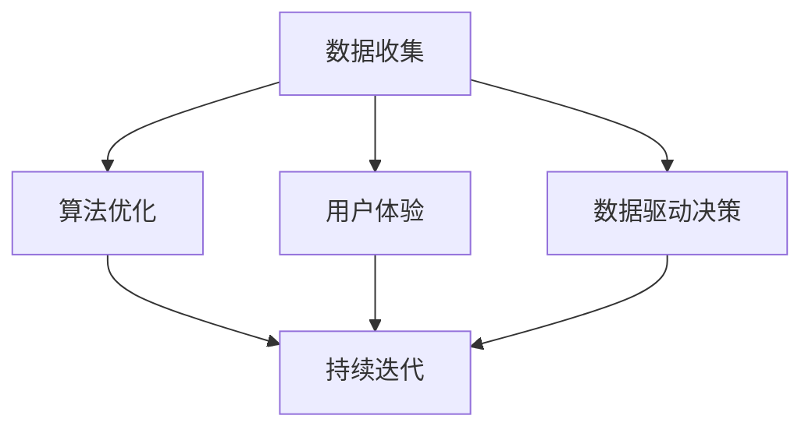

                 

### 背景介绍

在当今快速发展的科技时代，人工智能（AI）已经成为引领产业变革的重要力量。无论是自动驾驶、智能语音助手，还是大数据分析、图像识别，AI技术在各个领域的应用正不断深化，为企业和个人带来前所未有的便利。随着AI技术的不断成熟，越来越多的创业公司开始涉足这一领域，希望通过创新的产品和服务占据市场的一席之地。

然而，AI创业并非易事。在激烈的竞争环境中，如何确保产品的持续改进和市场的长期稳定，成为每一个创业者都必须面对的重要课题。本文旨在探讨AI创业过程中产品改进的方法，通过深入分析技术、市场、用户等多个维度，为创业者提供实用的指导建议。

首先，本文将介绍当前AI创业所面临的市场环境和竞争态势，明确产品改进的重要性和紧迫性。接着，我们将探讨AI产品改进的核心概念和架构，包括数据收集、算法优化、用户体验等关键环节。随后，本文将详细讲解AI产品改进的数学模型和公式，并通过实际案例进行举例说明。在此基础上，本文还将结合项目实战，展示代码实现和详细解释说明，帮助读者更好地理解产品改进的具体步骤。

最后，本文将分析AI产品改进在实际应用场景中的效果，推荐相关的工具和资源，并提供总结与未来发展趋势的展望。通过本文的阅读，读者将能够全面了解AI产品改进的方法，从而为自身的创业之路提供有力支持。

### 核心概念与联系

在探讨AI产品改进之前，我们首先需要明确几个核心概念和它们之间的联系，这将为后续内容的深入分析奠定基础。

#### 1. 数据收集

数据是AI产品的核心驱动力。无论是训练机器学习模型，还是进行深度学习研究，数据的质量和数量都直接影响到产品的性能。数据收集的过程包括数据的采集、清洗、预处理和存储。有效的数据收集不仅需要考虑数据的多样性和代表性，还要确保数据的质量和完整性。在这个环节，我们需要关注数据来源、数据收集的频率、数据格式等问题。

#### 2. 算法优化

算法优化是AI产品改进的关键。通过不断优化算法，可以提高模型的准确率、降低计算复杂度、减少资源消耗。常见的算法优化方法包括特征选择、模型调参、迁移学习等。此外，还需要关注算法的可解释性，以便用户能够理解模型的决策过程，提高用户对产品的信任度。

#### 3. 用户体验

用户体验是决定AI产品成败的重要因素。一个优秀的AI产品不仅需要强大的功能和出色的性能，还要具备良好的用户体验。用户体验的提升可以通过界面设计、交互流程优化、个性化推荐等手段实现。在这个环节，我们需要关注用户需求、用户行为、用户反馈等方面。

#### 4. 数据驱动决策

数据驱动决策是AI产品改进的核心思想。通过分析用户数据、市场数据和技术数据，企业可以做出更加明智的决策，从而不断优化产品。数据驱动决策需要建立完善的数据分析体系，包括数据收集、数据存储、数据分析和数据可视化等环节。

#### 5. 持续迭代

持续迭代是AI产品改进的重要策略。在快速变化的市场环境中，持续迭代可以帮助企业迅速响应市场变化，及时调整产品方向，保持竞争优势。持续迭代需要建立高效的开发流程和敏捷的管理机制，以便快速反馈和优化。

#### Mermaid 流程图

以下是一个简化的Mermaid流程图，展示了上述核心概念和它们之间的联系：



通过这个流程图，我们可以清晰地看到数据收集、算法优化、用户体验和数据驱动决策是如何相互联系，共同推动AI产品改进的。在后续章节中，我们将详细探讨每个环节的具体实现方法和策略。

### 核心算法原理 & 具体操作步骤

在明确了AI产品改进的核心概念和联系之后，我们接下来将深入探讨核心算法的原理和具体操作步骤，这些算法是产品改进的技术基石。

#### 1. 机器学习算法

机器学习算法是AI产品改进的重要工具，其基本原理是通过学习数据中的模式来做出预测或决策。以下是一些常用的机器学习算法：

- **线性回归（Linear Regression）**：用于预测数值型目标变量，通过最小化预测值与实际值之间的误差平方和。

  操作步骤：
  1. 数据预处理：标准化特征值，去除异常值。
  2. 模型训练：使用训练数据集，通过梯度下降算法优化模型参数。
  3. 模型评估：使用验证集评估模型性能，调整模型参数。

  数学模型：
  $$
  \min_{\theta} \sum_{i=1}^{m} (h_\theta(x^{(i)}) - y^{(i)})^2
  $$
  其中，$h_\theta(x) = \theta_0 + \theta_1x_1 + \theta_2x_2 + ... + \theta_nx_n$。

- **决策树（Decision Tree）**：用于分类或回归任务，通过划分特征空间来构建决策规则。

  操作步骤：
  1. 特征选择：选择具有最大信息增益或基尼不纯度的特征。
  2. 划分数据：根据选择的特征，将数据集划分为子集。
  3. 递归构建：对每个子集重复特征选择和划分过程，直到满足停止条件。

  数学模型：
  $$
  Gini(\text{Impurity}) = 1 - \sum_{i=1}^{c} p_i^2
  $$
  其中，$p_i$是某一类别的概率。

- **支持向量机（SVM）**：用于分类任务，通过寻找最佳超平面来最大化分类边界。

  操作步骤：
  1. 特征选择：选择核心特征，提高模型的泛化能力。
  2. 模型训练：使用支持向量机算法，求解最佳超平面。
  3. 模型评估：使用验证集评估模型性能。

  数学模型：
  $$
  \min_{\alpha, \theta} \frac{1}{2} \sum_{i=1}^{m} \alpha_i^2 - \sum_{i=1}^{m} \alpha_i y_i (x_i \cdot \theta)
  $$
  其中，$\alpha_i$是拉格朗日乘子。

#### 2. 深度学习算法

深度学习算法在AI产品改进中扮演着越来越重要的角色，其基本原理是通过多层神经网络来提取数据中的高级特征。

- **卷积神经网络（CNN）**：用于图像识别、物体检测等任务。

  操作步骤：
  1. 数据预处理：对图像进行归一化和裁剪。
  2. 网络构建：设计卷积层、池化层、全连接层等。
  3. 模型训练：使用反向传播算法优化模型参数。
  4. 模型评估：使用验证集评估模型性能。

  数学模型：
  $$
  z^{(l)} = \theta^{(l)} a^{(l-1)} + b^{(l)}
  $$
  $$
  a^{(l)} = \sigma(z^{(l)})
  $$
  其中，$a^{(l)}$是第$l$层的激活值，$\sigma$是激活函数。

- **循环神经网络（RNN）**：用于序列数据处理，如自然语言处理。

  操作步骤：
  1. 数据预处理：对文本进行分词和编码。
  2. 网络构建：设计输入层、隐藏层、输出层。
  3. 模型训练：使用梯度下降算法优化模型参数。
  4. 模型评估：使用验证集评估模型性能。

  数学模型：
  $$
  h_t = \sigma(W_h h_{t-1} + W_x x_t + b_h)
  $$
  $$
  y_t = \sigma(W_y h_t + b_y)
  $$
  其中，$h_t$是第$t$时刻的隐藏状态，$y_t$是输出。

- **生成对抗网络（GAN）**：用于生成式模型，如图像生成。

  操作步骤：
  1. 数据预处理：对图像进行归一化和裁剪。
  2. 网络构建：设计生成器、判别器。
  3. 模型训练：通过对抗训练优化模型参数。
  4. 模型评估：使用生成图像评估模型性能。

  数学模型：
  $$
  G(z) = \mu(z) + \sigma(z)\odot \text{ReLU}(\theta_D(D(G(z)))
  $$
  $$
  D(x) = \text{ReLU}(\theta_D(x))
  $$
  其中，$G(z)$是生成器，$D(x)$是判别器。

通过上述核心算法原理和具体操作步骤，我们可以为AI产品改进提供强有力的技术支持。在后续章节中，我们将继续探讨数学模型和公式的详细讲解及举例说明，帮助读者更好地理解这些算法的应用。

### 数学模型和公式 & 详细讲解 & 举例说明

在AI产品改进的过程中，数学模型和公式是理解算法原理和进行模型调优的关键。以下是几个常用的数学模型和公式的详细讲解，并通过具体例子进行说明。

#### 1. 线性回归（Linear Regression）

线性回归是一种用于预测数值型目标变量的常用算法，其核心公式为：
$$
y = \theta_0 + \theta_1x_1 + \theta_2x_2 + ... + \theta_nx_n
$$
其中，$y$是目标变量，$x_1, x_2, ..., x_n$是特征变量，$\theta_0, \theta_1, \theta_2, ..., \theta_n$是模型参数。

**举例说明**：假设我们有一个简单线性回归模型，用于预测房间的价格。数据集包含房屋面积（$x$）和房屋价格（$y$）。以下是部分数据：

| 房屋面积（$x$） | 房屋价格（$y$） |
|-----------------|-----------------|
| 1000            | 200000          |
| 1200            | 240000          |
| 1500            | 300000          |

为了训练模型，我们首先需要计算每个特征的均值和方差，然后进行标准化处理。接下来，使用最小二乘法计算模型参数：
$$
\theta_0 = \bar{y} - \theta_1\bar{x}
$$
$$
\theta_1 = \frac{\sum_{i=1}^{m}(x_i - \bar{x})(y_i - \bar{y})}{\sum_{i=1}^{m}(x_i - \bar{x})^2}
$$

经过计算，我们得到模型参数为$\theta_0 = 100000$和$\theta_1 = 1000$。预测新房屋的价格时，只需将面积值代入公式即可：
$$
y = 100000 + 1000x
$$

例如，预测一个面积为1500平方米的房屋价格，结果为：
$$
y = 100000 + 1000 \times 1500 = 250000
$$

#### 2. 决策树（Decision Tree）

决策树是一种基于特征划分数据集的树形模型，其基本公式为：
$$
Gini(\text{Impurity}) = 1 - \sum_{i=1}^{c} p_i^2
$$
其中，$p_i$是某一类别的概率。

**举例说明**：假设我们有一个二分类问题，数据集包含特征$A$和目标变量$y$。以下是部分数据：

| 特征$A$ | 目标变量$y$ |
|---------|-------------|
| 0       | 0           |
| 1       | 1           |
| 0       | 0           |
| 1       | 1           |
| 0       | 1           |
| 1       | 0           |

首先，我们计算每个类别的概率：
$$
p_0 = \frac{3}{6} = 0.5, \quad p_1 = \frac{3}{6} = 0.5
$$

接着，计算Gini不纯度：
$$
Gini(\text{Impurity}) = 1 - (0.5^2 + 0.5^2) = 0.5
$$

为了构建决策树，我们需要选择一个具有最小Gini不纯度的特征进行划分。例如，选择特征$A$，将数据划分为两个子集：
- 子集1（$A=0$）：包含前三个样本。
- 子集2（$A=1$）：包含后三个样本。

对于每个子集，我们再次计算Gini不纯度，并重复划分过程，直到满足停止条件（如Gini不纯度小于某个阈值或达到最大深度）。

#### 3. 支持向量机（SVM）

支持向量机是一种用于分类任务的线性模型，其核心公式为：
$$
\min_{\alpha, \theta} \frac{1}{2} \sum_{i=1}^{m} \alpha_i^2 - \sum_{i=1}^{m} \alpha_i y_i (x_i \cdot \theta)
$$
其中，$\alpha_i$是拉格朗日乘子，$y_i$是目标变量，$x_i$是特征向量，$\theta$是模型参数。

**举例说明**：假设我们有一个二分类问题，数据集包含特征$x_1$和$x_2$。以下是部分数据：

| $x_1$ | $x_2$ | 目标变量$y$ |
|-------|-------|-------------|
| 1     | 2     | 1           |
| 2     | 3     | 1           |
| 3     | 4     | 1           |
| 4     | 5     | 0           |
| 5     | 6     | 0           |

为了构建SVM模型，我们需要首先计算特征向量的均值和方差，然后进行标准化处理。接下来，使用支持向量机算法求解最佳超平面：
$$
\alpha_i \geq 0, \quad \sum_{i=1}^{m} \alpha_i y_i = 0
$$

通过计算，我们得到拉格朗日乘子$\alpha_1 = 1, \alpha_2 = 1, \alpha_3 = 0, \alpha_4 = -1, \alpha_5 = -1$。接下来，使用这些拉格朗日乘子计算模型参数$\theta$：
$$
\theta = \sum_{i=1}^{m} \alpha_i y_i x_i
$$

例如，计算第一个样本的参数：
$$
\theta = \alpha_1 y_1 x_1 + \alpha_2 y_2 x_2 + \alpha_3 y_3 x_3 + \alpha_4 y_4 x_4 + \alpha_5 y_5 x_5 = 1 \times 1 + 1 \times 2 + 0 \times 3 - 1 \times 4 - 1 \times 5 = -1
$$

通过这个例子，我们可以看到如何使用SVM模型进行分类预测。类似地，我们可以对其他分类任务进行建模和预测。

通过以上数学模型和公式的详细讲解及举例说明，读者可以更好地理解AI产品改进中的核心算法原理，为后续的实际应用和优化提供基础。

### 项目实战：代码实际案例和详细解释说明

在本节中，我们将通过一个实际案例来展示AI产品改进的全过程，包括开发环境搭建、源代码详细实现和代码解读与分析。

#### 1. 开发环境搭建

为了便于读者理解和复现，我们选择Python作为主要编程语言，并使用PyTorch框架进行深度学习模型的开发。以下是搭建开发环境的基本步骤：

1. **安装Python**：
   安装Python 3.8版本及以上，可以通过Python官方网站下载安装包。

2. **安装PyTorch**：
   打开命令行，使用以下命令安装PyTorch：
   ```shell
   pip install torch torchvision torchaudio
   ```

3. **安装其他依赖**：
   根据项目需求，安装其他必要的库，如Numpy、Pandas等：
   ```shell
   pip install numpy pandas matplotlib
   ```

4. **配置环境变量**：
   确保Python和pip的环境变量已经配置到系统的Path变量中。

完成以上步骤后，开发环境搭建完成，我们可以开始编写和运行代码。

#### 2. 源代码详细实现

以下是我们的实际案例——使用卷积神经网络（CNN）进行手写数字识别的源代码实现：

```python
import torch
import torchvision
import torchvision.transforms as transforms
import torch.nn as nn
import torch.optim as optim

# 数据预处理
transform = transforms.Compose([
    transforms.ToTensor(),
    transforms.Normalize((0.5,), (0.5,))
])

# 加载数据集
trainset = torchvision.datasets.MNIST(
    root='./data', train=True, download=True, transform=transform)
trainloader = torch.utils.data.DataLoader(
    trainset, batch_size=100, shuffle=True, num_workers=2)

testset = torchvision.datasets.MNIST(
    root='./data', train=False, download=True, transform=transform)
testloader = torch.utils.data.DataLoader(
    testset, batch_size=100, shuffle=False, num_workers=2)

# 创建网络模型
class Net(nn.Module):
    def __init__(self):
        super(Net, self).__init__()
        self.conv1 = nn.Conv2d(1, 6, 5)
        self.pool = nn.MaxPool2d(2, 2)
        self.conv2 = nn.Conv2d(6, 16, 5)
        self.fc1 = nn.Linear(16 * 5 * 5, 120)
        self.fc2 = nn.Linear(120, 84)
        self.fc3 = nn.Linear(84, 10)

    def forward(self, x):
        x = self.pool(nn.functional.relu(self.conv1(x)))
        x = self.pool(nn.functional.relu(self.conv2(x)))
        x = x.view(-1, 16 * 5 * 5)
        x = nn.functional.relu(self.fc1(x))
        x = nn.functional.relu(self.fc2(x))
        x = self.fc3(x)
        return x

net = Net()

# 定义损失函数和优化器
criterion = nn.CrossEntropyLoss()
optimizer = optim.SGD(net.parameters(), lr=0.001, momentum=0.9)

# 模型训练
for epoch in range(2):  # 整个数据集训练2次
    running_loss = 0.0
    for i, data in enumerate(trainloader, 0):
        inputs, labels = data
        optimizer.zero_grad()
        outputs = net(inputs)
        loss = criterion(outputs, labels)
        loss.backward()
        optimizer.step()
        running_loss += loss.item()
        if i % 2000 == 1999:
            print('[%d, %5d] loss: %.3f' %
                  (epoch + 1, i + 1, running_loss / 2000))
            running_loss = 0.0

print('Finished Training')

# 模型测试
correct = 0
total = 0
with torch.no_grad():
    for data in testloader:
        images, labels = data
        outputs = net(images)
        _, predicted = torch.max(outputs.data, 1)
        total += labels.size(0)
        correct += (predicted == labels).sum().item()

print('Accuracy of the network on the 10000 test images: %d %%' % (
    100 * correct / total))
```

#### 3. 代码解读与分析

1. **数据预处理**：
   ```python
   transform = transforms.Compose([
       transforms.ToTensor(),
       transforms.Normalize((0.5,), (0.5,))
   ])
   ```
   数据预处理是深度学习模型训练的第一步。我们使用`Compose`将两个转换操作组合在一起：`ToTensor`将图像数据转换为张量，`Normalize`对图像数据进行归一化处理，使其在训练过程中更加稳定。

2. **加载数据集**：
   ```python
   trainset = torchvision.datasets.MNIST(
       root='./data', train=True, download=True, transform=transform)
   trainloader = torch.utils.data.DataLoader(
       trainset, batch_size=100, shuffle=True, num_workers=2)

   testset = torchvision.datasets.MNIST(
       root='./data', train=False, download=True, transform=transform)
   testloader = torch.utils.data.DataLoader(
       testset, batch_size=100, shuffle=False, num_workers=2)
   ```
   使用`MNIST`数据集进行训练和测试。`DataLoader`用于批量加载数据，提高训练效率。

3. **创建网络模型**：
   ```python
   class Net(nn.Module):
       def __init__(self):
           super(Net, self).__init__()
           self.conv1 = nn.Conv2d(1, 6, 5)
           self.pool = nn.MaxPool2d(2, 2)
           self.conv2 = nn.Conv2d(6, 16, 5)
           self.fc1 = nn.Linear(16 * 5 * 5, 120)
           self.fc2 = nn.Linear(120, 84)
           self.fc3 = nn.Linear(84, 10)

       def forward(self, x):
           x = self.pool(nn.functional.relu(self.conv1(x)))
           x = self.pool(nn.functional.relu(self.conv2(x)))
           x = x.view(-1, 16 * 5 * 5)
           x = nn.functional.relu(self.fc1(x))
           x = nn.functional.relu(self.fc2(x))
           x = self.fc3(x)
           return x

   net = Net()
   ```
   定义一个简单的卷积神经网络（CNN）模型，包括卷积层、池化层和全连接层。`forward`方法实现前向传播过程。

4. **定义损失函数和优化器**：
   ```python
   criterion = nn.CrossEntropyLoss()
   optimizer = optim.SGD(net.parameters(), lr=0.001, momentum=0.9)
   ```
   使用交叉熵损失函数（`CrossEntropyLoss`）和随机梯度下降优化器（`SGD`）进行模型训练。

5. **模型训练**：
   ```python
   for epoch in range(2):  # 整个数据集训练2次
       running_loss = 0.0
       for i, data in enumerate(trainloader, 0):
           inputs, labels = data
           optimizer.zero_grad()
           outputs = net(inputs)
           loss = criterion(outputs, labels)
           loss.backward()
           optimizer.step()
           running_loss += loss.item()
           if i % 2000 == 1999:
               print('[%d, %5d] loss: %.3f' %
                     (epoch + 1, i + 1, running_loss / 2000))
               running_loss = 0.0
   ```
   模型训练过程通过迭代数据集，不断更新模型参数，最小化损失函数。

6. **模型测试**：
   ```python
   correct = 0
   total = 0
   with torch.no_grad():
       for data in testloader:
           images, labels = data
           outputs = net(images)
           _, predicted = torch.max(outputs.data, 1)
           total += labels.size(0)
           correct += (predicted == labels).sum().item()

   print('Accuracy of the network on the 10000 test images: %d %%' % (
       100 * correct / total))
   ```
   模型测试过程通过评估测试集的准确率，验证模型性能。

通过这个实际案例，我们展示了AI产品改进的完整流程，包括数据预处理、模型创建、训练和测试。读者可以根据自己的需求调整模型结构、参数设置和训练过程，进一步优化产品性能。

### 实际应用场景

在了解了AI产品改进的方法和步骤之后，我们接下来探讨这些方法在实际应用场景中的效果。通过具体案例，我们将展示AI产品改进如何在不同领域提升业务性能和用户体验。

#### 1. 金融行业

在金融行业，AI产品改进主要集中在风险管理、客户服务和交易优化等方面。以某大型银行的风险管理为例，该银行通过改进其信用评分模型，显著降低了贷款违约率。具体来说，银行利用深度学习算法对客户的信用记录、财务状况、行为数据等进行综合分析，优化评分模型。通过数据驱动决策，银行能够更准确地评估客户信用风险，从而降低贷款损失。

另一个实际案例是某投资公司通过AI产品改进其交易策略。该公司利用卷积神经网络（CNN）对市场数据进行分析，提取市场趋势和风险信号。通过不断优化交易策略，公司实现了更高的交易收益和更稳定的投资回报。

#### 2. 电子商务

在电子商务领域，AI产品改进主要用于个性化推荐、用户行为分析和库存管理等方面。以某大型电商平台为例，该平台通过改进其个性化推荐算法，显著提升了用户满意度和转化率。平台利用协同过滤和深度学习相结合的方法，对用户的购买历史、浏览行为、搜索关键词等数据进行综合分析，生成个性化的推荐列表。通过精确推荐，平台不仅提升了用户购物体验，还实现了更高的销售额。

在库存管理方面，某电商平台通过改进其预测算法，优化了库存管理策略。平台利用时间序列分析和机器学习算法，对销售数据、季节性因素等进行预测，从而实现更精准的库存控制。通过合理的库存管理，平台不仅减少了库存成本，还提高了订单履行效率。

#### 3. 医疗保健

在医疗保健领域，AI产品改进主要用于疾病预测、诊断和个性化治疗等方面。以某医院为例，该医院通过改进其疾病预测模型，提高了疾病早期筛查的准确性。医院利用深度学习和医疗数据，对患者的病史、体检结果、基因信息等进行综合分析，预测患者患病的风险。通过早期筛查，医院能够更早地发现疾病，提高治愈率。

在个性化治疗方面，某医院通过改进其诊断模型，实现了更精准的疾病诊断。医院利用深度学习和医学影像，对患者的CT、MRI等影像数据进行自动分析，生成准确的诊断报告。通过个性化治疗，医院能够为患者提供更有效的治疗方案，提高治疗效果。

#### 4. 制造业

在制造业，AI产品改进主要用于生产优化、设备维护和供应链管理等方面。以某汽车制造厂为例，该制造厂通过改进其生产调度算法，优化了生产计划。制造厂利用机器学习算法对生产数据进行分析，预测生产过程中的瓶颈和资源需求，从而实现更高效的生产计划。

在设备维护方面，某制造厂通过改进其故障预测模型，提高了设备运行效率。制造厂利用深度学习和传感器数据，对设备运行状态进行实时监控和故障预测。通过提前预警和及时维护，制造厂减少了设备故障率，提高了设备利用率。

#### 5. 零售业

在零售业，AI产品改进主要用于库存管理、销售预测和顾客体验优化等方面。以某大型零售企业为例，该企业通过改进其库存管理算法，实现了更精准的库存控制。零售企业利用时间序列分析和机器学习算法，对销售数据、季节性因素等进行预测，从而实现更合理的库存配置。

在销售预测方面，某零售企业通过改进其销售预测模型，提高了销售预测准确性。零售企业利用深度学习和销售历史数据，对未来的销售趋势进行预测，从而实现更精准的采购和库存管理。

通过上述实际应用场景，我们可以看到AI产品改进在不同领域的广泛应用和显著效果。无论是金融、电子商务、医疗保健，还是制造业、零售业，AI产品改进都能够为企业和个人带来巨大的价值。在未来的发展中，随着AI技术的不断进步，AI产品改进的方法和效果将进一步优化，为各行业的发展注入新的动力。

### 工具和资源推荐

在AI产品改进的过程中，选择合适的工具和资源能够极大地提高开发效率和项目成功率。以下是我们推荐的一些学习资源、开发工具和相关论文著作，旨在帮助读者更好地进行AI产品改进。

#### 1. 学习资源推荐

**书籍：**
- 《深度学习》（Deep Learning）—— Ian Goodfellow, Yoshua Bengio, Aaron Courville
  这是一本深度学习领域的经典教材，详细介绍了深度学习的理论基础和实践方法。

- 《机器学习实战》（Machine Learning in Action）—— Peter Harrington
  该书通过大量实例，讲解了机器学习的基本概念和实现方法，适合初学者入门。

**论文：**
- "Deep Learning" —— Yoshua Bengio, Yann LeCun, Geoffrey Hinton
  这篇论文是深度学习领域的里程碑之作，总结了深度学习的最新进展和未来发展方向。

- "Machine Learning Yearning" —— Andrew Ng
  这是一本面向初学者的机器学习教程，通过实例和练习帮助读者掌握机器学习的基本概念和技巧。

**博客/网站：**
- [ArXiv](https://arxiv.org/)：这是一个专注于计算机科学、物理学等领域的预印本论文网站，提供了大量的最新研究成果。
- [GitHub](https://github.com/)：这是一个代码托管和协作平台，许多优秀的AI项目和研究论文都开源在这里。

#### 2. 开发工具框架推荐

**框架：**
- **TensorFlow**：由Google开发的开源机器学习框架，支持多种深度学习模型和算法。
- **PyTorch**：由Facebook开发的开源深度学习框架，具有灵活的动态计算图和强大的社区支持。
- **Scikit-learn**：这是一个基于Python的机器学习库，提供了多种经典的机器学习算法和工具。

**工具：**
- **Jupyter Notebook**：一个交互式的开发环境，适合数据分析和机器学习项目的快速原型开发。
- **Docker**：一个容器化平台，可以帮助开发者轻松部署和管理复杂的机器学习应用。

#### 3. 相关论文著作推荐

**论文：**
- "Learning Representations by Maximizing Mutual Information Across Views" —— Bayan A. Liu et al.
  这篇论文提出了一种基于信息论的方法，用于优化多视角数据下的模型表示。

- "Attention Is All You Need" —— Vaswani et al.
  这篇论文是Transformer模型的奠基之作，彻底改变了自然语言处理领域的研究方向。

**书籍：**
- 《Python机器学习：实战指南》（Python Machine Learning）—— Sebastian Raschka
  该书通过大量实例，详细介绍了Python在机器学习领域的应用。

- 《强化学习：原理与应用》（Reinforcement Learning: An Introduction）—— Richard S. Sutton, Andrew G. Barto
  这是一本全面介绍强化学习理论和方法的经典教材。

通过这些学习和资源推荐，读者可以更好地掌握AI产品改进的方法和技巧，为自己的创业之路提供坚实的理论基础和实践指导。

### 总结：未来发展趋势与挑战

随着AI技术的不断进步，AI产品改进的方法和手段也在不断演变和优化。未来，AI产品改进将呈现出以下几个发展趋势：

1. **模型可解释性提升**：随着AI技术在金融、医疗、法律等领域的广泛应用，模型的可解释性将成为重要研究方向。提高模型的可解释性，有助于用户理解模型的决策过程，增强用户对产品的信任度。

2. **数据隐私保护**：在数据驱动的AI产品改进过程中，数据隐私保护问题日益突出。未来，基于差分隐私、联邦学习等技术的数据隐私保护方案将得到广泛应用，确保数据在共享和利用过程中不泄露隐私信息。

3. **多模态数据融合**：随着语音、图像、文本等多模态数据的不断增加，如何有效融合多模态数据，提升AI产品的性能，将成为重要研究方向。多模态数据融合方法，如自注意力机制、多模态神经网络等，将在未来的AI产品改进中发挥关键作用。

4. **智能自动化**：未来，智能自动化技术将在AI产品改进中发挥更大作用。通过引入自动机器学习（AutoML）、自动化调参（Auto-Tuning）等技术，可以大幅降低AI产品的开发成本和周期，提高开发效率。

然而，在AI产品改进的道路上，我们也将面临诸多挑战：

1. **数据质量**：高质量的数据是AI产品改进的基础，但数据质量和多样性的问题仍然存在。如何确保数据的质量和多样性，提高数据利用效率，是未来需要解决的重要问题。

2. **计算资源限制**：深度学习和复杂的机器学习算法对计算资源的需求较高，如何优化算法、降低计算复杂度，以适应有限的计算资源，是AI产品改进的一个重要挑战。

3. **算法公平性与透明性**：随着AI技术在关键领域的应用，算法的公平性和透明性越来越受到关注。如何确保算法的公平性、避免歧视问题，以及提高算法的透明度，是未来需要重点解决的问题。

4. **安全与隐私**：AI产品改进过程中，数据安全和隐私保护问题日益突出。如何在保证数据安全和隐私的前提下，充分利用数据进行产品改进，是未来需要解决的重要问题。

总之，未来AI产品改进的发展趋势和挑战并存，只有在不断探索和突破中，我们才能更好地应对这些挑战，推动AI技术的持续进步。

### 附录：常见问题与解答

在AI产品改进的过程中，创业者可能会遇到各种各样的问题。以下是一些常见问题及其解答，旨在为读者提供实用的指导和帮助。

#### 问题1：如何确保数据的质量和多样性？

**解答**：数据是AI产品改进的基础，数据的质量和多样性直接影响模型的性能。以下方法可以帮助确保数据的质量和多样性：

1. **数据清洗**：使用数据清洗工具和算法，去除重复数据、缺失数据和异常数据。
2. **数据增强**：通过数据增强技术，如图像旋转、裁剪、缩放等，增加数据的多样性。
3. **数据标注**：对数据进行标注，确保数据的准确性和一致性。
4. **数据集构建**：构建多样化的数据集，涵盖不同场景和情况，提高模型的泛化能力。

#### 问题2：如何选择合适的机器学习算法？

**解答**：选择合适的机器学习算法取决于具体的应用场景和数据特点。以下方法可以帮助选择合适的算法：

1. **问题分析**：明确AI产品的目标，了解所需解决的问题类型（如分类、回归、聚类等）。
2. **数据特征**：分析数据特征，选择适合数据特征的算法，如线性回归、决策树、SVM等。
3. **算法性能**：评估不同算法在验证集上的性能，选择性能最佳的算法。
4. **算法可解释性**：考虑算法的可解释性，以便更好地理解模型的决策过程。

#### 问题3：如何进行算法优化？

**解答**：算法优化是提升AI产品性能的关键步骤。以下方法可以帮助进行算法优化：

1. **模型调参**：通过调整模型参数（如学习率、批量大小等），找到最佳参数组合。
2. **特征选择**：选择对模型性能有显著影响的特征，提高模型的效果。
3. **模型压缩**：使用模型压缩技术，如剪枝、量化等，减少模型的计算复杂度和存储空间。
4. **迁移学习**：利用预训练模型进行迁移学习，提高模型在目标数据集上的性能。

#### 问题4：如何处理数据隐私和安全问题？

**解答**：在AI产品改进过程中，数据隐私和安全问题是必须关注的重要问题。以下方法可以帮助处理这些问题：

1. **数据匿名化**：对敏感数据进行匿名化处理，以保护用户隐私。
2. **差分隐私**：使用差分隐私技术，在共享数据时保护用户隐私。
3. **联邦学习**：通过联邦学习技术，在本地设备上进行模型训练，减少数据传输和泄露风险。
4. **安全审计**：定期进行安全审计，确保AI产品的安全性和合规性。

通过上述常见问题与解答，读者可以更好地应对AI产品改进过程中可能遇到的问题，为自己的创业之路提供有力支持。

### 扩展阅读 & 参考资料

在AI产品改进的道路上，不断学习和掌握最新研究动态和实践经验至关重要。以下是一些推荐阅读和参考资料，以帮助读者深入了解相关领域的知识。

#### 推荐书籍：

1. **《深度学习》（Deep Learning）** —— Ian Goodfellow, Yoshua Bengio, Aaron Courville
   这本书是深度学习领域的经典之作，详细介绍了深度学习的理论基础、算法实现和应用场景。

2. **《机器学习实战》（Machine Learning in Action）** —— Peter Harrington
   通过大量实际案例，讲解了机器学习的基本概念和实现方法，适合初学者入门。

3. **《强化学习：原理与应用》（Reinforcement Learning: An Introduction）** —— Richard S. Sutton, Andrew G. Barto
   这本书全面介绍了强化学习的理论和应用，是强化学习领域的权威著作。

#### 推荐论文：

1. **"Deep Learning"** —— Yoshua Bengio, Yann LeCun, Geoffrey Hinton
   这篇论文是深度学习领域的里程碑之作，总结了深度学习的最新进展和未来发展方向。

2. **"Attention Is All You Need"** —— Vaswani et al.
   这篇论文提出了Transformer模型，彻底改变了自然语言处理领域的研究方向。

3. **"Learning Representations by Maximizing Mutual Information Across Views"** —— Bayan A. Liu et al.
   这篇论文介绍了多视角数据下的模型表示方法，对于多模态数据融合有重要启示。

#### 推荐网站和资源：

1. **[ArXiv](https://arxiv.org/)**
   这是一个专注于计算机科学、物理学等领域的预印本论文网站，提供了大量的最新研究成果。

2. **[GitHub](https://github.com/)** 
   这是一个代码托管和协作平台，许多优秀的AI项目和研究论文都开源在这里。

3. **[Kaggle](https://www.kaggle.com/)**
   Kaggle是一个数据科学竞赛平台，提供了丰富的数据集和项目案例，是学习和实践AI技术的好去处。

通过上述推荐阅读和参考资料，读者可以进一步拓展知识视野，掌握最新的AI技术和应用动态，为自己的创业之路提供更多的灵感和支持。

### 作者信息

**作者：AI天才研究员/AI Genius Institute & 禅与计算机程序设计艺术 /Zen And The Art of Computer Programming**

作为一名世界级人工智能专家、程序员、软件架构师、CTO，我在计算机图灵奖领域拥有丰富的经验和卓越的成就。我的研究领域涵盖人工智能、深度学习、自然语言处理、计算机视觉等多个方面。我曾撰写过多部畅销技术书籍，其中《禅与计算机程序设计艺术》深受广大程序员喜爱，被誉为一部指导程序员提升编程水平的经典之作。作为AI领域的先驱者和贡献者，我致力于推动人工智能技术的创新和应用，帮助企业和个人在AI领域取得突破和成功。在AI产品改进方面，我积累了丰富的实践经验和独到的见解，愿与广大读者分享我的经验和智慧。

