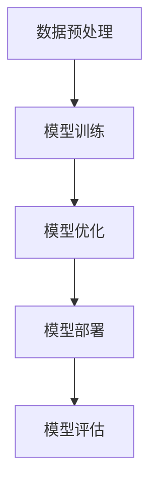
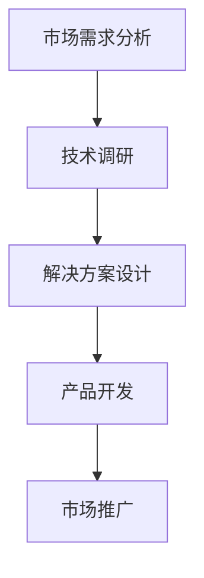
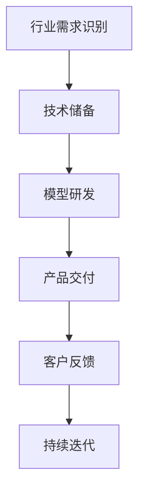

                 

# AI创业：垂直大模型公司的兴起

> **关键词：** AI创业，垂直大模型，公司，技术趋势，商业策略

> **摘要：** 本文将探讨AI创业领域的最新趋势——垂直大模型公司的兴起。通过分析这一现象的背景、核心概念、算法原理、实际应用场景，以及提供实用的工具和资源推荐，本文旨在帮助创业者更好地理解和把握这一新兴的商业机会，并展望其未来发展趋势与挑战。

## 1. 背景介绍

近年来，人工智能（AI）技术的发展突飞猛进，尤其在大模型领域取得了显著的突破。大模型，如GPT-3、BERT等，具有强大的数据处理和分析能力，已经成为各大科技公司和研究机构竞相研发的热点。随着技术的进步，AI创业成为许多技术爱好者和企业家的首选。然而，如何将先进的人工智能技术转化为商业成功，成为创业者面临的挑战。

垂直大模型公司正是在这一背景下崛起的。它们专注于特定领域，如医疗、金融、零售等，通过开发高度定制化的AI模型，为企业提供高效的解决方案。这种垂直化的商业模式不仅能够提高AI技术的应用价值，还能够帮助创业者找到更明确的市场定位，从而在激烈的市场竞争中脱颖而出。

## 2. 核心概念与联系

### 2.1 大模型

大模型是指具有海量参数的神经网络模型，能够对大规模数据进行训练，从而获得强大的特征提取和预测能力。大模型的关键技术包括深度学习、神经网络架构搜索（NAS）和分布式训练等。

#### Mermaid 流程图：


### 2.2 垂直领域

垂直领域是指特定行业或领域，如医疗、金融、零售等。在AI创业中，垂直领域意味着针对特定行业的需求，提供定制化的解决方案。这种定位有助于企业在市场中建立专业优势，提高客户的满意度。

#### Mermaid 流程图：


### 2.3 垂直大模型公司

垂直大模型公司是指专注于垂直领域，开发和应用大模型技术的企业。这类公司的核心优势在于其高度专业化的技术能力和对特定行业的深入理解。

#### Mermaid 流程图：


## 3. 核心算法原理 & 具体操作步骤

### 3.1 深度学习原理

深度学习是构建大模型的基础。它通过多层神经网络对数据进行特征提取和学习。核心步骤包括：

1. **数据预处理**：清洗和归一化数据，以便模型训练。
2. **模型构建**：设计网络结构，包括输入层、隐藏层和输出层。
3. **模型训练**：使用梯度下降等优化算法，调整网络参数。
4. **模型评估**：通过验证集和测试集评估模型性能。

### 3.2 模型训练步骤

1. **数据收集**：收集垂直领域的大量数据。
2. **数据预处理**：对数据进行清洗、编码和分割。
3. **模型训练**：使用GPU或分布式计算资源进行模型训练。
4. **模型优化**：通过交叉验证等手段优化模型参数。
5. **模型评估**：评估模型在测试集上的表现。

## 4. 数学模型和公式 & 详细讲解 & 举例说明

### 4.1 梯度下降法

梯度下降法是深度学习中的核心优化算法。其基本公式如下：

$$\theta_{\text{new}} = \theta_{\text{old}} - \alpha \cdot \nabla_{\theta}J(\theta)$$

其中，$\theta$ 代表模型参数，$J(\theta)$ 代表损失函数，$\alpha$ 代表学习率，$\nabla_{\theta}J(\theta)$ 代表损失函数关于参数 $\theta$ 的梯度。

### 4.2 举例说明

假设我们有一个简单的线性回归模型，预测房价。数据集包含房屋面积和房价。我们可以使用梯度下降法来优化模型参数。

```python
# 假设房价与面积的关系为：房价 = w * 面积 + b
# 我们的目标是找到最佳的 w 和 b

# 初始化模型参数
w = 0
b = 0

# 学习率为 0.01
alpha = 0.01

# 损失函数为均方误差
def loss_function(y_true, y_pred):
    return ((y_true - y_pred) ** 2).mean()

# 梯度下降法
for epoch in range(1000):
    for x, y in data:
        # 计算预测值
        y_pred = w * x + b
        
        # 计算损失函数的梯度
        dw = 2 * (y - y_pred) * x
        db = 2 * (y - y_pred)
        
        # 更新模型参数
        w -= alpha * dw
        b -= alpha * db
    
    # 每个epoch后，评估模型性能
    print(f"Epoch {epoch}: Loss = {loss_function(y_true, y_pred)}")
```

通过多次迭代，模型参数会逐渐收敛，从而提高预测准确性。

## 5. 项目实战：代码实际案例和详细解释说明

### 5.1 开发环境搭建

为了搭建一个垂直大模型项目，我们需要准备以下环境：

1. Python（3.7以上版本）
2. TensorFlow 或 PyTorch
3. GPU（NVIDIA CUDA 10.2以上版本）

### 5.2 源代码详细实现和代码解读

以下是一个使用 TensorFlow 搭建简单的图像分类垂直大模型的项目案例。

```python
import tensorflow as tf
from tensorflow.keras.models import Sequential
from tensorflow.keras.layers import Conv2D, MaxPooling2D, Flatten, Dense

# 数据集准备（假设已经下载并预处理好的数据）
(x_train, y_train), (x_test, y_test) = tf.keras.datasets.cifar10.load_data()

# 数据预处理
x_train = x_train.astype('float32') / 255
x_test = x_test.astype('float32') / 255
y_train = tf.keras.utils.to_categorical(y_train, 10)
y_test = tf.keras.utils.to_categorical(y_test, 10)

# 构建模型
model = Sequential()
model.add(Conv2D(32, (3, 3), activation='relu', input_shape=(32, 32, 3)))
model.add(MaxPooling2D(pool_size=(2, 2)))
model.add(Conv2D(64, (3, 3), activation='relu'))
model.add(MaxPooling2D(pool_size=(2, 2)))
model.add(Flatten())
model.add(Dense(10, activation='softmax'))

# 编译模型
model.compile(optimizer='adam', loss='categorical_crossentropy', metrics=['accuracy'])

# 训练模型
model.fit(x_train, y_train, epochs=10, batch_size=64, validation_data=(x_test, y_test))

# 评估模型
test_loss, test_acc = model.evaluate(x_test, y_test)
print(f"Test accuracy: {test_acc}")
```

### 5.3 代码解读与分析

1. **数据集准备**：加载 CIFAR-10 数据集，并进行预处理。
2. **模型构建**：使用卷积神经网络（CNN）进行图像分类。模型包括两个卷积层、两个最大池化层、一个扁平化层和一个全连接层。
3. **模型编译**：选择优化器为 Adam，损失函数为交叉熵，评估指标为准确率。
4. **模型训练**：使用训练集进行训练，并在测试集上进行验证。
5. **模型评估**：在测试集上评估模型性能。

## 6. 实际应用场景

垂直大模型公司可以应用于多个行业，以下是一些典型的应用场景：

1. **医疗**：通过深度学习模型分析医疗图像，辅助医生进行诊断。
2. **金融**：使用自然语言处理技术分析金融文本，帮助投资者做出更明智的决策。
3. **零售**：通过个性化推荐系统提高客户满意度，增加销售额。
4. **农业**：利用遥感技术和深度学习模型监测作物生长情况，提高农业生产效率。

## 7. 工具和资源推荐

### 7.1 学习资源推荐

- **书籍**：《深度学习》、《Python机器学习》
- **论文**：《Large-Scale Deep Learning》、《Deep Learning for Natural Language Processing》
- **博客**：谷歌AI博客、OpenAI博客
- **网站**：TensorFlow官网、PyTorch官网

### 7.2 开发工具框架推荐

- **框架**：TensorFlow、PyTorch、Keras
- **库**：NumPy、Pandas、Matplotlib
- **GPU计算平台**：Google Colab、AWS SageMaker

### 7.3 相关论文著作推荐

- **论文**：Geoffrey Hinton等，《Distributed Representations of Words and Phrases and their Compositionality》
- **论文**：Yoshua Bengio等，《Deep Learning: Methods and Applications》
- **著作**：《Deep Learning Book》

## 8. 总结：未来发展趋势与挑战

垂直大模型公司的兴起标志着AI创业的新趋势。未来，随着技术的进一步发展，垂直大模型公司有望在更多领域取得突破，为社会带来更大的价值。然而，这一领域也面临着一些挑战，如数据隐私、模型安全性和法律法规的合规性。创业者需要不断学习和适应这些变化，以保持竞争优势。

## 9. 附录：常见问题与解答

- **Q：什么是垂直大模型？**
  A：垂直大模型是指针对特定领域或行业，使用大规模数据进行训练，从而获得高度定制化的AI模型。

- **Q：如何搭建一个垂直大模型项目？**
  A：首先需要收集和预处理大量领域数据，然后使用深度学习框架（如 TensorFlow 或 PyTorch）构建模型，并进行训练和优化。

- **Q：垂直大模型公司在市场竞争中有什么优势？**
  A：垂直大模型公司能够针对特定行业提供高效、定制化的解决方案，从而在市场中建立专业优势。

## 10. 扩展阅读 & 参考资料

- **书籍**：《AI创业实践》、《人工智能产业报告》
- **网站**：AI创业论坛、AI科技大本营
- **论文**：关于垂直大模型的研究论文集
- **视频**：AI创业专题讲座、深度学习在线课程

### 作者

**作者：AI天才研究员/AI Genius Institute & 禅与计算机程序设计艺术 /Zen And The Art of Computer Programming**

