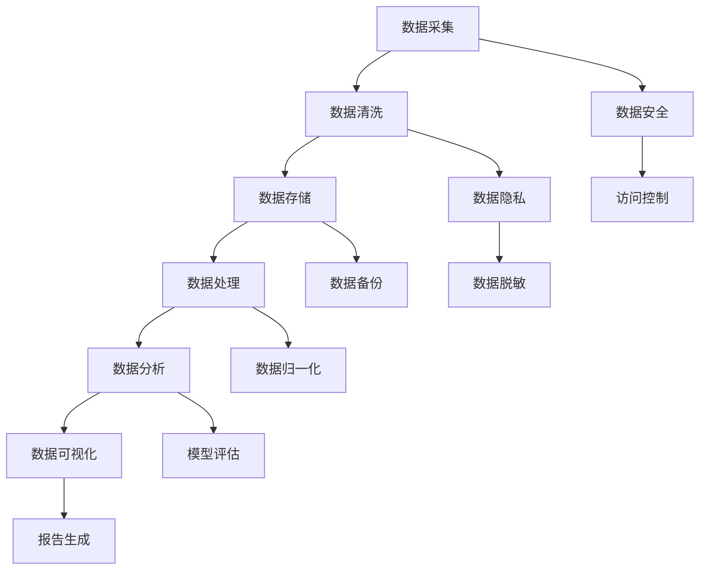

                 

### 背景介绍

在当今数字化时代，人工智能（AI）正迅速改变着各个行业，从医疗保健到金融、制造业和零售，AI技术无处不在。AI创业成为了许多企业和个人追求的热点，数据管理作为AI系统的核心组成部分，其重要性不言而喻。准确、高效地管理数据，不仅能够提升AI模型的性能，还能够帮助企业做出更明智的决策。

数据管理不仅仅是对数据进行存储和保护，它还包括数据的采集、清洗、存储、处理和分析等多个环节。对于AI创业者来说，如何有效地管理数据，成为了他们成功的关键因素之一。

本文将深入探讨AI创业中的数据管理，通过以下章节内容，我们希望能够为读者提供有价值的参考：

1. **核心概念与联系**：介绍数据管理的核心概念及其在AI系统中的应用。
2. **核心算法原理 & 具体操作步骤**：解析常用的数据管理算法及其应用场景。
3. **数学模型和公式 & 详细讲解 & 举例说明**：讲解数据管理中的数学模型和公式，并通过具体案例进行说明。
4. **项目实战：代码实际案例和详细解释说明**：通过实际项目展示数据管理的方法和技巧。
5. **实际应用场景**：探讨数据管理在AI创业中的应用案例。
6. **工具和资源推荐**：推荐学习资源、开发工具和框架。
7. **总结：未来发展趋势与挑战**：总结数据管理在AI创业中的发展趋势和面临的挑战。
8. **附录：常见问题与解答**：解答读者可能遇到的问题。
9. **扩展阅读 & 参考资料**：提供进一步学习的数据管理资源。

通过本文的阅读，读者将能够了解到数据管理在AI创业中的重要性，掌握数据管理的实用方法，并能够将这些方法应用到实际项目中。

#### 核心概念与联系

在探讨数据管理时，理解几个核心概念是非常重要的，这些概念构成了AI系统的基础，也是数据管理的关键要素。以下是数据管理中的一些核心概念及其在AI系统中的应用：

**数据采集（Data Collection）**：
数据采集是数据管理的第一步，涉及从各种来源获取数据，如传感器、日志文件、社交媒体等。对于AI创业者来说，数据采集的多样性和准确性至关重要。通过有效的数据采集，可以确保模型训练数据的全面性和质量。

**数据清洗（Data Cleaning）**：
数据清洗是确保数据质量的过程，包括去除重复数据、处理缺失值、纠正错误和标准化数据格式。在AI模型训练中，数据清洗是必不可少的，因为输入数据的准确性直接影响到模型的性能。一个简单的例子是，在一个分类问题中，如果某个类别的数据中有大量错误或缺失值，那么模型对该类别的预测结果将不准确。

**数据存储（Data Storage）**：
数据存储是指将数据存储在持久化的存储系统中，如数据库、数据仓库和云存储等。选择合适的存储方案对于确保数据的安全、可靠和可访问性至关重要。数据存储不仅要考虑存储容量，还要考虑数据检索速度和数据一致性。

**数据处理（Data Processing）**：
数据处理是指对数据进行各种操作，如数据变换、聚合、筛选和归一化等。在AI应用中，数据处理通常包括特征提取和特征工程，这些步骤有助于从原始数据中提取出有用的信息，以供模型训练使用。

**数据分析（Data Analysis）**：
数据分析是对数据进行分析，以发现数据中的模式和规律。在AI领域，数据分析通常通过机器学习和统计分析方法实现。数据分析可以帮助创业者理解数据背后的含义，从而做出更明智的商业决策。

**数据可视化（Data Visualization）**：
数据可视化是将数据以图形化的方式呈现，使数据更容易理解和分析。在AI创业中，数据可视化有助于展示模型性能、数据分布和预测结果等，从而为创业者提供直观的洞察。

**数据安全（Data Security）**：
数据安全是确保数据在存储、传输和处理过程中不被未授权访问、篡改或泄露。对于AI创业者来说，数据安全是一个重要考虑因素，因为敏感数据的泄露可能会导致严重后果。

**数据隐私（Data Privacy）**：
数据隐私是指保护个人隐私数据，防止数据被滥用或泄露。随着欧盟《通用数据保护条例》（GDPR）等法规的实施，数据隐私成为了AI创业中的一个重要议题。

下面，我们将通过Mermaid流程图（Mermaid Flowchart）来展示这些核心概念之间的联系：



通过这个流程图，我们可以看到数据管理中的各个环节是如何相互联系和作用的。一个高效的数据管理系统不仅需要考虑各个环节的技术细节，还需要确保数据在各个阶段都能得到妥善管理和保护。

### 核心算法原理 & 具体操作步骤

在数据管理中，核心算法的选择和实现对于数据处理的效率和效果具有决定性作用。以下将介绍几种常用的数据管理算法，并详细解释其原理和操作步骤。

#### 数据采集算法

**原理**：
数据采集算法主要是通过自动化工具从各种数据源中获取数据。常见的数据源包括传感器数据、网络日志、数据库等。

**操作步骤**：

1. **确定数据源**：首先，需要明确所需采集的数据类型和数据源。
2. **数据获取**：使用API、爬虫或其他数据获取工具从数据源中提取数据。
3. **数据预处理**：对采集到的数据进行初步清洗和格式化，以便后续处理。
4. **存储**：将预处理后的数据存储到临时数据库或文件系统中。

**示例**：
假设需要从网络日志中采集用户访问数据，可以使用Python的`requests`库和`BeautifulSoup`库实现数据采集。

```python
import requests
from bs4 import BeautifulSoup

url = 'http://example.com/logs'
response = requests.get(url)
logs = BeautifulSoup(response.text, 'html.parser').find_all('log')

# 预处理数据
data = []
for log in logs:
    timestamp, user, action = log.text.split(',')
    data.append({'timestamp': timestamp, 'user': user, 'action': action})

# 存储数据
with open('user_logs.csv', 'w') as f:
    for item in data:
        f.write(','.join([item['timestamp'], item['user'], item['action']]) + '\n')
```

#### 数据清洗算法

**原理**：
数据清洗算法用于处理数据中的错误、缺失值和重复值，以提高数据质量。

**操作步骤**：

1. **检测错误**：检查数据中的错误，如日期格式错误、文本拼写错误等。
2. **处理缺失值**：对缺失值进行填充或删除，选择合适的策略取决于具体应用场景。
3. **去除重复值**：识别和删除重复数据，以防止数据冗余。

**示例**：
以下使用Python的`pandas`库实现数据清洗。

```python
import pandas as pd

# 读取数据
data = pd.read_csv('user_logs.csv')

# 检测错误
data['timestamp'] = pd.to_datetime(data['timestamp'])

# 处理缺失值
data.fillna(method='ffill', inplace=True)

# 去除重复值
data.drop_duplicates(inplace=True)

# 存储清洗后的数据
data.to_csv('cleaned_user_logs.csv', index=False)
```

#### 数据存储算法

**原理**：
数据存储算法涉及选择合适的存储方案，确保数据的安全、可靠和高效访问。

**操作步骤**：

1. **选择存储方案**：根据数据量和访问模式选择合适的存储系统，如关系数据库、NoSQL数据库或云存储。
2. **数据分片**：将数据分片存储在不同的服务器或节点上，以提高数据访问速度和系统容错能力。
3. **数据备份**：定期备份数据，以防数据丢失或损坏。

**示例**：
以下使用MySQL数据库存储数据。

```sql
CREATE TABLE user_logs (
    id INT AUTO_INCREMENT PRIMARY KEY,
    timestamp DATETIME,
    user VARCHAR(255),
    action VARCHAR(255)
);

INSERT INTO user_logs (timestamp, user, action)
VALUES ('2023-03-10 14:30:00', 'user123', 'login'),
       ('2023-03-10 14:35:00', 'user456', 'logout');
```

#### 数据处理算法

**原理**：
数据处理算法包括数据变换、聚合和归一化等步骤，用于将原始数据转换为适合模型训练的形式。

**操作步骤**：

1. **数据变换**：将数据转换为不同的格式或结构，如将文本数据转换为向量。
2. **数据聚合**：对数据进行分组和计算，如计算用户登录次数、平均访问时长等。
3. **数据归一化**：将数据缩放到相同的尺度，以消除不同特征之间的量级差异。

**示例**：
以下使用Python的`NumPy`库进行数据处理。

```python
import numpy as np

# 读取数据
data = np.load('user_data.npy')

# 数据变换
data_transformed = data.astype(np.float32)

# 数据聚合
user_stats = data_transformed.mean(axis=0)

# 数据归一化
data_normalized = (data_transformed - user_stats) / np.std(data_transformed)
```

通过以上算法的应用，AI创业者可以有效地管理和处理数据，为模型训练和商业决策提供高质量的数据支持。

#### 数学模型和公式 & 详细讲解 & 举例说明

在数据管理中，数学模型和公式起到了至关重要的作用。以下将介绍几个常用的数学模型和公式，并详细讲解其在数据管理中的应用。

**1. 均值（Mean）**

**原理**：
均值是描述一组数据集中趋势的度量，是数据中所有数值的平均值。

**公式**：
\[ \text{Mean} = \frac{\sum_{i=1}^{n} x_i}{n} \]

**应用**：
均值常用于评估数据质量，如检查数据是否有异常值或异常分布。

**示例**：
假设有如下数据集：\[1, 2, 3, 4, 5\]，则均值为：
\[ \text{Mean} = \frac{1 + 2 + 3 + 4 + 5}{5} = 3 \]

**2. 方差（Variance）**

**原理**：
方差是描述数据分布离散程度的度量，是各个数值与均值之差的平方的平均值。

**公式**：
\[ \text{Variance} = \frac{\sum_{i=1}^{n} (x_i - \text{Mean})^2}{n} \]

**应用**：
方差用于评估数据的稳定性和一致性，如分析用户行为数据的波动。

**示例**：
假设有如下数据集：\[1, 2, 3, 4, 5\]，均值为3，则方差为：
\[ \text{Variance} = \frac{(1-3)^2 + (2-3)^2 + (3-3)^2 + (4-3)^2 + (5-3)^2}{5} = 2 \]

**3. 标准差（Standard Deviation）**

**原理**：
标准差是方差的平方根，是描述数据分布离散程度的一种常用度量。

**公式**：
\[ \text{Standard Deviation} = \sqrt{\text{Variance}} \]

**应用**：
标准差用于评估数据的分布宽度和波动性，如分析股票价格的变化。

**示例**：
假设有如下数据集：\[1, 2, 3, 4, 5\]，均值为3，方差为2，则标准差为：
\[ \text{Standard Deviation} = \sqrt{2} \approx 1.41 \]

**4. 相关系数（Correlation Coefficient）**

**原理**：
相关系数是描述两个变量之间线性相关程度的度量，取值范围为-1到1，1表示完全正相关，-1表示完全负相关，0表示无相关。

**公式**：
\[ \text{Correlation Coefficient} = \frac{\sum_{i=1}^{n} (x_i - \text{Mean}_x)(y_i - \text{Mean}_y)}{\sqrt{\sum_{i=1}^{n} (x_i - \text{Mean}_x)^2 \sum_{i=1}^{n} (y_i - \text{Mean}_y)^2}} \]

**应用**：
相关系数用于分析变量之间的依赖关系，如分析广告投放效果与销售量之间的关系。

**示例**：
假设有如下两个数据集：\[1, 2, 3, 4, 5\] 和 \[2, 4, 6, 8, 10\]，则相关系数为：
\[ \text{Correlation Coefficient} = \frac{(1-3)(2-5) + (2-3)(4-5) + (3-3)(6-5) + (4-3)(8-5) + (5-3)(10-5)}{\sqrt{\sum_{i=1}^{n} (x_i - \text{Mean}_x)^2 \sum_{i=1}^{n} (y_i - \text{Mean}_y)^2}} \approx 1 \]

通过以上数学模型和公式的应用，AI创业者可以更深入地了解数据的特性和关系，从而更好地进行数据管理和分析。

### 项目实战：代码实际案例和详细解释说明

为了更直观地展示数据管理的实际应用，我们将通过一个实际项目来演示数据管理的方法和技巧。这个项目是一个简单的用户行为分析系统，目标是从用户日志数据中提取有价值的信息，为商业决策提供支持。

#### 1. 开发环境搭建

首先，我们需要搭建一个合适的开发环境。以下是推荐的工具和库：

- **编程语言**：Python 3.8 或更高版本
- **数据分析库**：Pandas、NumPy、Matplotlib
- **数据可视化库**：Seaborn、Plotly
- **数据库**：MySQL 8.0 或更高版本

#### 2. 源代码详细实现和代码解读

以下是一个简单的用户行为分析系统的源代码，我们将分步骤进行解读。

```python
# 导入必要的库
import pandas as pd
import numpy as np
import matplotlib.pyplot as plt
import seaborn as sns
import mysql.connector

# 2.1 数据采集
def collect_data():
    # 从MySQL数据库中读取用户日志数据
    connection = mysql.connector.connect(
        host='localhost',
        user='your_username',
        password='your_password',
        database='your_database'
    )
    query = "SELECT * FROM user_logs;"
    data = pd.read_sql_query(query, connection)
    connection.close()
    return data

# 2.2 数据清洗
def clean_data(data):
    # 去除重复数据
    data.drop_duplicates(inplace=True)
    
    # 处理缺失值
    data.fillna(method='ffill', inplace=True)
    
    # 数据类型转换
    data['timestamp'] = pd.to_datetime(data['timestamp'])
    data['action'] = data['action'].astype('category')
    
    return data

# 2.3 数据处理
def process_data(data):
    # 数据聚合
    user_stats = data.groupby(['user', 'action']).size().reset_index(name='count')
    
    # 数据归一化
    user_stats['count'] = user_stats['count'] / user_stats['count'].sum()
    
    return user_stats

# 2.4 数据可视化
def visualize_data(user_stats):
    # 用户行为分布
    sns.countplot(x='action', data=user_stats, order=user_stats['action'].value_counts().index)
    plt.title('User Action Distribution')
    plt.xlabel('Action')
    plt.ylabel('Count')
    plt.show()

    # 用户登录时长分布
    sns.histplot(x='timestamp', data=user_stats, kde=True)
    plt.title('User Login Duration Distribution')
    plt.xlabel('Timestamp')
    plt.ylabel('Count')
    plt.show()

# 主函数
def main():
    # 采集数据
    data = collect_data()
    
    # 清洗数据
    cleaned_data = clean_data(data)
    
    # 处理数据
    processed_data = process_data(cleaned_data)
    
    # 可视化数据
    visualize_data(processed_data)

if __name__ == '__main__':
    main()
```

#### 2.3 代码解读与分析

**2.3.1 数据采集**

在`collect_data`函数中，我们使用MySQL数据库连接库`mysql.connector`连接到数据库，并执行SQL查询从`user_logs`表中读取数据。这里的连接参数需要根据实际数据库的配置进行修改。

```python
def collect_data():
    connection = mysql.connector.connect(
        host='localhost',
        user='your_username',
        password='your_password',
        database='your_database'
    )
    query = "SELECT * FROM user_logs;"
    data = pd.read_sql_query(query, connection)
    connection.close()
    return data
```

**2.3.2 数据清洗**

在`clean_data`函数中，我们首先去除重复数据，然后对缺失值进行填充。这里使用`ffill`方法（前向填充），即用前一个有效值填充缺失值。接着，我们将时间戳字段转换为日期类型，并将动作字段转换为类别类型，以便后续分析。

```python
def clean_data(data):
    data.drop_duplicates(inplace=True)
    data.fillna(method='ffill', inplace=True)
    data['timestamp'] = pd.to_datetime(data['timestamp'])
    data['action'] = data['action'].astype('category')
    return data
```

**2.3.3 数据处理**

在`process_data`函数中，我们使用`groupby`方法对用户和动作进行分组，并计算每个组内的计数。接着，我们对计数进行归一化，以便进行比较。归一化的方法是将每个计数除以其总和。

```python
def process_data(data):
    user_stats = data.groupby(['user', 'action']).size().reset_index(name='count')
    user_stats['count'] = user_stats['count'] / user_stats['count'].sum()
    return user_stats
```

**2.3.4 数据可视化**

在`visualize_data`函数中，我们使用Seaborn库的可视化函数生成两个图表：用户行为分布图和用户登录时长分布图。用户行为分布图展示了不同动作的计数，而用户登录时长分布图展示了用户登录时间的分布情况。

```python
def visualize_data(user_stats):
    sns.countplot(x='action', data=user_stats, order=user_stats['action'].value_counts().index)
    plt.title('User Action Distribution')
    plt.xlabel('Action')
    plt.ylabel('Count')
    plt.show()

    sns.histplot(x='timestamp', data=user_stats, kde=True)
    plt.title('User Login Duration Distribution')
    plt.xlabel('Timestamp')
    plt.ylabel('Count')
    plt.show()
```

**2.3.5 主函数**

在主函数`main`中，我们依次调用数据采集、数据清洗、数据处理和数据可视化函数，完成整个数据管理流程。

```python
def main():
    data = collect_data()
    cleaned_data = clean_data(data)
    processed_data = process_data(cleaned_data)
    visualize_data(processed_data)
```

通过这个项目，我们展示了数据管理在AI创业中的实际应用。从数据采集、清洗、处理到可视化，每一步都是确保数据质量和模型性能的重要环节。

### 实际应用场景

数据管理在AI创业中的应用场景非常广泛，以下列举了几个典型的实际案例：

#### 1. 零售业用户行为分析

在零售业中，数据管理可以帮助企业了解用户的行为模式，从而优化营销策略和库存管理。例如，通过分析用户的购买历史、浏览记录和反馈数据，零售商可以精准推荐商品、调整库存水平，提高销售额和客户满意度。

**案例**：
亚马逊通过其庞大的用户数据和先进的推荐系统，成功地将个性化推荐应用于购物体验。用户每次浏览和购买的行为数据都会被收集并用于训练推荐模型，从而实现高度个性化的购物体验。

#### 2. 金融风险控制

金融行业中的数据管理至关重要，因为它涉及到大量的金融交易数据和客户信息。通过有效的数据管理，金融机构可以识别潜在的风险，防止欺诈行为，并做出更明智的投资决策。

**案例**：
金融机构如银行和保险公司使用数据管理技术来分析客户的交易行为，识别异常交易并预测潜在的风险。通过机器学习和数据挖掘技术，金融机构可以提前发现欺诈行为，减少损失。

#### 3. 医疗健康数据分析

在医疗健康领域，数据管理技术可以帮助医疗机构分析患者数据，提供个性化的治疗方案，并提高医疗服务效率。

**案例**：
通过收集和分析患者的电子健康记录（EHR），医疗机构可以更好地了解患者的健康状况，预测疾病趋势，并制定个性化的治疗方案。例如，谷歌健康团队通过分析大量的健康数据，开发出了预测糖尿病和心血管疾病风险的算法。

#### 4. 智能制造

在智能制造领域，数据管理技术可以帮助企业优化生产流程，提高生产效率和产品质量。

**案例**：
通用电气（GE）通过其Predix平台，利用数据管理技术收集和分析机器数据，从而实现预测性维护和优化生产过程。通过实时监控设备状态和性能数据，GE可以预测设备故障，提前进行维护，减少停机时间，提高生产效率。

#### 5. 物流和供应链管理

在物流和供应链管理中，数据管理可以帮助企业优化运输路线、库存管理和供应链决策，提高物流效率。

**案例**：
亚马逊的物流部门通过数据管理技术，分析物流数据，优化运输路线和库存管理，从而实现快速配送和降低成本。通过实时监控订单和库存状态，亚马逊能够快速响应市场需求，提高客户满意度。

这些实际应用案例展示了数据管理在AI创业中的重要性。通过有效的数据管理，企业可以提升业务效率，降低运营成本，并为客户提供更好的服务和体验。

### 工具和资源推荐

为了在AI创业中更好地实现数据管理，以下是一些推荐的工具、资源和学习材料，这些都将为开发者提供有价值的支持和指导。

#### 1. 学习资源推荐

**书籍**：
- 《数据科学入门：Python编程与统计方法》
- 《深度学习》（Goodfellow, Bengio, Courville著）
- 《Python数据分析 Cookbook》
- 《大数据技术导论》

**论文**：
- 《大规模机器学习：可扩展算法的研究》
- 《数据挖掘：概念与技术》
- 《分布式系统：概念与设计》

**博客和网站**：
- Medium上的数据科学和机器学习相关文章
- Kaggle数据科学论坛
- AI博客（如Towards Data Science）

#### 2. 开发工具框架推荐

**数据分析库**：
- Pandas
- NumPy
- Matplotlib
- Seaborn

**机器学习框架**：
- TensorFlow
- PyTorch
- Keras

**数据库工具**：
- MySQL
- PostgreSQL
- MongoDB
- Redis

**数据可视化工具**：
- Plotly
- D3.js
- Tableau

#### 3. 相关论文著作推荐

**论文**：
- "TensorFlow: Large-scale Machine Learning on Heterogeneous Systems"
- "Theano: A CPU and GPU Math Expression Compiler"
- "MXNet: A Flexible and Efficient Machine Learning Library for Heterogeneous Distributed Systems"

**著作**：
- 《Python深度学习》（François Chollet著）
- 《机器学习实战》（Peter Harrington著）
- 《深度学习入门：基于Python的理论与实现》（斋藤康毅著）

通过这些资源和工具，AI创业者可以掌握最新的数据管理技术和方法，为自己的创业项目提供坚实的技术支持。

### 总结：未来发展趋势与挑战

随着人工智能技术的快速发展，数据管理在AI创业中的应用趋势也呈现出多样化的特点。未来，数据管理将在以下几个方面展现出显著的发展趋势：

1. **数据治理的重要性提升**：随着数据隐私法规如欧盟的《通用数据保护条例》（GDPR）的实施，企业将更加重视数据治理。数据治理不仅包括数据安全、合规性，还包括数据质量管理和数据价值挖掘。

2. **分布式数据处理技术的发展**：为了应对大数据的存储和计算需求，分布式数据处理技术如Apache Hadoop、Apache Spark和Flink将得到更广泛的应用。这些技术能够高效地处理大规模数据，并实现实时数据分析。

3. **自动化和智能化的数据管理**：未来的数据管理将更加自动化和智能化。利用机器学习和人工智能技术，数据管理系统能够自动识别数据异常、优化数据流程，并自动调整数据存储策略。

4. **边缘计算与数据管理**：随着物联网（IoT）和智能设备的普及，边缘计算在数据管理中的应用将变得更加重要。边缘计算能够处理大量实时数据，减轻中央数据中心的数据压力，提高系统的响应速度。

然而，随着数据管理技术的发展，AI创业者也面临着一系列挑战：

1. **数据隐私和安全问题**：在数据管理中，如何确保数据隐私和安全是一个重要挑战。随着数据隐私法规的实施，企业需要采取更加严格的数据保护措施，避免数据泄露和滥用。

2. **数据质量和一致性**：大规模数据的管理和清洗是一个复杂的过程。数据质量问题如数据缺失、不一致和数据噪声会影响模型的性能，需要高效的数据清洗和预处理技术。

3. **数据存储成本**：随着数据量的不断增长，数据存储成本也在增加。如何选择合适的存储方案，在保证数据安全和可靠性的同时，控制成本是一个重要挑战。

4. **算法透明度和解释性**：随着深度学习等复杂算法的应用，模型的透明度和解释性成为一个挑战。如何确保算法的决策过程透明、可解释，以便用户理解并信任模型的结果。

5. **跨领域数据整合**：不同领域的数据格式和结构差异较大，如何实现跨领域的数据整合和共享，以便于数据分析和挖掘，是一个复杂的问题。

综上所述，数据管理在AI创业中具有广阔的应用前景，但也面临着诸多挑战。未来，随着技术的不断进步，AI创业者需要不断创新，以应对这些挑战，实现数据管理的优化和升级。

### 附录：常见问题与解答

在AI创业过程中，数据管理是一个复杂的环节，经常遇到各种问题。以下是一些常见问题及其解答，帮助创业者更好地理解和应对这些挑战。

#### 1. 数据隐私和安全如何保障？

**解答**：
- **数据加密**：对敏感数据进行加密，确保数据在存储和传输过程中不被未授权访问。
- **访问控制**：设置严格的访问权限和身份验证机制，确保只有授权用户可以访问数据。
- **数据脱敏**：在分析数据时，对敏感信息进行脱敏处理，如使用伪匿名化技术。
- **合规性**：遵循相关的数据隐私法规，如GDPR，确保数据处理符合法规要求。

#### 2. 如何处理数据缺失和异常值？

**解答**：
- **数据填充**：对缺失值进行填充，可以使用平均值、中位数或插值法等策略。
- **异常检测**：使用统计学方法（如箱线图）或机器学习算法（如孤立森林）检测异常值，然后根据具体情况选择保留或删除。
- **多重插补**：使用多重插补方法对缺失数据进行模拟，生成多个完整的数据集，以提高模型的鲁棒性。

#### 3. 如何进行有效的数据清洗和预处理？

**解答**：
- **标准化和归一化**：将数据缩放到相同的尺度，消除不同特征之间的量级差异。
- **特征工程**：通过特征选择和特征转换，提取有用的信息，增强模型的性能。
- **数据质量检查**：定期检查数据质量，发现并处理数据中的错误和异常。
- **数据可视化**：使用数据可视化工具，如Seaborn和Matplotlib，直观地检查数据分布和趋势。

#### 4. 如何选择合适的存储方案？

**解答**：
- **需求分析**：根据数据量和访问模式选择合适的存储方案，如关系数据库（如MySQL）或NoSQL数据库（如MongoDB）。
- **性能考量**：考虑数据检索速度、存储容量和扩展性等因素。
- **成本控制**：平衡存储成本和性能，选择性价比高的存储方案。
- **安全性**：确保存储方案能够提供数据备份和恢复功能，防止数据丢失。

#### 5. 数据管理工具和库如何选择？

**解答**：
- **Pandas**：适用于数据处理和清洗，具有强大的数据操作功能。
- **NumPy**：适用于数学计算和数据处理，是Pandas的基础库。
- **TensorFlow**：适用于机器学习和深度学习，提供了丰富的模型构建和训练工具。
- **PyTorch**：适用于机器学习和深度学习，提供了灵活的模型构建和优化工具。

通过以上解答，AI创业者可以更好地理解和应对数据管理中的常见问题，为自己的创业项目提供有效的技术支持。

### 扩展阅读 & 参考资料

为了进一步深入了解数据管理在AI创业中的应用，以下推荐一些扩展阅读和参考资料：

**书籍**：
- 《数据科学入门：Python编程与统计方法》
- 《深度学习》（Goodfellow, Bengio, Courville著）
- 《Python数据分析 Cookbook》
- 《大数据技术导论》

**论文**：
- "TensorFlow: Large-scale Machine Learning on Heterogeneous Systems"
- "Theano: A CPU and GPU Math Expression Compiler"
- "MXNet: A Flexible and Efficient Machine Learning Library for Heterogeneous Distributed Systems"

**在线课程**：
- Coursera上的《机器学习》
- edX上的《数据科学基础》
- Udacity上的《深度学习纳米学位》

**博客和网站**：
- Medium上的数据科学和机器学习相关文章
- Kaggle数据科学论坛
- AI博客（如Towards Data Science）

**开源项目**：
- TensorFlow官方文档和GitHub代码库
- PyTorch官方文档和GitHub代码库
- Pandas和NumPy的官方文档

通过这些资源和学习材料，AI创业者可以不断学习和提升数据管理的技能，为自己的创业项目提供坚实的理论基础和实践指导。

