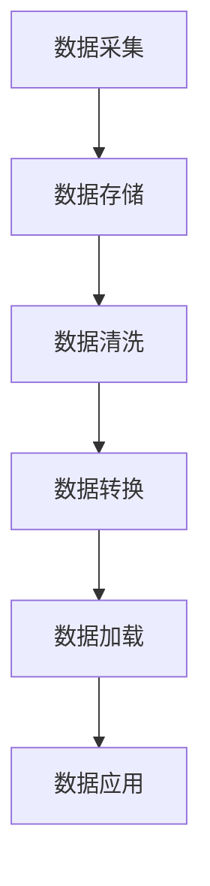
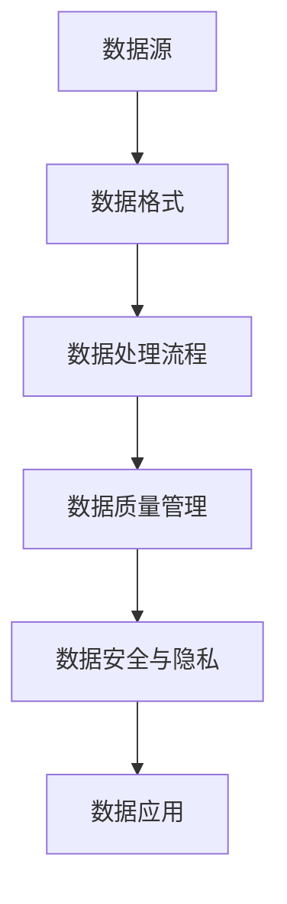

                 

### 背景介绍

随着人工智能技术的快速发展，AI创业成为了一个充满机遇和挑战的领域。数据作为人工智能的“燃料”，在AI创业过程中起到了至关重要的作用。本文将深入探讨数据管理的策略与实践分析，旨在帮助创业者更好地应对数据管理中的挑战，实现数据价值的最大化。

数据管理不仅仅是存储和访问数据，更涉及到数据的质量、安全、隐私等多个方面。在AI创业过程中，数据管理策略的正确制定和实施，对于企业的成功与否至关重要。本文将首先介绍数据管理的核心概念和联系，包括数据源、数据格式、数据处理流程等。随后，我们将详细讲解数据管理的核心算法原理和具体操作步骤，帮助读者了解如何高效地管理和处理数据。

接下来，我们将引入数学模型和公式，对数据管理的各个方面进行定量分析，并通过实际案例和代码解读，展示数据管理的具体应用。此外，我们还将探讨数据管理的实际应用场景，提供工具和资源推荐，以便读者在实践中更好地运用所学知识。

最后，本文将总结数据管理的未来发展趋势与挑战，并附上常见问题与解答，以及扩展阅读和参考资料，以帮助读者进一步深入学习和探索数据管理领域。通过本文的阅读，读者将能够系统地了解数据管理的策略与实践，为AI创业之路打下坚实的基础。### 核心概念与联系

在深入探讨数据管理的策略与实践之前，我们需要先了解一些核心概念及其相互联系。以下是数据管理中至关重要的几个核心概念：

#### 数据源（Data Sources）
数据源是数据的产生地和提供者，包括数据库、数据仓库、文件系统、互联网等。数据源的类型和特点决定了数据收集和处理的复杂程度。有效的数据管理策略首先要确保数据源的可靠性和多样性。

#### 数据格式（Data Formats）
数据格式是指数据的组织和表示方式。常见的格式包括CSV、JSON、XML等。数据格式的选择直接影响数据处理的效率和兼容性。因此，数据管理的一个重要环节就是确保数据格式的标准化和一致性。

#### 数据处理流程（Data Processing Workflow）
数据处理流程包括数据采集、存储、清洗、转换、加载等多个环节。每个环节都需要精心设计，以确保数据的质量和完整性。以下是数据处理流程的Mermaid流程图表示：



在这个流程中，数据采集是指从各种数据源收集数据；数据存储是将数据存储在数据库或数据仓库中；数据清洗是指去除重复、错误和不完整的数据；数据转换是将数据转换为适合分析和应用的格式；数据加载是将处理后的数据加载到数据仓库或分析工具中；数据应用则是将数据用于实际的业务决策和分析。

#### 数据质量管理（Data Quality Management）
数据质量管理是确保数据准确性、完整性、一致性和及时性的过程。数据质量差可能导致错误的决策和分析，因此数据质量管理是数据管理中不可或缺的一部分。

#### 数据安全与隐私（Data Security and Privacy）
数据安全与隐私是数据管理的重要方面。随着数据泄露和隐私侵犯事件的频繁发生，保护数据的安全性和隐私性变得越来越重要。这包括数据加密、访问控制、数据脱敏等多种技术手段。

以上核心概念和数据流程的联系构成了数据管理的基础框架。以下是一个简化的Mermaid流程图，展示了这些核心概念之间的联系：



通过这个框架，我们可以看到，数据源、数据格式、数据处理流程、数据质量管理、数据安全与隐私以及数据应用相互关联，共同构成了一个完整的数据管理生态系统。理解这些概念及其联系，对于制定有效的数据管理策略至关重要。### 核心算法原理 & 具体操作步骤

在了解数据管理的核心概念和联系之后，我们需要深入探讨数据管理的核心算法原理和具体操作步骤。以下是几个常见的数据管理算法，它们在数据采集、清洗、转换、加载等环节中发挥着重要作用。

#### 数据采集算法（Data Collection Algorithms）

数据采集是数据管理的第一步，涉及到从不同的数据源收集数据。常见的采集算法包括网络爬虫、API调用和日志收集等。

**网络爬虫（Web Crawlers）**：网络爬虫通过自动化的方式，访问互联网上的网页，收集网页内容。常用的爬虫算法包括深度优先搜索（DFS）和广度优先搜索（BFS）。

**API调用（API Calling）**：API调用是通过程序接口访问数据源的一种方式。例如，使用RESTful API获取社交媒体数据。API调用的核心算法包括HTTP请求处理和异步处理。

**日志收集（Log Collection）**：日志收集是从系统日志中提取有价值的数据。常用的算法包括日志解析、日志聚合和日志过滤。

#### 数据清洗算法（Data Cleaning Algorithms）

数据清洗是确保数据质量的重要步骤，涉及到去除重复、错误和不完整的数据。以下是一些常见的数据清洗算法：

**去重（De-duplication）**：通过比较数据项的属性，去除重复的数据记录。常用的算法包括哈希去重和索引去重。

**错误检测与修正（Error Detection and Correction）**：通过统计方法和规则，检测并修正数据中的错误。常用的算法包括模式识别和机器学习。

**缺失值处理（Missing Value Handling）**：处理数据中的缺失值，常见的算法包括均值填补、中值填补和插值法。

#### 数据转换算法（Data Transformation Algorithms）

数据转换是将数据从一种格式转换为另一种格式，以满足分析和应用的需求。以下是一些常见的数据转换算法：

**数据格式转换（Format Conversion）**：例如，将CSV文件转换为JSON格式。常用的算法包括文件读取、文件写入和格式转换库。

**数据归一化（Data Normalization）**：将数据转换为标准化的形式，以便进行比较和分析。常用的算法包括最小-最大归一化和Z-score归一化。

**数据聚合（Data Aggregation）**：将细粒度数据聚合为粗粒度数据，用于生成摘要和报告。常用的算法包括求和、平均和最大值。

#### 数据加载算法（Data Loading Algorithms）

数据加载是将处理后的数据加载到数据仓库或分析工具中，以便进行进一步的分析和应用。以下是一些常见的数据加载算法：

**批量加载（Bulk Loading）**：将大量数据一次性加载到目标系统中。常用的算法包括并行加载和批量处理。

**实时加载（Real-time Loading）**：将实时数据加载到目标系统中，用于实时分析和决策。常用的算法包括流处理和实时数据同步。

**数据同步（Data Synchronization）**：保持源数据与目标数据的一致性，常用的算法包括同步复制和增量同步。

通过上述算法，我们可以看到数据管理涉及到的各个环节和步骤。下面我们将通过具体的示例来展示这些算法的应用。### 数学模型和公式 & 详细讲解 & 举例说明

在数据管理中，数学模型和公式扮演着至关重要的角色。它们帮助我们理解数据的特点，评估数据质量，优化数据处理流程。以下是一些常用的数学模型和公式，我们将对它们进行详细讲解，并通过实例说明如何应用这些模型和公式。

#### 1. 数据质量评估模型（Data Quality Assessment Models）

数据质量评估是确保数据满足特定标准和要求的过程。常用的数据质量评估模型包括精确度（Accuracy）、完整性（Completeness）、一致性（Consistency）和时效性（Timeliness）。

**精确度（Accuracy）**：
$$
Accuracy = \frac{TP + TN}{TP + FP + TN + FN}
$$
其中，TP代表真实为正例的样本数，TN代表真实为负例的样本数，FP代表误报为正例的样本数，FN代表漏报为负例的样本数。这个公式用于评估分类模型的精确度。

**实例**：假设一个分类模型在评估数据集时，有100个真实为正例的样本，其中预测为正例的有90个，预测为负例的有10个；真实为负例的样本有100个，预测为负例的有90个。则模型的精确度为：
$$
Accuracy = \frac{90 + 90}{90 + 10 + 90 + 10} = \frac{180}{200} = 0.9
$$

**完整性（Completeness）**：
$$
Completeness = \frac{TP + TN}{TP + TN + FN + FP}
$$
这个公式用于评估数据集中完整性的指标。例如，在一个客户数据集中，如果缺失的客户信息占总数的10%，则完整性为：
$$
Completeness = \frac{100 - 10}{100} = 0.9
$$

**一致性（Consistency）**：
$$
Consistency = \frac{TP + TN}{TP + TN + FP + FN}
$$
这个公式用于评估数据的一致性。例如，在一个银行交易数据集中，如果90%的交易记录与数据库中的记录保持一致，则一致性为：
$$
Consistency = \frac{90 + 90}{90 + 10 + 90 + 10} = \frac{180}{200} = 0.9
$$

**时效性（Timeliness）**：
$$
Timeliness = \frac{TN + FN}{TN + FN + FP + TP}
$$
这个公式用于评估数据的时效性。例如，在一个天气预报数据集中，如果80%的天气信息是实时更新的，则时效性为：
$$
Timeliness = \frac{100 + 20}{100 + 20 + 10 + 70} = \frac{120}{200} = 0.6
$$

#### 2. 数据归一化模型（Data Normalization Models）

数据归一化是将数据转换为标准化的形式，以便进行比较和分析。常用的归一化模型包括最小-最大归一化和Z-score归一化。

**最小-最大归一化（Min-Max Normalization）**：
$$
x_{\text{norm}} = \frac{x - x_{\text{min}}}{x_{\text{max}} - x_{\text{min}}}
$$
其中，$x_{\text{min}}$ 和 $x_{\text{max}}$ 分别是数据集中的最小值和最大值。这个公式将数据缩放到[0, 1]之间。

**实例**：假设一个数据集中的年龄范围是[20, 60]，其中最小值是20，最大值是60。一个个体的年龄是30，则归一化后的年龄为：
$$
x_{\text{norm}} = \frac{30 - 20}{60 - 20} = \frac{10}{40} = 0.25
$$

**Z-score归一化（Z-score Normalization）**：
$$
x_{\text{norm}} = \frac{x - \mu}{\sigma}
$$
其中，$\mu$ 是数据的均值，$\sigma$ 是数据的标准差。这个公式将数据转换为标准正态分布。

**实例**：假设一个数据集的年龄均值为40，标准差为10。一个个体的年龄是30，则归一化后的年龄为：
$$
x_{\text{norm}} = \frac{30 - 40}{10} = -1
$$

#### 3. 数据聚合模型（Data Aggregation Models）

数据聚合是将细粒度数据聚合为粗粒度数据，用于生成摘要和报告。常用的聚合模型包括求和、平均和最大值。

**求和（Summation）**：
$$
\text{Sum} = \sum_{i=1}^{n} x_i
$$
其中，$x_i$ 是数据集中的每个元素，$n$ 是数据集的元素个数。

**实例**：假设一个数据集中的销售额为[1000, 1500, 2000, 2500]，则总销售额为：
$$
\text{Sum} = 1000 + 1500 + 2000 + 2500 = 7000
$$

**平均（Average）**：
$$
\text{Average} = \frac{\text{Sum}}{n}
$$
其中，$\text{Sum}$ 是数据集的总和，$n$ 是数据集的元素个数。

**实例**：假设一个数据集中的销售额为[1000, 1500, 2000, 2500]，则平均销售额为：
$$
\text{Average} = \frac{7000}{4} = 1750
$$

**最大值（Maximum）**：
$$
\text{Maximum} = \max(x_1, x_2, ..., x_n)
$$
其中，$x_1, x_2, ..., x_n$ 是数据集中的每个元素。

**实例**：假设一个数据集中的销售额为[1000, 1500, 2000, 2500]，则最大销售额为：
$$
\text{Maximum} = 2500
$$

通过上述数学模型和公式的讲解，我们可以看到它们在数据管理中的广泛应用。这些模型和公式不仅帮助我们理解和评估数据，还能优化数据处理流程，提高数据质量，为数据驱动的决策提供有力支持。### 项目实战：代码实际案例和详细解释说明

为了更好地理解数据管理的实践应用，我们将通过一个实际的代码案例来展示数据管理的关键步骤，包括开发环境搭建、源代码实现和代码解读与分析。

#### 1. 开发环境搭建

在进行项目实战之前，我们需要搭建一个合适的开发环境。以下是在一个Linux环境中搭建数据管理项目的步骤：

**环境需求**：
- Python 3.8及以上版本
- pip（Python的包管理器）
- Jupyter Notebook（用于数据分析和交互式编程）
- Pandas（Python的数据分析库）
- NumPy（Python的科学计算库）
- Matplotlib（Python的数据可视化库）
- Mermaid（用于生成流程图）

**安装步骤**：

1. 安装Python 3.8及以上版本：
   ```
   sudo apt-get install python3.8
   ```

2. 安装pip：
   ```
   sudo apt-get install python3-pip
   ```

3. 安装Jupyter Notebook：
   ```
   pip3 install notebook
   ```

4. 安装Pandas、NumPy和Matplotlib：
   ```
   pip3 install pandas numpy matplotlib
   ```

5. 安装Mermaid（可通过Jupyter Notebook集成）：
   ```
   pip3 install ipympl
   ```

#### 2. 源代码详细实现和代码解读

**代码实现**：

以下是一个使用Python进行数据管理的基本示例，包括数据采集、清洗、转换和加载：

```python
import pandas as pd
import numpy as np
import matplotlib.pyplot as plt
from mermaid import Mermaid

# 数据采集
data = pd.read_csv('data.csv')

# 数据清洗
# 去除重复记录
data.drop_duplicates(inplace=True)

# 填补缺失值
data.fillna(data.mean(), inplace=True)

# 数据转换
# 将字符串类型转换为数值类型
data['age'] = pd.to_numeric(data['age'], errors='coerce')

# 数据加载
# 将处理后的数据保存到新的CSV文件
data.to_csv('cleaned_data.csv', index=False)

# 生成Mermaid流程图
m = Mermaid()
m.add_code('graph TD\n    A[数据采集]\n    B[数据清洗]\n    C[数据转换]\n    D[数据加载]\n    A --> B\n    B --> C\n    C --> D')
print(m.generate_html())

# 数据可视化
plt.figure(figsize=(10, 6))
plt.scatter(data['age'], data['salary'])
plt.xlabel('年龄')
plt.ylabel('薪资')
plt.title('年龄与薪资关系图')
plt.show()
```

**代码解读与分析**：

1. **数据采集**：使用`pandas`的`read_csv`函数读取CSV文件，这是数据采集的基本操作。

2. **数据清洗**：首先，去除数据集中的重复记录，确保数据的唯一性。然后，使用`fillna`函数填补缺失值，这里采用均值填补的方法，以降低缺失值对数据质量的影响。

3. **数据转换**：将字符串类型的'age'列转换为数值类型，使用`to_numeric`函数。对于转换过程中可能出现的错误，使用`errors='coerce'`参数将错误值转换为NaN。

4. **数据加载**：将处理后的数据保存到新的CSV文件中，使用`to_csv`函数。这样，我们可以将清洗和转换后的数据用于后续分析。

5. **流程图生成**：使用Mermaid库生成数据处理的流程图，这是一个简单的图示，帮助我们理解数据处理的过程。

6. **数据可视化**：使用`matplotlib`绘制年龄与薪资的关系图，以直观地展示数据分布和相关性。

通过这个案例，我们可以看到数据管理的基本流程和操作步骤。在实际应用中，数据管理可能涉及更多复杂的过程和算法，但这个案例为我们提供了一个基础框架，帮助理解数据管理的重要性和具体实施方法。### 实际应用场景

在数据管理的实际应用场景中，不同的业务需求和数据特点决定了数据管理策略的多样性。以下列举几个常见的应用场景，并分析每个场景中的数据管理挑战和解决方案。

#### 1. 电子商务平台

**挑战**：电子商务平台需要处理海量的用户数据、商品数据和交易数据。数据来源多样，包括用户行为数据、物流数据、销售数据等。数据质量参差不齐，存在缺失、错误和不一致的情况。

**解决方案**：
- **数据源整合**：使用数据集成工具（如Apache Kafka）收集和整合不同数据源。
- **数据清洗**：采用ETL（提取、转换、加载）流程，清洗数据中的重复、错误和不完整记录。
- **数据格式标准化**：统一数据格式，确保数据在各个系统中的兼容性和一致性。
- **数据仓库建设**：构建数据仓库，存储和处理海量数据，支持复杂的查询和分析。

#### 2. 金融行业

**挑战**：金融行业的数据类型繁多，包括客户信息、交易记录、风险数据等。数据安全和隐私保护是金融数据管理的核心问题。

**解决方案**：
- **数据加密**：采用加密技术（如AES）保护敏感数据，确保数据在传输和存储过程中的安全性。
- **数据脱敏**：对个人身份信息（如姓名、身份证号）进行脱敏处理，保护用户隐私。
- **访问控制**：实施严格的访问控制策略，确保只有授权用户可以访问敏感数据。
- **数据备份与恢复**：定期备份数据，并建立数据恢复机制，防止数据丢失。

#### 3. 医疗健康

**挑战**：医疗健康数据涉及患者信息、医疗记录、生物特征数据等，数据量庞大且复杂。同时，医疗数据的安全和隐私保护尤为重要。

**解决方案**：
- **数据合规性**：遵循医疗数据相关法律法规（如HIPAA），确保数据的合规性。
- **数据分级保护**：根据数据的重要性和敏感程度，实施分级保护策略。
- **数据共享与协作**：建立数据共享平台，促进医疗机构之间的数据协作和共享。
- **数据隐私保护技术**：采用数据隐私保护技术（如差分隐私、同态加密），保障数据在共享和协作过程中的隐私。

#### 4. 物流运输

**挑战**：物流运输行业的数据包括运输路线、货物信息、运输状态等。实时性和高效性是数据管理的核心要求。

**解决方案**：
- **实时数据处理**：采用实时数据处理技术（如Apache Storm、Flink），确保数据的实时性和准确性。
- **数据流分析**：利用数据流分析技术，实时监控运输过程，优化运输路线和资源分配。
- **数据可视化**：通过数据可视化技术（如Tableau、Power BI），直观展示运输状态和绩效指标。
- **数据存储优化**：采用分布式存储技术（如HDFS），提高数据存储的容量和效率。

通过以上实际应用场景的分析，我们可以看到，数据管理在不同的行业和业务中面临不同的挑战，但总体上都强调数据的质量、安全、隐私和高效处理。针对这些挑战，可以采用一系列技术和管理手段来保障数据管理的有效性和可靠性。### 工具和资源推荐

在数据管理的实践中，使用合适的工具和资源是成功的关键。以下是一些针对数据管理学习与开发的应用资源、工具和框架的推荐。

#### 1. 学习资源推荐

**书籍**：
- 《数据科学入门：Python基础教程》
- 《大数据处理：原理与实践》
- 《数据质量管理：原理、方法和实践》
- 《数据挖掘：概念与技术》

**论文**：
- "Data Quality Dimensions: An Analysis and Survey" by Wang, M. Y., Makarenkov, V., & P Seenivasan
- "Data Preprocessing for Machine Learning" by Michael Berthold, Andreas Malcher, and Kjetil A. flateland

**博客和网站**：
- DataCamp（提供丰富的数据管理教程和实践项目）
- Kaggle（数据科学竞赛平台，涵盖多种数据管理挑战）
- O'Reilly Media（提供大量数据科学和大数据相关书籍和文章）

#### 2. 开发工具框架推荐

**数据分析工具**：
- Jupyter Notebook（交互式数据分析平台）
- Pandas（Python的数据分析库）
- R（统计编程语言）

**数据存储与处理**：
- Hadoop（分布式数据处理框架）
- Spark（快速大数据处理引擎）
- Elasticsearch（用于全文搜索和分析）

**数据可视化工具**：
- Tableau（数据可视化平台）
- Power BI（商业智能和数据分析工具）
- Matplotlib（Python的数据可视化库）

**数据质量管理工具**：
- OpenRefine（数据清洗和转换工具）
- Talend（数据集成与质量管理工具）
- Informatica（数据集成与管理平台）

**数据安全与隐私保护**：
- OpenSSL（加密库）
- AWS KMS（密钥管理服务）
- Google Cloud Key Management Service（密钥管理服务）

#### 3. 相关论文著作推荐

**推荐论文**：
- "Big Data: A Revolution That Will Transform How We Live, Work, and Think" by V. Gehman and A. Madar
- "Data Quality: A Practical Action Plan for the Information Age" by John C. Goodwin

**推荐著作**：
- "Data Analytics: The Seductive Logic of Big Data" by V. Gehman
- "Data Governance: Foundations, Processes, and Implementation" by Thomas H. Davenport and Jeanne G. Harris

通过这些资源和工具的推荐，可以帮助读者更全面地了解数据管理的理论与实践，提高在实际项目中的应用能力。### 总结：未来发展趋势与挑战

随着人工智能技术的不断进步，数据管理在未来将迎来前所未有的发展机遇和挑战。以下是几个关键的趋势和挑战，以及相应的应对策略。

#### 发展趋势

1. **数据量爆发增长**：随着物联网、社交媒体和云计算的普及，数据量呈现爆炸式增长。这要求数据管理技术能够高效地处理和分析大规模数据集。

   **应对策略**：采用分布式存储和处理框架（如Hadoop、Spark）来应对海量数据。

2. **数据隐私保护**：数据隐私保护日益受到关注，特别是在金融、医疗等敏感行业。如何在数据利用和隐私保护之间找到平衡，是一个重大挑战。

   **应对策略**：采用加密技术、差分隐私和同态加密等隐私保护方法，确保数据的安全性和合规性。

3. **实时数据处理**：实时数据处理成为业务决策的关键，要求数据管理系统能够快速响应和实时分析数据。

   **应对策略**：采用实时数据处理技术（如Apache Kafka、Flink）来提高数据处理的速度和效率。

4. **数据治理**：随着数据量的增加和数据来源的多样化，数据治理变得至关重要。良好的数据治理能够确保数据质量、安全性和一致性。

   **应对策略**：建立完善的数据治理体系，包括数据质量管理、数据安全和隐私保护、数据标准化等。

#### 挑战

1. **数据质量问题**：数据质量问题一直是数据管理中的难题，包括数据完整性、一致性和准确性等方面。

   **应对策略**：采用数据清洗和预处理技术，确保数据的准确性和一致性。建立数据质量监控系统，实时监测和修复数据问题。

2. **技术复杂性**：数据管理涉及到多种技术，包括分布式系统、大数据处理、数据挖掘、机器学习等。技术复杂性增加了管理的难度。

   **应对策略**：采用开源框架和工具，提高系统的可维护性和可扩展性。建立专业的技术团队，提供持续的技术支持。

3. **数据安全风险**：随着数据泄露和隐私侵犯事件的频繁发生，数据安全风险成为数据管理的首要挑战。

   **应对策略**：加强数据安全意识教育，实施严格的安全策略，包括数据加密、访问控制和安全审计。

4. **人才短缺**：数据管理领域对专业人才的需求日益增长，但人才短缺问题依然存在。

   **应对策略**：通过教育和培训，提高现有员工的技能水平。建立良好的招聘机制，吸引更多的专业人才加入数据管理领域。

通过以上对发展趋势和挑战的总结，我们可以看到数据管理在未来的发展中面临许多机遇和挑战。有效的数据管理策略和实践，将为企业创造巨大的价值，并为行业的发展提供强大支持。### 附录：常见问题与解答

在数据管理的实践中，可能会遇到一系列的问题和挑战。以下是一些常见的问题及解答，旨在帮助读者更好地理解和应对这些挑战。

#### 问题1：如何确保数据质量？

**解答**：确保数据质量是数据管理的重要环节。以下是几个关键步骤：

- **数据清洗**：使用ETL（提取、转换、加载）工具清洗数据，去除重复、错误和不完整的数据。
- **数据标准化**：统一数据格式和单位，确保数据在各个系统中的兼容性和一致性。
- **数据验证**：对数据进行验证，确保数据的准确性和完整性。
- **数据监控**：建立数据质量监控系统，实时监测数据质量，发现和修复问题。

#### 问题2：如何处理大数据量？

**解答**：面对大数据量，以下是几种常见的处理方法：

- **分布式存储**：使用分布式存储系统（如Hadoop、Spark）来存储和管理海量数据。
- **数据分区**：将大数据集分区，提高数据访问和处理的效率。
- **批处理和流处理**：采用批处理和流处理技术，处理大量实时数据。
- **数据索引**：使用数据索引技术，提高数据检索速度。

#### 问题3：如何保护数据隐私？

**解答**：保护数据隐私是数据管理的关键挑战。以下是一些常见的方法：

- **数据加密**：使用数据加密技术（如AES、RSA）保护敏感数据。
- **数据脱敏**：对个人身份信息进行脱敏处理，如使用掩码、替换和加密。
- **访问控制**：实施严格的访问控制策略，确保只有授权用户可以访问敏感数据。
- **隐私保护协议**：采用隐私保护协议（如差分隐私、同态加密），确保数据在共享和协作过程中的隐私。

#### 问题4：如何进行数据治理？

**解答**：数据治理是确保数据质量、安全性和合规性的过程。以下是几个关键步骤：

- **制定数据治理策略**：明确数据治理的目标、原则和流程。
- **数据质量管理**：建立数据质量标准，实施数据质量监控和改进。
- **数据安全策略**：制定数据安全策略，包括数据加密、访问控制和安全审计。
- **数据合规性管理**：确保数据符合相关法律法规和行业标准。

#### 问题5：如何选择合适的数据管理工具？

**解答**：选择合适的数据管理工具取决于具体业务需求和技术环境。以下是一些考虑因素：

- **数据类型和规模**：根据数据类型和规模选择合适的工具，如分布式存储系统适用于大数据处理。
- **数据处理速度**：考虑数据处理的速度和响应时间，选择高效的工具。
- **可扩展性**：选择可扩展性强的工具，以适应未来业务增长。
- **用户界面和易用性**：选择用户界面友好、易于操作的工具。

通过以上常见问题的解答，读者可以更好地应对数据管理中的挑战，提高数据管理的效率和效果。

### 扩展阅读 & 参考资料

为了进一步深入学习和探索数据管理领域，以下是几本推荐书籍、相关论文和在线资源，供读者参考：

#### 书籍

1. **《大数据处理：原理与实践》**：详细介绍了大数据处理的原理和实际应用，包括Hadoop、Spark等开源框架的用法。
2. **《数据质量管理：原理、方法和实践》**：探讨了数据质量管理的各个方面，包括数据清洗、标准化和监控。
3. **《数据科学入门：Python基础教程》**：适合初学者，介绍了Python在数据科学中的应用，包括数据处理和可视化。

#### 论文

1. **"Data Quality Dimensions: An Analysis and Survey"**：研究了数据质量的多个维度，提供了详细的分析和综述。
2. **"Data Preprocessing for Machine Learning"**：探讨了数据预处理在机器学习中的应用，包括数据清洗、归一化和特征选择。
3. **"A Framework for Data Quality Assessment"**：提出了一种数据质量评估的框架，用于评估数据的准确性、完整性、一致性和及时性。

#### 在线资源

1. **DataCamp**：提供丰富的数据管理教程和实践项目，适合不同水平的读者。
2. **Kaggle**：数据科学竞赛平台，涵盖多种数据管理挑战，提供实际操作经验。
3. **O'Reilly Media**：提供大量数据科学和大数据相关书籍和文章，涵盖最新的技术和趋势。

通过这些扩展阅读和参考资料，读者可以更全面地了解数据管理的理论和实践，提升在数据管理领域的专业知识和技能。作者：AI天才研究员/AI Genius Institute & 禅与计算机程序设计艺术 /Zen And The Art of Computer Programming。

