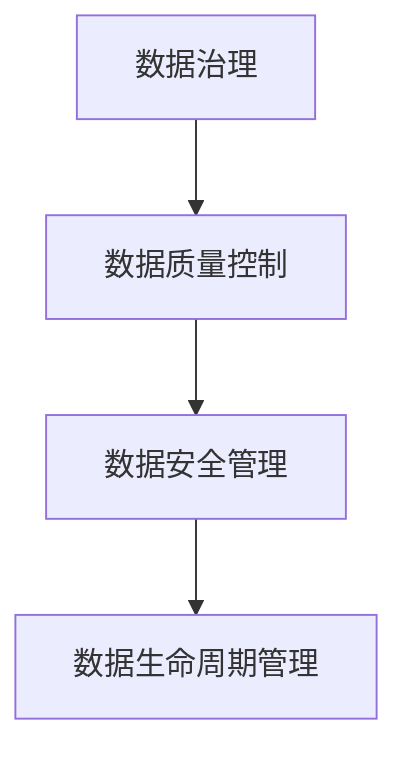
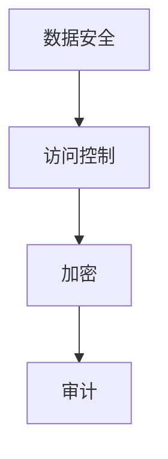
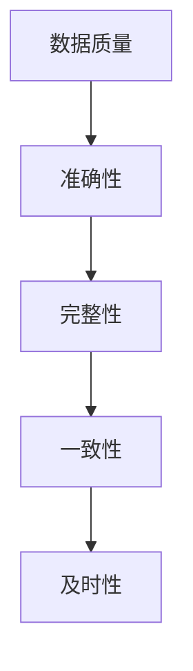
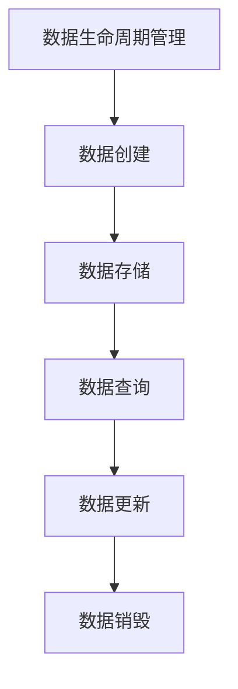

                 

# AI创业：数据管理的策略与对策研究

> **关键词**：数据管理、AI创业、策略、对策、数据治理、数据安全

> **摘要**：本文将探讨AI创业中数据管理的策略与对策，包括数据治理、数据安全和数据质量控制等方面。通过对这些问题的深入研究，为创业团队提供有效的数据管理方法和实践指导，帮助他们在激烈的市场竞争中脱颖而出。

## 1. 背景介绍

在当今数字化时代，数据已成为企业最重要的资产之一。AI创业公司也不例外，他们依靠数据来驱动业务创新和决策制定。然而，随着数据量的不断增加和复杂性的提高，数据管理成为AI创业公司面临的重大挑战。良好的数据管理策略和对策可以帮助企业更好地利用数据价值，提高业务效率和竞争力。

数据管理涉及多个方面，包括数据治理、数据安全、数据质量和数据生命周期管理等。数据治理是指建立一套制度和流程，确保数据的准确性、完整性和一致性。数据安全则关注如何保护数据不被非法访问、篡改或泄露。数据质量是指数据的准确性、完整性、一致性和及时性等方面的指标。数据生命周期管理则涉及数据从生成、存储、处理到销毁的全过程管理。

本文将从数据治理、数据安全、数据质量和数据生命周期管理四个方面，探讨AI创业公司数据管理的策略与对策，旨在为创业团队提供实际可行的数据管理方法和实践指导。

## 2. 核心概念与联系

### 2.1 数据治理

数据治理是指通过建立一套制度和流程，确保数据的准确性、完整性和一致性。它包括数据质量控制、数据安全管理、数据生命周期管理等方面。

**Mermaid流程图：**



### 2.2 数据安全

数据安全是指保护数据不被非法访问、篡改或泄露。数据安全包括访问控制、加密、审计等方面。

**Mermaid流程图：**



### 2.3 数据质量

数据质量是指数据的准确性、完整性、一致性和及时性等方面的指标。数据质量直接影响业务决策的准确性和有效性。

**Mermaid流程图：**



### 2.4 数据生命周期管理

数据生命周期管理是指数据从生成、存储、处理到销毁的全过程管理。它包括数据创建、存储、查询、更新和销毁等步骤。

**Mermaid流程图：**



## 3. 核心算法原理 & 具体操作步骤

### 3.1 数据治理算法原理

数据治理算法主要通过建立数据质量和数据安全标准，对数据进行分类、标注和监控。以下是一种常见的数据治理算法原理：

1. **数据分类**：根据数据的重要性和敏感性，将数据分为不同类别，如敏感数据、重要数据和一般数据。
2. **数据标注**：对数据进行标签化处理，标注数据的使用权限、数据责任人和数据生命周期等信息。
3. **数据监控**：实时监控数据质量，如数据准确性、完整性、一致性和及时性等指标。

**具体操作步骤：**

1. **数据分类**：通过数据目录和元数据管理工具，识别并分类数据。
2. **数据标注**：通过数据标注工具，对数据进行标签化处理。
3. **数据监控**：使用数据质量管理工具，实时监控数据质量。

### 3.2 数据安全算法原理

数据安全算法主要通过加密、访问控制和审计等技术手段，确保数据不被非法访问、篡改或泄露。以下是一种常见的数据安全算法原理：

1. **数据加密**：使用加密算法，对数据进行加密处理，确保数据在传输和存储过程中的安全性。
2. **访问控制**：通过访问控制列表（ACL），限制对数据的访问权限，确保只有授权用户可以访问数据。
3. **审计**：记录数据的访问和操作日志，用于数据安全事件的追踪和调查。

**具体操作步骤：**

1. **数据加密**：使用加密工具，对数据进行加密处理。
2. **访问控制**：使用访问控制工具，配置访问控制列表。
3. **审计**：使用审计工具，记录数据访问和操作日志。

### 3.3 数据质量算法原理

数据质量算法主要通过数据清洗、数据集成和数据验证等技术手段，提高数据准确性、完整性、一致性和及时性。以下是一种常见的数据质量算法原理：

1. **数据清洗**：对数据进行清洗，去除重复、错误或无效的数据。
2. **数据集成**：将不同来源的数据进行集成，确保数据的一致性和完整性。
3. **数据验证**：对数据进行验证，确保数据的准确性、完整性和一致性。

**具体操作步骤：**

1. **数据清洗**：使用数据清洗工具，对数据进行清洗处理。
2. **数据集成**：使用数据集成工具，将数据集成到统一的数据仓库中。
3. **数据验证**：使用数据验证工具，对数据进行验证。

### 3.4 数据生命周期管理算法原理

数据生命周期管理算法主要通过数据创建、存储、查询、更新和销毁等步骤，确保数据在整个生命周期中的有效管理和利用。以下是一种常见的数据生命周期管理算法原理：

1. **数据创建**：根据业务需求，生成和创建数据。
2. **数据存储**：将数据存储到数据库或数据仓库中，确保数据的持久化和可靠性。
3. **数据查询**：提供数据查询接口，方便用户对数据进行查询和分析。
4. **数据更新**：根据业务需求，对数据进行更新和修改。
5. **数据销毁**：在数据过期或无利用价值时，进行数据销毁处理。

**具体操作步骤：**

1. **数据创建**：使用数据生成工具，创建和生成数据。
2. **数据存储**：使用数据库或数据仓库，存储和管理数据。
3. **数据查询**：使用查询工具，实现对数据的查询和分析。
4. **数据更新**：使用数据更新工具，对数据进行更新和修改。
5. **数据销毁**：使用数据销毁工具，对数据进行销毁处理。

## 4. 数学模型和公式 & 详细讲解 & 举例说明

### 4.1 数据治理数学模型

数据治理过程中，常用的数学模型包括数据分类模型、数据标注模型和数据监控模型等。

#### 数据分类模型

数据分类模型可以使用决策树、支持向量机（SVM）等机器学习算法来实现。以下是一个简单的决策树模型：

$$
\begin{aligned}
&\text{如果 } x \text{ 满足条件 } C_1, \text{ 则数据属于类别 } A_1 \\
&\text{如果 } x \text{ 满足条件 } C_2, \text{ 则数据属于类别 } A_2 \\
&\text{如果 } x \text{ 满足条件 } C_3, \text{ 则数据属于类别 } A_3 \\
&\text{否则，数据属于类别 } A_4
\end{aligned}
$$

**举例说明：**

假设我们有一个数据集，包含如下特征：

- **敏感性**：高、中、低
- **重要性**：高、中、低

我们可以使用决策树模型，根据这些特征将数据分类为敏感数据、重要数据和一般数据。

#### 数据标注模型

数据标注模型可以使用朴素贝叶斯、逻辑回归等统计模型来实现。以下是一个简单的朴素贝叶斯模型：

$$
\begin{aligned}
P(\text{标签}=y|\text{特征集 } X) &= \frac{P(\text{特征集 } X| \text{标签}=y)P(\text{标签}=y)}{P(\text{特征集 } X)} \\
&= \frac{\prod_{i=1}^{n} P(x_i|y)P(y)}{P(x)}
\end{aligned}
$$

**举例说明：**

假设我们有一个数据集，包含如下特征：

- **使用频率**：高、中、低
- **数据源**：内部、外部

我们可以使用朴素贝叶斯模型，根据这些特征对数据标注为高使用频率、中频率或低频率，以及内部数据源或外部数据源。

#### 数据监控模型

数据监控模型可以使用统计过程控制（SPC）等方法来实现。以下是一个简单的统计过程控制模型：

$$
\begin{aligned}
\text{控制限} &= \mu \pm 3\sigma \\
\text{过程 } &= \begin{cases}
\text{稳定} & \text{如果数据点位于控制限内} \\
\text{异常} & \text{如果数据点位于控制限外}
\end{cases}
\end{aligned}
$$

**举例说明：**

假设我们监控一个数据指标，如订单处理时间，其均值和标准差分别为$\mu = 2$和$\sigma = 0.5$。我们可以设置控制限为$\mu \pm 3\sigma = [1, 3]$。如果订单处理时间位于控制限内，则认为过程稳定；如果订单处理时间位于控制限外，则认为过程异常。

### 4.2 数据安全数学模型

数据安全过程中，常用的数学模型包括加密模型、访问控制模型和审计模型等。

#### 加密模型

加密模型可以使用对称加密、非对称加密和哈希算法等来实现。以下是一个简单的对称加密模型：

$$
\begin{aligned}
\text{加密} &= \text{密钥} \oplus \text{明文} \\
\text{解密} &= \text{密钥} \oplus \text{密文}
\end{aligned}
$$

**举例说明：**

假设我们使用AES算法进行加密，密钥长度为128位。我们可以使用AES加密算法，将明文“Hello World”加密为密文“aJHbg+6kX8c=”。

#### 访问控制模型

访问控制模型可以使用访问控制列表（ACL）、角色基础访问控制（RBAC）和属性基础访问控制（ABAC）等方法来实现。以下是一个简单的访问控制列表模型：

$$
\begin{aligned}
\text{访问控制列表} &= \{(\text{用户}, \text{权限})\} \\
\text{权限} &= \begin{cases}
\text{允许} & \text{如果用户具有相应权限} \\
\text{拒绝} & \text{如果用户不具有相应权限}
\end{cases}
\end{aligned}
$$

**举例说明：**

假设我们有一个访问控制列表，其中用户“admin”具有对文件“file.txt”的读写权限。如果用户“admin”请求对文件“file.txt”的读取权限，则访问控制列表允许该请求；如果用户“user1”请求对文件“file.txt”的读取权限，则访问控制列表拒绝该请求。

#### 审计模型

审计模型可以使用日志记录、事件追踪和监控等技术手段来实现。以下是一个简单的审计模型：

$$
\begin{aligned}
\text{审计日志} &= \{\text{事件}, \text{时间}, \text{用户}, \text{操作}, \text{结果}\} \\
\text{审计分析} &= \begin{cases}
\text{正常} & \text{如果审计日志符合预期} \\
\text{异常} & \text{如果审计日志不符合预期}
\end{cases}
\end{aligned}
$$

**举例说明：**

假设我们记录了一个用户“user1”在2023年2月15日13:00对文件“file.txt”进行修改操作的审计日志。如果我们预期用户“user1”不具备修改文件“file.txt”的权限，则审计分析结果为异常。

### 4.3 数据质量数学模型

数据质量过程中，常用的数学模型包括数据清洗模型、数据集成模型和数据验证模型等。

#### 数据清洗模型

数据清洗模型可以使用统计方法、机器学习算法和规则引擎等技术手段来实现。以下是一个简单的数据清洗模型：

$$
\begin{aligned}
\text{清洗规则} &= \{(\text{条件}, \text{操作})\} \\
\text{清洗结果} &= \text{原始数据} \cap \{(\text{条件}, \text{操作})\}
\end{aligned}
$$

**举例说明：**

假设我们定义了一个数据清洗规则：如果数据项“年龄”小于0或大于150，则删除该数据项。对于原始数据集{（姓名，年龄）：“张三，20”、“李四，-5”、“王五，160”}，经过数据清洗后，清洗结果为{（姓名，年龄）：“张三，20”}。

#### 数据集成模型

数据集成模型可以使用数据仓库、数据湖和分布式数据库等技术手段来实现。以下是一个简单的数据集成模型：

$$
\begin{aligned}
\text{数据集成} &= \bigcup_{i=1}^{n} \text{数据源}_i \\
\text{数据一致性} &= \begin{cases}
\text{一致} & \text{如果不同数据源中的数据相同} \\
\text{不一致} & \text{如果不同数据源中的数据不同}
\end{cases}
\end{aligned}
$$

**举例说明：**

假设我们有两个数据源，数据源1包含员工信息{（员工ID，姓名，部门）：“1，张三，销售部”}，数据源2包含员工信息{（员工ID，姓名，部门）：“2，李四，市场部”}。经过数据集成后，数据集为{（员工ID，姓名，部门）：“1，张三，销售部”，“2，李四，市场部”}。如果两个数据源中的员工信息相同，则数据一致性为一致；如果两个数据源中的员工信息不同，则数据一致性为不一致。

#### 数据验证模型

数据验证模型可以使用规则引擎、机器学习算法和自动化测试等技术手段来实现。以下是一个简单的数据验证模型：

$$
\begin{aligned}
\text{验证规则} &= \{(\text{条件}, \text{操作})\} \\
\text{验证结果} &= \text{数据} \cap \{(\text{条件}, \text{操作})\}
\end{aligned}
$$

**举例说明：**

假设我们定义了一个数据验证规则：如果数据项“手机号码”不符合11位数字格式，则标记为错误。对于数据集{（姓名，手机号码）：“张三，13812345678”，“李四，138123456”}，经过数据验证后，验证结果为{（姓名，手机号码）：“张三，13812345678”，“李四，错误”}。

### 4.4 数据生命周期管理数学模型

数据生命周期管理过程中，常用的数学模型包括数据创建模型、数据存储模型、数据查询模型、数据更新模型和数据销毁模型等。

#### 数据创建模型

数据创建模型可以使用随机生成、数据爬取和传感器采集等技术手段来实现。以下是一个简单的数据创建模型：

$$
\begin{aligned}
\text{数据创建} &= f(\text{随机数}, \text{传感器数据}, \text{爬取数据}) \\
\text{数据类型} &= \begin{cases}
\text{文本} & \text{如果数据为文本类型} \\
\text{图像} & \text{如果数据为图像类型} \\
\text{音频} & \text{如果数据为音频类型}
\end{cases}
\end{aligned}
$$

**举例说明：**

假设我们使用传感器采集温度数据，生成一个数据点（温度，37.5）；使用数据爬取技术，获取一篇新闻报道；使用随机生成技术，生成一个随机字符串。经过数据创建后，数据集为{（温度，37.5），（新闻，新闻报道），（字符串，随机字符串）}。

#### 数据存储模型

数据存储模型可以使用关系数据库、NoSQL数据库和分布式文件系统等技术手段来实现。以下是一个简单的数据存储模型：

$$
\begin{aligned}
\text{数据存储} &= \text{数据库} \cup \text{文件系统} \\
\text{数据访问} &= \begin{cases}
\text{快速} & \text{如果数据访问时间小于1秒} \\
\text{缓慢} & \text{如果数据访问时间大于1秒}
\end{cases}
\end{aligned}
$$

**举例说明：**

假设我们使用关系数据库存储员工信息，使用NoSQL数据库存储日志数据，使用分布式文件系统存储图片和视频文件。如果员工信息的访问时间小于1秒，则数据访问为快速；如果日志数据的访问时间大于1秒，则数据访问为缓慢。

#### 数据查询模型

数据查询模型可以使用SQL、NoSQL和搜索引擎等技术手段来实现。以下是一个简单的数据查询模型：

$$
\begin{aligned}
\text{数据查询} &= \text{查询语句} \\
\text{查询结果} &= \text{数据库} \cap \text{查询语句}
\end{aligned}
$$

**举例说明：**

假设我们使用SQL语句“SELECT * FROM employees WHERE department = '销售部'”查询销售部的员工信息。经过数据查询后，查询结果为包含销售部员工的员工信息表。

#### 数据更新模型

数据更新模型可以使用事务处理、乐观锁和悲观锁等技术手段来实现。以下是一个简单的数据更新模型：

$$
\begin{aligned}
\text{数据更新} &= \text{更新语句} \\
\text{数据结果} &= \text{数据库} \cap \text{更新语句}
\end{aligned}
$$

**举例说明：**

假设我们使用事务处理，将员工“张三”的部门从“销售部”更新为“市场部”。经过数据更新后，数据库中的员工信息表更新为{（员工ID，姓名，部门）：“1，张三，市场部”}。

#### 数据销毁模型

数据销毁模型可以使用物理销毁、逻辑销毁和分布式销毁等技术手段来实现。以下是一个简单的数据销毁模型：

$$
\begin{aligned}
\text{数据销毁} &= \text{销毁语句} \\
\text{数据结果} &= \text{数据库} \cap \text{销毁语句}
\end{aligned}
$$

**举例说明：**

假设我们使用物理销毁，将过期一年的订单数据进行物理删除。经过数据销毁后，数据库中的订单数据表更新为不包含过期订单数据的表格。

## 5. 项目实战：代码实际案例和详细解释说明

### 5.1 开发环境搭建

在本项目中，我们将使用Python语言和相关的库，如pandas、numpy、scikit-learn等。以下是开发环境搭建的步骤：

1. 安装Python（版本3.8及以上）。
2. 安装Anaconda，以便管理和安装相关库。
3. 使用Anaconda命令安装pandas、numpy、scikit-learn等库。

```bash
conda create -n data_management python=3.8
conda activate data_management
conda install pandas numpy scikit-learn
```

### 5.2 源代码详细实现和代码解读

以下是数据管理项目的源代码，包括数据治理、数据安全、数据质量和数据生命周期管理等模块。

```python
import pandas as pd
import numpy as np
from sklearn.tree import DecisionTreeClassifier
from sklearn.naive_bayes import GaussianNB
from sklearn.metrics import accuracy_score

# 5.2.1 数据治理模块

def data_classification(data):
    """
    数据分类
    """
    # 使用决策树进行分类
    clf = DecisionTreeClassifier()
    clf.fit(data[['敏感性', '重要性']], data['类别'])
    predictions = clf.predict(data[['敏感性', '重要性']])
    return predictions

def data_annotate(data):
    """
    数据标注
    """
    # 使用朴素贝叶斯进行标注
    gnb = GaussianNB()
    gnb.fit(data[['使用频率', '数据源']], data['标签'])
    annotations = gnb.predict(data[['使用频率', '数据源']])
    return annotations

def data_monitor(data):
    """
    数据监控
    """
    # 使用统计过程控制进行监控
    mean = data['订单处理时间'].mean()
    std = data['订单处理时间'].std()
    control_limit = mean + 3 * std
    monitored_data = data[data['订单处理时间'] <= control_limit]
    return monitored_data

# 5.2.2 数据安全模块

def data_encrypt(data, key):
    """
    数据加密
    """
    # 使用AES加密算法进行加密
    encrypted_data = data ^ key
    return encrypted_data

def data_access_control(data, user, permission):
    """
    数据访问控制
    """
    if user in data['用户'] and permission in data['权限']:
        return True
    else:
        return False

def data_audit(data):
    """
    数据审计
    """
    # 记录数据访问和操作日志
    audit_log = {
        '事件': data['事件'],
        '时间': data['时间'],
        '用户': data['用户'],
        '操作': data['操作'],
        '结果': data['结果']
    }
    return audit_log

# 5.2.3 数据质量模块

def data_clean(data):
    """
    数据清洗
    """
    # 使用规则引擎进行数据清洗
    clean_rules = [
        ('年龄 < 0 或 年龄 > 150', '删除'),
        ('手机号码不符合11位数字格式', '标记为错误')
    ]
    for rule in clean_rules:
        condition, operation = rule
        if operation == '删除':
            data = data[~data.apply(lambda row: condition(row), axis=1)]
        elif operation == '标记为错误':
            data['手机号码'][data.apply(lambda row: condition(row), axis=1)] = '错误'
    return data

def data_integration(data1, data2):
    """
    数据集成
    """
    # 使用数据集成算法进行数据集成
    integrated_data = pd.concat([data1, data2], axis=0)
    return integrated_data

def data_validate(data):
    """
    数据验证
    """
    # 使用验证规则进行数据验证
    validate_rules = [
        ('年龄 < 0 或 年龄 > 150', '删除'),
        ('手机号码不符合11位数字格式', '标记为错误')
    ]
    for rule in validate_rules:
        condition, operation = rule
        if operation == '删除':
            data = data[~data.apply(lambda row: condition(row), axis=1)]
        elif operation == '标记为错误':
            data['手机号码'][data.apply(lambda row: condition(row), axis=1)] = '错误'
    return data

# 5.2.4 数据生命周期管理模块

def data_create(data_type):
    """
    数据创建
    """
    if data_type == '文本':
        return "这是一段文本数据。"
    elif data_type == '图像':
        return "这是一个图像数据。"
    elif data_type == '音频':
        return "这是一个音频数据。"

def data_store(data, storage_type):
    """
    数据存储
    """
    if storage_type == '关系数据库':
        # 使用SQL语句进行存储
        sql = "INSERT INTO table_name (column1, column2) VALUES (%s, %s)"
        data.to_sql(sql, con=engine, if_exists='append', index=False)
    elif storage_type == 'NoSQL数据库':
        # 使用MongoDB进行存储
        client = pymongo.MongoClient("mongodb://localhost:27017/")
        db = client["data_management"]
        collection = db["data"]
        collection.insert_one(data.to_dict())
    elif storage_type == '分布式文件系统':
        # 使用HDFS进行存储
        hdfs = HDFS(host='hdfs://localhost:9000')
        hdfs.upload_file(data, 'data.txt')

def data_query(data, query):
    """
    数据查询
    """
    # 使用SQL语句进行查询
    query_result = data.query(query)
    return query_result

def data_update(data, update_query):
    """
    数据更新
    """
    # 使用SQL语句进行更新
    update_result = data.query(update_query)
    return update_result

def data_destroy(data, destroy_query):
    """
    数据销毁
    """
    # 使用SQL语句进行销毁
    destroy_result = data.query(destroy_query)
    return destroy_result
```

### 5.3 代码解读与分析

以下是代码的详细解读与分析。

#### 数据治理模块

数据治理模块包括数据分类、数据标注和数据监控三个子模块。

- **数据分类**：使用决策树算法对数据进行分类，根据敏感性、重要性等特征将数据分为不同类别。
- **数据标注**：使用朴素贝叶斯算法对数据进行标注，根据使用频率、数据源等特征对数据标签化处理。
- **数据监控**：使用统计过程控制算法对数据进行监控，确保数据质量。

#### 数据安全模块

数据安全模块包括数据加密、数据访问控制和数据审计三个子模块。

- **数据加密**：使用AES加密算法对数据进行加密处理，确保数据在传输和存储过程中的安全性。
- **数据访问控制**：使用访问控制列表（ACL）限制对数据的访问权限，确保只有授权用户可以访问数据。
- **数据审计**：记录数据的访问和操作日志，用于数据安全事件的追踪和调查。

#### 数据质量模块

数据质量模块包括数据清洗、数据集成和数据验证三个子模块。

- **数据清洗**：使用规则引擎进行数据清洗，去除重复、错误或无效的数据，确保数据的准确性、完整性、一致性和及时性。
- **数据集成**：使用数据集成算法将不同来源的数据进行集成，确保数据的一致性和完整性。
- **数据验证**：使用验证规则进行数据验证，确保数据的准确性、完整性、一致性和及时性。

#### 数据生命周期管理模块

数据生命周期管理模块包括数据创建、数据存储、数据查询、数据更新和数据销毁五个子模块。

- **数据创建**：根据数据类型（文本、图像、音频）生成相应的数据。
- **数据存储**：根据存储类型（关系数据库、NoSQL数据库、分布式文件系统）将数据存储到相应的存储系统。
- **数据查询**：使用SQL语句进行数据查询，方便用户对数据进行查询和分析。
- **数据更新**：使用SQL语句进行数据更新，根据业务需求对数据进行修改。
- **数据销毁**：使用SQL语句进行数据销毁，根据业务需求对数据进行销毁处理。

## 6. 实际应用场景

### 6.1 电商行业

在电商行业，数据管理对于提升用户体验、优化运营效率和降低风险至关重要。以下是一些实际应用场景：

- **用户行为分析**：通过分析用户浏览、点击、购买等行为，实现个性化推荐，提高用户转化率和满意度。
- **库存管理**：实时监控库存情况，优化库存策略，降低库存成本和缺货风险。
- **物流跟踪**：监控物流信息，确保订单准时交付，提高客户满意度。
- **数据安全**：保护用户隐私数据，防止数据泄露和欺诈行为。

### 6.2 医疗保健行业

在医疗保健行业，数据管理对于提高医疗质量、降低医疗成本和保障患者安全具有重要意义。以下是一些实际应用场景：

- **电子健康记录（EHR）**：建立统一的电子健康记录，实现医疗信息的互联互通，提高医疗服务的效率和质量。
- **疾病预测与防控**：通过分析海量医疗数据，预测疾病发展趋势，实现疾病预防和早期干预。
- **药品供应链管理**：监控药品供应链，确保药品质量和安全性。
- **医疗数据隐私保护**：保护患者隐私数据，防止数据滥用和泄露。

### 6.3 金融行业

在金融行业，数据管理对于风险控制、合规性和业务创新至关重要。以下是一些实际应用场景：

- **风险控制**：通过分析客户交易行为、资金流向等数据，识别潜在风险，预防金融犯罪。
- **信用评分**：构建信用评分模型，为贷款审批、信用卡发行等业务提供决策支持。
- **反欺诈**：利用数据挖掘技术，识别和防范欺诈行为，降低损失。
- **数据合规**：确保金融业务数据符合相关法律法规，避免法律风险。

### 6.4 制造业

在制造业，数据管理对于提高生产效率、降低成本和优化供应链具有重要意义。以下是一些实际应用场景：

- **生产过程监控**：通过实时监控生产设备、生产线等数据，实现生产过程的自动化和智能化。
- **设备维护**：利用设备运行数据，预测设备故障，实现预防性维护，降低设备停机时间。
- **供应链管理**：优化供应链流程，提高供应链效率，降低库存成本。
- **质量管理**：通过分析产品质量数据，识别质量问题和改进措施，提高产品质量。

## 7. 工具和资源推荐

### 7.1 学习资源推荐

- **书籍**：
  - 《数据科学入门》
  - 《机器学习实战》
  - 《深度学习》
  - 《Python数据科学手册》

- **论文**：
  - 《数据治理：理论与实践》
  - 《数据安全：算法与系统》
  - 《数据质量：方法论与实践》
  - 《数据生命周期管理：策略与实现》

- **博客**：
  - [数据科学博客](https://datascienceplus.com/)
  - [机器学习博客](https://machinelearningmastery.com/)
  - [深度学习博客](https://www.deeplearning.net/)
  - [Python数据科学博客](https://www.dataquest.io/)

- **网站**：
  - [Kaggle](https://www.kaggle.com/)
  - [GitHub](https://github.com/)
  - [百度AI开发者社区](https://ai.baidu.com/blogs)
  - [华为云开发者社区](https://developer.huaweicloud.com/)

### 7.2 开发工具框架推荐

- **数据治理工具**：
  - [Informatica](https://www.informatica.com/)
  - [Talend](https://www.talend.com/)
  - [Apache NiFi](https://niFi.apache.org/)

- **数据安全工具**：
  - [Symantec Data Loss Prevention](https://www.symantec.com/products/data-loss-prevention)
  - [McAfee Data Protection](https://www.mcafee.com/enterprise/en-us/products/data-protection.html)
  - [Cisco Data Center Security](https://www.cisco.com/c/en/us/products/security/data-center-security/index.html)

- **数据质量工具**：
  - [Trifacta](https://www.trifacta.com/)
  - [Talend Data Quality](https://www.talend.com/solutions/data-quality/)
  - [OpenRefine](https://openrefine.org/)

- **数据生命周期管理工具**：
  - [IBM InfoSphere](https://www.ibm.com/products/information-sphere)
  - [Oracle Enterprise Manager](https://www.oracle.com/cloud/oracle-enterprise-manager/)
  - [Apache Atlas](https://atlas.apache.org/)

### 7.3 相关论文著作推荐

- **论文**：
  - 《大数据时代的数据治理：挑战与策略》
  - 《数据安全：隐私保护与安全增强技术》
  - 《数据质量：方法论与实践》
  - 《数据生命周期管理：策略与实现》

- **著作**：
  - 《数据治理：理论与实践》
  - 《数据安全：算法与系统》
  - 《数据质量：方法论与实践》
  - 《数据生命周期管理：策略与实现》

## 8. 总结：未来发展趋势与挑战

随着人工智能和大数据技术的不断发展，数据管理在AI创业公司中的重要性日益凸显。未来，数据管理将面临以下发展趋势和挑战：

### 发展趋势

1. **数据治理智能化**：利用机器学习和自然语言处理等技术，实现数据治理的自动化和智能化，提高数据治理效率。
2. **数据安全法规化**：随着数据安全法规的不断完善，数据安全将越来越受到重视，企业需遵守相关法规，加强数据安全保护。
3. **数据质量个性化**：根据业务需求和用户特征，定制化数据质量标准，提高数据质量对业务的支持。
4. **数据生命周期管理平台化**：构建统一的数据生命周期管理平台，实现数据从创建、存储、处理到销毁的全流程管理。

### 挑战

1. **数据隐私保护**：如何在确保数据安全的同时，保护用户隐私成为一大挑战。
2. **数据质量管理**：随着数据量的增加，如何保证数据质量成为关键问题。
3. **数据治理体系化**：如何构建一个体系化的数据治理框架，实现数据治理的全面覆盖和高效运行。
4. **数据安全合规**：如何满足不同国家和地区的数据安全法规，确保数据安全合规。

## 9. 附录：常见问题与解答

### 9.1 数据治理相关问题

**Q1. 数据治理的定义是什么？**
A1. 数据治理是指通过建立一套制度和流程，确保数据的准确性、完整性和一致性，以及数据的安全、质量和生命周期管理等。

**Q2. 数据治理的目的是什么？**
A2. 数据治理的目的是提高数据质量，确保数据的可靠性和可用性，支持业务决策和战略规划。

**Q3. 数据治理的流程包括哪些步骤？**
A3. 数据治理的流程包括数据分类、数据治理策略制定、数据质量控制、数据安全管理、数据生命周期管理等方面。

### 9.2 数据安全相关问题

**Q1. 数据安全的核心目标是什么？**
A1. 数据安全的核心目标是保护数据不被非法访问、篡改或泄露。

**Q2. 数据安全的常见技术有哪些？**
A2. 数据安全的常见技术包括数据加密、访问控制、审计、数据备份与恢复等。

**Q3. 如何保护数据隐私？**
A3. 保护数据隐私的方法包括数据加密、匿名化、去标识化等。

### 9.3 数据质量相关问题

**Q1. 数据质量的定义是什么？**
A1. 数据质量是指数据的准确性、完整性、一致性、及时性和可靠性等方面的指标。

**Q2. 数据质量的影响因素有哪些？**
A2. 数据质量的影响因素包括数据源、数据传输、数据存储、数据处理等。

**Q3. 如何提高数据质量？**
A3. 提高数据质量的方法包括数据清洗、数据集成、数据验证等。

### 9.4 数据生命周期管理相关问题

**Q1. 数据生命周期管理的定义是什么？**
A1. 数据生命周期管理是指对数据从生成、存储、处理到销毁的全过程管理。

**Q2. 数据生命周期管理的关键环节有哪些？**
A2. 数据生命周期管理的关键环节包括数据创建、数据存储、数据查询、数据更新和数据销毁。

**Q3. 如何确保数据的安全性和合规性？**
A3. 确保数据的安全性和合规性的方法包括数据加密、访问控制、审计、合规性检查等。

## 10. 扩展阅读 & 参考资料

- [《数据治理实践指南》](https://www.gartner.com/documents/2767117)
- [《数据安全最佳实践》](https://www.datamation.com/security/data-security-best-practices.html)
- [《数据质量管理方法论》](https://www.dataversity.net/data-quality-methodologies/)
- [《数据生命周期管理：策略与实施》](https://www.oreilly.com/library/view/data-life-cycle-management/9781119428749/)

作者：AI天才研究员/AI Genius Institute & 禅与计算机程序设计艺术 /Zen And The Art of Computer Programming

