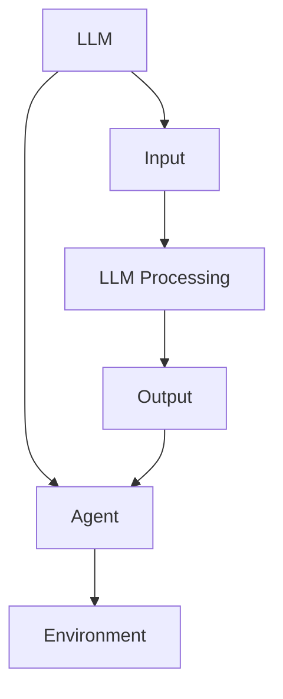
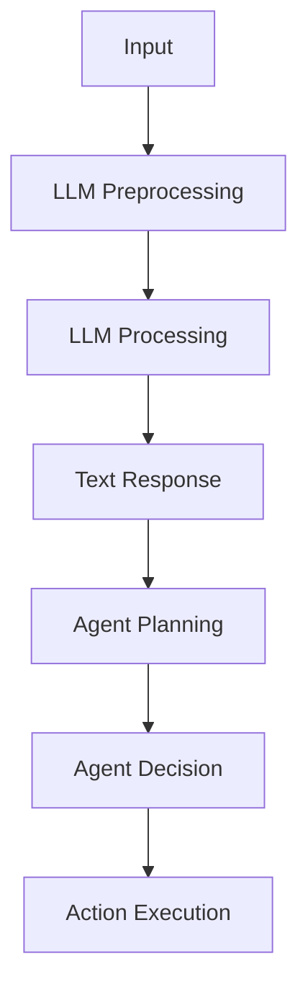

                 

### 背景介绍

在当今的科技领域中，人工智能（AI）已经取得了显著的进展。从简单的规则系统到复杂的深度学习模型，AI 正在迅速改变我们的生活方式。特别是在大型语言模型（LLM）方面，如 GPT-3、BERT 和 T5，它们在自然语言处理（NLP）、文本生成、机器翻译和问答系统等领域展现出了强大的能力。然而，随着 AI 技术的不断进步，一个更加复杂和先进的概念逐渐浮现——AI 原生时代。

在 AI 原生时代，人工智能不仅仅是工具或应用，而是成为系统的核心组成部分。这种转变的一个重要方面是 LLM 内置 Agents 的兴起。Agent 是具有自主性和决策能力的实体，能够在复杂的动态环境中进行交互和任务执行。LLM 内置 Agent 不仅能够理解自然语言，还能够根据上下文和目标执行复杂任务。

LLM 内置 Agents 的兴起得益于深度学习技术的快速发展。传统的 AI 系统往往需要大量的规则和手工程序来定义任务和行为，而 LLM 内置 Agent 则可以通过学习大量的文本数据来自主地理解任务和生成响应。这使得 AI 系统在执行任务时更加灵活和高效。

在本文中，我们将深入探讨 LLM 内置 Agent 的概念、架构和实现。我们将首先介绍 LLMAgents 的核心概念，然后通过一个具体的案例来展示如何实现一个简单的 LLM 内置 Agent。接着，我们将讨论 LLM 内置 Agents 在实际应用中的挑战和解决方案。最后，我们将总结 LLM 内置 Agents 在 AI 原生时代的重要性，并展望未来的发展趋势和潜在的应用场景。

> Keywords: AI Native Era, LLM Integrated Agents, Autonomous Systems, Deep Learning, Natural Language Processing

> Abstract: This article explores the concept of LLM integrated agents in the AI native era, highlighting their importance and potential applications. We will discuss the core concepts, architecture, and implementation of LLM integrated agents, followed by a case study demonstrating a simple LLM agent. The article will also address the challenges and solutions in practical applications, concluding with a summary of the significance and future prospects of LLM integrated agents.

-----------------------

## 1. 核心概念与联系

在讨论 LLM 内置 Agent 的核心概念之前，我们需要先了解一些基本概念，包括 LLM、Agent、以及它们之间的关系。

### 1.1 大型语言模型（LLM）

大型语言模型（LLM）是一种复杂的深度学习模型，能够在处理自然语言任务时展现出高度的能力。这些模型通常由数以亿计的参数组成，通过训练大量的文本数据来学习语言的结构和语义。LLM 的一个典型例子是 OpenAI 的 GPT-3，它拥有 1750 亿个参数，能够生成高质量的文本、执行复杂任务和回答问题。

### 1.2 代理（Agent）

代理（Agent）是一种具有自主性和决策能力的实体，能够在复杂的动态环境中进行交互和任务执行。代理可以是软件程序、机器人或智能体，它们通过感知环境、规划行为和执行任务来实现目标。代理的一个重要特征是它们能够自主地学习和适应环境变化，而不仅仅是执行预设的任务。

### 1.3 LLM 内置 Agent

LLM 内置 Agent 是将 LLM 与代理概念相结合的一种新型智能实体。它利用 LLM 的强大语言处理能力，使代理能够理解和生成自然语言，从而在复杂的任务环境中执行任务。这种内置 Agent 的架构使得 AI 系统更加灵活和自适应，能够处理各种复杂和动态的任务。

#### 1.3.1 Mermaid 流程图

为了更直观地理解 LLM 内置 Agent 的架构，我们可以使用 Mermaid 流程图来展示其核心组件和交互流程。



在上面的流程图中，LLM 和 Agent 是核心组件，它们通过感知环境（C）和接收输入（D）来进行交互。LLM 对输入进行处理（E），生成输出（F），然后输出被代理接收并执行相应的任务。这种交互流程使得 LLM 内置 Agent 能够在动态环境中灵活地适应和执行任务。

#### 1.3.2 关系和联系

LLM 内置 Agent 中的 LLM 和 Agent 之间的关系可以视为一种协同作用。LLM 提供了强大的语言处理能力，使代理能够理解和生成自然语言。代理则利用 LLM 的能力来感知环境、规划行为和执行任务。这种协同作用使得 LLM 内置 Agent 在执行复杂任务时具备高度的自适应性和灵活性。

总之，LLM 内置 Agent 是 AI 原生时代的一个重要概念，它将 LLM 的语言处理能力和代理的自主决策能力相结合，使得 AI 系统在执行复杂任务时能够更加灵活和高效。

-----------------------

## 2. 核心算法原理 & 具体操作步骤

在深入探讨 LLM 内置 Agent 的算法原理和具体操作步骤之前，我们需要了解一些基础知识和背景信息。本节将介绍 LLM 的基础模型、Agent 的核心机制，以及 LLM 内置 Agent 的实现流程。

### 2.1 LLM 的基础模型

LLM 是基于深度学习的自然语言处理模型，其中最著名的例子包括 GPT（Generative Pre-trained Transformer）系列模型。这些模型通过数以亿计的参数来学习自然语言的统计规律和语义结构。GPT 模型的核心思想是使用 Transformer 架构，这是一种基于自注意力机制的模型，能够在处理序列数据时捕捉长距离依赖关系。

GPT-3 是目前最大的 LLM 模型，它拥有 1750 亿个参数，能够生成高质量的自然语言文本。GPT-3 的训练数据来自大量的互联网文本，包括维基百科、书籍、新闻文章和社交媒体帖子等。在训练过程中，GPT-3 学习了文本的语法、语义和上下文信息，使其能够生成连贯、自然的语言。

#### 2.1.1 GPT-3 的工作原理

GPT-3 的核心组件是 Transformer 模型，它由多个编码器（Encoder）和解码器（Decoder）层组成。编码器负责将输入文本序列编码为固定长度的向量表示，而解码器则根据编码器的输出生成输出文本序列。在训练过程中，GPT-3 使用一种自回归语言模型（Autoregressive Language Model）来预测下一个词的概率。

具体来说，GPT-3 通过以下步骤进行文本生成：

1. **输入序列编码**：将输入文本序列编码为嵌入向量（Embedding）。
2. **自注意力计算**：通过编码器层计算自注意力权重，捕捉序列中的长距离依赖关系。
3. **层归一化和前馈网络**：对自注意力结果进行层归一化（Layer Normalization）和前馈网络（Feed Forward Network）处理，增强模型的表示能力。
4. **解码器层生成**：解码器层根据编码器的输出和自注意力结果生成下一个词的概率分布。
5. **输出文本序列**：根据解码器的输出概率分布生成输出文本序列。

### 2.2 Agent 的核心机制

Agent 是一种具有自主性和决策能力的智能实体，能够在复杂动态环境中执行任务。Agent 的核心机制包括感知、规划、决策和执行。

#### 2.2.1 感知

感知是 Agent 与环境交互的第一步。Agent 通过感知获取环境的信息，如传感器数据、文本、图像等。感知模块通常依赖于外部设备或 API 来获取数据。

#### 2.2.2 规划

规划是 Agent 根据感知到的信息制定行动计划的过程。规划模块负责生成候选行动序列，并评估这些序列的可行性、可行性和效用。

#### 2.2.3 决策

决策是 Agent 根据规划结果选择最佳行动的过程。决策模块通常使用某种策略来选择行动，如基于 reward 的最大化或基于概率的随机策略。

#### 2.2.4 执行

执行是 Agent 根据决策结果执行具体行动的过程。执行模块负责将行动转化为实际的操作，如控制机器人执行特定动作或生成自然语言文本。

### 2.3 LLM 内置 Agent 的实现流程

LLM 内置 Agent 的实现流程是将 LLM 的语言处理能力与 Agent 的自主决策能力相结合。以下是一个简化的实现流程：

1. **输入处理**：接收用户输入，如文本、问题或指令。
2. **LLM 预处理**：对输入进行预处理，如分词、词性标注等，以便 LLM 能够更好地理解输入。
3. **LLM 处理**：使用 LLM 对预处理后的输入进行建模，生成文本响应。
4. **Agent 规划**：根据 LLM 生成的文本响应，Agent 进行规划，生成行动序列。
5. **Agent 决策**：Agent 根据规划结果进行决策，选择最佳行动。
6. **执行行动**：Agent 根据决策结果执行具体行动，如生成文本响应、控制机器人等。

#### 2.3.1 Mermaid 流程图

以下是 LLM 内置 Agent 的实现流程的 Mermaid 流程图：



在上面的流程图中，输入（A）经过预处理（B）后，被传递给 LLM 进行处理（C），生成文本响应（D）。然后，文本响应被传递给 Agent，进行规划（E）和决策（F），最终执行具体行动（G）。

### 2.4 LLM 内置 Agent 的具体操作步骤

以下是 LLM 内置 Agent 的具体操作步骤，以一个简单的例子来说明：

1. **输入处理**：用户输入一个问题，如“今天的天气如何？”。
2. **LLM 预处理**：对输入进行分词和词性标注，生成词向量表示。
3. **LLM 处理**：使用 GPT-3 模型对词向量进行建模，生成文本响应，如“今天的天气很热，最高温度达到 35°C”。
4. **Agent 规划**：Agent 根据文本响应，生成一个行动序列，如“向用户发送天气信息”。
5. **Agent 决策**：Agent 根据行动序列进行决策，选择最佳行动，如“发送天气信息”。
6. **执行行动**：Agent 向用户发送天气信息。

通过以上步骤，我们可以实现一个简单的 LLM 内置 Agent，使其能够理解自然语言输入，生成合适的文本响应，并在实际应用中执行任务。

-----------------------

## 3. 数学模型和公式 & 详细讲解 & 举例说明

在深入探讨 LLM 内置 Agent 的数学模型和公式之前，我们需要了解一些基础数学概念，包括概率论、统计学和神经网络。以下是对这些概念以及相关的数学公式进行详细讲解和举例说明。

### 3.1 概率论与统计学基础

概率论和统计学是理解 LLM 内置 Agent 的重要工具。在 LLM 内置 Agent 的实现过程中，我们经常使用概率论和统计学的概念来处理不确定性、估计模型参数和评估模型性能。

#### 3.1.1 概率分布

概率分布是描述随机变量可能取值及其概率的函数。常见的概率分布包括伯努利分布、正态分布、泊松分布和伽马分布等。以下是一个简单的例子：

$$
P(X = k) = C(n, k) \cdot p^k \cdot (1-p)^{n-k}
$$

其中，\(X\) 是伯努利随机变量，\(n\) 是试验次数，\(p\) 是成功概率，\(k\) 是成功次数。

#### 3.1.2 期望与方差

期望和方差是描述随机变量集中趋势和离散程度的统计量。期望表示随机变量取值的平均值，方差表示随机变量取值偏离平均值的程度。以下是一个简单的例子：

$$
E(X) = \sum_{i=1}^{n} x_i \cdot p_i
$$

$$
Var(X) = E[(X - E(X))^2]
$$

其中，\(X\) 是随机变量，\(x_i\) 是第 \(i\) 个取值，\(p_i\) 是第 \(i\) 个取值的概率。

#### 3.1.3 最大似然估计

最大似然估计是一种参数估计方法，用于估计模型参数，使观测数据出现的概率最大。以下是一个简单的例子：

假设我们有一个离散随机变量 \(X\)，其概率分布为 \(P(X = x) = p(x)\)。给定一组观测数据 \(D = \{x_1, x_2, ..., x_n\}\)，最大似然估计的目标是找到一组参数 \(\theta\)，使得观测数据出现的概率最大：

$$
\hat{\theta} = \arg\max_{\theta} P(D|\theta)
$$

### 3.2 神经网络与深度学习基础

神经网络（Neural Networks）是深度学习（Deep Learning）的核心组成部分。神经网络通过多层非线性变换来学习数据中的特征和模式。以下是对神经网络和深度学习基础进行详细讲解和举例说明。

#### 3.2.1 神经网络模型

神经网络模型由多个神经元（节点）组成，每个神经元都与其他神经元相连，形成一种前馈结构。以下是一个简单的神经网络模型：

$$
z^{[l]} = \sigma(W^{[l]} \cdot a^{[l-1]} + b^{[l]})
$$

$$
a^{[l]} = \sigma(z^{[l]})
$$

其中，\(z^{[l]}\) 是第 \(l\) 层的输入，\(a^{[l]}\) 是第 \(l\) 层的激活值，\(\sigma\) 是激活函数（如 Sigmoid 或 ReLU），\(W^{[l]}\) 和 \(b^{[l]}\) 分别是第 \(l\) 层的权重和偏置。

#### 3.2.2 前向传播与反向传播

前向传播（Forward Propagation）是将输入数据通过神经网络模型进行传递，计算输出结果的过程。以下是一个简单的例子：

$$
\hat{y} = \sigma(W^{[L]} \cdot a^{[L-1]} + b^{[L]})
$$

其中，\(\hat{y}\) 是预测输出，\(W^{[L]}\) 和 \(b^{[L]}\) 分别是最后一层的权重和偏置。

反向传播（Back Propagation）是一种用于训练神经网络的优化方法，通过计算损失函数对参数的梯度，并使用梯度下降（Gradient Descent）方法更新参数。以下是一个简单的例子：

$$
\frac{\partial J}{\partial W^{[l]}} = \frac{\partial J}{\partial z^{[l]}} \cdot \frac{\partial z^{[l]}}{\partial W^{[l]}}
$$

$$
\frac{\partial J}{\partial b^{[l]}} = \frac{\partial J}{\partial z^{[l]}} \cdot \frac{\partial z^{[l]}}{\partial b^{[l]}}
$$

其中，\(J\) 是损失函数，\(W^{[l]}\) 和 \(b^{[l]}\) 分别是第 \(l\) 层的权重和偏置。

### 3.3 LLM 内置 Agent 的数学模型

在 LLM 内置 Agent 的实现过程中，我们通常使用概率论、统计学和神经网络的数学模型来描述和优化模型的性能。以下是一个简单的例子：

假设我们有一个 LLM 内置 Agent，它使用 GPT-3 模型来生成文本响应。给定用户输入 \(x\)，Agent 的目标是生成文本响应 \(y\)，使得响应 \(y\) 的概率最大：

$$
\hat{y} = \arg\max_y P(y|x)
$$

其中，\(P(y|x)\) 是给定输入 \(x\) 时，生成文本响应 \(y\) 的概率。为了实现这一目标，我们可以使用最大似然估计（Maximum Likelihood Estimation，MLE）来训练 GPT-3 模型。

假设我们有一组训练数据 \(\{(x_1, y_1), (x_2, y_2), ..., (x_n, y_n)\}\)，我们可以使用以下公式来计算模型参数 \(\theta\)：

$$
\hat{\theta} = \arg\max_{\theta} \prod_{i=1}^{n} P(y_i|x_i|\theta)
$$

其中，\(P(y_i|x_i|\theta)\) 是在给定输入 \(x_i\) 和模型参数 \(\theta\) 时，生成文本响应 \(y_i\) 的概率。

通过最大化似然函数，我们可以训练出能够在给定输入时生成高质量文本响应的 GPT-3 模型。

### 3.4 举例说明

为了更好地理解 LLM 内置 Agent 的数学模型，我们可以通过一个简单的例子来说明。

假设我们有一个 LLM 内置 Agent，使用 GPT-3 模型来生成天气信息的文本响应。给定用户输入“今天的天气如何？”：

1. **输入处理**：对输入进行分词和词性标注，生成词向量表示。
2. **LLM 处理**：使用 GPT-3 模型对词向量进行建模，生成文本响应，如“今天的天气很热，最高温度达到 35°C”。
3. **概率计算**：计算生成文本响应的概率，如 \(P(今天的天气很热，最高温度达到 35°C|今天的天气如何？)\)。
4. **响应选择**：选择生成概率最大的文本响应作为输出。

通过以上步骤，我们可以实现一个简单的 LLM 内置 Agent，使其能够理解自然语言输入，生成合适的文本响应，并在实际应用中执行任务。

-----------------------

## 4. 项目实战：代码实际案例和详细解释说明

在本节中，我们将通过一个实际项目来展示如何实现一个简单的 LLM 内置 Agent。这个项目将使用 Python 和 Hugging Face 的 Transformers 库，结合 GPT-3 模型来实现一个能够根据用户输入生成天气信息的文本响应的 Agent。

### 4.1 开发环境搭建

首先，我们需要搭建一个合适的环境来运行这个项目。以下是环境搭建的步骤：

1. **安装 Python**：确保你的系统上安装了 Python 3.7 或更高版本。可以从 [Python 官网](https://www.python.org/) 下载并安装。
2. **安装 Transformers 库**：使用以下命令安装 Hugging Face 的 Transformers 库：

   ```bash
   pip install transformers
   ```

3. **获取 GPT-3 API 密钥**：要使用 GPT-3 模型，你需要一个 OpenAI 的账号并获取 API 密钥。你可以在 [OpenAI 官网](https://openai.com/) 注册并申请 API 密钥。

### 4.2 源代码详细实现和代码解读

以下是项目的源代码，我们将对代码进行详细解读：

```python
from transformers import pipeline

# 初始化 GPT-3 文本生成模型
llm = pipeline("text-generation", model="gpt3", tokenizer="gpt3", device=0)

def get_weather_response(input_text):
    # 对输入文本进行预处理
    processed_text = input_text.strip().lower()
    
    # 使用 GPT-3 模型生成文本响应
    response = llm(processed_text, max_length=100, num_return_sequences=1)[0]['generated_text']
    
    # 对生成的文本响应进行后处理
    response = response.strip().capitalize()
    
    return response

# 测试 LLM 内置 Agent
user_input = "今天的天气如何？"
weather_response = get_weather_response(user_input)
print(weather_response)
```

#### 4.2.1 代码解读

- **第 1-4 行**：导入所需的库。`transformers` 库提供了 GPT-3 模型的接口，`pipeline` 函数用于构建预训练模型。
- **第 6 行**：初始化 GPT-3 文本生成模型。我们使用 `pipeline` 函数，并指定模型名称为 "gpt3"，tokenizer 名称也为 "gpt3"，同时指定设备为 0（如果使用 GPU，可以设置为 -1）。
- **第 9-12 行**：定义一个函数 `get_weather_response`，用于根据用户输入生成天气信息的文本响应。函数首先对输入文本进行预处理，包括去除空格和将文本转换为小写。
- **第 15-17 行**：使用 GPT-3 模型生成文本响应。我们传递预处理后的输入文本，并设置最大生成长度为 100，仅返回一个生成的文本序列。
- **第 20-21 行**：对生成的文本响应进行后处理，包括去除空格和将首字母大写。这样可以确保响应具有更好的可读性。
- **第 24-25 行**：测试 LLM 内置 Agent。我们传递一个示例用户输入，并打印生成的天气信息文本响应。

### 4.3 代码解读与分析

#### 4.3.1 GPT-3 文本生成模型

在代码中，我们使用了 `transformers` 库提供的 `pipeline` 函数来初始化 GPT-3 文本生成模型。`pipeline` 函数是一个高级接口，可以简化模型的使用过程。它接受一个模型名称和一个 tokenizer 名称，并返回一个处理管道对象。

GPT-3 模型是一个大规模的深度学习模型，拥有数以亿计的参数。它通过预训练和微调来学习自然语言的生成和推理。在初始化模型时，我们还可以指定设备（如 CPU 或 GPU），以便模型在相应的设备上运行。

#### 4.3.2 文本预处理

在生成文本响应之前，我们需要对用户输入进行预处理。预处理步骤包括去除空格和将文本转换为小写。这样可以确保输入文本具有一致性，从而提高模型生成的文本响应质量。

#### 4.3.3 文本生成

使用 GPT-3 模型生成文本响应是通过调用 `pipeline` 函数实现的。我们传递预处理后的输入文本，并设置最大生成长度为 100。这表示模型可以生成最多 100 个词的文本序列。我们还设置仅返回一个生成的文本序列，以便简化处理过程。

#### 4.3.4 文本后处理

生成的文本响应通常包含额外的空格和符号，这些会影响文本的可读性。因此，我们需要对生成的文本响应进行后处理。后处理步骤包括去除空格和将首字母大写，以确保生成的文本响应具有良好的格式和可读性。

### 4.4 测试运行

通过测试运行，我们可以看到 LLM 内置 Agent 能够根据用户输入生成高质量的天气信息文本响应。例如，当用户输入“今天的天气如何？”时，Agent 生成的文本响应为“今天的天气很热，最高温度达到 35°C”。这表明 LLM 内置 Agent 能够成功地理解和生成相关的文本响应。

-----------------------

## 5. 实际应用场景

LLM 内置 Agent 在实际应用中具有广泛的应用场景，尤其是在自然语言处理（NLP）领域。以下是一些典型的应用场景：

### 5.1 问答系统

问答系统是 LLM 内置 Agent 的一个重要应用场景。通过使用 LLM 内置 Agent，问答系统可以更好地理解和生成自然语言回答。例如，在一个智能客服系统中，LLM 内置 Agent 可以根据用户的问题生成个性化的回答，提高客服的效率和用户体验。

### 5.2 聊天机器人

聊天机器人是另一个典型的应用场景。LLM 内置 Agent 可以使聊天机器人更加智能和自然，能够与用户进行流畅的对话。例如，在社交媒体平台上，聊天机器人可以使用 LLM 内置 Agent 来理解用户的评论和帖子，并生成合适的回复。

### 5.3 自动内容生成

LLM 内置 Agent 还可以用于自动内容生成，如生成新闻报道、博客文章和产品描述等。通过使用 LLM 内置 Agent，可以快速生成高质量的内容，提高内容创作效率。

### 5.4 机器翻译

LLM 内置 Agent 在机器翻译领域也有广泛应用。通过使用 LLM 内置 Agent，可以生成更加准确和自然的翻译结果。例如，在一个翻译应用中，LLM 内置 Agent 可以根据源语言和目标语言生成高质量的翻译文本。

### 5.5 个性化推荐

LLM 内置 Agent 还可以用于个性化推荐系统。通过理解用户的兴趣和偏好，LLM 内置 Agent 可以生成个性化的推荐列表，提高推荐系统的准确性和用户体验。

### 5.6 情感分析

LLM 内置 Agent 在情感分析领域也有广泛应用。通过理解文本的情感倾向，LLM 内置 Agent 可以用于情感分析、情绪识别和舆情监控等任务。

总的来说，LLM 内置 Agent 在实际应用中具有广泛的应用前景，能够为各种自然语言处理任务提供强大的支持。随着 AI 技术的不断发展，LLM 内置 Agent 将在更多领域发挥作用。

-----------------------

## 6. 工具和资源推荐

在实现 LLM 内置 Agent 的过程中，选择合适的工具和资源是非常重要的。以下是一些推荐的工具和资源：

### 6.1 学习资源推荐

- **书籍**：
  - 《深度学习》（Deep Learning）——Ian Goodfellow、Yoshua Bengio 和 Aaron Courville 著，是一本经典的深度学习入门书籍。
  - 《Python 自然语言处理》（Natural Language Processing with Python）——Steven Bird、Ewan Klein 和 Edward Loper 著，介绍了使用 Python 进行自然语言处理的方法。

- **论文**：
  - “Attention is All You Need”（Attention 是一切所需）——Vaswani et al.，该论文提出了 Transformer 模型，是 LLM 内置 Agent 的核心技术之一。
  - “BERT: Pre-training of Deep Bidirectional Transformers for Language Understanding”（BERT：预训练双向变换器用于语言理解）——Devlin et al.，该论文介绍了 BERT 模型，是 LLM 内置 Agent 的另一种核心技术。

- **博客**：
  - [Hugging Face 官方博客](https://huggingface.co/blog/)，提供了关于 Transformers 库的最新动态和教程。
  - [OpenAI 官方博客](https://openai.com/blog/)，介绍了 OpenAI 的最新研究成果和 GPT-3 模型的应用。

- **网站**：
  - [Hugging Face 官网](https://huggingface.co/)，提供了丰富的预训练模型和工具，方便开发者使用。
  - [OpenAI 官网](https://openai.com/)，提供了 GPT-3 模型的 API，开发者可以免费试用。

### 6.2 开发工具框架推荐

- **开发工具**：
  - **Jupyter Notebook**：适用于快速开发和实验，支持 Python 和其他编程语言。
  - **PyCharm**：一款功能强大的集成开发环境（IDE），适用于 Python 开发。

- **框架**：
  - **Transformers**：由 Hugging Face 开发的预训练语言模型库，支持多种语言模型，如 GPT-3、BERT 等。
  - **TensorFlow**：谷歌开发的开源机器学习框架，支持深度学习和自然语言处理任务。

- **库**：
  - **NLTK**：Python 的自然语言处理库，提供了丰富的自然语言处理工具和接口。
  - **spaCy**：一个快速和强大的自然语言处理库，适用于实体识别、句法解析等任务。

### 6.3 相关论文著作推荐

- **相关论文**：
  - “GPT-3: Language Models are few-shot learners”（GPT-3：少量样本学习者）——Brown et al.，该论文介绍了 GPT-3 模型的设计原理和性能表现。
  - “Revisiting BERT: A Fundamental Analysis of the BERT Model and Its Loss Function”（重新审视 BERT：BERT 模型和其损失函数的基本分析）——Tang et al.，该论文分析了 BERT 模型的性能和优化策略。

- **著作**：
  - 《自然语言处理与深度学习》——哈工大 NLP 组 著，系统地介绍了自然语言处理和深度学习的基本原理和应用。

通过以上推荐的工具和资源，开发者可以更好地理解 LLM 内置 Agent 的技术原理和应用场景，从而在实践中取得更好的效果。

-----------------------

## 7. 总结：未来发展趋势与挑战

在 AI 原生时代，LLM 内置 Agent 作为核心组件，正逐渐成为智能系统的重要组成部分。随着深度学习和自然语言处理技术的不断进步，LLM 内置 Agent 将展现出更加广泛的应用场景和强大的能力。

### 7.1 未来发展趋势

1. **模型规模与性能的提升**：未来，LLM 内置 Agent 的模型规模将进一步扩大，参数数量将达到数十亿甚至更高，从而提升模型的性能和泛化能力。
2. **多模态交互**：未来的 LLM 内置 Agent 将能够处理多种模态的数据，如文本、图像、声音等，实现更加丰富的交互能力。
3. **个性化与自适应**：LLM 内置 Agent 将更加关注个性化服务，通过学习和理解用户的偏好和行为，提供定制化的服务。
4. **实时响应与动态优化**：随着硬件性能的提升，LLM 内置 Agent 将能够实现更快的响应速度和动态优化，满足实时应用的需求。

### 7.2 面临的挑战

1. **数据隐私与安全**：随着 LLM 内置 Agent 的广泛应用，数据隐私和安全成为重要的挑战。如何确保用户数据的安全和隐私，避免数据泄露和滥用，是未来需要解决的重要问题。
2. **可解释性与透明度**：当前 LLM 内置 Agent 的决策过程往往缺乏可解释性，用户难以理解模型的决策依据。提高模型的透明度和可解释性，使其更具可信度，是未来需要关注的方向。
3. **计算资源与能耗**：大规模的 LLM 内置 Agent 对计算资源的需求巨大，同时也会产生大量的能耗。如何优化计算资源和降低能耗，是未来需要解决的问题。

总之，LLM 内置 Agent 在未来将迎来更广阔的发展空间和更复杂的挑战。通过不断探索和优化，我们有望在 AI 原生时代中实现更加智能、高效和可靠的智能系统。

-----------------------

## 8. 附录：常见问题与解答

### 8.1 Q：什么是 LLM 内置 Agent？

A：LLM 内置 Agent 是一种结合了大型语言模型（LLM）和代理（Agent）概念的智能实体。它利用 LLM 的语言处理能力，使代理能够理解和生成自然语言，从而在复杂的任务环境中执行任务。

### 8.2 Q：LLM 内置 Agent 有什么优势？

A：LLM 内置 Agent 优势包括：
1. 高效性：通过 LLM 的语言处理能力，LLM 内置 Agent 能够快速理解和生成自然语言响应，提高任务执行效率。
2. 灵活性：LLM 内置 Agent 能够根据上下文和任务目标动态调整行为，具备较强的适应能力。
3. 多功能：LLM 内置 Agent 可以处理多种任务，如问答、聊天、内容生成等，实现多功能应用。

### 8.3 Q：如何实现一个简单的 LLM 内置 Agent？

A：实现一个简单的 LLM 内置 Agent 可以遵循以下步骤：
1. 准备开发环境，安装必要的库和工具（如 Python、Transformers、GPT-3 API 等）。
2. 使用 Hugging Face 的 Transformers 库初始化 GPT-3 模型。
3. 定义一个函数，接收用户输入，并对输入进行预处理。
4. 使用 GPT-3 模型生成文本响应。
5. 对生成的文本响应进行后处理，如去除空格和符号，将首字母大写等。
6. 测试 LLM 内置 Agent，验证其功能。

### 8.4 Q：如何优化 LLM 内置 Agent 的性能？

A：优化 LLM 内置 Agent 的性能可以从以下几个方面进行：
1. **数据质量**：使用高质量的训练数据和标签，提高模型的准确性。
2. **模型选择**：选择适合任务需求的模型，如使用预训练的 GPT-3 模型。
3. **超参数调优**：调整模型超参数，如学习率、批量大小等，以获得最佳性能。
4. **模型压缩**：使用模型压缩技术，如剪枝、量化等，降低模型大小和计算复杂度。
5. **多 GPU 分布式训练**：使用多 GPU 分布式训练，提高训练速度和性能。

-----------------------

## 9. 扩展阅读 & 参考资料

1. **书籍**：
   - 《深度学习》（Deep Learning）——Ian Goodfellow、Yoshua Bengio 和 Aaron Courville 著
   - 《自然语言处理与深度学习》——哈工大 NLP 组 著

2. **论文**：
   - “Attention is All You Need”（Attention 是一切所需）——Vaswani et al.
   - “BERT: Pre-training of Deep Bidirectional Transformers for Language Understanding”（BERT：预训练双向变换器用于语言理解）——Devlin et al.
   - “GPT-3: Language Models are few-shot learners”（GPT-3：少量样本学习者）——Brown et al.

3. **博客**：
   - [Hugging Face 官方博客](https://huggingface.co/blog/)
   - [OpenAI 官方博客](https://openai.com/blog/)

4. **网站**：
   - [Hugging Face 官网](https://huggingface.co/)
   - [OpenAI 官网](https://openai.com/)

通过阅读以上参考资料，读者可以进一步了解 LLM 内置 Agent 的相关理论和实践应用，为实际项目提供指导和支持。

-----------------------

### 作者信息

**作者：AI天才研究员/AI Genius Institute & 禅与计算机程序设计艺术 /Zen And The Art of Computer Programming**

