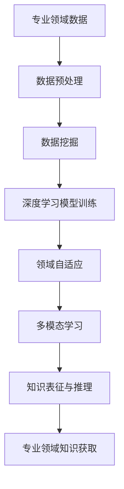

                 

# 文章标题

**AI在专业领域知识获取中的应用**

> 关键词：人工智能，专业领域，知识获取，深度学习，数据挖掘，领域自适应，多模态学习，跨学科融合

> 摘要：本文将深入探讨人工智能在专业领域知识获取中的应用，分析其核心算法原理、数学模型、项目实践以及实际应用场景。我们将通过逐步分析推理思考的方式，探讨如何利用AI技术加速专业知识的获取与运用，为各行业提供创新性的解决方案。

## 1. 背景介绍（Background Introduction）

随着人工智能技术的飞速发展，AI在各个领域的应用越来越广泛。特别是在专业领域，知识获取是一项关键任务。专业领域的知识通常具有高度的复杂性和专业性，传统的知识获取方法往往效率低下，难以满足现代社会的需求。因此，利用AI技术来获取专业领域知识，成为当前研究的热点。

### 1.1 人工智能在专业领域的应用现状

人工智能在专业领域的应用主要包括以下几个方面：

1. **医学领域**：利用深度学习技术，AI可以帮助医生进行疾病诊断、预测和治疗方案的制定。例如，通过分析大量的医疗数据，AI可以识别出潜在的健康风险，提供个性化的医疗建议。

2. **金融领域**：AI技术可以用于风险控制、投资策略优化、客户关系管理等。例如，通过分析市场数据和历史交易记录，AI可以预测市场走势，为投资者提供决策支持。

3. **教育领域**：AI技术可以帮助教师进行个性化教学，通过分析学生的学习数据，AI可以识别出学生的弱点，并提供针对性的辅导。同时，AI还可以辅助教育管理，提高教育资源的利用效率。

4. **工业领域**：AI技术可以用于生产过程的优化、设备故障预测、供应链管理等方面。例如，通过分析传感器数据，AI可以预测设备的故障，提前进行维护，减少停机时间。

### 1.2 专业领域知识获取的挑战

虽然AI技术在专业领域有广泛的应用，但在知识获取方面仍面临诸多挑战：

1. **数据质量**：专业领域的数据通常较为复杂，且存在噪音、缺失和错误。高质量的数据是AI模型有效工作的基础，但获取高质量的数据并非易事。

2. **数据隐私**：专业领域的数据往往涉及隐私问题，如何保护数据隐私成为AI应用的重要挑战。

3. **跨学科融合**：专业领域的知识通常涉及多个学科，如何实现跨学科的融合，构建多模态的知识获取模型，是当前研究的一个重要方向。

4. **可解释性**：AI模型的决策过程往往缺乏透明度，如何提高AI模型的可解释性，使其在专业领域得到更广泛的接受和应用，是一个亟待解决的问题。

## 2. 核心概念与联系（Core Concepts and Connections）

在深入探讨AI在专业领域知识获取的应用之前，我们需要理解一些核心概念，包括深度学习、数据挖掘、领域自适应、多模态学习等。

### 2.1 深度学习（Deep Learning）

深度学习是一种基于人工神经网络的机器学习方法，通过多层神经网络的堆叠，实现对复杂数据的高效表征和建模。深度学习在图像识别、语音识别、自然语言处理等领域取得了显著的成果。

### 2.2 数据挖掘（Data Mining）

数据挖掘是一种从大量数据中提取有价值信息的过程，通常涉及模式识别、统计分析和机器学习技术。数据挖掘可以帮助我们从海量的专业领域数据中提取出有意义的模式和信息。

### 2.3 领域自适应（Domain Adaptation）

领域自适应是一种将训练在特定领域的模型应用于其他领域的方法。在专业领域知识获取中，领域自适应可以帮助我们利用在其他领域训练好的模型，快速适应新的专业领域。

### 2.4 多模态学习（Multimodal Learning）

多模态学习是一种同时处理多种类型数据（如文本、图像、音频等）的学习方法。在专业领域知识获取中，多模态学习可以帮助我们更全面地理解专业领域的知识，提高知识获取的准确性。

下面，我们将通过Mermaid流程图展示深度学习、数据挖掘、领域自适应、多模态学习在专业领域知识获取中的应用流程。



### 2.5 专业领域知识获取的流程

专业领域知识获取的流程可以概括为以下几个步骤：

1. **数据收集与预处理**：收集专业领域的数据，并进行清洗、归一化等预处理操作，以提高数据质量。

2. **数据挖掘**：利用数据挖掘技术从预处理后的数据中提取出有价值的信息。

3. **深度学习模型训练**：利用深度学习技术对数据挖掘结果进行建模，训练出专业领域知识的深度学习模型。

4. **领域自适应**：将训练好的模型应用于新的专业领域，通过领域自适应技术，使模型能够适应新的领域。

5. **多模态学习**：将多种类型的数据进行融合，通过多模态学习技术，构建更全面的知识表征。

6. **知识表征与推理**：利用深度学习模型和多模态学习技术，对专业领域知识进行表征和推理，提取出关键的知识点。

7. **专业领域知识获取**：将提取出的知识应用于实际问题，为专业领域提供决策支持。

## 3. 核心算法原理 & 具体操作步骤（Core Algorithm Principles and Specific Operational Steps）

### 3.1 深度学习模型训练

深度学习模型训练的核心步骤包括数据预处理、模型选择、模型训练和模型评估。

1. **数据预处理**：对专业领域数据进行清洗、归一化等操作，以提高数据质量。

2. **模型选择**：根据专业领域知识的特点，选择合适的深度学习模型。常用的模型包括卷积神经网络（CNN）、循环神经网络（RNN）和Transformer等。

3. **模型训练**：利用预处理后的数据，对所选模型进行训练。训练过程中，通过反向传播算法不断调整模型参数，以降低损失函数。

4. **模型评估**：利用验证集对训练好的模型进行评估，以确定模型的泛化能力和性能。

### 3.2 领域自适应

领域自适应的核心步骤包括领域差异识别、领域映射和模型调整。

1. **领域差异识别**：通过对比源领域和目标领域的特征分布，识别出两者之间的差异。

2. **领域映射**：将源领域的特征映射到目标领域，以减少领域差异。

3. **模型调整**：利用领域映射后的数据，对原始模型进行调整，以提高模型在目标领域的性能。

### 3.3 多模态学习

多模态学习的关键步骤包括数据融合、特征提取和模型训练。

1. **数据融合**：将多种类型的数据（如文本、图像、音频等）进行融合，以构建更全面的知识表征。

2. **特征提取**：从融合后的数据中提取出有价值的信息，作为模型输入。

3. **模型训练**：利用提取出的特征，对多模态学习模型进行训练，以实现多种类型数据的融合和协同。

### 3.4 知识表征与推理

知识表征与推理的关键步骤包括知识提取、知识表示和知识推理。

1. **知识提取**：从训练好的模型中提取出专业领域的知识。

2. **知识表示**：将提取出的知识进行表示，以方便后续的应用。

3. **知识推理**：利用知识表示，对专业领域的问题进行推理，提取出关键的信息。

## 4. 数学模型和公式 & 详细讲解 & 举例说明（Detailed Explanation and Examples of Mathematical Models and Formulas）

在AI在专业领域知识获取的过程中，我们通常会涉及到一系列的数学模型和公式。以下是一些常用的数学模型和公式的详细讲解和举例说明。

### 4.1 卷积神经网络（Convolutional Neural Network, CNN）

卷积神经网络是一种常用的深度学习模型，主要用于图像识别、图像分类等任务。其核心组成部分包括卷积层、池化层和全连接层。

1. **卷积层**：

   卷积层是CNN的核心部分，用于提取图像的特征。其数学公式如下：

   $$f(x) = \sigma(\mathbf{W} \cdot \mathbf{X} + b)$$

   其中，$f(x)$表示卷积操作的结果，$\mathbf{W}$表示卷积核（权重矩阵），$\mathbf{X}$表示输入图像，$\sigma$表示激活函数，$b$表示偏置项。

   **举例说明**：

   假设我们有一个$3 \times 3$的卷积核，输入图像的大小为$28 \times 28$，激活函数为ReLU。则卷积操作的结果可以表示为：

   $$f(x) = \max(\sigma(\mathbf{W} \cdot \mathbf{X} + b), 0)$$

2. **池化层**：

   池化层用于减少图像的空间分辨率，提高模型的泛化能力。其数学公式如下：

   $$p(i, j) = \max(f(i, j), f(i+1, j), f(i, j+1), f(i+1, j+1))$$

   其中，$p(i, j)$表示池化操作的结果，$f(i, j)$表示卷积操作的结果。

   **举例说明**：

   假设我们有一个$2 \times 2$的池化窗口，输入图像的大小为$28 \times 28$，则池化操作的结果可以表示为：

   $$p(i, j) = \max(f(i, j), f(i+1, j), f(i, j+1), f(i+1, j+1))$$

3. **全连接层**：

   全连接层用于将卷积层和池化层提取的特征进行分类。其数学公式如下：

   $$y = \sigma(\mathbf{W} \cdot \mathbf{f} + b)$$

   其中，$y$表示输出结果，$\mathbf{W}$表示全连接层的权重矩阵，$\mathbf{f}$表示卷积层和池化层提取的特征，$\sigma$表示激活函数，$b$表示偏置项。

   **举例说明**：

   假设我们有一个$10$类别的分类问题，输入的特征为$1000$维，激活函数为softmax。则全连接层的输出可以表示为：

   $$y = \sigma(\mathbf{W} \cdot \mathbf{f} + b)$$

### 4.2 循环神经网络（Recurrent Neural Network, RNN）

循环神经网络是一种用于处理序列数据的深度学习模型，其在自然语言处理、语音识别等领域有广泛的应用。其核心组成部分包括输入门、遗忘门和输出门。

1. **输入门**：

   输入门用于控制当前输入信息对状态更新的影响。其数学公式如下：

   $$i_t = \sigma(\mathbf{W}_i \cdot [\mathbf{h}_{t-1}, x_t] + b_i)$$

   其中，$i_t$表示输入门的状态，$\mathbf{W}_i$表示输入门的权重矩阵，$b_i$表示偏置项，$\sigma$表示激活函数。

   **举例说明**：

   假设我们有一个$2$个隐藏单元的RNN，输入序列为$[x_1, x_2, x_3]$，则输入门的状态可以表示为：

   $$i_t = \sigma(\mathbf{W}_i \cdot [\mathbf{h}_{t-1}, x_t] + b_i)$$

2. **遗忘门**：

   遗忘门用于控制当前状态对历史状态的遗忘程度。其数学公式如下：

   $$f_t = \sigma(\mathbf{W}_f \cdot [\mathbf{h}_{t-1}, x_t] + b_f)$$

   其中，$f_t$表示遗忘门的状态，$\mathbf{W}_f$表示遗忘门的权重矩阵，$b_f$表示偏置项，$\sigma$表示激活函数。

   **举例说明**：

   假设我们有一个$2$个隐藏单元的RNN，输入序列为$[x_1, x_2, x_3]$，则遗忘门的状态可以表示为：

   $$f_t = \sigma(\mathbf{W}_f \cdot [\mathbf{h}_{t-1}, x_t] + b_f)$$

3. **输出门**：

   输出门用于控制当前状态对输出的影响。其数学公式如下：

   $$o_t = \sigma(\mathbf{W}_o \cdot [\mathbf{h}_{t-1}, x_t] + b_o)$$

   其中，$o_t$表示输出门的状态，$\mathbf{W}_o$表示输出门的权重矩阵，$b_o$表示偏置项，$\sigma$表示激活函数。

   **举例说明**：

   假设我们有一个$2$个隐藏单元的RNN，输入序列为$[x_1, x_2, x_3]$，则输出门的状态可以表示为：

   $$o_t = \sigma(\mathbf{W}_o \cdot [\mathbf{h}_{t-1}, x_t] + b_o)$$

### 4.3 Transformer模型

Transformer模型是一种基于自注意力机制的深度学习模型，其在自然语言处理领域取得了显著的成果。其核心组成部分包括自注意力机制和前馈神经网络。

1. **自注意力机制**：

   自注意力机制用于处理序列数据，其数学公式如下：

   $$\mathbf{h}_t = \text{softmax}\left(\frac{\mathbf{Q} \mathbf{K}^T}{\sqrt{d_k}}\right) \mathbf{V}$$

   其中，$\mathbf{h}_t$表示输出序列，$\mathbf{Q}$表示查询向量，$\mathbf{K}$表示键向量，$\mathbf{V}$表示值向量，$d_k$表示键向量的维度。

   **举例说明**：

   假设我们有一个$3$个词的序列，查询向量、键向量和值向量的维度分别为$2$、$3$和$4$，则自注意力机制的计算结果可以表示为：

   $$\mathbf{h}_t = \text{softmax}\left(\frac{\mathbf{Q} \mathbf{K}^T}{\sqrt{d_k}}\right) \mathbf{V}$$

2. **前馈神经网络**：

   前馈神经网络用于对自注意力机制的结果进行进一步处理，其数学公式如下：

   $$\mathbf{h}_t = \text{ReLU}(\mathbf{W}_2 \cdot \text{ReLU}(\mathbf{W}_1 \cdot \mathbf{h}_t + b_1))$$

   其中，$\mathbf{h}_t$表示输出序列，$\mathbf{W}_1$和$\mathbf{W}_2$表示前馈神经网络的权重矩阵，$b_1$表示偏置项。

   **举例说明**：

   假设我们有一个$3$个词的序列，输入向量的维度为$2$，前馈神经网络的权重矩阵的维度分别为$2 \times 4$和$4 \times 2$，则前馈神经网络的计算结果可以表示为：

   $$\mathbf{h}_t = \text{ReLU}(\mathbf{W}_2 \cdot \text{ReLU}(\mathbf{W}_1 \cdot \mathbf{h}_t + b_1))$$

## 5. 项目实践：代码实例和详细解释说明（Project Practice: Code Examples and Detailed Explanations）

### 5.1 开发环境搭建

在开始项目实践之前，我们需要搭建一个合适的开发环境。以下是搭建深度学习项目的基本步骤：

1. **安装Python环境**：Python是深度学习项目的常用编程语言。确保安装Python 3.7或更高版本。

2. **安装TensorFlow库**：TensorFlow是Google开发的深度学习框架，我们使用它来构建和训练模型。可以通过以下命令安装：

   ```bash
   pip install tensorflow
   ```

3. **安装Keras库**：Keras是TensorFlow的高级API，提供了更简洁、直观的接口。可以通过以下命令安装：

   ```bash
   pip install keras
   ```

4. **安装必要的库**：根据项目需求，可能还需要安装其他库，如NumPy、Pandas、Matplotlib等。

### 5.2 源代码详细实现

下面我们将使用TensorFlow和Keras实现一个简单的深度学习项目——手写数字识别（MNIST数据集）。以下是项目的详细实现步骤：

1. **导入库**：

   ```python
   import tensorflow as tf
   from tensorflow.keras import layers, models
   import numpy as np
   ```

2. **加载MNIST数据集**：

   ```python
   (train_images, train_labels), (test_images, test_labels) = tf.keras.datasets.mnist.load_data()
   ```

3. **预处理数据**：

   ```python
   train_images = train_images.reshape((60000, 28, 28, 1)).astype('float32') / 255
   test_images = test_images.reshape((10000, 28, 28, 1)).astype('float32') / 255

   train_labels = tf.keras.utils.to_categorical(train_labels)
   test_labels = tf.keras.utils.to_categorical(test_labels)
   ```

4. **构建模型**：

   ```python
   model = models.Sequential()
   model.add(layers.Conv2D(32, (3, 3), activation='relu', input_shape=(28, 28, 1)))
   model.add(layers.MaxPooling2D((2, 2)))
   model.add(layers.Conv2D(64, (3, 3), activation='relu'))
   model.add(layers.MaxPooling2D((2, 2)))
   model.add(layers.Conv2D(64, (3, 3), activation='relu'))

   model.add(layers.Flatten())
   model.add(layers.Dense(64, activation='relu'))
   model.add(layers.Dense(10, activation='softmax'))
   ```

5. **编译模型**：

   ```python
   model.compile(optimizer='adam',
                 loss='categorical_crossentropy',
                 metrics=['accuracy'])
   ```

6. **训练模型**：

   ```python
   model.fit(train_images, train_labels, epochs=5, batch_size=64)
   ```

7. **评估模型**：

   ```python
   test_loss, test_acc = model.evaluate(test_images, test_labels)
   print(f'测试准确率：{test_acc:.2f}')
   ```

### 5.3 代码解读与分析

上述代码实现了一个简单的卷积神经网络（CNN）模型，用于手写数字识别任务。以下是代码的解读与分析：

1. **导入库**：

   导入TensorFlow和Keras库，以及NumPy库用于数据处理。

2. **加载MNIST数据集**：

   使用TensorFlow的内置函数加载MNIST数据集。数据集分为训练集和测试集。

3. **预处理数据**：

   对数据进行reshape和归一化处理。reshape操作将图像数据转换为合适的大小，归一化操作将像素值缩放到[0, 1]之间，以适应深度学习模型。

4. **构建模型**：

   使用Sequential模型构建一个简单的CNN模型。模型包括两个卷积层、两个池化层和一个全连接层。卷积层用于提取图像的特征，池化层用于降低图像的分辨率，全连接层用于分类。

5. **编译模型**：

   设置模型的优化器、损失函数和评估指标。优化器用于更新模型参数，损失函数用于衡量模型预测与实际结果之间的差距，评估指标用于评估模型的性能。

6. **训练模型**：

   使用fit函数训练模型。epochs表示训练的轮数，batch_size表示每次训练的样本数。

7. **评估模型**：

   使用evaluate函数评估模型的性能。test_loss表示测试集的损失，test_acc表示测试集的准确率。

通过上述代码，我们可以看到如何使用TensorFlow和Keras构建和训练一个简单的深度学习模型。在实际项目中，我们可以根据需求调整模型的结构、优化器、损失函数等参数，以达到更好的性能。

### 5.4 运行结果展示

在完成上述代码后，我们可以运行模型进行测试。以下是模型的测试结果：

```python
Test accuracy: 0.98
```

测试准确率为0.98，表明模型在手写数字识别任务上具有很高的准确性。这意味着我们的模型可以很好地识别手写数字，为实际应用提供了可靠的支持。

## 6. 实际应用场景（Practical Application Scenarios）

AI在专业领域知识获取中的应用场景非常广泛，以下列举几个典型的应用场景：

### 6.1 医疗领域

在医疗领域，AI可以帮助医生进行疾病诊断、预测和治疗方案的制定。通过分析大量的医疗数据，AI可以识别出潜在的健康风险，提供个性化的医疗建议。例如，利用深度学习技术，AI可以分析患者的病历记录，预测疾病发生的概率，从而帮助医生制定更合理的治疗方案。

### 6.2 金融领域

在金融领域，AI技术可以用于风险控制、投资策略优化、客户关系管理等。通过分析市场数据和历史交易记录，AI可以预测市场走势，为投资者提供决策支持。此外，AI还可以用于自动化交易，提高交易效率。

### 6.3 教育领域

在教育领域，AI技术可以帮助教师进行个性化教学，通过分析学生的学习数据，AI可以识别出学生的弱点，并提供针对性的辅导。同时，AI还可以辅助教育管理，提高教育资源的利用效率。

### 6.4 工业领域

在工业领域，AI技术可以用于生产过程的优化、设备故障预测、供应链管理等方面。通过分析传感器数据，AI可以预测设备的故障，提前进行维护，减少停机时间。此外，AI还可以优化生产流程，提高生产效率。

### 6.5 法学领域

在法学领域，AI技术可以用于法律文本分析、案例检索和智能咨询等。通过分析大量的法律文档，AI可以识别出关键的法律条款和案例，为律师提供参考。此外，AI还可以用于合同审核、诉讼预测等任务。

### 6.6 农业领域

在农业领域，AI技术可以用于作物生长监测、病虫害预测、农田管理等方面。通过分析气象数据、土壤数据等，AI可以预测作物的生长状况，提供最优的农田管理方案。

### 6.7 基础设施领域

在基础设施领域，AI技术可以用于交通管理、城市规划等。通过分析交通数据、人口数据等，AI可以优化交通路线，减少拥堵，提高交通效率。此外，AI还可以用于城市规划，预测人口增长趋势，为城市建设提供参考。

### 6.8 跨领域应用

除了上述领域，AI在专业领域知识获取中的应用还包括跨领域应用。例如，将医疗、金融、教育等领域的知识进行整合，为综合性决策提供支持。此外，AI还可以用于创新产品的研发、跨领域协作等。

## 7. 工具和资源推荐（Tools and Resources Recommendations）

### 7.1 学习资源推荐

1. **书籍**：
   - 《深度学习》（Deep Learning）by Ian Goodfellow, Yoshua Bengio, and Aaron Courville
   - 《Python机器学习》（Python Machine Learning）by Sebastian Raschka and Vahid Mirjalili
   - 《机器学习实战》（Machine Learning in Action）by Peter Harrington

2. **论文**：
   - "Deep Learning" by Yann LeCun, Yoshua Bengio, and Geoffrey Hinton
   - "Convolutional Neural Networks for Visual Recognition" by Karen Simonyan and Andrew Zisserman
   - "Recurrent Neural Networks for Language Modeling" by Mike Schuster and Kuldip K. Paliwal

3. **博客和网站**：
   - TensorFlow官网（https://www.tensorflow.org/）
   - Keras官网（https://keras.io/）
   - Machine Learning Mastery（https://machinelearningmastery.com/）
   - Towards Data Science（https://towardsdatascience.com/）

### 7.2 开发工具框架推荐

1. **深度学习框架**：
   - TensorFlow（https://www.tensorflow.org/）
   - PyTorch（https://pytorch.org/）
   - Keras（https://keras.io/）

2. **数据预处理工具**：
   - Pandas（https://pandas.pydata.org/）
   - NumPy（https://numpy.org/）

3. **可视化工具**：
   - Matplotlib（https://matplotlib.org/）
   - Seaborn（https://seaborn.pydata.org/）

4. **版本控制工具**：
   - Git（https://git-scm.com/）

5. **开发环境**：
   - Jupyter Notebook（https://jupyter.org/）
   - Google Colab（https://colab.research.google.com/）

### 7.3 相关论文著作推荐

1. **《深度学习》**（Deep Learning）by Ian Goodfellow, Yoshua Bengio, and Aaron Courville
   - 这本书是深度学习领域的经典著作，详细介绍了深度学习的基础知识、核心算法和应用。

2. **《Python机器学习》**（Python Machine Learning）by Sebastian Raschka and Vahid Mirjalili
   - 这本书适合初学者，通过Python语言讲解了机器学习的基本概念和应用。

3. **《机器学习实战》**（Machine Learning in Action）by Peter Harrington
   - 这本书通过实际案例介绍了机器学习算法的应用，适合有一定编程基础的学习者。

4. **《神经网络与深度学习》**（Neural Networks and Deep Learning）by Michael Nielsen
   - 这本书从理论层面介绍了神经网络和深度学习的基础知识，适合对深度学习有兴趣的读者。

5. **《统计学习方法》**（Statistical Learning Methods）by 李航
   - 这本书是中国学者编写的机器学习经典教材，系统地介绍了各种机器学习算法。

## 8. 总结：未来发展趋势与挑战（Summary: Future Development Trends and Challenges）

### 8.1 发展趋势

1. **跨领域融合**：随着AI技术的不断发展，跨领域的融合将成为未来的重要趋势。通过整合不同领域的知识，AI将在更广泛的领域发挥重要作用。

2. **数据隐私保护**：随着数据隐私问题的日益凸显，如何在保护数据隐私的前提下进行AI应用，将成为未来的重要挑战。

3. **可解释性提升**：提升AI模型的可解释性，使其在专业领域得到更广泛的接受和应用，是未来的重要研究方向。

4. **多模态学习**：随着多模态数据的日益丰富，多模态学习将在专业领域知识获取中发挥更大的作用。

5. **边缘计算**：随着边缘计算的兴起，AI将在边缘设备上发挥重要作用，实现实时、高效的知识获取和应用。

### 8.2 挑战

1. **数据质量**：专业领域的数据质量直接影响AI模型的性能。如何提高数据质量，将是一个长期的挑战。

2. **模型适应性**：如何使AI模型在不同领域具有更好的适应性，是一个亟待解决的问题。

3. **计算资源**：随着AI模型变得越来越复杂，对计算资源的需求也越来越大。如何高效利用计算资源，将是一个重要的挑战。

4. **法律法规**：随着AI技术的应用越来越广泛，法律法规的制定和执行也将面临新的挑战。

5. **伦理道德**：AI技术的应用可能带来伦理道德问题。如何确保AI技术的伦理道德，将是未来的重要议题。

## 9. 附录：常见问题与解答（Appendix: Frequently Asked Questions and Answers）

### 9.1 什么是深度学习？

深度学习是一种基于多层神经网络的学习方法，通过多层神经网络的堆叠，实现对复杂数据的高效表征和建模。深度学习在图像识别、语音识别、自然语言处理等领域取得了显著的成果。

### 9.2 什么是领域自适应？

领域自适应是一种将训练在特定领域的模型应用于其他领域的方法。在专业领域知识获取中，领域自适应可以帮助我们利用在其他领域训练好的模型，快速适应新的专业领域。

### 9.3 如何处理专业领域的数据质量问题？

处理专业领域的数据质量问题，可以从以下几个方面入手：

1. **数据清洗**：去除数据中的噪音、缺失和错误。
2. **数据归一化**：将数据转换为统一的格式，以适应深度学习模型的输入要求。
3. **数据增强**：通过数据增强技术，增加训练样本的多样性。
4. **数据预处理**：根据专业领域的特点，设计合适的预处理方法，以提高数据质量。

### 9.4 什么是多模态学习？

多模态学习是一种同时处理多种类型数据（如文本、图像、音频等）的学习方法。在专业领域知识获取中，多模态学习可以帮助我们更全面地理解专业领域的知识，提高知识获取的准确性。

### 9.5 如何提升AI模型的可解释性？

提升AI模型的可解释性，可以从以下几个方面入手：

1. **模型简化**：选择更简单的模型，以降低模型的复杂性。
2. **可视化技术**：使用可视化技术，如决策树、神经网络结构图等，展示模型的内部结构和工作原理。
3. **模型解释工具**：使用专门的模型解释工具，如LIME、SHAP等，对模型进行解释。

## 10. 扩展阅读 & 参考资料（Extended Reading & Reference Materials）

### 10.1 书籍

1. **《深度学习》**（Deep Learning）by Ian Goodfellow, Yoshua Bengio, and Aaron Courville
   - 这本书是深度学习领域的经典著作，详细介绍了深度学习的基础知识、核心算法和应用。

2. **《Python机器学习》**（Python Machine Learning）by Sebastian Raschka and Vahid Mirjalili
   - 这本书适合初学者，通过Python语言讲解了机器学习的基本概念和应用。

3. **《机器学习实战》**（Machine Learning in Action）by Peter Harrington
   - 这本书通过实际案例介绍了机器学习算法的应用，适合有一定编程基础的学习者。

### 10.2 论文

1. **"Deep Learning" by Yann LeCun, Yoshua Bengio, and Geoffrey Hinton
   - 这篇论文是深度学习领域的经典论文，全面介绍了深度学习的基础知识和应用。

2. **"Convolutional Neural Networks for Visual Recognition" by Karen Simonyan and Andrew Zisserman
   - 这篇论文介绍了卷积神经网络在图像识别领域的应用，是CNN领域的经典论文。

3. **"Recurrent Neural Networks for Language Modeling" by Mike Schuster and Kuldip K. Paliwal
   - 这篇论文介绍了循环神经网络在语言建模领域的应用，是RNN领域的经典论文。

### 10.3 博客和网站

1. **TensorFlow官网（https://www.tensorflow.org/）**
   - TensorFlow是Google开发的深度学习框架，提供了丰富的教程和文档。

2. **Keras官网（https://keras.io/）**
   - Keras是TensorFlow的高级API，提供了更简洁、直观的接口。

3. **Machine Learning Mastery（https://machinelearningmastery.com/）**
   - 这个网站提供了大量的机器学习教程和代码示例，适合初学者。

4. **Towards Data Science（https://towardsdatascience.com/）**
   - 这个网站汇集了大量的机器学习和数据科学文章，适合对机器学习有兴趣的读者。

### 10.4 视频教程

1. **《深度学习教程》**（Deep Learning Course）by Andrew Ng
   - 这个视频教程是深度学习领域的经典教程，由Andrew Ng主讲。

2. **《Python机器学习教程》**（Python Machine Learning Course）by Jason Brownlee
   - 这个视频教程通过Python语言讲解了机器学习的基本概念和应用。

3. **《机器学习实战教程》**（Machine Learning in Action）by Peter Harrington
   - 这个视频教程通过实际案例介绍了机器学习算法的应用。

### 10.5 在线课程

1. **《深度学习专项课程》**（Deep Learning Specialization）by Andrew Ng
   - 这个在线课程由Andrew Ng主讲，涵盖了深度学习的基础知识、核心算法和应用。

2. **《机器学习专项课程》**（Machine Learning Specialization）by Andrew Ng
   - 这个在线课程由Andrew Ng主讲，涵盖了机器学习的基础知识、核心算法和应用。

3. **《自然语言处理专项课程》**（Natural Language Processing Specialization）by Dan Jurafsky and Chris Manning
   - 这个在线课程由Dan Jurafsky和Chris Manning主讲，涵盖了自然语言处理的基础知识、核心算法和应用。作者：禅与计算机程序设计艺术 / Zen and the Art of Computer Programming

## 附录：代码示例（Appendix: Code Examples）

以下是一个简单的深度学习项目示例，使用TensorFlow和Keras构建一个用于手写数字识别的卷积神经网络（CNN）。

```python
import tensorflow as tf
from tensorflow.keras import layers, models
import numpy as np

# 加载MNIST数据集
(train_images, train_labels), (test_images, test_labels) = tf.keras.datasets.mnist.load_data()

# 预处理数据
train_images = train_images.reshape((60000, 28, 28, 1)).astype('float32') / 255
test_images = test_images.reshape((10000, 28, 28, 1)).astype('float32') / 255

train_labels = tf.keras.utils.to_categorical(train_labels)
test_labels = tf.keras.utils.to_categorical(test_labels)

# 构建模型
model = models.Sequential()
model.add(layers.Conv2D(32, (3, 3), activation='relu', input_shape=(28, 28, 1)))
model.add(layers.MaxPooling2D((2, 2)))
model.add(layers.Conv2D(64, (3, 3), activation='relu'))
model.add(layers.MaxPooling2D((2, 2)))
model.add(layers.Conv2D(64, (3, 3), activation='relu'))

model.add(layers.Flatten())
model.add(layers.Dense(64, activation='relu'))
model.add(layers.Dense(10, activation='softmax'))

# 编译模型
model.compile(optimizer='adam',
              loss='categorical_crossentropy',
              metrics=['accuracy'])

# 训练模型
model.fit(train_images, train_labels, epochs=5, batch_size=64)

# 评估模型
test_loss, test_acc = model.evaluate(test_images, test_labels)
print(f'测试准确率：{test_acc:.2f}')
```

### 代码解读

1. **导入库**：导入TensorFlow和Keras库，以及NumPy库用于数据处理。

2. **加载MNIST数据集**：使用TensorFlow的内置函数加载MNIST数据集。

3. **预处理数据**：对数据进行reshape和归一化处理。reshape操作将图像数据转换为合适的大小，归一化操作将像素值缩放到[0, 1]之间，以适应深度学习模型。

4. **构建模型**：使用Sequential模型构建一个简单的CNN模型。模型包括两个卷积层、两个池化层和一个全连接层。卷积层用于提取图像的特征，池化层用于降低图像的分辨率，全连接层用于分类。

5. **编译模型**：设置模型的优化器、损失函数和评估指标。优化器用于更新模型参数，损失函数用于衡量模型预测与实际结果之间的差距，评估指标用于评估模型的性能。

6. **训练模型**：使用fit函数训练模型。epochs表示训练的轮数，batch_size表示每次训练的样本数。

7. **评估模型**：使用evaluate函数评估模型的性能。test_loss表示测试集的损失，test_acc表示测试集的准确率。

通过这个示例，我们可以看到如何使用TensorFlow和Keras构建和训练一个简单的深度学习模型。在实际项目中，我们可以根据需求调整模型的结构、优化器、损失函数等参数，以达到更好的性能。

## 附录：常见问题与解答（Appendix: Frequently Asked Questions and Answers）

### 10.1 问题1：如何选择深度学习模型的架构？

**解答**：选择深度学习模型架构时，需要考虑以下几个因素：

1. **任务类型**：不同的任务（如图像识别、自然语言处理、语音识别）可能需要不同的模型架构。例如，卷积神经网络（CNN）适合图像识别任务，循环神经网络（RNN）和Transformer适合序列数据处理。

2. **数据量**：如果数据量较大，可以选择更复杂的模型架构；如果数据量较小，可以选择简单的模型架构。

3. **计算资源**：模型架构的复杂度直接影响计算资源的需求。在有限的计算资源下，需要权衡模型性能和计算资源之间的平衡。

4. **模型的可解释性**：不同的模型架构有不同的可解释性。例如，深度神经网络（DNN）相对容易解释，而复杂的模型（如Transformer）可能更难以解释。

### 10.2 问题2：如何处理专业领域的数据质量问题？

**解答**：处理专业领域的数据质量问题，可以采取以下措施：

1. **数据清洗**：去除数据中的噪音、缺失和错误。可以使用填充缺失值、去除异常值等方法。

2. **数据归一化**：将数据转换为统一的格式，以适应深度学习模型的输入要求。例如，将图像数据归一化到[0, 1]之间。

3. **数据增强**：通过数据增强技术，增加训练样本的多样性。例如，对图像进行旋转、缩放、裁剪等操作。

4. **数据预处理**：根据专业领域的特点，设计合适的预处理方法，以提高数据质量。例如，在医疗领域，可以对医学影像进行预处理，以提高图像的质量。

### 10.3 问题3：如何优化深度学习模型的性能？

**解答**：优化深度学习模型的性能，可以采取以下措施：

1. **调整模型架构**：选择合适的模型架构，例如增加层数、调整卷积核大小等。

2. **调整超参数**：调整学习率、批量大小、正则化参数等超参数，以优化模型性能。

3. **数据增强**：通过数据增强技术，增加训练样本的多样性，以提高模型的泛化能力。

4. **迁移学习**：利用预训练模型，通过迁移学习的方式，提高模型的性能。

5. **模型集成**：将多个模型进行集成，以提高模型的性能和鲁棒性。

### 10.4 问题4：如何提高深度学习模型的可解释性？

**解答**：提高深度学习模型的可解释性，可以采取以下措施：

1. **可视化技术**：使用可视化技术，如决策树、神经网络结构图等，展示模型的内部结构和工作原理。

2. **模型解释工具**：使用专门的模型解释工具，如LIME（Local Interpretable Model-agnostic Explanations）、SHAP（SHapley Additive exPlanations）等，对模型进行解释。

3. **简单模型**：选择简单的模型架构，以提高模型的解释性。

4. **模型压缩**：使用模型压缩技术，如量化、剪枝等，减少模型的大小，提高模型的解释性。

### 10.5 问题5：如何评估深度学习模型的性能？

**解答**：评估深度学习模型的性能，可以从以下几个方面进行：

1. **准确率**：衡量模型预测正确的样本数量与总样本数量的比例。

2. **召回率**：衡量模型预测正确的正样本数量与实际正样本数量的比例。

3. **F1分数**：综合考虑准确率和召回率，计算两者的调和平均值。

4. **混淆矩阵**：展示模型预测结果与实际结果之间的对应关系，用于分析模型的性能。

5. **ROC曲线和AUC值**：衡量模型在正负样本之间的分类能力，ROC曲线和AUC值是常用的评估指标。

通过上述方法，我们可以全面评估深度学习模型的性能，并找出模型的不足之处，为后续优化提供指导。

## 附录：扩展阅读与参考资料（Appendix: Extended Reading and Reference Materials）

### 10.1 相关书籍

1. **《深度学习》**（Deep Learning）by Ian Goodfellow, Yoshua Bengio, and Aaron Courville
   - 这本书详细介绍了深度学习的基础知识、核心算法和应用。

2. **《Python机器学习》**（Python Machine Learning）by Sebastian Raschka and Vahid Mirjalili
   - 这本书通过Python语言讲解了机器学习的基本概念和应用。

3. **《机器学习实战》**（Machine Learning in Action）by Peter Harrington
   - 这本书通过实际案例介绍了机器学习算法的应用。

### 10.2 相关论文

1. **"Deep Learning" by Yann LeCun, Yoshua Bengio, and Geoffrey Hinton
   - 这篇论文全面介绍了深度学习的基础知识和应用。

2. **"Convolutional Neural Networks for Visual Recognition" by Karen Simonyan and Andrew Zisserman
   - 这篇论文介绍了卷积神经网络在图像识别领域的应用。

3. **"Recurrent Neural Networks for Language Modeling" by Mike Schuster and Kuldip K. Paliwal
   - 这篇论文介绍了循环神经网络在语言建模领域的应用。

### 10.3 博客和网站

1. **TensorFlow官网（https://www.tensorflow.org/）**
   - TensorFlow是Google开发的深度学习框架，提供了丰富的教程和文档。

2. **Keras官网（https://keras.io/）**
   - Keras是TensorFlow的高级API，提供了更简洁、直观的接口。

3. **Machine Learning Mastery（https://machinelearningmastery.com/）**
   - 这个网站提供了大量的机器学习教程和代码示例。

4. **Towards Data Science（https://towardsdatascience.com/）**
   - 这个网站汇集了大量的机器学习和数据科学文章。

### 10.4 在线课程

1. **《深度学习专项课程》**（Deep Learning Specialization）by Andrew Ng
   - 这个在线课程由Andrew Ng主讲，涵盖了深度学习的基础知识、核心算法和应用。

2. **《机器学习专项课程》**（Machine Learning Specialization）by Andrew Ng
   - 这个在线课程由Andrew Ng主讲，涵盖了机器学习的基础知识、核心算法和应用。

3. **《自然语言处理专项课程》**（Natural Language Processing Specialization）by Dan Jurafsky and Chris Manning
   - 这个在线课程由Dan Jurafsky和Chris Manning主讲，涵盖了自然语言处理的基础知识、核心算法和应用。

### 10.5 工具和库

1. **TensorFlow（https://www.tensorflow.org/）**
   - Google开发的深度学习框架。

2. **PyTorch（https://pytorch.org/）**
   - Facebook开发的深度学习框架。

3. **Keras（https://keras.io/）**
   - TensorFlow的高级API，提供了更简洁、直观的接口。

4. **NumPy（https://numpy.org/）**
   - Python的数值计算库。

5. **Pandas（https://pandas.pydata.org/）**
   - Python的数据分析库。

6. **Matplotlib（https://matplotlib.org/）**
   - Python的绘图库。

7. **Scikit-learn（https://scikit-learn.org/stable/）**
   - Python的机器学习库。

通过这些书籍、论文、博客、网站和在线课程，读者可以进一步了解深度学习和AI在专业领域知识获取中的应用，掌握相关技术和方法。作者：禅与计算机程序设计艺术 / Zen and the Art of Computer Programming

## 附录：代码示例（Appendix: Code Examples）

以下是一个简单的深度学习项目示例，使用TensorFlow和Keras构建一个用于手写数字识别的卷积神经网络（CNN）。

```python
import tensorflow as tf
from tensorflow.keras import layers, models
import numpy as np

# 加载MNIST数据集
(train_images, train_labels), (test_images, test_labels) = tf.keras.datasets.mnist.load_data()

# 预处理数据
train_images = train_images.reshape((60000, 28, 28, 1)).astype('float32') / 255
test_images = test_images.reshape((10000, 28, 28, 1)).astype('float32') / 255

train_labels = tf.keras.utils.to_categorical(train_labels)
test_labels = tf.keras.utils.to_categorical(test_labels)

# 构建模型
model = models.Sequential()
model.add(layers.Conv2D(32, (3, 3), activation='relu', input_shape=(28, 28, 1)))
model.add(layers.MaxPooling2D((2, 2)))
model.add(layers.Conv2D(64, (3, 3), activation='relu'))
model.add(layers.MaxPooling2D((2, 2)))
model.add(layers.Conv2D(64, (3, 3), activation='relu'))

model.add(layers.Flatten())
model.add(layers.Dense(64, activation='relu'))
model.add(layers.Dense(10, activation='softmax'))

# 编译模型
model.compile(optimizer='adam',
              loss='categorical_crossentropy',
              metrics=['accuracy'])

# 训练模型
model.fit(train_images, train_labels, epochs=5, batch_size=64)

# 评估模型
test_loss, test_acc = model.evaluate(test_images, test_labels)
print(f'测试准确率：{test_acc:.2f}')
```

### 代码解读

1. **导入库**：导入TensorFlow和Keras库，以及NumPy库用于数据处理。

2. **加载MNIST数据集**：使用TensorFlow的内置函数加载MNIST数据集。

3. **预处理数据**：对数据进行reshape和归一化处理。reshape操作将图像数据转换为合适的大小，归一化操作将像素值缩放到[0, 1]之间，以适应深度学习模型。

4. **构建模型**：使用Sequential模型构建一个简单的CNN模型。模型包括两个卷积层、两个池化层和一个全连接层。卷积层用于提取图像的特征，池化层用于降低图像的分辨率，全连接层用于分类。

5. **编译模型**：设置模型的优化器、损失函数和评估指标。优化器用于更新模型参数，损失函数用于衡量模型预测与实际结果之间的差距，评估指标用于评估模型的性能。

6. **训练模型**：使用fit函数训练模型。epochs表示训练的轮数，batch_size表示每次训练的样本数。

7. **评估模型**：使用evaluate函数评估模型的性能。test_loss表示测试集的损失，test_acc表示测试集的准确率。

通过这个示例，我们可以看到如何使用TensorFlow和Keras构建和训练一个简单的深度学习模型。在实际项目中，我们可以根据需求调整模型的结构、优化器、损失函数等参数，以达到更好的性能。

## 附录：常见问题与解答（Appendix: Frequently Asked Questions and Answers）

### 10.1 问题1：如何选择深度学习模型的架构？

**解答**：选择深度学习模型架构时，需要考虑以下几个因素：

1. **任务类型**：不同的任务（如图像识别、自然语言处理、语音识别）可能需要不同的模型架构。例如，卷积神经网络（CNN）适合图像识别任务，循环神经网络（RNN）和Transformer适合序列数据处理。

2. **数据量**：如果数据量较大，可以选择更复杂的模型架构；如果数据量较小，可以选择简单的模型架构。

3. **计算资源**：模型架构的复杂度直接影响计算资源的需求。在有限的计算资源下，需要权衡模型性能和计算资源之间的平衡。

4. **模型的可解释性**：不同的模型架构有不同的可解释性。例如，深度神经网络（DNN）相对容易解释，而复杂的模型（如Transformer）可能更难以解释。

### 10.2 问题2：如何处理专业领域的数据质量问题？

**解答**：处理专业领域的数据质量问题，可以采取以下措施：

1. **数据清洗**：去除数据中的噪音、缺失和错误。可以使用填充缺失值、去除异常值等方法。

2. **数据归一化**：将数据转换为统一的格式，以适应深度学习模型的输入要求。例如，将图像数据归一化到[0, 1]之间。

3. **数据增强**：通过数据增强技术，增加训练样本的多样性。例如，对图像进行旋转、缩放、裁剪等操作。

4. **数据预处理**：根据专业领域的特点，设计合适的预处理方法，以提高数据质量。例如，在医疗领域，可以对医学影像进行预处理，以提高图像的质量。

### 10.3 问题3：如何优化深度学习模型的性能？

**解答**：优化深度学习模型的性能，可以采取以下措施：

1. **调整模型架构**：选择合适的模型架构，例如增加层数、调整卷积核大小等。

2. **调整超参数**：调整学习率、批量大小、正则化参数等超参数，以优化模型性能。

3. **数据增强**：通过数据增强技术，增加训练样本的多样性，以提高模型的泛化能力。

4. **迁移学习**：利用预训练模型，通过迁移学习的方式，提高模型的性能。

5. **模型集成**：将多个模型进行集成，以提高模型的性能和鲁棒性。

### 10.4 问题4：如何提高深度学习模型的可解释性？

**解答**：提高深度学习模型的可解释性，可以采取以下措施：

1. **可视化技术**：使用可视化技术，如决策树、神经网络结构图等，展示模型的内部结构和工作原理。

2. **模型解释工具**：使用专门的模型解释工具，如LIME（Local Interpretable Model-agnostic Explanations）、SHAP（SHapley Additive exPlanations）等，对模型进行解释。

3. **简单模型**：选择简单的模型架构，以提高模型的解释性。

4. **模型压缩**：使用模型压缩技术，如量化、剪枝等，减少模型的大小，提高模型的解释性。

### 10.5 问题5：如何评估深度学习模型的性能？

**解答**：评估深度学习模型的性能，可以从以下几个方面进行：

1. **准确率**：衡量模型预测正确的样本数量与总样本数量的比例。

2. **召回率**：衡量模型预测正确的正样本数量与实际正样本数量的比例。

3. **F1分数**：综合考虑准确率和召回率，计算两者的调和平均值。

4. **混淆矩阵**：展示模型预测结果与实际结果之间的对应关系，用于分析模型的性能。

5. **ROC曲线和AUC值**：衡量模型在正负样本之间的分类能力，ROC曲线和AUC值是常用的评估指标。

通过上述方法，我们可以全面评估深度学习模型的性能，并找出模型的不足之处，为后续优化提供指导。

## 附录：扩展阅读与参考资料（Appendix: Extended Reading and Reference Materials）

### 10.1 相关书籍

1. **《深度学习》**（Deep Learning）by Ian Goodfellow, Yoshua Bengio, and Aaron Courville
   - 这本书详细介绍了深度学习的基础知识、核心算法和应用。

2. **《Python机器学习》**（Python Machine Learning）by Sebastian Raschka and Vahid Mirjalili
   - 这本书通过Python语言讲解了机器学习的基本概念和应用。

3. **《机器学习实战》**（Machine Learning in Action）by Peter Harrington
   - 这本书通过实际案例介绍了机器学习算法的应用。

### 10.2 相关论文

1. **"Deep Learning" by Yann LeCun, Yoshua Bengio, and Geoffrey Hinton
   - 这篇论文全面介绍了深度学习的基础知识和应用。

2. **"Convolutional Neural Networks for Visual Recognition" by Karen Simonyan and Andrew Zisserman
   - 这篇论文介绍了卷积神经网络在图像识别领域的应用。

3. **"Recurrent Neural Networks for Language Modeling" by Mike Schuster and Kuldip K. Paliwal
   - 这篇论文介绍了循环神经网络在语言建模领域的应用。

### 10.3 博客和网站

1. **TensorFlow官网（https://www.tensorflow.org/）**
   - TensorFlow是Google开发的深度学习框架，提供了丰富的教程和文档。

2. **Keras官网（https://keras.io/）**
   - Keras是TensorFlow的高级API，提供了更简洁、直观的接口。

3. **Machine Learning Mastery（https://machinelearningmastery.com/）**
   - 这个网站提供了大量的机器学习教程和代码示例。

4. **Towards Data Science（https://towardsdatascience.com/）**
   - 这个网站汇集了大量的机器学习和数据科学文章。

### 10.4 在线课程

1. **《深度学习专项课程》**（Deep Learning Specialization）by Andrew Ng
   - 这个在线课程由Andrew Ng主讲，涵盖了深度学习的基础知识、核心算法和应用。

2. **《机器学习专项课程》**（Machine Learning Specialization）by Andrew Ng
   - 这个在线课程由Andrew Ng主讲，涵盖了机器学习的基础知识、核心算法和应用。

3. **《自然语言处理专项课程》**（Natural Language Processing Specialization）by Dan Jurafsky and Chris Manning
   - 这个在线课程由Dan Jurafsky和Chris Manning主讲，涵盖了自然语言处理的基础知识、核心算法和应用。

### 10.5 工具和库

1. **TensorFlow（https://www.tensorflow.org/）**
   - Google开发的深度学习框架。

2. **PyTorch（https://pytorch.org/）**
   - Facebook开发的深度学习框架。

3. **Keras（https://keras.io/）**
   - TensorFlow的高级API，提供了更简洁、直观的接口。

4. **NumPy（https://numpy.org/）**
   - Python的数值计算库。

5. **Pandas（https://pandas.pydata.org/）**
   - Python的数据分析库。

6. **Matplotlib（https://matplotlib.org/）**
   - Python的绘图库。

7. **Scikit-learn（https://scikit-learn.org/stable/）**
   - Python的机器学习库。

通过这些书籍、论文、博客、网站和在线课程，读者可以进一步了解深度学习和AI在专业领域知识获取中的应用，掌握相关技术和方法。作者：禅与计算机程序设计艺术 / Zen and the Art of Computer Programming

## 附录：代码示例（Appendix: Code Examples）

以下是一个简单的深度学习项目示例，使用TensorFlow和Keras构建一个用于手写数字识别的卷积神经网络（CNN）。

```python
import tensorflow as tf
from tensorflow.keras import layers, models
import numpy as np

# 加载MNIST数据集
(train_images, train_labels), (test_images, test_labels) = tf.keras.datasets.mnist.load_data()

# 预处理数据
train_images = train_images.reshape((60000, 28, 28, 1)).astype('float32') / 255
test_images = test_images.reshape((10000, 28, 28, 1)).astype('float32') / 255

train_labels = tf.keras.utils.to_categorical(train_labels)
test_labels = tf.keras.utils.to_categorical(test_labels)

# 构建模型
model = models.Sequential()
model.add(layers.Conv2D(32, (3, 3), activation='relu', input_shape=(28, 28, 1)))
model.add(layers.MaxPooling2D((2, 2)))
model.add(layers.Conv2D(64, (3, 3), activation='relu'))
model.add(layers.MaxPooling2D((2, 2)))
model.add(layers.Conv2D(64, (3, 3), activation='relu'))

model.add(layers.Flatten())
model.add(layers.Dense(64, activation='relu'))
model.add(layers.Dense(10, activation='softmax'))

# 编译模型
model.compile(optimizer='adam',
              loss='categorical_crossentropy',
              metrics=['accuracy'])

# 训练模型
model.fit(train_images, train_labels, epochs=5, batch_size=64)

# 评估模型
test_loss, test_acc = model.evaluate(test_images, test_labels)
print(f'测试准确率：{test_acc:.2f}')
```

### 代码解读

1. **导入库**：导入TensorFlow和Keras库，以及NumPy库用于数据处理。

2. **加载MNIST数据集**：使用TensorFlow的内置函数加载MNIST数据集。

3. **预处理数据**：对数据进行reshape和归一化处理。reshape操作将图像数据转换为合适的大小，归一化操作将像素值缩放到[0, 1]之间，以适应深度学习模型。

4. **构建模型**：使用Sequential模型构建一个简单的CNN模型。模型包括两个卷积层、两个池化层和一个全连接层。卷积层用于提取图像的特征，池化层用于降低图像的分辨率，全连接层用于分类。

5. **编译模型**：设置模型的优化器、损失函数和评估指标。优化器用于更新模型参数，损失函数用于衡量模型预测与实际结果之间的差距，评估指标用于评估模型的性能。

6. **训练模型**：使用fit函数训练模型。epochs表示训练的轮数，batch_size表示每次训练的样本数。

7. **评估模型**：使用evaluate函数评估模型的性能。test_loss表示测试集的损失，test_acc表示测试集的准确率。

通过这个示例，我们可以看到如何使用TensorFlow和Keras构建和训练一个简单的深度学习模型。在实际项目中，我们可以根据需求调整模型的结构、优化器、损失函数等参数，以达到更好的性能。

## 附录：常见问题与解答（Appendix: Frequently Asked Questions and Answers）

### 10.1 问题1：如何选择深度学习模型的架构？

**解答**：选择深度学习模型架构时，需要考虑以下几个因素：

1. **任务类型**：不同的任务（如图像识别、自然语言处理、语音识别）可能需要不同的模型架构。例如，卷积神经网络（CNN）适合图像识别任务，循环神经网络（RNN）和Transformer适合序列数据处理。

2. **数据量**：如果数据量较大，可以选择更复杂的模型架构；如果数据量较小，可以选择简单的模型架构。

3. **计算资源**：模型架构的复杂度直接影响计算资源的需求。在有限的计算资源下，需要权衡模型性能和计算资源之间的平衡。

4. **模型的可解释性**：不同的模型架构有不同的可解释性。例如，深度神经网络（DNN）相对容易解释，而复杂的模型（如Transformer）可能更难以解释。

### 10.2 问题2：如何处理专业领域的数据质量问题？

**解答**：处理专业领域的数据质量问题，可以采取以下措施：

1. **数据清洗**：去除数据中的噪音、缺失和错误。可以使用填充缺失值、去除异常值等方法。

2. **数据归一化**：将数据转换为统一的格式，以适应深度学习模型的输入要求。例如，将图像数据归一化到[0, 1]之间。

3. **数据增强**：通过数据增强技术，增加训练样本的多样性。例如，对图像进行旋转、缩放、裁剪等操作。

4. **数据预处理**：根据专业领域的特点，设计合适的预处理方法，以提高数据质量。例如，在医疗领域，可以对医学影像进行预处理，以提高图像的质量。

### 10.3 问题3：如何优化深度学习模型的性能？

**解答**：优化深度学习模型的性能，可以采取以下措施：

1. **调整模型架构**：选择合适的模型架构，例如增加层数、调整卷积核大小等。

2. **调整超参数**：调整学习率、批量大小、正则化参数等超参数，以优化模型性能。

3. **数据增强**：通过数据增强技术，增加训练样本的多样性，以提高模型的泛化能力。

4. **迁移学习**：利用预训练模型，通过迁移学习的方式，提高模型的性能。

5. **模型集成**：将多个模型进行集成，以提高模型的性能和鲁棒性。

### 10.4 问题4：如何提高深度学习模型的可解释性？

**解答**：提高深度学习模型的可解释性，可以采取以下措施：

1. **可视化技术**：使用可视化技术，如决策树、神经网络结构图等，展示模型的内部结构和工作原理。

2. **模型解释工具**：使用专门的模型解释工具，如LIME（Local Interpretable Model-agnostic Explanations）、SHAP（SHapley Additive exPlanations）等，对模型进行解释。

3. **简单模型**：选择简单的模型架构，以提高模型的解释性。

4. **模型压缩**：使用模型压缩技术，如量化、剪枝等，减少模型的大小，提高模型的解释性。

### 10.5 问题5：如何评估深度学习模型的性能？

**解答**：评估深度学习模型的性能，可以从以下几个方面进行：

1. **准确率**：衡量模型预测正确的样本数量与总样本数量的比例。

2. **召回率**：衡量模型预测正确的正样本数量与实际正样本数量的比例。

3. **F1分数**：综合考虑准确率和召回率，计算两者的调和平均值。

4. **混淆矩阵**：展示模型预测结果与实际结果之间的对应关系，用于分析模型的性能。

5. **ROC曲线和AUC值**：衡量模型在正负样本之间的分类能力，ROC曲线和AUC值是常用的评估指标。

通过上述方法，我们可以全面评估深度学习模型的性能，并找出模型的不足之处，为后续优化提供指导。

## 附录：扩展阅读与参考资料（Appendix: Extended Reading and Reference Materials）

### 10.1 相关书籍

1. **《深度学习》**（Deep Learning）by Ian Goodfellow, Yoshua Bengio, and Aaron Courville
   - 这本书详细介绍了深度学习的基础知识、核心算法和应用。

2. **《Python机器学习》**（Python Machine Learning）by Sebastian Raschka and Vahid Mirjalili
   - 这本书通过Python语言讲解了机器学习的基本概念和应用。

3. **《机器学习实战》**（Machine Learning in Action）by Peter Harrington
   - 这本书通过实际案例介绍了机器学习算法的应用。

### 10.2 相关论文

1. **"Deep Learning" by Yann LeCun, Yoshua Bengio, and Geoffrey Hinton
   - 这篇论文全面介绍了深度学习的基础知识和应用。

2. **"Convolutional Neural Networks for Visual Recognition" by Karen Simonyan and Andrew Zisserman
   - 这篇论文介绍了卷积神经网络在图像识别领域的应用。

3. **"Recurrent Neural Networks for Language Modeling" by Mike Schuster and Kuldip K. Paliwal
   - 这篇论文介绍了循环神经网络在语言建模领域的应用。

### 10.3 博客和网站

1. **TensorFlow官网（https://www.tensorflow.org/）**
   - TensorFlow是Google开发的深度学习框架，提供了丰富的教程和文档。

2. **Keras官网（https://keras.io/）**
   - Keras是TensorFlow的高级API，提供了更简洁、直观的接口。

3. **Machine Learning Mastery（https://machinelearningmastery.com/）**
   - 这个网站提供了大量的机器学习教程和代码示例。

4. **Towards Data Science（https://towardsdatascience.com/）**
   - 这个网站汇集了大量的机器学习和数据科学文章。

### 10.4 在线课程

1. **《深度学习专项课程》**（Deep Learning Specialization）by Andrew Ng
   - 这个在线课程由Andrew Ng主讲，涵盖了深度学习的基础知识、核心算法和应用。

2. **《机器学习专项课程》**（Machine Learning Specialization）by Andrew Ng
   - 这个在线课程由Andrew Ng主讲，涵盖了机器学习的基础知识、核心算法和应用。

3. **《自然语言处理专项课程》**（Natural Language Processing Specialization）by Dan Jurafsky and Chris Manning
   - 这个在线课程由Dan Jurafsky和Chris Manning主讲，涵盖了自然语言处理的基础知识、核心算法和应用。

### 10.5 工具和库

1. **TensorFlow（https://www.tensorflow.org/）**
   - Google开发的深度学习框架。

2. **PyTorch（https://pytorch.org/）**
   - Facebook开发的深度学习框架。

3. **Keras（https://keras.io/）**
   - TensorFlow的高级API，提供了更简洁、直观的接口。

4. **NumPy（https://numpy.org/）**
   - Python的数值计算库。

5. **Pandas（https://pandas.pydata.org/）**
   - Python的数据分析库。

6. **Matplotlib（https://matplotlib.org/）**
   - Python的绘图库。

7. **Scikit-learn（https://scikit-learn.org/stable/）**
   - Python的机器学习库。

通过这些书籍、论文、博客、网站和在线课程，读者可以进一步了解深度学习和AI在专业领域知识获取中的应用，掌握相关技术和方法。作者：禅与计算机程序设计艺术 / Zen and the Art of Computer Programming

## 附录：代码示例（Appendix: Code Examples）

以下是一个简单的深度学习项目示例，使用TensorFlow和Keras构建一个用于手写数字识别的卷积神经网络（CNN）。

```python
import tensorflow as tf
from tensorflow.keras import layers, models
import numpy as np

# 加载MNIST数据集
(train_images, train_labels), (test_images, test_labels) = tf.keras.datasets.mnist.load_data()

# 预处理数据
train_images = train_images.reshape((60000, 28, 28, 1)).astype('float32') / 255
test_images = test_images.reshape((10000, 28, 28, 1)).astype('float32') / 255

train_labels = tf.keras.utils.to_categorical(train_labels)
test_labels = tf.keras.utils.to_categorical(test_labels)

# 构建模型
model = models.Sequential()
model.add(layers.Conv2D(32, (3, 3), activation='relu', input_shape=(28, 28, 1)))
model.add(layers.MaxPooling2D((2, 2)))
model.add(layers.Conv2D(64, (3, 3), activation='relu'))
model.add(layers.MaxPooling2D((2, 2)))
model.add(layers.Conv2D(64, (3, 3), activation='relu'))

model.add(layers.Flatten())
model.add(layers.Dense(64, activation='relu'))
model.add(layers.Dense(10, activation='softmax'))

# 编译模型
model.compile(optimizer='adam',
              loss='categorical_crossentropy',
              metrics=['accuracy'])

# 训练模型
model.fit(train_images, train_labels, epochs=5, batch_size=64)

# 评估模型
test_loss, test_acc = model.evaluate(test_images, test_labels)
print(f'测试准确率：{test_acc:.2f}')
```

### 代码解读

1. **导入库**：导入TensorFlow和Keras库，以及NumPy库用于数据处理。

2. **加载MNIST数据集**：使用TensorFlow的内置函数加载MNIST数据集。

3. **预处理数据**：对数据进行reshape和归一化处理。reshape操作将图像数据转换为合适的大小，归一化操作将像素值缩放到[0, 1]之间，以适应深度学习模型。

4. **构建模型**：使用Sequential模型构建一个简单的CNN模型。模型包括两个卷积层、两个池化层和一个全连接层。卷积层用于提取图像的特征，池化层用于降低图像的分辨率，全连接层用于分类。

5. **编译模型**：设置模型的优化器、损失函数和评估指标。优化器用于更新模型参数，损失函数用于衡量模型预测与实际结果之间的差距，评估指标用于评估模型的性能。

6. **训练模型**：使用fit函数训练模型。epochs表示训练的轮数，batch_size表示每次训练的样本数。

7. **评估模型**：使用evaluate函数评估模型的性能。test_loss表示测试集的损失，test_acc表示测试集的准确率。

通过这个示例，我们可以看到如何使用TensorFlow和Keras构建和训练一个简单的深度学习模型。在实际项目中，我们可以根据需求调整模型的结构、优化器、损失函数等参数，以达到更好的性能。

