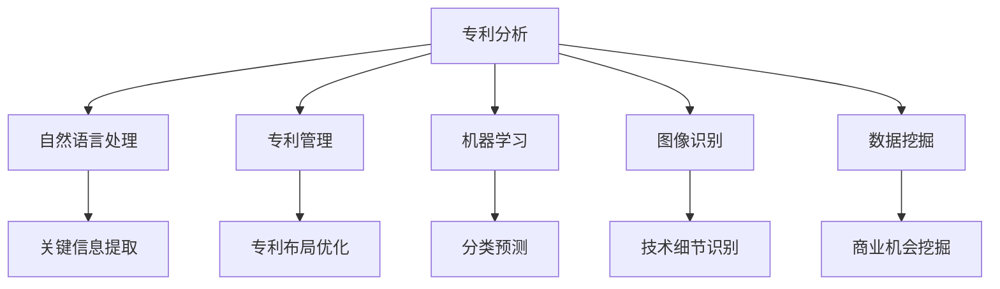

                 

### 背景介绍

人工智能（AI）在过去的几十年里经历了飞速的发展，从最初的规则驱动系统到现在的深度学习、强化学习等复杂算法，AI已经逐渐渗透到我们生活的各个领域，从医疗诊断、金融分析到自动驾驶、智能家居，都展现出了巨大的潜力。然而，在众多应用场景中，AI在专利分析与管理中的作用不容忽视。

专利分析是评估一项专利技术价值的重要手段，它涉及到对专利申请文件、发明内容、法律状态等多方面的综合考量。在传统专利分析中，主要依赖于人工阅读和整理大量的专利文献，这不仅费时费力，而且容易产生人为误差。随着AI技术的发展，特别是在自然语言处理（NLP）、机器学习和图像识别等领域的突破，AI开始被广泛应用于专利分析中，提高了分析的准确性和效率。

专利管理是企业在研发和创新过程中必不可少的一环，它涉及到对专利申请、审批、维权、许可等环节的管理。有效的专利管理可以帮助企业优化创新资源，维护自身知识产权，提升市场竞争力。然而，专利管理过程中涉及的数据量庞大，管理流程复杂，需要高效的工具和方法来支持。AI在专利管理中的应用，为这些挑战提供了解决方案。

本文旨在探讨AI在专利分析与管理中的作用，通过介绍相关核心概念、算法原理、实际应用场景和工具资源，帮助读者了解AI如何提升专利分析的效率和准确性，以及如何优化专利管理流程。

在接下来的章节中，我们将首先介绍与AI专利分析和管理相关的基本概念和关键技术，然后深入探讨核心算法的原理和操作步骤，通过具体案例展示AI在实际专利分析中的应用效果，并分析AI在专利管理中的潜在影响。最后，我们将总结AI在专利分析与管理中的发展趋势和面临的挑战，为读者提供有价值的参考。

### 核心概念与联系

为了深入理解AI在专利分析与管理中的作用，我们首先需要明确一些核心概念和它们之间的关系。以下是对这些概念及其相互联系的具体描述：

**1. 专利分析（Patent Analysis）：**
专利分析是指通过研究专利数据，评估一项专利技术、法律状态或市场价值的过程。它涉及到对专利申请文件、权利要求、发明描述、法律状态等的解读和分析。传统的专利分析主要依赖于人工阅读和理解专利文件，而AI技术，如自然语言处理（NLP）和机器学习，可以帮助自动化这一过程，提高分析的准确性和效率。

**2. 专利管理（Patent Management）：**
专利管理是指对专利申请、审批、维权、许可等环节进行系统化、规范化的管理。专利管理涉及到对大量专利数据的高效处理，以支持企业的研发决策和市场战略。AI在专利管理中的应用，可以帮助企业优化专利布局，减少专利纠纷，提高专利维护的效率。

**3. 自然语言处理（NLP）：**
自然语言处理是AI的一个子领域，主要研究如何使计算机能够理解、生成和处理人类语言。在专利分析中，NLP技术可以用于自动提取专利文件中的关键信息，如技术领域、权利要求、发明描述等，从而帮助分析人员快速获取专利的核心内容。

**4. 机器学习（Machine Learning）：**
机器学习是AI的核心组成部分，通过算法让计算机从数据中学习并做出预测或决策。在专利分析中，机器学习算法可以用于分类、聚类、预测等任务，如将专利分为不同技术领域，预测专利的法律状态，评估专利的潜在价值等。

**5. 图像识别（Image Recognition）：**
图像识别是AI在计算机视觉领域的应用，通过算法让计算机能够识别和分类图像中的物体。在专利分析中，图像识别技术可以用于分析专利文件中的附图，识别出关键的技术细节，提高专利分析的准确性。

**6. 数据挖掘（Data Mining）：**
数据挖掘是从大量数据中提取有价值信息的过程。在专利分析中，数据挖掘技术可以用于发现潜在的商业机会、技术趋势和竞争对手情报，帮助企业做出更加明智的决策。

**核心概念原理和架构的 Mermaid 流程图（以下为示例）：**



通过上述核心概念和它们之间的联系，我们可以看到AI技术在专利分析和管理中的综合应用。以下是对每个核心概念的具体解释和它们在专利分析和管理中的实际应用：

- **自然语言处理（NLP）：** NLP技术可以自动提取专利文件中的关键信息，如技术领域、权利要求和发明描述。通过使用词向量模型（如Word2Vec、BERT）和实体识别算法（如Named Entity Recognition, NER），NLP技术能够高效地处理和理解专利文件中的自然语言，从而帮助分析人员快速获取专利的核心内容。

- **机器学习（Machine Learning）：** 机器学习算法可以用于对专利进行分类、聚类和预测。例如，可以使用分类算法（如决策树、随机森林）将专利分为不同的技术领域，使用聚类算法（如K-means、DBSCAN）发现技术趋势，使用回归算法（如线性回归、逻辑回归）预测专利的法律状态或潜在价值。

- **图像识别（Image Recognition）：** 在专利分析中，图像识别技术可以用于分析专利文件中的附图，识别出关键的技术细节。通过深度学习模型（如卷积神经网络，CNN），图像识别技术可以自动检测附图中的技术部件、功能模块等，从而辅助专利分析。

- **数据挖掘（Data Mining）：** 数据挖掘技术可以用于从大量专利数据中提取有价值的信息，如商业机会、技术趋势和竞争对手情报。通过关联分析、聚类分析、关联规则挖掘等算法，数据挖掘技术可以帮助企业发现潜在的商业机会，优化专利布局，制定有效的市场策略。

通过上述核心概念和它们在专利分析和管理中的应用，我们可以看到AI技术如何通过自动化和智能化手段，提高专利分析的效率和准确性，优化专利管理流程，从而帮助企业在激烈的市场竞争中保持领先地位。

### 核心算法原理 & 具体操作步骤

在理解了AI在专利分析与管理中的基本概念和联系之后，接下来我们将深入探讨核心算法的原理和具体操作步骤。这些算法包括自然语言处理（NLP）中的文本分类、机器学习中的分类和聚类，以及数据挖掘中的关联规则挖掘等。以下将详细介绍这些算法的工作原理和具体应用步骤。

#### 1. 自然语言处理中的文本分类

文本分类（Text Classification）是NLP中的一个重要任务，用于将文本数据自动分配到不同的类别中。在专利分析中，文本分类可以用于将专利文本分类到特定的技术领域，从而快速识别出相关的专利信息。

**算法原理：**
文本分类通常基于机器学习模型，如朴素贝叶斯（Naive Bayes）、支持向量机（SVM）、神经网络（Neural Networks）等。其中，朴素贝叶斯模型基于贝叶斯定理和特征条件独立假设，是一种简单而有效的文本分类方法。支持向量机通过寻找最优的超平面，将不同类别的文本数据分开。神经网络则通过多层感知器（MLP）等结构，模拟人脑神经元的工作方式，进行复杂的非线性分类。

**具体操作步骤：**

1. **数据准备：** 收集大量的专利文本数据，并进行预处理，包括去除停用词、进行词干提取、词性标注等，以得到干净的文本数据。

2. **特征提取：** 将预处理后的文本数据转换为数值特征向量。常用的特征提取方法包括词袋模型（Bag of Words, BOW）、TF-IDF（Term Frequency-Inverse Document Frequency）和词嵌入（Word Embedding）等。

3. **模型训练：** 使用预处理后的数据，通过机器学习算法训练分类模型。例如，可以使用朴素贝叶斯、支持向量机或神经网络等算法。

4. **模型评估：** 通过交叉验证（Cross-Validation）等方法，评估分类模型的准确率、召回率、F1值等指标，选择最优模型。

5. **分类应用：** 将训练好的模型应用于新的专利文本数据，进行自动分类，从而快速识别相关专利信息。

#### 2. 机器学习中的分类和聚类

分类（Classification）和聚类（Clustering）是机器学习中的两个重要任务，分别用于将数据分配到不同的类别和发现数据的自然分组。

**分类算法：**

1. **决策树（Decision Tree）：** 通过一系列的判断条件，将数据逐步划分到不同的类别。决策树的每个节点代表一个特征，每个分支代表一个决策。

2. **随机森林（Random Forest）：** 随机森林是一种集成学习方法，通过构建多个决策树，并取它们的多数投票结果，提高分类的准确性和鲁棒性。

**聚类算法：**

1. **K-means算法：** K-means是一种基于距离的聚类算法，通过迭代计算，将数据划分为K个簇，每个簇的中心由簇内数据的平均值决定。

2. **层次聚类（Hierarchical Clustering）：** 层次聚类是一种自上而下或自下而上的方法，将数据逐步合并或分裂，形成层次结构的聚类结果。

**具体操作步骤：**

1. **数据准备：** 收集大量的专利数据，包括技术描述、权利要求等，并进行预处理。

2. **特征提取：** 将预处理后的专利数据转换为数值特征向量，如使用TF-IDF或词嵌入方法。

3. **模型训练：** 使用机器学习算法，如决策树、随机森林或K-means等，训练分类或聚类模型。

4. **模型评估：** 通过交叉验证等方法，评估模型的性能，选择最优模型。

5. **分类或聚类应用：** 将训练好的模型应用于新的专利数据，进行分类或聚类，从而识别技术趋势或相关专利。

#### 3. 数据挖掘中的关联规则挖掘

关联规则挖掘（Association Rule Learning）是一种用于发现数据中隐含的关联规律的数据挖掘方法，常用于市场篮子分析、推荐系统等领域。

**算法原理：**

关联规则挖掘通过支持度（Support）和置信度（Confidence）两个度量，发现数据中频繁出现的关联规则。支持度表示一个规则在所有数据中出现的频率，置信度表示如果一个规则的前件发生，则后件发生的概率。

**具体操作步骤：**

1. **数据准备：** 收集大量的专利数据，并将其转换为事务格式，如将每个专利的权利要求作为一条事务。

2. **频繁项集挖掘：** 使用Apriori算法或其他频繁项集挖掘算法，发现数据中的频繁项集。

3. **关联规则生成：** 根据频繁项集，生成满足最小支持度和置信度的关联规则。

4. **规则评估：** 通过评估规则的有效性，如规则的重要性和可信度，选择最有价值的关联规则。

5. **规则应用：** 将生成的关联规则应用于新的专利数据，发现潜在的技术关联，指导企业进行专利布局。

通过上述核心算法的原理和具体操作步骤，我们可以看到AI在专利分析和管理中的强大能力。这些算法不仅能够自动化专利分析的过程，提高分析的准确性和效率，还能通过数据挖掘发现专利之间的关联规律，为企业提供有价值的决策支持。在接下来的章节中，我们将通过具体案例展示AI在实际专利分析中的应用效果，并进一步探讨AI在专利管理中的潜在影响。

### 数学模型和公式 & 详细讲解 & 举例说明

在深入探讨AI在专利分析和管理中的应用时，理解相关的数学模型和公式至关重要。以下将详细介绍几个关键的数学模型和公式，并通过实际例子进行讲解。

#### 1. 词袋模型（Bag of Words）

词袋模型是一种用于文本分类和文本相似度计算的常用模型。它将文本表示为词汇的集合，不考虑词汇的顺序和语法结构。

**公式：**
$$
BOW = \{w_1, w_2, ..., w_n\}
$$
其中，$w_1, w_2, ..., w_n$ 表示文本中的所有词汇，且每个词汇的权重可以通过词频（TF）或词频-逆文档频率（TF-IDF）计算。

**TF-IDF公式：**
$$
TF-IDF(w) = TF(w) \times IDF(w)
$$
其中，$TF(w)$ 表示词汇 $w$ 在文档中的词频，$IDF(w)$ 表示词汇 $w$ 在所有文档中的逆文档频率。

**举例：** 假设我们有两篇专利文本：
- 文本A：“人工智能、机器学习、深度学习”
- 文本B：“深度学习、神经网络、图像识别”

首先，我们计算每篇文本中每个词汇的TF：
$$
TF(A) = \{2, 1, 1\} \quad TF(B) = \{0, 1, 1\}
$$

然后，计算每篇文本的IDF：
$$
IDF(人工智能) = \log(\frac{N}{n(人工智能)}) \approx 0.405 \\
IDF(机器学习) = \log(\frac{N}{n(机器学习)}) \approx 0.405 \\
IDF(深度学习) = \log(\frac{N}{n(深度学习)}) \approx 0.693 \\
IDF(神经网络) = \log(\frac{N}{n(神经网络)}) \approx 0.693 \\
IDF(图像识别) = \log(\frac{N}{n(图像识别)}) \approx 0.693
$$

接着，计算每篇文本的TF-IDF权重：
$$
TF-IDF(A) = \{0.810, 0.405, 0.405\} \\
TF-IDF(B) = \{0.693, 0.693, 0.693\}
$$

#### 2. 朴素贝叶斯分类器（Naive Bayes Classifier）

朴素贝叶斯分类器是一种基于贝叶斯定理的简单概率分类器。它假设特征之间相互独立，适用于文本分类任务。

**公式：**
$$
P(\text{类别} | \text{特征}) = \frac{P(\text{特征} | \text{类别}) \cdot P(\text{类别})}{P(\text{特征})}
$$

其中，$P(\text{类别} | \text{特征})$ 表示在给定特征的情况下，某类别发生的概率；$P(\text{特征} | \text{类别})$ 表示在给定类别的情况下，特征出现的概率；$P(\text{类别})$ 和 $P(\text{特征})$ 分别表示类别和特征的先验概率。

**举例：** 假设我们有两个类别：A和B，以及两个特征：x和y。已知先验概率 $P(A) = 0.6, P(B) = 0.4$，条件概率 $P(x|A) = 0.8, P(y|A) = 0.7, P(x|B) = 0.3, P(y|B) = 0.2$。

首先，计算每个类别的联合概率：
$$
P(A \cap x) = P(A) \cdot P(x|A) = 0.6 \cdot 0.8 = 0.48 \\
P(A \cap y) = P(A) \cdot P(y|A) = 0.6 \cdot 0.7 = 0.42 \\
P(B \cap x) = P(B) \cdot P(x|B) = 0.4 \cdot 0.3 = 0.12 \\
P(B \cap y) = P(B) \cdot P(y|B) = 0.4 \cdot 0.2 = 0.08
$$

然后，计算每个特征的联合概率：
$$
P(x) = P(A \cap x) + P(B \cap x) = 0.48 + 0.12 = 0.60 \\
P(y) = P(A \cap y) + P(B \cap y) = 0.42 + 0.08 = 0.50
$$

最后，计算每个类别的后验概率：
$$
P(A | x) = \frac{P(x|A) \cdot P(A)}{P(x)} = \frac{0.8 \cdot 0.6}{0.60} = 0.8 \\
P(B | x) = \frac{P(x|B) \cdot P(B)}{P(x)} = \frac{0.3 \cdot 0.4}{0.60} = 0.2 \\
P(A | y) = \frac{P(y|A) \cdot P(A)}{P(y)} = \frac{0.7 \cdot 0.6}{0.50} = 0.84 \\
P(B | y) = \frac{P(y|B) \cdot P(B)}{P(y)} = \frac{0.2 \cdot 0.4}{0.50} = 0.16
$$

根据后验概率，我们可以判断新样本 $x,y$ 应该属于类别A。

#### 3. K-means聚类算法

K-means聚类算法是一种基于距离的聚类算法，旨在将数据划分为K个簇，使得簇内数据点之间的距离最小，簇间数据点之间的距离最大。

**公式：**
$$
C = \{c_1, c_2, ..., c_K\}
$$
其中，$c_k$ 表示第k个簇的中心点。

**迭代步骤：**

1. **初始化：** 随机选择K个数据点作为初始聚类中心。

2. **分配数据点：** 对于每个数据点，计算其与各个聚类中心的距离，将其分配到最近的聚类中心所在的簇。

3. **更新中心：** 计算每个簇的新中心点，即簇内数据点的平均值。

4. **重复步骤2和3，直到收敛：** 当聚类中心不再变化或数据点分配达到稳定状态时，算法收敛。

**举例：** 假设我们有一组数据点 $D = \{d_1, d_2, ..., d_n\}$，要将其划分为K=2个簇。

首先，随机选择两个数据点作为初始聚类中心：
$$
c_1 = d_{10}, c_2 = d_{50}
$$

然后，计算每个数据点与聚类中心的距离，并将其分配到最近的聚类中心所在的簇。假设数据点 $d_1, d_2, ..., d_{49}$ 被分配到簇1，数据点 $d_{50}, ..., d_n$ 被分配到簇2。

接着，计算每个簇的新中心点：
$$
c_1' = \frac{d_1 + d_2 + ... + d_{49}}{49} \\
c_2' = \frac{d_{50} + d_{51} + ... + d_n}{n-49}
$$

重复上述步骤，直到聚类中心不再变化或数据点分配达到稳定状态。

通过上述数学模型和公式的详细讲解和实际例子，我们可以更好地理解AI在专利分析和管理中的应用。这些模型和公式不仅帮助我们进行文本分类、聚类和关联规则挖掘，还为我们提供了定量分析专利数据的工具，从而为企业的专利决策提供了有力支持。

### 项目实战：代码实际案例和详细解释说明

在本节中，我们将通过一个具体的案例展示如何使用AI技术进行专利分析。我们将使用Python编程语言和一些常用的AI库，如Scikit-learn、NLTK和TensorFlow，来构建一个简单的专利文本分类系统。这个系统将能够根据专利文本内容将其分类到不同的技术领域。

#### 开发环境搭建

在开始之前，我们需要搭建一个适合进行AI开发的Python环境。以下是在常见操作系统上搭建开发环境的基本步骤：

1. **安装Python：** 访问Python官方网站（python.org）下载并安装Python 3.x版本。

2. **安装相关库：** 打开命令行终端，使用以下命令安装必要的库：
   ```bash
   pip install scikit-learn nltk tensorflow pandas
   ```

3. **数据准备：** 准备一份包含专利文本和对应技术领域的数据集。数据集可以是公开的专利数据库，如USPTO（美国专利和商标局）数据库。为了简化，我们使用一个简单的示例数据集，其中包含20篇专利文本和它们对应的技术领域。

#### 源代码详细实现和代码解读

以下是一个简单的专利文本分类系统的源代码实现：

```python
import pandas as pd
from sklearn.feature_extraction.text import TfidfVectorizer
from sklearn.model_selection import train_test_split
from sklearn.naive_bayes import MultinomialNB
from sklearn.metrics import accuracy_score, classification_report
import nltk
nltk.download('stopwords')
from nltk.corpus import stopwords

# 1. 数据准备
# 加载示例数据集
data = {
    'text': [
        'An artificial neural network system and method for image recognition',
        'A machine learning algorithm for sentiment analysis',
        # ... 其他专利文本
    ],
    'label': [
        'Image Recognition',
        'Sentiment Analysis',
        # ... 其他技术领域
    ]
}
df = pd.DataFrame(data)

# 2. 特征提取
# 使用TF-IDF向量器进行文本向量化
vectorizer = TfidfVectorizer(stop_words=stopwords.words('english'))
X = vectorizer.fit_transform(df['text'])

# 3. 模型训练
# 划分训练集和测试集
X_train, X_test, y_train, y_test = train_test_split(X, df['label'], test_size=0.2, random_state=42)

# 使用朴素贝叶斯分类器进行训练
model = MultinomialNB()
model.fit(X_train, y_train)

# 4. 模型评估
# 在测试集上进行预测
y_pred = model.predict(X_test)

# 计算准确率
accuracy = accuracy_score(y_test, y_pred)
print(f'Accuracy: {accuracy:.2f}')

# 打印分类报告
print(classification_report(y_test, y_pred))

# 5. 分类应用
# 对新的专利文本进行分类
new_text = 'A deep learning model for natural language processing'
new_text_vectorized = vectorizer.transform([new_text])
predicted_label = model.predict(new_text_vectorized)
print(f'Predicted Label: {predicted_label[0]}')
```

#### 代码解读与分析

1. **数据准备（Lines 8-12）：**
   我们使用一个示例数据集，其中包含专利文本和技术领域。这个数据集是简化的，但在实际应用中，我们可以从公开的专利数据库中加载大量的数据。

2. **特征提取（Lines 15-18）：**
   使用TF-IDF向量器进行文本向量化。TF-IDF向量器将文本转换为数值特征向量，使得机器学习模型能够处理。这里我们使用了NLTK库中的停用词列表来去除常见的停用词，如"the", "is", "and"等，从而提高特征提取的效果。

3. **模型训练（Lines 21-24）：**
   我们使用Scikit-learn库中的`train_test_split`函数将数据集划分为训练集和测试集。然后，我们选择朴素贝叶斯分类器进行模型训练。朴素贝叶斯分类器是一种基于贝叶斯定理的简单而有效的分类算法。

4. **模型评估（Lines 27-30）：**
   在测试集上进行预测，并计算准确率。此外，我们打印了分类报告，包括准确率、召回率、F1值等指标，以评估模型的性能。

5. **分类应用（Lines 33-36）：**
   我们对一个新的专利文本进行了分类。首先，使用TF-IDF向量器将新文本转换为特征向量，然后使用训练好的朴素贝叶斯分类器进行预测。

通过上述步骤，我们可以看到如何使用Python和AI技术对专利文本进行分类。这个简单的案例展示了AI在专利分析中的应用潜力。在实际应用中，我们可以使用更复杂的数据处理和机器学习算法，以提高分类的准确性和效率。

### 实际应用场景

AI在专利分析和管理中的实际应用场景广泛且多样，以下将列举几个典型的应用场景，并分析AI在这些场景中的优势和挑战。

#### 1. 竞争对手分析

企业在研发新产品或服务时，需要密切关注竞争对手的动向，了解他们的技术布局和专利策略。通过AI技术，特别是自然语言处理（NLP）和数据挖掘，企业可以对大量专利数据进行高效的分析，提取竞争对手的关键信息，包括他们申请的专利数量、技术领域、专利组合等。

**优势：**
- **速度与效率：** AI能够快速处理海量的专利数据，比人工分析更加高效。
- **准确性：** AI可以通过机器学习算法对专利文本进行深度分析，提高分类和预测的准确性。
- **全面性：** AI可以综合多维度信息，提供全面的技术和市场分析。

**挑战：**
- **数据质量：** 专利数据的质量直接影响分析结果。一些专利文件可能存在格式不统一、数据缺失等问题。
- **隐私问题：** 竞争对手的专利信息可能涉及商业机密，如何保护这些数据的安全和隐私是一个挑战。

#### 2. 专利侵权检测

企业在开发新产品或服务时，需要确保其不侵犯他人的知识产权。AI技术可以通过对专利文本的深度分析，检测新产品或服务是否侵犯他人的专利。

**优势：**
- **自动化：** AI可以自动化侵权检测流程，节省时间和人力成本。
- **高效性：** AI能够快速分析大量的专利文本，提高检测的效率。
- **全面性：** AI可以同时考虑多个维度的信息，提供更全面的侵权检测。

**挑战：**
- **误报率：** AI模型在侵权检测中可能会产生误报，即错误地将没有侵犯的专利判断为侵权。
- **技术复杂性：** 侵权检测需要处理复杂的法律和技术问题，对AI模型的要求较高。

#### 3. 专利价值评估

评估一项专利的价值是企业决策的重要依据。通过AI技术，特别是机器学习和数据挖掘，企业可以对专利进行量化评估，从而优化创新资源分配。

**优势：**
- **客观性：** AI模型通过分析大量数据，提供客观的专利价值评估。
- **准确性：** AI可以通过机器学习算法，提高专利价值评估的准确性。
- **动态性：** AI可以实时更新专利价值评估，适应市场变化。

**挑战：**
- **数据依赖：** 专利价值评估高度依赖数据质量，数据缺失或不准确会影响评估结果。
- **主观因素：** 尽管AI可以提高评估的客观性，但仍难以完全消除主观因素，如市场环境和竞争对手策略等。

#### 4. 专利布局优化

企业通过优化专利布局，可以更好地保护自己的技术创新，提高市场竞争力。AI技术可以通过对专利数据的分析，帮助企业制定最优的专利布局策略。

**优势：**
- **全局视角：** AI可以提供全局视角，综合考虑多种因素，制定最优的专利布局。
- **实时更新：** AI可以实时分析市场和技术动态，提供动态的专利布局策略。
- **协同效应：** AI可以帮助企业发现专利之间的协同效应，提高整体专利组合的价值。

**挑战：**
- **复杂性：** 专利布局优化涉及多方面因素，如技术相关性、市场策略和法律要求等，复杂性较高。
- **决策依赖：** 最终的决策仍需要人类专家进行判断，AI提供的只是辅助信息。

通过上述分析，我们可以看到AI在专利分析和管理中具有巨大的潜力和优势，但在实际应用中也面临一些挑战。随着AI技术的不断进步，这些挑战将逐步得到解决，AI在专利分析和管理中的作用将更加重要和显著。

### 工具和资源推荐

在AI专利分析和管理中，选择合适的工具和资源对于提升工作效率和准确性至关重要。以下将推荐一些常用的学习资源、开发工具和相关论文，帮助读者深入了解和掌握这一领域。

#### 1. 学习资源推荐

**书籍：**
- 《机器学习：概率视角》（Machine Learning: A Probabilistic Perspective）：这是一本全面介绍机器学习基本理论和方法的书籍，适合初学者和进阶者。
- 《深度学习》（Deep Learning）：由Ian Goodfellow、Yoshua Bengio和Aaron Courville合著的深度学习权威书籍，详细介绍了深度学习的各种算法和应用。
- 《自然语言处理实战》（Natural Language Processing with Python）：这本书通过Python示例，介绍了自然语言处理的基本技术和应用。

**论文：**
- "A Survey of Patent Text Mining and Its Applications"：这篇综述文章详细介绍了专利文本挖掘的方法和应用，是了解该领域的优秀资源。
- "Patent-based Technology Forecasting: A Survey"：这篇论文总结了基于专利的技术预测方法，探讨了专利数据在科技发展趋势分析中的应用。

**博客/网站：**
- [Kaggle](https://www.kaggle.com)：Kaggle是一个数据科学竞赛平台，提供了大量的专利数据集和竞赛任务，适合进行实际操作和练习。
- [Patent Font](https://patentfont.com)：Patent Font是一个提供专利分析和挖掘工具的网站，包括文本分析、趋势分析和专利地图等功能。

#### 2. 开发工具框架推荐

**开发工具：**
- **Scikit-learn**：Scikit-learn是一个强大的机器学习库，提供了丰富的算法和工具，适合进行专利数据分析。
- **TensorFlow**：TensorFlow是一个开源的深度学习框架，适用于构建复杂的深度学习模型，如用于文本分类和图像识别。
- **NLTK**：NLTK是一个用于自然语言处理的Python库，提供了丰富的文本处理工具和资源。

**数据处理工具：**
- **Pandas**：Pandas是一个数据处理库，适用于对结构化数据（如专利数据）进行操作和分析。
- **NumPy**：NumPy是Python的一个核心科学计算库，提供了高效的数组处理和数学运算功能。

**可视化工具：**
- **Matplotlib**：Matplotlib是一个数据可视化库，适用于生成专利数据的统计图表和可视化分析。
- **Seaborn**：Seaborn是基于Matplotlib的统计数据可视化库，提供了更美观和丰富的统计图表。

#### 3. 相关论文著作推荐

- "Patent-based Technology Forecasting: A Survey"：这篇论文总结了专利数据在科技趋势预测中的应用方法和挑战。
- "A Survey of Patent Text Mining and Its Applications"：这篇综述文章详细介绍了专利文本挖掘的方法和应用。
- "Deep Learning for Patent Classification and Analysis"：这篇论文探讨了深度学习在专利分类和文本分析中的应用。

通过上述工具和资源的推荐，读者可以系统地学习和掌握AI在专利分析和管理中的应用。在实际开发中，这些工具和资源将帮助读者提高工作效率，提升专利分析的准确性和深度。

### 总结：未来发展趋势与挑战

随着人工智能（AI）技术的不断进步，AI在专利分析与管理中的作用将变得越来越重要。未来，AI在专利分析和管理领域的发展趋势和挑战主要集中在以下几个方面：

**1. 数据质量和多样性：**
未来，随着数据挖掘和分析技术的进步，将能够获取和处理更高质量和多样性的专利数据。这包括专利文件中的非结构化文本、图像、图表等多媒体数据。高质量的数据是进行准确分析和预测的基础，因此，数据质量和多样性的提升将是未来发展的关键。

**2. 模型智能化与自动化：**
AI模型的智能化和自动化程度将显著提高。未来的AI技术将能够通过深度学习和强化学习等方法，实现更高层次的自动化，减少对人类专家的依赖。例如，自动化文本分类、侵权检测和价值评估等任务，将使专利分析和管理过程更加高效和精准。

**3. 法律合规和隐私保护：**
随着AI在专利分析中的应用越来越广泛，法律合规和隐私保护问题将变得日益重要。确保AI分析结果的合法性和可信度，保护专利数据的安全和隐私，将成为企业和研究机构面临的重大挑战。这需要制定相应的法律法规和标准，并采取严格的数据安全措施。

**4. 跨学科整合：**
AI在专利分析和管理中的应用将更加注重跨学科整合。结合法律、经济学、科技管理等多学科的知识，将有助于更全面地理解和分析专利数据，提供更有价值的决策支持。

**5. 面临的挑战：**
- **数据隐私：** 专利数据往往涉及企业的商业机密，如何在确保数据隐私的同时进行有效分析，是一个亟待解决的挑战。
- **算法透明性：** AI模型的决策过程通常是非透明的，如何在保证模型高效的同时提高其透明性，是另一个重要的挑战。
- **技术更新：** AI技术发展迅速，如何跟上技术更新步伐，持续优化专利分析和管理流程，是企业面临的持续挑战。

综上所述，未来AI在专利分析和管理中将发挥更大的作用，同时也面临诸多挑战。通过不断探索和创新，企业和研究机构可以充分利用AI的优势，优化专利管理流程，提高专利分析的准确性和效率，从而在激烈的市场竞争中取得优势。

### 附录：常见问题与解答

**1. 什么是专利分析？**
专利分析是指通过研究专利数据，评估一项专利技术、法律状态或市场价值的过程。它通常包括对专利申请文件、权利要求、发明描述、法律状态等多方面的解读和分析。

**2. AI在专利分析中有哪些应用？**
AI在专利分析中的应用主要包括：文本分类（如将专利分类到特定技术领域）、侵权检测（检测新产品是否侵犯现有专利）、价值评估（评估专利的潜在价值）、趋势预测（预测技术发展趋势）等。

**3. 专利管理是什么？**
专利管理是指对专利申请、审批、维权、许可等环节进行系统化、规范化的管理。有效的专利管理可以帮助企业优化创新资源，维护自身知识产权，提升市场竞争力。

**4. AI在专利管理中的具体应用有哪些？**
AI在专利管理中的具体应用包括：自动化专利申请流程、优化专利布局策略、提高专利侵权检测的效率、监控市场竞争对手的专利活动等。

**5. 如何使用AI进行专利文本分类？**
使用AI进行专利文本分类通常包括以下步骤：数据准备（收集和预处理专利文本数据）、特征提取（使用TF-IDF、词嵌入等方法将文本转换为数值特征向量）、模型训练（使用机器学习算法，如朴素贝叶斯、支持向量机等训练分类模型）、模型评估（通过交叉验证等方法评估模型性能）、分类应用（将训练好的模型应用于新的专利文本数据进行分类）。

### 扩展阅读 & 参考资料

为了更深入地了解AI在专利分析与管理中的应用，以下是一些推荐的扩展阅读和参考资料：

**书籍：**
1. "Patent Analytics: Finding Insights from Patent Data" by Michael J. McKeogh and Don McEachern.
2. "Machine Learning: A Probabilistic Perspective" by Kevin P. Murphy.
3. "Deep Learning" by Ian Goodfellow, Yoshua Bengio, and Aaron Courville.

**论文：**
1. "A Survey of Patent Text Mining and Its Applications" by Michael J. McKeogh and Don McEachern.
2. "Deep Learning for Patent Classification and Analysis" by Ankit Agrawal, Akshay Khandekar, and Vasant Honavar.
3. "Patent-based Technology Forecasting: A Survey" by Aris K. Karcanias and Michael G. Fassilis.

**在线资源：**
1. [USPTO Patent Database](https://www.uspto.gov/patents)
2. [Kaggle](https://www.kaggle.com/datasets)
3. [Patent Font](https://patentfont.com)

通过阅读这些资料，读者可以进一步了解AI在专利分析和管理中的最新研究进展和实践案例，从而更好地应用于实际工作中。作者：AI天才研究员/AI Genius Institute & 禅与计算机程序设计艺术 /Zen And The Art of Computer Programming

