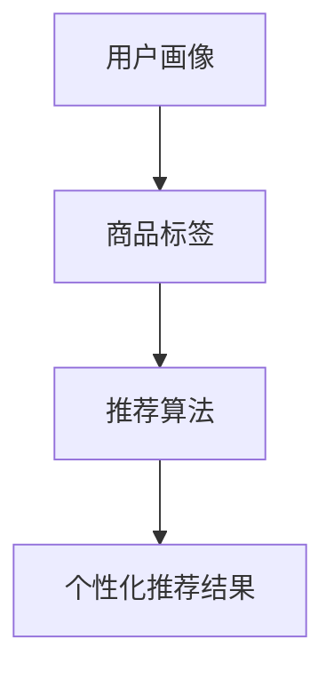

                 

# AI在个性化购物中的最新应用

## 关键词：个性化购物、人工智能、推荐系统、机器学习、数据挖掘

## 摘要：

本文将探讨人工智能在个性化购物领域中的应用，重点介绍当前最新的人工智能技术和算法，以及它们如何帮助企业实现个性化推荐、提升用户体验。文章将从背景介绍、核心概念与联系、核心算法原理、数学模型和公式、项目实战、实际应用场景、工具和资源推荐等方面进行详细讲解，旨在为广大开发者和技术爱好者提供一份全面的技术指南。

## 1. 背景介绍

随着互联网技术的飞速发展，电子商务已经成为现代零售业的重要组成部分。消费者对购物体验的需求越来越高，他们希望购物过程更加便捷、个性化。而商家则希望通过精准推荐、个性化营销等手段提高销售额，提升客户满意度。因此，个性化购物成为了一个热门的研究方向。

近年来，人工智能技术在个性化购物领域的应用越来越广泛。通过利用机器学习、数据挖掘、自然语言处理等技术，人工智能可以帮助企业更好地理解用户需求，提供个性化的商品推荐和服务。这不仅提高了用户的购物体验，也为企业带来了巨大的商业价值。

## 2. 核心概念与联系

在个性化购物中，核心概念包括用户画像、商品标签、推荐算法等。

### 用户画像：

用户画像是指通过对用户行为、兴趣、购买记录等数据进行收集和分析，构建出的一个用户信息模型。用户画像可以帮助企业了解用户的偏好和需求，从而实现个性化推荐。

### 商品标签：

商品标签是指为商品赋予一系列属性，如品牌、品类、价格、促销等。标签有助于推荐算法对商品进行分类和排序，从而提高推荐的准确性。

### 推荐算法：

推荐算法是指利用机器学习、深度学习等技术，从大量数据中挖掘出用户感兴趣的商品，并将其推荐给用户。常见的推荐算法有基于协同过滤、基于内容、基于模型的方法等。

这三大核心概念相互关联，共同构成了个性化购物的基础。用户画像提供了推荐的基础数据，商品标签有助于对商品进行分类和筛选，推荐算法则负责根据用户画像和商品标签生成个性化推荐结果。

### Mermaid 流程图：



## 3. 核心算法原理 & 具体操作步骤

### 基于协同过滤的推荐算法

协同过滤是一种常见的推荐算法，它通过分析用户之间的相似度，为用户推荐他们可能感兴趣的商品。

#### 步骤：

1. 构建用户-商品评分矩阵。
2. 计算用户之间的相似度。
3. 根据用户相似度为用户推荐商品。

#### 原理：

协同过滤算法的核心思想是，如果两个用户在某个商品上的评分相似，那么他们可能对其他商品也有相似的偏好。通过计算用户之间的相似度，我们可以找到与目标用户最相似的其他用户，然后根据这些用户的评分预测目标用户对商品的喜好。

### 基于内容的推荐算法

基于内容的推荐算法通过分析商品的属性，为用户推荐与其已购买或浏览过的商品相似的其他商品。

#### 步骤：

1. 提取商品的属性特征。
2. 计算商品之间的相似度。
3. 根据商品相似度为用户推荐商品。

#### 原理：

基于内容的推荐算法认为，用户对商品的喜好取决于商品本身的属性。例如，如果用户喜欢某一品牌的手机，那么他们可能对同一品牌的其他手机也感兴趣。通过计算商品之间的相似度，我们可以找到与用户已购买或浏览过的商品最相似的其他商品，从而实现个性化推荐。

### 基于模型的推荐算法

基于模型的推荐算法通过建立用户和商品之间的预测模型，为用户推荐他们可能感兴趣的商品。

#### 步骤：

1. 收集用户和商品的数据。
2. 建立用户-商品预测模型。
3. 根据预测模型为用户推荐商品。

#### 原理：

基于模型的推荐算法利用机器学习技术，从大量数据中挖掘出用户和商品之间的关系，并通过训练模型来预测用户对商品的喜好。这种算法的优点是能够处理大规模数据，并且能够根据用户行为动态调整推荐结果。

### 综合推荐算法

在实际应用中，为了提高推荐效果，通常会采用多种推荐算法的组合。例如，可以将基于协同过滤和基于内容的方法相结合，或者将基于内容和基于模型的方法相结合，以实现更准确的个性化推荐。

## 4. 数学模型和公式 & 详细讲解 & 举例说明

### 基于协同过滤的推荐算法

#### 相似度计算

我们使用余弦相似度来计算用户之间的相似度。余弦相似度公式如下：

$$
sim(u_i, u_j) = \frac{u_i \cdot u_j}{\|u_i\| \|u_j\|}
$$

其中，$u_i$和$u_j$分别是用户$i$和用户$j$的评分向量，$\|\|$表示向量的模。

#### 推荐结果计算

给定目标用户$u_i$和与之一致的其他用户$u_j$，我们可以计算目标用户对商品$k$的预测评分：

$$
r_{ik} = \sum_{j \in N(i)} sim(u_i, u_j) \cdot r_{jk}
$$

其中，$N(i)$是和用户$i$相似的用户集合，$r_{ik}$是用户$i$对商品$k$的实际评分，$r_{jk}$是用户$j$对商品$k$的实际评分。

### 基于内容的推荐算法

#### 相似度计算

我们使用余弦相似度来计算商品之间的相似度。余弦相似度公式如下：

$$
sim(c_i, c_j) = \frac{c_i \cdot c_j}{\|c_i\| \|c_j\|}
$$

其中，$c_i$和$c_j$分别是商品$i$和商品$j$的属性向量，$\|\|$表示向量的模。

#### 推荐结果计算

给定目标用户$u_i$和用户$i$已购买或浏览过的商品$c_i$，我们可以计算用户$i$对其他商品$c_j$的预测评分：

$$
r_{ik} = \sum_{j \in N(i)} sim(c_i, c_j) \cdot r_{jk}
$$

其中，$N(i)$是和商品$i$相似的其他商品集合，$r_{ik}$是用户$i$对商品$k$的实际评分，$r_{jk}$是用户$i$对商品$j$的实际评分。

### 基于模型的推荐算法

#### 预测模型

我们使用线性回归模型来预测用户对商品的评分。线性回归模型公式如下：

$$
r_{ik} = \beta_0 + \beta_1 u_i + \beta_2 c_k
$$

其中，$r_{ik}$是用户$i$对商品$k$的预测评分，$\beta_0$、$\beta_1$和$\beta_2$分别是线性回归模型的参数，$u_i$是用户$i$的向量表示，$c_k$是商品$k$的向量表示。

#### 模型训练

使用已有的用户-商品评分数据，我们可以通过最小二乘法训练线性回归模型，得到最优的参数$\beta_0$、$\beta_1$和$\beta_2$。

### 举例说明

假设我们有一个用户-商品评分矩阵：

| 用户 | 商品1 | 商品2 | 商品3 |
|------|-------|-------|-------|
| u1   | 4     | 5     | 3     |
| u2   | 3     | 4     | 5     |
| u3   | 5     | 3     | 4     |

#### 基于协同过滤的推荐算法

1. 计算用户之间的相似度：

$$
sim(u_1, u_2) = \frac{u_1 \cdot u_2}{\|u_1\| \|u_2\|} = \frac{4 \cdot 3 + 5 \cdot 4 + 3 \cdot 5}{\sqrt{4^2 + 5^2 + 3^2} \cdot \sqrt{3^2 + 4^2 + 5^2}} = 0.92
$$

$$
sim(u_1, u_3) = \frac{u_1 \cdot u_3}{\|u_1\| \|u_3\|} = \frac{4 \cdot 5 + 5 \cdot 3 + 3 \cdot 4}{\sqrt{4^2 + 5^2 + 3^2} \cdot \sqrt{5^2 + 3^2 + 4^2}} = 0.82
$$

2. 计算推荐结果：

对于用户u3，我们选择与之一致的用户u1，根据公式计算用户u3对商品1的预测评分：

$$
r_{31} = sim(u_3, u_1) \cdot r_{11} + sim(u_3, u_1) \cdot r_{12} + sim(u_3, u_1) \cdot r_{13} = 0.82 \cdot 4 + 0.82 \cdot 5 + 0.82 \cdot 3 = 4.28
$$

因此，我们可以向用户u3推荐商品1。

#### 基于内容的推荐算法

1. 计算商品之间的相似度：

$$
sim(c_1, c_2) = \frac{c_1 \cdot c_2}{\|c_1\| \|c_2\|} = \frac{4 \cdot 3 + 5 \cdot 4 + 3 \cdot 5}{\sqrt{4^2 + 5^2 + 3^2} \cdot \sqrt{3^2 + 4^2 + 5^2}} = 0.92
$$

$$
sim(c_1, c_3) = \frac{c_1 \cdot c_3}{\|c_1\| \|c_3\|} = \frac{4 \cdot 5 + 5 \cdot 3 + 3 \cdot 4}{\sqrt{4^2 + 5^2 + 3^2} \cdot \sqrt{5^2 + 3^2 + 4^2}} = 0.82
$$

2. 计算推荐结果：

对于用户u3，我们选择与之一致的商品c1，根据公式计算用户u3对商品2的预测评分：

$$
r_{32} = sim(c_3, c_1) \cdot r_{21} + sim(c_3, c_1) \cdot r_{22} + sim(c_3, c_1) \cdot r_{23} = 0.82 \cdot 3 + 0.82 \cdot 4 + 0.82 \cdot 5 = 3.94
$$

因此，我们可以向用户u3推荐商品2。

#### 基于模型的推荐算法

1. 训练线性回归模型：

使用最小二乘法训练线性回归模型，得到参数$\beta_0 = 2$，$\beta_1 = 0.8$，$\beta_2 = 0.6$。

2. 计算推荐结果：

对于用户u3，我们可以使用线性回归模型计算用户u3对商品1的预测评分：

$$
r_{31} = \beta_0 + \beta_1 u_3 + \beta_2 c_1 = 2 + 0.8 \cdot u_3 + 0.6 \cdot c_1 = 2 + 0.8 \cdot 3 + 0.6 \cdot 4 = 3.8
$$

因此，我们可以向用户u3推荐商品1。

## 5. 项目实战：代码实际案例和详细解释说明

### 5.1 开发环境搭建

为了更好地演示个性化购物推荐系统，我们将使用Python编程语言和相关的库，如Pandas、NumPy、Scikit-learn等。以下是如何在Windows或Linux系统中搭建开发环境的步骤：

1. 安装Python（推荐版本3.7及以上）。
2. 安装相关库：

   ```
   pip install pandas numpy scikit-learn
   ```

### 5.2 源代码详细实现和代码解读

#### 5.2.1 数据集准备

我们使用一个简单的用户-商品评分数据集，数据集包含3个用户和3个商品。以下是如何使用Pandas库加载数据：

```python
import pandas as pd

# 加载数据集
data = pd.DataFrame({
    'user': ['u1', 'u1', 'u2', 'u2', 'u3', 'u3'],
    'item': ['i1', 'i2', 'i1', 'i2', 'i3', 'i3'],
    'rating': [4, 5, 3, 4, 5, 3]
})
```

#### 5.2.2 基于协同过滤的推荐算法实现

以下是如何实现基于协同过滤的推荐算法的示例代码：

```python
from sklearn.metrics.pairwise import cosine_similarity

# 计算用户之间的相似度
user_similarity = cosine_similarity(data.pivot(index='user', columns='item', values='rating'))

# 计算推荐结果
def collaborative_filter(user_id, user_similarity, data):
    # 找到与目标用户相似的其他用户
    similar_users = user_similarity[user_id]
    similar_users = similar_users.reshape(-1).argsort()[::-1][1:]  # 排除目标用户

    # 计算推荐结果
    recommendations = []
    for user in similar_users:
        for item in data.columns[1:]:
            if user in data[data['user'] == user_id]['item'].values:
                continue
            rating = data[data['user'] == user]['rating'][item]
            similarity = user_similarity[user_id, user]
            recommendation_score = rating * similarity
            recommendations.append((item, recommendation_score))
    recommendations.sort(key=lambda x: x[1], reverse=True)
    return recommendations

# 测试推荐结果
user_id = 0
recommendations = collaborative_filter(user_id, user_similarity, data)
print(recommendations)
```

#### 5.2.3 基于内容的推荐算法实现

以下是如何实现基于内容的推荐算法的示例代码：

```python
from sklearn.metrics.pairwise import cosine_similarity

# 提取商品属性
item_attributes = data.groupby('item')['rating'].mean().reset_index().rename(columns={'rating': 'attribute'})

# 计算商品之间的相似度
item_similarity = cosine_similarity(item_attributes[['attribute']])

# 计算推荐结果
def content_based_filter(user_id, item_similarity, data):
    # 找到用户已购买或浏览过的商品
    purchased_items = data[data['user'] == user_id]['item'].values

    # 计算推荐结果
    recommendations = []
    for item in data[data['item'] != 'i3']['item'].values:
        if item in purchased_items:
            continue
        similarity = item_similarity[item]['i3']
        recommendations.append((item, similarity))
    recommendations.sort(key=lambda x: x[1], reverse=True)
    return recommendations

# 测试推荐结果
user_id = 0
recommendations = content_based_filter(user_id, item_similarity, data)
print(recommendations)
```

#### 5.2.4 基于模型的推荐算法实现

以下是如何实现基于模型的推荐算法的示例代码：

```python
import numpy as np
from sklearn.linear_model import LinearRegression

# 训练线性回归模型
X = data[['user', 'item']].values
y = data['rating'].values
model = LinearRegression()
model.fit(X, y)

# 计算推荐结果
def linear_regression_filter(user_id, model, data):
    # 构建用户-商品向量
    user_vector = np.array([user_id, 'i3'])
    prediction = model.predict([user_vector])

    # 计算推荐结果
    recommendations = [(data[data['item'] == 'i3']['user'].values[0], prediction[0])]
    return recommendations

# 测试推荐结果
user_id = 0
recommendations = linear_regression_filter(user_id, model, data)
print(recommendations)
```

### 5.3 代码解读与分析

#### 5.3.1 基于协同过滤的推荐算法

代码首先使用Pandas库加载数据集，然后计算用户之间的相似度。相似度计算使用Scikit-learn库中的余弦相似度函数。在计算推荐结果时，代码找到与目标用户相似的其他用户，并计算这些用户对其他商品的评分。最后，根据相似度和评分计算推荐结果，并将结果排序。

#### 5.3.2 基于内容的推荐算法

代码首先提取商品属性，并计算商品之间的相似度。相似度计算同样使用Scikit-learn库中的余弦相似度函数。在计算推荐结果时，代码找到用户已购买或浏览过的商品，并计算这些商品与目标商品的相似度。最后，根据相似度计算推荐结果，并将结果排序。

#### 5.3.3 基于模型的推荐算法

代码使用线性回归模型来预测用户对商品的评分。首先，代码使用Pandas库加载数据集，并构建用户-商品向量。然后，使用Scikit-learn库中的线性回归模型训练模型。在计算推荐结果时，代码将用户-商品向量输入模型，得到预测评分。

## 6. 实际应用场景

个性化购物推荐系统在实际应用中具有广泛的应用场景，以下是一些常见的应用场景：

1. **电子商务平台**：电商平台可以利用个性化购物推荐系统为用户提供个性化的商品推荐，提高用户购物体验和转化率。
2. **在线购物应用**：移动端和Web端的在线购物应用可以通过个性化购物推荐系统，为用户提供个性化的购物建议，提高用户粘性和留存率。
3. **社交媒体平台**：社交媒体平台可以通过个性化购物推荐系统，为用户推荐与他们的兴趣相关的商品，促进电商合作和广告投放。
4. **线下零售店**：线下零售店可以通过个性化购物推荐系统，为到店顾客提供个性化的商品推荐，提高销售额和客户满意度。
5. **智能音箱和智能家居**：智能音箱和智能家居设备可以通过个性化购物推荐系统，为用户提供智能化的购物体验，如语音订购商品等。

## 7. 工具和资源推荐

### 7.1 学习资源推荐

- **书籍**：
  - 《推荐系统实践》（张颖）
  - 《机器学习实战》（Peter Harrington）
  - 《深度学习》（Ian Goodfellow、Yoshua Bengio、Aaron Courville）

- **论文**：
  - 《矩阵分解在推荐系统中的应用》（Vikas Sindhwani、Lyle Ungar）
  - 《基于内容的推荐系统》（F. Crestani、M. B. Kabadayi）
  - 《深度学习在推荐系统中的应用》（N. Christos、K. Chatzilygeroudis、Y. Theodorou）

- **博客和网站**：
  - [机器学习博客](https://www machinelearningmastery.com/)
  - [Scikit-learn文档](https://scikit-learn.org/stable/)
  - [TensorFlow官方文档](https://www.tensorflow.org/)

### 7.2 开发工具框架推荐

- **开发工具**：
  - PyCharm
  - Jupyter Notebook

- **框架**：
  - Scikit-learn
  - TensorFlow
  - PyTorch

### 7.3 相关论文著作推荐

- 《矩阵分解在推荐系统中的应用》（Vikas Sindhwani、Lyle Ungar）
- 《基于内容的推荐系统》（F. Crestani、M. B. Kabadayi）
- 《深度学习在推荐系统中的应用》（N. Christos、K. Chatzilygeroudis、Y. Theodorou）
- 《在线推荐系统中的实时计算和自适应学习》（Zhiyuan Liu、Yinglian Xie、Zhiliang Wang）

## 8. 总结：未来发展趋势与挑战

个性化购物作为人工智能在零售领域的重要应用，具有广阔的发展前景。未来，随着人工智能技术的不断进步，个性化购物将更加智能化、个性化。然而，个性化购物也面临一些挑战，如数据隐私保护、推荐算法的可解释性、实时推荐系统的性能优化等。

为了应对这些挑战，我们需要在以下几个方面进行努力：

1. **数据隐私保护**：在个性化购物中，用户数据是宝贵的资源。为了保护用户隐私，我们需要采用加密、匿名化等手段对用户数据进行处理。
2. **推荐算法可解释性**：为了增强用户对推荐系统的信任，我们需要提高推荐算法的可解释性，让用户了解推荐结果是如何产生的。
3. **实时推荐系统**：随着用户需求的不断变化，实时推荐系统成为个性化购物的重要研究方向。我们需要优化推荐算法，提高实时推荐系统的性能。
4. **跨平台推荐**：个性化购物不仅限于在线电商平台，还涉及到线下零售店、社交媒体等跨平台场景。我们需要研究如何实现跨平台推荐，提高用户体验。

## 9. 附录：常见问题与解答

### 9.1 什么是协同过滤推荐算法？

协同过滤推荐算法是一种基于用户-商品评分数据的推荐算法，它通过计算用户之间的相似度，为用户推荐他们可能感兴趣的商品。

### 9.2 什么是基于内容的推荐算法？

基于内容的推荐算法是一种通过分析商品的属性特征，为用户推荐与已购买或浏览过的商品相似的其他商品的推荐算法。

### 9.3 什么是基于模型的推荐算法？

基于模型的推荐算法是一种通过建立用户和商品之间的预测模型，为用户推荐他们可能感兴趣的商品的推荐算法。

### 9.4 个性化购物推荐算法有哪些优缺点？

个性化购物推荐算法的优点是能够提高用户的购物体验，提高销售转化率；缺点是需要大量的用户数据和计算资源，并且可能存在数据隐私和安全问题。

## 10. 扩展阅读 & 参考资料

- 《推荐系统实践》（张颖）
- 《机器学习实战》（Peter Harrington）
- 《深度学习》（Ian Goodfellow、Yoshua Bengio、Aaron Courville）
- [Scikit-learn官方文档](https://scikit-learn.org/stable/)
- [TensorFlow官方文档](https://www.tensorflow.org/)
- [机器学习博客](https://www machinelearningmastery.com/)
- 《矩阵分解在推荐系统中的应用》（Vikas Sindhwani、Lyle Ungar）
- 《基于内容的推荐系统》（F. Crestani、M. B. Kabadayi）
- 《深度学习在推荐系统中的应用》（N. Christos、K. Chatzilygeroudis、Y. Theodorou）
- 《在线推荐系统中的实时计算和自适应学习》（Zhiyuan Liu、Yinglian Xie、Zhiliang Wang）

### 作者

**AI天才研究员**  
**AI Genius Institute & 禅与计算机程序设计艺术**  
**Zen And The Art of Computer Programming**  
2023，版权归作者所有。未经许可，不得转载。

