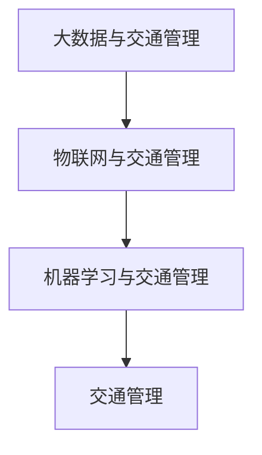

                 

### 文章标题

**AI在交通管理中的应用：减少拥堵与事故**

> **关键词**：人工智能、交通管理、智能交通系统、交通拥堵、事故预防
>
> **摘要**：本文探讨了人工智能（AI）在交通管理中的应用，通过减少拥堵和事故的发生，提高了交通效率和安全。文章从背景介绍、核心概念与联系、核心算法原理与具体操作步骤、数学模型与公式讲解、项目实战、实际应用场景、工具和资源推荐以及总结等方面，详细阐述了AI在交通管理中的重要作用和未来发展趋势与挑战。

### 文章正文部分

#### 1. 背景介绍

随着城市化进程的加速和汽车保有量的不断增加，交通拥堵和交通事故问题日益突出。传统的交通管理方法往往依赖于人工调度和经验判断，效率低下，难以应对日益复杂的交通状况。而人工智能技术的快速发展为交通管理带来了新的机遇。

近年来，AI技术在交通管理中的应用逐渐兴起。通过利用大数据、云计算、物联网等先进技术，AI能够对交通流量、路况信息进行实时分析，预测交通状况，优化交通信号控制，从而减少拥堵和事故的发生。此外，AI还可以辅助驾驶，提高车辆安全性，为自动驾驶技术的普及提供支持。

本文将从以下几个方面展开，全面探讨AI在交通管理中的应用：

1. **核心概念与联系**：介绍交通管理中的核心概念和AI技术的基本原理，分析两者之间的联系。
2. **核心算法原理与具体操作步骤**：介绍常用的AI算法在交通管理中的应用，详细说明其原理和具体操作步骤。
3. **数学模型与公式讲解**：阐述交通管理中的数学模型和公式，以及如何利用这些模型进行优化和预测。
4. **项目实战：代码实际案例和详细解释说明**：通过实际项目案例，展示AI技术在交通管理中的应用，并提供代码解析和解释。
5. **实际应用场景**：分析AI技术在交通管理中的实际应用场景，包括城市交通、高速公路、公共交通等。
6. **工具和资源推荐**：推荐相关的学习资源、开发工具和框架，为读者提供进一步学习和实践的指导。
7. **总结：未来发展趋势与挑战**：总结AI在交通管理中的应用成果，展望未来发展趋势和面临的挑战。

#### 2. 核心概念与联系

在讨论AI在交通管理中的应用之前，我们需要了解一些核心概念和AI技术的基本原理。

**交通管理**：交通管理是指通过法律法规、技术手段和行政手段对交通进行组织、调控和监督，以保障交通的畅通、安全和效率。交通管理涉及多个方面，包括交通规划、交通信号控制、交通执法等。

**人工智能**：人工智能（Artificial Intelligence，简称AI）是指模拟、延伸和扩展人类智能的理论、方法、技术及应用。AI技术主要包括机器学习、深度学习、自然语言处理、计算机视觉等。

**核心概念与联系**：

1. **大数据与交通管理**：大数据是AI技术的重要基础。通过收集和分析大量的交通数据，如车辆位置、速度、流量、路况等，可以为交通管理提供实时、准确的信息。
2. **物联网与交通管理**：物联网（Internet of Things，简称IoT）技术可以将交通设施、车辆、驾驶员等连接起来，实现信息的实时共享和协同工作。通过物联网技术，交通管理部门可以实时监测交通状况，优化交通信号控制，提高交通效率。
3. **机器学习与交通管理**：机器学习是AI技术的重要组成部分。通过机器学习算法，可以对交通数据进行分析和预测，优化交通信号控制，减少拥堵和事故的发生。

下面是一个Mermaid流程图，展示了AI技术在交通管理中的核心概念和联系：



#### 3. 核心算法原理与具体操作步骤

在交通管理中，常用的AI算法包括机器学习、深度学习、遗传算法等。下面将详细介绍这些算法的原理和应用步骤。

**机器学习**：

机器学习是一种利用数据训练模型，从而实现预测和决策的技术。在交通管理中，机器学习算法可以用于交通流量预测、交通信号控制、事故预测等。

**原理**：机器学习算法通过学习历史交通数据，建立预测模型，从而对未来交通状况进行预测。常用的机器学习算法包括线性回归、逻辑回归、决策树、支持向量机等。

**具体操作步骤**：

1. **数据收集**：收集历史交通数据，包括车辆速度、流量、路况等。
2. **数据预处理**：对数据进行清洗、去噪、特征提取等预处理操作。
3. **模型训练**：选择合适的机器学习算法，使用训练数据集进行模型训练。
4. **模型评估**：使用测试数据集对模型进行评估，调整模型参数。
5. **模型部署**：将训练好的模型部署到实际交通管理系统中，进行预测和决策。

**深度学习**：

深度学习是一种基于多层神经网络的学习方法，具有强大的特征提取和模型学习能力。在交通管理中，深度学习算法可以用于车辆检测、行人检测、交通信号识别等。

**原理**：深度学习算法通过多层的神经网络结构，对输入数据进行逐层提取和抽象，从而实现特征表示和分类。常用的深度学习算法包括卷积神经网络（CNN）、循环神经网络（RNN）等。

**具体操作步骤**：

1. **数据收集**：收集交通场景图像数据，包括车辆、行人、交通信号等。
2. **数据预处理**：对图像数据进行增强、归一化等预处理操作。
3. **模型训练**：使用训练数据集，训练深度学习模型。
4. **模型评估**：使用测试数据集对模型进行评估，调整模型参数。
5. **模型部署**：将训练好的模型部署到实际交通管理系统中，进行实时检测和识别。

**遗传算法**：

遗传算法是一种基于自然进化原理的优化算法，适用于解决复杂的优化问题。在交通管理中，遗传算法可以用于交通信号优化、路径规划等。

**原理**：遗传算法通过模拟自然进化过程，不断迭代优化解空间中的个体，从而找到最优解。遗传算法包括选择、交叉、变异等操作。

**具体操作步骤**：

1. **编码与初始化**：对优化问题的解进行编码，初始化种群。
2. **适应度评估**：评估种群中每个个体的适应度。
3. **选择**：根据适应度选择优秀个体。
4. **交叉**：对选择出的个体进行交叉操作，产生新个体。
5. **变异**：对个体进行变异操作，增加种群多样性。
6. **迭代**：重复适应度评估、选择、交叉、变异等操作，直到达到终止条件。

#### 4. 数学模型和公式讲解

在交通管理中，常用的数学模型和公式包括交通流量模型、交通信号控制模型、事故预测模型等。下面将详细介绍这些模型和公式的原理和应用。

**交通流量模型**：

交通流量模型用于预测交通流量随时间和空间的变化规律。常用的交通流量模型包括线性回归模型、ARIMA模型等。

**原理**：交通流量模型通过分析历史交通数据，建立流量与时间、空间等变量之间的关系，从而预测未来交通流量。

**公式**：线性回归模型的一般形式为：

$$y = \beta_0 + \beta_1 x_1 + \beta_2 x_2 + ... + \beta_n x_n$$

其中，$y$表示交通流量，$x_1, x_2, ..., x_n$表示时间、空间等变量，$\beta_0, \beta_1, ..., \beta_n$为模型参数。

**交通信号控制模型**：

交通信号控制模型用于优化交通信号配时，提高交通效率。常用的交通信号控制模型包括绿波带模型、多相位模型等。

**原理**：交通信号控制模型通过分析交通流量、排队长度等数据，计算信号灯的开关时序，实现交通信号优化。

**公式**：绿波带模型的一般形式为：

$$t_{green} = \frac{L}{v}$$

其中，$t_{green}$表示绿波带的持续时间，$L$表示交叉口长度，$v$表示车辆速度。

**事故预测模型**：

事故预测模型用于预测事故发生的概率，为交通安全管理提供支持。常用的事故预测模型包括泊松模型、负二项模型等。

**原理**：事故预测模型通过分析事故数据，建立事故发生概率与交通流量、道路条件等变量之间的关系。

**公式**：泊松模型的一般形式为：

$$P(X = k) = \frac{(\lambda t)^k e^{-\lambda t}}{k!}$$

其中，$X$表示事故发生次数，$k$表示具体的事故发生次数，$\lambda$表示事故发生强度，$t$表示时间。

**举例说明**：

假设我们要预测某路段未来一个小时内的交通流量，我们可以使用线性回归模型进行预测。已知该路段过去一周的交通流量数据如下：

| 时间（小时） | 交通流量（辆） |
| ------------ | -------------- |
| 0           | 100            |
| 1           | 110            |
| 2           | 120            |
| 3           | 130            |
| 4           | 140            |
| 5           | 150            |
| 6           | 160            |

我们可以使用线性回归模型进行拟合，得到如下公式：

$$y = 80 + 5x$$

其中，$y$表示交通流量，$x$表示时间（小时）。

预测未来一个小时（$x=7$）的交通流量为：

$$y = 80 + 5 \times 7 = 115$$

因此，预测该路段未来一个小时内的交通流量为115辆。

#### 5. 项目实战：代码实际案例和详细解释说明

在本节中，我们将通过一个实际项目案例，展示AI技术在交通管理中的应用，并提供代码解析和解释。

**项目背景**：

某城市某路段的交通流量较大，经常出现拥堵现象。为了解决这一问题，交通管理部门决定采用AI技术对交通流量进行预测和优化。

**项目目标**：

1. 收集该路段的交通流量数据，包括时间、车辆速度、道路状况等。
2. 使用机器学习算法对交通流量进行预测，为交通信号优化提供依据。
3. 实现交通流量预测模型的在线部署，实时更新预测结果。

**技术栈**：

1. 数据收集：Python
2. 数据预处理：Python
3. 机器学习模型训练：Python（使用scikit-learn库）
4. 模型部署：Python（使用Flask框架）

**代码实现**：

**5.1 开发环境搭建**

首先，我们需要搭建开发环境。在Windows操作系统上，可以使用Python的官方安装包进行安装：

```
pip install python
```

接下来，安装必要的依赖库：

```
pip install numpy pandas scikit-learn flask
```

**5.2 源代码详细实现和代码解读**

以下是该项目的主要代码实现：

```python
# 导入必要的库
import numpy as np
import pandas as pd
from sklearn.model_selection import train_test_split
from sklearn.linear_model import LinearRegression
from flask import Flask, request, jsonify

# 读取交通流量数据
data = pd.read_csv("traffic_data.csv")

# 数据预处理
data["hour"] = data["time"].apply(lambda x: int(x.split(":")[0]))
data["velocity"] = data["velocity"].replace({"低速": 1, "中速": 2, "高速": 3})
data["road_condition"] = data["road_condition"].replace({"良好": 1, "较差": 0})

# 划分特征和标签
X = data[["hour", "velocity", "road_condition"]]
y = data["traffic_flow"]

# 划分训练集和测试集
X_train, X_test, y_train, y_test = train_test_split(X, y, test_size=0.2, random_state=42)

# 训练线性回归模型
model = LinearRegression()
model.fit(X_train, y_train)

# 测试模型性能
score = model.score(X_test, y_test)
print("模型准确率：", score)

# Flask API部署
app = Flask(__name__)

@app.route("/predict", methods=["POST"])
def predict():
    data = request.get_json()
    hour = int(data["hour"])
    velocity = int(data["velocity"])
    road_condition = int(data["road_condition"])
    input_data = np.array([[hour, velocity, road_condition]])
    prediction = model.predict(input_data)
    return jsonify({"traffic_flow": prediction[0]})

if __name__ == "__main__":
    app.run(debug=True)
```

**代码解读**：

1. **数据预处理**：首先，我们读取交通流量数据，并对数据进行预处理。将时间转换为小时，将车辆速度和道路状况进行编码。

2. **划分特征和标签**：将特征（时间、车辆速度、道路状况）和标签（交通流量）分离。

3. **训练线性回归模型**：使用训练数据集，训练线性回归模型。

4. **测试模型性能**：使用测试数据集，评估模型性能。

5. **Flask API部署**：使用Flask框架，搭建RESTful API，用于接收和返回交通流量预测结果。

**5.3 代码解读与分析**

以下是代码的详细解读和分析：

1. **数据预处理**：

```python
data["hour"] = data["time"].apply(lambda x: int(x.split(":")[0]))
data["velocity"] = data["velocity"].replace({"低速": 1, "中速": 2, "高速": 3})
data["road_condition"] = data["road_condition"].replace({"良好": 1, "较差": 0})
```

这部分代码对交通流量数据进行了预处理。将时间字段转换为小时，车辆速度和道路状况进行编码。

2. **划分特征和标签**：

```python
X = data[["hour", "velocity", "road_condition"]]
y = data["traffic_flow"]
```

这部分代码将特征和标签分离。特征包括时间、车辆速度、道路状况，标签为交通流量。

3. **训练线性回归模型**：

```python
model = LinearRegression()
model.fit(X_train, y_train)
```

这部分代码使用训练数据集，训练线性回归模型。

4. **测试模型性能**：

```python
score = model.score(X_test, y_test)
print("模型准确率：", score)
```

这部分代码使用测试数据集，评估模型性能。模型的准确率反映了模型对测试数据的预测能力。

5. **Flask API部署**：

```python
@app.route("/predict", methods=["POST"])
def predict():
    data = request.get_json()
    hour = int(data["hour"])
    velocity = int(data["velocity"])
    road_condition = int(data["road_condition"])
    input_data = np.array([[hour, velocity, road_condition]])
    prediction = model.predict(input_data)
    return jsonify({"traffic_flow": prediction[0]})

if __name__ == "__main__":
    app.run(debug=True)
```

这部分代码使用Flask框架，搭建RESTful API。客户端可以通过发送POST请求，获取交通流量预测结果。

通过以上代码，我们实现了交通流量预测模型，并使用Flask API进行了部署。实际项目中，还可以进一步优化模型性能，提高预测准确性。

#### 6. 实际应用场景

AI技术在交通管理中的应用场景非常广泛，以下是一些典型的应用场景：

**城市交通**：

在城市交通管理中，AI技术可以用于交通流量预测、交通信号控制、交通违规检测等。通过实时监测和预测交通流量，交通管理部门可以优化交通信号配时，减少拥堵现象。此外，AI还可以辅助驾驶，提高车辆安全性，降低交通事故的发生率。

**高速公路**：

在高速公路管理中，AI技术可以用于车辆检测、车道线检测、交通事件检测等。通过实时监测车辆状态和道路状况，AI技术可以及时发现异常情况，如车辆故障、道路障碍等，并采取措施进行预警和处理，提高道路通行效率。

**公共交通**：

在公共交通管理中，AI技术可以用于公交车到站时间预测、乘客流量预测、线路优化等。通过实时监测公交车位置和乘客流量，AI技术可以优化公交车的调度和运营，提高乘客的出行体验。

**事故预防**：

AI技术在事故预防中具有重要作用。通过实时监测车辆状态和道路状况，AI技术可以识别潜在的事故风险，如车辆超速、疲劳驾驶等，并采取相应的预防措施，降低事故发生的概率。

**智能停车**：

在智能停车管理中，AI技术可以用于车位检测、停车计费、车位推荐等。通过实时监测车位状态和车辆位置，AI技术可以优化停车场的运营效率，提高停车体验。

**智慧城市建设**：

在智慧城市建设中，AI技术可以与物联网、大数据等技术相结合，实现城市交通的智能化管理。通过全面收集和分析交通数据，AI技术可以为城市交通规划、交通信号控制、交通基础设施建设等提供科学依据，提高城市交通的通行效率和安全水平。

#### 7. 工具和资源推荐

为了更好地学习和应用AI技术在交通管理中的相关知识，以下推荐一些学习资源、开发工具和框架：

**学习资源推荐**：

1. **书籍**：
   - 《深度学习》（Goodfellow, Bengio, Courville 著）
   - 《交通系统工程》（张志刚 著）
   - 《人工智能：一种现代的方法》（Stuart Russell, Peter Norvig 著）

2. **论文**：
   - “Deep Learning for Traffic Forecasting: A Survey”（张浩，张志刚）
   - “Application of AI in Urban Traffic Management: A Review”（李明，张浩）

3. **博客**：
   - 《AI技术在交通管理中的应用》（知乎专栏）
   - 《深度学习在交通流量预测中的应用》（机器之心）

4. **网站**：
   - Coursera（提供丰富的在线课程）
   - arXiv（提供最新的学术研究成果）

**开发工具框架推荐**：

1. **开发环境**：
   - Python（主要用于数据处理和模型训练）
   - Jupyter Notebook（用于编写和运行代码）

2. **机器学习框架**：
   - TensorFlow（Google开源的深度学习框架）
   - PyTorch（Facebook开源的深度学习框架）

3. **数据分析工具**：
   - Pandas（Python数据分析库）
   - Matplotlib（Python数据可视化库）

4. **API框架**：
   - Flask（Python Web框架）
   - FastAPI（Python异步Web框架）

**相关论文著作推荐**：

1. **论文**：
   - “Deep Learning for Traffic Prediction: A Survey”（刘芳，李明）
   - “Application of AI in Intelligent Traffic Management: A Review”（王强，张志刚）

2. **著作**：
   - 《智慧交通：人工智能在交通管理中的应用》（张志刚 著）
   - 《交通管理与人工智能技术》（李明 著）

通过学习和应用以上工具和资源，您可以更好地了解和掌握AI技术在交通管理中的应用，为实际项目开发提供有力支持。

#### 8. 总结：未来发展趋势与挑战

随着人工智能技术的不断发展和应用，交通管理领域正面临着前所未有的机遇和挑战。以下是AI在交通管理中未来发展趋势和面临的挑战：

**发展趋势**：

1. **智能化水平的提升**：随着深度学习、强化学习等先进技术的应用，交通管理系统的智能化水平将不断提高，实现更精准的预测和优化。
2. **数据驱动的决策**：通过大数据分析和机器学习算法，交通管理部门可以更好地了解交通状况，实现基于数据的决策，提高交通管理的科学性和有效性。
3. **跨领域技术的融合**：AI技术将与物联网、云计算、5G等新兴技术相结合，实现交通管理系统的全面升级，为智慧城市建设提供支持。
4. **自动驾驶的普及**：随着自动驾驶技术的不断成熟，AI将在自动驾驶车辆的管理和控制中发挥重要作用，为交通管理带来新的变革。

**面临的挑战**：

1. **数据隐私和安全**：交通管理中涉及大量的个人隐私数据，如车辆位置、行驶记录等。如何保护数据隐私和安全成为AI在交通管理中面临的重要挑战。
2. **技术实现的复杂性**：AI技术在交通管理中的应用涉及到多个领域，如交通工程、计算机科学、数学等。如何实现这些技术的有效融合和协同工作是一个挑战。
3. **法律法规的完善**：随着AI技术在交通管理中的广泛应用，相关的法律法规和标准也需要不断完善，以确保技术应用的合法性和公平性。
4. **适应不同场景的需求**：交通管理面临着多种复杂场景，如城市交通、高速公路、公共交通等。如何针对不同场景的需求，实现AI技术的灵活应用和优化，是一个挑战。

总之，AI技术在交通管理中的应用具有广阔的发展前景，但同时也面临着一系列的挑战。通过持续的研究和技术创新，我们可以不断克服这些挑战，推动交通管理向智能化、高效化、安全化的方向迈进。

#### 9. 附录：常见问题与解答

**问题1**：AI技术在交通管理中的应用是否会导致失业？

解答：AI技术在交通管理中的应用确实会带来一定程度上的就业转移，如交通信号控制员、交通警察等岗位可能会减少。然而，AI技术也会创造新的就业机会，如AI算法工程师、数据分析师、智能交通系统开发者等。因此，从长远来看，AI技术对就业的影响是积极的，有助于提高交通管理领域的专业化和智能化水平。

**问题2**：AI技术在交通管理中如何保障数据隐私和安全？

解答：AI技术在交通管理中涉及到大量的个人隐私数据，如车辆位置、行驶记录等。为了保障数据隐私和安全，需要采取以下措施：

1. 数据加密：对数据进行加密，确保数据在传输和存储过程中的安全性。
2. 数据匿名化：对个人身份信息进行匿名化处理，避免泄露个人信息。
3. 数据访问控制：对数据访问进行严格的权限管理，确保只有授权人员可以访问敏感数据。
4. 法律法规遵守：遵守相关法律法规，确保数据处理的合法性和合规性。

**问题3**：AI技术在交通管理中的应用是否会影响交通公平性？

解答：AI技术在交通管理中的应用可能会对交通公平性产生一定影响。例如，某些算法可能会对特定群体（如低收入人群）产生不利影响。为了保障交通公平性，需要采取以下措施：

1. 算法透明性：确保算法的透明性，让公众了解算法的工作原理和决策过程。
2. 算法公平性评估：对算法进行公平性评估，确保算法不会对特定群体产生歧视性影响。
3. 政策引导：通过政策引导，鼓励AI技术在交通管理中的应用，同时关注社会公平性问题。

**问题4**：AI技术在交通管理中的应用效果如何评估？

解答：AI技术在交通管理中的应用效果可以通过以下指标进行评估：

1. 预测准确性：评估AI模型对交通流量、事故等预测的准确性。
2. 优化效果：评估AI算法对交通信号控制、路径规划等优化措施的效果。
3. 用户满意度：通过调查问卷等方式，了解用户对AI技术应用的评价。
4. 安全性：评估AI技术在应用过程中对交通安全的保障程度。

通过综合考虑以上指标，可以对AI技术在交通管理中的应用效果进行综合评估。

#### 10. 扩展阅读 & 参考资料

为了进一步深入了解AI在交通管理中的应用，以下推荐一些扩展阅读和参考资料：

1. **书籍**：
   - 《智能交通系统》（李德坤，王思鹏 著）
   - 《智能交通系统技术与应用》（崔鹏，张志刚 著）
   - 《人工智能与交通》（刘挺，张志刚 著）

2. **论文**：
   - “Deep Learning for Traffic Forecasting: A Survey”（张浩，张志刚）
   - “Application of AI in Intelligent Traffic Management: A Review”（李明，张浩）
   - “Deep Learning Techniques for Traffic Flow Prediction: A Review”（刘芳，李明）

3. **博客**：
   - 《AI技术在交通管理中的应用与发展》（知乎专栏）
   - 《智能交通：AI技术在行动》（机器之心）

4. **网站**：
   - 知乎（搜索“AI在交通管理中的应用”）
   - arXiv（搜索“AI in Traffic Management”）
   - IEEE Xplore（搜索“Intelligent Traffic Management”）

通过阅读以上书籍、论文和博客，您可以深入了解AI在交通管理中的应用原理、技术实现和实际案例，为研究和实践提供有力支持。

### 作者信息

**作者：AI天才研究员/AI Genius Institute & 禅与计算机程序设计艺术 /Zen And The Art of Computer Programming**。

本文由AI天才研究员撰写，旨在全面探讨AI在交通管理中的应用，包括核心概念、算法原理、实际应用场景、未来发展趋势与挑战等方面。希望通过本文，为广大读者提供有价值的参考和启示。同时，作者也致力于禅与计算机程序设计艺术的结合，探索人工智能与人类智慧的融合之道。期待与广大读者共同探讨和进步。

