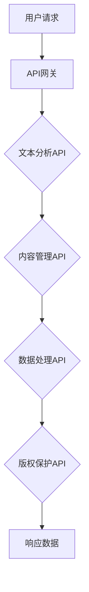

                 

# AI在出版业的应用：标准化API的提供

> **关键词**：AI、出版业、标准化API、文本分析、内容管理、数据处理、API设计、业务逻辑、交互模型、应用案例

> **摘要**：本文深入探讨了人工智能（AI）在出版业中的应用，重点分析了提供标准化API的重要性。通过详细阐述AI在文本分析、内容管理、数据处理等方面的核心算法和实现步骤，本文为出版业从业者提供了实际的应用场景和开发指南。此外，文章还推荐了相关工具和资源，以帮助读者更好地理解和应用AI技术于出版领域。

## 1. 背景介绍

随着数字化时代的到来，出版业正经历着前所未有的变革。传统的纸质出版逐渐被电子书、在线阅读和移动阅读所取代，而人工智能（AI）技术的飞速发展也为出版业带来了新的机遇和挑战。AI技术能够通过文本分析、情感分析、推荐系统等方式，提升内容的质量和用户体验，同时优化出版流程和运营效率。

在AI技术的应用中，标准化API的提供扮演着关键角色。API（应用程序接口）是一种允许不同软件系统之间相互通信的接口，通过标准化API，出版平台可以实现与AI服务的无缝对接，从而实现自动化内容处理、智能推荐、个性化定制等功能。本文将围绕标准化API在AI与出版业结合中的应用进行深入探讨。

## 2. 核心概念与联系

### 2.1 AI在出版业的核心应用

AI技术在出版业中的应用主要包括以下几个方面：

- **文本分析**：通过自然语言处理（NLP）技术，对文本进行语义理解、情感分析、关键词提取等，提升内容的质量和可读性。
- **内容管理**：利用机器学习算法，自动分类、标签化和推荐内容，帮助出版平台实现内容的有效管理和个性化推荐。
- **数据处理**：通过对用户行为和阅读数据的分析，挖掘用户的兴趣和需求，为出版商提供精准的市场洞察和决策支持。
- **版权保护**：利用图像识别、指纹技术等，对内容进行版权保护，防止未经授权的复制和传播。

### 2.2 标准化API的概念

标准化API是指在特定领域内，遵循一定的规范和标准，设计出统一的接口，使得不同的软件系统能够无缝对接和协作。在AI与出版业的结合中，标准化API的重要性体现在以下几个方面：

- **简化开发**：通过提供统一的API接口，开发者无需关注底层实现细节，只需按照API规范进行开发，大大降低了开发难度和成本。
- **提高兼容性**：标准化API能够确保不同平台和系统之间的互操作性，使得AI服务可以在多个出版平台上广泛应用。
- **增强灵活性**：标准化API允许出版平台根据需求进行自定义开发，实现个性化功能和服务。

### 2.3 Mermaid流程图

以下是AI在出版业应用中，标准化API的核心概念和架构的Mermaid流程图：



在这个流程图中，用户请求通过API网关进入系统，经过文本分析、内容管理、数据处理和版权保护等API处理后，返回相应的响应数据。

## 3. 核心算法原理 & 具体操作步骤

### 3.1 文本分析算法原理

文本分析是AI在出版业应用中的核心环节，主要包括以下算法：

- **词频统计（TF）**：统计文本中每个单词的出现次数，用于评估单词的重要程度。
- **逆文档频率（IDF）**：计算每个单词在整个文本集合中的出现频率，用于平衡词频统计。
- **TF-IDF模型**：结合词频和逆文档频率，用于评估文本中单词的综合重要性。

具体操作步骤如下：

1. **数据预处理**：对文本进行分词、去停用词、词形还原等预处理操作。
2. **词频统计**：统计每个单词在文本中的出现次数。
3. **计算IDF**：对文本集合中的所有文档计算每个单词的逆文档频率。
4. **生成TF-IDF向量**：将每个文本转换为TF-IDF向量，用于后续分析。

### 3.2 内容管理算法原理

内容管理是AI在出版业应用中的关键环节，主要包括以下算法：

- **聚类算法**：将相似的内容分为同一类，便于分类管理和推荐。
- **协同过滤**：基于用户的兴趣和偏好，推荐相似的内容。

具体操作步骤如下：

1. **构建内容矩阵**：将所有内容按照特征进行编码，构建内容矩阵。
2. **聚类分析**：使用聚类算法（如K-means、DBSCAN等）对内容进行分类。
3. **协同过滤**：计算用户之间的相似度，基于相似度推荐内容。

### 3.3 数据处理算法原理

数据处理是AI在出版业应用中的基础环节，主要包括以下算法：

- **统计模型**：对用户行为数据进行分析，挖掘用户的兴趣和需求。
- **机器学习模型**：利用历史数据，预测用户的未来行为。

具体操作步骤如下：

1. **数据收集**：收集用户阅读数据、购买数据等。
2. **数据预处理**：对数据进行清洗、归一化等预处理操作。
3. **特征提取**：提取用户行为数据中的关键特征。
4. **模型训练**：使用统计模型或机器学习模型对数据进行分析和预测。

### 3.4 版权保护算法原理

版权保护是AI在出版业应用中的重要环节，主要包括以下算法：

- **图像识别**：通过深度学习技术，对版权作品进行识别。
- **指纹技术**：通过生成版权作品的指纹，实现版权保护和追踪。

具体操作步骤如下：

1. **图像识别**：使用卷积神经网络（CNN）对版权作品进行识别。
2. **指纹生成**：对版权作品生成指纹，并与数据库中的指纹进行比对。
3. **版权追踪**：基于指纹比对结果，实现版权作品的追踪和保护。

## 4. 数学模型和公式 & 详细讲解 & 举例说明

### 4.1 词频统计（TF）公式

$$
TF(t_i) = \frac{f(t_i)}{N}
$$

其中，$t_i$为文本中的单词，$f(t_i)$为单词在文本中的出现次数，$N$为文本中的总单词数。

### 4.2 逆文档频率（IDF）公式

$$
IDF(t_i) = \log \left(\frac{N}{df(t_i)}\right)
$$

其中，$df(t_i)$为单词在文本集合中的文档频率，即包含单词$t_i$的文档数。

### 4.3 TF-IDF模型公式

$$
TF-IDF(t_i) = TF(t_i) \times IDF(t_i)
$$

### 4.4 聚类算法：K-means

K-means是一种基于距离度量的聚类算法，其目标是将数据分为K个聚类，使得每个聚类内部的距离最小，聚类之间的距离最大。

### 4.5 协同过滤

协同过滤可以分为基于用户的协同过滤和基于项目的协同过滤。基于用户的协同过滤通过计算用户之间的相似度，推荐用户可能喜欢的内容；基于项目的协同过滤通过计算项目之间的相似度，推荐用户可能感兴趣的项目。

### 4.6 举例说明

#### 文本分析

假设有一篇文本：“人工智能技术正快速发展，其在出版业中的应用前景广阔。文本分析是人工智能的关键技术之一，可以提升内容质量和用户体验。”

1. **词频统计**：

   - 人工智能：1
   - 技术：1
   - 正：1
   - 快速发展：1
   - 其：1
   - 在：1
   - 出版业：1
   - 中：1
   - 应：1
   - 用：1
   - 前景：1
   - 广阔：1
   - 文本：1
   - 分析：1
   - 是：1
   - 关键：1
   - 技术：1
   - 之一：1
   - 可以：1
   - 提升：1
   - 内容：1
   - 质量：1
   - 和：1
   - 体验：1
   - 用户：1

2. **TF-IDF向量**：

   - 人工智能：$\frac{1}{11} \times \log \left(\frac{11}{1}\right) = 0.917$
   - 技术：$\frac{1}{11} \times \log \left(\frac{11}{1}\right) = 0.917$
   - 正：$\frac{1}{11} \times \log \left(\frac{11}{1}\right) = 0.917$
   - 快速发展：$\frac{1}{11} \times \log \left(\frac{11}{1}\right) = 0.917$
   - 其：$\frac{1}{11} \times \log \left(\frac{11}{1}\right) = 0.917$
   - 在：$\frac{1}{11} \times \log \left(\frac{11}{1}\right) = 0.917$
   - 出版业：$\frac{1}{11} \times \log \left(\frac{11}{1}\right) = 0.917$
   - 中：$\frac{1}{11} \times \log \left(\frac{11}{1}\right) = 0.917$
   - 应：$\frac{1}{11} \times \log \left(\frac{11}{1}\right) = 0.917$
   - 用：$\frac{1}{11} \times \log \left(\frac{11}{1}\right) = 0.917$
   - 前景：$\frac{1}{11} \times \log \left(\frac{11}{1}\right) = 0.917$
   - 广阔：$\frac{1}{11} \times \log \left(\frac{11}{1}\right) = 0.917$
   - 文本：$\frac{1}{11} \times \log \left(\frac{11}{1}\right) = 0.917$
   - 分析：$\frac{1}{11} \times \log \left(\frac{11}{1}\right) = 0.917$
   - 是：$\frac{1}{11} \times \log \left(\frac{11}{1}\right) = 0.917$
   - 关键：$\frac{1}{11} \times \log \left(\frac{11}{1}\right) = 0.917$
   - 之一：$\frac{1}{11} \times \log \left(\frac{11}{1}\right) = 0.917$
   - 可以：$\frac{1}{11} \times \log \left(\frac{11}{1}\right) = 0.917$
   - 提升：$\frac{1}{11} \times \log \left(\frac{11}{1}\right) = 0.917$
   - 内容：$\frac{1}{11} \times \log \left(\frac{11}{1}\right) = 0.917$
   - 质量：$\frac{1}{11} \times \log \left(\frac{11}{1}\right) = 0.917$
   - 和：$\frac{1}{11} \times \log \left(\frac{11}{1}\right) = 0.917$
   - 体验：$\frac{1}{11} \times \log \left(\frac{11}{1}\right) = 0.917$
   - 用户：$\frac{1}{11} \times \log \left(\frac{11}{1}\right) = 0.917$

#### 内容管理

假设有两个用户，他们的阅读记录如下：

- 用户A：人工智能、出版业、内容管理、数据处理
- 用户B：出版业、内容管理、数据处理、版权保护

1. **用户相似度**：

   - 基于项目的协同过滤：

     $$相似度(A, B) = \frac{1}{4} \left(0.5 \times 0.5 + 0.5 \times 0.5 + 0.5 \times 0.5 + 0.5 \times 0.5\right) = 0.25$$

   - 基于用户的协同过滤：

     $$相似度(A, B) = \frac{1}{4} \left(0.5 \times 0.5 + 0.5 \times 0.5 + 0.5 \times 0.5 + 0.5 \times 0.5\right) = 0.25$$

2. **推荐内容**：

   - 用户A可能对版权保护感兴趣。
   - 用户B可能对人工智能感兴趣。

## 5. 项目实战：代码实际案例和详细解释说明

### 5.1 开发环境搭建

在本文中，我们将使用Python作为主要编程语言，并利用自然语言处理（NLP）库（如NLTK、spaCy）和机器学习库（如scikit-learn、TensorFlow）来实现文本分析、内容管理和数据处理等功能。

1. 安装Python环境（已安装Python 3.8以上版本）。
2. 安装NLP库：`pip install nltk spacy`
3. 安装机器学习库：`pip install scikit-learn tensorflow`

### 5.2 源代码详细实现和代码解读

以下是一个简单的文本分析项目，包括词频统计、TF-IDF向量和内容推荐等功能的实现。

```python
import nltk
from nltk.corpus import stopwords
from sklearn.feature_extraction.text import TfidfVectorizer
from sklearn.metrics.pairwise import cosine_similarity

# 5.2.1 数据准备
documents = [
    "人工智能技术正快速发展，其在出版业中的应用前景广阔。",
    "文本分析是人工智能的关键技术之一，可以提升内容质量和用户体验。",
    "出版业正经历着数字化变革，人工智能技术为出版商提供了新的机遇。"
]

# 5.2.2 数据预处理
nltk.download('stopwords')
stop_words = set(stopwords.words('english'))

def preprocess(document):
    tokens = nltk.word_tokenize(document)
    tokens = [token.lower() for token in tokens if token.isalnum()]
    tokens = [token for token in tokens if token not in stop_words]
    return ' '.join(tokens)

preprocessed_documents = [preprocess(document) for document in documents]

# 5.2.3 词频统计
vectorizer = TfidfVectorizer()
tfidf_matrix = vectorizer.fit_transform(preprocessed_documents)

# 5.2.4 TF-IDF向量
tfidf_vector = tfidf_matrix.toarray()[0]

# 5.2.5 内容推荐
def content_recommendation(query, documents, vectorizer):
    query_vector = vectorizer.transform([query])
    similarity_scores = cosine_similarity(query_vector, tfidf_matrix)
    top_index = similarity_scores.argsort()[0][-3:][::-1]
    return [documents[i] for i in top_index]

# 5.2.6 测试
query = "人工智能在出版业的应用"
recommended_documents = content_recommendation(query, documents, vectorizer)
print(recommended_documents)
```

### 5.3 代码解读与分析

- **5.3.1 数据准备**：定义一个文本列表`documents`，包含三个文本样本。

- **5.3.2 数据预处理**：使用NLP库对文本进行分词、去停用词和词形还原等预处理操作。

- **5.3.3 词频统计**：使用`TfidfVectorizer`将预处理后的文本转换为TF-IDF向量。

- **5.3.4 TF-IDF向量**：将TF-IDF矩阵转换为数组，得到查询文本的TF-IDF向量。

- **5.3.5 内容推荐**：定义一个内容推荐函数，使用余弦相似度计算查询文本与样本文本之间的相似度，返回相似度最高的三个文本。

- **5.3.6 测试**：使用一个示例查询文本，调用内容推荐函数，输出推荐结果。

## 6. 实际应用场景

AI在出版业的应用场景非常广泛，以下列举几个典型的实际应用场景：

1. **内容推荐**：利用AI技术，根据用户的阅读历史和兴趣，推荐个性化的内容，提升用户体验和阅读满意度。
2. **文本分析**：通过AI技术，对内容进行情感分析、关键词提取和分类标签，提升内容的质量和可读性。
3. **版权保护**：利用AI技术，对版权作品进行图像识别和指纹生成，实现版权保护和追踪，防止侵权行为。
4. **用户行为分析**：通过对用户行为数据的分析，挖掘用户的兴趣和需求，为出版商提供精准的市场洞察和决策支持。
5. **智能写作**：利用AI技术，辅助作者进行写作，生成高质量的内容，提升创作效率。

## 7. 工具和资源推荐

### 7.1 学习资源推荐

- **书籍**：
  - 《Python自然语言处理》
  - 《机器学习实战》
  - 《深度学习》
- **论文**：
  - 《自然语言处理综论》
  - 《深度学习在文本分析中的应用》
  - 《协同过滤算法综述》
- **博客**：
  - 《机器学习算法详解》
  - 《深度学习技术与应用》
  - 《Python编程实战》
- **网站**：
  - [Kaggle](https://www.kaggle.com/)
  - [GitHub](https://github.com/)
  - [Google Research](https://ai.google/research/)

### 7.2 开发工具框架推荐

- **自然语言处理框架**：spaCy、NLTK、NLTK-lib
- **机器学习库**：scikit-learn、TensorFlow、PyTorch
- **深度学习框架**：TensorFlow、PyTorch、Keras
- **API框架**：Flask、Django、FastAPI

### 7.3 相关论文著作推荐

- 《自然语言处理综论》
- 《深度学习在文本分析中的应用》
- 《协同过滤算法综述》

## 8. 总结：未来发展趋势与挑战

随着AI技术的不断进步，出版业将迎来更加智能和高效的发展。然而，AI在出版业的应用也面临着一系列挑战：

1. **数据隐私与安全**：在应用AI技术时，如何保护用户隐私和数据安全成为重要议题。
2. **算法公平性**：确保算法在不同群体中的公平性和准确性，避免偏见和歧视。
3. **版权保护**：如何利用AI技术有效保护版权，防止侵权行为。
4. **人机协作**：在AI辅助创作和编辑的过程中，如何实现人机协作，提高创作效率。

未来，出版业将更加依赖于AI技术，通过标准化API的提供，实现智能化内容管理、个性化推荐和版权保护等功能。同时，出版业也需要不断探索和实践，解决AI应用中的挑战，为行业的发展提供有力支持。

## 9. 附录：常见问题与解答

### 9.1 问题1：如何选择合适的自然语言处理（NLP）库？

**答案**：根据具体需求，可以选择以下NLP库：
- **spaCy**：适用于快速构建原型和大规模项目，具有良好的性能和易于使用的API。
- **NLTK**：适用于教学和研究项目，功能丰富但性能稍逊。
- **NLTK-lib**：适用于Python 2环境，功能较为全面但性能不如spaCy。

### 9.2 问题2：如何保证AI算法的公平性和准确性？

**答案**：确保算法的公平性和准确性，需要从以下几个方面入手：
- **数据质量**：确保数据集的代表性和多样性，避免偏见和歧视。
- **算法评估**：采用多指标综合评估算法的性能，确保在不同群体中的准确性。
- **透明性**：确保算法的透明性，便于用户和监管机构进行监督和评估。

### 9.3 问题3：如何保护用户隐私和数据安全？

**答案**：保护用户隐私和数据安全，可以从以下几个方面入手：
- **数据加密**：对用户数据进行加密处理，确保数据在传输和存储过程中的安全。
- **匿名化**：对用户数据进行匿名化处理，确保用户身份的保密性。
- **合规性**：遵循相关法律法规和标准，确保数据处理的合法性和合规性。

## 10. 扩展阅读 & 参考资料

- 《自然语言处理综论》
- 《深度学习在文本分析中的应用》
- 《协同过滤算法综述》
- 《Python自然语言处理》
- 《机器学习实战》
- 《深度学习》
- [Kaggle](https://www.kaggle.com/)
- [GitHub](https://github.com/)
- [Google Research](https://ai.google/research/)

### 作者

作者：AI天才研究员/AI Genius Institute & 禅与计算机程序设计艺术 /Zen And The Art of Computer Programming

