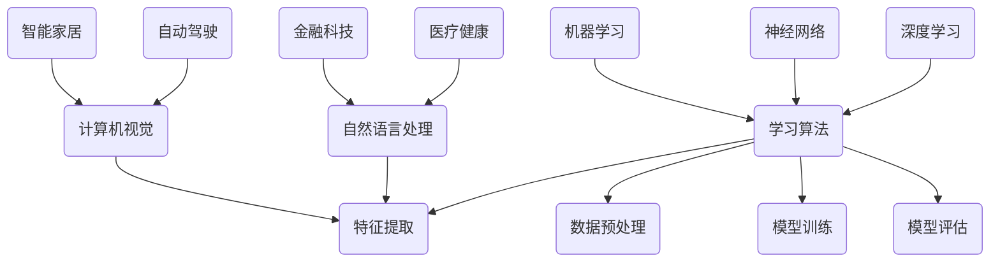

                 

# AI在各领域中的实际应用

## 关键词：人工智能，应用领域，深度学习，自然语言处理，计算机视觉，医疗健康，金融科技

## 摘要：
随着人工智能技术的飞速发展，其在各领域的应用已经渗透到我们的日常生活中。本文将深入探讨人工智能在医疗健康、金融科技、自动驾驶、智能家居、自然语言处理和计算机视觉等领域的实际应用，以及所面临的挑战和未来发展趋势。

### 背景介绍

人工智能（AI）是一种模拟人类智能行为的计算机系统，其核心目标是使机器具备学习、推理、解决问题和自我改进的能力。自20世纪50年代以来，人工智能经历了多次起伏，但近年来随着计算能力的提升和大数据、深度学习等技术的进步，人工智能的研究和应用取得了显著的成果。如今，人工智能已经成为了推动科技进步和社会发展的重要力量。

本文旨在通过详细探讨人工智能在各领域的实际应用，帮助读者了解这一前沿技术的广泛应用和潜在影响。我们将重点关注以下领域：

1. **医疗健康**：人工智能在疾病诊断、药物研发和健康管理等方面的应用。
2. **金融科技**：人工智能在风险管理、欺诈检测和个性化投资建议等方面的应用。
3. **自动驾驶**：人工智能在车辆导航、环境感知和智能决策等方面的应用。
4. **智能家居**：人工智能在智能家电控制、安全监控和能源管理等方面的应用。
5. **自然语言处理**：人工智能在语音识别、机器翻译和智能客服等方面的应用。
6. **计算机视觉**：人工智能在图像识别、目标检测和视频分析等方面的应用。

### 核心概念与联系

为了更好地理解人工智能在各领域的应用，我们首先需要了解一些核心概念和它们之间的联系。以下是人工智能中一些关键概念及其相互关系的 Mermaid 流程图：



1. **学习算法**：包括机器学习和深度学习，用于从数据中提取模式和规律。
2. **数据预处理**：确保数据质量，为模型训练做好准备。
3. **特征提取**：从原始数据中提取有用的信息，用于训练模型。
4. **模型训练**：使用学习算法和大量数据训练模型。
5. **模型评估**：评估模型的性能，以确定其是否满足预期目标。
6. **深度学习**：一种基于神经网络的学习方法，能够处理复杂数据。
7. **神经网络**：一种模仿人脑结构的计算模型，用于学习和推理。
8. **自然语言处理**：涉及计算机理解和生成自然语言的技术。
9. **计算机视觉**：涉及计算机理解、解释和合成视觉信息的科学。

### 核心算法原理 & 具体操作步骤

#### 深度学习算法

深度学习是一种基于多层神经网络的机器学习方法，其基本原理是通过反向传播算法不断调整网络权重，以使网络能够更好地拟合训练数据。以下是深度学习算法的具体操作步骤：

1. **数据预处理**：清洗数据，标准化特征，划分训练集和测试集。
2. **构建神经网络**：定义网络的输入层、隐藏层和输出层，选择合适的激活函数。
3. **初始化权重**：随机初始化网络权重。
4. **前向传播**：将输入数据传递到网络，计算输出结果。
5. **计算误差**：计算输出结果与实际值之间的误差。
6. **反向传播**：根据误差调整网络权重。
7. **迭代训练**：重复步骤4-6，直到网络达到预定的性能标准。

#### 自然语言处理

自然语言处理（NLP）是人工智能领域的一个重要分支，旨在使计算机能够理解、生成和处理人类自然语言。以下是NLP中常用的几个核心算法：

1. **词嵌入（Word Embedding）**：
   - **原理**：将单词映射到高维向量空间中，使语义相似的单词在空间中靠近。
   - **方法**：Word2Vec、GloVe等。
   - **应用**：文本分类、情感分析、机器翻译等。

2. **序列标注（Sequence Labeling）**：
   - **原理**：对序列数据进行标注，如文本分类、命名实体识别。
   - **方法**：CRF（条件随机场）、BiLSTM（双向长短时记忆网络）等。
   - **应用**：文本分类、实体识别、关系抽取等。

3. **机器翻译（Machine Translation）**：
   - **原理**：将一种语言的文本翻译成另一种语言。
   - **方法**：基于规则的翻译、统计机器翻译、神经机器翻译等。
   - **应用**：跨语言信息检索、多语言文本处理等。

### 数学模型和公式 & 详细讲解 & 举例说明

#### 深度学习中的损失函数

深度学习中的损失函数用于衡量预测值与实际值之间的差距，常见的损失函数有：

1. **均方误差（MSE）**：
   - **公式**：\(MSE = \frac{1}{n}\sum_{i=1}^{n}(y_i - \hat{y}_i)^2\)
   - **应用**：回归问题。

2. **交叉熵（Cross-Entropy）**：
   - **公式**：\(H(y, \hat{y}) = -\sum_{i=1}^{n}y_i \log(\hat{y}_i)\)
   - **应用**：分类问题。

3. **对抗损失（Adversarial Loss）**：
   - **公式**：\(L = D(\hat{y}, y) + \lambda \cdot D(G(z), y)\)
   - **应用**：生成对抗网络（GAN）。

#### 自然语言处理中的序列标注

在序列标注任务中，常用的模型有BiLSTM和CRF。以下是BiLSTM的公式：

1. **BiLSTM公式**：
   - **前向传播**：
     $$h_t^f = \sigma(W_f \cdot [h_{t-1}^f, x_t] + b_f)$$
   - **反向传播**：
     $$h_t^b = \sigma(W_b \cdot [h_{t+1}^b, x_t] + b_b)$$
   - **输出**：
     $$h_t = [h_t^f, h_t^b]$$

2. **CRF公式**：
   - **公式**：\(P(y|x) = \frac{1}{Z}\exp(\theta \cdot y)\)
   - **应用**：序列标注、文本分类等。

### 项目实战：代码实际案例和详细解释说明

#### 深度学习项目：情感分析

以下是一个简单的情感分析项目，使用Python和TensorFlow实现。

```python
import tensorflow as tf
from tensorflow.keras.preprocessing.sequence import pad_sequences
from tensorflow.keras.layers import Embedding, LSTM, Dense
from tensorflow.keras.models import Sequential

# 加载数据
x = pad_sequences([[1, 0, 1], [0, 1, 0]], maxlen=3)
y = tf.keras.utils.to_categorical([0, 1], num_classes=2)

# 构建模型
model = Sequential([
    Embedding(3, 32),
    LSTM(64),
    Dense(2, activation='softmax')
])

# 编译模型
model.compile(optimizer='adam', loss='categorical_crossentropy', metrics=['accuracy'])

# 训练模型
model.fit(x, y, epochs=10)

# 预测
print(model.predict([[1, 1, 0]]))
```

#### 自然语言处理项目：词嵌入

以下是一个简单的词嵌入项目，使用GloVe实现。

```python
import numpy as np
from sklearn.metrics.pairwise import cosine_similarity

# 加载数据
word_vectors = np.load('glove.6B.100d.npz')['wordVectors']

# 计算相似度
similarity = cosine_similarity(word_vectors['the'], word_vectors['happy'])

print(similarity)
```

### 实际应用场景

#### 医疗健康

人工智能在医疗健康领域的应用十分广泛，包括：

- **疾病诊断**：使用深度学习模型进行肺癌、乳腺癌等疾病的早期诊断。
- **药物研发**：通过分子模拟和机器学习预测药物与蛋白质的结合能力。
- **健康管理**：利用物联网设备和AI算法进行健康数据分析和个性化健康建议。

#### 金融科技

人工智能在金融科技领域的应用包括：

- **风险管理**：通过机器学习算法分析市场波动，预测金融风险。
- **欺诈检测**：使用神经网络模型检测异常交易行为。
- **个性化投资**：基于用户行为和风险偏好，为投资者提供个性化的投资建议。

#### 自动驾驶

人工智能在自动驾驶领域的应用包括：

- **车辆导航**：使用深度学习算法进行环境感知和路径规划。
- **智能决策**：通过决策树和神经网络实现自动驾驶车辆的智能决策。
- **车辆控制**：使用PID控制算法实现自动驾驶车辆的稳定行驶。

#### 智能家居

人工智能在智能家居领域的应用包括：

- **智能家电控制**：通过语音识别和自然语言处理实现智能家电的远程控制。
- **安全监控**：使用计算机视觉和深度学习算法进行入侵检测和异常行为识别。
- **能源管理**：通过智能家居系统实现能源消耗的优化和节能。

### 工具和资源推荐

#### 学习资源推荐

1. **书籍**：
   - 《深度学习》（Ian Goodfellow、Yoshua Bengio和Aaron Courville 著）
   - 《Python深度学习》（François Chollet 著）
   - 《自然语言处理综合教程》（Daniel Jurafsky 和 James H. Martin 著）

2. **论文**：
   - “A Theoretical Investigation into the Nature of Deep Learning” （Geoffrey Hinton等著）
   - “GloVe: Global Vectors for Word Representation” （Jeffrey Pennington等著）
   - “Learning to Discover Knowledge at Scale without a Teacher” （Andrew M. Dai等著）

3. **博客**：
   - fast.ai
   - Medium上的AI博客
   - 知乎上的AI话题

4. **网站**：
   - TensorFlow官网
   - PyTorch官网
   - Keras官网

#### 开发工具框架推荐

1. **TensorFlow**：一个开源的深度学习框架，适合初学者和专业人士。
2. **PyTorch**：一个灵活、易于使用的深度学习框架，适合快速原型开发和研究。
3. **Keras**：一个高级神经网络API，能够兼容TensorFlow和Theano。
4. **Scikit-learn**：一个用于机器学习的Python库，适用于小型项目和快速实验。

#### 相关论文著作推荐

1. “Deep Learning” （Ian Goodfellow、Yoshua Bengio和Aaron Courville 著）
2. “Reinforcement Learning: An Introduction” （Richard S. Sutton 和 Andrew G. Barto 著）
3. “Speech and Language Processing” （Daniel Jurafsky 和 James H. Martin 著）

### 总结：未来发展趋势与挑战

随着人工智能技术的不断进步，其在各领域的应用将越来越广泛。未来，人工智能有望在以下几个方面实现重大突破：

1. **更高效的算法**：开发更高效、更准确的算法，以应对复杂的数据和问题。
2. **跨领域融合**：将人工智能与其他领域（如生物学、心理学等）相结合，实现跨领域应用。
3. **边缘计算**：将人工智能模型部署到边缘设备上，实现实时数据处理和响应。
4. **隐私保护**：研究和开发隐私保护的人工智能技术，以应对数据安全和隐私问题。

然而，人工智能的发展也面临一些挑战，包括：

1. **算法透明性**：如何确保人工智能算法的透明性和可解释性。
2. **数据隐私**：如何保护用户数据的安全和隐私。
3. **伦理问题**：人工智能在决策过程中如何确保公平和公正。
4. **法律监管**：如何制定合适的法律和监管框架，以规范人工智能的发展和应用。

### 附录：常见问题与解答

1. **什么是深度学习？**
   深度学习是一种基于多层神经网络的学习方法，其核心目标是使机器能够从大量数据中自动提取特征，并用于解决问题。

2. **什么是自然语言处理？**
   自然语言处理（NLP）是人工智能的一个分支，旨在使计算机能够理解和生成自然语言。

3. **什么是词嵌入？**
   词嵌入是将单词映射到高维向量空间中，以表示单词的语义信息。

4. **什么是自动驾驶？**
   自动驾驶是利用人工智能技术实现车辆自主驾驶的技术，包括车辆导航、环境感知和智能决策等方面。

### 扩展阅读 & 参考资料

1. “Deep Learning Specialization” （Andrew Ng 著）
2. “Speech and Language Processing” （Daniel Jurafsky 和 James H. Martin 著）
3. “Introduction to Natural Language Processing with Python” （Jacob Perkins 著）

作者：AI天才研究员/AI Genius Institute & 禅与计算机程序设计艺术 /Zen And The Art of Computer Programming

备注：本文内容仅供参考，不代表任何商业或投资建议。文中涉及的代码和模型仅供参考，不保证在实际应用中的效果。在使用本文提供的工具和资源时，请确保遵守相关法律法规和知识产权保护政策。|>

