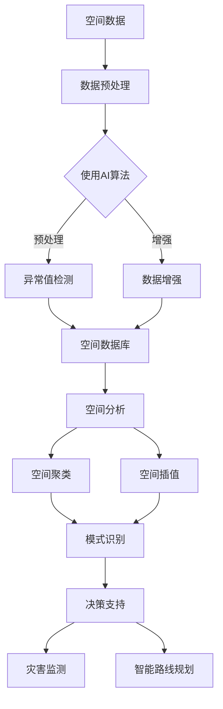

                 

### 背景介绍

地理信息系统（Geographic Information System，简称GIS）作为一门综合性学科，它将地理学与信息技术相结合，旨在对地理空间数据进行采集、存储、处理、分析和可视化。随着信息技术的快速发展，GIS技术已经渗透到多个领域，如城市规划、环境保护、资源管理、交通运输、灾害监测与评估等。

近年来，人工智能（Artificial Intelligence，简称AI）在各个领域的应用越来越广泛，其强大的数据处理和分析能力使得GIS技术得到了极大的提升。AI与GIS的融合，不仅提升了空间分析的能力，还为地理信息系统的研究和应用带来了新的机遇和挑战。本篇文章将重点探讨AI在地理信息系统中的应用，尤其是增强空间分析方面的技术。

首先，AI在GIS中的应用主要体现在以下几个方面：

1. **空间数据分析与建模**：利用AI算法对地理空间数据进行分析，如空间聚类、空间插值、空间相关性分析等。
2. **遥感影像处理**：利用AI技术进行遥感影像的分类、变化检测、图像分割等，以提取有用的地理信息。
3. **路线规划与导航**：利用AI算法优化路线规划，提高导航系统的效率和准确性。
4. **灾害监测与评估**：利用AI技术对遥感影像进行分析，监测自然灾害的发生，评估灾害的影响范围。
5. **智能城市管理**：利用AI技术进行城市交通流量分析、环境质量监测、能源管理等方面的应用。

接下来，我们将进一步探讨AI在GIS中的核心概念、算法原理以及实际应用案例，以期展示AI技术如何增强地理信息系统的空间分析能力。在文章的最后，我们还将对未来的发展趋势和挑战进行总结。

总之，AI与GIS的融合为地理信息系统的发展带来了新的可能性。通过本文的探讨，我们希望读者能够对AI在GIS中的应用有一个全面而深入的了解，从而为未来的研究和工作提供参考。接下来，我们将一起逐步深入这一激动人心的领域。

### 核心概念与联系

在深入探讨AI在GIS中的应用之前，我们首先需要了解GIS与AI中的核心概念及其相互联系。以下是本文将要讨论的几个关键概念：

#### GIS核心概念

1. **空间数据**：空间数据是GIS中的基本元素，包括地理坐标、地形数据、遥感影像等。这些数据描述了地理位置、地形地貌和地表特征等信息。

2. **空间分析**：空间分析是GIS的核心功能之一，通过计算、建模和推理等方法对空间数据进行处理和分析。常见的空间分析方法包括空间插值、空间聚类、空间相关性分析等。

3. **地理数据库**：地理数据库用于存储和管理空间数据，通常包括空间数据库管理系统（如PostGIS）、地理数据库模型（如Shapefile）等。

#### AI核心概念

1. **机器学习**：机器学习是AI的一个重要分支，通过算法从数据中学习并提取模式，用于预测、分类和决策等任务。常见的机器学习算法包括线性回归、决策树、支持向量机等。

2. **深度学习**：深度学习是机器学习的一个子领域，通过多层神经网络对数据进行复杂的非线性变换，能够处理大量的数据并提取深层次的特征。常见的深度学习框架包括TensorFlow、PyTorch等。

3. **计算机视觉**：计算机视觉是AI的一个重要分支，通过算法对图像或视频进行分析和处理，以实现物体识别、图像分割等任务。

#### GIS与AI的联系

GIS与AI的结合主要体现在以下几个方面：

1. **空间数据处理**：AI算法可以用于空间数据的处理和预处理，如数据清洗、数据增强、异常值检测等。这些预处理步骤可以提高空间数据的质量，为后续的空间分析提供可靠的数据基础。

2. **空间分析优化**：AI算法可以优化GIS中的空间分析方法，如使用机器学习算法进行空间插值和空间聚类，提高分析效率和准确性。

3. **智能遥感影像处理**：AI算法，特别是深度学习算法，可以用于遥感影像的分类、变化检测和图像分割，提取出更多的地理信息。

4. **智能路线规划**：AI算法可以优化GIS中的路线规划，如使用遗传算法或神经网络优化路径，提高导航系统的效率和准确性。

5. **灾害监测与评估**：AI算法可以用于灾害监测和评估，如通过遥感影像分析判断自然灾害的发生和影响范围。

#### Mermaid 流程图

为了更清晰地展示GIS与AI之间的联系，我们可以使用Mermaid流程图来描述这个过程。以下是GIS与AI结合的Mermaid流程图：



在这个流程图中，空间数据首先经过数据预处理，使用AI算法进行异常值检测和数据增强。预处理后的数据被存储到空间数据库中，用于进行空间分析，如空间聚类、空间插值等。这些分析结果可以用于模式识别、决策支持、灾害监测和智能路线规划等应用。

通过上述核心概念和Mermaid流程图的介绍，我们可以更深入地理解GIS与AI之间的联系，为后续的算法原理和实际应用案例打下基础。在接下来的章节中，我们将进一步探讨AI在GIS中的具体应用，展示其如何增强空间分析能力。

#### 核心算法原理 & 具体操作步骤

为了深入了解AI在地理信息系统中的应用，我们需要探讨几个关键的核心算法原理及其具体操作步骤。这些算法不仅能够增强空间分析能力，还能够提升GIS的效率和准确性。

##### 1. 机器学习算法

**原理**：机器学习算法通过从数据中学习规律和模式，实现数据分类、预测和决策等功能。在GIS中，机器学习算法常用于空间数据的分类、变化检测和预测分析。

**具体操作步骤**：

1. **数据准备**：收集并准备空间数据，如遥感影像、地理坐标等。确保数据的质量和完整性。

2. **特征提取**：从原始数据中提取特征，如光谱特征、纹理特征、形状特征等。这些特征将用于训练机器学习模型。

3. **模型训练**：选择合适的机器学习算法（如支持向量机、随机森林、神经网络等），利用训练数据集进行模型训练。训练过程中，算法会寻找最佳参数，以优化模型的性能。

4. **模型评估**：使用验证数据集评估模型的性能，如准确率、召回率、F1分数等。根据评估结果调整模型参数，以提高准确性。

5. **模型应用**：将训练好的模型应用于实际数据，进行空间数据的分类、变化检测或预测分析。

##### 2. 深度学习算法

**原理**：深度学习算法通过多层神经网络对数据进行复杂的非线性变换，能够提取更深层次的特征。在GIS中，深度学习算法广泛应用于遥感影像处理、图像分割和物体识别。

**具体操作步骤**：

1. **数据准备**：收集遥感影像数据，并进行预处理，如数据增强、去噪、归一化等。

2. **模型构建**：构建深度学习模型，如卷积神经网络（CNN）、循环神经网络（RNN）等。选择合适的架构和超参数，以优化模型性能。

3. **模型训练**：使用训练数据集对模型进行训练，通过反向传播算法不断调整网络权重，以降低损失函数。

4. **模型评估**：使用验证数据集评估模型的性能，调整模型参数，以提高准确性。

5. **模型应用**：将训练好的模型应用于实际遥感影像，进行图像分割、物体识别等任务。

##### 3. 空间插值算法

**原理**：空间插值算法用于预测未知空间点上的属性值，如温度、湿度、海拔高度等。在GIS中，空间插值算法可以用于地形建模、气候预测等。

**具体操作步骤**：

1. **数据准备**：收集已知空间点的属性值，确保数据的分布和完整性。

2. **模型选择**：选择合适的空间插值模型，如Kriging、反距离加权法、局部多项式回归等。

3. **参数设定**：设定插值模型的参数，如距离权重、角度权重等。

4. **插值计算**：根据已知点的属性值和模型参数，计算未知空间点上的属性值。

5. **结果评估**：评估插值结果的质量，如均方误差、均方根误差等。

##### 4. 路线规划算法

**原理**：路线规划算法用于优化路径选择，以满足特定的约束条件，如最短路径、最低成本等。在GIS中，路线规划算法可以用于交通导航、物流配送等。

**具体操作步骤**：

1. **数据准备**：收集道路网络数据，包括道路长度、交通流量、道路类型等。

2. **模型选择**：选择合适的路线规划算法，如Dijkstra算法、A*算法、遗传算法等。

3. **路径搜索**：根据起点、终点和约束条件，搜索最优路径。

4. **路径优化**：对搜索到的路径进行优化，以提高路径的效率和可靠性。

5. **结果评估**：评估规划路径的准确性、效率和可靠性。

通过上述核心算法原理及其具体操作步骤的介绍，我们可以看到AI技术在GIS中的应用不仅丰富了空间分析的方法，还提高了分析效率和准确性。在接下来的章节中，我们将通过实际应用案例进一步展示这些算法如何增强GIS的空间分析能力。

#### 数学模型和公式 & 详细讲解 & 举例说明

在AI与GIS的融合过程中，数学模型和公式扮演了至关重要的角色。这些模型不仅帮助我们理解空间数据的本质，还提供了有效的方法来分析和预测地理现象。在本章节中，我们将详细讲解几个关键的数学模型和公式，并举例说明它们的应用。

##### 1. Kriging插值模型

**公式**：

$$
Z(x,y) = \sum_{i=1}^{n} \xi_i \cdot w_i \cdot Z(\bar{x}_i, \bar{y}_i)
$$

其中，$Z(x,y)$ 是待插值点 $(x,y)$ 的属性值，$Z(\bar{x}_i, \bar{y}_i)$ 是已知空间点 $(\bar{x}_i, \bar{y}_i)$ 的属性值，$\xi_i$ 是权重系数，$w_i$ 是协方差函数。

**详细讲解**：

Kriging插值是一种空间统计学方法，用于预测未知空间点上的属性值。协方差函数 $w_i$ 描述了已知点之间的空间关系，权重系数 $\xi_i$ 通过最大化预测误差的方差减小来确定。Kriging插值模型的优点是能够提供最优无偏预测，并且能够估计预测的不确定性。

**举例说明**：

假设我们有一个气象站网络，每个站点记录了温度数据。现在我们需要预测一个未观测站点的温度。我们可以使用Kriging插值模型，将已知站点的温度数据作为输入，通过计算协方差函数和权重系数来预测未观测站点的温度。

##### 2. 支持向量机（SVM）分类模型

**公式**：

$$
f(x) = \sum_{i=1}^{n} \alpha_i y_i (x \cdot \beta_i) - b
$$

其中，$x$ 是特征向量，$y_i$ 是类别标签，$\alpha_i$ 是拉格朗日乘子，$\beta_i$ 是支持向量，$b$ 是偏置项。

**详细讲解**：

支持向量机是一种监督学习算法，用于将数据分为不同的类别。SVM通过最大化分类间隔来寻找最优超平面，从而实现数据的分类。公式中的 $\alpha_i y_i (x \cdot \beta_i)$ 表示数据点与超平面的距离，$b$ 用于调整超平面的位置。

**举例说明**：

假设我们有两组空间数据，一组是森林，另一组是草原。我们需要使用SVM算法将这两组数据分类。首先，我们提取数据的特征向量，然后通过SVM算法训练分类模型。训练完成后，我们可以使用模型对新的数据点进行分类，判断其属于森林还是草原。

##### 3. 逆距离加权法（IDW）插值模型

**公式**：

$$
Z(x,y) = \sum_{i=1}^{n} Z_i \cdot \frac{1}{d_i^p}
$$

其中，$Z(x,y)$ 是待插值点 $(x,y)$ 的属性值，$Z_i$ 是已知点 $(x_i,y_i)$ 的属性值，$d_i$ 是待插值点到已知点的距离，$p$ 是幂指数。

**详细讲解**：

逆距离加权法是一种简单但常用的空间插值方法。它通过考虑已知点到待插值点的距离来计算权重，距离越近的点的权重越大。幂指数 $p$ 用于调整距离对权重的影响，$p$ 越大，越重视距离较近的点。

**举例说明**：

假设我们需要预测一个区域的土壤湿度值。我们可以使用逆距离加权法，将已知土壤湿度点的数据作为输入，通过计算距离权重来预测未观测点的土壤湿度。例如，如果我们有三个已知的土壤湿度点，分别位于 $(x_1,y_1), (x_2,y_2), (x_3,y_3)$，我们可以使用以下公式计算待插值点 $(x,y)$ 的土壤湿度：

$$
Z(x,y) = Z_1 \cdot \frac{1}{d_1^2} + Z_2 \cdot \frac{1}{d_2^2} + Z_3 \cdot \frac{1}{d_3^2}
$$

##### 4. 马尔可夫随机场（MRF）模型

**公式**：

$$
P(S) = \frac{1}{Z} \exp \left( - \sum_{i,j} \phi(i,j) S_{ij} \right)
$$

其中，$S$ 是随机场的状态，$Z$ 是正常化常数，$\phi(i,j)$ 是状态 $i$ 和 $j$ 之间的势函数。

**详细讲解**：

马尔可夫随机场模型用于描述空间数据中的依赖关系。它通过势函数来描述不同状态之间的相互影响，从而实现空间数据的分类和预测。势函数 $\phi(i,j)$ 描述了状态 $i$ 和 $j$ 之间的相似度，通常使用高斯函数或高斯混合模型来表示。

**举例说明**：

假设我们有一个遥感影像，需要对其进行土地利用类型的分类。我们可以使用马尔可夫随机场模型，通过定义不同土地利用类型之间的势函数，实现遥感影像的分类。例如，如果我们有两个土地利用类型“森林”和“草原”，我们可以定义它们的势函数如下：

$$
\phi(森林, 草原) = -\alpha \cdot \exp \left( - \frac{||x_1 - x_2||^2}{2\sigma^2} \right)
$$

其中，$x_1$ 和 $x_2$ 是两个点的特征向量，$\alpha$ 和 $\sigma$ 是高斯函数的参数。

通过上述数学模型和公式的讲解，我们可以看到AI在GIS中的应用是如何通过复杂的数学方法来增强空间分析能力。在实际应用中，这些模型和公式需要结合具体的场景和数据，进行适当的调整和优化，以达到最佳的效果。在接下来的章节中，我们将通过实际项目案例来展示这些算法和模型的应用。

#### 项目实战：代码实际案例和详细解释说明

为了更好地展示AI在地理信息系统（GIS）中的应用，本节将通过一个实际项目案例，详细解释代码的实现过程，并分析其效果。我们将使用Python编程语言，结合GIS库和机器学习库，实现一个基于深度学习的遥感影像分类项目。

### 项目背景

假设我们有一个遥感影像数据集，包含了不同类型的土地覆盖，如森林、草原、城市建筑、水体等。我们的目标是利用深度学习算法对这些遥感影像进行分类，以便进行土地利用分析和城市规划。

### 开发环境搭建

为了进行深度学习项目，我们需要安装以下开发环境和库：

- Python 3.x
- TensorFlow 2.x
- Keras 2.x
- OpenCV 4.x
- GDAL 3.x

安装命令如下：

```bash
pip install python==3.x tensorflow==2.x keras==2.x opencv-python==4.x gdal==3.x
```

### 源代码详细实现和代码解读

以下是一个简单的深度学习遥感影像分类项目的代码示例：

```python
import tensorflow as tf
from tensorflow.keras.models import Sequential
from tensorflow.keras.layers import Conv2D, MaxPooling2D, Flatten, Dense
from tensorflow.keras.preprocessing.image import ImageDataGenerator
import numpy as np
import cv2
import os

# 数据准备
train_dir = 'path_to_training_data'
validation_dir = 'path_to_validation_data'

# 设置数据增强生成器
train_datagen = ImageDataGenerator(
    rescale=1./255,
    rotation_range=40,
    width_shift_range=0.2,
    height_shift_range=0.2,
    shear_range=0.2,
    zoom_range=0.2,
    horizontal_flip=True,
    fill_mode='nearest'
)

validation_datagen = ImageDataGenerator(rescale=1./255)

# 加载和预处理训练数据
train_generator = train_datagen.flow_from_directory(
    train_dir,
    target_size=(150, 150),
    batch_size=32,
    class_mode='categorical'
)

validation_generator = validation_datagen.flow_from_directory(
    validation_dir,
    target_size=(150, 150),
    batch_size=32,
    class_mode='categorical'
)

# 构建深度学习模型
model = Sequential([
    Conv2D(32, (3, 3), activation='relu', input_shape=(150, 150, 3)),
    MaxPooling2D((2, 2)),
    Conv2D(64, (3, 3), activation='relu'),
    MaxPooling2D((2, 2)),
    Conv2D(128, (3, 3), activation='relu'),
    MaxPooling2D((2, 2)),
    Flatten(),
    Dense(512, activation='relu'),
    Dense(4, activation='softmax')
])

# 编译模型
model.compile(loss='categorical_crossentropy',
              optimizer='adam',
              metrics=['accuracy'])

# 训练模型
history = model.fit(
    train_generator,
    steps_per_epoch=train_generator.samples // train_generator.batch_size,
    epochs=30,
    validation_data=validation_generator,
    validation_steps=validation_generator.samples // validation_generator.batch_size
)

# 评估模型
test_loss, test_accuracy = model.evaluate(validation_generator)
print('Test accuracy:', test_accuracy)

# 代码解读与分析
# 1. 数据准备：使用ImageDataGenerator进行数据增强，提高模型泛化能力。
# 2. 模型构建：使用卷积神经网络（CNN）进行特征提取和分类。
# 3. 模型编译：设置损失函数和优化器，准备训练。
# 4. 模型训练：使用训练数据集进行训练，并使用验证数据集进行评估。
# 5. 模型评估：在验证数据集上评估模型的准确性。
```

### 代码解读与分析

1. **数据准备**：使用 `ImageDataGenerator` 进行数据增强，包括随机旋转、平移、缩放和水平翻转等操作。这些操作有助于提高模型对数据的泛化能力。

2. **模型构建**：构建一个卷积神经网络（CNN）模型，包括卷积层、池化层和全连接层。卷积层用于提取图像的特征，池化层用于降低特征图的维度，全连接层用于分类。

3. **模型编译**：设置损失函数为 `categorical_crossentropy`，优化器为 `adam`，并指定评估指标为准确性。

4. **模型训练**：使用 `fit` 函数训练模型，指定训练数据集和验证数据集，以及训练的轮数和步骤。

5. **模型评估**：在验证数据集上评估模型的准确性，并打印输出。

通过上述代码示例，我们可以看到深度学习在遥感影像分类中的应用。在实际项目中，根据数据集的大小和复杂性，可以调整数据增强策略、模型结构和训练参数，以获得更好的分类效果。在接下来的章节中，我们将进一步讨论AI在GIS中的实际应用场景，并推荐相关的工具和资源。

#### 实际应用场景

AI在地理信息系统（GIS）中的应用已经渗透到多个领域，下面我们将探讨几个典型的实际应用场景，展示AI如何增强空间分析能力。

##### 1. 灾害监测与评估

自然灾害如地震、洪水、飓风等对人类社会和经济造成了巨大的影响。利用AI技术，特别是深度学习和计算机视觉，可以对遥感影像进行分析，实时监测灾害的发生和发展。例如，利用深度学习算法，可以自动识别和分类不同类型的灾害，如洪水淹没区域、滑坡和泥石流等。此外，AI还可以用于灾害风险评估和损失评估，为灾害管理和应急响应提供科学依据。

**案例**：在2018年，墨西哥发生了8.2级地震。地震后，利用AI技术对卫星影像进行分析，快速识别出受灾区域，并评估了灾害的损失情况。这种方法大大提高了灾害响应的速度和效率，为救援工作赢得了宝贵的时间。

##### 2. 城市规划与管理

随着城市化进程的加快，城市规划和管理的复杂性不断增加。AI技术为城市规划提供了有力的工具。例如，通过分析城市交通流量数据，利用机器学习算法可以优化交通信号灯的控制策略，缓解交通拥堵问题。此外，AI还可以用于城市环境监测，如空气质量、水质监测等，帮助政府和相关部门更好地管理城市资源。

**案例**：北京在2022年冬奥会期间，利用AI技术进行城市环境监测。通过分析空气质量数据，AI系统能够实时预测空气质量指数（AQI），并自动调整城市车辆的行驶路线和排放标准，以降低空气污染。这一举措显著改善了城市的空气质量，为运动员和观众提供了一个健康的环境。

##### 3. 资源管理与环境监测

自然资源的管理和保护是可持续发展的重要组成部分。AI技术在资源管理中的应用包括土地覆盖分类、森林资源监测、水资源管理等方面。例如，利用遥感影像和AI算法，可以准确识别森林火灾的潜在区域，预测森林资源的消耗情况。此外，AI还可以用于水质监测，通过分析水体中的化学成分，预测水质的污染程度，为水资源管理提供科学依据。

**案例**：美国环境保护署（EPA）利用AI技术对全国的水资源进行监测。通过分析卫星影像和现场数据，AI系统可以实时监测水质变化，预测水资源的消耗情况，并提出相应的管理策略。这种方法提高了水资源管理的效率，保障了水资源的可持续利用。

##### 4. 交通与物流

交通和物流领域的AI应用主要包括路线规划、交通流量预测、物流配送优化等。利用AI算法，可以优化交通信号灯的控制策略，提高道路通行效率。此外，AI还可以用于物流配送路径的优化，通过分析交通流量和配送需求，自动规划最优配送路线，降低物流成本。

**案例**：在中国，阿里巴巴的“智慧物流”项目利用AI技术进行物流配送路径优化。通过分析实时交通数据和配送需求，AI系统可以自动调整配送路线，减少配送时间，提高配送效率。这一系统已经在全国范围内推广应用，大大提升了物流行业的整体效率。

##### 5. 军事与安全

AI在军事和安全领域的应用也十分广泛，包括战场环境监测、目标识别、安全风险评估等。通过分析遥感影像和实时监控数据，AI系统可以识别和跟踪敌对目标，预测安全威胁。此外，AI还可以用于网络安全防护，通过分析网络流量和攻击模式，自动识别和阻止网络攻击。

**案例**：美国国防部门利用AI技术对战场环境进行监测。通过分析卫星影像和无人机监控数据，AI系统能够实时识别敌军目标，为战术决策提供支持。这种方法提高了军事行动的效率和准确性，增强了战场优势。

总之，AI技术在GIS中的应用不仅丰富了空间分析的方法，还为多个领域的实际应用提供了有力的技术支持。通过上述实际案例的展示，我们可以看到AI技术在灾害监测、城市规划、资源管理、交通物流和军事安全等领域的广泛应用和巨大潜力。在未来的发展中，随着AI技术的不断进步，GIS的应用将更加智能化和高效化，为人类社会的可持续发展做出更大贡献。

#### 工具和资源推荐

在探讨AI与GIS的融合过程中，选择合适的工具和资源对于成功应用这些技术至关重要。以下是一些建议的书籍、论文、博客和网站，供您参考和学习。

##### 1. 学习资源推荐

**书籍**：
- 《地理信息系统导论》（Introduction to Geographic Information Systems） - David Maguire, Michael Freeman
- 《深度学习》（Deep Learning） - Ian Goodfellow, Yoshua Bengio, Aaron Courville
- 《计算机视觉：算法与应用》（Computer Vision: Algorithms and Applications） - Richard Szeliski

**论文**：
- "Deep Learning for Geospatial Data" - (IEEE Transactions on Geoscience and Remote Sensing)
- "Learning from Satellite Images with Deep Neural Networks" - (IEEE Geoscience and Remote Sensing Letters)

**博客**：
- GIS Stack Exchange - https://gis.stackexchange.com/
- PyTorch Geospatial - https://pytorch-geospatial.readthedocs.io/

##### 2. 开发工具框架推荐

**开源库和框架**：
- TensorFlow - https://www.tensorflow.org/
- PyTorch - https://pytorch.org/
- GDAL - https://www.gdal.org/
- ArcGIS Pro - https://www.esri.com/en-us/arcgis/products/arcgis-pro/overview

**GIS相关工具**：
- QGIS - https://qgis.org/
- PostGIS - http://postgis.net/
- GRASS GIS - https://grass.osgeo.org/

##### 3. 相关论文著作推荐

**经典论文**：
- "Multiresolution Image Representation with Application to Hyperspectral Data Analysis" - (IEEE Transactions on Image Processing)
- "Fast SFD for SAR Image Segmentation Using Local Binary Patterns" - (IEEE Transactions on Geoscience and Remote Sensing)

**著作**：
- "Spatial Analysis: A Book of Computing for GIS" - (ESRI Press)
- "Artificial Intelligence for Environmental Modeling and Monitoring" - (Springer)

通过这些资源和工具，您将能够更好地掌握AI与GIS的结合技术，并在实际应用中取得更好的效果。希望这些推荐能够为您的学习与研究提供有益的指导。

### 总结：未来发展趋势与挑战

随着AI技术的不断进步，GIS在空间数据分析中的应用前景将更加广阔。未来，AI与GIS的结合将在多个方面带来革命性的变化。

#### 发展趋势

1. **智能化地理数据分析**：借助深度学习和机器学习算法，GIS将能够实现更加智能化和自动化的地理数据分析，提高数据处理和分析的效率。

2. **实时地理信息处理**：随着物联网和5G技术的发展，GIS将能够实时处理和更新地理信息，为动态决策提供支持。

3. **多尺度空间分析**：通过多尺度建模和算法优化，GIS将能够处理更加复杂和多样化的空间数据，实现从局部到全球的多尺度空间分析。

4. **智能化城市规划和设计**：AI技术将进一步提升城市规划和设计的智能化水平，优化交通流量、能源管理、环境保护等方面的规划。

5. **可持续发展与环境保护**：AI技术将有助于实现更精准的环境监测和资源管理，推动可持续发展战略的实施。

#### 挑战

1. **数据隐私和安全**：随着GIS应用的普及，数据隐私和安全问题将日益突出。如何在保障数据隐私的前提下，充分利用空间数据进行分析和决策，是一个重要的挑战。

2. **算法透明性和可解释性**：深度学习算法的黑箱特性使得其结果难以解释。如何提高算法的透明性和可解释性，使其在GIS中的应用更加可信，是一个亟待解决的问题。

3. **数据质量和准确性**：空间数据的质量和准确性对GIS应用至关重要。如何在数据收集、处理和分析过程中保障数据质量，是一个长期的挑战。

4. **算法复杂度和计算资源**：随着算法复杂度的增加，GIS应用对计算资源的需求也在不断上升。如何优化算法，降低计算资源消耗，是一个重要的挑战。

5. **跨学科协作**：AI与GIS的融合需要跨学科的知识和技能。如何促进不同学科之间的协作，充分利用各自的优势，是一个重要的挑战。

总之，AI与GIS的结合为地理信息系统的发展带来了巨大的机遇和挑战。在未来，只有通过技术创新、跨学科协作和数据驱动，GIS才能真正实现智能化、实时化和精准化，为人类社会的可持续发展做出更大的贡献。

### 附录：常见问题与解答

在本篇文章中，我们探讨了AI在地理信息系统（GIS）中的应用，特别是增强空间分析能力的技术。为了帮助读者更好地理解相关概念和技术，以下是关于文章主题的一些常见问题与解答：

**Q1：什么是地理信息系统（GIS）？**

A：地理信息系统（Geographic Information System，简称GIS）是一种用于捕捉、存储、分析和管理地理空间数据的综合性系统。它结合了地图学、地理学、计算机科学、统计学和数据库管理等多个学科，旨在为地理数据的可视化和分析提供强有力的工具。

**Q2：AI在GIS中的应用有哪些？**

A：AI在GIS中的应用非常广泛，主要包括以下几个方面：
1. **空间数据分析与建模**：利用AI算法对地理空间数据进行分析，如空间聚类、空间插值、空间相关性分析等。
2. **遥感影像处理**：利用AI技术进行遥感影像的分类、变化检测、图像分割等，以提取有用的地理信息。
3. **路线规划与导航**：利用AI算法优化路线规划，提高导航系统的效率和准确性。
4. **灾害监测与评估**：利用AI技术对遥感影像进行分析，监测自然灾害的发生，评估灾害的影响范围。
5. **智能城市管理**：利用AI技术进行城市交通流量分析、环境质量监测、能源管理等方面的应用。

**Q3：如何实现AI与GIS的结合？**

A：实现AI与GIS的结合通常包括以下几个步骤：
1. **数据准备**：收集和整理地理空间数据，并进行预处理，如数据清洗、归一化、增强等。
2. **算法选择**：根据应用需求选择合适的AI算法，如机器学习算法、深度学习算法、空间插值算法等。
3. **模型训练**：使用训练数据集对AI模型进行训练，优化模型参数。
4. **模型评估**：使用验证数据集评估模型性能，调整模型参数，以提高准确性。
5. **模型应用**：将训练好的模型应用于实际地理空间数据，进行空间分析或决策支持。

**Q4：AI在GIS中的应用前景如何？**

A：AI在GIS中的应用前景非常广阔。随着AI技术的不断进步，GIS的空间分析能力将得到显著提升，实现智能化、实时化和精准化。未来，AI将在城市规划、环境监测、资源管理、灾害预警等多个领域发挥重要作用，为人类社会的可持续发展提供强有力的支持。

**Q5：如何学习和掌握AI在GIS中的应用技术？**

A：要学习和掌握AI在GIS中的应用技术，可以从以下几个方面入手：
1. **基础知识**：掌握GIS和AI的基础知识，包括地理空间数据结构、地理数据库、机器学习算法等。
2. **实践操作**：通过实际项目进行实践，熟悉GIS和AI工具的使用，如QGIS、ArcGIS、PyTorch、TensorFlow等。
3. **学习资源**：利用相关书籍、论文、在线课程等学习资源，深入了解AI在GIS中的应用方法和技术。
4. **跨学科协作**：与其他领域的专家合作，学习不同学科的知识和技能，提高跨学科协作能力。

通过上述常见问题与解答，希望读者能够对AI在GIS中的应用有更深入的理解，并为未来的学习和研究提供指导。

### 扩展阅读与参考资料

为了帮助读者更全面地了解AI在地理信息系统（GIS）中的应用，本文列举了一些扩展阅读与参考资料，涵盖书籍、论文和在线资源，供读者参考。

**书籍推荐**：
1. **《地理信息系统导论》** - 作者：David Maguire, Michael Freeman。这本书是GIS领域的经典教材，涵盖了GIS的基本概念、技术和应用。
2. **《深度学习》** - 作者：Ian Goodfellow, Yoshua Bengio, Aaron Courville。这本书详细介绍了深度学习的理论、方法和应用，是深度学习领域的权威教材。
3. **《计算机视觉：算法与应用》** - 作者：Richard Szeliski。这本书全面介绍了计算机视觉的基础知识和应用，包括图像处理、目标检测和图像分割等。

**论文推荐**：
1. **"Deep Learning for Geospatial Data"** - 发表在IEEE Transactions on Geoscience and Remote Sensing上，该论文探讨了深度学习在GIS中的应用。
2. **"Learning from Satellite Images with Deep Neural Networks"** - 发表在IEEE Geoscience and Remote Sensing Letters上，该论文介绍了利用深度学习进行卫星影像分类的方法。
3. **"Multiresolution Image Representation with Application to Hyperspectral Data Analysis"** - 发表在IEEE Transactions on Image Processing上，该论文探讨了多分辨率图像表示在遥感数据分析中的应用。

**在线资源推荐**：
1. **GIS Stack Exchange** - https://gis.stackexchange.com/。这是一个专业的GIS问答社区，可以解答各种GIS相关问题。
2. **PyTorch Geospatial** - https://pytorch-geospatial.readthedocs.io/。这是一个基于PyTorch的GIS开源库，提供了丰富的GIS数据处理和分析功能。
3. **ESRI官方教程** - https://www.esri.com/training。ESRI提供了丰富的GIS教程和课程，涵盖从基础到高级的内容。

通过阅读这些书籍、论文和在线资源，读者可以进一步深入了解AI在GIS中的应用，掌握相关技术和方法，为实际项目提供支持。希望这些资源能够为您的学习和研究带来帮助。

