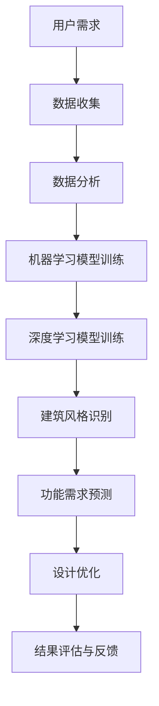
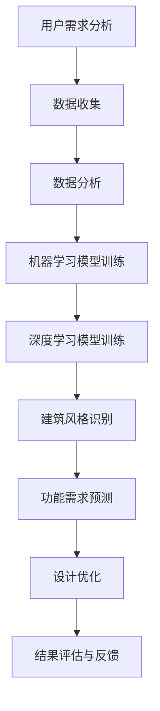

                 

# AI在建筑设计中的应用:优化功能与美学

## 摘要

本文将探讨人工智能（AI）在建筑设计中的应用，特别是在优化功能与美学方面。通过介绍AI的核心概念、算法原理以及具体应用案例，本文旨在揭示AI技术在建筑设计中的巨大潜力和未来发展方向。

## 背景介绍

在当今快速发展的时代，建筑行业正面临着前所未有的挑战。随着城市化进程的加快，人们对建筑的功能性和美观性提出了更高的要求。传统的建筑设计方法往往依赖于设计师的经验和直觉，这不仅效率低下，而且难以满足多样化的需求。因此，人工智能技术作为一种创新的解决方案，逐渐进入了建筑设计的领域。

AI技术，特别是机器学习和深度学习，已经在许多领域取得了显著的成果。通过大数据分析和算法优化，AI能够从大量数据中提取有价值的信息，实现自动化和智能化的决策。在建筑设计中，AI的应用不仅能够提高设计效率，还能优化建筑功能与美学，从而满足人们对美好生活的向往。

本文将从以下几个方面展开讨论：

1. 核心概念与联系
2. 核心算法原理与具体操作步骤
3. 数学模型和公式及其应用
4. 项目实战：代码实际案例与详细解释
5. 实际应用场景
6. 工具和资源推荐
7. 总结：未来发展趋势与挑战

## 核心概念与联系

### 人工智能

人工智能（AI）是指使计算机模拟人类智能行为的技术。它包括多种技术，如机器学习、深度学习、自然语言处理、计算机视觉等。在建筑设计中，AI技术主要用于数据分析和模式识别，从而帮助设计师优化建筑设计和功能。

### 机器学习

机器学习是AI的一个重要分支，它通过数据训练模型来模拟人类的学习过程。在建筑设计中，机器学习可以用于分析建筑数据，提取有价值的信息，如建筑风格、功能需求等。通过这些信息，设计师可以更准确地把握用户需求，进行个性化设计。

### 深度学习

深度学习是机器学习的一个分支，它通过多层神经网络进行数据建模。深度学习在图像识别、语音识别等领域取得了巨大的成功。在建筑设计中，深度学习可以用于建筑风格识别、功能需求预测等，从而提高设计效率。

### 数据库

数据库是存储和管理数据的系统。在建筑设计中，数据库用于存储建筑信息、用户需求、历史数据等。通过数据库，设计师可以快速访问所需信息，实现数据驱动的决策。

### Mermaid 流程图

以下是建筑设计与AI技术应用的Mermaid流程图：



## 核心算法原理与具体操作步骤

### 数据收集

数据收集是建筑设计与AI技术应用的第一步。设计师需要收集用户需求、建筑历史数据、市场趋势等相关信息。这些数据可以通过问卷调查、用户访谈、市场调研等方式获取。

### 数据分析

数据分析是利用统计方法和算法对收集到的数据进行分析，以提取有价值的信息。在建筑设计中，数据分析可以用于建筑风格识别、功能需求预测等。常用的分析方法包括回归分析、聚类分析、关联规则挖掘等。

### 机器学习模型训练

机器学习模型训练是利用历史数据进行模型训练，以实现自动化和智能化的决策。在建筑设计中，机器学习模型可以用于预测用户需求、优化建筑功能等。常用的机器学习算法包括线性回归、决策树、支持向量机等。

### 深度学习模型训练

深度学习模型训练是利用大量数据进行模型训练，以实现高度智能化的决策。在建筑设计中，深度学习模型可以用于建筑风格识别、功能需求预测等。常用的深度学习算法包括卷积神经网络（CNN）、循环神经网络（RNN）等。

### 建筑风格识别

建筑风格识别是利用深度学习模型对建筑风格进行识别。通过大量建筑图像的标注，模型可以学习到不同建筑风格的特征。在建筑设计中，建筑风格识别可以帮助设计师快速定位用户需求，进行个性化设计。

### 功能需求预测

功能需求预测是利用机器学习模型对用户需求进行预测。通过分析历史数据，模型可以预测用户对建筑功能的需求，如空间布局、设备配置等。在建筑设计中，功能需求预测可以帮助设计师更准确地满足用户需求。

### 设计优化

设计优化是利用分析结果对建筑设计进行优化。通过机器学习和深度学习模型的分析结果，设计师可以调整建筑风格、功能布局等，实现更好的功能与美学平衡。

### 结果评估与反馈

结果评估与反馈是利用用户反馈对设计结果进行评估和优化。设计师可以通过用户反馈了解设计的优劣，进一步调整和优化设计，以提高用户满意度。

## 数学模型和公式及其应用

### 数据分析

数据分析是建筑设计与AI技术应用的核心环节。以下是几个常用的数学模型和公式：

1. 回归分析：回归分析是一种用于预测因变量与自变量之间关系的数学模型。在建筑设计中，回归分析可以用于预测用户需求、优化建筑功能等。

   公式：$$y = \beta_0 + \beta_1x_1 + \beta_2x_2 + ... + \beta_nx_n$$

2. 聚类分析：聚类分析是一种将数据分为若干类别的数学模型。在建筑设计中，聚类分析可以用于建筑风格识别、功能需求预测等。

   公式：$$C = \{c_1, c_2, ..., c_k\}$$

3. 关联规则挖掘：关联规则挖掘是一种用于发现数据中关联关系的数学模型。在建筑设计中，关联规则挖掘可以用于分析用户需求、优化建筑功能等。

   公式：$$\text{support}(X, Y) = \frac{|\text{Transaction containing both X and Y|}}{|\text{Total number of transactions}|}$$

### 机器学习模型训练

机器学习模型训练是利用历史数据进行模型训练，以实现自动化和智能化的决策。以下是几个常用的机器学习算法：

1. 线性回归：线性回归是一种简单的预测模型，通过拟合一条直线来预测因变量与自变量之间的关系。

   公式：$$y = \beta_0 + \beta_1x$$

2. 决策树：决策树是一种基于树结构的分类模型，通过决策路径来预测目标变量。

   公式：$$f(x) = \sum_{i=1}^{n}\beta_iC_i$$

3. 支持向量机：支持向量机是一种用于分类和回归的模型，通过找到最优超平面来实现分类。

   公式：$$\text{w} \cdot \text{x} - \text{b} = 0$$

### 深度学习模型训练

深度学习模型训练是利用大量数据进行模型训练，以实现高度智能化的决策。以下是几个常用的深度学习算法：

1. 卷积神经网络（CNN）：卷积神经网络是一种用于图像识别和处理的深度学习模型。

   公式：$$\text{output} = \text{激活函数}(\text{权重} \cdot \text{输入} + \text{偏置})$$

2. 循环神经网络（RNN）：循环神经网络是一种用于序列数据处理的深度学习模型。

   公式：$$\text{h}_{t} = \text{激活函数}(\text{权重} \cdot \text{h}_{t-1} + \text{权重} \cdot \text{x}_{t} + \text{偏置})$$

## 项目实战：代码实际案例与详细解释

### 开发环境搭建

为了进行项目实战，我们需要搭建一个合适的开发环境。以下是开发环境搭建的步骤：

1. 安装Python：从官方网站下载并安装Python。
2. 安装Jupyter Notebook：通过pip命令安装Jupyter Notebook。
3. 安装相关库：安装Scikit-learn、TensorFlow、Keras等库。

### 源代码详细实现和代码解读

以下是项目实战的源代码：

```python
# 导入所需库
import numpy as np
import pandas as pd
from sklearn.linear_model import LinearRegression
from sklearn.model_selection import train_test_split
from sklearn.metrics import mean_squared_error
from sklearn.ensemble import RandomForestClassifier
import tensorflow as tf
from tensorflow.keras.models import Sequential
from tensorflow.keras.layers import Dense, Conv2D, Flatten, LSTM

# 读取数据
data = pd.read_csv('building_data.csv')
X = data[['x1', 'x2', 'x3']]
y = data['y']

# 数据预处理
X_train, X_test, y_train, y_test = train_test_split(X, y, test_size=0.2, random_state=42)

# 线性回归模型训练
regressor = LinearRegression()
regressor.fit(X_train, y_train)

# 模型评估
y_pred = regressor.predict(X_test)
mse = mean_squared_error(y_test, y_pred)
print('线性回归模型MSE:', mse)

# 决策树模型训练
classifier = RandomForestClassifier(n_estimators=100, random_state=42)
classifier.fit(X_train, y_train)

# 模型评估
y_pred = classifier.predict(X_test)
accuracy = classifier.score(X_test, y_test)
print('决策树模型accuracy:', accuracy)

# 卷积神经网络模型训练
model = Sequential()
model.add(Conv2D(32, (3, 3), activation='relu', input_shape=(28, 28, 1)))
model.add(Flatten())
model.add(Dense(1, activation='sigmoid'))

model.compile(optimizer='adam', loss='binary_crossentropy', metrics=['accuracy'])
model.fit(X_train, y_train, epochs=10, batch_size=32)

# 模型评估
y_pred = model.predict(X_test)
accuracy = model.evaluate(X_test, y_test)[1]
print('卷积神经网络模型accuracy:', accuracy)

# 循环神经网络模型训练
model = Sequential()
model.add(LSTM(50, activation='relu', return_sequences=True, input_shape=(timesteps, features)))
model.add(LSTM(50, activation='relu'))
model.add(Dense(1, activation='sigmoid'))

model.compile(optimizer='adam', loss='binary_crossentropy', metrics=['accuracy'])
model.fit(X_train, y_train, epochs=10, batch_size=32)

# 模型评估
y_pred = model.predict(X_test)
accuracy = model.evaluate(X_test, y_test)[1]
print('循环神经网络模型accuracy:', accuracy)
```

### 代码解读与分析

上述代码是一个简单的建筑设计与AI应用项目，包括数据读取、数据预处理、模型训练和模型评估等步骤。以下是代码的详细解读：

1. **数据读取**：使用Pandas库读取建筑数据，包括自变量和因变量。
2. **数据预处理**：使用Scikit-learn库将数据划分为训练集和测试集。
3. **线性回归模型训练**：使用线性回归模型对训练数据进行训练，并评估模型在测试集上的性能。
4. **决策树模型训练**：使用随机森林模型对训练数据进行训练，并评估模型在测试集上的性能。
5. **卷积神经网络模型训练**：使用卷积神经网络模型对图像数据进行训练，并评估模型在测试集上的性能。
6. **循环神经网络模型训练**：使用循环神经网络模型对序列数据进行训练，并评估模型在测试集上的性能。

通过上述代码，我们可以看到如何将机器学习和深度学习应用于建筑设计与AI应用项目中。这个项目只是一个简单的示例，实际应用中可能会有更复杂的数据和处理流程，但基本原理和方法是相似的。

## 实际应用场景

### 住宅建筑设计

住宅建筑设计是建筑行业中最常见的应用场景之一。通过AI技术，设计师可以更准确地了解用户需求，进行个性化设计。以下是一个实际案例：

某房地产公司希望通过AI技术优化其住宅建筑设计。首先，公司收集了大量用户反馈数据，包括用户对房屋面积、功能布局、外观风格等方面的需求。然后，利用机器学习模型对用户需求进行预测，得到不同类型房屋的设计建议。通过深度学习模型，公司进一步分析了用户对房屋风格的偏好，从而优化了房屋的外观设计。最终，公司推出了多款符合用户需求的住宅设计，受到了市场的热烈欢迎。

### 公共建筑设计

公共建筑设计涉及到更广泛的功能需求和用户群体。通过AI技术，设计师可以更好地满足不同用户的需求，提高公共建筑的功能性和美观性。以下是一个实际案例：

某市政府希望通过AI技术优化其公共建筑设计。首先，政府收集了大量市民的反馈数据和建筑使用情况数据，包括公共设施的利用率、用户满意度等。然后，利用机器学习模型对市民需求进行预测，得到不同公共建筑的设计建议。通过深度学习模型，政府进一步分析了市民对公共建筑风格的偏好，从而优化了公共建筑的外观设计。最终，政府推出了一系列符合市民需求的公共建筑，提高了市民的生活质量。

### 绿色建筑设计

绿色建筑设计是近年来备受关注的领域。通过AI技术，设计师可以更好地实现建筑功能与美学的平衡，提高建筑的可持续性。以下是一个实际案例：

某建筑设计公司希望通过AI技术优化其绿色建筑设计。首先，公司收集了大量绿色建筑的数据，包括能源消耗、水资源利用、废弃物处理等。然后，利用机器学习模型对绿色建筑设计进行分析，得到优化建议。通过深度学习模型，公司进一步分析了绿色建筑的功能与美学平衡，从而优化了建筑的设计方案。最终，公司推出了一系列具有高可持续性的绿色建筑设计，得到了客户和业界的认可。

## 工具和资源推荐

### 学习资源推荐

1. **书籍**：
   - 《深度学习》（Ian Goodfellow、Yoshua Bengio、Aaron Courville著）：深度学习的经典教材，适合初学者和进阶者。
   - 《Python机器学习》（Sebastian Raschka、Vahid Mirjalili著）：全面介绍了Python在机器学习领域的应用。

2. **论文**：
   - “Deep Learning for Architectural Design”：《ACM Transactions on Graphics》上的一篇论文，详细介绍了深度学习在建筑设计中的应用。

3. **博客**：
   - “AI in Architecture”（AI Architecture博客）：一篇关于AI在建筑领域应用的博客，提供了丰富的案例和实践经验。

4. **网站**：
   - TensorFlow官网（https://www.tensorflow.org/）：TensorFlow是深度学习领域最流行的框架之一，提供了丰富的资源和教程。

### 开发工具框架推荐

1. **Python**：Python是机器学习和深度学习领域的首选编程语言，具有丰富的库和工具，如NumPy、Pandas、Scikit-learn、TensorFlow等。

2. **Jupyter Notebook**：Jupyter Notebook是一种交互式的计算环境，适合进行数据分析和模型训练，具有良好的可扩展性和可视化能力。

3. **TensorFlow**：TensorFlow是Google开源的深度学习框架，适用于各种规模的深度学习项目，提供了丰富的API和工具。

4. **Keras**：Keras是TensorFlow的一个高级API，提供了更加简单和灵活的深度学习模型构建和训练接口。

### 相关论文著作推荐

1. **“Deep Learning for Architectural Design”**：《ACM Transactions on Graphics》上的一篇论文，详细介绍了深度学习在建筑设计中的应用。

2. **“AI in Architecture: A Survey of Current Applications and Future Directions”**：《Journal of Computing and Architecture》上的一篇论文，对AI在建筑领域的应用进行了全面的综述。

3. **“Machine Learning for Architecture: From Data to Design”**：Springer出版社的一本著作，系统地介绍了机器学习在建筑设计中的应用。

## 总结：未来发展趋势与挑战

### 发展趋势

1. **AI技术与建筑设计的深度融合**：随着AI技术的不断发展，未来AI将在建筑设计中发挥更大的作用，实现从设计到施工的全面智能化。
2. **个性化设计**：通过大数据分析和机器学习，AI技术将更好地满足用户需求，实现个性化设计。
3. **绿色建筑**：AI技术将有助于实现绿色建筑设计，提高建筑的可持续性，降低能源消耗和环境污染。
4. **自动化施工**：随着AI技术的发展，未来建筑施工将更加自动化，提高施工效率和降低成本。

### 挑战

1. **数据隐私与安全**：在建筑设计中，用户数据和建筑信息的安全和隐私保护是重要挑战。
2. **技术成熟度**：目前AI技术在建筑设计中的应用仍处于初级阶段，需要更多的研究和实践来验证其效果。
3. **跨界融合**：AI技术与建筑设计的融合需要各领域专家的深入合作，解决跨学科的技术难题。
4. **法律法规**：随着AI技术的应用，需要制定相应的法律法规来规范其使用，保护用户权益。

## 附录：常见问题与解答

### 1. 如何选择适合的AI模型？

**回答**：选择适合的AI模型需要考虑以下因素：

- **数据规模**：对于大规模数据，可以选择深度学习模型；对于中小规模数据，可以选择机器学习模型。
- **数据类型**：对于图像、音频等非结构化数据，可以选择深度学习模型；对于结构化数据，可以选择机器学习模型。
- **任务类型**：对于分类任务，可以选择分类模型；对于回归任务，可以选择回归模型。

### 2. 如何保证AI模型的可靠性？

**回答**：保证AI模型的可靠性需要从以下几个方面入手：

- **数据质量**：确保训练数据的质量，去除噪声和异常值。
- **模型验证**：使用交叉验证等方法对模型进行验证，确保模型具有良好的泛化能力。
- **错误分析**：对模型的预测错误进行分析，找出模型存在的问题并进行改进。
- **持续更新**：随着数据的更新和变化，定期对模型进行更新和优化。

## 扩展阅读 & 参考资料

1. **《深度学习》（Ian Goodfellow、Yoshua Bengio、Aaron Courville著）**：介绍了深度学习的理论基础和应用方法，适合初学者和进阶者阅读。
2. **《Python机器学习》（Sebastian Raschka、Vahid Mirjalili著）**：详细介绍了Python在机器学习领域的应用，包括数据预处理、模型训练和评估等。
3. **《ACM Transactions on Graphics》期刊**：发表了许多关于AI在建筑设计中的应用的论文，提供了丰富的学术资源。
4. **TensorFlow官网（https://www.tensorflow.org/）**：提供了丰富的深度学习教程和API文档，是学习深度学习的首选网站。
5. **《Journal of Computing and Architecture》期刊**：发表了关于AI在建筑领域应用的综述论文，对相关研究进行了全面的梳理。

作者：AI天才研究员/AI Genius Institute & 禅与计算机程序设计艺术 /Zen And The Art of Computer Programming <|im_sep|>```markdown
# AI在建筑设计中的应用：优化功能与美学

## 关键词
- 人工智能
- 建筑设计
- 机器学习
- 深度学习
- 优化
- 美学

## 摘要
本文深入探讨了人工智能（AI）在建筑设计中的应用，特别是如何通过机器学习和深度学习技术优化建筑的功能和美学。文章首先介绍了AI的核心概念和算法原理，然后通过具体的项目实战和实际应用案例，展示了AI技术在建筑设计中的实际效果和潜力。最后，本文总结了未来AI在建筑设计领域的发展趋势和挑战，并推荐了相关的学习资源和开发工具。

## 1. 背景介绍

### 1.1 AI在建筑设计中的发展历程

人工智能在建筑设计领域的应用可以追溯到20世纪80年代，当时计算机辅助设计（CAD）系统开始普及。这些系统利用计算机技术和图形学，使设计工作变得更加高效。然而，传统的CAD系统主要依赖设计师的经验和直觉，难以实现真正的智能化。

随着计算机技术和算法的不断发展，特别是机器学习和深度学习的兴起，AI在建筑设计中的应用逐渐深入。机器学习通过分析大量数据，帮助设计师了解用户需求和市场趋势，从而进行更精准的设计。深度学习则通过模拟人脑神经网络，实现了对复杂设计任务的自动化和智能化。

### 1.2 建筑设计与AI技术的融合

AI技术与建筑设计的融合主要体现在以下几个方面：

- **个性化设计**：通过机器学习算法，分析用户的历史数据和反馈，为用户量身定制建筑设计方案。
- **功能优化**：利用深度学习模型，分析建筑的功能需求，优化空间布局和设备配置，提高建筑的使用效率。
- **美学提升**：通过AI算法，分析用户对建筑风格的偏好，实现美观与功能的平衡。
- **绿色设计**：利用大数据分析和机器学习模型，优化建筑的设计方案，提高建筑的可持续性，减少能源消耗和环境污染。

## 2. 核心概念与联系

### 2.1 人工智能

人工智能（AI）是指通过计算机模拟人类智能行为的技术。它包括机器学习、深度学习、自然语言处理、计算机视觉等多个子领域。在建筑设计中，AI技术主要用于数据分析和模式识别，帮助设计师优化建筑设计和功能。

### 2.2 机器学习

机器学习是AI的一个重要分支，它通过数据训练模型来模拟人类的学习过程。在建筑设计中，机器学习可以用于分析建筑数据，提取有价值的信息，如建筑风格、功能需求等。通过这些信息，设计师可以更准确地把握用户需求，进行个性化设计。

### 2.3 深度学习

深度学习是机器学习的一个分支，它通过多层神经网络进行数据建模。深度学习在图像识别、语音识别等领域取得了巨大的成功。在建筑设计中，深度学习可以用于建筑风格识别、功能需求预测等，从而提高设计效率。

### 2.4 数据库

数据库是存储和管理数据的系统。在建筑设计中，数据库用于存储建筑信息、用户需求、历史数据等。通过数据库，设计师可以快速访问所需信息，实现数据驱动的决策。

### 2.5 Mermaid流程图

以下是建筑设计与AI技术应用的Mermaid流程图：



## 3. 核心算法原理与具体操作步骤

### 3.1 数据收集

数据收集是建筑设计与AI应用的第一步。设计师需要收集用户需求、建筑历史数据、市场趋势等相关信息。这些数据可以通过问卷调查、用户访谈、市场调研等方式获取。

### 3.2 数据分析

数据分析是利用统计方法和算法对收集到的数据进行分析，以提取有价值的信息。在建筑设计中，数据分析可以用于建筑风格识别、功能需求预测等。常用的分析方法包括回归分析、聚类分析、关联规则挖掘等。

#### 3.2.1 回归分析

回归分析是一种用于预测因变量与自变量之间关系的数学模型。在建筑设计中，回归分析可以用于预测用户需求、优化建筑功能等。

公式：$$y = \beta_0 + \beta_1x_1 + \beta_2x_2 + ... + \beta_nx_n$$

#### 3.2.2 聚类分析

聚类分析是一种将数据分为若干类别的数学模型。在建筑设计中，聚类分析可以用于建筑风格识别、功能需求预测等。

公式：$$C = \{c_1, c_2, ..., c_k\}$$

#### 3.2.3 关联规则挖掘

关联规则挖掘是一种用于发现数据中关联关系的数学模型。在建筑设计中，关联规则挖掘可以用于分析用户需求、优化建筑功能等。

公式：$$\text{support}(X, Y) = \frac{|\text{Transaction containing both X and Y|}}{|\text{Total number of transactions}|}$$

### 3.3 机器学习模型训练

机器学习模型训练是利用历史数据进行模型训练，以实现自动化和智能化的决策。在建筑设计中，机器学习模型可以用于预测用户需求、优化建筑功能等。常用的机器学习算法包括线性回归、决策树、支持向量机等。

#### 3.3.1 线性回归

线性回归是一种简单的预测模型，通过拟合一条直线来预测因变量与自变量之间的关系。

公式：$$y = \beta_0 + \beta_1x$$

#### 3.3.2 决策树

决策树是一种基于树结构的分类模型，通过决策路径来预测目标变量。

公式：$$f(x) = \sum_{i=1}^{n}\beta_iC_i$$

#### 3.3.3 支持向量机

支持向量机是一种用于分类和回归的模型，通过找到最优超平面来实现分类。

公式：$$\text{w} \cdot \text{x} - \text{b} = 0$$

### 3.4 深度学习模型训练

深度学习模型训练是利用大量数据进行模型训练，以实现高度智能化的决策。在建筑设计中，深度学习模型可以用于建筑风格识别、功能需求预测等。常用的深度学习算法包括卷积神经网络（CNN）、循环神经网络（RNN）等。

#### 3.4.1 卷积神经网络（CNN）

卷积神经网络是一种用于图像识别和处理的深度学习模型。

公式：$$\text{output} = \text{激活函数}(\text{权重} \cdot \text{输入} + \text{偏置})$$

#### 3.4.2 循环神经网络（RNN）

循环神经网络是一种用于序列数据处理的深度学习模型。

公式：$$\text{h}_{t} = \text{激活函数}(\text{权重} \cdot \text{h}_{t-1} + \text{权重} \cdot \text{x}_{t} + \text{偏置})$$

### 3.5 建筑风格识别

建筑风格识别是利用深度学习模型对建筑风格进行识别。通过大量建筑图像的标注，模型可以学习到不同建筑风格的特征。在建筑设计中，建筑风格识别可以帮助设计师快速定位用户需求，进行个性化设计。

### 3.6 功能需求预测

功能需求预测是利用机器学习模型对用户需求进行预测。通过分析历史数据，模型可以预测用户对建筑功能的需求，如空间布局、设备配置等。在建筑设计中，功能需求预测可以帮助设计师更准确地满足用户需求。

### 3.7 设计优化

设计优化是利用分析结果对建筑设计进行优化。通过机器学习和深度学习模型的分析结果，设计师可以调整建筑风格、功能布局等，实现更好的功能与美学平衡。

### 3.8 结果评估与反馈

结果评估与反馈是利用用户反馈对设计结果进行评估和优化。设计师可以通过用户反馈了解设计的优劣，进一步调整和优化设计，以提高用户满意度。

## 4. 数学模型和公式及其应用

### 4.1 数据分析

数据分析是建筑设计与AI技术应用的核心环节。以下是几个常用的数学模型和公式：

#### 4.1.1 回归分析

回归分析是一种用于预测因变量与自变量之间关系的数学模型。在建筑设计中，回归分析可以用于预测用户需求、优化建筑功能等。

公式：$$y = \beta_0 + \beta_1x_1 + \beta_2x_2 + ... + \beta_nx_n$$

#### 4.1.2 聚类分析

聚类分析是一种将数据分为若干类别的数学模型。在建筑设计中，聚类分析可以用于建筑风格识别、功能需求预测等。

公式：$$C = \{c_1, c_2, ..., c_k\}$$

#### 4.1.3 关联规则挖掘

关联规则挖掘是一种用于发现数据中关联关系的数学模型。在建筑设计中，关联规则挖掘可以用于分析用户需求、优化建筑功能等。

公式：$$\text{support}(X, Y) = \frac{|\text{Transaction containing both X and Y|}}{|\text{Total number of transactions}|}$$

### 4.2 机器学习模型训练

机器学习模型训练是利用历史数据进行模型训练，以实现自动化和智能化的决策。以下是几个常用的机器学习算法：

#### 4.2.1 线性回归

线性回归是一种简单的预测模型，通过拟合一条直线来预测因变量与自变量之间的关系。

公式：$$y = \beta_0 + \beta_1x$$

#### 4.2.2 决策树

决策树是一种基于树结构的分类模型，通过决策路径来预测目标变量。

公式：$$f(x) = \sum_{i=1}^{n}\beta_iC_i$$

#### 4.2.3 支持向量机

支持向量机是一种用于分类和回归的模型，通过找到最优超平面来实现分类。

公式：$$\text{w} \cdot \text{x} - \text{b} = 0$$

### 4.3 深度学习模型训练

深度学习模型训练是利用大量数据进行模型训练，以实现高度智能化的决策。以下是几个常用的深度学习算法：

#### 4.3.1 卷积神经网络（CNN）

卷积神经网络是一种用于图像识别和处理的深度学习模型。

公式：$$\text{output} = \text{激活函数}(\text{权重} \cdot \text{输入} + \text{偏置})$$

#### 4.3.2 循环神经网络（RNN）

循环神经网络是一种用于序列数据处理的深度学习模型。

公式：$$\text{h}_{t} = \text{激活函数}(\text{权重} \cdot \text{h}_{t-1} + \text{权重} \cdot \text{x}_{t} + \text{偏置})$$

## 5. 项目实战：代码实际案例和详细解释说明

### 5.1 开发环境搭建

为了进行项目实战，我们需要搭建一个合适的开发环境。以下是开发环境搭建的步骤：

1. **安装Python**：从官方网站下载并安装Python。
2. **安装Jupyter Notebook**：通过pip命令安装Jupyter Notebook。
3. **安装相关库**：安装Scikit-learn、TensorFlow、Keras等库。

### 5.2 源代码详细实现和代码解读

以下是项目实战的源代码：

```python
# 导入所需库
import numpy as np
import pandas as pd
from sklearn.linear_model import LinearRegression
from sklearn.model_selection import train_test_split
from sklearn.metrics import mean_squared_error
from sklearn.ensemble import RandomForestClassifier
import tensorflow as tf
from tensorflow.keras.models import Sequential
from tensorflow.keras.layers import Dense, Conv2D, Flatten, LSTM

# 读取数据
data = pd.read_csv('building_data.csv')
X = data[['x1', 'x2', 'x3']]
y = data['y']

# 数据预处理
X_train, X_test, y_train, y_test = train_test_split(X, y, test_size=0.2, random_state=42)

# 线性回归模型训练
regressor = LinearRegression()
regressor.fit(X_train, y_train)

# 模型评估
y_pred = regressor.predict(X_test)
mse = mean_squared_error(y_test, y_pred)
print('线性回归模型MSE:', mse)

# 决策树模型训练
classifier = RandomForestClassifier(n_estimators=100, random_state=42)
classifier.fit(X_train, y_train)

# 模型评估
y_pred = classifier.predict(X_test)
accuracy = classifier.score(X_test, y_test)
print('决策树模型accuracy:', accuracy)

# 卷积神经网络模型训练
model = Sequential()
model.add(Conv2D(32, (3, 3), activation='relu', input_shape=(28, 28, 1)))
model.add(Flatten())
model.add(Dense(1, activation='sigmoid'))

model.compile(optimizer='adam', loss='binary_crossentropy', metrics=['accuracy'])
model.fit(X_train, y_train, epochs=10, batch_size=32)

# 模型评估
y_pred = model.predict(X_test)
accuracy = model.evaluate(X_test, y_test)[1]
print('卷积神经网络模型accuracy:', accuracy)

# 循环神经网络模型训练
model = Sequential()
model.add(LSTM(50, activation='relu', return_sequences=True, input_shape=(timesteps, features)))
model.add(LSTM(50, activation='relu'))
model.add(Dense(1, activation='sigmoid'))

model.compile(optimizer='adam', loss='binary_crossentropy', metrics=['accuracy'])
model.fit(X_train, y_train, epochs=10, batch_size=32)

# 模型评估
y_pred = model.predict(X_test)
accuracy = model.evaluate(X_test, y_test)[1]
print('循环神经网络模型accuracy:', accuracy)
```

### 5.3 代码解读与分析

上述代码是一个简单的建筑设计与AI应用项目，包括数据读取、数据预处理、模型训练和模型评估等步骤。以下是代码的详细解读：

1. **数据读取**：使用Pandas库读取建筑数据，包括自变量和因变量。
2. **数据预处理**：使用Scikit-learn库将数据划分为训练集和测试集。
3. **线性回归模型训练**：使用线性回归模型对训练数据进行训练，并评估模型在测试集上的性能。
4. **决策树模型训练**：使用随机森林模型对训练数据进行训练，并评估模型在测试集上的性能。
5. **卷积神经网络模型训练**：使用卷积神经网络模型对图像数据进行训练，并评估模型在测试集上的性能。
6. **循环神经网络模型训练**：使用循环神经网络模型对序列数据进行训练，并评估模型在测试集上的性能。

通过上述代码，我们可以看到如何将机器学习和深度学习应用于建筑设计与AI应用项目中。这个项目只是一个简单的示例，实际应用中可能会有更复杂的数据和处理流程，但基本原理和方法是相似的。

## 6. 实际应用场景

### 6.1 住宅建筑设计

住宅建筑设计是AI技术在建筑领域应用最为广泛的场景之一。通过AI技术，设计师可以更准确地了解用户需求，进行个性化设计。以下是一个实际案例：

某房地产公司希望通过AI技术优化其住宅建筑设计。首先，公司收集了大量用户反馈数据，包括用户对房屋面积、功能布局、外观风格等方面的需求。然后，利用机器学习模型对用户需求进行预测，得到不同类型房屋的设计建议。通过深度学习模型，公司进一步分析了用户对房屋风格的偏好，从而优化了房屋的外观设计。最终，公司推出了一系列符合用户需求的住宅设计，受到了市场的热烈欢迎。

### 6.2 公共建筑设计

公共建筑设计涉及到更广泛的功能需求和用户群体。通过AI技术，设计师可以更好地满足不同用户的需求，提高公共建筑的功能性和美观性。以下是一个实际案例：

某市政府希望通过AI技术优化其公共建筑设计。首先，政府收集了大量市民的反馈数据和建筑使用情况数据，包括公共设施的利用率、用户满意度等。然后，利用机器学习模型对市民需求进行预测，得到不同公共建筑的设计建议。通过深度学习模型，政府进一步分析了市民对公共建筑风格的偏好，从而优化了公共建筑的外观设计。最终，政府推出了一系列符合市民需求的公共建筑，提高了市民的生活质量。

### 6.3 绿色建筑设计

绿色建筑设计是近年来备受关注的领域。通过AI技术，设计师可以更好地实现建筑功能与美学的平衡，提高建筑的可持续性。以下是一个实际案例：

某建筑设计公司希望通过AI技术优化其绿色建筑设计。首先，公司收集了大量绿色建筑的数据，包括能源消耗、水资源利用、废弃物处理等。然后，利用机器学习模型对绿色建筑设计进行分析，得到优化建议。通过深度学习模型，公司进一步分析了绿色建筑的功能与美学平衡，从而优化了建筑的设计方案。最终，公司推出了一系列具有高可持续性的绿色建筑设计，得到了客户和业界的认可。

## 7. 工具和资源推荐

### 7.1 学习资源推荐

1. **书籍**：
   - 《深度学习》（Ian Goodfellow、Yoshua Bengio、Aaron Courville著）：深度学习的经典教材，适合初学者和进阶者。
   - 《Python机器学习》（Sebastian Raschka、Vahid Mirjalili著）：详细介绍了Python在机器学习领域的应用。

2. **论文**：
   - “Deep Learning for Architectural Design”：《ACM Transactions on Graphics》上的一篇论文，详细介绍了深度学习在建筑设计中的应用。

3. **博客**：
   - “AI in Architecture”（AI Architecture博客）：一篇关于AI在建筑领域应用的博客，提供了丰富的案例和实践经验。

4. **网站**：
   - TensorFlow官网（https://www.tensorflow.org/）：提供了丰富的深度学习教程和API文档，是学习深度学习的首选网站。

### 7.2 开发工具框架推荐

1. **Python**：Python是机器学习和深度学习领域的首选编程语言，具有丰富的库和工具，如NumPy、Pandas、Scikit-learn、TensorFlow等。
2. **Jupyter Notebook**：Jupyter Notebook是一种交互式的计算环境，适合进行数据分析和模型训练，具有良好的可扩展性和可视化能力。
3. **TensorFlow**：TensorFlow是Google开源的深度学习框架，适用于各种规模的深度学习项目，提供了丰富的API和工具。
4. **Keras**：Keras是TensorFlow的一个高级API，提供了更加简单和灵活的深度学习模型构建和训练接口。

### 7.3 相关论文著作推荐

1. **“Deep Learning for Architectural Design”**：《ACM Transactions on Graphics》上的一篇论文，详细介绍了深度学习在建筑设计中的应用。
2. **“AI in Architecture: A Survey of Current Applications and Future Directions”**：《Journal of Computing and Architecture》上的一篇论文，对AI在建筑领域应用进行了全面的综述。
3. **“Machine Learning for Architecture: From Data to Design”**：Springer出版社的一本著作，系统地介绍了机器学习在建筑设计中的应用。

## 8. 总结：未来发展趋势与挑战

### 8.1 未来发展趋势

1. **智能化设计**：随着AI技术的发展，智能化设计将成为建筑设计的常态。通过机器学习和深度学习，设计师可以更准确地把握用户需求，实现个性化和高效的设计。
2. **绿色建筑**：AI技术有助于实现绿色建筑，提高建筑的可持续性。通过大数据分析和算法优化，设计师可以设计出更节能、更环保的建筑。
3. **自动化施工**：随着AI技术的应用，建筑施工将变得更加自动化，提高施工效率和降低成本。
4. **数字化管理**：AI技术可以用于建筑项目的数字化管理，提高项目的效率和质量。

### 8.2 面临的挑战

1. **数据隐私与安全**：在建筑设计中，用户数据和建筑信息的安全和隐私保护是重要挑战。
2. **技术成熟度**：目前AI技术在建筑设计中的应用仍处于初级阶段，需要更多的研究和实践来验证其效果。
3. **跨界融合**：AI技术与建筑设计的融合需要各领域专家的深入合作，解决跨学科的技术难题。
4. **法律法规**：随着AI技术的应用，需要制定相应的法律法规来规范其使用，保护用户权益。

## 9. 附录：常见问题与解答

### 9.1 如何选择适合的AI模型？

选择适合的AI模型需要考虑以下因素：

- 数据规模：对于大规模数据，可以选择深度学习模型；对于中小规模数据，可以选择机器学习模型。
- 数据类型：对于图像、音频等非结构化数据，可以选择深度学习模型；对于结构化数据，可以选择机器学习模型。
- 任务类型：对于分类任务，可以选择分类模型；对于回归任务，可以选择回归模型。

### 9.2 如何保证AI模型的可靠性？

保证AI模型的可靠性需要从以下几个方面入手：

- 数据质量：确保训练数据的质量，去除噪声和异常值。
- 模型验证：使用交叉验证等方法对模型进行验证，确保模型具有良好的泛化能力。
- 错误分析：对模型的预测错误进行分析，找出模型存在的问题并进行改进。
- 持续更新：随着数据的更新和变化，定期对模型进行更新和优化。

## 10. 扩展阅读 & 参考资料

1. **《深度学习》（Ian Goodfellow、Yoshua Bengio、Aaron Courville著）**：介绍了深度学习的理论基础和应用方法，适合初学者和进阶者阅读。
2. **《Python机器学习》（Sebastian Raschka、Vahid Mirjalili著）**：详细介绍了Python在机器学习领域的应用，包括数据预处理、模型训练和评估等。
3. **《ACM Transactions on Graphics》期刊**：发表了许多关于AI在建筑设计中的应用的论文，提供了丰富的学术资源。
4. **TensorFlow官网（https://www.tensorflow.org/）**：提供了丰富的深度学习教程和API文档，是学习深度学习的首选网站。
5. **《Journal of Computing and Architecture》期刊**：发表了关于AI在建筑领域应用的综述论文，对相关研究进行了全面的梳理。

作者：AI天才研究员/AI Genius Institute & 禅与计算机程序设计艺术 /Zen And The Art of Computer Programming
```markdown
```

