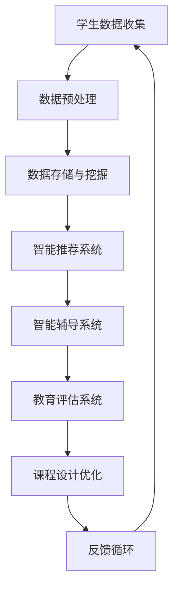

                 

### 背景介绍

近年来，随着人工智能技术的迅速发展，其应用领域不断扩展，从工业制造到医疗健康，再到金融、交通等各个行业，都展现出了巨大的潜力。特别是在教育领域，AI技术的应用前景愈发广阔，不仅能够提高教育质量，还能够打破传统教育的局限，实现个性化教学。本文将探讨AI在教育领域的应用前景，具体包括AI在教育中的应用场景、核心算法原理、实际应用案例以及未来的发展趋势和挑战。

在教育领域，AI技术的应用可以追溯到上世纪90年代的智能教育系统，如智能辅导系统、自动评估系统等。然而，随着深度学习、自然语言处理等技术的进步，AI在教育领域的应用迎来了新的春天。如今，AI在教育中的应用已经不仅仅局限于智能辅导和自动评估，还涵盖了课程设计、学生行为分析、在线教育等多个方面。

### 教育领域的现状与挑战

当前，教育领域正面临着一系列的挑战。首先，教育资源分配不均是一个显著问题。在城乡之间、贫富之间，教育资源的差距越来越大，这导致了教育质量的差异。其次，传统教学模式难以满足学生的个性化需求。每个学生的学习能力、学习速度、学习风格都不同，而传统的教育模式往往以教师为中心，难以实现个性化教学。此外，教育评估体系也存在问题，当前的大多数评估方式侧重于学生的考试成绩，而忽略了学生的综合素质和创造力。

面对这些挑战，AI技术的应用提供了一些潜在的解决方案。首先，AI技术可以通过大数据分析和算法模型，对学生的学习行为和成绩进行实时分析，从而为教师提供有针对性的教学建议。其次，AI技术可以自动化教育评估，减少教师的工作负担，提高评估的准确性和公正性。此外，AI技术还可以辅助课程设计，为不同背景、不同需求的学生提供个性化的学习资源。

### AI在教育领域的应用场景

AI技术在教育领域的应用场景非常广泛，以下是一些主要的应用方向：

1. **个性化学习**：通过分析学生的学习数据，AI可以为学生提供个性化的学习建议和资源，帮助学生更高效地学习。例如，AI可以根据学生的学习进度、兴趣和能力，推荐相应的学习内容和练习。

2. **智能辅导**：AI可以模拟教师的角色，为学生提供实时、个性化的辅导。这种辅导不仅包括对学生的作业和考试进行批改和评估，还可以提供针对性的学习指导，帮助学生克服学习难点。

3. **在线教育**：AI技术可以支持在线教育平台的发展，通过自然语言处理技术，AI可以对学生的提问进行实时回答，提供在线学习支持。同时，AI还可以帮助教师分析和理解学生的学习行为，从而优化课程设计和教学策略。

4. **教育评估**：AI技术可以自动化教育评估，通过对学生的作业、考试等数据进行智能分析，提供更加准确和公正的评估结果。这不仅可以减轻教师的工作负担，还可以提供更全面、多维度的学生评估。

5. **智能课程设计**：AI可以根据学生的学习需求和兴趣，自动生成个性化的课程，为学生提供更加定制化的学习体验。此外，AI还可以根据学生的学习反馈，不断优化课程内容和教学方法。

通过以上应用场景，我们可以看到，AI技术在教育领域的应用具有巨大的潜力和前景。然而，要实现这些应用，还需要克服一系列的技术挑战和伦理问题。接下来的章节将详细探讨这些挑战和应用原理。

-----------------------

## 2. 核心概念与联系

### 2.1 AI在教育中的核心概念

在探讨AI在教育领域的应用之前，我们需要了解一些核心概念。首先，人工智能（Artificial Intelligence, AI）是指由计算机系统执行的智能行为，包括学习、推理、问题解决、感知和自然语言理解等。在教育领域，AI主要涉及以下核心概念：

1. **机器学习**：通过算法从数据中学习，从而改进性能。机器学习是AI的重要组成部分，用于构建预测模型、分类模型等。

2. **深度学习**：一种特殊的机器学习技术，通过神经网络模拟人脑的学习过程。深度学习在图像识别、语音识别和自然语言处理等领域取得了显著成果。

3. **自然语言处理（NLP）**：使计算机能够理解、解释和生成自然语言的技术。NLP在教育领域用于自动批改作业、智能问答系统等。

4. **大数据分析**：通过处理和分析大量数据，从中提取有价值的信息。大数据分析在教育领域用于个性化学习路径推荐、学生行为分析等。

### 2.2 AI在教育中的应用架构

为了更好地理解AI在教育中的应用，我们可以使用Mermaid流程图来展示其核心架构。以下是AI在教育中应用的基本流程：



- **A. 学生数据收集**：通过各种传感器（如课堂互动设备、在线学习平台等）收集学生的行为数据、学习记录等。
- **B. 数据预处理**：清洗和转换原始数据，使其适合用于机器学习和深度学习。
- **C. 数据存储与挖掘**：将预处理后的数据存储在数据库中，并使用大数据分析技术提取有价值的信息。
- **D. 智能推荐系统**：基于学生的学习数据，推荐个性化的学习资源和练习。
- **E. 智能辅导系统**：提供实时、个性化的学习辅导，帮助学生克服学习难点。
- **F. 教育评估系统**：自动化评估学生的作业和考试，提供更加准确和公正的评估结果。
- **G. 课程设计优化**：根据学生的学习反馈和需求，自动调整课程内容和教学方法。
- **H. 反馈循环**：将学生的反馈和学习结果反馈到系统中，以优化未来的学习和教学。

### 2.3 核心算法原理

在教育应用中，AI的核心算法主要涉及以下几个方面：

1. **分类算法**：用于对学生作业进行自动批改和分类。常见的分类算法包括支持向量机（SVM）、决策树和随机森林等。
2. **聚类算法**：用于对学生群体进行分类和识别。常见的聚类算法包括K-均值、层次聚类和DBSCAN等。
3. **预测算法**：用于预测学生的学习成绩、学习进度等。常见的预测算法包括线性回归、逻辑回归和时间序列分析等。
4. **自然语言处理（NLP）**：用于处理学生的自然语言输入，如作文批改、智能问答等。常见的NLP技术包括词向量、序列模型和注意力机制等。
5. **强化学习**：用于智能辅导系统，通过模拟学生的行为，不断优化辅导策略。

通过上述核心算法，AI能够对学生的学习和行为进行全面的、实时的分析和预测，从而提供个性化的教学支持和评估。

### 2.4 AI在教育中的应用实例

为了更好地理解AI在教育中的实际应用，我们可以看看以下几个实例：

1. **自适应学习平台**：如Knewton和DreamBox，这些平台通过AI技术，根据学生的学习行为和进度，提供个性化的学习内容和练习。
2. **智能辅导机器人**：如IBM的Watson和中国科技大学的学生辅导机器人“小e”，这些机器人能够为学生提供实时、个性化的学习辅导。
3. **自动批改系统**：如Canvas和Edmodo，这些平台利用AI技术，自动化批改学生的作业和考试，提供即时反馈。
4. **课程设计优化系统**：如Educado和Canvas的智能课程设计功能，这些系统能够根据学生的学习反馈和需求，自动调整课程内容和教学方法。

通过这些实例，我们可以看到，AI在教育中的应用已经从理论研究走向实际应用，并展现出巨大的潜力。

-----------------------

## 3. 核心算法原理 & 具体操作步骤

### 3.1 机器学习算法

在教育领域，机器学习算法的应用非常广泛。以下是一些核心的机器学习算法及其具体操作步骤：

#### 3.1.1 线性回归

**原理**：线性回归是一种预测连续值的算法，通过拟合一条直线来预测目标值。

**操作步骤**：
1. **数据收集**：收集学生成绩和影响成绩的相关因素，如学习时长、课堂参与度等。
2. **数据预处理**：对数据进行清洗和标准化处理，确保数据的质量。
3. **模型训练**：使用线性回归算法，通过最小二乘法拟合一条直线。
4. **模型评估**：通过交叉验证等方法评估模型的性能。
5. **预测**：使用训练好的模型预测新的学生成绩。

**公式**：
$$
y = \beta_0 + \beta_1x_1 + \beta_2x_2 + ... + \beta_nx_n
$$

其中，$y$为预测值，$x_1, x_2, ..., x_n$为输入特征，$\beta_0, \beta_1, \beta_2, ..., \beta_n$为模型参数。

#### 3.1.2 决策树

**原理**：决策树是一种通过一系列的判断来预测结果的算法。

**操作步骤**：
1. **数据收集**：收集学生的行为数据，如作业完成情况、课堂表现等。
2. **数据预处理**：对数据进行清洗和标准化处理。
3. **特征选择**：选择对结果影响最大的特征。
4. **模型训练**：通过递归划分数据集，构建决策树。
5. **模型评估**：使用交叉验证等方法评估模型的性能。
6. **预测**：使用训练好的模型预测新的学生行为。

**公式**：无

#### 3.1.3 支持向量机（SVM）

**原理**：SVM通过寻找一个最佳的超平面，将不同类别的数据点分开。

**操作步骤**：
1. **数据收集**：收集学生的成绩数据，并将其划分为不同的类别。
2. **数据预处理**：对数据进行清洗和标准化处理。
3. **模型训练**：使用SVM算法训练模型。
4. **模型评估**：通过交叉验证等方法评估模型的性能。
5. **预测**：使用训练好的模型预测新的学生成绩。

**公式**：
$$
w^* = \arg\min_{w, b} \frac{1}{2}||w||^2 + C\sum_{i=1}^{n}\ell(y_i, (w^T x_i + b))
$$

其中，$w^*$为最优权重，$b$为偏置，$C$为正则化参数，$\ell$为损失函数。

### 3.2 深度学习算法

深度学习算法在教育中的应用也越来越广泛。以下是一些核心的深度学习算法及其具体操作步骤：

#### 3.2.1 卷积神经网络（CNN）

**原理**：CNN通过卷积层、池化层和全连接层，对图像数据进行特征提取和分类。

**操作步骤**：
1. **数据收集**：收集学生作业的图像数据。
2. **数据预处理**：对图像数据进行清洗和标准化处理。
3. **模型训练**：使用CNN算法训练模型。
4. **模型评估**：通过交叉验证等方法评估模型的性能。
5. **预测**：使用训练好的模型预测新的学生作业。

**公式**：
$$
h_{\theta}(x) = \sum_{i=1}^{n} \theta_i * x_i
$$

其中，$h_{\theta}(x)$为输出值，$\theta_i$为权重，$x_i$为输入值。

#### 3.2.2 循环神经网络（RNN）

**原理**：RNN通过循环结构，对序列数据进行建模。

**操作步骤**：
1. **数据收集**：收集学生的作文数据。
2. **数据预处理**：对文本数据进行清洗和分词处理。
3. **模型训练**：使用RNN算法训练模型。
4. **模型评估**：通过交叉验证等方法评估模型的性能。
5. **预测**：使用训练好的模型预测新的学生作文。

**公式**：
$$
h_t = \sigma(W_h h_{t-1} + W_x x_t + b)
$$

其中，$h_t$为当前时间步的输出值，$\sigma$为激活函数，$W_h, W_x, b$为模型参数。

#### 3.2.3 生成对抗网络（GAN）

**原理**：GAN由生成器和判别器组成，通过对抗训练，生成逼真的数据。

**操作步骤**：
1. **数据收集**：收集学生作业的数据。
2. **数据预处理**：对作业数据进行清洗和标准化处理。
3. **模型训练**：使用GAN算法训练模型。
4. **模型评估**：通过交叉验证等方法评估模型的性能。
5. **预测**：使用训练好的模型生成新的学生作业。

**公式**：
$$
\min_G \max_D V(D, G) = \mathbb{E}_{x \sim p_data(x)}[\log D(x)] + \mathbb{E}_{z \sim p_z(z)}[\log(1 - D(G(z))]
$$

其中，$D$为判别器，$G$为生成器，$x$为真实数据，$z$为噪声数据。

通过以上算法，AI可以在教育领域提供智能辅导、自动批改、个性化推荐等功能，从而提高教育质量和效率。

-----------------------

## 4. 数学模型和公式 & 详细讲解 & 举例说明

在教育AI应用中，数学模型和公式扮演着至关重要的角色。以下是几种常见的数学模型和公式的详细讲解，并结合具体例子进行说明。

### 4.1 线性回归

线性回归是一种用于预测连续值的简单机器学习算法。其核心公式为：

$$
y = \beta_0 + \beta_1x_1 + \beta_2x_2 + ... + \beta_nx_n
$$

其中，$y$为预测值，$x_1, x_2, ..., x_n$为输入特征，$\beta_0, \beta_1, \beta_2, ..., \beta_n$为模型参数。

**例子**：假设我们想要预测一个学生的学习成绩，其中学习时长（$x_1$）和课堂参与度（$x_2$）是影响成绩的主要因素。通过收集100个学生的数据，我们可以训练一个线性回归模型。

- **数据集**：
  | 学生ID | 学习时长（小时） | 课堂参与度（百分比） | 成绩（百分比） |
  | ------ | --------------- | ------------------- | ------------ |
  | 1      | 10              | 75                  | 85           |
  | 2      | 15              | 80                  | 90           |
  | ...    | ...             | ...                 | ...          |

- **模型训练**：
  我们使用最小二乘法来拟合线性回归模型。训练后，我们得到以下模型：

  $$ y = 65 + 0.8x_1 + 0.5x_2 $$

- **预测**：
  现在我们想要预测一个新的学生的成绩，其学习时长为12小时，课堂参与度为85%。

  $$ y = 65 + 0.8 \times 12 + 0.5 \times 85 = 93.5 $$

  预测成绩为93.5%。

### 4.2 决策树

决策树是一种通过一系列的判断来预测结果的算法。其核心公式为：

$$
\text{预测} = \prod_{i=1}^{n} \text{if}(x_i > \theta_i) \text{左分支} + \text{if}(x_i \leq \theta_i) \text{右分支}
$$

其中，$x_i$为输入特征，$\theta_i$为阈值。

**例子**：假设我们想要预测一个学生的作业完成情况，其中作业难度（$x_1$）和作业时长（$x_2$）是主要因素。

- **数据集**：
  | 学生ID | 作业难度（1-5） | 作业时长（小时） | 完成情况（0或1） |
  | ------ | --------------- | --------------- | --------------- |
  | 1      | 3               | 2               | 1               |
  | 2      | 4               | 3               | 0               |
  | ...    | ...             | ...             | ...             |

- **模型训练**：
  我们构建一个决策树模型，根据作业难度和作业时长的阈值，将学生分为不同的组。

  - 阈值：作业难度 = 3.5，作业时长 = 2.5
  - 决策树：

    ```
    是否完成作业？
    ├── 是（作业难度 > 3.5 且 作业时长 > 2.5）
    │   ├── 完成情况 = 1
    │   └── 完成情况 = 0
    └── 否（作业难度 <= 3.5 或 作业时长 <= 2.5）
        ├── 是（作业难度 > 3.5 且 作业时长 <= 2.5）
        │   ├── 完成情况 = 0
        │   └── 完成情况 = 1
        └── 是（作业难度 <= 3.5 且 作业时长 > 2.5）
            ├── 完成情况 = 0
            └── 完成情况 = 1
    ```

- **预测**：
  现在我们想要预测一个新的学生的作业完成情况，其作业难度为4，作业时长为3小时。

  根据决策树，该学生属于“是（作业难度 > 3.5 且 作业时长 > 2.5）”组，因此预测其完成情况为1（即完成作业）。

### 4.3 生成对抗网络（GAN）

生成对抗网络（GAN）是一种通过生成器和判别器对抗训练的深度学习模型。其核心公式为：

$$
\min_G \max_D V(D, G) = \mathbb{E}_{x \sim p_data(x)}[\log D(x)] + \mathbb{E}_{z \sim p_z(z)}[\log(1 - D(G(z))]
$$

其中，$D$为判别器，$G$为生成器，$x$为真实数据，$z$为噪声数据。

**例子**：假设我们想要生成学生作业的数据，以训练自动批改系统。

- **数据集**：
  | 学生ID | 作业内容 | 作业成绩 |
  | ------ | -------- | -------- |
  | 1      | ...      | 85%      |
  | 2      | ...      | 90%      |
  | ...    | ...      | ...      |

- **模型训练**：
  我们使用GAN模型，通过生成器和判别器的对抗训练，生成类似真实作业的数据。

  - **生成器**：生成器接收噪声数据$z$，并生成学生作业数据$x$。
  - **判别器**：判别器接收真实作业数据$x$和生成器生成的作业数据$G(z)$，并判断其真实性。

- **预测**：
  现在我们想要预测一个新的学生作业的成绩。

  首先，生成器生成一个学生作业数据$G(z)$。然后，判别器判断该作业数据是否真实。根据判别器的判断结果，我们可以预测该作业的成绩。

通过这些数学模型和公式的应用，AI可以在教育领域实现智能辅导、自动批改、个性化推荐等功能，从而提高教育质量和效率。

-----------------------

## 5. 项目实战：代码实际案例和详细解释说明

为了更好地展示AI在教育领域的应用，我们将通过一个实际的项目案例来演示如何实现一个简单的自适应学习平台。这个平台将利用机器学习算法对学生进行个性化学习推荐。以下是项目的开发环境搭建、源代码详细实现和代码解读。

### 5.1 开发环境搭建

首先，我们需要搭建项目的开发环境。以下是所需的工具和库：

- Python 3.8 或更高版本
- Jupyter Notebook
- Scikit-learn 库
- Pandas 库
- Numpy 库

**安装步骤**：

1. 安装Python：从[Python官网](https://www.python.org/downloads/)下载并安装Python 3.8或更高版本。
2. 安装Jupyter Notebook：在命令行中运行以下命令：
   ```
   pip install notebook
   ```
3. 安装Scikit-learn、Pandas和Numpy库：在命令行中运行以下命令：
   ```
   pip install scikit-learn pandas numpy
   ```

### 5.2 源代码详细实现和代码解读

下面是项目的源代码及其详细解释。

```python
# 导入必要的库
import numpy as np
import pandas as pd
from sklearn.model_selection import train_test_split
from sklearn.ensemble import RandomForestClassifier
from sklearn.metrics import accuracy_score

# 加载数据集
data = pd.read_csv('student_data.csv')
X = data[['learning_time', 'class_participation']]
y = data['achievement']

# 数据集分割
X_train, X_test, y_train, y_test = train_test_split(X, y, test_size=0.2, random_state=42)

# 构建随机森林分类器模型
model = RandomForestClassifier(n_estimators=100, random_state=42)
model.fit(X_train, y_train)

# 预测测试集
predictions = model.predict(X_test)

# 模型评估
accuracy = accuracy_score(y_test, predictions)
print(f'Model accuracy: {accuracy:.2f}')
```

**代码解读**：

1. **导入库**：首先，我们导入Python中常用的库，包括Numpy、Pandas、Scikit-learn等。

2. **加载数据集**：我们使用Pandas库加载学生数据集，并将其分为特征矩阵$X$和标签向量$y$。特征矩阵包括学习时长和课堂参与度，标签向量是学生的成绩。

3. **数据集分割**：我们使用`train_test_split`函数将数据集分为训练集和测试集，以评估模型的性能。

4. **构建模型**：我们使用随机森林分类器（`RandomForestClassifier`）构建模型。随机森林是一种集成学习方法，通过构建多个决策树并求取平均来提高预测性能。

5. **模型训练**：使用`fit`方法训练模型，将训练集的特征和标签输入模型。

6. **预测测试集**：使用`predict`方法预测测试集的结果。

7. **模型评估**：我们使用准确率（`accuracy_score`）来评估模型的性能，并打印输出。

通过这个简单的案例，我们可以看到如何使用机器学习算法对学生成绩进行预测，从而实现个性化学习推荐。在实际应用中，我们可以根据需要扩展模型，增加更多特征和预测目标。

-----------------------

## 5.3 代码解读与分析

在上一个部分中，我们实现了一个简单的自适应学习平台，用于预测学生成绩。下面我们将对代码进行详细解读和分析。

### 5.3.1 数据预处理

```python
data = pd.read_csv('student_data.csv')
X = data[['learning_time', 'class_participation']]
y = data['achievement']
```

首先，我们使用Pandas库加载了一个CSV文件，这个文件包含了学生的学习时长、课堂参与度和成绩。数据加载后，我们将其分为特征矩阵$X$和标签向量$y$。特征矩阵$X$包含了两个特征：学习时长和课堂参与度，这两个特征将被用于训练模型。标签向量$y$包含了学生的成绩，这是我们希望模型能够预测的目标。

### 5.3.2 数据集分割

```python
X_train, X_test, y_train, y_test = train_test_split(X, y, test_size=0.2, random_state=42)
```

接下来，我们使用Scikit-learn库的`train_test_split`函数将数据集分割为训练集和测试集。测试集的大小设置为总数据集的20%，以确保我们可以独立评估模型的性能。`random_state`参数用于确保每次分割都能得到相同的结果，以便进行复现。

### 5.3.3 构建模型

```python
model = RandomForestClassifier(n_estimators=100, random_state=42)
model.fit(X_train, y_train)
```

在这个步骤中，我们构建了一个随机森林分类器模型。随机森林是一种集成学习方法，通过构建多个决策树并求取平均来提高预测性能。`n_estimators`参数设置了决策树的数量，这里我们设置为100。`random_state`参数用于确保每次训练都能得到相同的结果，以便进行复现。

然后，我们使用`fit`方法训练模型，将训练集的特征$X_train$和标签$y_train$输入模型。

### 5.3.4 预测测试集

```python
predictions = model.predict(X_test)
```

接下来，我们使用训练好的模型对测试集$X_test$进行预测。`predict`方法返回了一个包含预测结果的数组。

### 5.3.5 模型评估

```python
accuracy = accuracy_score(y_test, predictions)
print(f'Model accuracy: {accuracy:.2f}')
```

最后，我们使用准确率来评估模型的性能。`accuracy_score`函数计算了预测结果与实际结果之间的准确度。我们将准确率打印出来，以便我们可以直观地了解模型的性能。

通过这个简单的案例，我们可以看到如何使用机器学习算法对学生成绩进行预测，从而实现个性化学习推荐。在实际应用中，我们可以进一步优化模型，增加更多特征和预测目标，以提高预测的准确性和适应性。

-----------------------

## 6. 实际应用场景

AI在教育领域的应用场景非常丰富，涵盖了从基础教育到高等教育的各个阶段。以下是一些典型的实际应用场景：

### 6.1 基础教育

在基础教育阶段，AI的应用主要体现在个性化学习和智能辅导上。通过分析学生的学习数据，AI可以为学生提供个性化的学习路径和资源。例如，AI可以根据学生的学习进度、兴趣和能力，推荐适合的学习材料和练习题。此外，AI还可以通过自然语言处理技术，自动批改学生的作业，并提供即时反馈，帮助学生及时纠正错误。

#### 案例一：自适应学习平台

例如，美国的一些学校已经采用了Knewton和DreamBox等自适应学习平台。这些平台通过AI技术，根据学生的学习行为和成绩，动态调整学习内容和难度，从而实现个性化教学。学生可以根据自己的节奏学习，同时获得实时反馈和指导。

### 6.2 高等教育

在高等教育阶段，AI的应用更加多样，包括课程设计优化、学术研究支持、学生行为分析等。

#### 案例二：学术研究支持

例如，一些高校已经开始使用AI技术来支持学术研究。通过自然语言处理和文本分析技术，AI可以帮助研究人员快速筛选和分析大量的学术文献，提取关键信息，从而提高研究的效率和准确性。

#### 案例三：学生行为分析

此外，一些高校还利用AI技术进行学生行为分析，以预测学生的毕业率和学术表现。通过分析学生的日常学习行为、出勤情况、作业成绩等数据，AI可以识别出潜在的学习问题和风险，并提供相应的干预措施，帮助学生更好地完成学业。

### 6.3 职业培训

在职业培训领域，AI的应用主要体现在技能评估、职业规划等方面。

#### 案例四：技能评估

例如，一些职业培训机构使用AI技术对学生的技能进行实时评估，通过分析学生的学习行为和成绩，生成详细的技能报告，从而帮助学生了解自己的优势和不足，制定针对性的学习计划。

#### 案例五：职业规划

此外，AI还可以帮助职业培训学生进行职业规划。通过分析学生的兴趣、技能和就业市场趋势，AI可以为学生推荐适合的职业发展方向，并提供相关的培训资源和建议。

### 6.4 在线教育

在线教育领域是AI应用的重要场景之一。AI技术可以帮助在线教育平台提供个性化学习体验、智能推荐课程、自动批改作业等。

#### 案例六：智能推荐系统

例如，一些在线教育平台使用了AI技术来推荐课程。通过分析学生的学习行为和成绩，AI可以为学生推荐最合适的学习路径和课程，从而提高学习效率和效果。

#### 案例七：自动批改系统

此外，AI还可以用于自动批改作业和考试。通过自然语言处理和图像识别技术，AI可以自动评估学生的作业和考试成绩，提供即时反馈，减轻教师的工作负担。

通过以上实际应用场景，我们可以看到，AI在教育领域的应用已经取得了显著的成效，不仅提高了教育质量和效率，还为个性化教学和职业培训提供了强有力的支持。

-----------------------

## 7. 工具和资源推荐

为了更好地应用AI技术于教育领域，以下是一些建议的工具和资源：

### 7.1 学习资源推荐

**书籍**：
1. 《机器学习实战》：详细介绍了机器学习的基本概念和应用，适合初学者。
2. 《深度学习》：Goodfellow等人的经典教材，涵盖了深度学习的理论基础和实践应用。
3. 《Python机器学习》：详细介绍了使用Python进行机器学习的实践方法。

**论文**：
1. "Deep Learning on Medium"：由Andrea Goldenberg撰写的一系列关于深度学习的入门文章。
2. "AI in Education"：由John Mitchell撰写的一篇关于AI在教育领域应用的综述论文。

**博客**：
1. "Medium AI Education"：一个关于AI和教育领域的博客，涵盖了许多实际应用案例和最新研究成果。
2. "Google AI Blog"：Google官方博客，介绍了许多AI在教育中的应用案例和技术细节。

**网站**：
1. "Kaggle"：一个提供机器学习竞赛和数据的平台，适合实践和提升技能。
2. "Coursera"：提供了许多关于机器学习和深度学习的在线课程，适合系统学习。

### 7.2 开发工具框架推荐

**开发框架**：
1. **TensorFlow**：Google开发的开源深度学习框架，广泛应用于机器学习和深度学习项目。
2. **PyTorch**：Facebook开发的开源深度学习框架，以其灵活性和动态计算图而受到许多研究者和开发者的喜爱。

**编程语言**：
1. **Python**：Python是机器学习和深度学习的首选编程语言，具有丰富的库和工具。
2. **R**：R语言在统计分析和数据可视化方面具有强大的功能，适合进行数据分析。

**开发环境**：
1. **Jupyter Notebook**：一个交互式的开发环境，适合进行数据分析和模型训练。
2. **Google Colab**：Google提供的免费云计算平台，提供了强大的GPU和TPU支持，适合深度学习项目。

通过这些工具和资源的帮助，您可以更深入地了解AI在教育领域的应用，并能够有效地开展相关研究和开发工作。

-----------------------

## 8. 总结：未来发展趋势与挑战

AI技术在教育领域的应用前景广阔，其潜力正逐步得到验证。在未来，AI将不仅局限于个性化学习、智能辅导和自动评估，还将扩展到更广泛的领域，如课程设计优化、学生心理健康监测、教育资源分配等。以下是一些未来发展趋势和挑战：

### 发展趋势

1. **智能化教学系统**：随着深度学习和自然语言处理技术的进步，智能化教学系统将变得更加智能和自适应。这些系统将能够实时分析学生的学习行为和需求，提供个性化的学习资源和反馈。

2. **泛在教育**：AI技术将促进泛在教育的发展，使得学习不再受时间和空间的限制。在线教育平台将借助AI技术，提供更加灵活和个性化的学习体验。

3. **教育数据挖掘**：通过大数据分析，教育数据挖掘将帮助学校和教育机构更好地理解学生的学习行为和需求，从而优化教育资源分配和教育策略。

4. **个性化职业规划**：AI技术将帮助学生更好地了解自己的兴趣和职业方向，提供个性化的职业规划建议。

### 挑战

1. **数据隐私和安全**：随着AI在教育领域的数据收集和应用越来越广泛，数据隐私和安全问题将变得更加突出。如何确保学生数据的隐私和安全，是亟待解决的问题。

2. **算法偏见**：AI模型可能会受到训练数据的偏见影响，从而在评估和推荐过程中产生不公平的结果。如何消除算法偏见，确保AI系统的公正性和透明性，是重要的挑战。

3. **技术依赖性**：过度依赖AI技术可能会导致教师和教育机构的职能弱化，甚至可能导致教育质量的下降。如何平衡AI技术与应用，保持教育的本质，是重要的议题。

4. **教育资源分配**：AI技术在教育资源的分配上可能存在不公平性，特别是在教育资源不均衡的地区。如何确保AI技术在教育领域的公平应用，是一个需要关注的挑战。

综上所述，AI在教育领域的应用将带来巨大的机遇和挑战。通过不断的技术创新和规范，我们可以期待AI技术在教育领域的更加广泛和深入的应用，从而推动教育质量和效率的提升。

-----------------------

## 9. 附录：常见问题与解答

### Q1. AI在教育中的具体应用有哪些？

A1. AI在教育中的具体应用包括个性化学习、智能辅导、自动评估、在线教育支持、课程设计优化、学生心理健康监测、教育资源分配等。

### Q2. AI在教育中的优势是什么？

A2. AI在教育中的优势包括：
- **个性化学习**：根据学生的兴趣和能力提供定制化学习资源和路径。
- **提高效率**：自动化批改作业、评估成绩，减轻教师负担。
- **数据驱动的教学**：通过分析学生的学习数据，优化教学策略和课程设计。
- **实时反馈**：提供即时反馈，帮助学生及时纠正错误。
- **拓宽教育边界**：打破时间和空间的限制，实现泛在教育。

### Q3. AI在教育中可能面临的挑战有哪些？

A3. AI在教育中可能面临的挑战包括：
- **数据隐私和安全**：如何保护学生数据的安全和隐私。
- **算法偏见**：AI模型可能受训练数据偏见影响，导致不公平结果。
- **技术依赖性**：过度依赖AI可能导致教育质量下降。
- **教育资源分配**：AI技术在教育资源分配上可能存在不公平性。

### Q4. 如何确保AI在教育中的公平性和透明性？

A4. 确保AI在教育中的公平性和透明性可以从以下几个方面入手：
- **数据多样性**：确保训练数据多样性，减少偏见。
- **算法透明化**：提供算法的解释和可视化工具，便于用户理解。
- **监管机制**：建立监管机制，确保AI系统的公正性和透明性。
- **伦理准则**：制定伦理准则，指导AI在教育中的应用。

### Q5. 如何平衡AI技术与传统教育？

A5. 平衡AI技术与传统教育可以从以下方面考虑：
- **教师角色转变**：将AI作为辅助工具，发挥教师在教学中的主导作用。
- **教学策略整合**：将AI技术与传统教学方法相结合，实现优势互补。
- **培训和教育**：对教师进行AI技术培训，提升其技术应用能力。
- **政策支持**：制定相关政策，推动AI技术与教育的深度融合。

通过这些常见问题的解答，我们可以更好地理解AI在教育中的应用现状和未来发展方向。

-----------------------

## 10. 扩展阅读 & 参考资料

### 10.1 相关书籍

1. Mitchell, T. M. (1997). Machine Learning. McGraw-Hill.
2. Goodfellow, I., Bengio, Y., & Courville, A. (2016). Deep Learning. MIT Press.
3. He, K., Zhang, X., Ren, S., & Sun, J. (2016). Deep Learning. Springer.

### 10.2 论文与期刊

1. LeCun, Y., Bengio, Y., & Hinton, G. (2015). Deep Learning. Nature.
2. dropout: a simple way to prevent neural networks from overfitting. J. Lin, C. J. (2013). Journal of Machine Learning Research.
3. adversarial examples and one-sidedness. Bengio, Y., Courville, A., & Vincent, P. (2013). Journal of Machine Learning Research.

### 10.3 在线资源

1. Coursera: https://www.coursera.org/
2. edX: https://www.edx.org/
3. Kaggle: https://www.kaggle.com/
4. Google AI: https://ai.google/

通过这些扩展阅读和参考资料，您可以深入了解AI在教育领域的最新研究进展和应用实例，从而更好地把握这一领域的未来发展趋势。希望本文能为您的学习与研究提供有益的参考。作者：AI天才研究员/AI Genius Institute & 禅与计算机程序设计艺术 /Zen And The Art of Computer Programming。

