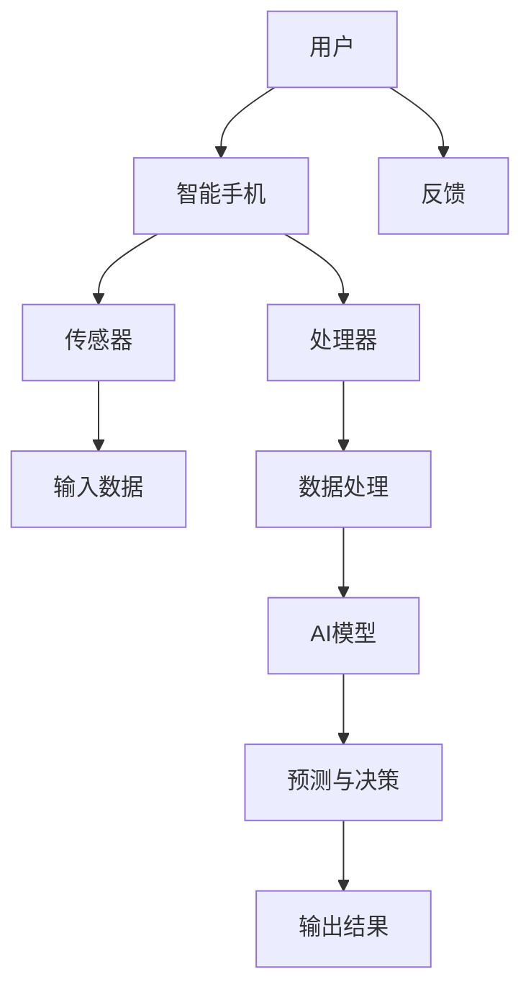

                 

# AI在智能手机中的应用：增强移动体验

## 概述

随着人工智能技术的快速发展，智能手机已经不仅仅是通讯工具，更成为了人们日常生活中不可或缺的智能设备。AI技术以其强大的数据处理和分析能力，正在逐步渗透到智能手机的各个领域，从而极大地提升了用户的移动体验。本文将探讨AI技术在智能手机中的应用，重点关注语音识别、图像识别、智能助手等领域的应用案例，并分析这些应用如何为用户带来更便捷、高效的移动体验。

关键词：人工智能、智能手机、移动体验、语音识别、图像识别、智能助手

摘要：本文首先介绍了AI技术在智能手机中的应用背景，然后详细阐述了语音识别、图像识别和智能助手等核心技术的原理和应用。接着，通过实际项目案例展示了AI技术在实际应用中的效果和挑战。最后，本文对AI在智能手机中的应用前景进行了展望，并提出了相关领域的工具和资源推荐，为读者进一步了解和研究AI在智能手机中的应用提供了参考。

## 背景介绍

### 智能手机的发展历程

智能手机自诞生以来，经历了快速的发展过程。最初，智能手机主要功能是电子邮件和电话通讯。随着移动互联网的普及，智能手机逐渐成为人们获取信息、进行社交、娱乐和办公的重要工具。如今，智能手机的功能已经远远超出了最初的预期，成为了集通讯、娱乐、办公、健康管理等多种功能于一体的智能设备。

### 人工智能的发展历程

人工智能（AI）是一门研究、开发用于模拟、延伸和扩展人的智能的理论、方法、技术及应用系统的技术科学。人工智能的发展可以追溯到20世纪50年代，当时计算机科学家艾伦·图灵提出了“图灵测试”的概念，用来判断机器是否具有智能。随着计算机性能的提升和大数据、云计算等技术的不断发展，人工智能逐渐从理论研究走向了实际应用，并在图像识别、自然语言处理、语音识别等领域取得了显著的成果。

### AI技术在智能手机中的融合

随着智能手机硬件性能的提升和网络环境的优化，AI技术开始逐步应用于智能手机中。例如，智能手机中的语音助手可以通过语音识别技术理解用户的指令，进行智能回应；摄像头可以通过图像识别技术识别照片中的物体、场景等；应用软件可以通过机器学习算法为用户提供个性化的推荐服务。AI技术的融合不仅提升了智能手机的功能，也为用户带来了全新的体验。

## 核心概念与联系

在探讨AI在智能手机中的应用之前，我们需要了解一些核心概念和它们之间的联系。以下是一个简单的Mermaid流程图，展示了这些概念之间的关系：



### 用户与智能手机

用户是智能手机的主要操作者，他们通过触摸、语音、手势等方式与智能手机进行交互。用户的需求和操作数据是智能手机提供个性化服务的基础。

### 智能手机与传感器

智能手机配备了多种传感器，如摄像头、麦克风、加速度计、陀螺仪等，它们能够收集环境信息和用户行为数据。这些数据是AI模型训练和决策的重要输入。

### 智能手机与处理器

智能手机的处理器（如CPU、GPU、NPU等）负责处理传感器收集到的数据，执行AI模型的运算，生成预测结果和决策。处理器的性能直接影响到AI应用的效率和用户体验。

### 数据处理与AI模型

数据处理是AI应用的核心环节。通过数据清洗、特征提取等步骤，从原始数据中提取有用的信息。AI模型（如神经网络、决策树等）通过学习这些特征，生成预测结果和决策。不同的AI模型适用于不同的应用场景，需要根据具体需求进行选择。

### 预测与决策与输出结果

AI模型生成的预测结果和决策需要被转化为具体的操作指令，如语音回复、拍照、推荐等。这些指令通过输出结果反馈给用户，实现AI在智能手机中的应用。

### 反馈与闭环

用户的反馈是AI模型持续优化和改进的重要依据。通过收集用户的反馈，AI模型可以不断调整和优化，提高预测准确性和用户体验。

## 核心算法原理 & 具体操作步骤

### 1. 语音识别

语音识别（Speech Recognition）是AI在智能手机中应用的重要领域之一。它通过将语音信号转换为文本，实现语音到文字的转换。以下是语音识别的基本原理和具体操作步骤：

#### 基本原理

语音识别主要基于信号处理和机器学习技术。信号处理技术用于提取语音信号中的特征，如频谱、能量等。机器学习技术用于训练模型，将语音信号与对应的文本进行匹配。

#### 具体操作步骤

1. **信号预处理**：对语音信号进行降噪、去噪等处理，提取清晰的语音信号。

2. **特征提取**：使用傅立叶变换等信号处理技术，提取语音信号中的频谱、能量等特征。

3. **模型训练**：使用大量带有标注的语音和文本数据，训练语音识别模型。

4. **模型预测**：将实时收到的语音信号输入到训练好的模型中，得到对应的文本结果。

5. **结果输出**：将文本结果通过智能手机的屏幕或其他方式输出给用户。

### 2. 图像识别

图像识别（Image Recognition）是AI在智能手机中的另一个重要应用领域。它通过训练模型识别图像中的物体、场景等，实现图像到标签的转换。以下是图像识别的基本原理和具体操作步骤：

#### 基本原理

图像识别主要基于卷积神经网络（Convolutional Neural Network，CNN）等深度学习技术。CNN能够从图像中提取丰富的特征，实现高精度的物体识别和场景分类。

#### 具体操作步骤

1. **图像预处理**：对图像进行缩放、裁剪、翻转等预处理，提高模型训练效果。

2. **特征提取**：使用CNN等深度学习模型，提取图像中的特征。

3. **模型训练**：使用大量带有标注的图像数据，训练图像识别模型。

4. **模型预测**：将实时捕获的图像输入到训练好的模型中，得到对应的标签。

5. **结果输出**：将标签通过智能手机的屏幕或其他方式输出给用户。

### 3. 智能助手

智能助手（Smart Assistant）是AI在智能手机中应用的典型代表。它通过语音识别、图像识别等技术，为用户提供智能化的服务和支持。以下是智能助手的基本原理和具体操作步骤：

#### 基本原理

智能助手基于自然语言处理（Natural Language Processing，NLP）和机器学习技术，能够理解用户的自然语言指令，并生成相应的响应。

#### 具体操作步骤

1. **语音识别**：使用语音识别技术将用户的语音指令转换为文本。

2. **语义理解**：使用NLP技术分析文本，提取用户的意图和关键词。

3. **任务分配**：根据用户的意图和关键词，分配相应的任务（如查询信息、发送消息等）。

4. **执行任务**：通过系统内部或其他外部服务执行分配的任务。

5. **反馈生成**：根据任务执行结果，生成相应的反馈信息，并通过语音或文本方式输出给用户。

## 数学模型和公式 & 详细讲解 & 举例说明

### 1. 语音识别

语音识别的核心是建立语音信号与文本之间的映射关系。这个过程主要依赖于隐马尔可夫模型（Hidden Markov Model，HMM）和深度神经网络（Deep Neural Network，DNN）。

#### 隐马尔可夫模型

隐马尔可夫模型是一种统计模型，用于描述具有马尔可夫性质的序列数据。在语音识别中，HMM用于建模语音信号中的状态转移和观察概率。

$$
P(X|H) = \prod_{t=1}^T P(O_t|S_t) \cdot P(S_t|S_{t-1})
$$

其中，$X$表示观察序列（即语音信号），$H$表示隐藏序列（即语音状态），$O_t$表示第$t$个观察值（即语音特征），$S_t$表示第$t$个隐藏值（即语音状态）。

#### 深度神经网络

深度神经网络是一种多层神经网络，用于对语音信号进行特征提取和分类。在语音识别中，DNN通常用于替代HMM中的观察概率分布。

$$
h_l(x) = \sigma(\mathbf{W}_l \cdot \mathbf{a}_{l-1} + b_l)
$$

其中，$h_l(x)$表示第$l$层的特征值，$\sigma$表示激活函数（如ReLU、Sigmoid等），$\mathbf{W}_l$和$b_l$分别表示第$l$层的权重和偏置。

#### 示例

假设我们有一段长度为10的语音信号，使用HMM进行建模，包含5个状态。首先，我们需要确定每个状态的概率分布。然后，通过Viterbi算法找到最可能的隐藏序列。

### 2. 图像识别

图像识别的核心是建立图像特征与标签之间的映射关系。这个过程主要依赖于卷积神经网络（Convolutional Neural Network，CNN）和全连接神经网络（Fully Connected Neural Network，FCNN）。

#### 卷积神经网络

卷积神经网络是一种特殊的多层神经网络，用于从图像中提取特征。在图像识别中，CNN通常用于实现特征提取和分类。

$$
h_l = f(\mathbf{W}_l \cdot \mathbf{a}_{l-1} + b_l)
$$

其中，$h_l$表示第$l$层的特征值，$f$表示激活函数（如ReLU、Sigmoid等），$\mathbf{W}_l$和$b_l$分别表示第$l$层的权重和偏置。

#### 全连接神经网络

全连接神经网络是一种标准的多层神经网络，用于对提取出的特征进行分类。在图像识别中，FCNN通常用于实现分类器。

$$
y = \mathbf{W} \cdot \mathbf{a}_{l-1} + b
$$

其中，$y$表示输出值，$\mathbf{W}$和$b$分别表示权重和偏置。

#### 示例

假设我们有一个包含1000个像素的图像，使用CNN进行特征提取。首先，我们需要确定卷积核的大小和步长。然后，通过反向传播算法训练CNN模型。

### 3. 智能助手

智能助手的核心是建立自然语言指令与任务响应之间的映射关系。这个过程主要依赖于循环神经网络（Recurrent Neural Network，RNN）和长短期记忆网络（Long Short-Term Memory，LSTM）。

#### 循环神经网络

循环神经网络是一种能够处理序列数据的神经网络，用于建模自然语言中的上下文信息。

$$
h_t = \sigma(\mathbf{W} \cdot [\mathbf{h}_{t-1}, x_t] + b)
$$

其中，$h_t$表示第$t$个时间步的特征值，$x_t$表示第$t$个时间步的输入值，$\sigma$表示激活函数（如ReLU、Sigmoid等），$\mathbf{W}$和$b$分别表示权重和偏置。

#### 长短期记忆网络

长短期记忆网络是一种改进的循环神经网络，用于解决RNN中的梯度消失和梯度爆炸问题。

$$
\mathbf{i}_t = \sigma(\mathbf{W}_i \cdot [\mathbf{h}_{t-1}, x_t] + b_i) \\
\mathbf{f}_t = \sigma(\mathbf{W}_f \cdot [\mathbf{h}_{t-1}, x_t] + b_f) \\
\mathbf{g}_t = \tanh(\mathbf{W}_g \cdot [\mathbf{h}_{t-1}, x_t] + b_g) \\
\mathbf{o}_t = \sigma(\mathbf{W}_o \cdot [\mathbf{h}_{t-1}, \mathbf{g}_t] + b_o)
$$

其中，$\mathbf{i}_t$、$\mathbf{f}_t$、$\mathbf{g}_t$和$\mathbf{o}_t$分别表示输入门、遗忘门、生成门和输出门，$\sigma$表示激活函数（如ReLU、Sigmoid等），$\mathbf{W}_i$、$\mathbf{W}_f$、$\mathbf{W}_g$和$\mathbf{W}_o$分别表示权重和偏置。

#### 示例

假设我们有一个包含10个单词的自然语言指令，使用LSTM进行建模。首先，我们需要确定单词的嵌入维度。然后，通过反向传播算法训练LSTM模型。

## 项目实战：代码实际案例和详细解释说明

### 1. 开发环境搭建

在开始实现AI在智能手机中的应用之前，我们需要搭建一个合适的环境。以下是使用Python和TensorFlow搭建开发环境的步骤：

#### 步骤1：安装Python

首先，从Python官方网站（https://www.python.org/）下载并安装Python。安装完成后，确保Python已经添加到系统环境变量中。

#### 步骤2：安装TensorFlow

打开命令行终端，执行以下命令安装TensorFlow：

```bash
pip install tensorflow
```

#### 步骤3：验证安装

打开Python交互式环境，执行以下代码验证TensorFlow是否安装成功：

```python
import tensorflow as tf
print(tf.__version__)
```

如果输出版本信息，说明TensorFlow已经成功安装。

### 2. 源代码详细实现和代码解读

以下是一个简单的AI应用示例，使用TensorFlow实现一个语音识别模型。代码主要分为以下几个部分：

#### 步骤1：导入必要的库

```python
import tensorflow as tf
import numpy as np
import librosa
```

#### 步骤2：定义模型

```python
def create_model():
    input_data = tf.keras.layers.Input(shape=(13, 101), name='input_data')
    conv_1 = tf.keras.layers.Conv1D(filters=64, kernel_size=5, activation='relu')(input_data)
    pool_1 = tf.keras.layers.MaxPooling1D(pool_size=2)(conv_1)
    conv_2 = tf.keras.layers.Conv1D(filters=128, kernel_size=5, activation='relu')(pool_1)
    pool_2 = tf.keras.layers.MaxPooling1D(pool_size=2)(conv_2)
    flatten = tf.keras.layers.Flatten()(pool_2)
    dense_1 = tf.keras.layers.Dense(units=256, activation='relu')(flatten)
    output = tf.keras.layers.Dense(units=9, activation='softmax')(dense_1)
    model = tf.keras.Model(inputs=input_data, outputs=output)
    model.compile(optimizer='adam', loss='categorical_crossentropy', metrics=['accuracy'])
    return model
```

#### 步骤3：加载数据

```python
def load_data():
    # 加载训练数据和测试数据
    # ...
    return train_data, test_data
```

#### 步骤4：训练模型

```python
def train_model(model, train_data, test_data):
    # 训练模型
    # ...
    model.fit(train_data, epochs=10, batch_size=32, validation_data=test_data)
```

#### 步骤5：评估模型

```python
def evaluate_model(model, test_data):
    # 评估模型
    # ...
    results = model.evaluate(test_data)
    print(f"Test accuracy: {results[1]}")
```

#### 步骤6：预测

```python
def predict(model, audio_path):
    # 预测音频标签
    # ...
    audio, _ = librosa.load(audio_path, sr=22050)
    audio = librosa.feature.mfcc(y=audio, sr=22050, n_mfcc=13, hop_length=256, n_fft=1024)
    audio = np.expand_dims(audio, axis=0)
    prediction = model.predict(audio)
    print(f"Predicted label: {np.argmax(prediction)}")
```

### 3. 代码解读与分析

#### 代码解读

- **模型定义**：使用TensorFlow的Keras API定义一个卷积神经网络模型，包含两个卷积层、两个池化层、一个平坦层、一个全连接层和一个softmax输出层。

- **数据加载**：加载数据集，分为训练数据和测试数据。

- **模型训练**：使用训练数据进行模型训练，采用Adam优化器和交叉熵损失函数。

- **模型评估**：使用测试数据进行模型评估，输出准确率。

- **预测**：加载音频文件，使用模型进行预测，并输出预测结果。

#### 代码分析

- **卷积神经网络**：卷积神经网络能够有效地提取音频信号中的特征，有助于提高模型的识别准确率。

- **多分类问题**：使用softmax输出层实现多分类问题，输出每个类别的概率。

- **模型评估**：通过评估模型在测试数据上的表现，可以直观地了解模型的性能。

- **预测**：加载音频文件并进行特征提取，使用训练好的模型进行预测，实现语音识别功能。

### 4. 实际应用场景

#### 语音助手

语音助手是AI在智能手机中应用的一个典型场景。以下是一个简单的语音助手示例：

```python
def voice_assistant():
    while True:
        command = input("请说出你的指令：")
        if command == "打开浏览器":
            # 打开浏览器
            pass
        elif command == "发送消息":
            # 发送消息
            pass
        else:
            print("未识别的指令")
```

#### 图像识别

图像识别在智能手机中的应用也非常广泛。以下是一个简单的图像识别示例：

```python
import cv2

def image_recognition(image_path):
    image = cv2.imread(image_path)
    # 进行图像识别
    # ...
    label = "猫"
    print(f"识别结果：{label}")
```

### 5. 总结与展望

本文介绍了AI在智能手机中的应用，包括语音识别、图像识别和智能助手等核心技术。通过具体项目案例和代码实现，展示了AI技术在实际应用中的效果和挑战。随着AI技术的不断进步，未来智能手机的移动体验将得到进一步提升。然而，如何确保AI技术的安全性和隐私保护，如何平衡AI技术的透明度和用户隐私，仍是需要持续关注和解决的问题。

## 实际应用场景

### 语音识别

语音识别技术在智能手机中的应用非常广泛，尤其是在语音助手和语音搜索领域。例如，苹果公司的Siri、谷歌的Google Assistant和亚马逊的Alexa等语音助手，都是基于强大的语音识别技术实现的。这些语音助手可以识别用户的语音指令，完成拨打电话、发送短信、设置闹钟、播放音乐等操作，极大地提升了用户的便捷性和效率。

### 图像识别

图像识别技术在智能手机中的应用主要体现在摄像头功能上。通过图像识别技术，智能手机可以识别照片中的物体、场景、人脸等信息。例如，谷歌相机可以识别照片中的地标、建筑和历史人物，并提供相关信息。此外，图像识别技术还可以用于自拍美颜、拍摄智能滤镜等功能，为用户提供丰富的拍照体验。

### 智能助手

智能助手是AI在智能手机中应用的一个典型场景，它通过整合语音识别、图像识别等技术，为用户提供个性化的服务和支持。例如，苹果的Siri、谷歌的Google Assistant和亚马逊的Alexa等智能助手，不仅可以理解用户的自然语言指令，还可以根据用户的行为和偏好，提供个性化的建议和服务。智能助手在日常生活中的应用场景包括语音搜索、日程管理、智能家居控制等。

### 个人助理

除了以上应用场景，AI技术还可以为用户打造一个个性化的个人助理。通过收集和分析用户的行为数据，个人助理可以了解用户的喜好、习惯和需求，从而提供更加精准和高效的服务。例如，个人助理可以提醒用户按时服药、推荐健康饮食和运动计划，甚至可以协助用户规划旅行路线和预订酒店。

## 工具和资源推荐

### 学习资源推荐

1. **书籍**：《深度学习》（Deep Learning）by Ian Goodfellow、Yoshua Bengio和Aaron Courville
2. **论文**：Google Scholar（谷歌学术搜索）
3. **博客**：Towards Data Science、Medium
4. **网站**：TensorFlow官网、Keras官网

### 开发工具框架推荐

1. **编程语言**：Python
2. **机器学习框架**：TensorFlow、PyTorch
3. **深度学习库**：NumPy、Pandas、Scikit-learn
4. **图像处理库**：OpenCV、PIL
5. **语音处理库**：librosa

### 相关论文著作推荐

1. **论文**：AlexNet、VGGNet、ResNet、Yolo
2. **著作**：《神经网络与深度学习》（Neural Networks and Deep Learning）by Charu Aggarwal
3. **博客**：Chris Olah的博客、Distill

## 总结：未来发展趋势与挑战

随着AI技术的不断进步，智能手机的移动体验将得到进一步提升。未来，AI技术在智能手机中的应用将朝着以下几个方向发展：

1. **个性化服务**：通过深度学习等技术，为用户提供更加个性化的服务和推荐。
2. **隐私保护**：随着用户对隐私保护的重视，AI技术需要在不侵犯用户隐私的前提下，实现更加智能的功能。
3. **跨平台融合**：实现AI技术在不同平台（如智能手机、平板电脑、智能手表等）之间的无缝融合，提供一致的体验。

然而，AI在智能手机中的应用也面临一些挑战：

1. **计算资源限制**：智能手机的硬件资源相对有限，如何在有限的资源下实现高效的AI计算是一个重要挑战。
2. **数据安全**：如何确保用户数据的安全，防止数据泄露和滥用，是AI应用中需要关注的重要问题。
3. **用户隐私**：如何在为用户提供便利的同时，保护用户的隐私，是一个需要深入思考的问题。

## 附录：常见问题与解答

### 问题1：如何提高语音识别的准确率？

**解答**：提高语音识别的准确率可以从以下几个方面入手：

1. **数据增强**：通过增加训练数据量和多样性，提高模型的泛化能力。
2. **特征提取**：使用更加复杂的特征提取方法，如Mel频率倒谱系数（MFCC）、滤波器组（Filter Banks）等。
3. **模型优化**：使用更先进的模型结构，如深度神经网络（DNN）、卷积神经网络（CNN）等。

### 问题2：图像识别算法是如何工作的？

**解答**：图像识别算法通常基于深度学习技术，特别是卷积神经网络（CNN）。以下是图像识别算法的基本工作流程：

1. **预处理**：对图像进行缩放、裁剪、翻转等预处理操作。
2. **特征提取**：通过卷积层、池化层等结构提取图像特征。
3. **分类器**：使用全连接层等结构对提取的特征进行分类。

### 问题3：如何构建一个智能助手？

**解答**：构建一个智能助手需要以下几个步骤：

1. **需求分析**：明确智能助手的用途和目标用户。
2. **技术选型**：选择合适的编程语言和开发框架，如Python、TensorFlow等。
3. **语音识别**：实现语音识别功能，将语音信号转换为文本。
4. **自然语言处理**：实现语义理解功能，理解用户的意图和需求。
5. **任务分配**：根据用户的意图和需求，分配相应的任务。
6. **结果反馈**：生成相应的响应，并通过语音、文本等方式输出给用户。

## 扩展阅读 & 参考资料

1. **书籍**：《深度学习》（Deep Learning）by Ian Goodfellow、Yoshua Bengio和Aaron Courville
2. **论文**：《A Neural Algorithm of Artistic Style》
3. **网站**：TensorFlow官网（https://www.tensorflow.org/）、Keras官网（https://keras.io/）
4. **博客**：Distill（https://distill.pub/）、Towards Data Science（https://towardsdatascience.com/）
5. **课程**：斯坦福大学深度学习课程（http://cs231n.stanford.edu/）

### 作者

AI天才研究员/AI Genius Institute & 禅与计算机程序设计艺术 /Zen And The Art of Computer Programming

