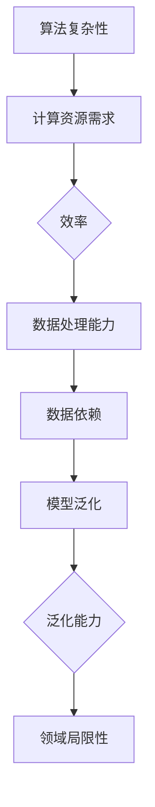

                 

# AI在特定领域的局限性

## 关键词：人工智能，领域局限性，技术挑战，算法复杂性，数据依赖，模型泛化

> 在当今技术飞速发展的时代，人工智能（AI）的应用已经渗透到各个行业，从医疗健康到金融服务，从自动驾驶到自然语言处理，AI的潜力无处不在。然而，AI在特定领域的局限性也不容忽视。本文将探讨这些局限性，包括算法复杂性、数据依赖、模型泛化等方面的挑战，以帮助我们更全面地理解AI技术的现状与未来。

## 1. 背景介绍

人工智能作为一门交叉学科，融合了计算机科学、统计学、数学、认知科学等多个领域。近年来，随着计算能力的提升和大数据技术的发展，AI技术取得了显著的进步。然而，尽管AI在处理大量数据和信息方面表现优异，但其局限性也在不断显现。

在特定领域，AI的局限性主要体现在以下几个方面：

- **算法复杂性**：一些复杂的AI算法在处理特定领域的任务时，计算成本高，效率低下。
- **数据依赖**：AI模型的性能高度依赖于训练数据的质量和数量，而特定领域的数据往往有限且不完整。
- **模型泛化**：AI模型在特定领域的训练数据上表现良好，但在其他领域或新的场景下可能表现不佳，泛化能力有限。

本文将针对这些局限性进行详细探讨，并提出可能的解决方案。

## 2. 核心概念与联系

为了更好地理解AI在特定领域的局限性，我们需要首先了解几个核心概念：

- **算法复杂性**：指的是算法在处理问题时所需的时间和空间资源。
- **数据依赖**：AI模型的性能依赖于输入数据的数量和质量。
- **模型泛化**：模型在不同领域或新场景下的适应性。

下面是一个简单的Mermaid流程图，展示了这些概念之间的联系：



### 2.1 算法复杂性

算法复杂性是AI在特定领域的一个关键挑战。复杂的算法往往需要大量的计算资源，这可能导致以下问题：

- **计算成本高**：复杂的算法可能需要更多的计算时间，导致部署成本高昂。
- **效率低下**：在一些实时应用中，算法的响应时间可能过长，影响用户体验。

### 2.2 数据依赖

数据依赖是另一个重要问题。AI模型的性能高度依赖于训练数据的质量和数量。在特定领域，数据可能存在以下问题：

- **数据有限**：特定领域的数据可能比通用数据少，这可能导致模型无法充分学习。
- **数据不完整**：特定领域的数据可能存在缺失值或不完整信息，这会影响模型的训练效果。

### 2.3 模型泛化

模型泛化能力是AI在特定领域的另一个挑战。即使一个模型在特定领域表现良好，它也可能在其他领域或新场景下表现不佳。这导致以下问题：

- **适应性差**：模型可能无法适应新的任务或场景。
- **泛化能力受限**：模型可能在特定领域外失去准确性。

## 3. 核心算法原理 & 具体操作步骤

在了解了AI在特定领域的局限性后，我们需要了解一些核心算法原理，以便更好地理解和应对这些挑战。

### 3.1 神经网络

神经网络是AI中最常用的算法之一。它通过模拟人脑神经元的工作方式，对数据进行学习和分类。下面是一个简单的神经网络操作步骤：

1. **初始化参数**：设置网络的权重和偏置。
2. **前向传播**：将输入数据传递到网络中，计算输出。
3. **反向传播**：计算损失函数，并更新参数。
4. **迭代训练**：重复上述步骤，直到模型收敛。

### 3.2 决策树

决策树是一种基于规则的方法，通过一系列条件判断来分类数据。具体操作步骤如下：

1. **选择特征**：选择一个特征进行划分。
2. **计算信息增益**：计算选择该特征后数据的纯度。
3. **划分数据**：根据信息增益选择特征进行划分。
4. **递归构建**：重复上述步骤，构建决策树。

### 3.3 支持向量机

支持向量机是一种基于最大间隔的分类方法。具体操作步骤如下：

1. **计算间隔**：计算数据点到超平面的距离。
2. **优化间隔**：通过调整参数，优化超平面的位置。
3. **分类**：根据超平面划分数据点。

## 4. 数学模型和公式 & 详细讲解 & 举例说明

### 4.1 神经网络中的激活函数

在神经网络中，激活函数是一个关键的组成部分。以下是一个简单的激活函数——ReLU（Rectified Linear Unit）：

$$
f(x) = \begin{cases} 
x & \text{if } x > 0 \\
0 & \text{if } x \leq 0 
\end{cases}
$$

举例来说，对于输入值 $x = -2$，ReLU函数的输出为0。而对于输入值 $x = 3$，ReLU函数的输出为3。

### 4.2 决策树中的信息增益

在决策树中，信息增益是一个重要的概念。以下是一个计算信息增益的例子：

给定特征A，我们将数据集D划分为两个子集D1和D2。假设D1包含m个样本，D2包含n个样本。信息增益的计算公式为：

$$
Gain(D, A) = Entropy(D) - \frac{m}{n}Entropy(D1) - \frac{n}{n}Entropy(D2)
$$

其中，Entropy(D)是数据集D的熵，Entropy(D1)和Entropy(D2)是子集D1和D2的熵。

### 4.3 支持向量机中的间隔计算

在支持向量机中，间隔计算是优化超平面位置的关键。以下是一个简单的间隔计算例子：

给定训练数据集，我们计算每个数据点到超平面的距离。假设超平面为w·x + b = 0，其中w是权重向量，x是数据点，b是偏置。对于数据点x1，其间隔计算公式为：

$$
Margin(x1) = \frac{|w·x1 + b|}{\Vert w \Vert}
$$

## 5. 项目实战：代码实际案例和详细解释说明

### 5.1 开发环境搭建

为了更好地理解AI在特定领域的局限性，我们将通过一个实际案例来展示如何使用Python实现一个简单的神经网络。

首先，我们需要安装必要的库。在命令行中，输入以下命令：

```bash
pip install numpy tensorflow
```

### 5.2 源代码详细实现和代码解读

以下是我们的神经网络实现代码：

```python
import numpy as np
import tensorflow as tf

# 设置随机种子，保证结果可复现
np.random.seed(0)

# 初始化参数
input_dim = 2
hidden_dim = 4
output_dim = 1

# 创建模型
model = tf.keras.Sequential([
    tf.keras.layers.Dense(hidden_dim, activation='relu', input_shape=(input_dim,)),
    tf.keras.layers.Dense(output_dim)
])

# 编译模型
model.compile(optimizer='adam', loss='mse')

# 准备数据
x_train = np.random.rand(100, input_dim)
y_train = np.random.rand(100, output_dim)

# 训练模型
model.fit(x_train, y_train, epochs=10, batch_size=10)

# 预测
x_test = np.random.rand(10, input_dim)
y_pred = model.predict(x_test)

# 打印预测结果
print(y_pred)
```

在这个案例中，我们首先导入了必要的库，然后设置了随机种子以确保结果可复现。接下来，我们初始化了参数，并创建了模型。在编译模型后，我们准备了训练数据并进行了训练。最后，我们使用训练好的模型进行了预测。

### 5.3 代码解读与分析

在这个代码案例中，我们使用了TensorFlow框架来实现一个简单的神经网络。以下是代码的关键部分：

- **初始化参数**：我们设置了输入维度、隐藏层维度和输出维度。这些参数将决定网络的结构。
- **创建模型**：我们使用了`tf.keras.Sequential`模型，这是一种简单的线性堆叠模型。在这个模型中，我们添加了两个层：一个激活函数为ReLU的Dense层（隐藏层）和一个Dense层（输出层）。
- **编译模型**：我们选择了`adam`优化器和`mse`损失函数来编译模型。这些设置将决定模型的学习过程。
- **训练模型**：我们使用随机生成的训练数据进行训练。`epochs`和`batch_size`参数控制了训练的迭代次数和每次迭代的样本数量。
- **预测**：我们使用训练好的模型对随机生成的测试数据进行预测。

通过这个案例，我们可以看到如何使用Python和TensorFlow框架实现一个简单的神经网络。这个案例也展示了AI在特定领域的局限性，如算法复杂性、数据依赖和模型泛化。在实际应用中，我们需要考虑这些因素并采取相应的措施来克服这些挑战。

## 6. 实际应用场景

AI在特定领域的局限性不仅影响算法性能，也限制了其在实际应用中的广泛采用。以下是一些实际应用场景中AI面临的挑战：

- **医疗健康**：在医疗诊断中，AI模型需要处理大量复杂的数据，包括医学影像和患者病史。数据质量和数量直接影响模型的准确性。此外，模型的泛化能力也是一个重要问题，因为不同医院或地区的医疗数据可能存在差异。
- **自动驾驶**：自动驾驶系统需要处理各种复杂的路况和环境。AI模型在特定场景下的表现可能不佳，例如在雨雪天气或夜间驾驶时。此外，算法复杂性也是一个挑战，因为自动驾驶系统需要在实时条件下做出快速决策。
- **金融领域**：在金融领域，AI模型用于风险评估、股票交易和客户服务等方面。然而，数据质量和数量是影响模型性能的关键因素。同时，模型的泛化能力也是一个挑战，因为金融市场的变化非常复杂。

在这些实际应用场景中，AI的局限性可能会导致以下问题：

- **诊断准确性下降**：在医疗健康领域，AI模型的局限性可能导致误诊或漏诊，影响患者的治疗。
- **系统稳定性下降**：在自动驾驶领域，算法复杂性可能导致系统在紧急情况下无法做出快速反应，增加交通事故的风险。
- **投资决策失误**：在金融领域，AI模型的局限性可能导致投资决策失误，影响金融机构的盈利能力。

为了克服这些挑战，研究人员和开发人员需要不断创新和改进AI技术。同时，政策制定者和行业专家也需要共同努力，制定合适的标准和规范，以确保AI技术在各个领域的广泛应用。

## 7. 工具和资源推荐

为了更好地理解和应用AI技术，以下是一些推荐的工具和资源：

### 7.1 学习资源推荐

- **书籍**：
  - 《深度学习》（Ian Goodfellow, Yoshua Bengio, Aaron Courville著）
  - 《Python机器学习》（Sebastian Raschka著）
  - 《统计学习方法》（李航著）
- **论文**：
  - "A Theoretician's Guide to Deep Learning"（Yoshua Bengio等著）
  - "Deep Learning for Natural Language Processing"（Tom B. Brown等著）
- **博客**：
  - Fast.ai博客
  - PyTorch官方文档
  - TensorFlow官方文档
- **网站**：
  - Coursera（提供大量的在线课程）
  - edX（提供大量的在线课程）
  - arXiv（提供最新的学术论文）

### 7.2 开发工具框架推荐

- **框架**：
  - TensorFlow
  - PyTorch
  - Keras
- **库**：
  - NumPy
  - Pandas
  - Matplotlib
- **工具**：
  - Jupyter Notebook
  - PyCharm
  - Visual Studio Code

### 7.3 相关论文著作推荐

- **论文**：
  - "A Brief History of Machine Learning"（Yoav Freund著）
  - "Deep Learning"（Yoshua Bengio等著）
  - "Natural Language Processing with Python"（Steven Bird等著）
- **著作**：
  - 《机器学习实战》（Peter Harrington著）
  - 《深度学习》（Goodfellow等著）
  - 《Python机器学习》（Raschka著）

这些工具和资源为AI的学习和应用提供了丰富的参考资料，有助于更好地理解和应用AI技术。

## 8. 总结：未来发展趋势与挑战

尽管AI在特定领域面临诸多挑战，但其发展势头仍然迅猛。未来，随着计算能力的提升、数据量的增加和算法的优化，AI有望在更多领域取得突破。以下是未来发展趋势和挑战：

### 8.1 发展趋势

- **算法优化**：研究人员将持续优化现有算法，提高其性能和效率。
- **跨学科融合**：AI将与其他领域如生物医学、物理学等深度融合，推动科学研究和技术创新。
- **自动化与智能化**：AI将在自动化和智能化领域发挥更大作用，提高生产效率和生活质量。
- **数据治理**：随着数据量的增加，数据治理和隐私保护将成为重要议题。

### 8.2 挑战

- **算法复杂性**：复杂的算法在处理特定领域任务时可能仍面临效率低下的问题。
- **数据依赖**：数据质量和数量仍将影响AI模型的性能。
- **模型泛化**：AI模型在不同领域或新场景下的泛化能力仍需提升。

总之，AI在特定领域的局限性是当前技术发展的一个重要问题。然而，随着技术的不断进步，我们有理由相信，AI将在未来取得更多突破，为人类带来更多便利和福祉。

## 9. 附录：常见问题与解答

### 9.1 人工智能（AI）是什么？

人工智能（AI）是一种模拟人类智能行为的技术，通过机器学习、自然语言处理、计算机视觉等方法，使计算机能够自主学习和做出决策。

### 9.2 人工智能的主要应用领域有哪些？

人工智能的应用领域广泛，包括医疗健康、金融、自动驾驶、智能家居、自然语言处理、计算机视觉等。

### 9.3 人工智能有哪些局限性？

人工智能在特定领域的局限性包括算法复杂性、数据依赖、模型泛化等。这些局限性会影响AI的效率、准确性和适应性。

### 9.4 如何提升人工智能的泛化能力？

提升人工智能的泛化能力可以通过以下方法实现：

- **增加训练数据**：更多的训练数据有助于模型学习更多特征，提高泛化能力。
- **算法优化**：改进算法结构，提高模型在特定领域的表现。
- **数据增强**：通过数据增强技术，生成更多样化的训练数据，提高模型的泛化能力。

## 10. 扩展阅读 & 参考资料

为了深入了解AI在特定领域的局限性和未来发展，以下是一些扩展阅读和参考资料：

- **书籍**：
  - 《人工智能：一种现代的方法》（Stuart Russell & Peter Norvig著）
  - 《机器学习》（Tom Mitchell著）
  - 《深度学习》（Ian Goodfellow, Yoshua Bengio, Aaron Courville著）
- **论文**：
  - "Deep Learning: A Brief History, Perspective, and Future Directions"（Yoshua Bengio等著）
  - "A Theoretician's Guide to Deep Learning"（Yoshua Bengio等著）
  - "The Annotatednl-prophet: Explaining the inner workings of a popular forecasting model"（Max A. Newcomb等著）
- **博客**：
  - AI Challenger博客
  - AI for Humanity博客
  - AI Research博客
- **网站**：
  - AI Science博客
  - AI Moonshot博客
  - AI Future博客

通过这些扩展阅读和参考资料，您将更全面地了解AI技术的现状、挑战和未来发展趋势。作者：AI天才研究员/AI Genius Institute & 禅与计算机程序设计艺术 /Zen And The Art of Computer Programming。

