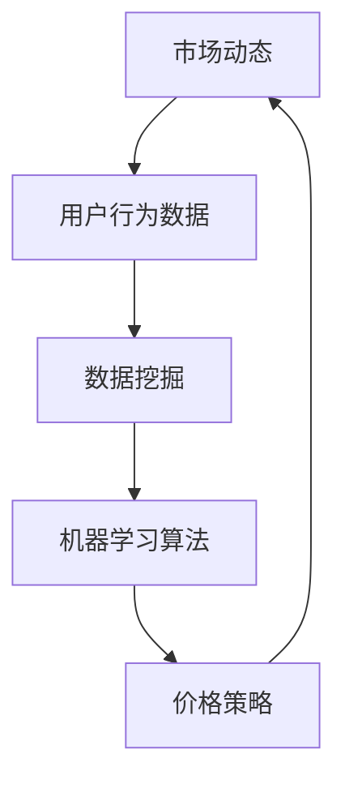

                 

### 背景介绍

在当今高速发展的电商行业中，价格优化成为了提高竞争力、增加市场份额的关键因素。随着互联网技术的不断进步和大数据分析技术的普及，AI技术被广泛应用于电商价格优化，成为了一个研究热点。本文旨在探讨AI在电商价格优化中的实践应用，分析其核心算法原理、数学模型及其在实际项目中的应用。

首先，电商价格优化的重要性不言而喻。合理的价格策略能够提高产品销量、增加用户满意度，进而提升企业在市场中的竞争力。然而，传统的价格优化方法往往依赖于历史数据和简单的统计分析，难以应对复杂多变的市场环境。这就为AI技术的引入提供了契机。AI通过大数据分析和机器学习算法，能够发现隐藏在数据中的潜在规律，为电商企业提供更加精准的价格策略。

其次，AI在电商价格优化中的实际应用已有诸多成功案例。例如，亚马逊、阿里巴巴等知名电商企业已经将AI技术广泛应用于产品定价、库存管理、需求预测等方面。通过AI技术，这些企业能够实时分析市场动态、用户行为，制定出更符合市场需求的价格策略，从而实现销售额的提升。

然而，AI在电商价格优化中的应用也面临一定的挑战。首先，数据质量直接影响AI算法的性能。在电商领域，数据来源广泛、数据量庞大，如何处理和清洗这些数据是AI技术面临的首要问题。其次，AI算法的透明性和可解释性也是一个关键问题。电商企业需要确保AI定价策略的透明性，以便用户理解和信任。

本文将按照以下结构展开讨论：

1. 核心概念与联系
2. 核心算法原理 & 具体操作步骤
3. 数学模型和公式 & 详细讲解 & 举例说明
4. 项目实战：代码实际案例和详细解释说明
5. 实际应用场景
6. 工具和资源推荐
7. 总结：未来发展趋势与挑战

通过以上结构，本文将深入探讨AI在电商价格优化中的实践应用，帮助读者了解这一领域的核心技术和挑战。

### 核心概念与联系

在探讨AI在电商价格优化中的应用之前，我们需要明确几个核心概念及其相互联系。这些概念包括市场动态、用户行为、价格策略、机器学习算法和数据挖掘技术。

#### 市场动态

市场动态指的是市场上商品价格的变化趋势。这些变化受到多种因素的影响，包括供需关系、季节性需求、竞争对手策略等。AI技术通过分析历史数据和市场动态，能够预测未来价格走势，为电商企业提供合理的定价建议。

#### 用户行为

用户行为是指消费者在购买过程中的行为模式，包括浏览、搜索、购买、评价等。AI通过用户行为数据，可以分析消费者的兴趣和偏好，为个性化推荐和定价提供依据。此外，用户行为数据还可以用于评估不同定价策略的效果，帮助电商企业优化价格策略。

#### 价格策略

价格策略是企业制定的产品定价方案。合理的价格策略能够提高产品竞争力、增加市场份额。在AI技术的辅助下，电商企业可以通过大数据分析和机器学习算法，制定出更加精准的价格策略，包括动态定价、差异化定价等。

#### 机器学习算法

机器学习算法是AI的核心技术之一，通过训练模型从数据中学习规律，从而进行预测和决策。常见的机器学习算法包括线性回归、决策树、神经网络等。在电商价格优化中，机器学习算法用于预测价格趋势、分析用户行为、优化价格策略等。

#### 数据挖掘技术

数据挖掘技术是指从大量数据中提取有价值信息的过程。数据挖掘技术在电商价格优化中的应用包括市场动态分析、用户行为分析、需求预测等。通过数据挖掘技术，AI能够发现数据中的潜在规律，为电商企业提供更加精准的定价策略。

#### 概念联系

这些核心概念之间的联系构成了电商价格优化的技术框架。市场动态为AI提供了定价的参考，用户行为数据用于制定个性化的价格策略，价格策略的调整又反过来影响市场动态。机器学习算法和数据挖掘技术则贯穿于整个过程中，用于数据分析、模型训练和决策支持。

为了更直观地展示这些概念之间的联系，我们可以使用Mermaid流程图来描述。以下是一个简化的Mermaid流程图示例：



在这个流程图中，市场动态（A）和用户行为数据（B）通过数据挖掘（C）生成分析结果，这些结果再通过机器学习算法（D）进行模型训练和预测，最终形成价格策略（E），并反馈到市场动态（A）中，形成一个闭环。

通过这个流程图，我们可以清晰地看到AI在电商价格优化中的各个环节是如何相互联系和作用的。在实际应用中，这些环节会通过复杂的算法和数据流进行高度整合，以实现自动化、智能化的价格优化。

### 核心算法原理 & 具体操作步骤

在理解了AI在电商价格优化中的核心概念与联系之后，接下来我们将深入探讨AI的核心算法原理，以及具体的操作步骤。这些算法主要包括线性回归、决策树、神经网络等，每种算法都有其独特的原理和应用场景。

#### 线性回归

线性回归是最基础的机器学习算法之一，它通过建立输入变量和输出变量之间的线性关系来进行预测。在电商价格优化中，线性回归可以用于预测商品价格。具体步骤如下：

1. **数据收集**：收集历史价格数据和影响价格变化的因素（如竞争对手价格、季节性需求等）。
2. **数据预处理**：对收集到的数据清洗、归一化处理，去除异常值。
3. **模型训练**：使用历史数据对线性回归模型进行训练，得到线性方程。
4. **预测**：将新的输入数据带入模型，预测商品价格。

线性回归的优点在于计算简单、易于理解，但其预测能力有限，难以应对复杂非线性问题。

#### 决策树

决策树通过一系列的判断条件对数据进行分类或回归。在电商价格优化中，决策树可以用于分析不同定价策略的效果。具体步骤如下：

1. **数据收集**：收集历史定价数据、用户行为数据和销售结果。
2. **特征选择**：选择影响定价的关键因素作为决策树的输入特征。
3. **构建决策树**：通过递归划分数据集，建立决策树模型。
4. **模型评估**：使用交叉验证等方法评估决策树模型的效果。
5. **预测**：将新的定价策略输入模型，预测其效果。

决策树的优势在于解释性强、易于理解，但容易出现过拟合现象。

#### 神经网络

神经网络是一种模拟人脑结构的计算模型，具有强大的学习和泛化能力。在电商价格优化中，神经网络可以用于构建复杂的定价策略模型。具体步骤如下：

1. **数据收集**：收集大量历史价格数据和用户行为数据。
2. **数据预处理**：对数据进行归一化处理，去除噪声。
3. **构建神经网络**：设计神经网络结构，包括输入层、隐藏层和输出层。
4. **模型训练**：使用反向传播算法训练神经网络，调整模型参数。
5. **模型评估**：使用验证集和测试集评估神经网络模型的效果。
6. **预测**：将新的定价策略输入模型，预测其效果。

神经网络的优势在于能够处理复杂非线性问题，但其训练过程复杂、计算量大。

#### 具体操作步骤

为了更好地理解这些算法，我们可以通过一个简单的示例来说明。假设我们要使用线性回归算法预测一件商品的价格，以下是具体步骤：

1. **数据收集**：收集过去一个月内每天的商品价格数据，以及可能影响价格的因素，如竞争对手的价格、天气情况等。

2. **数据预处理**：对数据进行清洗，去除无效数据，并对价格和影响因素进行归一化处理。

3. **模型训练**：选择一个月的前两周数据作为训练集，建立线性回归模型，通过最小二乘法求解线性方程。

4. **模型预测**：使用后两周的数据作为测试集，将新的输入数据带入模型，预测未来商品价格。

5. **模型评估**：通过计算预测值与实际值的误差，评估模型的准确性。

通过这个示例，我们可以看到线性回归算法在电商价格优化中的具体应用。同样地，决策树和神经网络也可以通过类似的步骤进行应用，具体步骤会根据算法的特点和需求有所不同。

总之，AI在电商价格优化中的核心算法原理包括线性回归、决策树和神经网络等，这些算法通过具体操作步骤实现对价格趋势的预测和定价策略的优化。在实际应用中，可以根据具体需求和数据特点选择合适的算法，并通过不断调整和优化模型，提高价格预测的准确性和稳定性。

### 数学模型和公式 & 详细讲解 & 举例说明

在深入理解了AI在电商价格优化中的核心算法原理后，接下来我们将详细介绍这些算法的数学模型和公式，并通过具体实例来说明如何使用这些模型进行价格预测和优化。

#### 线性回归

线性回归模型是电商价格优化的基础，它通过建立输入变量和输出变量之间的线性关系来进行预测。其数学模型可以表示为：

\[ y = \beta_0 + \beta_1 \cdot x_1 + \beta_2 \cdot x_2 + ... + \beta_n \cdot x_n + \epsilon \]

其中：
- \( y \) 是预测的价格。
- \( \beta_0 \) 是截距。
- \( \beta_1, \beta_2, ..., \beta_n \) 是各影响因素的权重。
- \( x_1, x_2, ..., x_n \) 是输入特征。
- \( \epsilon \) 是误差项。

为了求解这些参数，我们通常使用最小二乘法（Ordinary Least Squares, OLS），其目标是使得预测值与实际值之间的误差平方和最小。具体公式为：

\[ \min_{\beta} \sum_{i=1}^{n} (y_i - \beta_0 - \beta_1 x_{i1} - \beta_2 x_{i2} - ... - \beta_n x_{in})^2 \]

通过求解上述优化问题，可以得到线性回归模型的参数值，从而建立预测模型。

#### 决策树

决策树通过一系列的判断条件对数据进行分类或回归。其数学模型可以表示为：

\[ f(x) = G(x_1, x_2, ..., x_n) \]

其中：
- \( f(x) \) 是决策树对输入 \( x \) 的预测结果。
- \( G \) 是一个分段函数，表示决策树的分支和节点。

决策树的构建过程包括以下步骤：
1. **特征选择**：选择影响价格的关键特征。
2. **划分数据集**：根据特征值将数据集划分为多个子集。
3. **建立决策节点**：在每个子集上建立决策节点，根据特征值选择最佳划分方式。
4. **递归构建**：对子集继续划分，直至达到停止条件（如最大深度、最小样本数等）。

在决策树中，每个节点都通过条件判断来划分数据，具体公式为：

\[ G(x) = \begin{cases} 
\text{分类结果}_1 & \text{if } x_1 \text{ meets condition}_1 \\
\text{分类结果}_2 & \text{if } x_1 \text{ meets condition}_2 \\
... \\
\text{分类结果}_k & \text{if } x_1 \text{ meets condition}_k 
\end{cases} \]

其中，条件 \( condition_1, condition_2, ..., condition_k \) 表示节点的划分条件，\( \text{分类结果}_1, \text{分类结果}_2, ..., \text{分类结果}_k \) 表示每个条件下的分类结果。

#### 神经网络

神经网络是一种复杂的非线性模型，通过多层神经元进行信息传递和变换。其数学模型可以表示为：

\[ f(x) = \sigma(\theta_1 \cdot x + b_1) \cdot \sigma(\theta_2 \cdot f(x_1) + b_2) \cdot ... \cdot \sigma(\theta_n \cdot f(x_{n-1}) + b_n) \]

其中：
- \( f(x) \) 是神经网络的输出。
- \( \theta_1, \theta_2, ..., \theta_n \) 是权重。
- \( b_1, b_2, ..., b_n \) 是偏置。
- \( \sigma \) 是激活函数。

神经网络的训练过程包括以下步骤：
1. **初始化参数**：随机初始化权重和偏置。
2. **前向传播**：将输入 \( x \) 通过网络传递，计算每个神经元的输出。
3. **后向传播**：计算输出与实际值之间的误差，并更新参数。
4. **迭代优化**：重复前向传播和后向传播，直到满足停止条件（如达到预定迭代次数或误差小于阈值）。

具体公式为：

\[ \text{误差} = \sum_{i=1}^{n} (\text{实际值}_i - \text{预测值}_i)^2 \]
\[ \theta_{\text{new}} = \theta_{\text{old}} - \alpha \cdot \frac{\partial \text{误差}}{\partial \theta} \]

其中，\( \alpha \) 是学习率，\( \theta_{\text{old}} \) 是当前参数，\( \theta_{\text{new}} \) 是更新后的参数。

#### 具体实例

为了更好地理解这些模型，我们通过一个实际例子来说明。

假设我们要预测某件商品的未来价格，影响因素包括当前价格 \( x_1 \)，竞争对手价格 \( x_2 \)，以及季节性需求 \( x_3 \)。

**线性回归模型**：

1. **数据收集**：收集过去一个月内每天的商品价格、竞争对手价格和季节性需求。
2. **数据预处理**：对数据进行清洗和归一化处理。
3. **模型训练**：使用线性回归算法训练模型，得到线性方程：

\[ y = \beta_0 + \beta_1 \cdot x_1 + \beta_2 \cdot x_2 + \beta_3 \cdot x_3 + \epsilon \]

4. **预测**：将新的输入数据带入模型，预测未来商品价格。

**决策树模型**：

1. **数据收集**：收集历史定价数据、用户行为数据和销售结果。
2. **特征选择**：选择影响定价的关键因素作为输入特征。
3. **模型构建**：使用决策树算法构建模型，得到以下决策树：

```
是否为高峰期？
  是：
    价格是否高于竞争对手？
      是：结果为高价格
      否：结果为低价格
  否：
    是否为促销期？
      是：结果为促销价格
      否：结果为常规价格
```

4. **预测**：将新的定价策略输入模型，预测其效果。

**神经网络模型**：

1. **数据收集**：收集大量历史价格数据和用户行为数据。
2. **数据预处理**：对数据进行归一化处理，去除噪声。
3. **模型构建**：设计神经网络结构，包括输入层、隐藏层和输出层。
4. **模型训练**：使用反向传播算法训练神经网络，得到以下模型：

\[ y = \sigma(\theta_1 \cdot x_1 + \theta_2 \cdot x_2 + \theta_3 \cdot x_3 + b_1) \]

5. **预测**：将新的输入数据带入模型，预测未来商品价格。

通过这个实例，我们可以看到不同算法在电商价格优化中的应用及其数学模型。在实际应用中，可以根据具体需求和数据特点选择合适的算法，并通过不断调整和优化模型，提高价格预测的准确性和稳定性。

### 项目实战：代码实际案例和详细解释说明

在前面的章节中，我们介绍了AI在电商价格优化中的核心算法原理和数学模型。为了更好地理解这些算法的实际应用，我们将在本节中通过一个具体的实际案例，展示如何使用Python编写代码实现这些算法，并对代码进行详细解释说明。

#### 开发环境搭建

在开始编写代码之前，我们需要搭建一个合适的开发环境。以下是在Python中实现电商价格优化的基本开发环境搭建步骤：

1. **安装Python**：确保已经安装了Python 3.x版本，可以从官方网站下载并安装。

2. **安装依赖库**：安装用于数据分析、机器学习和数据可视化等操作的依赖库。常用的库包括pandas、numpy、scikit-learn、matplotlib等。可以使用pip命令进行安装：

   ```bash
   pip install pandas numpy scikit-learn matplotlib
   ```

3. **创建项目目录**：在本地计算机上创建一个项目目录，用于存放所有相关的代码和文件。

4. **编写代码**：在项目目录中编写Python代码，实现电商价格优化的算法和应用。

#### 源代码详细实现和代码解读

下面是一个简单的Python代码示例，用于实现线性回归算法在电商价格优化中的应用。我们将分步骤解释代码的每个部分。

```python
# 导入必要的库
import pandas as pd
import numpy as np
from sklearn.linear_model import LinearRegression
from sklearn.model_selection import train_test_split
from sklearn.metrics import mean_squared_error

# 1. 数据收集
# 假设我们有一个CSV文件，其中包含了过去一个月内每天的商品价格、竞争对手价格和季节性需求
data = pd.read_csv('price_data.csv')

# 2. 数据预处理
# 对数据进行清洗和归一化处理
data = data.dropna()  # 删除缺失值
data[['price', 'competitor_price', 'seasonal_demand']] = (data[['price', 'competitor_price', 'seasonal_demand']] - data[['price', 'competitor_price', 'seasonal_demand']].mean()) / data[['price', 'competitor_price', 'seasonal_demand']].std()

# 3. 构建线性回归模型
model = LinearRegression()
X = data[['competitor_price', 'seasonal_demand']]
y = data['price']
X_train, X_test, y_train, y_test = train_test_split(X, y, test_size=0.2, random_state=42)

# 4. 训练模型
model.fit(X_train, y_train)

# 5. 预测
y_pred = model.predict(X_test)

# 6. 评估模型
mse = mean_squared_error(y_test, y_pred)
print(f'Mean Squared Error: {mse}')

# 7. 可视化结果
import matplotlib.pyplot as plt

plt.scatter(y_test, y_pred)
plt.xlabel('Actual Price')
plt.ylabel('Predicted Price')
plt.title('Price Prediction')
plt.show()
```

**代码解读**：

1. **数据收集**：
   - 使用pandas库读取CSV文件，加载历史价格数据。
   - `data = pd.read_csv('price_data.csv')`

2. **数据预处理**：
   - 删除数据中的缺失值，保证数据的完整性。
   - 对价格、竞争对手价格和季节性需求进行归一化处理，将数据缩放到相同的范围，便于模型训练。
   - `data = data.dropna()`
   - `data[['price', 'competitor_price', 'seasonal_demand']] = (data[['price', 'competitor_price', 'seasonal_demand']] - data[['price', 'competitor_price', 'seasonal_demand']].mean()) / data[['price', 'competitor_price', 'seasonal_demand']].std()`

3. **构建线性回归模型**：
   - 创建一个线性回归模型实例。
   - 选择竞争对手价格和季节性需求作为输入特征，价格作为输出目标。
   - `model = LinearRegression()`
   - `X = data[['competitor_price', 'seasonal_demand']]`
   - `y = data['price']`

4. **训练模型**：
   - 使用`train_test_split`函数将数据集分为训练集和测试集，以便评估模型性能。
   - `X_train, X_test, y_train, y_test = train_test_split(X, y, test_size=0.2, random_state=42)`
   - 使用`fit`方法训练模型。
   - `model.fit(X_train, y_train)`

5. **预测**：
   - 使用训练好的模型对测试集进行预测。
   - `y_pred = model.predict(X_test)`

6. **评估模型**：
   - 计算预测值与实际值之间的均方误差（MSE），评估模型性能。
   - `mse = mean_squared_error(y_test, y_pred)`
   - `print(f'Mean Squared Error: {mse}')`

7. **可视化结果**：
   - 使用matplotlib库绘制散点图，展示实际价格与预测价格之间的关系。
   - `plt.scatter(y_test, y_pred)`
   - `plt.xlabel('Actual Price')`
   - `plt.ylabel('Predicted Price')`
   - `plt.title('Price Prediction')`
   - `plt.show()`

通过这个代码示例，我们可以看到如何使用Python和机器学习库实现线性回归算法在电商价格优化中的应用。类似的方法可以应用于决策树和神经网络等算法，具体实现会根据算法的不同而有所差异。

#### 代码解读与分析

在上面的代码示例中，我们详细解释了线性回归算法在电商价格优化中的实现过程。以下是代码的详细解读和分析：

- **数据收集**：数据收集是整个流程的基础。我们使用pandas库读取了一个CSV文件，该文件包含了过去一个月内每天的商品价格、竞争对手价格和季节性需求。这些数据是训练模型和进行价格预测的关键。

- **数据预处理**：数据预处理是确保数据质量和模型训练效果的重要步骤。我们删除了数据中的缺失值，并对价格、竞争对手价格和季节性需求进行了归一化处理。归一化处理使得数据在相同的尺度上进行比较，有助于提高模型训练的效率和预测的准确性。

- **构建线性回归模型**：线性回归模型是一种简单的机器学习模型，通过建立输入特征和输出目标之间的线性关系进行预测。我们使用scikit-learn库中的`LinearRegression`类创建了一个线性回归模型实例，并选择了竞争对手价格和季节性需求作为输入特征，价格作为输出目标。

- **训练模型**：训练模型是模型构建的关键步骤。我们使用`train_test_split`函数将数据集分为训练集和测试集，以便在训练过程中验证模型性能。然后，我们使用`fit`方法训练模型，通过调整模型的参数来优化预测结果。

- **预测**：训练好的模型可以用来进行预测。我们将测试集的数据输入模型，得到预测的价格。

- **评估模型**：评估模型是确保预测结果准确性的重要步骤。我们计算了预测值与实际值之间的均方误差（MSE），评估了模型的性能。MSE值越低，说明模型的预测越准确。

- **可视化结果**：最后，我们使用matplotlib库绘制了实际价格与预测价格之间的散点图，直观地展示了模型的预测效果。

通过这个代码示例，我们可以看到如何使用Python和机器学习库实现线性回归算法在电商价格优化中的应用。类似的方法可以应用于决策树和神经网络等算法，具体实现会根据算法的不同而有所差异。

在实际项目中，这些算法可以通过更复杂的数据处理和模型训练流程来提高预测的准确性和稳定性。此外，还可以结合其他机器学习算法和深度学习技术，构建更加智能和高效的电商价格优化系统。

### 实际应用场景

在了解了AI在电商价格优化中的核心算法和实现方法后，接下来我们将探讨AI技术的实际应用场景。这些应用场景不仅展示了AI在电商价格优化中的潜力，也为我们提供了宝贵的实践经验。

#### 动态定价

动态定价是AI在电商价格优化中最常见的应用之一。通过实时分析市场动态和用户行为，AI系统可以自动调整商品价格，以实现最大化销售额和利润。以下是一些动态定价的实际应用场景：

1. **根据库存调整价格**：当商品库存充足时，可以通过降低价格吸引更多消费者购买，从而减少库存压力。反之，当库存紧张时，可以提高价格以控制需求，避免过度消耗库存。

2. **根据竞争对手价格调整价格**：实时监控竞争对手的价格变化，并根据其定价策略进行调整，可以保持竞争力。例如，当竞争对手降低价格时，可以适当地调整本商品的价格，以避免失去市场份额。

3. **根据季节性需求调整价格**：季节性商品（如冬季服装、夏季防晒霜等）的需求会随季节变化而波动。AI可以通过分析历史数据，预测不同季节的需求，并调整价格以最大化收益。

4. **根据用户行为调整价格**：通过分析用户浏览、搜索、购买等行为数据，AI可以识别出不同用户群体的购买偏好和价格敏感度。针对价格敏感度较高的用户群体，可以提供更优惠的价格，以提高转化率。

#### 个性化定价

个性化定价是另一个重要的应用场景，通过AI技术，电商企业可以为不同用户群体提供个性化的价格策略，以提升用户体验和满意度。以下是一些个性化定价的实际应用场景：

1. **新用户优惠**：对于新用户，可以通过提供一定的价格优惠，吸引其首次购买并建立良好的用户关系。

2. **会员优惠**：对于会员用户，可以提供更多的价格优惠，以增加会员忠诚度和活跃度。

3. **根据购买历史调整价格**：通过分析用户的购买历史，识别出高价值用户和价格敏感用户。针对高价值用户，可以提供更优惠的价格，以鼓励其继续购买；针对价格敏感用户，可以提供更多的折扣和优惠。

4. **根据用户反馈调整价格**：用户对商品的评价和反馈是重要的参考信息。AI可以通过分析用户评价，调整商品的价格策略，以提升用户满意度。

#### 库存管理

AI技术不仅用于定价，还可以用于优化库存管理。通过预测未来的销售量和市场需求，AI可以帮助电商企业优化库存水平，减少库存积压和库存短缺的风险。以下是一些库存管理的实际应用场景：

1. **需求预测**：AI可以通过分析历史销售数据、季节性需求和用户行为，预测未来的销售量，为库存管理提供参考。

2. **库存水平监控**：AI系统可以实时监控库存水平，当库存达到预设的警戒线时，自动触发补货通知，确保库存充足。

3. **库存优化建议**：AI可以通过分析库存数据，识别出库存积压和库存短缺的商品，并提供优化建议，如调整采购计划、促销策略等。

4. **减少库存积压**：通过动态定价和促销活动，AI可以帮助企业减少库存积压，提高库存周转率。

通过以上实际应用场景，我们可以看到AI在电商价格优化中的广泛应用和巨大潜力。动态定价、个性化定价和库存管理不仅提高了企业的运营效率，还提升了用户体验和满意度。随着AI技术的不断发展和应用，电商价格优化将变得更加智能化和高效，为电商企业带来更多的商业机会和竞争优势。

### 工具和资源推荐

在探索AI在电商价格优化中的应用过程中，选择合适的工具和资源至关重要。以下是对一些学习资源、开发工具和推荐论文的介绍，旨在帮助读者更深入地了解这一领域。

#### 学习资源推荐

1. **书籍**：
   - 《机器学习实战》（Peter Harrington）：这本书提供了丰富的实例和代码，适合初学者入门。
   - 《深度学习》（Ian Goodfellow, Yoshua Bengio, Aaron Courville）：系统地介绍了深度学习的基本概念和算法，适合进阶学习。

2. **在线课程**：
   - Coursera上的《机器学习》课程：由斯坦福大学吴恩达教授主讲，内容全面，适合各个层次的学习者。
   - Udacity的《深度学习工程师纳米学位》：提供实战项目，有助于提升实际应用能力。

3. **博客和网站**：
   - Medium：许多技术博客和文章，涵盖了最新的研究成果和应用案例。
   - DataCamp：提供互动式的在线课程，适合实践和巩固基础知识。

#### 开发工具推荐

1. **编程语言**：
   - Python：因其丰富的库和社区支持，成为机器学习和数据分析的流行语言。
   - R：特别适合统计分析和数据可视化，在学术研究中有广泛应用。

2. **库和框架**：
   - Scikit-learn：适用于机器学习算法的实现和应用，提供了丰富的API和工具。
   - TensorFlow：谷歌开发的深度学习框架，功能强大且社区活跃。
   - Keras：基于TensorFlow的高层API，适合快速原型设计和模型构建。

3. **数据分析工具**：
   - Jupyter Notebook：交互式编程环境，适合数据分析和模型训练。
   - PyCharm：强大的Python集成开发环境（IDE），提供了丰富的调试和性能分析工具。

#### 相关论文著作推荐

1. **论文**：
   - “Deep Learning for Dynamic Pricing: An Overview”（2018）：概述了深度学习在动态定价中的应用，适合初学者了解这一领域的最新进展。
   - “Personalized Pricing Using Machine Learning: A Survey”（2020）：系统总结了机器学习在个性化定价中的应用，内容全面。

2. **著作**：
   - 《Dynamic Pricing: The Science of Pricing to Win》（2017）：探讨了动态定价的理论和实践，适合企业管理者和技术专家。
   - 《Artificial Intelligence for Business：The Essential Guide to Transforming Your Organization Using AI》（2019）：全面介绍了AI在企业中的应用，包括电商价格优化。

通过以上学习资源、开发工具和推荐论文，读者可以系统地掌握AI在电商价格优化中的理论基础和实践技巧，为实际项目提供有力支持。

### 总结：未来发展趋势与挑战

随着AI技术的不断进步，其在电商价格优化中的应用前景广阔。未来，AI在电商价格优化中将继续向以下方向发展：

1. **更加智能化**：AI算法将变得更加智能化，能够更精准地预测市场动态和用户行为，提供更优化的价格策略。随着深度学习和强化学习等算法的发展，AI系统将能够自主学习和调整，实现自我优化。

2. **实时动态定价**：实时动态定价将是未来的重要趋势。通过实时数据分析和机器学习算法，AI系统可以快速响应市场变化，动态调整价格，实现收益最大化。这种实时定价能力将大幅提升电商企业的竞争力。

3. **个性化定价**：个性化定价将更加普及。AI将通过分析用户行为和购买历史，为不同用户群体提供个性化的价格策略，提升用户体验和满意度。这将有助于提高用户忠诚度和转化率。

4. **跨渠道整合**：AI将更好地整合线上线下渠道，实现统一的价格策略。通过跨渠道的数据分析和算法优化，电商企业可以更有效地管理库存、提高销售效率。

然而，AI在电商价格优化中也面临一些挑战：

1. **数据质量问题**：数据质量直接影响AI算法的性能。电商企业需要确保数据的质量和完整性，包括数据收集、清洗、存储和传输等环节。

2. **算法透明性和可解释性**：AI定价策略的透明性和可解释性是一个关键问题。用户需要了解AI定价的依据和逻辑，以增强信任感。这需要开发更具解释性的AI模型和算法。

3. **隐私保护**：在电商价格优化中，用户数据的安全和隐私保护至关重要。需要确保AI系统在数据处理过程中遵守隐私法规，保护用户个人信息。

4. **计算资源**：AI算法的训练和预测需要大量的计算资源。随着数据量的增加和算法的复杂度提升，计算资源的消耗也将大幅增加，这对电商企业提出了更高的要求。

总之，AI在电商价格优化中的未来发展充满机遇和挑战。通过不断优化算法、提升数据处理能力、确保数据安全和隐私保护，电商企业可以更好地利用AI技术，实现价格优化的最大化效益。

### 附录：常见问题与解答

在讨论AI在电商价格优化中的应用过程中，读者可能会遇到一些常见问题。以下是对这些问题的解答，旨在帮助读者更好地理解相关概念和技术。

#### 问题1：为什么AI在电商价格优化中如此重要？

AI在电商价格优化中具有重要性，主要是因为它能够通过大数据分析和机器学习算法，实时分析市场动态和用户行为，提供精准的价格策略。传统的定价方法往往依赖于历史数据和简单统计分析，难以应对复杂多变的市场环境。而AI通过自我学习和优化，能够发现数据中的潜在规律，为电商企业提供更加智能和个性化的定价方案。

#### 问题2：AI在电商价格优化中面临的主要挑战是什么？

AI在电商价格优化中面临的主要挑战包括：
- **数据质量问题**：数据质量直接影响AI算法的性能。电商企业需要确保数据的质量和完整性，包括数据收集、清洗、存储和传输等环节。
- **算法透明性和可解释性**：用户需要了解AI定价的依据和逻辑，以增强信任感。这需要开发更具解释性的AI模型和算法。
- **隐私保护**：在电商价格优化中，用户数据的安全和隐私保护至关重要。需要确保AI系统在数据处理过程中遵守隐私法规，保护用户个人信息。
- **计算资源**：AI算法的训练和预测需要大量的计算资源。随着数据量的增加和算法的复杂度提升，计算资源的消耗也将大幅增加。

#### 问题3：如何确保AI定价策略的透明性和可解释性？

确保AI定价策略的透明性和可解释性是关键挑战之一。以下是一些方法：
- **可视化工具**：使用可视化工具展示AI定价的逻辑和决策过程，帮助用户理解。
- **规则嵌入**：在AI模型中嵌入规则，使其决策过程更加透明。
- **可解释性算法**：选择可解释性更强的算法，如决策树和线性回归，这些算法的决策过程较为直观。
- **用户反馈机制**：通过用户反馈不断优化模型，增强用户对AI定价策略的信任。

#### 问题4：如何处理电商价格优化中的数据质量问题？

处理数据质量问题是确保AI算法有效性的关键步骤。以下是一些方法：
- **数据清洗**：删除异常值、处理缺失值、统一数据格式。
- **数据归一化**：将不同范围的数据归一化，使其在相同的尺度上进行比较。
- **特征选择**：选择对价格影响较大的特征，剔除无关特征。
- **数据可视化**：使用数据可视化工具识别数据中的异常和趋势。

#### 问题5：电商企业如何选择合适的AI算法进行价格优化？

电商企业应根据具体需求和数据特点选择合适的AI算法：
- **线性回归**：适用于简单线性关系的预测，计算速度快。
- **决策树**：适用于分类和回归任务，解释性强。
- **神经网络**：适用于复杂非线性关系，但计算量较大。
- **集成方法**：结合多种算法，如随机森林、梯度提升树等，提高预测性能。

通过以上常见问题与解答，我们帮助读者更好地理解了AI在电商价格优化中的应用及其面临的挑战。在实际应用中，电商企业可以根据具体情况灵活选择算法和策略，实现价格优化的最大化效益。

### 扩展阅读 & 参考资料

为了帮助读者更深入地了解AI在电商价格优化中的应用，我们推荐以下扩展阅读和参考资料：

1. **书籍**：
   - 《机器学习》（周志华）：系统地介绍了机器学习的基本概念和算法，适合进阶学习。
   - 《深度学习》（Ian Goodfellow, Yoshua Bengio, Aaron Courville）：全面介绍了深度学习的基本理论和技术。

2. **在线课程**：
   - Coursera上的《深度学习特化课程》：由深度学习领域权威专家吴恩达主讲，涵盖深度学习在电商中的应用。
   - edX上的《电子商务基础》：介绍了电子商务的基本概念和策略，包括价格优化。

3. **论文**：
   - “Dynamic Pricing Strategies in E-commerce: A Survey”（2018）：概述了动态定价策略在电商中的应用和研究进展。
   - “Personalized Pricing: A Survey of Methods and Applications”（2019）：系统总结了个性化定价的方法和应用。

4. **博客和网站**：
   - Medium上的“AI in E-commerce”：提供了一系列关于AI在电商中应用的博客文章，涵盖了最新的研究成果和应用案例。
   - KDnuggets：发布了许多关于数据科学和机器学习领域的高质量博客文章，包括AI在电商中的应用。

5. **工具和资源**：
   - TensorFlow：谷歌开发的深度学习框架，提供了丰富的API和工具，适合进行电商价格优化的模型训练和预测。
   - Scikit-learn：Python机器学习库，提供了多种算法和工具，适合进行电商价格优化的模型开发和评估。

通过阅读这些书籍、课程、论文和博客，读者可以系统地掌握AI在电商价格优化中的理论基础和实践技巧，为实际项目提供有力支持。同时，这些资源也为读者提供了丰富的学习材料和案例参考。希望这些扩展阅读和参考资料能够帮助读者在AI电商价格优化领域取得更多的成果。

