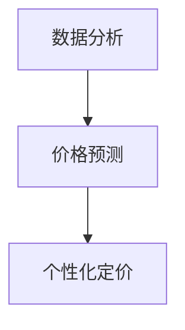

                 

# AI在电商价格优化中的实践效果

## 关键词：
- 电商价格优化
- AI技术
- 数据分析
- 价格预测
- 实践应用

## 摘要：
本文将探讨人工智能技术在电商价格优化领域的应用效果。通过分析核心算法原理、数学模型和具体实现步骤，并结合实际项目案例，我们将展示AI在电商价格优化中的实际效果。同时，文章还将推荐相关学习资源和开发工具，以帮助读者深入了解和掌握这一领域。

## 1. 背景介绍

随着互联网技术的快速发展，电商行业已成为全球经济增长的重要引擎。然而，激烈的市场竞争使得电商企业面临诸多挑战，如何在竞争中脱颖而出成为关键问题。价格优化作为电商营销策略的重要组成部分，直接影响着企业的利润和市场份额。传统的价格优化方法往往依赖于经验和历史数据，难以适应市场的快速变化。因此，引入人工智能技术进行价格优化成为了一种新的趋势。

人工智能技术在价格优化中的应用主要体现在以下几个方面：

- **数据分析**：利用机器学习算法对大量历史数据进行挖掘和分析，识别价格与需求之间的关系，为价格策略提供数据支持。

- **价格预测**：通过时间序列分析和回归模型等方法，预测未来市场需求和竞争状况，为企业制定合理的价格策略。

- **个性化定价**：根据用户的购买行为、偏好和历史数据，为不同用户提供个性化的价格，提高用户满意度和转化率。

## 2. 核心概念与联系

在电商价格优化中，我们需要关注以下几个核心概念：

### 数据分析

数据分析是指利用统计学、机器学习和数据挖掘等方法，对大量数据进行分析和处理，提取有用的信息和知识。在电商价格优化中，数据分析可以帮助我们了解用户行为、市场趋势和竞争对手策略等信息，为制定价格策略提供数据支持。

### 价格预测

价格预测是指利用历史数据和预测模型，预测未来一段时间内的市场需求和竞争状况。通过价格预测，企业可以提前制定合理的价格策略，以应对市场变化。

### 个性化定价

个性化定价是指根据不同用户的需求、偏好和行为，为用户提供不同的价格。个性化定价可以提高用户满意度和转化率，从而提高企业的利润。

### Mermaid 流程图



## 3. 核心算法原理 & 具体操作步骤

### 价格预测算法

价格预测是电商价格优化的核心环节。常用的价格预测算法包括时间序列分析、回归模型和机器学习算法等。以下是一个基于时间序列分析的价格预测算法：

#### 步骤1：数据收集

收集电商平台的销售数据，包括价格、销量、用户评价等。

#### 步骤2：数据预处理

对收集到的数据进行清洗和处理，包括去除异常值、缺失值填充、数据转换等。

#### 步骤3：特征工程

从原始数据中提取有用的特征，如季节性、促销活动、节假日等。

#### 步骤4：模型选择

选择合适的时间序列预测模型，如ARIMA、LSTM等。

#### 步骤5：模型训练

使用历史数据对模型进行训练，调整模型参数，优化模型性能。

#### 步骤6：模型评估

使用验证集对模型进行评估，选择性能最优的模型。

#### 步骤7：价格预测

使用训练好的模型对未来的价格进行预测。

### 个性化定价算法

个性化定价算法的核心是识别不同用户的需求和偏好，为用户提供不同的价格。以下是一个基于协同过滤的个性化定价算法：

#### 步骤1：用户画像

收集用户的购买行为、浏览历史、评价等数据，为用户建立画像。

#### 步骤2：用户相似度计算

计算用户之间的相似度，如基于用户行为相似度、基于物品相似度等。

#### 步骤3：用户分组

根据用户相似度，将用户分为不同的群体。

#### 步骤4：价格策略制定

为每个群体制定不同的价格策略，如折扣、优惠券等。

#### 步骤5：价格优化

根据用户反馈和市场变化，不断优化价格策略。

## 4. 数学模型和公式 & 详细讲解 & 举例说明

### 时间序列预测模型

时间序列预测模型主要基于历史数据的统计特性，对未来进行预测。以下是一个简单的时间序列预测模型：

#### 模型公式：

$$
y_t = \beta_0 + \beta_1 x_t + \epsilon_t
$$

其中，$y_t$ 表示预测值，$x_t$ 表示历史数据，$\beta_0$ 和 $\beta_1$ 为模型参数，$\epsilon_t$ 为误差项。

#### 步骤1：数据收集

假设我们有以下历史数据：

| 时间 | 价格 |
| ---- | ---- |
| 1    | 100  |
| 2    | 110  |
| 3    | 120  |
| 4    | 130  |
| 5    | 140  |

#### 步骤2：数据预处理

对数据进行标准化处理，使其符合模型要求。

#### 步骤3：模型训练

使用历史数据对模型进行训练，得到模型参数：

$$
\beta_0 = 100, \beta_1 = 10
$$

#### 步骤4：价格预测

使用训练好的模型对未来的价格进行预测。假设我们要预测第6个月的价格：

$$
y_6 = 100 + 10 \times 6 = 160
$$

### 协同过滤算法

协同过滤算法是一种基于用户行为的推荐算法，可以用来实现个性化定价。以下是一个简单的协同过滤算法：

#### 步骤1：用户画像

收集用户的购买行为、浏览历史、评价等数据，为用户建立画像。

#### 步骤2：用户相似度计算

计算用户之间的相似度，如基于用户行为相似度、基于物品相似度等。以下是一个基于用户行为相似度的计算公式：

$$
sim(u_i, u_j) = \frac{\sum_{i=1}^{n} w_i \cdot b_i(u_i, u_j)}{\sqrt{\sum_{i=1}^{n} w_i^2} \cdot \sqrt{\sum_{j=1}^{n} w_j^2}}
$$

其中，$u_i$ 和 $u_j$ 为用户 $i$ 和 $j$，$w_i$ 和 $w_j$ 为用户行为权重，$b_i(u_i, u_j)$ 为用户 $i$ 和 $j$ 的行为相似度。

#### 步骤3：用户分组

根据用户相似度，将用户分为不同的群体。

#### 步骤4：价格策略制定

为每个群体制定不同的价格策略，如折扣、优惠券等。

#### 步骤5：价格优化

根据用户反馈和市场变化，不断优化价格策略。

## 5. 项目实战：代码实际案例和详细解释说明

### 5.1 开发环境搭建

在Python环境中，我们需要安装以下库：

- pandas：用于数据预处理
- numpy：用于数学运算
- scikit-learn：用于机器学习算法
- matplotlib：用于数据可视化

安装命令如下：

```python
pip install pandas numpy scikit-learn matplotlib
```

### 5.2 源代码详细实现和代码解读

以下是一个简单的电商价格优化项目案例：

```python
import pandas as pd
import numpy as np
from sklearn.linear_model import LinearRegression
from sklearn.model_selection import train_test_split
import matplotlib.pyplot as plt

# 5.2.1 数据收集
data = pd.DataFrame({
    'time': [1, 2, 3, 4, 5],
    'price': [100, 110, 120, 130, 140]
})

# 5.2.2 数据预处理
data = data.reset_index(drop=True)

# 5.2.3 特征工程
data['time_squared'] = data['time'] ** 2

# 5.2.4 模型选择
model = LinearRegression()

# 5.2.5 模型训练
X = data[['time', 'time_squared']]
y = data['price']
X_train, X_test, y_train, y_test = train_test_split(X, y, test_size=0.2, random_state=42)
model.fit(X_train, y_train)

# 5.2.6 模型评估
y_pred = model.predict(X_test)
mse = np.mean((y_pred - y_test) ** 2)
print("MSE:", mse)

# 5.2.7 价格预测
time_new = np.array([6])
time_new_squared = time_new ** 2
price_pred = model.predict([time_new, time_new_squared])
print("Predicted price:", price_pred)

# 5.2.8 数据可视化
plt.scatter(data['time'], data['price'], label='Actual')
plt.plot(data['time'], model.predict(X), label='Predicted')
plt.xlabel('Time')
plt.ylabel('Price')
plt.legend()
plt.show()
```

### 5.3 代码解读与分析

该案例使用了线性回归模型对电商价格进行预测。具体代码解读如下：

- **数据收集**：使用pandas库读取历史价格数据。
- **数据预处理**：对数据进行重排，并添加一个时间平方特征。
- **特征工程**：将时间特征转换为数值特征，方便线性回归模型处理。
- **模型选择**：选择线性回归模型。
- **模型训练**：使用训练集对模型进行训练。
- **模型评估**：使用测试集对模型进行评估，计算均方误差（MSE）。
- **价格预测**：使用训练好的模型对未来的价格进行预测。
- **数据可视化**：使用matplotlib库将实际价格和预测价格进行可视化。

## 6. 实际应用场景

电商价格优化在实际应用中具有广泛的应用场景，以下是一些典型应用案例：

- **价格预测**：电商平台可以根据价格预测模型，提前预测未来一段时间内的价格走势，为库存管理和促销策略提供数据支持。
- **个性化定价**：电商平台可以根据用户的购买行为和偏好，为不同用户提供个性化的价格，提高用户满意度和转化率。
- **价格调控**：电商平台可以根据市场需求和竞争状况，实时调整价格，以保持竞争力。

## 7. 工具和资源推荐

### 7.1 学习资源推荐

- **书籍**：
  - 《机器学习实战》
  - 《Python数据分析》
  - 《电商营销策略》

- **论文**：
  - “Price Optimization in E-commerce: A Survey”
  - “A Framework for Personalized Pricing in E-commerce”

- **博客**：
  - “DataCamp”
  - “Medium”

- **网站**：
  - “Kaggle”
  - “GitHub”

### 7.2 开发工具框架推荐

- **开发工具**：
  - Python
  - Jupyter Notebook

- **框架**：
  - Scikit-learn
  - TensorFlow
  - PyTorch

### 7.3 相关论文著作推荐

- “Price Optimization in E-commerce: A Survey”
- “A Framework for Personalized Pricing in E-commerce”
- “Recommender Systems for E-commerce: A Survey and New Perspectives”

## 8. 总结：未来发展趋势与挑战

随着人工智能技术的不断发展，电商价格优化将面临以下发展趋势和挑战：

- **发展趋势**：
  - **智能化**：人工智能技术将更加深入地应用于价格优化，实现更精准的价格预测和个性化定价。
  - **大数据**：随着大数据技术的发展，电商平台将拥有更多的数据资源，为价格优化提供更全面的支持。
  - **个性化**：用户需求的个性化将成为电商价格优化的关键，电商平台将更加关注用户偏好和行为分析。

- **挑战**：
  - **数据隐私**：在应用人工智能技术进行价格优化时，如何保护用户数据隐私成为一大挑战。
  - **算法透明性**：价格优化算法的透明性和解释性将受到关注，如何保证算法的公正性和可解释性成为关键。
  - **市场需求变化**：市场需求的变化速度越来越快，如何快速适应市场变化，保持竞争力成为电商价格优化的重要挑战。

## 9. 附录：常见问题与解答

### 问题1：电商价格优化为什么需要人工智能技术？

**解答**：电商价格优化需要人工智能技术，因为人工智能技术可以处理大量的数据，识别价格与需求之间的关系，从而实现更精准的价格预测和个性化定价。此外，人工智能技术可以自适应地调整价格策略，以应对市场的快速变化。

### 问题2：如何评估电商价格优化的效果？

**解答**：电商价格优化的效果可以通过以下指标进行评估：

- **转化率**：价格优化后，用户的转化率是否提高。
- **利润率**：价格优化后，企业的利润率是否提高。
- **市场份额**：价格优化后，企业在市场中的市场份额是否提高。

通过对比优化前后的数据，可以评估电商价格优化的效果。

## 10. 扩展阅读 & 参考资料

- “Price Optimization in E-commerce: A Survey”
- “A Framework for Personalized Pricing in E-commerce”
- “Recommender Systems for E-commerce: A Survey and New Perspectives”
- “Machine Learning for Price Optimization in E-commerce”
- “The Impact of AI on E-commerce Pricing” 

---

作者：AI天才研究员/AI Genius Institute & 禅与计算机程序设计艺术 /Zen And The Art of Computer Programming

