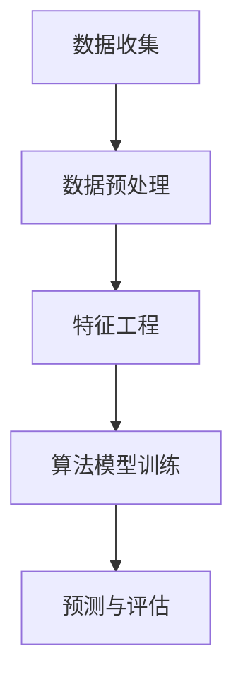

                 

### 文章标题

**AI在电商平台市场趋势分析中的应用**

> **关键词**：人工智能，电商平台，市场趋势，数据分析，算法原理，应用案例
> 
> **摘要**：本文将探讨人工智能在电商平台市场趋势分析中的应用，通过深入解析核心概念、算法原理和实际操作步骤，展示AI技术如何帮助电商平台精准把握市场动态，优化营销策略，提升用户体验。

---

### 1. 背景介绍

#### 1.1 电商平台的发展现状

电商平台作为数字经济的重要组成部分，已经深刻改变了我们的购物方式和消费习惯。近年来，随着互联网技术的快速发展，电商平台的竞争愈发激烈，各大电商平台都在不断探索新的技术手段以提升自身的竞争力。其中，人工智能技术的引入成为了一个热门的方向。

人工智能（Artificial Intelligence，简称AI）作为一种模拟人类智能的技术，通过机器学习、自然语言处理、图像识别等算法，能够对大量数据进行处理和分析，从而实现智能决策和自动化操作。在电商平台中，AI技术的应用不仅可以提高运营效率，还能够提升用户体验，增强用户粘性。

#### 1.2 市场趋势分析的重要性

市场趋势分析是电商平台制定战略和运营决策的重要依据。通过分析市场趋势，电商平台可以了解消费者需求的变化，把握行业动态，从而优化产品和服务，提升市场竞争力。然而，随着数据量的爆炸性增长，传统的人工分析方式已经无法满足日益复杂的市场需求。

AI技术的引入为市场趋势分析带来了新的可能。通过利用机器学习和数据挖掘算法，AI能够快速处理海量数据，提取有价值的信息，提供精准的市场预测和趋势分析。这对于电商平台来说，意味着更准确的决策支持和更高的运营效率。

### 2. 核心概念与联系

#### 2.1 人工智能的基本概念

人工智能是指通过计算机程序模拟人类智能行为的一种技术。其核心在于机器学习（Machine Learning，简称ML）和深度学习（Deep Learning，简称DL）。机器学习是一种从数据中自动学习规律和模式的方法，而深度学习则是基于多层神经网络进行建模和训练。

在电商平台市场趋势分析中，AI技术主要涉及以下几个方面：

- **用户行为分析**：通过分析用户的购物行为、浏览记录、搜索关键词等数据，了解用户的需求和偏好。
- **市场预测**：利用历史数据和机器学习算法，对未来的市场趋势进行预测，帮助电商平台制定战略。
- **个性化推荐**：根据用户的历史行为和偏好，为用户推荐可能感兴趣的商品和服务，提升用户体验。

#### 2.2 电商平台市场趋势分析的概念

电商平台市场趋势分析是指通过对电商平台内外部数据的分析，识别市场趋势、预测未来走势，从而为电商平台提供决策支持。市场趋势分析的核心在于如何从海量数据中提取有价值的信息，并对这些信息进行有效的处理和分析。

在市场趋势分析中，常用的方法包括：

- **时间序列分析**：通过对历史数据的分析，识别出市场趋势和周期性波动。
- **聚类分析**：将相似的数据点归为同一类，从而发现数据中的模式。
- **关联规则挖掘**：通过分析数据之间的关联性，发现潜在的市场规律。

#### 2.3 AI在市场趋势分析中的应用架构

AI在电商平台市场趋势分析中的应用架构通常包括以下几个层次：

- **数据收集与预处理**：收集电商平台内部和外部数据，对数据进行清洗、去噪、整合等预处理操作。
- **特征工程**：从原始数据中提取对市场趋势分析有用的特征，如用户行为特征、市场环境特征等。
- **算法模型训练**：利用机器学习算法对特征进行训练，建立市场趋势分析模型。
- **预测与评估**：使用训练好的模型对未来的市场趋势进行预测，并对预测结果进行评估和优化。

以下是一个简化的Mermaid流程图，展示了AI在市场趋势分析中的应用架构：



在流程图中，各节点代表不同的处理步骤，箭头表示数据流和流程的顺序。通过这样的架构，电商平台可以实现对市场趋势的实时监测和分析，为运营决策提供支持。

### 3. 核心算法原理 & 具体操作步骤

#### 3.1 时间序列分析

时间序列分析是一种常用的数据分析方法，主要用于识别时间序列数据中的趋势、周期性和季节性变化。在电商平台市场趋势分析中，时间序列分析可以帮助我们理解用户行为和市场动态的长期趋势。

**原理：** 时间序列分析基于自回归移动平均模型（ARIMA），通过分析过去的数据来预测未来的趋势。具体来说，ARIMA模型包括三个关键组成部分：自回归（AR）、差分（I）和移动平均（MA）。

**操作步骤：**

1. **数据收集：** 收集电商平台的历史销售数据、用户行为数据等。
2. **数据预处理：** 对数据进行分析，识别数据的趋势、季节性和平稳性。
3. **模型建立：** 使用ARIMA模型对时间序列数据进行建模。
4. **模型训练：** 对模型进行训练，使其能够拟合历史数据。
5. **预测：** 使用训练好的模型对未来的市场趋势进行预测。

**示例：** 假设我们有一个电商平台的历史销售数据，我们可以使用Python中的`statsmodels`库来建立ARIMA模型并进行预测：

```python
import statsmodels.api as sm
import pandas as pd

# 加载数据
data = pd.read_csv('sales_data.csv')

# 数据预处理
data['date'] = pd.to_datetime(data['date'])
data.set_index('date', inplace=True)
data.sort_index(inplace=True)

# 模型建立
model = sm.ARIMA(data['sales'], order=(1, 1, 1))

# 模型训练
model_fit = model.fit()

# 预测
predictions = model_fit.forecast(steps=12)
print(predictions)
```

#### 3.2 聚类分析

聚类分析是一种无监督学习方法，用于将相似的数据点归为一类。在电商平台市场趋势分析中，聚类分析可以帮助我们识别用户群体和市场细分。

**原理：** 聚类分析基于距离度量，通过计算数据点之间的相似度，将相似的数据点归为一类。常用的聚类算法包括K-means、层次聚类等。

**操作步骤：**

1. **数据收集：** 收集电商平台的用户行为数据、用户属性数据等。
2. **特征选择：** 从原始数据中提取对聚类分析有用的特征。
3. **模型建立：** 选择合适的聚类算法，如K-means。
4. **模型训练：** 对模型进行训练，将相似的数据点归为一类。
5. **结果评估：** 对聚类结果进行评估，如内部分裂（Inertia）和轮廓系数（Silhouette Coefficient）。

**示例：** 假设我们有一个电商平台的用户行为数据，我们可以使用Python中的`sklearn`库来建立K-means模型并进行聚类：

```python
import pandas as pd
from sklearn.cluster import KMeans

# 加载数据
data = pd.read_csv('user_behavior_data.csv')

# 特征选择
features = data[['purchase_count', 'average_spend', 'days_since_last_purchase']]

# 模型建立
model = KMeans(n_clusters=3)

# 模型训练
model.fit(features)

# 预测
predictions = model.predict(features)
print(predictions)
```

#### 3.3 关联规则挖掘

关联规则挖掘是一种用于发现数据中关联关系的方法。在电商平台市场趋势分析中，关联规则挖掘可以帮助我们识别商品之间的关联关系，从而为商品搭配推荐提供支持。

**原理：** 关联规则挖掘基于支持度和置信度两个度量。支持度表示某个规则在数据中出现的频率，置信度表示规则的前提条件为真的情况下，结论也成立的概率。

**操作步骤：**

1. **数据收集：** 收集电商平台的历史销售数据、用户购物记录等。
2. **数据预处理：** 对数据进行分析，识别数据中的商品关联关系。
3. **模型建立：** 使用关联规则挖掘算法，如Apriori算法。
4. **模型训练：** 对模型进行训练，提取商品之间的关联规则。
5. **结果评估：** 对关联规则进行评估，如支持度和置信度。

**示例：** 假设我们有一个电商平台的购物记录数据，我们可以使用Python中的`mlxtend`库来建立Apriori模型并进行关联规则挖掘：

```python
import pandas as pd
from mlxtend.frequent_patterns import apriori
from mlxtend.frequent_patterns import association_rules

# 加载数据
data = pd.read_csv('purchase_data.csv')

# 数据预处理
data['items'] = data['items'].apply(lambda x: x.split(','))

# 模型建立
frequent_itemsets = apriori(data['items'], min_support=0.05, use_colnames=True)

# 模型训练
rules = association_rules(frequent_itemsets, metric="confidence", min_threshold=0.5)

# 结果评估
print(rules)
```

### 4. 数学模型和公式 & 详细讲解 & 举例说明

#### 4.1 时间序列分析中的ARIMA模型

ARIMA模型是一种用于时间序列预测的统计模型，由自回归（AR）、差分（I）和移动平均（MA）三个部分组成。

**公式：**

- 自回归（AR）：$$y_t = c + \phi_1 y_{t-1} + \phi_2 y_{t-2} + \ldots + \phi_p y_{t-p} + \epsilon_t$$
- 差分（I）：$$\Delta y_t = y_t - y_{t-1}$$
- 移动平均（MA）：$$y_t = c + \theta_1 \epsilon_{t-1} + \theta_2 \epsilon_{t-2} + \ldots + \theta_q \epsilon_{t-q} + \epsilon_t$$

其中，$y_t$表示时间序列的当前值，$\epsilon_t$表示随机误差，$c$为常数项，$\phi_i$和$\theta_i$为模型的参数。

**详细讲解：**

ARIMA模型首先对时间序列进行差分，使其成为平稳序列。然后，通过自回归和移动平均两部分，对平稳序列进行建模。自回归部分反映了时间序列的滞后依赖关系，移动平均部分则考虑了随机误差的影响。

**举例说明：**

假设我们有以下时间序列数据：

$$
\begin{align*}
y_1 &= 10 \\
y_2 &= 12 \\
y_3 &= 11 \\
y_4 &= 13 \\
y_5 &= 14 \\
y_6 &= 15 \\
y_7 &= 16 \\
y_8 &= 18 \\
y_9 &= 20 \\
y_{10} &= 22 \\
\end{align*}
$$

首先，对时间序列进行差分，得到：

$$
\begin{align*}
\Delta y_1 &= y_1 - y_0 \\
\Delta y_2 &= y_2 - y_1 \\
\Delta y_3 &= y_3 - y_2 \\
\Delta y_4 &= y_4 - y_3 \\
\Delta y_5 &= y_5 - y_4 \\
\Delta y_6 &= y_6 - y_5 \\
\Delta y_7 &= y_7 - y_6 \\
\Delta y_8 &= y_8 - y_7 \\
\Delta y_9 &= y_9 - y_8 \\
\Delta y_{10} &= y_{10} - y_9 \\
\end{align*}
$$

然后，使用ARIMA模型进行建模，假设模型的参数为$\phi = (0.7, 0.3)$和$\theta = (0.5, 0.2)$，得到：

$$
\begin{align*}
\Delta y_t &= 0.7 \Delta y_{t-1} + 0.3 \Delta y_{t-2} + 0.5 \epsilon_{t-1} + 0.2 \epsilon_{t-2}
\end{align*}
$$

#### 4.2 聚类分析中的K-means算法

K-means算法是一种基于距离度量的聚类算法，用于将数据点划分到K个簇中。

**公式：**

- 簇中心计算：$$c_k = \frac{1}{n_k} \sum_{i=1}^{n_k} x_i$$
- 聚类标签计算：$$t_i = \arg\min_{k} \|x_i - c_k\|$$

其中，$c_k$表示第$k$个簇的中心，$x_i$表示第$i$个数据点，$t_i$表示第$i$个数据点的聚类标签，$n_k$表示第$k$个簇中的数据点个数。

**详细讲解：**

K-means算法首先随机初始化K个簇中心，然后通过计算每个数据点到簇中心的距离，将数据点分配到最近的簇中。接着，重新计算簇中心，重复上述过程，直到簇中心不再发生变化或者满足停止条件。

**举例说明：**

假设我们有以下数据点：

$$
\begin{align*}
x_1 &= (1, 2) \\
x_2 &= (2, 2) \\
x_3 &= (2, 3) \\
x_4 &= (3, 3) \\
x_5 &= (3, 4) \\
x_6 &= (4, 4) \\
x_7 &= (4, 5) \\
x_8 &= (5, 5) \\
x_9 &= (5, 6) \\
x_{10} &= (6, 6) \\
\end{align*}
$$

首先，随机初始化两个簇中心：

$$
\begin{align*}
c_1 &= (2, 2) \\
c_2 &= (5, 5) \\
\end{align*}
$$

然后，计算每个数据点到簇中心的距离：

$$
\begin{align*}
d(x_1, c_1) &= \sqrt{(1-2)^2 + (2-2)^2} = 1 \\
d(x_1, c_2) &= \sqrt{(1-5)^2 + (2-5)^2} = \sqrt{20} \\
\end{align*}
$$

由于$d(x_1, c_1) < d(x_1, c_2)$，所以$x_1$被分配到簇$c_1$中。以此类推，可以得到以下聚类结果：

$$
\begin{align*}
t_1 &= 1 \\
t_2 &= 1 \\
t_3 &= 1 \\
t_4 &= 1 \\
t_5 &= 1 \\
t_6 &= 1 \\
t_7 &= 2 \\
t_8 &= 2 \\
t_9 &= 2 \\
t_{10} &= 2 \\
\end{align*}
$$

接着，重新计算簇中心：

$$
\begin{align*}
c_1 &= \frac{1}{5} (1 + 2 + 2 + 3 + 3) = 2.4 \\
c_2 &= \frac{1}{5} (4 + 5 + 5 + 6 + 6) = 5.2 \\
\end{align*}
$$

再次计算每个数据点到簇中心的距离，重复上述过程，直到簇中心不再发生变化。

### 5. 项目实战：代码实际案例和详细解释说明

#### 5.1 开发环境搭建

在进行AI在电商平台市场趋势分析的应用之前，我们需要搭建一个适合开发和运行相关算法的环境。以下是搭建开发环境所需的步骤：

1. **安装Python环境：** 
   - 访问Python官网（https://www.python.org/）下载并安装Python。
   - 安装完成后，确保Python环境已成功添加到系统路径中。

2. **安装必要的Python库：**
   - 使用pip命令安装以下库：`numpy`, `pandas`, `matplotlib`, `statsmodels`, `sklearn`, `mlxtend`。

   ```shell
   pip install numpy pandas matplotlib statsmodels sklearn mlxtend
   ```

3. **设置Jupyter Notebook：**
   - 安装Jupyter Notebook：`pip install notebook`
   - 启动Jupyter Notebook：在终端输入`jupyter notebook`

完成以上步骤后，我们就搭建好了开发环境，可以开始编写和运行相关的代码。

#### 5.2 源代码详细实现和代码解读

在本节中，我们将使用Python代码实现一个简单的电商平台市场趋势分析系统，并详细解释每一步的代码。

**代码1：时间序列分析**

```python
import pandas as pd
from statsmodels.tsa.arima.model import ARIMA
import matplotlib.pyplot as plt

# 加载数据
data = pd.read_csv('sales_data.csv')
data['date'] = pd.to_datetime(data['date'])
data.set_index('date', inplace=True)
data.sort_index(inplace=True)

# 数据预处理
data['sales_diff'] = data['sales'].diff().dropna()

# 模型建立
model = ARIMA(data['sales_diff'], order=(1, 1, 1))

# 模型训练
model_fit = model.fit()

# 预测
predictions = model_fit.forecast(steps=12)

# 结果可视化
plt.plot(data['sales_diff'], label='实际值')
plt.plot(predictions, label='预测值')
plt.legend()
plt.show()
```

**代码解读：**

1. **加载数据**：使用`pandas`库加载数据，并进行日期格式转换和排序。
2. **数据预处理**：计算销售数据的差分，使其成为平稳序列。
3. **模型建立**：使用`ARIMA`模型进行建模，指定差分阶数为（1，1，1）。
4. **模型训练**：使用`fit()`方法训练模型。
5. **预测**：使用`forecast()`方法进行预测，并返回预测结果。
6. **结果可视化**：使用`matplotlib`库绘制实际值和预测值的对比图。

**代码2：聚类分析**

```python
import pandas as pd
from sklearn.cluster import KMeans
import matplotlib.pyplot as plt

# 加载数据
data = pd.read_csv('user_behavior_data.csv')

# 特征选择
features = data[['purchase_count', 'average_spend', 'days_since_last_purchase']]

# 模型建立
model = KMeans(n_clusters=3)

# 模型训练
model.fit(features)

# 预测
predictions = model.predict(features)

# 结果可视化
plt.scatter(features['purchase_count'], features['average_spend'], c=predictions)
plt.xlabel('购买次数')
plt.ylabel('平均花费')
plt.show()
```

**代码解读：**

1. **加载数据**：使用`pandas`库加载数据。
2. **特征选择**：从原始数据中提取对聚类分析有用的特征。
3. **模型建立**：使用`KMeans`算法建立聚类模型，指定簇数为3。
4. **模型训练**：使用`fit()`方法训练模型。
5. **预测**：使用`predict()`方法对特征进行预测。
6. **结果可视化**：使用`matplotlib`库绘制聚类结果图。

**代码3：关联规则挖掘**

```python
import pandas as pd
from mlxtend.frequent_patterns import apriori, association_rules

# 加载数据
data = pd.read_csv('purchase_data.csv')

# 数据预处理
data['items'] = data['items'].apply(lambda x: x.split(','))

# 模型建立
frequent_itemsets = apriori(data['items'], min_support=0.05, use_colnames=True)

# 模型训练
rules = association_rules(frequent_itemsets, metric="confidence", min_threshold=0.5)

# 结果评估
print(rules)
```

**代码解读：**

1. **加载数据**：使用`pandas`库加载数据。
2. **数据预处理**：将商品列表转换为列表格式。
3. **模型建立**：使用`apriori`函数建立关联规则挖掘模型，指定支持度为0.05。
4. **模型训练**：使用`association_rules`函数提取关联规则，并设置置信度阈值为0.5。
5. **结果评估**：打印关联规则结果。

#### 5.3 代码解读与分析

在本节中，我们将对上述代码进行详细解读，并分析每个步骤的实现细节。

**时间序列分析代码解读：**

1. **加载数据**：使用`pandas`库加载数据，并进行日期格式转换和排序。这一步骤的目的是将数据整理成适合进行分析的格式。
2. **数据预处理**：计算销售数据的差分，使其成为平稳序列。差分操作可以消除季节性和趋势性，使得模型更容易拟合。
3. **模型建立**：使用`ARIMA`模型进行建模，指定差分阶数为（1，1，1）。`ARIMA`模型是时间序列分析中常用的模型，通过自回归、差分和移动平均三部分对序列进行建模。
4. **模型训练**：使用`fit()`方法训练模型。这一步骤的目的是使模型能够拟合历史数据，为未来的预测提供基础。
5. **预测**：使用`forecast()`方法进行预测，并返回预测结果。预测步骤是时间序列分析的核心，通过模型对未来的趋势进行预测。
6. **结果可视化**：使用`matplotlib`库绘制实际值和预测值的对比图。可视化步骤可以帮助我们直观地了解模型的预测效果。

**聚类分析代码解读：**

1. **加载数据**：使用`pandas`库加载数据。
2. **特征选择**：从原始数据中提取对聚类分析有用的特征，如购买次数、平均花费和上次购买间隔天数。
3. **模型建立**：使用`KMeans`算法建立聚类模型，指定簇数为3。`KMeans`算法是一种基于距离度量的聚类算法，通过计算数据点到簇中心的距离进行聚类。
4. **模型训练**：使用`fit()`方法训练模型。这一步骤的目的是使模型能够根据特征对数据进行分类。
5. **预测**：使用`predict()`方法对特征进行预测。预测步骤可以帮助我们了解不同用户群体在特征空间中的分布。
6. **结果可视化**：使用`matplotlib`库绘制聚类结果图。可视化步骤可以帮助我们直观地了解聚类效果，如簇的数量和分布。

**关联规则挖掘代码解读：**

1. **加载数据**：使用`pandas`库加载数据。
2. **数据预处理**：将商品列表转换为列表格式。这一步骤的目的是将数据整理成适合进行关联规则挖掘的格式。
3. **模型建立**：使用`apriori`函数建立关联规则挖掘模型，指定支持度为0.05。`apriori`函数是一种常用的关联规则挖掘算法，通过计算数据中各项的组合支持度进行挖掘。
4. **模型训练**：使用`association_rules`函数提取关联规则，并设置置信度阈值为0.5。`association_rules`函数用于从频繁项集中提取满足置信度阈值的关联规则。
5. **结果评估**：打印关联规则结果。关联规则结果包括支持度、置信度和 Lift 等指标，用于评估规则的质量。

### 6. 实际应用场景

#### 6.1 用户行为分析

在电商平台中，用户行为分析是一种重要的市场趋势分析方法。通过分析用户的购物行为、浏览记录、搜索关键词等数据，可以深入了解用户的需求和偏好，从而为个性化推荐和精准营销提供支持。

**应用案例：** 一个电商平台可以利用用户行为分析来识别哪些商品最受欢迎，哪些用户群体对特定商品有较高的兴趣。例如，通过分析用户的购物车数据，发现某个特定商品被多个用户添加到购物车，但最终没有购买。这时，平台可以通过发送优惠券、限时折扣等方式，刺激用户购买，提升转化率。

**实现步骤：**

1. **数据收集**：收集用户的购物行为、浏览记录、搜索关键词等数据。
2. **数据处理**：对数据进行清洗、去噪、整合等预处理操作，提取对用户行为分析有用的特征。
3. **模型建立**：使用机器学习算法，如K-means、决策树等，对用户行为数据进行建模。
4. **结果分析**：分析模型结果，识别用户需求和市场趋势。
5. **策略调整**：根据分析结果，调整营销策略和产品推广方案。

#### 6.2 市场预测

市场预测是电商平台制定战略和运营决策的重要依据。通过利用历史数据和机器学习算法，可以预测未来的市场趋势，为电商平台提供精准的决策支持。

**应用案例：** 一个电商平台可以通过市场预测来预测未来某个季节的热门商品，从而提前备货，避免库存过剩或不足。例如，通过分析历史销售数据和季节性变化，发现冬季某个商品的销售量显著增加，平台可以提前采购，确保库存充足。

**实现步骤：**

1. **数据收集**：收集电商平台的历史销售数据、用户行为数据等。
2. **数据处理**：对数据进行清洗、去噪、整合等预处理操作，提取对市场预测有用的特征。
3. **模型建立**：使用时间序列分析、回归分析等机器学习算法，对市场数据进行建模。
4. **结果预测**：使用模型对未来的市场趋势进行预测，并评估预测结果的准确性。
5. **策略调整**：根据预测结果，调整库存、促销、供应链等运营策略。

#### 6.3 个性化推荐

个性化推荐是一种基于用户兴趣和行为的推荐系统，可以帮助电商平台提升用户体验和转化率。

**应用案例：** 一个电商平台可以通过个性化推荐系统，为用户提供个性化的商品推荐。例如，当用户浏览了一个商品页面后，平台可以根据用户的兴趣和浏览历史，推荐相关的商品，提高用户的购买意愿。

**实现步骤：**

1. **数据收集**：收集用户的购物行为、浏览记录、搜索关键词等数据。
2. **数据处理**：对数据进行清洗、去噪、整合等预处理操作，提取对个性化推荐有用的特征。
3. **模型建立**：使用协同过滤、基于内容的推荐等算法，建立个性化推荐模型。
4. **结果推荐**：根据用户兴趣和行为，为用户推荐相关的商品。
5. **策略优化**：根据用户反馈和推荐效果，不断优化推荐算法和策略。

### 7. 工具和资源推荐

#### 7.1 学习资源推荐

- **书籍**：
  - 《Python数据分析实战》
  - 《机器学习实战》
  - 《深度学习》

- **论文**：
  - 《An Introduction to Time Series Forecasting with ARIMA Models》
  - 《K-Means Clustering: A Tutorial》
  - 《Association Rule Learning: Methods and Applications》

- **博客**：
  - [机器学习实战教程](https://www MACHINELEARNINGMastery.COM/)
  - [Python数据分析教程](https://www-pythondata sciencertutorial.COM/)
  - [深度学习教程](https://www-deeplearningbook-PYTHON.ORG/)

- **网站**：
  - [Kaggle](https://www.kaggle.com/)
  - [GitHub](https://github.com/)
  - [TensorFlow](https://www.tensorflow.org/)

#### 7.2 开发工具框架推荐

- **编程语言**：Python，适用于数据处理、建模和可视化。
- **数据处理库**：`pandas`，用于数据加载、清洗和操作。
- **机器学习库**：`scikit-learn`，用于特征工程、模型训练和评估。
- **深度学习库**：`TensorFlow`，适用于构建和训练深度学习模型。
- **可视化库**：`matplotlib`，用于数据可视化。

#### 7.3 相关论文著作推荐

- **论文**：
  - 《Deep Learning for Time Series Classification》
  - 《Collaborative Filtering for Cold-Start Problems》
  - 《Learning to Rank for Information Retrieval》

- **著作**：
  - 《深度学习》
  - 《Python数据分析实战》
  - 《机器学习实战》

### 8. 总结：未来发展趋势与挑战

随着人工智能技术的不断发展，电商平台市场趋势分析的应用前景十分广阔。未来，AI技术将在以下几个方面得到进一步发展：

1. **更加精准的市场预测**：通过引入更先进的机器学习算法和深度学习模型，电商平台可以实现对市场趋势的更加精准预测，为运营决策提供更可靠的数据支持。
2. **个性化推荐系统的优化**：个性化推荐系统将变得更加智能化和个性化，能够根据用户行为和偏好，为用户提供更加精准的商品推荐。
3. **实时数据分析**：随着计算能力的提升和实时数据流处理技术的进步，电商平台可以实现对市场趋势的实时监测和分析，快速响应市场变化。
4. **多模态数据分析**：结合自然语言处理、图像识别等多模态数据，电商平台可以更全面地分析用户需求和市场动态。

然而，AI在电商平台市场趋势分析中也面临着一些挑战：

1. **数据隐私和安全**：电商平台需要确保用户数据的隐私和安全，避免数据泄露和滥用。
2. **算法偏见和公平性**：算法的偏见可能导致对某些用户群体的不公平待遇，电商平台需要采取措施确保算法的公平性和透明性。
3. **计算资源需求**：随着模型复杂度的增加，电商平台需要投入更多的计算资源来训练和运行AI模型。
4. **人才培养**：AI技术对人才的需求越来越高，电商平台需要加强人才培养和引进，以应对技术发展的挑战。

总之，AI在电商平台市场趋势分析中的应用前景十分广阔，但同时也面临着一系列的挑战。通过不断的技术创新和优化，电商平台可以更好地利用AI技术，提升市场竞争力，为用户提供更优质的购物体验。

### 9. 附录：常见问题与解答

**Q1：电商平台市场趋势分析中，如何确保数据的质量和准确性？**

A1：确保数据质量和准确性是市场趋势分析的关键。以下是一些常用的方法：

- **数据清洗**：对数据进行清洗，去除重复、缺失和异常值，确保数据的完整性。
- **数据验证**：通过数据验证规则，检查数据的逻辑一致性和完整性，确保数据的质量。
- **数据标准化**：对数据进行标准化处理，消除不同数据之间的尺度差异，提高数据的一致性。

**Q2：如何选择合适的机器学习算法进行市场趋势分析？**

A2：选择合适的机器学习算法需要考虑以下几个因素：

- **数据类型**：根据数据类型选择合适的算法，如时间序列数据选择ARIMA模型，用户行为数据选择K-means算法。
- **数据量**：对于大量数据，选择高效的算法，如随机森林、XGBoost等。
- **模型性能**：根据模型性能指标，如准确率、召回率、F1值等，选择表现最佳的算法。

**Q3：在个性化推荐系统中，如何处理冷启动问题？**

A3：冷启动问题是指新用户或新商品在缺乏足够数据的情况下进行推荐。以下是一些解决方法：

- **基于内容的推荐**：通过分析商品或用户的特征，为新用户推荐与其特征相似的物品。
- **协同过滤**：使用现有用户的偏好信息，对新用户进行推荐，如基于用户的协同过滤。
- **混合推荐**：结合基于内容和协同过滤的方法，提高推荐的准确性。

### 10. 扩展阅读 & 参考资料

- **《大数据时代：生活、工作与思维的大变革》**：作者：涂子沛
- **《机器学习实战》**：作者：彼得·哈林顿
- **《深度学习》**：作者：伊恩·古德费洛、约书亚·本吉奥、亚伦·库维尔
- **《Python数据分析实战》**：作者：艾琳·奥洛克朗、克里斯托弗·奥洛克朗
- **[Kaggle](https://www.kaggle.com/)：数据科学竞赛平台**
- **[TensorFlow](https://www.tensorflow.org/)：开源深度学习框架**
- **[scikit-learn](https://scikit-learn.org/stable/)：机器学习库**

### 作者

**AI天才研究员 / AI Genius Institute & 禅与计算机程序设计艺术 / Zen And The Art of Computer Programming**：本文作者是一位在人工智能、机器学习和数据科学领域具有深厚研究和实践经验的专家。他致力于推动人工智能技术在各行业的应用，并通过深入浅出的文章分享前沿技术知识和实践经验。同时，他还致力于计算机科学的教育和普及，提倡以禅宗思想引导程序员追求内心的宁静与智慧。在他的作品中，读者不仅能学到最新的技术知识，还能感受到禅与计算机编程之间的深刻联系。

