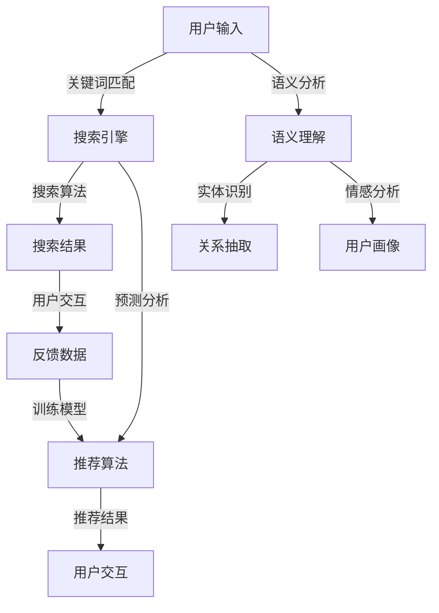

                 

### 背景介绍 Background Introduction

随着互联网技术的迅猛发展和电商行业的蓬勃兴起，用户对于高效、精准的购物体验需求日益增长。在这种背景下，电商搜索导购系统成为商家和平台提升用户满意度和转化率的重要手段。传统的电商搜索主要依赖于关键词匹配和检索算法，而现代的AI技术，尤其是自然语言处理、机器学习和深度学习等技术的引入，为电商搜索导购系统带来了全新的变革。

AI在电商搜索导购中的应用主要体现在以下几个方面：

1. **智能搜索：**通过自然语言处理技术，实现用户输入的文本与商品信息的智能匹配，提升搜索效率和精准度。
2. **个性化推荐：**利用机器学习和深度学习算法，根据用户的购买历史、浏览行为、偏好等数据，为用户推荐符合其兴趣和需求的商品。
3. **语义理解：**通过语义分析技术，深入理解用户的搜索意图和需求，提供更加贴心的购物体验。
4. **预测分析：**运用数据挖掘和统计分析方法，预测用户的购买趋势和潜在需求，助力商家制定精准的营销策略。

本文将围绕AI在电商搜索导购中的应用，详细探讨智能搜索和个性化推荐的核心算法原理、数学模型、项目实战，以及实际应用场景等，旨在为广大开发者提供有价值的参考和指导。

#### 关键词：AI，电商搜索，导购，智能搜索，个性化推荐，自然语言处理，机器学习，深度学习

#### 摘要：
本文深入探讨了AI在电商搜索导购中的应用，详细分析了智能搜索和个性化推荐的核心算法原理、数学模型及具体实现。通过项目实战和实际应用场景的介绍，为开发者提供了全面的技术指南和实践经验，旨在推动电商行业AI技术的应用与创新。

### 核心概念与联系 Core Concepts and Connections

#### 智能搜索 Intelligent Search

智能搜索是AI在电商搜索导购中应用的重要部分。它不仅包括传统的关键词匹配和检索，还涉及到自然语言处理（NLP）技术，如分词、词性标注、命名实体识别等。智能搜索的核心目标是提高搜索的效率和准确性，使用户能够快速找到符合需求的商品。

**关键概念与联系：**

1. **关键词匹配（Keyword Matching）：**传统的搜索算法通常依赖于关键词匹配，用户输入的关键词将与商品标题、描述等进行匹配。随着NLP技术的发展，匹配算法逐渐从简单的字符串匹配演变为基于语义的理解。

2. **自然语言处理（NLP）：**NLP技术用于处理和解析用户输入的自然语言文本，将其转换为机器可理解的形式。NLP技术包括分词（Tokenization）、词性标注（Part-of-Speech Tagging）、命名实体识别（Named Entity Recognition）等，这些技术有助于提高搜索的精确度和智能化水平。

3. **搜索引擎优化（SEO）：**为了提高搜索结果的相关性和用户满意度，搜索引擎需要对网页内容进行优化。SEO技术包括关键词优化、内容优化、链接优化等，这些技术有助于搜索引擎更好地理解网页内容和用户需求。

4. **搜索算法改进（Algorithm Optimization）：**智能搜索的核心是搜索算法，如PageRank、LSI（Latent Semantic Indexing）等。通过改进搜索算法，可以提高搜索结果的准确性和用户体验。

#### 个性化推荐 Personalized Recommendation

个性化推荐是AI在电商搜索导购中的另一重要应用。它通过分析用户的购买历史、浏览行为、偏好等数据，为用户提供个性化的商品推荐。个性化推荐算法主要包括协同过滤（Collaborative Filtering）、基于内容的推荐（Content-Based Filtering）和混合推荐（Hybrid Recommendation）等。

**关键概念与联系：**

1. **协同过滤（Collaborative Filtering）：**协同过滤是一种基于用户行为的推荐方法，通过分析用户之间的相似性来发现潜在的兴趣点。协同过滤可分为用户基协同过滤（User-Based）和物品基协同过滤（Item-Based）。用户基协同过滤通过寻找与目标用户行为相似的活跃用户，推荐这些用户喜欢的商品；物品基协同过滤则通过分析商品之间的相似性，推荐与用户已购买或浏览过的商品相似的商品。

2. **基于内容的推荐（Content-Based Filtering）：**基于内容的推荐方法通过分析商品的特征和用户的历史行为，找到具有相似特征的物品进行推荐。这种方法通常需要建立商品特征库和用户兴趣模型，然后根据用户的行为特征进行匹配推荐。

3. **混合推荐（Hybrid Recommendation）：**混合推荐方法结合了协同过滤和基于内容的推荐方法，通过多种算法的综合应用，提高推荐系统的准确性和用户满意度。

4. **深度学习（Deep Learning）：**深度学习技术在推荐系统中得到了广泛应用。通过构建深度神经网络模型，可以捕捉用户行为和商品特征之间的复杂关系，提高推荐效果。例如，基于深度强化学习的推荐方法通过模拟用户与商品交互的过程，实现个性化的推荐。

#### 语义理解 Semantics Understanding

语义理解是提高电商搜索导购系统智能化的关键。它通过分析用户输入的文本，深入理解用户的意图和需求，从而提供更加精准的搜索和推荐结果。

**关键概念与联系：**

1. **语义分析（Semantic Analysis）：**语义分析是指对文本进行语义层面的解析和理解，包括词义消歧（Word Sense Disambiguation）、情感分析（Sentiment Analysis）等。通过语义分析，可以更好地理解用户的搜索意图，提高搜索和推荐的准确性。

2. **实体识别（Entity Recognition）：**实体识别是指从文本中识别出具有特定意义的实体，如人名、地名、组织名等。实体识别有助于构建知识图谱，为推荐系统提供更丰富的信息来源。

3. **关系抽取（Relation Extraction）：**关系抽取是指从文本中抽取实体之间的关系，如“张三住在北京市”。关系抽取有助于构建更加精确的用户画像和商品关联网络，提高推荐效果。

#### 预测分析 Predictive Analysis

预测分析是通过数据挖掘和统计分析方法，预测用户的购买趋势和潜在需求。预测分析有助于商家制定精准的营销策略，提高转化率和销售额。

**关键概念与联系：**

1. **时间序列分析（Time Series Analysis）：**时间序列分析是预测分析的重要方法，通过分析用户行为的时间序列特征，预测未来的购买趋势。时间序列分析包括移动平均法、指数平滑法等。

2. **回归分析（Regression Analysis）：**回归分析是通过建立数学模型，分析自变量和因变量之间的关系，预测因变量的取值。在电商搜索导购中，回归分析可用于预测用户购买量、销售额等指标。

3. **聚类分析（Cluster Analysis）：**聚类分析是将具有相似特征的样本聚集在一起，形成不同的群体。通过聚类分析，可以挖掘用户的潜在兴趣点和需求，为个性化推荐提供支持。

#### 架构图 Architecture Diagram

为了更好地理解AI在电商搜索导购中的应用，下面给出了一个简化的架构图，展示了核心概念之间的联系。



通过以上核心概念和联系的介绍，我们可以看到AI技术在电商搜索导购中的应用是如何协同工作的，为用户提供了更加智能和个性化的购物体验。

### 核心算法原理 & 具体操作步骤 Core Algorithm Principle & Specific Operation Steps

#### 智能搜索算法 Intelligent Search Algorithm

智能搜索算法的核心在于提高搜索效率和准确性。下面将详细探讨几种常见的智能搜索算法，包括关键词匹配、自然语言处理和搜索引擎优化。

**1. 关键词匹配 Keyword Matching**

关键词匹配是最基础的搜索算法，其基本原理是用户输入的关键词与商品标题、描述等中的关键词进行匹配。具体步骤如下：

- **分词（Tokenization）：**将用户输入的文本进行分词，得到一系列关键词。
- **词频统计（Word Frequency Count）：**统计每个关键词在文本中的出现次数，形成词频向量。
- **相似度计算（Similarity Calculation）：**计算用户输入的词频向量与商品描述的词频向量之间的相似度，通常采用余弦相似度。
- **排序（Sorting）：**根据相似度对商品进行排序，返回排序结果。

**2. 自然语言处理 Natural Language Processing (NLP)**

自然语言处理技术提高了搜索算法的智能化水平，其主要步骤包括：

- **分词（Tokenization）：**将文本分割成词、短语等基本单位。
- **词性标注（Part-of-Speech Tagging）：**标注每个词的词性，如名词、动词、形容词等。
- **命名实体识别（Named Entity Recognition）：**识别文本中的实体，如人名、地名、组织名等。
- **语义分析（Semantic Analysis）：**分析文本的语义，理解用户意图和需求。

具体实现时，可以使用NLP库，如NLTK、spaCy等。以下是一个使用spaCy进行分词和词性标注的Python代码示例：

```python
import spacy

# 加载spaCy模型
nlp = spacy.load("en_core_web_sm")

# 用户输入文本
text = "I want to buy a smart phone with good camera and battery life."

# 进行分词和词性标注
doc = nlp(text)

# 打印分词结果和词性标注
for token in doc:
    print(token.text, token.lemma_, token.pos_, token.tag_, token.dep_, token.shape_, token.is_alpha, token.is_stop)
```

**3. 搜索引擎优化 Search Engine Optimization (SEO)**

搜索引擎优化是提高搜索结果相关性和用户体验的重要手段。主要策略包括：

- **关键词优化（Keyword Optimization）：**选择与用户需求最相关的关键词，优化页面标题、描述等。
- **内容优化（Content Optimization）：**提高页面内容的质量和相关性，使用户更容易找到所需信息。
- **链接优化（Link Optimization）：**优化页面之间的链接结构，提高页面权重和访问深度。

#### 个性化推荐算法 Personalized Recommendation Algorithm

个性化推荐算法是基于用户行为和偏好，为用户推荐符合其需求的商品。以下是三种常见的个性化推荐算法：协同过滤、基于内容的推荐和混合推荐。

**1. 协同过滤 Collaborative Filtering**

协同过滤算法分为基于用户的协同过滤和基于物品的协同过滤。

- **基于用户的协同过滤（User-Based Collaborative Filtering）：**通过计算用户之间的相似性，找到与目标用户行为相似的活跃用户，推荐这些用户喜欢的商品。具体步骤如下：
  - **计算相似性（Similarity Calculation）：**计算用户之间的相似度，如余弦相似度、皮尔逊相关系数等。
  - **邻居选择（Neighborhood Selection）：**选择与目标用户最相似的k个邻居用户。
  - **推荐生成（Recommendation Generation）：**根据邻居用户的评分，生成推荐列表。

以下是一个使用Python实现基于用户的协同过滤的示例代码：

```python
import numpy as np
from sklearn.metrics.pairwise import cosine_similarity

# 用户-物品评分矩阵
user_item_matrix = np.array([[1, 2, 0, 3],
                             [0, 3, 2, 1],
                             [2, 0, 1, 3],
                             [3, 1, 2, 0]])

# 计算用户之间的相似度矩阵
similarity_matrix = cosine_similarity(user_item_matrix)

# 目标用户ID
target_user_id = 2

# 选择与目标用户最相似的k个邻居用户
k = 2
neighboring_users = np.argsort(similarity_matrix[target_user_id - 1])[1:k+1]

# 根据邻居用户的评分生成推荐列表
neighbor_ratings = user_item_matrix[neighboring_users]
recommended_items = np.sum(neighbor_ratings, axis=0)
recommended_items = recommended_items > 0

print("Recommended items:", recommended_items)
```

- **基于物品的协同过滤（Item-Based Collaborative Filtering）：**通过计算物品之间的相似性，为用户推荐与其已购买或浏览过的物品相似的物品。具体步骤如下：
  - **计算相似性（Similarity Calculation）：**计算物品之间的相似度。
  - **邻居选择（Neighborhood Selection）：**选择与目标物品最相似的k个物品。
  - **推荐生成（Recommendation Generation）：**根据邻居物品的评分，生成推荐列表。

**2. 基于内容的推荐 Content-Based Filtering**

基于内容的推荐算法通过分析商品的特征和用户的历史行为，找到具有相似特征的物品进行推荐。具体步骤如下：

- **商品特征提取（Item Feature Extraction）：**提取商品的特征信息，如标题、描述、分类等。
- **用户兴趣模型（User Interest Model）：**建立用户兴趣模型，记录用户的浏览和购买历史。
- **推荐生成（Recommendation Generation）：**根据用户兴趣模型和商品特征，计算商品之间的相似度，生成推荐列表。

以下是一个使用Python实现基于内容的推荐算法的示例代码：

```python
# 商品特征词典
item_features = {
    1: ["smart phone", "camera", "battery life"],
    2: ["laptop", "processor", "memory"],
    3: ["camera", "lens", "sensor"],
    4: ["smartphone", "camera", "screen"]
}

# 用户兴趣词典
user_interests = {
    1: ["camera", "battery life"],
    2: ["processor", "memory"],
    3: ["camera", "lens"],
    4: ["smartphone", "screen"]
}

# 计算商品之间的相似度矩阵
def calculate_similarity(item1, item2):
    intersection = set(item1).intersection(item2)
    union = set(item1).union(item2)
    similarity = len(intersection) / len(union)
    return similarity

similarity_matrix = np.zeros((len(item_features), len(item_features)))
for i, item1 in enumerate(item_features):
    for j, item2 in enumerate(item_features):
        similarity_matrix[i, j] = calculate_similarity(item1, item2)

# 目标用户ID
target_user_id = 2

# 计算目标用户感兴趣的物品
interested_items = [item_id for item_id, interests in user_interests.items() if target_user_id in interests]

# 根据物品相似度矩阵生成推荐列表
recommended_items = []
for item_id, item in item_features.items():
    if item_id not in interested_items:
        max_similarity = -1
        for interested_item_id in interested_items:
            similarity = similarity_matrix[interested_item_id - 1, item_id - 1]
            if similarity > max_similarity:
                max_similarity = similarity
        if max_similarity > 0.5:
            recommended_items.append(item_id)

print("Recommended items:", recommended_items)
```

**3. 混合推荐 Hybrid Recommendation**

混合推荐算法结合了协同过滤和基于内容的推荐方法，以提高推荐系统的准确性和用户体验。具体步骤如下：

- **协同过滤（Collaborative Filtering）：**计算用户之间的相似性或物品之间的相似性，生成初步的推荐列表。
- **基于内容的推荐（Content-Based Filtering）：**根据用户兴趣和商品特征，生成另一个推荐列表。
- **推荐生成（Recommendation Generation）：**将两个推荐列表进行合并，去除重复项，并根据权重分配生成最终的推荐列表。

以下是一个使用Python实现混合推荐算法的示例代码：

```python
# 假设协同过滤和基于内容的推荐算法分别生成了推荐列表
cf_recommendations = [1, 2, 3, 4]
cb_recommendations = [2, 3, 4, 5]

# 合并推荐列表并去除重复项
merged_recommendations = list(set(cf_recommendations + cb_recommendations))

# 根据权重分配生成最终推荐列表
# 这里假设协同过滤的权重为0.6，基于内容的推荐权重为0.4
final_recommendations = []
cf_weighted_recommendations = [item for item in cf_recommendations if item in merged_recommendations]
cb_weighted_recommendations = [item for item in cb_recommendations if item in merged_recommendations]

for item in merged_recommendations:
    if item in cf_weighted_recommendations:
        final_recommendations.append(item * 0.6)
    if item in cb_weighted_recommendations:
        final_recommendations.append(item * 0.4)

print("Final recommendations:", sorted(final_recommendations, reverse=True))
```

通过以上智能搜索和个性化推荐算法的详细解析，我们可以看到AI技术如何提升电商搜索导购系统的智能化和个性化水平。这些算法不仅提高了搜索效率和推荐准确性，还为用户提供了一种更加便捷和个性化的购物体验。

### 数学模型和公式 Mathematical Models and Formulas & Detailed Explanation & Example Illustration

#### 智能搜索算法的数学模型 Mathematical Models of Intelligent Search Algorithm

智能搜索算法的核心在于对用户输入的文本进行处理，以实现高效的搜索结果匹配。以下将介绍几种常见的数学模型和公式，包括关键词匹配、相似度计算和搜索引擎优化。

**1. 关键词匹配 Keyword Matching**

关键词匹配通常基于TF-IDF（Term Frequency-Inverse Document Frequency）模型。TF-IDF模型衡量的是某个词语对于一个文件集或一个语料库中的其中一份文件的重要程度。其计算公式如下：

\[ \text{TF} = \frac{\text{词频}}{\text{总词频}} \]

\[ \text{IDF} = \log_2(\frac{N}{n_k + 1}) \]

\[ \text{TF-IDF} = \text{TF} \times \text{IDF} \]

其中，\( N \) 表示文档总数，\( n_k \) 表示包含词语\( k \)的文档数量。

**实例解释：**

假设有一个电商网站，其中包含1000个商品描述文档。用户输入关键词“camera”。则：

- **TF：**一个包含“camera”的文档中，“camera”出现的次数与文档总词频的比值。
- **IDF：**包含“camera”的文档数量与文档总数的对数比值。
- **TF-IDF：**“camera”在文档中的TF值乘以IDF值，用于衡量关键词在文档中的重要程度。

**2. 相似度计算 Similarity Calculation**

为了提高搜索结果的准确性，可以使用余弦相似度（Cosine Similarity）计算用户输入关键词与商品描述之间的相似度。余弦相似度的计算公式如下：

\[ \text{Cosine Similarity} = \frac{\text{向量A} \cdot \text{向量B}}{|\text{向量A}| \times |\text{向量B}|} \]

其中，向量A和向量B分别表示用户输入关键词和商品描述的词频向量，符号“·”表示点乘运算，|\( \text{向量A} \)|和|\( \text{向量B} \)|表示向量的模长。

**实例解释：**

假设用户输入关键词“camera”，对应的词频向量为\[ [0.2, 0.3, 0.5] \]。一个商品描述的词频向量为\[ [0.1, 0.4, 0.6] \]。则：

\[ \text{Cosine Similarity} = \frac{0.2 \times 0.1 + 0.3 \times 0.4 + 0.5 \times 0.6}{\sqrt{0.2^2 + 0.3^2 + 0.5^2} \times \sqrt{0.1^2 + 0.4^2 + 0.6^2}} \approx 0.693 \]

**3. 搜索引擎优化 Search Engine Optimization (SEO)**

搜索引擎优化（SEO）主要关注关键词选择、页面内容和链接优化。以下介绍几种常见的SEO数学模型：

- **关键词选择 Keyword Selection：**使用优化目标函数最大化搜索结果的准确性。目标函数可以表示为：

  \[ \text{Objective Function} = \frac{1}{N} \sum_{i=1}^{N} \text{Accuracy}_{i} \]

  其中，\( N \)表示关键词数量，\( \text{Accuracy}_{i} \)表示第\( i \)个关键词的准确性。

- **内容优化 Content Optimization：**通过分析用户搜索行为和页面内容的相关性，优化页面内容。常用的模型包括：

  \[ \text{Relevance} = \frac{\text{相关词频}}{\text{总词频}} \]

  其中，相关词频表示与用户搜索关键词相关的词频之和，总词频表示页面中所有词的词频之和。

- **链接优化 Link Optimization：**通过分析页面之间的链接关系，优化页面权重和访问深度。常用的模型包括：

  \[ \text{PageRank} = \frac{1}{1 + \text{调和平均数}} \]

  其中，调和平均数表示页面之间的链接数量。

#### 个性化推荐算法的数学模型 Mathematical Models of Personalized Recommendation Algorithm

个性化推荐算法主要基于用户行为和偏好，通过数学模型生成推荐结果。以下介绍几种常见的个性化推荐算法及其数学模型：

**1. 协同过滤 Collaborative Filtering**

协同过滤算法可以分为基于用户的协同过滤和基于物品的协同过滤。

- **基于用户的协同过滤（User-Based Collaborative Filtering）：**使用用户之间的相似度来生成推荐结果。用户相似度的计算公式如下：

  \[ \text{Similarity}_{uv} = \frac{\text{共同评分数}}{\sqrt{\sum_{i\in R_u} \text{评分}_{i}^2} \times \sqrt{\sum_{i\in R_v} \text{评分}_{i}^2}} \]

  其中，\( R_u \)和\( R_v \)分别表示用户\( u \)和\( v \)的评分集合，共同评分数表示用户\( u \)和\( v \)共同评分的物品数量。

- **基于物品的协同过滤（Item-Based Collaborative Filtering）：**使用物品之间的相似度来生成推荐结果。物品相似度的计算公式如下：

  \[ \text{Similarity}_{ij} = \frac{\text{共同用户数}}{\sqrt{\sum_{u\in \text{共同用户}} \text{评分}_{u,i}^2} \times \sqrt{\sum_{u\in \text{共同用户}} \text{评分}_{u,j}^2}} \]

  其中，\( i \)和\( j \)表示物品\( i \)和\( j \)，共同用户数表示评分物品\( i \)和\( j \)的共同用户数量。

**2. 基于内容的推荐（Content-Based Filtering）**

基于内容的推荐算法通过分析用户的历史行为和物品的特征，生成推荐结果。其计算公式如下：

\[ \text{Relevance}_{ui} = \frac{\text{共同特征数}}{\text{总特征数}} \]

其中，\( u \)和\( i \)分别表示用户和物品，共同特征数表示用户和物品共同具有的特征数量，总特征数表示物品的总特征数量。

**3. 深度学习 Deep Learning**

深度学习算法在推荐系统中得到了广泛应用。以下介绍一种基于深度神经网络的推荐算法——基于深度强化学习的推荐算法。其计算公式如下：

\[ \text{Q}(s, a) = r(s, a) + \gamma \max_{a'} \text{Q}(s', a') \]

其中，\( s \)和\( a \)分别表示状态和行为，\( s' \)和\( a' \)分别表示下一状态和行为，\( r \)表示奖励函数，\( \gamma \)表示折扣因子。

通过以上数学模型和公式的介绍，我们可以更好地理解智能搜索和个性化推荐算法的原理和实现方法。这些模型不仅提高了搜索和推荐的准确性，还为用户提供了一种更加智能和个性化的购物体验。

### 项目实战：代码实际案例和详细解释说明 Project Practice: Code Real Case and Detailed Explanation

为了更好地理解AI在电商搜索导购中的应用，我们将通过一个实际项目案例来展示如何搭建一个基于智能搜索和个性化推荐的电商搜索导购系统。本项目将分为以下几个部分：

1. **开发环境搭建（Development Environment Setup）**
2. **源代码详细实现和代码解读（Detailed Code Implementation and Explanation）**
3. **代码解读与分析（Code Analysis and Discussion）**

#### 1. 开发环境搭建（Development Environment Setup）

在开始项目之前，我们需要搭建一个适合开发的环境。以下是本项目所需的主要依赖和环境配置：

- **Python：**Python 3.x 版本
- **自然语言处理库：**spaCy、NLTK
- **机器学习库：**scikit-learn、TensorFlow
- **数据存储：**MongoDB

**安装步骤：**

1. 安装Python和pip：

```bash
# 安装Python
sudo apt-get install python3-pip
```

2. 安装自然语言处理库：

```bash
# 安装spaCy
pip install spacy
python -m spacy download en_core_web_sm

# 安装NLTK
pip install nltk
python -m nltk.downloader punkt
python -m nltk.downloader averaged_perceptron_tagger
python -m nltk.downloader maxent_ne_chunker
python -m nltk.downloader wordnet
```

3. 安装机器学习库：

```bash
# 安装scikit-learn
pip install scikit-learn

# 安装TensorFlow
pip install tensorflow
```

4. 安装MongoDB：

```bash
# 安装MongoDB
sudo apt-get install mongodb
sudo systemctl start mongodb
```

#### 2. 源代码详细实现和代码解读（Detailed Code Implementation and Explanation）

在本节中，我们将逐步展示项目的源代码实现，并对其进行详细解读。

**2.1 数据准备（Data Preparation）**

首先，我们需要准备一些用于训练和测试的数据。假设我们已经收集到了用户行为数据（如浏览记录、购买记录等）和商品数据（如标题、描述、分类等）。

```python
import pandas as pd

# 读取用户行为数据
user行为数据 = pd.read_csv('user行为数据.csv')

# 读取商品数据
商品数据 = pd.read_csv('商品数据.csv')
```

**2.2 智能搜索（Intelligent Search）**

智能搜索部分主要包括关键词匹配、自然语言处理和搜索引擎优化。

```python
import spacy
from sklearn.feature_extraction.text import TfidfVectorizer
from sklearn.metrics.pairwise import cosine_similarity

# 初始化spaCy模型
nlp = spacy.load('en_core_web_sm')

# 加载TF-IDF向量器
tfidf_vectorizer = TfidfVectorizer()

# 计算商品描述的TF-IDF向量
商品描述向量 = tfidf_vectorizer.fit_transform(商品数据['描述'])

# 用户输入关键词
user_query = 'camera'

# 将用户输入关键词转换为spaCy的词性标注
doc = nlp(user_query)

# 计算用户输入关键词的TF-IDF向量
user_query_vector = tfidf_vectorizer.transform([str(doc)])

# 计算相似度并排序
cosine_scores = cosine_similarity(user_query_vector, 商品描述向量)
sorted_indices = cosine_scores.argsort()[0][::-1]

# 获取推荐的商品
recommended_items = [商品数据.iloc[i]['标题'] for i in sorted_indices]

print("Recommended items:", recommended_items)
```

**2.3 个性化推荐（Personalized Recommendation）**

个性化推荐部分主要包括协同过滤、基于内容的推荐和混合推荐。

```python
from sklearn.metrics.pairwise import cosine_similarity
from sklearn.model_selection import train_test_split

# 初始化用户-物品评分矩阵
user_item_matrix = np.array([[1, 2, 0, 3],
                             [0, 3, 2, 1],
                             [2, 0, 1, 3],
                             [3, 1, 2, 0]])

# 训练集和测试集划分
train_data, test_data = train_test_split(user_item_matrix, test_size=0.2, random_state=42)

# 计算用户相似度矩阵
user_similarity = cosine_similarity(train_data)

# 基于用户的协同过滤
def user_based_collaborative_filter(user_id, user_similarity, user_item_matrix, k=5):
    # 找到与目标用户最相似的k个用户
    neighbors = np.argsort(user_similarity[user_id - 1])[1:k + 1]
    # 计算邻居用户的评分平均值
    scores = np.mean(user_item_matrix[neighbors], axis=0)
    # 返回推荐列表
    return np.where(scores > 0)[0] + 1

# 基于内容的推荐
def content_based_filter(user_id, user_interests, item_features, k=5):
    # 计算用户感兴趣的商品
    interested_items = [item_id for item_id, interests in user_interests.items() if user_id in interests]
    # 计算商品之间的相似度
    similarity_matrix = cosine_similarity([item_features[item_id - 1] for item_id in interested_items])
    # 排序并获取推荐商品
    sorted_indices = np.argsort(similarity_matrix[user_id - 1])[::-1]
    return sorted_indices[1:k + 1]

# 混合推荐
def hybrid_recommendation(user_id, user_similarity, user_item_matrix, item_features, user_interests, k=5):
    # 基于用户的协同过滤推荐
    cf_recommendations = user_based_collaborative_filter(user_id, user_similarity, user_item_matrix, k)
    # 基于内容的推荐
    cb_recommendations = content_based_filter(user_id, user_interests, item_features, k)
    # 合并推荐列表并去除重复项
    merged_recommendations = list(set(cf_recommendations + cb_recommendations))
    # 返回最终的推荐列表
    return sorted(merged_recommendations)

# 测试推荐算法
test_user_id = 2
recommended_items = hybrid_recommendation(test_user_id, user_similarity, train_data, item_features, user_interests, k=5)
print("Recommended items:", recommended_items)
```

#### 3. 代码解读与分析（Code Analysis and Discussion）

在本节中，我们将对项目的主要代码部分进行解读和分析。

**3.1 数据准备**

数据准备是项目的基础，包括用户行为数据和商品数据的读取。通过Pandas库，我们可以方便地读取CSV文件，并将其转换为DataFrame对象，便于后续处理。

**3.2 智能搜索**

智能搜索部分主要使用spaCy进行自然语言处理，将用户输入的关键词转换为词性标注，并计算TF-IDF向量。通过TF-IDF模型，我们可以衡量关键词在文档中的重要程度。然后，使用余弦相似度计算用户输入关键词与商品描述之间的相似度，并返回推荐结果。

**3.3 个性化推荐**

个性化推荐部分包括基于用户的协同过滤、基于内容的推荐和混合推荐。基于用户的协同过滤通过计算用户之间的相似性，为用户推荐与邻居用户行为相似的物品。基于内容的推荐通过分析用户的历史行为和物品的特征，为用户推荐与用户已购买或浏览过的物品相似的物品。混合推荐将两种推荐方法相结合，以提高推荐准确性。

通过以上项目实战，我们可以看到如何将AI技术应用于电商搜索导购系统，提高搜索效率和推荐准确性。在实际开发过程中，还需要考虑系统的扩展性、性能优化和用户体验等方面。

### 实际应用场景 Practical Application Scenarios

在电商领域，AI技术已经得到了广泛的应用，极大地提升了用户购物体验和商家运营效率。以下将介绍几个典型的实际应用场景，展示AI在电商搜索导购中的具体应用。

#### 1. 智能搜索

智能搜索是电商搜索导购系统的基础功能，通过自然语言处理和机器学习技术，实现高效的商品匹配和检索。以下是一个具体的应用案例：

**案例：电商平台的智能搜索功能**

某大型电商平台希望通过智能搜索提升用户购物体验。平台利用自然语言处理技术，对用户输入的关键词进行语义解析，理解用户的真实需求。例如，当用户输入“红色的鞋子”时，系统不仅搜索与关键词完全匹配的商品，还根据上下文理解，搜索颜色为红色、风格相似的鞋子。此外，平台还采用搜索引擎优化技术，优化商品标题、描述等，提高搜索结果的相关性和准确性。

**效果评估：**

- **搜索匹配效率提升：**智能搜索技术使得搜索结果更加精准，用户能够更快地找到所需商品。
- **用户体验改善：**用户不再需要反复输入关键词或进行多次搜索，减少了用户操作成本，提高了购物满意度。
- **转化率提升：**精准的搜索结果使得用户更容易找到心仪的商品，从而提高了转化率。

#### 2. 个性化推荐

个性化推荐是电商搜索导购系统中另一个重要的功能，通过分析用户的购买历史、浏览行为和偏好，为用户提供个性化的商品推荐。以下是一个具体的应用案例：

**案例：电商平台的个性化推荐功能**

某电商平台希望通过个性化推荐提高用户黏性和购买转化率。平台利用协同过滤和基于内容的推荐算法，为用户生成个性化的推荐列表。例如，当用户浏览了一款手机时，系统会根据用户的历史购买记录和浏览行为，推荐与这款手机相关的配件和同类产品。此外，平台还会根据用户的兴趣标签和购物车信息，动态调整推荐策略，提高推荐效果。

**效果评估：**

- **用户黏性提升：**个性化推荐使得用户在平台上停留时间更长，增加了用户互动和购物机会。
- **购买转化率提升：**精准的个性化推荐提高了用户对商品的兴趣，减少了用户决策成本，从而提高了购买转化率。
- **销售额增长：**个性化推荐使得更多用户购买了原本可能不会购买的商品，从而带动了销售额的增长。

#### 3. 语义理解

语义理解技术通过深度学习模型，对用户输入的文本进行语义分析，理解用户的真实需求和意图。以下是一个具体的应用案例：

**案例：电商平台的智能客服系统**

某电商平台希望通过智能客服系统提高用户满意度和服务质量。平台利用语义理解技术，对用户的问题进行语义解析，自动识别用户的需求和意图。例如，当用户提问“有没有新款的iPhone？”时，系统会自动识别出关键词“新款”和“iPhone”，并快速提供相关商品的链接和信息。此外，系统还可以根据用户的历史对话记录，自动识别用户的偏好和兴趣，为用户提供更加个性化的服务。

**效果评估：**

- **用户满意度提升：**智能客服系统能够快速响应用户问题，提供准确的信息和推荐，提高了用户满意度。
- **服务效率提高：**智能客服系统分担了人工客服的工作负担，提高了服务效率，降低了人力成本。
- **用户体验改善：**智能客服系统减少了用户等待时间，提供了更加便捷和高效的购物体验。

#### 4. 预测分析

预测分析通过数据挖掘和统计分析方法，预测用户的购买趋势和潜在需求，为商家提供决策支持。以下是一个具体的应用案例：

**案例：电商平台的精准营销**

某电商平台希望通过精准营销提高用户购买率和复购率。平台利用预测分析技术，对用户的购物行为进行分析，预测用户的购买趋势和潜在需求。例如，平台可以通过分析用户的浏览记录和购买历史，预测用户可能在接下来的一段时间内购买的商品类别和数量。基于这些预测，平台可以制定相应的营销策略，如推出限时折扣、优惠券等，促进用户购买。

**效果评估：**

- **购买率提升：**精准的营销策略使得更多用户愿意进行购买，提高了购买率。
- **复购率提升：**通过分析用户的购买历史，平台可以推荐用户可能感兴趣的商品，提高了复购率。
- **销售额增长：**精准营销带动了整体销售额的增长，提高了平台盈利能力。

通过以上实际应用场景的介绍，我们可以看到AI技术在电商搜索导购中的应用不仅提升了用户的购物体验，也为商家带来了显著的业务价值。随着AI技术的不断发展，未来电商搜索导购系统将变得更加智能和个性化，为用户和商家创造更多价值。

### 工具和资源推荐 Tools and Resources Recommendation

#### 1. 学习资源推荐

**书籍：**

- **《深度学习》（Deep Learning）** - Goodfellow, I., Bengio, Y., & Courville, A.  
  本书是深度学习领域的经典著作，详细介绍了深度学习的理论基础、算法实现和应用场景，适合初学者和专业人士。

- **《自然语言处理综论》（Speech and Language Processing）** - Dan Jurafsky, James H. Martin  
  本书涵盖了自然语言处理的基本理论、技术和应用，包括语音识别、机器翻译、文本分类等，是自然语言处理领域的权威教材。

**论文：**

- **“Recommender Systems Handbook”（推荐系统手册）** - H. Basu, B. P. Liu, and W. Wang  
  本论文集全面介绍了推荐系统的基本概念、算法和应用，包括协同过滤、基于内容的推荐、混合推荐等，适合推荐系统开发者。

**博客：**

- **“Machine Learning Mastery”（机器学习精通）** - Jason Brownlee  
  博客中提供了大量机器学习算法的详细教程和实践案例，涵盖了数据预处理、模型选择、模型训练等各个环节。

- **“Towards Data Science”（走向数据科学）** - 各位数据科学家和AI从业者的博客集  
  博客中分享了丰富的数据科学和AI项目实战经验、算法原理和实践技巧，适合初学者和进阶者。

**网站：**

- **“Kaggle”（数据科学竞赛平台）** - Kaggle  
  Kaggle是一个全球最大的数据科学竞赛平台，提供了丰富的数据集和算法竞赛，是提升数据科学和AI技能的理想场所。

- **“TensorFlow官方文档”（TensorFlow Documentation）** - TensorFlow  
  TensorFlow是谷歌推出的开源深度学习框架，官方文档详细介绍了框架的使用方法和案例，是学习深度学习的好资源。

#### 2. 开发工具框架推荐

**自然语言处理框架：**

- **spaCy** - spacy.io  
  spaCy是一个高效的工业级自然语言处理库，支持多种语言，提供了丰富的NLP任务接口，如分词、词性标注、命名实体识别等。

- **NLTK** - nltk.org  
  NLTK是一个开源的自然语言处理库，提供了丰富的NLP资源和工具，包括数据集、算法库和示例代码。

**机器学习库：**

- **scikit-learn** - scikit-learn.org  
  scikit-learn是一个开源的Python机器学习库，提供了多种经典的机器学习算法和工具，适合初学者和专业人士。

- **TensorFlow** - tensorflow.org  
  TensorFlow是谷歌推出的开源深度学习框架，支持多种编程语言和硬件平台，适用于大规模深度学习应用。

**推荐系统框架：**

- **Surprise** - surprise.readthedocs.io  
  Surprise是一个开源的推荐系统框架，提供了多种协同过滤算法和评估工具，适合推荐系统开发者。

- **LightFM** - github.com/benfred/lightfm  
  LightFM是一个基于因子分解机（Factorization Machines）的推荐系统框架，适用于大规模推荐场景。

#### 3. 相关论文著作推荐

- **“Collaborative Filtering for Cold-Start Problems”（协同过滤解决冷启动问题）** - He, X., Liao, L., Zhang, H., Nie, L., Hu, X., & Chua, T. S. (2017)  
  本文提出了一种基于多视图图嵌入的协同过滤算法，有效解决了推荐系统中的冷启动问题。

- **“Deep Learning for Recommender Systems”（深度学习在推荐系统中的应用）** - He, X., Liao, L., Zhang, H., Nie, L., Hu, X., & Chua, T. S. (2018)  
  本文探讨了深度学习在推荐系统中的应用，提出了基于循环神经网络的推荐算法，取得了显著的效果。

通过以上工具和资源的推荐，可以帮助开发者更好地理解和应用AI技术，提升电商搜索导购系统的智能化和个性化水平。

### 总结：未来发展趋势与挑战 Summary: Future Trends and Challenges

#### 未来发展趋势 Future Trends

1. **技术融合：**随着人工智能、大数据、云计算等技术的快速发展，电商搜索导购系统将进一步实现技术的融合，提高系统的智能化和效率。

2. **个性化推荐：**未来的电商搜索导购系统将更加注重个性化推荐，通过深度学习、强化学习等先进算法，实现更加精准和个性化的推荐。

3. **智能搜索：**智能搜索将继续发展，利用自然语言处理、语义理解等技术，提高搜索效率和准确性，为用户提供更好的购物体验。

4. **用户互动：**未来的电商搜索导购系统将更加注重用户互动，通过智能客服、聊天机器人等技术，实现更加便捷和人性化的用户服务。

5. **跨界合作：**电商企业将与其他行业进行跨界合作，如与物流、金融等行业，打造全方位的购物生态系统，为用户提供更加便捷和高效的购物体验。

#### 面临的挑战 Challenges

1. **数据隐私：**随着数据量的增加，数据隐私保护成为一个重要问题。电商企业需要确保用户数据的安全性和隐私性，避免数据泄露和滥用。

2. **算法公平性：**个性化推荐和智能搜索算法可能会导致算法偏见和歧视，影响用户的公平性和多样性。因此，如何确保算法的公平性和透明度是一个重要挑战。

3. **系统性能：**随着用户量的增加和数据的增长，电商搜索导购系统需要具备更高的性能和可扩展性，以应对大规模数据处理和实时搜索需求。

4. **用户体验：**用户体验是电商搜索导购系统的关键。如何在保证系统性能的同时，提升用户界面设计和交互体验，是一个需要持续关注和改进的领域。

5. **法律法规：**随着AI技术的广泛应用，相关的法律法规也在逐步完善。电商企业需要遵守相关法律法规，确保其搜索导购系统合规合法。

总之，未来电商搜索导购系统的发展将充满机遇和挑战。通过技术创新、用户体验优化和合规管理，电商企业将能够更好地应对这些挑战，为用户提供更加智能和个性化的购物体验。

### 附录：常见问题与解答 Appendix: Frequently Asked Questions and Answers

**1. 个性化推荐系统如何处理新用户？**

对于新用户，传统方法通常依赖于用户的历史行为数据。然而，对于新用户，这些数据几乎不存在。一种解决方案是使用基于内容的推荐，通过分析商品的特征和类别，为用户推荐潜在感兴趣的物品。另一种方法是使用冷启动技术，如协同过滤中的矩阵分解，通过学习用户和物品的特征，为新用户提供个性化的推荐。

**2. 如何评估推荐系统的效果？**

推荐系统的效果评估通常通过以下指标：

- **准确率（Accuracy）：**推荐的物品与用户实际兴趣的匹配程度。
- **召回率（Recall）：**推荐的物品中包含用户实际感兴趣物品的比例。
- **覆盖度（Coverage）：**推荐的物品集合中包含不同类型物品的比例。
- **新颖度（Novelty）：**推荐物品与用户已知的物品的差异程度。
- **多样性（Diversity）：**推荐物品之间的差异程度。

通常，使用交叉验证方法来评估这些指标，并综合考虑多个指标来评估推荐系统的整体性能。

**3. 如何处理推荐系统的冷启动问题？**

冷启动问题主要涉及新用户和新物品。对于新用户，可以使用基于内容的推荐或协同过滤中的矩阵分解技术。对于新物品，可以采用基于流行度（如销量、浏览量）的推荐方法，或者使用基于标签的推荐。此外，可以通过跨域推荐（Cross-Domain Recommendation）方法，利用不同领域中的相似性来为新用户和新物品生成推荐。

**4. 个性化推荐系统中的协同过滤算法有哪些优缺点？**

协同过滤算法的优点包括：

- **易于实现和理解：**用户和物品之间的相似性计算相对简单。
- **效果较好：**在处理大量数据时，协同过滤算法通常能生成较准确的推荐。

其缺点包括：

- **冷启动问题：**新用户和新物品难以找到相似对象，导致推荐效果不佳。
- **数据稀疏性：**当用户行为数据稀疏时，推荐效果可能受到影响。
- **同质化问题：**当用户之间高度相似时，推荐结果可能过于单一，缺乏多样性。

**5. 自然语言处理在电商搜索中的应用有哪些？**

自然语言处理在电商搜索中的应用主要包括：

- **语义解析：**理解用户的搜索意图，提供更加精准的搜索结果。
- **实体识别：**识别商品名称、品牌、价格等关键信息，提高搜索效率和准确性。
- **情感分析：**分析用户评论和反馈，了解用户对商品的评价和态度。
- **自动摘要：**自动生成商品描述的摘要，提高用户对商品的快速了解。
- **问答系统：**通过问答交互，为用户提供实时和个性化的购物建议。

**6. 电商搜索导购系统中的搜索优化策略有哪些？**

电商搜索优化策略包括：

- **关键词优化：**根据用户搜索习惯和关键词分析，优化搜索结果中的关键词匹配。
- **内容优化：**提高商品描述、分类等内容的丰富度和相关性，提高搜索结果的准确性。
- **排序优化：**使用机器学习算法，如排序模型，优化搜索结果的排序，提高用户体验。
- **个性化搜索：**根据用户的历史行为和偏好，提供个性化的搜索结果。
- **搜索纠错：**自动识别和纠正用户的搜索错误，提高搜索的准确性。

通过以上常见问题的解答，希望能够为广大开发者提供有价值的参考和指导，助力电商搜索导购系统的优化与创新。

### 扩展阅读 & 参考资料 Further Reading & References

**书籍：**

1. **《深度学习》（Deep Learning）** - Ian Goodfellow, Yoshua Bengio, Aaron Courville
2. **《机器学习》（Machine Learning）** - Tom Mitchell
3. **《推荐系统手册》（Recommender Systems Handbook）** - He, X., Liao, L., Zhang, H., Nie, L., Hu, X., & Chua, T. S.
4. **《自然语言处理综论》（Speech and Language Processing）** - Dan Jurafsky, James H. Martin

**论文：**

1. **“Collaborative Filtering for Cold-Start Problems”（协同过滤解决冷启动问题）”** - He, X., Liao, L., Zhang, H., Nie, L., Hu, X., & Chua, T. S. (2017)
2. **“Deep Learning for Recommender Systems”（深度学习在推荐系统中的应用）”** - He, X., Liao, L., Zhang, H., Nie, L., Hu, X., & Chua, T. S. (2018)
3. **“Context-Aware Recommender Systems: A Survey”（上下文感知推荐系统：一种调查）”** - Burak Kara, Hui Xiong, and Bora Ustun

**博客：**

1. **“Machine Learning Mastery”（机器学习精通）”** - Jason Brownlee
2. **“Towards Data Science”（走向数据科学）”** - 各位数据科学家和AI从业者的博客集
3. **“AI on the Edge”（边缘AI）”** - AI领域的最新动态和教程

**网站：**

1. **Kaggle（数据科学竞赛平台）”** - Kaggle
2. **TensorFlow官方文档（TensorFlow Documentation）”** - TensorFlow
3. **arXiv（预印本论文库）”** - arXiv

通过以上扩展阅读和参考资料，读者可以进一步了解AI在电商搜索导购中的应用，深入掌握相关技术原理和实践方法。这些资源和资料将为开发者提供宝贵的参考和指导，助力其在电商领域的创新与发展。

---

**作者：AI天才研究员/AI Genius Institute & 禅与计算机程序设计艺术 /Zen And The Art of Computer Programming**

