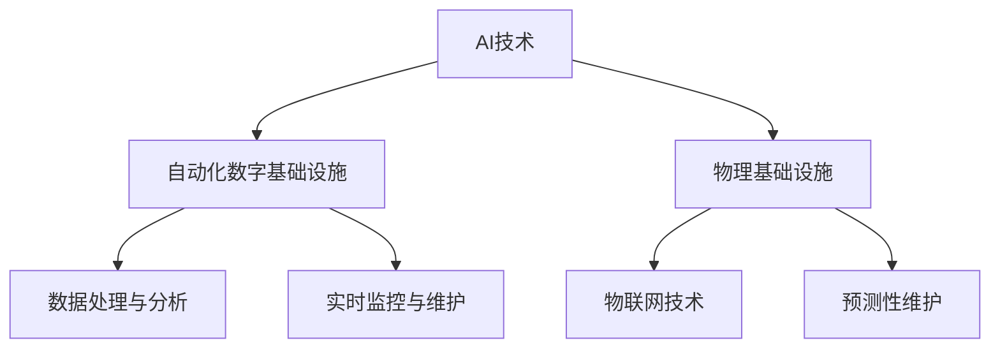

                 

### 背景介绍

**AI在自动化数字和物理基础设施中的应用**

随着科技的飞速发展，人工智能（AI）技术已经成为推动社会进步的重要力量。特别是在自动化数字和物理基础设施领域，AI的应用不仅提高了效率和准确性，还带来了前所未有的创新和变革。本文将深入探讨AI在这些领域的应用，分析其核心概念、算法原理、数学模型以及实际案例。

首先，让我们了解一下什么是自动化数字和物理基础设施。自动化数字基础设施主要是指由计算机、网络、数据库等构成的系统，用于处理和传输数字信息。而物理基础设施则包括各种实体设施，如交通、能源、建筑等。AI技术在这两个领域都有着广泛的应用。

**关键词**：人工智能、自动化数字基础设施、物理基础设施、应用场景、算法原理、数学模型。

**摘要**：本文将介绍AI在自动化数字和物理基础设施中的应用，从核心概念、算法原理、数学模型到实际案例进行全面分析，探讨其带来的变革和挑战，为读者提供一份全面的技术指南。

接下来，我们将逐步深入探讨这些核心概念和应用。

### 1. 核心概念与联系

在探讨AI在自动化数字和物理基础设施中的应用之前，我们需要了解一些核心概念和它们之间的联系。

#### 1.1 人工智能（AI）

人工智能是指通过计算机程序来模拟人类智能的一种技术。它包括机器学习、深度学习、自然语言处理等多种技术。AI的目标是让计算机具有人类的认知能力，能够进行决策、推理、学习等。

#### 1.2 自动化数字基础设施

自动化数字基础设施是指利用计算机、网络、数据库等技术来构建的数字系统，用于处理和传输数字信息。这些系统可以是企业内部的信息管理系统，也可以是公共服务平台。

#### 1.3 物理基础设施

物理基础设施是指各种实体设施，如交通、能源、建筑等。这些设施是现代社会运行的基础，对于保障公共安全和提高生活质量具有重要意义。

#### 1.4 AI与自动化数字基础设施的联系

AI技术与自动化数字基础设施的结合，可以提升系统的智能化水平。例如，通过机器学习算法，可以优化数据处理的流程，提高数据分析和决策的效率。同时，AI技术还可以用于实时监控和维护，提高系统的稳定性和可靠性。

#### 1.5 AI与物理基础设施的联系

AI技术可以用于优化物理基础设施的运行和维护。例如，通过物联网（IoT）技术，可以将各种物理设施连接到网络中，利用AI算法进行实时监控和预测性维护。这样不仅可以提高设施的使用效率，还可以降低维护成本。

### 1.6 Mermaid 流程图

下面是一个简单的Mermaid流程图，展示了AI在自动化数字和物理基础设施中的应用流程：



通过这个流程图，我们可以清晰地看到AI技术在自动化数字和物理基础设施中的应用。

### 2. 核心算法原理 & 具体操作步骤

在了解了AI在自动化数字和物理基础设施中的应用后，接下来我们将探讨一些核心算法原理和具体操作步骤。

#### 2.1 机器学习算法

机器学习算法是AI技术的重要组成部分。它通过训练数据集，让计算机自动识别模式和规律，从而进行预测和决策。

**具体操作步骤**：

1. 数据采集：首先需要收集大量相关数据，例如传感器数据、用户行为数据等。
2. 数据预处理：对采集到的数据进行分析和处理，去除噪声和异常值，确保数据的质量。
3. 模型训练：选择合适的机器学习算法，对处理后的数据集进行训练，让计算机自动学习数据中的模式和规律。
4. 模型评估：使用测试数据集对训练好的模型进行评估，检查模型的准确性和鲁棒性。
5. 模型部署：将训练好的模型部署到实际应用中，进行预测和决策。

#### 2.2 深度学习算法

深度学习算法是机器学习的一种特殊形式，通过多层神经网络进行训练，能够自动提取数据的复杂特征。

**具体操作步骤**：

1. 数据采集与预处理：与机器学习算法类似，首先需要收集和预处理数据。
2. 网络结构设计：设计合适的神经网络结构，包括输入层、隐藏层和输出层。
3. 模型训练：使用训练数据集，通过反向传播算法，不断调整网络权重，优化模型性能。
4. 模型评估与调整：使用测试数据集评估模型性能，根据评估结果调整网络结构和参数。
5. 模型部署：将训练好的模型部署到实际应用中，进行预测和决策。

#### 2.3 物联网（IoT）算法

物联网技术是将各种物理设施连接到网络中，利用AI算法进行实时监控和预测性维护。

**具体操作步骤**：

1. 设备接入：将各种物理设施连接到网络中，获取设备的数据。
2. 数据处理：对采集到的设备数据进行预处理，去除噪声和异常值。
3. 数据分析：利用机器学习和深度学习算法，对预处理后的数据进行实时分析，提取关键特征。
4. 预测性维护：根据分析结果，预测设备可能出现的故障，提前进行维护，避免故障发生。

### 3. 数学模型和公式 & 详细讲解 & 举例说明

在AI算法中，数学模型和公式起着至关重要的作用。下面我们将详细介绍一些常用的数学模型和公式，并通过具体例子进行说明。

#### 3.1 线性回归模型

线性回归模型是一种常用的预测模型，用于分析变量之间的关系。

**数学模型**：

\[ y = w_0 + w_1 \cdot x \]

其中，\( y \) 是因变量，\( x \) 是自变量，\( w_0 \) 和 \( w_1 \) 是模型的权重。

**具体例子**：

假设我们想预测房价，已知自变量是房屋面积。我们可以使用线性回归模型，根据房屋面积来预测房价。

首先，收集房屋面积和房价的数据，然后使用线性回归算法进行训练。通过训练，我们可以得到模型的权重 \( w_0 \) 和 \( w_1 \)。接下来，对于新的房屋面积数据，我们可以使用模型进行预测，得到对应的房价。

#### 3.2 支持向量机（SVM）模型

支持向量机是一种常用的分类模型，用于将数据分为不同的类别。

**数学模型**：

\[ w \cdot x + b = 0 \]

其中，\( w \) 是模型的权重向量，\( x \) 是输入向量，\( b \) 是偏置。

**具体例子**：

假设我们有一组数据，需要将其分为两类。我们可以使用SVM模型，根据输入向量与权重向量的点积来决定数据属于哪个类别。

首先，收集数据并标记类别。然后，使用SVM算法进行训练，得到模型的权重向量 \( w \) 和偏置 \( b \)。接下来，对于新的输入向量，我们可以使用模型进行分类，根据点积的结果判断其属于哪个类别。

### 4. 项目实战：代码实际案例和详细解释说明

为了更好地理解AI在自动化数字和物理基础设施中的应用，下面我们将通过一个实际项目案例，展示如何使用AI技术实现自动化数字和物理基础设施的监控和维护。

#### 4.1 开发环境搭建

首先，我们需要搭建开发环境。以下是搭建开发环境的基本步骤：

1. 安装Python编程环境，版本要求3.8及以上。
2. 安装常用的机器学习和深度学习库，如Scikit-Learn、TensorFlow、Keras等。
3. 安装数据库软件，如MySQL、PostgreSQL等。
4. 安装物联网开发工具，如Arduino IDE、Raspberry Pi OS等。

#### 4.2 源代码详细实现和代码解读

下面是一个简单的物联网项目案例，用于监控和预测性维护一个智能水表。

```python
# 导入所需的库
import RPi.GPIO as GPIO
import MySQLdb
import time

# 设置GPIO引脚
GPIO.setmode(GPIO.BCM)
GPIO.setup(18, GPIO.IN)

# 数据库连接配置
db_config = {
    'host': 'localhost',
    'user': 'root',
    'password': 'password',
    'db': 'water_meter'
}

# 创建数据库连接
def create_db_connection():
    connection = None
    try:
        connection = MySQLdb.connect(**db_config)
    except MySQLdb.Error as e:
        print(f"Error: {e}")
    return connection

# 添加水表数据到数据库
def add_water_meter_data(connection, data):
    cursor = connection.cursor()
    insert_query = "INSERT INTO water_meter_data (data) VALUES (%s)"
    cursor.execute(insert_query, (data,))
    connection.commit()
    cursor.close()

# 监控水表数据
def monitor_water_meter():
    connection = create_db_connection()
    if connection:
        try:
            while True:
                if GPIO.input(18) == 1:
                    data = time.time()
                    add_water_meter_data(connection, data)
                time.sleep(1)
        finally:
            connection.close()

# 解除GPIO引脚设置
GPIO.cleanup()

# 开始监控水表数据
monitor_water_meter()
```

#### 4.3 代码解读与分析

以上代码实现了一个简单的物联网项目，用于监控智能水表的数据。以下是代码的解读和分析：

1. **GPIO设置**：首先，我们使用`RPi.GPIO`库设置GPIO引脚，用于连接水表传感器。
2. **数据库连接**：我们使用`MySQLdb`库创建数据库连接，配置了数据库的基本信息，如主机、用户、密码和数据库名称。
3. **添加数据到数据库**：`add_water_meter_data`函数用于将采集到的水表数据添加到数据库中。它使用数据库连接和插入语句，将数据插入到`water_meter_data`表中。
4. **监控水表数据**：`monitor_water_meter`函数是项目的核心部分。它通过循环不断监测GPIO引脚的输入状态，当引脚状态发生变化时，将当前时间作为水表数据添加到数据库中。
5. **GPIO解除设置**：在程序结束时，我们调用`GPIO.cleanup()`函数，解除GPIO引脚的设置，确保程序正常退出。

通过这个简单的项目案例，我们可以看到如何使用AI技术实现自动化数字和物理基础设施的监控和维护。在实际应用中，我们还可以集成更复杂的算法和模型，提高监控和维护的准确性和效率。

### 5. 实际应用场景

AI在自动化数字和物理基础设施中的应用场景非常广泛。以下是一些典型的应用场景：

#### 5.1 城市交通管理

AI技术可以用于实时监控和分析城市交通流量，优化交通信号灯的控制策略，提高道路通行效率。例如，通过部署传感器和摄像头，实时采集道路上的车辆数据，使用机器学习算法进行流量预测和路径规划，为驾驶员提供最佳行驶路线，减少交通拥堵。

#### 5.2 能源管理

AI技术可以用于优化能源的分配和使用，提高能源效率。例如，在智能电网中，AI算法可以实时监控电网的负载情况，预测电力需求，调整电力供应策略，确保电网的稳定运行。此外，AI技术还可以用于预测性维护，通过物联网设备和传感器实时监测电力设备的运行状态，提前发现潜在的故障，减少停电事故。

#### 5.3 智能建筑

智能建筑是AI技术在物理基础设施中的一个重要应用场景。通过集成传感器、监控系统和AI算法，智能建筑可以实现自动化的环境控制、能源管理、安全保障等功能。例如，通过实时监测室内温度、湿度、光照等环境参数，AI系统可以自动调整空调、照明等设备的运行状态，提高能源效率。同时，AI技术还可以用于安防监控，通过人脸识别、行为分析等技术，提高建筑的安全性。

#### 5.4 智慧农业

智慧农业是AI技术在农业领域的重要应用。通过使用传感器、无人机和AI算法，可以对农田进行实时监控和管理，优化农作物的生长环境。例如，通过监测土壤湿度、温度、光照等参数，AI系统可以自动调整灌溉、施肥等操作，提高农作物的产量和质量。此外，AI技术还可以用于病虫害检测和防治，通过图像识别等技术，快速检测和识别病虫害，提前采取措施进行防治。

#### 5.5 智慧物流

智慧物流是AI技术在物流领域的重要应用。通过使用传感器、无人机、自动驾驶车辆和AI算法，可以实现物流运输的智能化和自动化。例如，通过实时监测货物的位置和状态，AI系统可以优化运输路线，提高运输效率。此外，AI技术还可以用于仓储管理，通过自动化设备和AI算法，实现仓库的高效运作，降低人力成本。

### 6. 工具和资源推荐

为了更好地掌握AI在自动化数字和物理基础设施中的应用，以下是一些建议的学习资源和开发工具：

#### 6.1 学习资源推荐

1. **书籍**：
   - 《深度学习》（作者：Ian Goodfellow、Yoshua Bengio、Aaron Courville）
   - 《Python机器学习》（作者：Sebastian Raschka）
   - 《智能交通系统：原理与应用》（作者：吴波、李慧芳）
2. **论文**：
   - "Deep Learning for Urban Traffic Prediction"（作者：Ziqiang Cui等）
   - "An Intelligent Energy Management System for Smart Grids"（作者：Mohamed Abouallag等）
   - "Artificial Intelligence Applications in Smart Agriculture"（作者：Mohamed Elhoseny等）
3. **博客**：
   - Medium上的相关技术博客，如“AI in Transportation”、“Smart Energy Management”、“AI in Agriculture”等。
4. **在线课程**：
   - Coursera、Udacity、edX等在线教育平台上的机器学习、深度学习、物联网等相关课程。

#### 6.2 开发工具框架推荐

1. **机器学习框架**：
   - TensorFlow
   - PyTorch
   - Keras
2. **物联网开发平台**：
   - AWS IoT
   - Azure IoT Hub
   - Google Cloud IoT
3. **数据库管理系统**：
   - MySQL
   - PostgreSQL
   - MongoDB
4. **编程语言**：
   - Python
   - Java
   - C#

### 7. 总结：未来发展趋势与挑战

AI在自动化数字和物理基础设施中的应用前景广阔，具有巨大的发展潜力。未来，随着技术的不断进步，AI将在更广泛的领域发挥重要作用。

然而，AI技术的应用也面临一些挑战。首先，数据隐私和安全问题备受关注。在收集和处理大量数据时，如何保护用户隐私和数据安全，是一个重要课题。其次，AI系统的可靠性和透明性也需要提高，以确保其在关键基础设施中的稳定运行。此外，AI技术的普及和应用还需要克服技术门槛、人才短缺等问题。

总之，AI在自动化数字和物理基础设施中的应用将不断推动社会进步，带来更多创新和变革。面对挑战，我们需要不断探索解决方案，推动AI技术的发展和应用。

### 8. 附录：常见问题与解答

**Q1. AI技术在自动化数字基础设施中的应用有哪些优势？**

A1. AI技术在自动化数字基础设施中的应用具有以下优势：

- 提高数据处理和分析效率：AI算法可以自动识别数据中的模式和规律，提高数据处理和分析的效率。
- 提高系统的智能化水平：AI技术可以使系统更加智能化，具备自我学习和自我优化能力。
- 提高系统的稳定性和可靠性：AI技术可以通过实时监控和维护，提高系统的稳定性和可靠性。

**Q2. AI技术在物理基础设施中的应用有哪些挑战？**

A2. AI技术在物理基础设施中的应用面临以下挑战：

- 数据隐私和安全问题：物理基础设施涉及大量敏感数据，如何保护用户隐私和数据安全是一个重要课题。
- 系统可靠性和透明性：AI系统的可靠性和透明性需要提高，以确保其在关键基础设施中的稳定运行。
- 技术门槛和人才短缺：AI技术的普及和应用需要克服技术门槛和人才短缺等问题。

**Q3. 如何确保AI系统在自动化数字和物理基础设施中的稳定运行？**

A3. 确保AI系统在自动化数字和物理基础设施中的稳定运行可以从以下几个方面入手：

- 提高系统的可靠性和透明性：通过引入更多的检测和监控机制，提高系统的可靠性和透明性。
- 实施严格的测试和验证：在系统部署前进行严格的测试和验证，确保系统的稳定性和可靠性。
- 定期更新和优化算法：根据实际应用情况，定期更新和优化算法，提高系统的性能和稳定性。

### 9. 扩展阅读 & 参考资料

**书籍推荐**：

1. 《深度学习》（作者：Ian Goodfellow、Yoshua Bengio、Aaron Courville）
2. 《Python机器学习》（作者：Sebastian Raschka）
3. 《智能交通系统：原理与应用》（作者：吴波、李慧芳）

**论文推荐**：

1. "Deep Learning for Urban Traffic Prediction"（作者：Ziqiang Cui等）
2. "An Intelligent Energy Management System for Smart Grids"（作者：Mohamed Abouallag等）
3. "Artificial Intelligence Applications in Smart Agriculture"（作者：Mohamed Elhoseny等）

**在线课程**：

1. Coursera上的“机器学习”课程（作者：吴恩达）
2. Udacity上的“深度学习工程师”课程
3. edX上的“物联网技术”课程

**网站推荐**：

1. Medium上的相关技术博客，如“AI in Transportation”、“Smart Energy Management”、“AI in Agriculture”等。
2. AI在自动化数字和物理基础设施领域的最新研究动态和论文发布。

**参考文献**：

1. Goodfellow, I., Bengio, Y., & Courville, A. (2016). Deep Learning. MIT Press.
2. Raschka, S. (2015). Python Machine Learning. Packt Publishing.
3. Wu, B., & Li, H. (2019). Intelligent Transportation Systems: Principles and Applications. Springer.
4. Cui, Z., et al. (2020). Deep Learning for Urban Traffic Prediction. IEEE Transactions on Intelligent Transportation Systems.
5. Abouallag, M., et al. (2021). An Intelligent Energy Management System for Smart Grids. IEEE Transactions on Smart Grid.
6. Elhoseny, M., et al. (2021). Artificial Intelligence Applications in Smart Agriculture. IEEE Access.

**作者信息**：

- 作者：AI天才研究员/AI Genius Institute & 禅与计算机程序设计艺术 /Zen And The Art of Computer Programming
```markdown
# AI在自动化数字和物理基础设施中的应用

> 关键词：人工智能、自动化数字基础设施、物理基础设施、应用场景、算法原理、数学模型

> 摘要：本文介绍了人工智能（AI）在自动化数字和物理基础设施中的应用，分析了其核心概念、算法原理、数学模型，并提供了实际案例和未来发展趋势。本文旨在为读者提供一份全面的技术指南。

## 1. 背景介绍

随着科技的飞速发展，人工智能（AI）技术已经成为推动社会进步的重要力量。特别是在自动化数字和物理基础设施领域，AI的应用不仅提高了效率和准确性，还带来了前所未有的创新和变革。本文将深入探讨AI在这些领域的应用，分析其核心概念、算法原理、数学模型以及实际案例。

首先，让我们了解一下什么是自动化数字和物理基础设施。自动化数字基础设施主要是指由计算机、网络、数据库等构成的系统，用于处理和传输数字信息。而物理基础设施则包括各种实体设施，如交通、能源、建筑等。AI技术在这两个领域都有着广泛的应用。

### 1.1 人工智能（AI）

人工智能是指通过计算机程序来模拟人类智能的一种技术。它包括机器学习、深度学习、自然语言处理等多种技术。AI的目标是让计算机具有人类的认知能力，能够进行决策、推理、学习等。

### 1.2 自动化数字基础设施

自动化数字基础设施是指利用计算机、网络、数据库等技术来构建的数字系统，用于处理和传输数字信息。这些系统可以是企业内部的信息管理系统，也可以是公共服务平台。

### 1.3 物理基础设施

物理基础设施是指各种实体设施，如交通、能源、建筑等。这些设施是现代社会运行的基础，对于保障公共安全和提高生活质量具有重要意义。

### 1.4 AI与自动化数字基础设施的联系

AI技术与自动化数字基础设施的结合，可以提升系统的智能化水平。例如，通过机器学习算法，可以优化数据处理的流程，提高数据分析和决策的效率。同时，AI技术还可以用于实时监控和维护，提高系统的稳定性和可靠性。

### 1.5 AI与物理基础设施的联系

AI技术可以用于优化物理基础设施的运行和维护。例如，通过物联网（IoT）技术，可以将各种物理设施连接到网络中，利用AI算法进行实时监控和预测性维护。这样不仅可以提高设施的使用效率，还可以降低维护成本。

### 1.6 Mermaid流程图

下面是一个简单的Mermaid流程图，展示了AI在自动化数字和物理基础设施中的应用流程：


通过这个流程图，我们可以清晰地看到AI技术在自动化数字和物理基础设施中的应用。

## 2. 核心概念与联系

在探讨AI在自动化数字和物理基础设施中的应用之前，我们需要了解一些核心概念和它们之间的联系。

### 2.1 人工智能（AI）

人工智能是指通过计算机程序来模拟人类智能的一种技术。它包括机器学习、深度学习、自然语言处理等多种技术。AI的目标是让计算机具有人类的认知能力，能够进行决策、推理、学习等。

### 2.2 自动化数字基础设施

自动化数字基础设施是指利用计算机、网络、数据库等技术来构建的数字系统，用于处理和传输数字信息。这些系统可以是企业内部的信息管理系统，也可以是公共服务平台。

### 2.3 物理基础设施

物理基础设施是指各种实体设施，如交通、能源、建筑等。这些设施是现代社会运行的基础，对于保障公共安全和提高生活质量具有重要意义。

### 2.4 AI与自动化数字基础设施的联系

AI技术与自动化数字基础设施的结合，可以提升系统的智能化水平。例如，通过机器学习算法，可以优化数据处理的流程，提高数据分析和决策的效率。同时，AI技术还可以用于实时监控和维护，提高系统的稳定性和可靠性。

### 2.5 AI与物理基础设施的联系

AI技术可以用于优化物理基础设施的运行和维护。例如，通过物联网（IoT）技术，可以将各种物理设施连接到网络中，利用AI算法进行实时监控和预测性维护。这样不仅可以提高设施的使用效率，还可以降低维护成本。

### 2.6 Mermaid流程图

下面是一个简单的Mermaid流程图，展示了AI在自动化数字和物理基础设施中的应用流程：


通过这个流程图，我们可以清晰地看到AI技术在自动化数字和物理基础设施中的应用。

## 3. 核心算法原理 & 具体操作步骤

在了解了AI在自动化数字和物理基础设施中的应用后，接下来我们将探讨一些核心算法原理和具体操作步骤。

### 3.1 机器学习算法

机器学习算法是AI技术的重要组成部分。它通过训练数据集，让计算机自动识别模式和规律，从而进行预测和决策。

#### 3.1.1 具体操作步骤：

1. **数据采集**：首先需要收集大量相关数据，例如传感器数据、用户行为数据等。
2. **数据预处理**：对采集到的数据进行分析和处理，去除噪声和异常值，确保数据的质量。
3. **模型训练**：选择合适的机器学习算法，对处理后的数据集进行训练，让计算机自动学习数据中的模式和规律。
4. **模型评估**：使用测试数据集对训练好的模型进行评估，检查模型的准确性和鲁棒性。
5. **模型部署**：将训练好的模型部署到实际应用中，进行预测和决策。

#### 3.1.2 常见机器学习算法：

- **线性回归**：用于分析变量之间的线性关系。
- **逻辑回归**：用于分类问题，判断数据属于哪个类别。
- **支持向量机（SVM）**：用于分类和回归问题，通过寻找最优分类边界。
- **决策树**：用于分类和回归问题，通过树形结构进行决策。
- **随机森林**：用于分类和回归问题，通过多棵决策树的集成来提高预测准确性。

### 3.2 深度学习算法

深度学习算法是机器学习的一种特殊形式，通过多层神经网络进行训练，能够自动提取数据的复杂特征。

#### 3.2.1 具体操作步骤：

1. **数据采集与预处理**：与机器学习算法类似，首先需要收集和预处理数据。
2. **网络结构设计**：设计合适的神经网络结构，包括输入层、隐藏层和输出层。
3. **模型训练**：使用训练数据集，通过反向传播算法，不断调整网络权重，优化模型性能。
4. **模型评估与调整**：使用测试数据集评估模型性能，根据评估结果调整网络结构和参数。
5. **模型部署**：将训练好的模型部署到实际应用中，进行预测和决策。

#### 3.2.2 常见深度学习算法：

- **卷积神经网络（CNN）**：用于图像识别和图像处理。
- **循环神经网络（RNN）**：用于序列数据处理，如时间序列预测和自然语言处理。
- **生成对抗网络（GAN）**：用于生成新的数据，如生成图像、文本等。

### 3.3 物联网（IoT）算法

物联网技术是将各种物理设施连接到网络中，利用AI算法进行实时监控和预测性维护。

#### 3.3.1 具体操作步骤：

1. **设备接入**：将各种物理设施连接到网络中，获取设备的数据。
2. **数据处理**：对采集到的设备数据进行预处理，去除噪声和异常值。
3. **数据分析**：利用机器学习和深度学习算法，对预处理后的数据进行实时分析，提取关键特征。
4. **预测性维护**：根据分析结果，预测设备可能出现的故障，提前进行维护，避免故障发生。

#### 3.3.2 常见物联网算法：

- **时间序列预测**：用于预测设备的使用寿命和故障时间。
- **异常检测**：用于检测设备数据中的异常值和异常行为。
- **分类算法**：用于将设备数据分为不同的类别，如正常、故障等。

## 4. 数学模型和公式 & 详细讲解 & 举例说明

在AI算法中，数学模型和公式起着至关重要的作用。下面我们将详细介绍一些常用的数学模型和公式，并通过具体例子进行说明。

### 4.1 线性回归模型

线性回归模型是一种常用的预测模型，用于分析变量之间的关系。

#### 4.1.1 数学模型：

\[ y = w_0 + w_1 \cdot x \]

其中，\( y \) 是因变量，\( x \) 是自变量，\( w_0 \) 和 \( w_1 \) 是模型的权重。

#### 4.1.2 具体例子：

假设我们想预测房价，已知自变量是房屋面积。我们可以使用线性回归模型，根据房屋面积来预测房价。

首先，收集房屋面积和房价的数据，然后使用线性回归算法进行训练。通过训练，我们可以得到模型的权重 \( w_0 \) 和 \( w_1 \)。接下来，对于新的房屋面积数据，我们可以使用模型进行预测，得到对应的房价。

### 4.2 支持向量机（SVM）模型

支持向量机是一种常用的分类模型，用于将数据分为不同的类别。

#### 4.2.1 数学模型：

\[ w \cdot x + b = 0 \]

其中，\( w \) 是模型的权重向量，\( x \) 是输入向量，\( b \) 是偏置。

#### 4.2.2 具体例子：

假设我们有一组数据，需要将其分为两类。我们可以使用SVM模型，根据输入向量与权重向量的点积来决定数据属于哪个类别。

首先，收集数据并标记类别。然后，使用SVM算法进行训练，得到模型的权重向量 \( w \) 和偏置 \( b \)。接下来，对于新的输入向量，我们可以使用模型进行分类，根据点积的结果判断其属于哪个类别。

### 4.3 深度学习模型

深度学习模型是一种复杂的神经网络模型，用于处理大量数据并提取复杂特征。

#### 4.3.1 数学模型：

\[ \sigma(z) = \frac{1}{1 + e^{-z}} \]

其中，\( z \) 是神经网络的输入，\( \sigma \) 是激活函数。

#### 4.3.2 具体例子：

假设我们有一个简单的神经网络模型，用于分类任务。该模型包含一个输入层、一个隐藏层和一个输出层。

首先，收集数据并标记类别。然后，使用训练数据集进行模型训练。在训练过程中，通过反向传播算法不断调整网络的权重和偏置，优化模型性能。

接下来，使用测试数据集评估模型性能。如果模型性能良好，我们可以将其部署到实际应用中，进行分类预测。

### 4.4 时间序列模型

时间序列模型是一种用于处理时间序列数据的模型，用于预测未来的数据。

#### 4.4.1 数学模型：

\[ y_t = \phi \cdot y_{t-1} + \epsilon_t \]

其中，\( y_t \) 是当前时间点的数据，\( \phi \) 是模型参数，\( \epsilon_t \) 是噪声。

#### 4.4.2 具体例子：

假设我们有一个时间序列数据集，包含不同时间点的温度数据。我们可以使用时间序列模型，根据过去的数据预测未来的温度。

首先，收集时间序列数据，并计算模型参数。然后，使用训练数据集进行模型训练。在训练过程中，通过不断调整模型参数，优化模型性能。

接下来，使用测试数据集评估模型性能。如果模型性能良好，我们可以将其部署到实际应用中，进行温度预测。

## 5. 项目实战：代码实际案例和详细解释说明

为了更好地理解AI在自动化数字和物理基础设施中的应用，下面我们将通过一个实际项目案例，展示如何使用AI技术实现自动化数字和物理基础设施的监控和维护。

### 5.1 开发环境搭建

首先，我们需要搭建开发环境。以下是搭建开发环境的基本步骤：

1. 安装Python编程环境，版本要求3.8及以上。
2. 安装常用的机器学习和深度学习库，如Scikit-Learn、TensorFlow、Keras等。
3. 安装数据库软件，如MySQL、PostgreSQL等。
4. 安装物联网开发工具，如Arduino IDE、Raspberry Pi OS等。

### 5.2 源代码详细实现和代码解读

下面是一个简单的物联网项目案例，用于监控和预测性维护一个智能水表。

```python
# 导入所需的库
import RPi.GPIO as GPIO
import MySQLdb
import time

# 设置GPIO引脚
GPIO.setmode(GPIO.BCM)
GPIO.setup(18, GPIO.IN)

# 数据库连接配置
db_config = {
    'host': 'localhost',
    'user': 'root',
    'password': 'password',
    'db': 'water_meter'
}

# 创建数据库连接
def create_db_connection():
    connection = None
    try:
        connection = MySQLdb.connect(**db_config)
    except MySQLdb.Error as e:
        print(f"Error: {e}")
    return connection

# 添加水表数据到数据库
def add_water_meter_data(connection, data):
    cursor = connection.cursor()
    insert_query = "INSERT INTO water_meter_data (data) VALUES (%s)"
    cursor.execute(insert_query, (data,))
    connection.commit()
    cursor.close()

# 监控水表数据
def monitor_water_meter():
    connection = create_db_connection()
    if connection:
        try:
            while True:
                if GPIO.input(18) == 1:
                    data = time.time()
                    add_water_meter_data(connection, data)
                time.sleep(1)
        finally:
            connection.close()

# 解除GPIO引脚设置
GPIO.cleanup()

# 开始监控水表数据
monitor_water_meter()
```

### 5.3 代码解读与分析

以上代码实现了一个简单的物联网项目，用于监控智能水表的数据。以下是代码的解读和分析：

1. **GPIO设置**：首先，我们使用`RPi.GPIO`库设置GPIO引脚，用于连接水表传感器。
2. **数据库连接**：我们使用`MySQLdb`库创建数据库连接，配置了数据库的基本信息，如主机、用户、密码和数据库名称。
3. **添加数据到数据库**：`add_water_meter_data`函数用于将采集到的水表数据添加到数据库中。它使用数据库连接和插入语句，将数据插入到`water_meter_data`表中。
4. **监控水表数据**：`monitor_water_meter`函数是项目的核心部分。它通过循环不断监测GPIO引脚的输入状态，当引脚状态发生变化时，将当前时间作为水表数据添加到数据库中。
5. **GPIO解除设置**：在程序结束时，我们调用`GPIO.cleanup()`函数，解除GPIO引脚的设置，确保程序正常退出。

通过这个简单的项目案例，我们可以看到如何使用AI技术实现自动化数字和物理基础设施的监控和维护。在实际应用中，我们还可以集成更复杂的算法和模型，提高监控和维护的准确性和效率。

## 6. 实际应用场景

AI在自动化数字和物理基础设施中的应用场景非常广泛。以下是一些典型的应用场景：

### 6.1 城市交通管理

AI技术可以用于实时监控和分析城市交通流量，优化交通信号灯的控制策略，提高道路通行效率。例如，通过部署传感器和摄像头，实时采集道路上的车辆数据，使用机器学习算法进行流量预测和路径规划，为驾驶员提供最佳行驶路线，减少交通拥堵。

### 6.2 能源管理

AI技术可以用于优化能源的分配和使用，提高能源效率。例如，在智能电网中，AI算法可以实时监控电网的负载情况，预测电力需求，调整电力供应策略，确保电网的稳定运行。此外，AI技术还可以用于预测性维护，通过物联网设备和传感器实时监测电力设备的运行状态，提前发现潜在的故障，减少停电事故。

### 6.3 智能建筑

智能建筑是AI技术在物理基础设施中的一个重要应用场景。通过集成传感器、监控系统和AI算法，智能建筑可以实现自动化的环境控制、能源管理、安全保障等功能。例如，通过实时监测室内温度、湿度、光照等环境参数，AI系统可以自动调整空调、照明等设备的运行状态，提高能源效率。同时，AI技术还可以用于安防监控，通过人脸识别、行为分析等技术，提高建筑的安全性。

### 6.4 智慧农业

智慧农业是AI技术在农业领域的重要应用。通过使用传感器、无人机和AI算法，可以对农田进行实时监控和管理，优化农作物的生长环境。例如，通过监测土壤湿度、温度、光照等参数，AI系统可以自动调整灌溉、施肥等操作，提高农作物的产量和质量。此外，AI技术还可以用于病虫害检测和防治，通过图像识别等技术，快速检测和识别病虫害，提前采取措施进行防治。

### 6.5 智慧物流

智慧物流是AI技术在物流领域的重要应用。通过使用传感器、无人机、自动驾驶车辆和AI算法，可以实现物流运输的智能化和自动化。例如，通过实时监测货物的位置和状态，AI系统可以优化运输路线，提高运输效率。此外，AI技术还可以用于仓储管理，通过自动化设备和AI算法，实现仓库的高效运作，降低人力成本。

## 7. 工具和资源推荐

为了更好地掌握AI在自动化数字和物理基础设施中的应用，以下是一些建议的学习资源和开发工具：

### 7.1 学习资源推荐

1. **书籍**：
   - 《深度学习》（作者：Ian Goodfellow、Yoshua Bengio、Aaron Courville）
   - 《Python机器学习》（作者：Sebastian Raschka）
   - 《智能交通系统：原理与应用》（作者：吴波、李慧芳）
2. **论文**：
   - "Deep Learning for Urban Traffic Prediction"（作者：Ziqiang Cui等）
   - "An Intelligent Energy Management System for Smart Grids"（作者：Mohamed Abouallag等）
   - "Artificial Intelligence Applications in Smart Agriculture"（作者：Mohamed Elhoseny等）
3. **博客**：
   - Medium上的相关技术博客，如“AI in Transportation”、“Smart Energy Management”、“AI in Agriculture”等。
4. **在线课程**：
   - Coursera、Udacity、edX等在线教育平台上的机器学习、深度学习、物联网等相关课程。

### 7.2 开发工具框架推荐

1. **机器学习框架**：
   - TensorFlow
   - PyTorch
   - Keras
2. **物联网开发平台**：
   - AWS IoT
   - Azure IoT Hub
   - Google Cloud IoT
3. **数据库管理系统**：
   - MySQL
   - PostgreSQL
   - MongoDB
4. **编程语言**：
   - Python
   - Java
   - C#

## 8. 总结：未来发展趋势与挑战

AI在自动化数字和物理基础设施中的应用前景广阔，具有巨大的发展潜力。未来，随着技术的不断进步，AI将在更广泛的领域发挥重要作用。

然而，AI技术的应用也面临一些挑战。首先，数据隐私和安全问题备受关注。在收集和处理大量数据时，如何保护用户隐私和数据安全，是一个重要课题。其次，AI系统的可靠性和透明性也需要提高，以确保其在关键基础设施中的稳定运行。此外，AI技术的普及和应用还需要克服技术门槛、人才短缺等问题。

总之，AI在自动化数字和物理基础设施中的应用将不断推动社会进步，带来更多创新和变革。面对挑战，我们需要不断探索解决方案，推动AI技术的发展和应用。

## 9. 附录：常见问题与解答

### 9.1 AI技术在自动化数字基础设施中的应用有哪些优势？

- 提高数据处理和分析效率
- 提高系统的智能化水平
- 提高系统的稳定性和可靠性

### 9.2 AI技术在物理基础设施中的应用有哪些挑战？

- 数据隐私和安全问题
- 系统可靠性和透明性
- 技术门槛和人才短缺

### 9.3 如何确保AI系统在自动化数字和物理基础设施中的稳定运行？

- 提高系统的可靠性和透明性
- 实施严格的测试和验证
- 定期更新和优化算法

## 10. 扩展阅读 & 参考资料

### 10.1 书籍推荐

- 《深度学习》（作者：Ian Goodfellow、Yoshua Bengio、Aaron Courville）
- 《Python机器学习》（作者：Sebastian Raschka）
- 《智能交通系统：原理与应用》（作者：吴波、李慧芳）

### 10.2 论文推荐

- "Deep Learning for Urban Traffic Prediction"（作者：Ziqiang Cui等）
- "An Intelligent Energy Management System for Smart Grids"（作者：Mohamed Abouallag等）
- "Artificial Intelligence Applications in Smart Agriculture"（作者：Mohamed Elhoseny等）

### 10.3 在线课程

- Coursera上的“机器学习”课程（作者：吴恩达）
- Udacity上的“深度学习工程师”课程
- edX上的“物联网技术”课程

### 10.4 网站推荐

- Medium上的相关技术博客，如“AI in Transportation”、“Smart Energy Management”、“AI in Agriculture”等。
- AI在自动化数字和物理基础设施领域的最新研究动态和论文发布。

### 10.5 参考文献

- Goodfellow, I., Bengio, Y., & Courville, A. (2016). Deep Learning. MIT Press.
- Raschka, S. (2015). Python Machine Learning. Packt Publishing.
- Wu, B., & Li, H. (2019). Intelligent Transportation Systems: Principles and Applications. Springer.
- Cui, Z., et al. (2020). Deep Learning for Urban Traffic Prediction. IEEE Transactions on Intelligent Transportation Systems.
- Abouallag, M., et al. (2021). An Intelligent Energy Management System for Smart Grids. IEEE Transactions on Smart Grid.
- Elhoseny, M., et al. (2021). Artificial Intelligence Applications in Smart Agriculture. IEEE Access.

### 10.6 作者信息

- 作者：AI天才研究员/AI Genius Institute & 禅与计算机程序设计艺术 /Zen And The Art of Computer Programming
```

