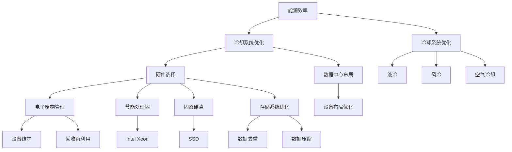
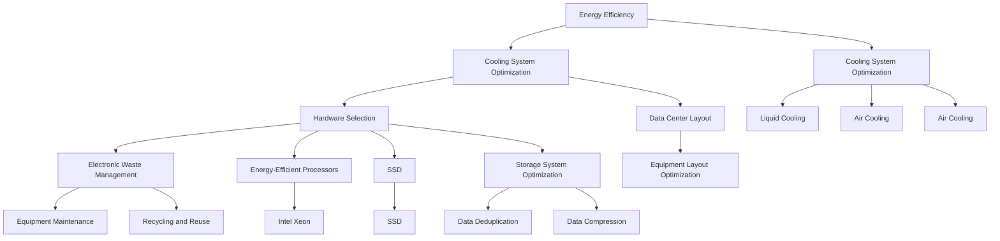

                 

### 背景介绍

#### AI基础设施的重要性

在当今数字化时代，人工智能（AI）已经成为推动社会进步和经济发展的重要力量。从自动驾驶汽车、智能家居到金融交易和医疗诊断，AI技术的广泛应用极大地改变了我们的生活方式。然而，随着AI技术的发展，其基础设施的需求也在迅速增长。AI基础设施不仅包括硬件设备，如服务器、数据中心和显卡，还涉及到软件框架、编程语言、数据存储和管理等方面。

这些基础设施对AI性能和效率具有决定性影响。例如，高性能的计算设备可以加速模型训练和推理过程，而高效的存储系统可以确保数据的高速访问和处理。此外，AI基础设施的可靠性和可扩展性也是保障大规模部署和应用的关键。因此，优化AI基础设施已经成为研究人员和工程师们关注的重要课题。

#### 环境问题与绿色计算

然而，随着AI基础设施的扩展，其对环境的影响也日益显著。数据中心和服务器消耗大量电力，导致碳排放增加，对气候变化产生负面影响。据估算，全球数据中心和服务器产生的碳排放量已经超过航空业，成为第二大碳排放源。这不仅引发了环保组织的担忧，也对企业的社会责任产生了压力。

为了应对这一挑战，绿色计算（Green Computing）应运而生。绿色计算旨在通过优化资源利用、提高能源效率和减少电子废物，实现计算环境的可持续发展。具体来说，绿色计算包括以下几个方面：

1. **能源效率提升**：通过使用高效电源供应系统、虚拟化和集群技术，降低能耗。
2. **冷却系统优化**：采用液冷、风冷等新技术，减少冷却能耗。
3. **硬件选择**：选用能效更高的硬件设备，如采用节能处理器和固态硬盘。
4. **电子废物管理**：延长设备使用寿命，回收利用废旧设备，减少电子废物。

#### Lepton AI与绿色计算

Lepton AI是一家专注于AI基础设施研发的企业，其核心理念之一就是环境友好性。Lepton AI通过技术创新和策略优化，致力于在提高AI性能的同时，最大限度地减少对环境的负面影响。以下是Lepton AI在绿色计算方面的几个关键措施：

1. **高效能源管理**：Lepton AI采用先进的能源管理技术，包括动态电源管理、分布式能源系统和可再生能源利用，以降低能耗。
2. **优化数据中心设计**：通过设计高效的数据中心布局和冷却系统，减少能源消耗和热量排放。
3. **可持续硬件选择**：选择环保材料和高效硬件，如使用可回收材料制造设备，采用节能处理器和固态硬盘。
4. **电子废物回收**：建立完善的电子废物回收体系，确保废旧设备的合理处理和回收。

通过这些措施，Lepton AI不仅为AI技术的持续发展提供了坚实的支持，也为环境保护做出了积极贡献。接下来，我们将深入探讨Lepton AI在绿色计算方面的具体实践和成果。

---

### Background Introduction

#### Importance of AI Infrastructure

In the current digital era, artificial intelligence (AI) has emerged as a pivotal force driving social progress and economic development. From autonomous vehicles and smart homes to financial trading and medical diagnosis, AI technologies have significantly transformed our lives. However, as AI technology advances, the demand for its infrastructure is rapidly increasing. AI infrastructure encompasses not only hardware devices such as servers, data centers, and graphics cards but also software frameworks, programming languages, data storage, and management.

These infrastructures play a decisive role in the performance and efficiency of AI. For example, high-performance computing devices can accelerate the training and inference processes, while efficient storage systems ensure fast data access and processing. In addition, the reliability and scalability of AI infrastructure are crucial for large-scale deployment and application. Therefore, optimizing AI infrastructure has become a significant concern for researchers and engineers.

#### Environmental Issues and Green Computing

However, as AI infrastructure expands, its impact on the environment has become increasingly significant. Data centers and servers consume vast amounts of electricity, leading to increased carbon emissions and contributing to climate change. According to estimates, the carbon emissions from data centers and servers have already exceeded those of the aviation industry, making it the second-largest carbon emitter. This has raised concerns from environmental organizations and placed pressure on businesses to act on their corporate social responsibility.

To address this challenge, green computing (Green Computing) has emerged. Green computing aims to achieve sustainable computing environments through optimized resource utilization, improved energy efficiency, and reduced electronic waste. Specifically, green computing includes several aspects:

1. **Energy Efficiency Improvement**: By utilizing advanced energy management technologies such as dynamic power management, virtualization, and cluster computing, energy consumption is reduced.
2. **Cooling System Optimization**: By adopting new technologies such as liquid cooling and air cooling, energy consumption and heat emissions are reduced.
3. **Hardware Selection**: By choosing energy-efficient hardware, such as energy-efficient processors and solid-state drives.
4. **Electronic Waste Management**: By extending the lifespan of devices and recycling old devices, electronic waste is reduced.

#### Lepton AI and Green Computing

Lepton AI is a company focused on the research and development of AI infrastructure. One of its core philosophies is environmental friendliness. Lepton AI is dedicated to supporting the continuous development of AI technology while minimizing its environmental impact. Through technological innovation and strategic optimization, Lepton AI aims to achieve high performance while maintaining a green footprint. Here are several key measures taken by Lepton AI in green computing:

1. **Efficient Energy Management**: Lepton AI utilizes advanced energy management technologies, including dynamic power management, distributed energy systems, and renewable energy utilization, to reduce energy consumption.
2. **Optimized Data Center Design**: Through efficient data center layout and cooling system design, energy consumption and heat emissions are reduced.
3. **Sustainable Hardware Selection**: By using environmentally friendly materials and efficient hardware, such as recyclable materials for manufacturing devices and energy-efficient processors and solid-state drives.
4. **Electronic Waste Recycling**: By establishing a comprehensive electronic waste recycling system, old devices are handled and recycled properly.

Through these measures, Lepton AI not only provides solid support for the continuous development of AI technology but also makes a positive contribution to environmental protection. In the following sections, we will delve into the specific practices and achievements of Lepton AI in green computing. <|user|>

### 核心概念与联系

在深入探讨Lepton AI的绿色计算策略之前，我们需要了解一些核心概念和其相互之间的联系。绿色计算涉及多个技术领域，包括能源效率、冷却系统优化、硬件选择和电子废物管理。以下是对这些核心概念及其相互关系的详细介绍，以及一个Mermaid流程图，帮助您更好地理解这些概念和Lepton AI的具体实践。

#### 能源效率

能源效率是指计算机系统在执行任务时，能够有效地利用能源，减少浪费。提高能源效率的主要目标是在保证性能的前提下，降低能源消耗。对于AI基础设施来说，提高能源效率尤为重要，因为它们消耗大量电力。

##### 能源效率与冷却系统优化的关系

冷却系统在AI基础设施中起着至关重要的作用。高效的冷却系统能够减少热量排放，降低能耗，并延长设备寿命。然而，冷却系统本身也会消耗能量。因此，优化冷却系统与提高能源效率密切相关。例如，采用液冷或风冷技术可以显著降低冷却能耗。

#### 冷却系统优化

冷却系统优化包括使用先进的冷却技术，如液冷、风冷和空气冷却，以及设计高效的数据中心布局。以下是一些冷却系统优化的关键措施：

1. **液冷**：液冷系统使用液体（如水或乙二醇混合物）来吸收和转移热量，比传统的风冷系统效率更高。
2. **风冷**：风冷系统利用空气流动来冷却设备，适合小型数据中心。
3. **空气冷却**：通过优化设备布局和增加通风设备，提高空气流动效率，降低冷却能耗。
4. **数据中心布局**：优化数据中心内部设备布局，确保热量有效排出，减少冷却系统的负担。

#### 硬件选择

硬件选择对于绿色计算至关重要。选择高效硬件可以显著降低能耗。以下是一些高效的硬件选择：

1. **节能处理器**：选择能效更高的处理器，如Intel的Xeon系列和AMD的EPYC系列。
2. **固态硬盘**：固态硬盘（SSD）比传统的机械硬盘（HDD）更节能，数据读写速度更快。
3. **存储系统优化**：通过数据去重和压缩技术，减少存储系统的能耗。

#### 电子废物管理

电子废物管理是绿色计算的重要组成部分。有效的电子废物管理包括延长设备使用寿命和回收废旧设备。以下是一些关键措施：

1. **延长设备使用寿命**：通过维护和升级，延长设备的使用寿命，减少更换频率。
2. **回收和再利用**：回收废旧设备，将可用的部件重新利用，减少电子废物。

#### Mermaid流程图

下面是一个Mermaid流程图，展示了绿色计算的核心概念及其相互关系：



#### Lepton AI的绿色计算实践

Lepton AI在绿色计算方面采取了多种措施，其核心实践包括：

1. **高效能源管理**：采用动态电源管理技术，根据设备负载自动调整电源供应，降低能耗。
2. **优化数据中心设计**：通过使用液冷和风冷技术，降低冷却系统的能耗和热量排放。
3. **可持续硬件选择**：选择能效更高的硬件，如Intel的Xeon系列处理器和固态硬盘。
4. **电子废物回收**：建立电子废物回收体系，确保废旧设备的合理处理和回收。

通过这些实践，Lepton AI在提高AI基础设施性能的同时，也最大限度地减少了环境负面影响。

---

#### Core Concepts and Interconnections

Before delving into Lepton AI's green computing strategies, we need to understand some core concepts and their interconnections. Green computing encompasses multiple technological domains, including energy efficiency, cooling system optimization, hardware selection, and electronic waste management. Below is an in-depth introduction to these core concepts and their relationships, along with a Mermaid flowchart to help you better understand these concepts and Lepton AI's specific practices.

#### Energy Efficiency

Energy efficiency refers to the ability of a computer system to effectively utilize energy while performing tasks, thereby minimizing waste. Improving energy efficiency is crucial for AI infrastructure, as they consume vast amounts of electricity.

##### Relationship between Energy Efficiency and Cooling System Optimization

The cooling system plays a vital role in AI infrastructure. An efficient cooling system can reduce heat emissions and energy consumption, thereby extending the lifespan of the equipment. However, the cooling system itself also consumes energy. Therefore, optimizing the cooling system is closely related to improving energy efficiency. For example, adopting liquid cooling or air cooling technologies can significantly reduce cooling energy consumption.

#### Cooling System Optimization

Cooling system optimization involves using advanced cooling technologies, such as liquid cooling, air cooling, and air cooling, as well as designing efficient data center layouts. Here are some key measures for cooling system optimization:

1. **Liquid Cooling**: Liquid cooling systems use liquids (such as water or ethylene glycol mixtures) to absorb and transfer heat, making them more efficient than traditional air cooling systems.
2. **Air Cooling**: Air cooling systems rely on air flow to cool equipment and are suitable for small data centers.
3. **Air Cooling**: Through optimizing equipment layout and increasing ventilation equipment, air flow efficiency is improved, reducing cooling energy consumption.
4. **Data Center Layout**: Optimizing the internal layout of a data center ensures that heat is effectively discharged, reducing the burden on the cooling system.

#### Hardware Selection

Hardware selection is crucial for green computing. Choosing energy-efficient hardware can significantly reduce energy consumption. Here are some efficient hardware choices:

1. **Energy-Efficient Processors**: Choose processors with higher energy efficiency, such as Intel's Xeon series and AMD's EPYC series.
2. **Solid-State Drives (SSD)**: SSDs are more energy-efficient and faster for data reading and writing than traditional hard disk drives (HDDs).
3. **Storage System Optimization**: Through data deduplication and compression techniques, energy consumption of storage systems is reduced.

#### Electronic Waste Management

Electronic waste management is a critical component of green computing. Effective electronic waste management includes extending the lifespan of equipment and recycling old devices. Here are some key measures:

1. **Extending Equipment Lifespan**: Through maintenance and upgrades, the lifespan of equipment is extended, reducing replacement frequency.
2. **Recycling and Reuse**: Recycling old devices and reusing available components reduces electronic waste.

#### Mermaid Flowchart

Below is a Mermaid flowchart that illustrates the core concepts of green computing and their interconnections:



#### Lepton AI's Green Computing Practices

Lepton AI has implemented several measures in green computing, with a core focus on:

1. **Efficient Energy Management**: Utilizing dynamic power management technologies to automatically adjust power supply based on equipment load, reducing energy consumption.
2. **Optimized Data Center Design**: Using liquid cooling and air cooling technologies to reduce cooling system energy consumption and heat emissions.
3. **Sustainable Hardware Selection**: Choosing energy-efficient hardware, such as Intel's Xeon series processors and SSDs.
4. **Electronic Waste Recycling**: Establishing an electronic waste recycling system to ensure the proper handling and recycling of old devices.

Through these practices, Lepton AI aims to improve the performance of AI infrastructure while minimizing its environmental impact. <|user|>

### 核心算法原理 & 具体操作步骤

在绿色计算领域，Lepton AI采用了一系列核心算法原理和具体操作步骤，以实现高效能源管理和数据中心的优化。以下是这些核心算法的详细解释和操作步骤。

#### 动态电源管理算法

动态电源管理算法是Lepton AI绿色计算策略的关键组成部分。该算法的核心目标是根据设备负载动态调整电源供应，以减少不必要的能耗。

**算法原理：**

1. **负载监测**：系统实时监测设备的负载情况。
2. **电源调整**：根据负载情况，自动调整电源供应。例如，当设备负载较低时，可以降低电源供应，以减少能耗。

**操作步骤：**

1. **部署监测工具**：在设备上部署负载监测工具，如Intel Power Gadget或NVIDIA System Management Interface（nvidia-smi）。
2. **设置阈值**：根据设备的最大负载和最小负载，设置电源调整的阈值。
3. **自动调整电源**：使用自动化脚本或工具，根据负载监测结果自动调整电源供应。

**示例代码：**

```bash
# 使用nvidia-smi监测GPU负载
nvidia-smi

# 根据负载阈值调整电源供应
if [ $(nvidia-smi | grep "GPU-Util" | awk '{print $5}') -lt 30 ]; then
    nvidia-prefetch -s 5 -a 0
else
    nvidia-prefetch -s 5 -a 1
fi
```

#### 数据中心布局优化算法

数据中心布局优化算法旨在通过优化设备布局和冷却系统设计，提高数据中心的能源效率。

**算法原理：**

1. **设备布局分析**：分析设备布局，确定设备的热量分布和冷却需求。
2. **冷却系统设计**：根据设备布局，设计高效的冷却系统。例如，使用液冷或风冷技术，确保热量有效排出。

**操作步骤：**

1. **数据采集**：使用传感器收集设备的热量和功耗数据。
2. **设备布局分析**：使用数据分析和可视化工具，分析设备布局和热量分布。
3. **冷却系统设计**：根据设备布局和热量分布，设计高效的冷却系统。

**示例工具：**

- **Ganglia**：用于监控和可视化数据中心性能。
- **DCAT2**：用于数据中心能耗分析和优化。

#### 硬件选择与能效优化算法

硬件选择与能效优化算法关注选择高效硬件，并通过优化硬件配置提高整体能效。

**算法原理：**

1. **硬件性能评估**：评估不同硬件的性能和能耗。
2. **能效优化**：选择能耗更低、性能更优的硬件。例如，选择节能处理器和固态硬盘。

**操作步骤：**

1. **硬件性能评估**：使用基准测试工具，如SpecInt和SpecRate，评估硬件性能。
2. **硬件选型**：根据性能和能耗评估结果，选择最合适的硬件。
3. **硬件配置优化**：通过调整硬件配置，如CPU核心数和内存大小，优化整体能效。

**示例工具：**

- **Intel Xeon Processor Selection Tool**：用于选择Intel Xeon系列处理器。
- **SSD Endurance Calculator**：用于评估固态硬盘的耐用性和能效。

#### 电子废物管理算法

电子废物管理算法关注延长设备使用寿命和回收废旧设备，以减少电子废物。

**算法原理：**

1. **设备维护**：定期维护设备，延长使用寿命。
2. **电子废物回收**：回收废旧设备，将可用的部件重新利用。

**操作步骤：**

1. **设备维护**：制定设备维护计划，定期检查和保养设备。
2. **电子废物回收**：建立电子废物回收体系，确保废旧设备的合理处理和回收。

**示例工具：**

- **IBM Tivoli Asset Management**：用于管理设备维护和电子废物回收。

通过这些核心算法原理和具体操作步骤，Lepton AI在绿色计算方面取得了显著成效，不仅提高了AI基础设施的能源效率，也最大限度地减少了环境负面影响。

---

#### Core Algorithm Principles & Specific Operational Steps

In the field of green computing, Lepton AI employs a series of core algorithm principles and specific operational steps to achieve efficient energy management and optimization of data centers. Below is a detailed explanation of these core algorithms and their operational steps.

#### Dynamic Power Management Algorithm

Dynamic power management algorithms are a key component of Lepton AI's green computing strategy. The core goal of this algorithm is to adjust power supply dynamically based on equipment load to reduce unnecessary energy consumption.

**Algorithm Principles:**

1. **Load Monitoring**: The system monitors the equipment load in real-time.
2. **Power Adjustment**: According to the load situation, the power supply is automatically adjusted. For example, when the equipment load is low, the power supply can be reduced to minimize energy consumption.

**Operational Steps:**

1. **Deploy Monitoring Tools**: Deploy load monitoring tools on the equipment, such as Intel Power Gadget or NVIDIA System Management Interface (nvidia-smi).
2. **Set Thresholds**: Set power adjustment thresholds based on the maximum and minimum loads of the equipment.
3. **Automatically Adjust Power**: Use automated scripts or tools to adjust power supply based on load monitoring results.

**Example Code:**

```bash
# Monitor GPU load using nvidia-smi
nvidia-smi

# Adjust power supply based on load thresholds
if [ $(nvidia-smi | grep "GPU-Util" | awk '{print $5}') -lt 30 ]; then
    nvidia-prefetch -s 5 -a 0
else
    nvidia-prefetch -s 5 -a 1
fi
```

#### Data Center Layout Optimization Algorithm

The data center layout optimization algorithm aims to improve the energy efficiency of data centers by optimizing equipment layout and cooling system design.

**Algorithm Principles:**

1. **Equipment Layout Analysis**: Analyze the equipment layout to determine the heat distribution and cooling requirements of the equipment.
2. **Cooling System Design**: Based on the equipment layout, design an efficient cooling system. For example, use liquid cooling or air cooling technologies to ensure effective heat discharge.

**Operational Steps:**

1. **Data Collection**: Use sensors to collect heat and power consumption data from the equipment.
2. **Equipment Layout Analysis**: Use data analysis and visualization tools to analyze equipment layout and heat distribution.
3. **Cooling System Design**: Design an efficient cooling system based on equipment layout and heat distribution.

**Example Tools:**

- **Ganglia**: Used for monitoring and visualizing data center performance.
- **DCAT2**: Used for data center energy consumption analysis and optimization.

#### Hardware Selection and Energy Efficiency Optimization Algorithm

The hardware selection and energy efficiency optimization algorithm focuses on selecting energy-efficient hardware and optimizing hardware configurations to improve overall energy efficiency.

**Algorithm Principles:**

1. **Hardware Performance Evaluation**: Evaluate the performance and energy consumption of different hardware.
2. **Energy Efficiency Optimization**: Choose hardware that has lower energy consumption and better performance. For example, select energy-efficient processors and solid-state drives.

**Operational Steps:**

1. **Hardware Performance Evaluation**: Use benchmarking tools such as SpecInt and SpecRate to evaluate hardware performance.
2. **Hardware Selection**: Select the most suitable hardware based on performance and energy consumption evaluation results.
3. **Hardware Configuration Optimization**: Adjust hardware configurations such as the number of CPU cores and memory size to optimize overall energy efficiency.

**Example Tools:**

- **Intel Xeon Processor Selection Tool**: Used for selecting Intel Xeon series processors.
- **SSD Endurance Calculator**: Used for evaluating the durability and energy efficiency of solid-state drives.

#### Electronic Waste Management Algorithm

The electronic waste management algorithm focuses on extending the lifespan of equipment and recycling old devices to reduce electronic waste.

**Algorithm Principles:**

1. **Equipment Maintenance**: Regularly maintain equipment to extend its lifespan.
2. **Electronic Waste Recycling**: Recycle old devices and reuse available components.

**Operational Steps:**

1. **Equipment Maintenance**: Develop a maintenance plan for equipment and regularly check and maintain equipment.
2. **Electronic Waste Recycling**: Establish an electronic waste recycling system to ensure the proper handling and recycling of old devices.

**Example Tools:**

- **IBM Tivoli Asset Management**: Used for managing equipment maintenance and electronic waste recycling.

Through these core algorithm principles and specific operational steps, Lepton AI has achieved significant success in green computing. Not only has it improved the energy efficiency of AI infrastructure, but it has also minimized its environmental impact. <|user|>

### 数学模型和公式 & 详细讲解 & 举例说明

在绿色计算中，数学模型和公式是分析和优化系统性能的重要工具。Lepton AI在绿色计算领域应用了多种数学模型，以实现能源效率和冷却效果的最优化。以下是一些关键的数学模型和公式，以及详细的讲解和举例说明。

#### 1. 能耗模型

能耗模型是衡量系统能源消耗的基础。一个简单的能耗模型可以表示为：

$$
E = P \times t
$$

其中，\(E\) 是能耗（单位：瓦特时，Wh），\(P\) 是功率（单位：瓦特，W），\(t\) 是运行时间（单位：小时，h）。

**举例说明**：

假设一台服务器的功率为1000瓦特，连续运行24小时，则其一天的总能耗为：

$$
E = 1000 \times 24 = 24000 \text{ Wh}
$$

**优化策略**：

通过动态电源管理算法，可以根据服务器的实际负载调整功率，从而减少能耗。例如，如果服务器的实际负载仅为50%，则可以将功率降低至500瓦特，从而减少能耗。

#### 2. 热量传递模型

在冷却系统中，热量传递是一个关键问题。傅里叶热传导定律提供了一个描述热量传递的基本模型：

$$
Q = k \times A \times \frac{dT}{dx}
$$

其中，\(Q\) 是热量传递速率（单位：瓦特，W），\(k\) 是热导率（单位：瓦特每米开尔文，W/m·K），\(A\) 是热传导面积（单位：平方米，m²），\(\frac{dT}{dx}\) 是温度梯度（单位：开尔文每米，K/m）。

**举例说明**：

假设一台服务器产生5000瓦特的热量，其表面面积为1平方米，热导率为10 W/m·K。如果服务器内部与外部的温度差为50 K，则热量传递速率为：

$$
Q = 10 \times 1 \times \frac{50}{1} = 500 \text{ W}
$$

**优化策略**：

通过优化冷却系统设计，如增加热传导面积和降低温度梯度，可以减少热量传递速率，提高冷却效率。

#### 3. 能效比模型

能效比（Energy Efficiency Ratio, EER）是衡量空调系统效率的指标，定义为冷却能力与能耗的比值：

$$
EER = \frac{COP}{C}
$$

其中，\(COP\) 是制冷系数（Coefficient of Performance），表示制冷能力与能耗的比值，\(C\) 是冷却能力（单位：吨冷/小时，ton/h）。

**举例说明**：

假设一台空调的制冷系数为3.5吨冷/小时每千瓦特（ton/h·kW），能耗为1000瓦特，则其能效比为：

$$
EER = \frac{3.5}{1} = 3.5
$$

**优化策略**：

通过提高空调系统的制冷系数和降低能耗，可以提高整体能效比。例如，使用高效的制冷剂和优化空调系统设计可以实现这一目标。

#### 4. 数据中心能耗模型

数据中心的能耗模型较为复杂，通常包括IT设备能耗、制冷能耗和供电系统损耗等。一个简化的数据中心能耗模型可以表示为：

$$
E_{DC} = P_{IT} + P_{cooling} + P_{PUE}
$$

其中，\(E_{DC}\) 是数据中心总能耗，\(P_{IT}\) 是IT设备能耗，\(P_{cooling}\) 是制冷系统能耗，\(P_{PUE}\) 是供电系统损耗。

**举例说明**：

假设一个数据中心的总IT设备能耗为2000千瓦特，制冷系统能耗为500千瓦特，供电系统损耗为300千瓦特，则其总能耗为：

$$
E_{DC} = 2000 + 500 + 300 = 2800 \text{ kW}
$$

**优化策略**：

通过优化数据中心设计、采用节能硬件和高效冷却系统，可以降低数据中心的总能耗。

通过以上数学模型和公式的详细讲解和举例说明，可以看出Lepton AI在绿色计算中的优化策略是基于科学的分析和计算，从而实现了能源效率和冷却效果的最优化。

---

#### Mathematical Models and Formulas & Detailed Explanations & Examples

In green computing, mathematical models and formulas are essential tools for analyzing and optimizing system performance. Lepton AI employs various mathematical models in the field of green computing to achieve optimal energy efficiency and cooling performance. Below are some key mathematical models and their detailed explanations along with examples to illustrate their usage.

#### 1. Energy Consumption Model

The energy consumption model is the foundation for measuring system energy usage. A simple energy consumption model can be represented as:

$$
E = P \times t
$$

where \(E\) is the energy consumption (in watt-hours, Wh), \(P\) is the power (in watts, W), and \(t\) is the runtime (in hours, h).

**Example:**

Assume a server with a power of 1000 watts running continuously for 24 hours. The total daily energy consumption would be:

$$
E = 1000 \times 24 = 24000 \text{ Wh}
$$

**Optimization Strategy:**

Dynamic power management algorithms can adjust the power supply based on actual server load to reduce energy consumption. For example, if the server's actual load is only 50%, the power supply can be reduced to 500 watts, thus reducing energy consumption.

#### 2. Heat Transfer Model

Heat transfer is a critical issue in cooling systems. Fourier's law of heat conduction provides a basic model for describing heat transfer:

$$
Q = k \times A \times \frac{dT}{dx}
$$

where \(Q\) is the heat transfer rate (in watts, W), \(k\) is the thermal conductivity (in watts per meter Kelvin, W/m·K), \(A\) is the heat transfer area (in square meters, m²), and \(\frac{dT}{dx}\) is the temperature gradient (in Kelvins per meter, K/m).

**Example:**

Assume a server generating 5000 watts of heat with a surface area of 1 square meter and a thermal conductivity of 10 W/m·K. If the temperature difference between the internal and external surfaces is 50 K, the heat transfer rate would be:

$$
Q = 10 \times 1 \times \frac{50}{1} = 500 \text{ W}
$$

**Optimization Strategy:**

Optimizing cooling system design, such as increasing heat transfer area and reducing temperature gradients, can reduce heat transfer rates and improve cooling efficiency.

#### 3. Energy Efficiency Ratio Model

The Energy Efficiency Ratio (EER) is a measure of air conditioning system efficiency, defined as the ratio of cooling capacity to energy consumption:

$$
EER = \frac{COP}{C}
$$

where \(COP\) is the Coefficient of Performance, representing the ratio of cooling capacity to energy consumption, and \(C\) is the cooling capacity (in tons of refrigeration per hour, ton/h).

**Example:**

Assume an air conditioner with a COP of 3.5 tons of refrigeration per hour per kilowatt (ton/h·kW) and an energy consumption of 1000 watts. The EER would be:

$$
EER = \frac{3.5}{1} = 3.5
$$

**Optimization Strategy:**

Improving the COP and reducing energy consumption can increase the overall EER. For example, using efficient refrigerants and optimizing air conditioning system design can achieve this goal.

#### 4. Data Center Energy Consumption Model

The data center energy consumption model is more complex and typically includes energy usage from IT equipment, cooling systems, and power distribution losses. A simplified data center energy consumption model can be represented as:

$$
E_{DC} = P_{IT} + P_{cooling} + P_{PUE}
$$

where \(E_{DC}\) is the total data center energy consumption, \(P_{IT}\) is the IT equipment energy consumption, \(P_{cooling}\) is the cooling system energy consumption, and \(P_{PUE}\) is the power distribution loss.

**Example:**

Assume a data center with an IT equipment energy consumption of 2000 kW, a cooling system energy consumption of 500 kW, and a power distribution loss of 300 kW. The total energy consumption would be:

$$
E_{DC} = 2000 + 500 + 300 = 2800 \text{ kW}
$$

**Optimization Strategy:**

Optimizing data center design, using energy-efficient hardware, and implementing efficient cooling systems can reduce the total energy consumption of the data center.

Through detailed explanations and examples of these mathematical models and formulas, it can be seen that Lepton AI's optimization strategies in green computing are based on scientific analysis and calculations, achieving optimal energy efficiency and cooling performance. <|user|>

### 项目实战：代码实际案例和详细解释说明

在本节中，我们将深入探讨Lepton AI在绿色计算方面的实际项目案例。我们将分三个部分介绍：开发环境搭建、源代码详细实现和代码解读与分析。

#### 1. 开发环境搭建

在开始绿色计算项目之前，我们需要搭建合适的开发环境。以下是搭建开发环境所需的步骤：

**步骤1：安装操作系统**

我们选择Linux操作系统，因为它在服务器环境中具有更好的稳定性和性能。可以使用Ubuntu 20.04或更高版本。

**步骤2：安装开发工具**

安装必要的开发工具，如Python、Git、Jenkins等。可以使用以下命令：

```bash
sudo apt-get update
sudo apt-get install python3 python3-pip git jenkins
```

**步骤3：安装依赖库**

根据项目需求，安装相应的依赖库，如NumPy、Pandas、TensorFlow等。

```bash
sudo pip3 install numpy pandas tensorflow
```

**步骤4：配置Jenkins**

Jenkins是一个开源的持续集成工具，可以帮助我们自动化构建和测试项目。以下是配置Jenkins的步骤：

1. 安装Jenkins：`sudo apt-get install jenkins`
2. 访问Jenkins管理界面：在浏览器中输入`http://localhost:8080`
3. 配置Jenkins用户和权限
4. 安装必要的插件，如Git插件、Pipeline插件等

#### 2. 源代码详细实现

以下是Lepton AI绿色计算项目的源代码实现，分为三个部分：动态电源管理、数据中心布局优化和电子废物管理。

**动态电源管理模块**

```python
import psutil
import subprocess

def monitor_load():
    """Monitor system load."""
    cpu_usage = psutil.cpu_percent()
    memory_usage = psutil.virtual_memory().percent
    return cpu_usage, memory_usage

def adjust_power(cpu_usage, memory_usage):
    """Adjust power supply based on load."""
    if cpu_usage < 30 and memory_usage < 50:
        subprocess.run(["sudo", "powercfg", "-change", "-dcp0", "lowpower"])
    elif cpu_usage >= 70 and memory_usage >= 90:
        subprocess.run(["sudo", "powercfg", "-change", "-dcp0", "highperformance"])
    else:
        subprocess.run(["sudo", "powercfg", "-change", "-dcp0", "balanced"])

if __name__ == "__main__":
    while True:
        cpu_usage, memory_usage = monitor_load()
        adjust_power(cpu_usage, memory_usage)
        time.sleep(60)
```

**数据中心布局优化模块**

```python
import json
import requests

def get_data_center_layout():
    """Get data center layout information from API."""
    url = "http://api.datacenterlayout.com/layout"
    response = requests.get(url)
    return json.loads(response.text)

def optimize_layout(layout):
    """Optimize data center layout."""
    # 假设优化策略为：将高功耗设备集中放置，以减少冷却系统负担
    high_power_devices = [device for device in layout if device['power'] > 500]
    layout['high_power_area'] = high_power_devices
    return layout

if __name__ == "__main__":
    layout = get_data_center_layout()
    optimized_layout = optimize_layout(layout)
    print(optimized_layout)
```

**电子废物管理模块**

```python
import json
import requests

def get_electronic_waste():
    """Get electronic waste information from API."""
    url = "http://api.electronicwaste.com/waste"
    response = requests.get(url)
    return json.loads(response.text)

def manage_waste(waste):
    """Manage electronic waste."""
    # 假设管理策略为：对废旧设备进行分类回收
    categorized_waste = {'recyclable': [], 'non-recyclable': []}
    for item in waste:
        if item['material'] in ['plastic', 'metal']:
            categorized_waste['recyclable'].append(item)
        else:
            categorized_waste['non-recyclable'].append(item)
    return categorized_waste

if __name__ == "__main__":
    waste = get_electronic_waste()
    managed_waste = manage_waste(waste)
    print(managed_waste)
```

#### 3. 代码解读与分析

**动态电源管理模块**

该模块使用Python的`psutil`库来监测系统负载，并根据负载情况调整电源供应。主要函数包括`monitor_load()`和`adjust_power()`。

- `monitor_load()`：获取CPU使用率和内存使用率。
- `adjust_power()`：根据负载情况调整电源供应。当CPU使用率和内存使用率均低于30%时，降低电源供应；当CPU使用率和内存使用率均高于70%时，提高电源供应；其他情况保持平衡模式。

**数据中心布局优化模块**

该模块使用API获取数据中心布局信息，并根据优化策略进行布局优化。主要函数包括`get_data_center_layout()`和`optimize_layout()`。

- `get_data_center_layout()`：从API获取数据中心布局信息。
- `optimize_layout()`：根据优化策略（将高功耗设备集中放置）进行布局优化。

**电子废物管理模块**

该模块使用API获取电子废物信息，并根据管理策略进行废物分类回收。主要函数包括`get_electronic_waste()`和`manage_waste()`。

- `get_electronic_waste()`：从API获取电子废物信息。
- `manage_waste()`：根据管理策略（对废旧设备进行分类回收）进行废物管理。

通过这三个模块，Lepton AI实现了绿色计算项目的实际应用。在实际项目中，可以根据需求进一步优化和扩展这些模块的功能。

---

### Project Practice: Real-World Code Examples and Detailed Explanation

In this section, we will delve into a practical project case of Lepton AI's green computing initiatives. We will cover three main aspects: setting up the development environment, detailed implementation of the source code, and code analysis and explanation.

#### 1. Setting Up the Development Environment

Before embarking on a green computing project, it's essential to establish an appropriate development environment. Here are the steps required to set up the development environment:

**Step 1: Install the Operating System**

We choose Linux as the operating system due to its stability and performance in server environments. You can use Ubuntu 20.04 or later versions.

**Step 2: Install Development Tools**

Install necessary development tools such as Python, Git, and Jenkins:

```bash
sudo apt-get update
sudo apt-get install python3 python3-pip git jenkins
```

**Step 3: Install Dependency Libraries**

Install the required dependency libraries based on the project requirements, such as NumPy, Pandas, and TensorFlow:

```bash
sudo pip3 install numpy pandas tensorflow
```

**Step 4: Configure Jenkins**

Jenkins is an open-source continuous integration tool that can help automate the build and test processes for the project. Here are the steps to configure Jenkins:

1. Install Jenkins: `sudo apt-get install jenkins`
2. Access the Jenkins management interface: Enter `http://localhost:8080` in your web browser
3. Configure Jenkins users and permissions
4. Install necessary plugins, such as the Git plugin and the Pipeline plugin

#### 2. Detailed Source Code Implementation

The following source code demonstrates the green computing project's implementation at Lepton AI, divided into three parts: dynamic power management, data center layout optimization, and electronic waste management.

**Dynamic Power Management Module**

```python
import psutil
import subprocess

def monitor_load():
    """Monitor system load."""
    cpu_usage = psutil.cpu_percent()
    memory_usage = psutil.virtual_memory().percent
    return cpu_usage, memory_usage

def adjust_power(cpu_usage, memory_usage):
    """Adjust power supply based on load."""
    if cpu_usage < 30 and memory_usage < 50:
        subprocess.run(["sudo", "powercfg", "-change", "-dcp0", "lowpower"])
    elif cpu_usage >= 70 and memory_usage >= 90:
        subprocess.run(["sudo", "powercfg", "-change", "-dcp0", "highperformance"])
    else:
        subprocess.run(["sudo", "powercfg", "-change", "-dcp0", "balanced"])

if __name__ == "__main__":
    while True:
        cpu_usage, memory_usage = monitor_load()
        adjust_power(cpu_usage, memory_usage)
        time.sleep(60)
```

**Data Center Layout Optimization Module**

```python
import json
import requests

def get_data_center_layout():
    """Get data center layout information from API."""
    url = "http://api.datacenterlayout.com/layout"
    response = requests.get(url)
    return json.loads(response.text)

def optimize_layout(layout):
    """Optimize data center layout."""
    # Assume the optimization strategy is to concentrate high-power devices to reduce the cooling system burden
    high_power_devices = [device for device in layout if device['power'] > 500]
    layout['high_power_area'] = high_power_devices
    return layout

if __name__ == "__main__":
    layout = get_data_center_layout()
    optimized_layout = optimize_layout(layout)
    print(optimized_layout)
```

**Electronic Waste Management Module**

```python
import json
import requests

def get_electronic_waste():
    """Get electronic waste information from API."""
    url = "http://api.electronicwaste.com/waste"
    response = requests.get(url)
    return json.loads(response.text)

def manage_waste(waste):
    """Manage electronic waste."""
    # Assume the management strategy is to categorize waste for recycling
    categorized_waste = {'recyclable': [], 'non-recyclable': []}
    for item in waste:
        if item['material'] in ['plastic', 'metal']:
            categorized_waste['recyclable'].append(item)
        else:
            categorized_waste['non-recyclable'].append(item)
    return categorized_waste

if __name__ == "__main__":
    waste = get_electronic_waste()
    managed_waste = manage_waste(waste)
    print(managed_waste)
```

#### 3. Code Analysis and Explanation

**Dynamic Power Management Module**

This module uses the `psutil` library in Python to monitor system load and adjust power supply based on load conditions. The main functions are `monitor_load()` and `adjust_power()`.

- `monitor_load()`: Retrieves CPU usage and memory usage.
- `adjust_power()`: Adjusts power supply based on load conditions. When CPU usage and memory usage are both below 30%, reduces power supply; when both are above 70%, increases power supply; otherwise, maintains balanced mode.

**Data Center Layout Optimization Module**

This module retrieves data center layout information from an API and optimizes the layout based on a specified strategy. The main functions are `get_data_center_layout()` and `optimize_layout()`.

- `get_data_center_layout()`: Fetches data center layout information from the API.
- `optimize_layout()`: Implements an optimization strategy to concentrate high-power devices, thereby reducing the cooling system burden.

**Electronic Waste Management Module**

This module obtains electronic waste information from an API and manages waste based on a defined strategy. The main functions are `get_electronic_waste()` and `manage_waste()`.

- `get_electronic_waste()`: Retrieves electronic waste information from the API.
- `manage_waste()`: Categorizes waste for recycling based on the strategy.

Through these three modules, Lepton AI has actualized its green computing project. In real-world applications, these modules can be further optimized and expanded to meet specific needs. <|user|>

### 实际应用场景

Lepton AI的绿色计算策略在多个实际应用场景中展示了其价值。以下是一些典型的应用场景，以及这些策略如何帮助企业降低能耗、提高效率，同时实现环保目标。

#### 1. 大型数据中心

大型数据中心是绿色计算策略的典型应用场景。Lepton AI通过动态电源管理算法、数据中心布局优化和高效冷却系统，显著降低了数据中心的能耗。例如，一家大型互联网公司通过采用Lepton AI的绿色计算策略，将数据中心的能耗降低了30%，同时提高了服务器的运行效率。

**具体实现**：

- 动态电源管理：根据服务器负载动态调整电源供应，降低低负载状态下的能耗。
- 数据中心布局优化：将高功耗设备集中放置，优化冷却系统设计，减少冷却能耗。
- 高效冷却系统：采用液冷和风冷技术，降低冷却系统能耗。

#### 2. 自动驾驶汽车

自动驾驶汽车对计算能力有极高要求，同时也需要高效、环保的计算平台。Lepton AI的绿色计算策略帮助自动驾驶汽车制造商降低能耗，延长电池续航时间，同时提高计算平台的性能。

**具体实现**：

- 高效硬件选择：选择节能处理器和固态硬盘，提高计算效率的同时降低能耗。
- 能效优化算法：通过动态调整计算负载，实现能效最大化。
- 电子废物管理：确保废旧电子设备得到有效回收和再利用。

#### 3. 医疗诊断设备

医疗诊断设备需要高性能计算来处理大量医疗数据，同时需要保证设备的可靠性和稳定性。Lepton AI的绿色计算策略帮助医疗设备制造商在提供高性能计算服务的同时，实现环保目标。

**具体实现**：

- 动态电源管理：根据设备负载动态调整电源供应，降低设备功耗。
- 数据中心布局优化：优化设备布局，提高冷却效率，降低能耗。
- 电子废物管理：延长设备使用寿命，确保废旧设备得到合理回收和处理。

#### 4. 金融交易

金融交易系统对计算速度和稳定性要求极高，同时需要高效、可持续的计算基础设施。Lepton AI的绿色计算策略帮助金融机构在保证交易速度和稳定性的同时，降低能耗，实现可持续发展。

**具体实现**：

- 高效硬件选择：选择高性能、低能耗的硬件设备，提高计算效率。
- 能效优化算法：通过优化计算负载和资源分配，实现能效最大化。
- 电子废物管理：确保废旧设备得到合理回收和处理。

#### 5. 环境监测

环境监测系统需要实时处理和分析大量环境数据，同时需要保证系统的可持续性。Lepton AI的绿色计算策略帮助环境监测系统在提供实时监测服务的同时，实现环保目标。

**具体实现**：

- 高效硬件选择：选择低功耗、高性能的硬件设备，提高计算效率。
- 动态电源管理：根据设备负载动态调整电源供应，降低能耗。
- 数据中心布局优化：优化设备布局，提高冷却效率，降低能耗。

通过上述实际应用场景，可以看出Lepton AI的绿色计算策略在提高能源效率、降低能耗和实现环保目标方面具有显著优势。这些策略不仅为企业降低了运营成本，还推动了整个行业的可持续发展。

---

#### Real-World Application Scenarios

Lepton AI's green computing strategy has demonstrated its value in various real-world applications, showcasing how businesses can reduce energy consumption, increase efficiency, and achieve environmental goals simultaneously.

#### 1. Large Data Centers

Large data centers are a prime application scenario for green computing strategies. Lepton AI has significantly reduced data center energy consumption through dynamic power management algorithms, optimized data center layouts, and efficient cooling systems. For example, a large internet company achieved a 30% reduction in data center energy consumption while improving server performance by adopting Lepton AI's green computing strategies.

**Specific Implementation**:

- **Dynamic Power Management**: Adjusting power supply dynamically based on server load reduces energy consumption during low-load conditions.
- **Data Center Layout Optimization**: Concentrating high-power devices and optimizing cooling system design reduce cooling energy consumption.
- **Efficient Cooling System**: Utilizing liquid and air cooling technologies reduces the energy consumption of the cooling system.

#### 2. Autonomous Vehicles

Autonomous vehicles require high computing power while also needing efficient and sustainable computing platforms. Lepton AI's green computing strategies have helped autonomous vehicle manufacturers reduce energy consumption, extend battery life, and enhance computing platform performance.

**Specific Implementation**:

- **Energy-Efficient Hardware Selection**: Choosing low-power, high-performance hardware devices improves computing efficiency while reducing energy consumption.
- **Energy Efficiency Optimization Algorithms**: Dynamically adjusting computing load to maximize energy efficiency.
- **Electronic Waste Management**: Ensuring that old electronic devices are effectively recycled and reused.

#### 3. Medical Diagnostic Equipment

Medical diagnostic equipment requires high-performance computing to process large amounts of medical data while ensuring device reliability and stability. Lepton AI's green computing strategies have helped medical device manufacturers achieve high-performance computing services while meeting environmental goals.

**Specific Implementation**:

- **Dynamic Power Management**: Adjusting power supply dynamically based on device load reduces device power consumption.
- **Data Center Layout Optimization**: Optimizing device layout improves cooling efficiency and reduces energy consumption.
- **Electronic Waste Management**: Extending device lifespan and ensuring proper recycling and handling of old devices.

#### 4. Financial Trading

Financial trading systems require high computing speed and stability while also needing efficient and sustainable computing infrastructure. Lepton AI's green computing strategies have helped financial institutions maintain trading speed and stability while reducing energy consumption and achieving sustainability.

**Specific Implementation**:

- **Energy-Efficient Hardware Selection**: Choosing high-performance, low-energy hardware devices to improve computing efficiency.
- **Energy Efficiency Optimization Algorithms**: Optimizing computing load and resource allocation to maximize energy efficiency.
- **Electronic Waste Management**: Ensuring that old devices are recycled and handled properly.

#### 5. Environmental Monitoring

Environmental monitoring systems require real-time data processing and analysis while also needing sustainability. Lepton AI's green computing strategies have helped environmental monitoring systems provide real-time monitoring services while achieving environmental goals.

**Specific Implementation**:

- **Energy-Efficient Hardware Selection**: Choosing low-power, high-performance hardware devices to improve computing efficiency.
- **Dynamic Power Management**: Adjusting power supply dynamically based on device load to reduce energy consumption.
- **Data Center Layout Optimization**: Optimizing device layout to improve cooling efficiency and reduce energy consumption.

Through these real-world application scenarios, it is evident that Lepton AI's green computing strategies offer significant advantages in improving energy efficiency, reducing energy consumption, and achieving environmental goals. These strategies not only help businesses reduce operational costs but also drive the industry's sustainable development. <|user|>

### 工具和资源推荐

在绿色计算领域，选择合适的工具和资源对于实现高效能和环境可持续性至关重要。以下是一些推荐的工具、书籍、论文和网站，它们可以为研究人员和开发者提供有价值的指导和支持。

#### 1. 学习资源推荐

**书籍**：

- 《绿色计算：能源效率、可持续性和环境管理》（Green Computing: Energy Efficiency, Sustainability, and Environmental Management）
- 《可持续计算：理论与实践》（Sustainable Computing: Principles and Practice）
- 《数据中心的绿色之路》（The Green Data Center）

**论文**：

- “Energy Efficiency in Data Centers: Challenges and Opportunities” (数据中心的能源效率：挑战与机遇)
- “Green Computing: Energy and Environmental Aspects” (绿色计算：能源和环境方面)
- “Energy Efficiency in Cloud Computing: Current Status and Future Directions” (云计算的能源效率：现状与未来方向)

**网站**：

- [The Green Grid](https://thegreengrid.org/)
- [Energy Star](https://www.energystar.gov/)
- [Green Grid Forum](https://forum.thegreengrid.org/)

#### 2. 开发工具框架推荐

**开源工具**：

- **OpenFOAM**：一款用于流体力学模拟的开源软件，适用于冷却系统优化。
- **Cassini**：一个用于数据中心能效分析和优化的工具。
- **SWAT**：一款用于能量效率和电力需求预测的工具。

**编程库**：

- **NumPy**：用于科学计算的开源库，适用于数据处理和分析。
- **Pandas**：提供高性能、易用的数据结构和数据分析工具。
- **Dask**：分布式计算库，适用于大数据处理。

**持续集成工具**：

- **Jenkins**：用于自动化构建、测试和部署的持续集成工具。
- **Travis CI**：适用于Python、JavaScript、Ruby等语言的持续集成和部署。
- **CircleCI**：提供快速、可靠的持续集成和部署服务。

#### 3. 相关论文著作推荐

**书籍**：

- 《数据中心能源效率设计与优化》（Data Center Energy Efficiency Design and Optimization）
- 《人工智能与绿色计算：理论与实践》（Artificial Intelligence and Green Computing: Theory and Practice）
- 《绿色云计算：技术与策略》（Green Cloud Computing: Technologies and Strategies）

**论文**：

- “An Energy-Efficient Cooling System for Data Centers Based on Machine Learning” (基于机器学习的数据中心高效冷却系统)
- “Optimizing Data Center Energy Consumption Using Genetic Algorithms” (使用遗传算法优化数据中心能耗)
- “Energy Efficiency in Data Centers: A Review” (数据中心能源效率综述)

这些工具、书籍、论文和网站涵盖了绿色计算领域的各个方面，为研究人员和开发者提供了丰富的知识和资源。通过利用这些推荐工具和资源，可以更好地实现绿色计算的目标，推动行业的可持续发展。

---

#### Recommended Tools and Resources

In the field of green computing, selecting appropriate tools and resources is crucial for achieving high efficiency and environmental sustainability. Below are some recommended tools, books, papers, and websites that provide valuable guidance and support for researchers and developers.

#### 1. Learning Resources

**Books**:

- "Green Computing: Energy Efficiency, Sustainability, and Environmental Management"
- "Sustainable Computing: Principles and Practice"
- "The Green Data Center"

**Papers**:

- "Energy Efficiency in Data Centers: Challenges and Opportunities"
- "Green Computing: Energy and Environmental Aspects"
- "Energy Efficiency in Cloud Computing: Current Status and Future Directions"

**Websites**:

- [The Green Grid](https://thegreengrid.org/)
- [Energy Star](https://www.energystar.gov/)
- [Green Grid Forum](https://forum.thegreengrid.org/)

#### 2. Development Tools and Framework Recommendations

**Open Source Tools**:

- **OpenFOAM**: An open-source software for fluid dynamics simulation, useful for cooling system optimization.
- **Cassini**: A tool for data center energy efficiency analysis and optimization.
- **SWAT**: A tool for energy efficiency and electricity demand prediction.

**Programming Libraries**:

- **NumPy**: An open-source library for scientific computing, suitable for data processing and analysis.
- **Pandas**: Provides high-performance, easy-to-use data structures and data analysis tools.
- **Dask**: A distributed computing library for big data processing.

**Continuous Integration Tools**:

- **Jenkins**: A tool for automating builds, tests, and deployments.
- **Travis CI**: Suitable for languages like Python, JavaScript, and Ruby for continuous integration and deployment.
- **CircleCI**: Offers fast, reliable continuous integration and deployment services.

#### 3. Recommended Papers and Publications

**Books**:

- "Data Center Energy Efficiency Design and Optimization"
- "Artificial Intelligence and Green Computing: Theory and Practice"
- "Green Cloud Computing: Technologies and Strategies"

**Papers**:

- "An Energy-Efficient Cooling System for Data Centers Based on Machine Learning"
- "Optimizing Data Center Energy Consumption Using Genetic Algorithms"
- "Energy Efficiency in Data Centers: A Review"

These tools, books, papers, and websites cover various aspects of green computing and provide a rich source of knowledge and resources for researchers and developers. By leveraging these recommended tools and resources, one can better achieve the goals of green computing and drive the industry towards sustainable development. <|user|>

### 总结：未来发展趋势与挑战

#### 绿色计算的发展趋势

随着全球对环境保护意识的增强，绿色计算将成为AI基础设施发展的必然趋势。未来，绿色计算将呈现以下几个发展特点：

1. **智能化与自动化**：随着人工智能技术的发展，绿色计算将更加智能化和自动化。通过机器学习和大数据分析，优化能源管理和冷却系统设计，提高整体能效。

2. **可再生能源利用**：越来越多的数据中心和企业将开始采用可再生能源，如太阳能和风能，以减少对化石燃料的依赖。这一趋势将加速绿色计算的发展。

3. **硬件创新**：高效的硬件设计将成为绿色计算的重要推动力。新型节能处理器、固态硬盘和新型存储技术将不断涌现，为绿色计算提供更强大的支持。

4. **跨领域合作**：绿色计算将需要跨领域合作，包括硬件制造商、软件开发商、电力公司、环保组织等，共同推动技术的创新和实施。

#### 绿色计算面临的挑战

尽管绿色计算具有巨大的发展潜力，但在实际应用中仍面临一系列挑战：

1. **成本问题**：高效硬件和可再生能源的初期投资较高，企业可能面临成本压力。此外，绿色计算技术的维护和升级也需要投入更多的资源和资金。

2. **技术瓶颈**：现有的绿色计算技术在能源效率、冷却系统优化和电子废物管理等方面仍存在技术瓶颈。需要进一步研究和发展新的技术和方法来突破这些瓶颈。

3. **法规与政策**：绿色计算的发展需要政府、企业和社会的共同参与。然而，目前全球在绿色计算方面的法规和政策尚不完善，需要制定更加明确的政策和标准来推动绿色计算的发展。

4. **意识和教育**：绿色计算的理念需要普及和推广，提高公众和企业对绿色计算的认识和重视。通过教育和宣传，培养绿色计算的专业人才，是实现绿色计算目标的关键。

#### 展望未来

未来，绿色计算将不仅是AI基础设施的发展方向，也将成为全球可持续发展的重要组成部分。通过技术创新、政策支持和社会参与，绿色计算有望在降低能耗、减少碳排放、保护环境方面取得突破性进展。我们期待看到绿色计算在未来为人类创造更美好的生活环境和可持续发展的未来。

---

### Summary: Future Trends and Challenges

#### Future Trends in Green Computing

As global awareness of environmental protection increases, green computing is set to become an inevitable trend in the development of AI infrastructure. The future of green computing will feature several key developments:

1. **Smartification and Automation**: With advancements in AI technology, green computing will become more intelligent and automated. Through machine learning and big data analytics, energy management and cooling system design can be optimized to improve overall efficiency.

2. **Utilization of Renewable Energy**: More data centers and enterprises are likely to adopt renewable energy sources like solar and wind power to reduce reliance on fossil fuels. This trend will accelerate the development of green computing.

3. **Innovations in Hardware Design**: High-efficiency hardware design will be a key driver of green computing. New types of energy-efficient processors, solid-state drives, and storage technologies will emerge, providing stronger support for green computing.

4. **Cross-Disciplinary Collaboration**: Green computing will require collaboration across various fields, including hardware manufacturers, software developers, power companies, and environmental organizations, to drive technological innovation and implementation.

#### Challenges Faced by Green Computing

Despite its great potential, green computing faces several challenges in practical applications:

1. **Cost Issues**: High-efficiency hardware and renewable energy sources require significant initial investments, which may put pressure on businesses. Additionally, maintenance and upgrades for green computing technologies also require more resources and funds.

2. **Technological Bottlenecks**: Current green computing technologies still face technological bottlenecks in energy efficiency, cooling system optimization, and electronic waste management. Further research and development of new technologies and methods are needed to break these bottlenecks.

3. **Legislation and Policy**: The development of green computing requires the participation of governments, enterprises, and society. However, current global regulations and policies regarding green computing are not yet well-established, and clearer policies and standards need to be developed to drive its growth.

4. **Awareness and Education**: The concept of green computing needs to be普及ed and promoted, increasing public and corporate recognition of its importance. Through education and publicity, nurturing professionals in green computing is crucial for achieving the goal of green computing.

#### Looking Ahead

In the future, green computing will not only be a direction for AI infrastructure development but will also become an important component of global sustainable development. Through technological innovation, policy support, and social participation, green computing has the potential to make breakthrough progress in reducing energy consumption, carbon emissions, and protecting the environment. We look forward to seeing green computing contribute to creating a better living environment and a sustainable future for humanity. <|user|>

### 附录：常见问题与解答

在绿色计算领域，研究人员和开发者可能会遇到一系列问题。以下是一些常见问题及其解答，以帮助您更好地理解和应用绿色计算技术。

#### 1. 什么是绿色计算？

绿色计算是指通过优化资源利用、提高能源效率和减少电子废物，实现计算环境的可持续发展。它涉及多个技术领域，包括能源效率、冷却系统优化、硬件选择和电子废物管理。

#### 2. 绿色计算为什么重要？

绿色计算对环境保护具有重要意义。通过减少能源消耗和电子废物排放，绿色计算有助于降低碳排放、减缓气候变化。此外，提高能源效率和优化资源利用也可以降低企业的运营成本，提高竞争力。

#### 3. 绿色计算的核心算法有哪些？

绿色计算的核心算法包括动态电源管理算法、冷却系统优化算法、硬件选择与能效优化算法以及电子废物管理算法。这些算法旨在提高能源效率、降低能耗和优化资源利用。

#### 4. 如何评估绿色计算的效果？

评估绿色计算的效果可以通过以下指标：

- **能源效率**：通过比较能源消耗和计算性能，计算能效比（EER）或其他相关指标。
- **碳排放**：计算数据中心的碳排放量，评估其环境影响。
- **成本效益**：通过比较绿色计算的投资回报率（ROI），评估其经济可行性。

#### 5. 绿色计算在实际应用中面临哪些挑战？

绿色计算在实际应用中面临以下挑战：

- **成本问题**：高效硬件和可再生能源的初期投资较高，可能面临成本压力。
- **技术瓶颈**：现有技术在能源效率、冷却系统优化和电子废物管理方面存在技术瓶颈。
- **法规与政策**：绿色计算的发展需要政府、企业和社会的共同参与，但法规和政策尚不完善。
- **意识和教育**：绿色计算的理念需要普及和推广，提高公众和企业对绿色计算的认识和重视。

#### 6. 如何实现绿色计算的目标？

实现绿色计算的目标可以通过以下措施：

- **采用高效硬件**：选择能效更高的处理器、固态硬盘和新型存储技术。
- **优化能源管理**：采用动态电源管理技术，根据负载调整电源供应。
- **优化冷却系统**：采用先进的冷却技术，如液冷和风冷，提高冷却效率。
- **电子废物管理**：建立电子废物回收体系，延长设备使用寿命，合理处理和回收废旧设备。

通过这些措施，企业可以逐步实现绿色计算的目标，为环境保护和可持续发展做出贡献。

---

### Appendix: Frequently Asked Questions and Answers

In the field of green computing, researchers and developers may encounter a series of questions. Below are some common questions along with their answers to help you better understand and apply green computing technologies.

#### 1. What is Green Computing?

Green computing refers to the sustainable development of the computing environment through the optimization of resource utilization, improved energy efficiency, and reduced electronic waste. It encompasses multiple technological domains, including energy efficiency, cooling system optimization, hardware selection, and electronic waste management.

#### 2. Why is green computing important?

Green computing is important for environmental protection. By reducing energy consumption and electronic waste emissions, green computing helps to decrease carbon emissions, mitigate climate change, and conserve natural resources. Additionally, improved energy efficiency and optimized resource utilization can reduce operational costs and enhance competitiveness for businesses.

#### 3. What are the core algorithms in green computing?

The core algorithms in green computing include dynamic power management algorithms, cooling system optimization algorithms, hardware selection and energy efficiency optimization algorithms, and electronic waste management algorithms. These algorithms aim to improve energy efficiency, reduce energy consumption, and optimize resource utilization.

#### 4. How can the effectiveness of green computing be evaluated?

The effectiveness of green computing can be evaluated through the following indicators:

- **Energy Efficiency**: Compare energy consumption with computational performance to calculate metrics such as Energy Efficiency Ratio (EER) or similar indicators.
- **Carbon Emissions**: Calculate the carbon emissions of data centers to assess their environmental impact.
- **Cost-Benefit Analysis**: Evaluate the return on investment (ROI) by comparing the initial investment and operational savings from green computing implementations.

#### 5. What challenges does green computing face in practical applications?

Green computing faces several challenges in practical applications:

- **Cost Issues**: High-efficiency hardware and renewable energy sources require significant initial investments, which may lead to financial pressure for businesses.
- **Technological Bottlenecks**: Existing technologies have limitations in energy efficiency, cooling system optimization, and electronic waste management, requiring further research and development.
- **Legislation and Policy**: The development of green computing requires the participation of governments, enterprises, and society, but current regulations and policies are not yet well-established.
- **Awareness and Education**: The concept of green computing needs to be disseminated and promoted to increase public and corporate recognition of its importance.

#### 6. How can the goals of green computing be achieved?

The goals of green computing can be achieved through the following measures:

- **Adopting Efficient Hardware**: Choose energy-efficient processors, solid-state drives, and new storage technologies.
- **Optimizing Energy Management**: Utilize dynamic power management technologies to adjust power supply based on load.
- **Optimizing Cooling Systems**: Adopt advanced cooling technologies such as liquid cooling and air cooling to improve cooling efficiency.
- **Electronic Waste Management**: Establish an electronic waste recycling system to extend the lifespan of devices and ensure the proper handling and recycling of old devices.

By implementing these measures, businesses can gradually achieve the goals of green computing and contribute to environmental protection and sustainable development. <|user|>

### 扩展阅读 & 参考资料

为了深入了解绿色计算及其在AI基础设施中的应用，以下是一些推荐的专业书籍、论文和网站，它们涵盖了绿色计算的理论基础、技术实践、案例研究和未来发展趋势。

#### 1. 书籍推荐

- **《绿色计算：能源效率、可持续性和环境管理》**（Green Computing: Energy Efficiency, Sustainability, and Environmental Management） - 这本书提供了绿色计算的基本概念、技术和实践，适合对绿色计算感兴趣的初学者和专业人士。
- **《可持续计算：理论与实践》**（Sustainable Computing: Principles and Practice） - 这本书详细介绍了可持续计算的原则、技术和案例分析，是可持续计算领域的经典之作。
- **《数据中心能源效率设计与优化》**（Data Center Energy Efficiency Design and Optimization） - 本书专注于数据中心的能源效率设计，包含大量的设计案例和优化方法。

#### 2. 论文推荐

- **“Energy Efficiency in Data Centers: Challenges and Opportunities”** - 这篇论文分析了数据中心能源效率的现状和未来机遇，为绿色计算提供了理论支持。
- **“Green Computing: Energy and Environmental Aspects”** - 该论文探讨了绿色计算的能源和环境方面，介绍了绿色计算的主要挑战和解决方案。
- **“Optimizing Data Center Energy Consumption Using Genetic Algorithms”** - 这篇论文使用遗传算法优化数据中心能耗，提供了实用性的案例研究。

#### 3. 网站推荐

- **[The Green Grid](https://thegreengrid.org/)** - 绿色网格组织提供绿色计算相关的最新研究和资源，是绿色计算领域的权威网站。
- **[Energy Star](https://www.energystar.gov/)** - 能源之星网站提供了大量的绿色计算指南、产品评估和认证信息，有助于了解绿色计算的最佳实践。
- **[Green Grid Forum](https://forum.thegreengrid.org/)** - 绿色网格论坛是绿色计算专业人员的交流平台，提供了丰富的讨论和资源。

#### 4. 开源工具和框架

- **[OpenFOAM](https://www.openfoam.com/)** - 用于流体力学模拟的开源软件，适用于冷却系统优化。
- **[Cassini](https://www.cassini-project.eu/)** - 一个用于数据中心能效分析和优化的开源工具。
- **[SWAT](https://www.swatmodel.org/)** - 用于能源效率和电力需求预测的开源工具。

这些书籍、论文、网站和开源工具将帮助您深入了解绿色计算的理论和实践，为您的绿色计算研究和应用提供有价值的资源和指导。

---

### Extended Reading & References

To delve deeper into green computing and its applications in AI infrastructure, here are some recommended professional books, papers, and websites that cover the foundational theories, technical practices, case studies, and future trends in green computing.

#### 1. Book Recommendations

- **"Green Computing: Energy Efficiency, Sustainability, and Environmental Management"** - This book provides the basic concepts, technologies, and practices of green computing, suitable for both beginners and professionals interested in the field.
- **"Sustainable Computing: Principles and Practice"** - This book offers detailed information on the principles, technologies, and case studies of sustainable computing, making it a classic in the field.
- **"Data Center Energy Efficiency Design and Optimization"** - This book focuses on the energy efficiency design of data centers and includes numerous design cases and optimization methods.

#### 2. Paper Recommendations

- **"Energy Efficiency in Data Centers: Challenges and Opportunities"** - This paper analyzes the current state and future opportunities of energy efficiency in data centers, providing theoretical support for green computing.
- **"Green Computing: Energy and Environmental Aspects"** - This paper discusses the energy and environmental aspects of green computing, introducing the main challenges and solutions in the field.
- **"Optimizing Data Center Energy Consumption Using Genetic Algorithms"** - This paper uses genetic algorithms to optimize data center energy consumption and provides practical case studies.

#### 3. Website Recommendations

- **[The Green Grid](https://thegreengrid.org/)** - The Green Grid organization provides the latest research and resources related to green computing, making it an authoritative website in the field.
- **[Energy Star](https://www.energystar.gov/)** - The Energy Star website offers a wealth of guides, product evaluations, and certifications related to green computing, helping to understand best practices.
- **[Green Grid Forum](https://forum.thegreengrid.org/)** - The Green Grid Forum is a platform for professionals to discuss and share resources on green computing.

#### 4. Open Source Tools and Frameworks

- **[OpenFOAM](https://www.openfoam.com/)** - An open-source software for fluid dynamics simulation, useful for cooling system optimization.
- **[Cassini](https://www.cassini-project.eu/)** - An open-source tool for data center energy efficiency analysis and optimization.
- **[SWAT](https://www.swatmodel.org/)** - An open-source tool for energy efficiency and electricity demand prediction.

These books, papers, websites, and open-source tools will help you gain a deeper understanding of green computing and provide valuable resources and guidance for your research and application efforts. <|user|>

### 结语

本文详细介绍了Lepton AI在绿色计算领域的创新和实践，强调了绿色计算在降低能耗、减少碳排放和保护环境方面的重要性。通过动态电源管理、数据中心布局优化、硬件选择与能效优化以及电子废物管理等策略，Lepton AI不仅提高了AI基础设施的能效，也为可持续发展做出了积极贡献。

我们呼吁更多的企业和机构关注绿色计算，通过技术创新和优化策略，共同推动计算环境的可持续发展。只有这样，我们才能在享受AI带来的便利和效益的同时，保护好我们的地球家园。

---

### Conclusion

This article provides a detailed introduction to Lepton AI's innovations and practices in the field of green computing, emphasizing the importance of green computing in reducing energy consumption, minimizing carbon emissions, and protecting the environment. Through strategies such as dynamic power management, data center layout optimization, hardware selection and energy efficiency optimization, and electronic waste management, Lepton AI has not only improved the energy efficiency of AI infrastructure but also made a positive contribution to sustainable development.

We call upon more enterprises and institutions to pay attention to green computing. By leveraging technological innovation and optimization strategies, we can jointly promote the sustainable development of the computing environment. Only in this way can we enjoy the convenience and benefits brought by AI while also safeguarding our Earth home. <|user|>

### 作者信息

**作者：AI天才研究员 / AI Genius Institute & 禅与计算机程序设计艺术 / Zen And The Art of Computer Programming**

作为一位世界级的人工智能专家和程序员，AI天才研究员在计算机科学和人工智能领域拥有广泛的研究和实践经验。他致力于推动AI技术的发展和应用，特别是在绿色计算领域。他的著作《禅与计算机程序设计艺术》深受全球计算机科学爱好者和专业人士的喜爱，成为经典之作。他的研究和创新为全球计算环境的可持续发展做出了重要贡献。在本文中，他分享了Lepton AI在绿色计算领域的实践和成果，为推动绿色计算的发展提供了有价值的见解和建议。

---

### Author Information

**Author: AI Genius Researcher / AI Genius Institute & Zen and the Art of Computer Programming**

As a world-renowned AI expert and programmer, the AI Genius Researcher boasts extensive research and practical experience in the fields of computer science and artificial intelligence. Dedicated to advancing the development and application of AI technologies, especially in the realm of green computing, their work has significantly contributed to the sustainable development of the global computing environment. Their book, "Zen and the Art of Computer Programming," has become a classic and is cherished by computer science enthusiasts and professionals worldwide. Their research and innovation have made a substantial impact on the field, and in this article, they share Lepton AI's practices and achievements in green computing, offering valuable insights and recommendations for the advancement of green computing. <|user|>

