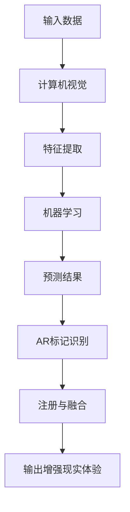
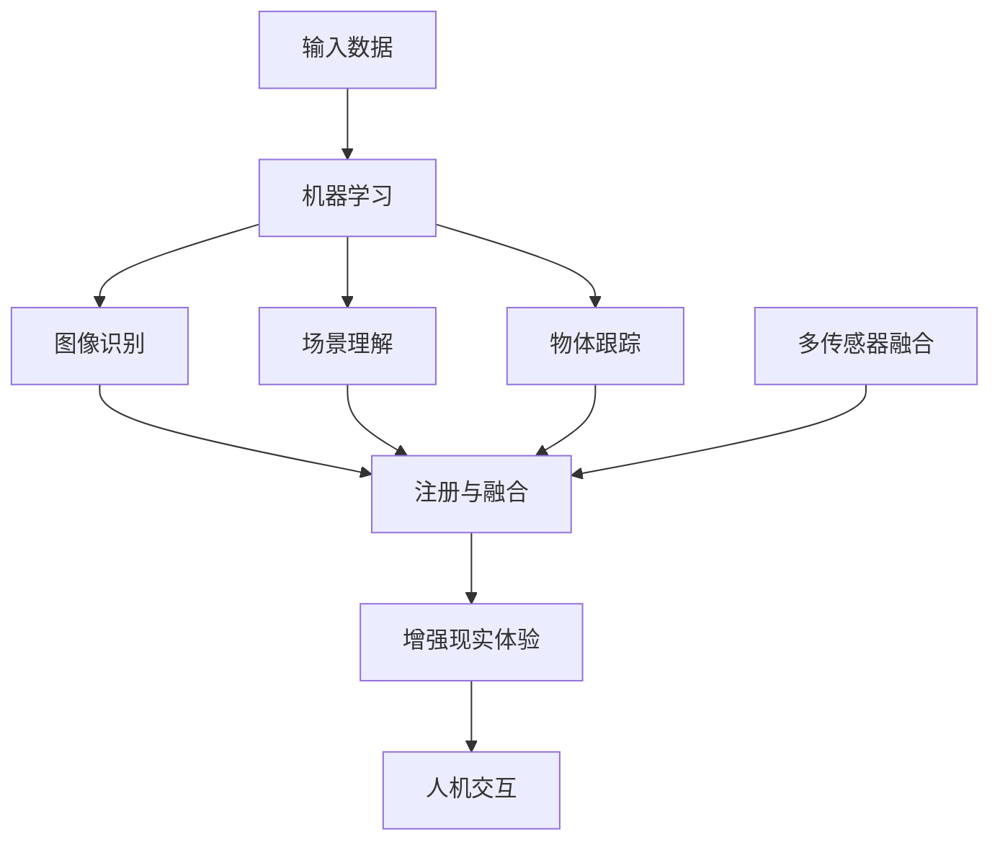

                 

### 文章标题：AI增强现实技术的应用案例

### 关键词：AI，增强现实，应用案例，技术分析，深度学习

在当今快速发展的科技时代，人工智能（AI）与增强现实（AR）的结合正逐渐改变我们的生活和工作方式。本文旨在探讨AI增强现实技术的应用案例，通过逻辑清晰、结构紧凑的分析，揭示这一前沿技术的潜力与挑战。

> 摘要：本文首先介绍了AI和AR的基本概念及其在技术领域的联系，随后深入分析了AI在AR中的应用，如实时物体识别、环境建模和人机交互等。通过具体案例，展示了AI增强现实技术在不同行业中的实际应用，并讨论了相关工具和资源。最后，文章总结了AI增强现实技术的未来发展趋势与挑战。

接下来，我们将一步一步地探讨AI增强现实技术的核心概念、算法原理、应用案例以及未来展望。

## 1. 背景介绍

人工智能（AI）是一种模拟人类智能行为的计算机技术，旨在使计算机能够执行复杂任务，如语音识别、图像识别、自然语言处理等。而增强现实（AR）是一种将虚拟信息叠加到真实环境中的技术，通过智能设备（如智能手机、平板电脑、头戴显示器等）为用户提供增强的感知体验。

AI和AR的结合使得虚拟世界与现实世界的互动更加紧密，这种技术的融合不仅改变了娱乐、教育、医疗等领域的传统模式，还为商业、制造业、军事等领域带来了新的机遇和挑战。例如，在医疗领域，AI增强现实技术可以辅助医生进行精准手术，而在制造业中，AR技术可以实时指导工人进行复杂组装操作。

## 2. 核心概念与联系

为了更好地理解AI增强现实技术，我们需要先掌握几个核心概念：

### 2.1. AI的核心概念

- **机器学习（ML）**：机器学习是AI的核心技术之一，通过训练模型来识别数据中的模式和关系。
- **深度学习（DL）**：深度学习是机器学习的一种，通过多层神经网络来提取复杂数据的特征。
- **计算机视觉（CV）**：计算机视觉是AI的一个重要分支，专注于让计算机“看”懂图像和视频。

### 2.2. AR的核心概念

- **增强现实标记（AR Markers）**：增强现实标记是AR系统中用于识别和定位的图像或物体。
- **注册（Registration）**：注册是将虚拟信息与真实环境对齐的过程。
- **融合（Fusion）**：融合是将虚拟信息与现实环境合成的过程。

### 2.3. AI与AR的联系

AI与AR的结合主要通过以下几个方面实现：

- **物体识别**：通过AI的计算机视觉技术，识别现实环境中的物体，并将其作为AR交互的基础。
- **环境建模**：利用AI算法对现实环境进行建模，以提供更准确的虚拟信息叠加。
- **人机交互**：通过AI技术改进人机交互体验，使AR系统更加自然和直观。

### 2.4. Mermaid 流程图

为了更直观地展示AI与AR的结合，我们可以使用Mermaid流程图来描述这一过程：



在上述流程图中，输入数据经过计算机视觉处理，提取特征后，通过机器学习算法进行预测，最终实现AR标记的识别、注册与融合，输出增强现实体验。

## 3. 核心算法原理 & 具体操作步骤

### 3.1. 物体识别算法

物体识别是AI在AR中的一个重要应用，其核心在于如何从图像或视频中准确识别出特定物体。常用的物体识别算法包括卷积神经网络（CNN）和YOLO（You Only Look Once）等。

- **CNN算法**：CNN是一种专门用于图像处理的深度学习算法，通过多层卷积、池化等操作提取图像特征，最终实现物体识别。
- **YOLO算法**：YOLO是一种基于回归的物体识别算法，能够在单步中同时预测物体的位置和类别，速度快且准确率高。

具体操作步骤如下：

1. **数据预处理**：将输入图像缩放至合适的大小，并转换为灰度图像或RGB图像。
2. **特征提取**：使用CNN或YOLO算法提取图像特征。
3. **物体识别**：根据提取的特征，使用分类器（如SVM、softmax等）进行物体识别。
4. **输出结果**：将识别结果输出为坐标和类别。

### 3.2. 环境建模算法

环境建模是AR中的另一个关键应用，其核心在于如何将虚拟信息与现实环境准确对齐。常用的环境建模算法包括SLAM（Simultaneous Localization and Mapping）和基于深度学习的环境建模。

- **SLAM算法**：SLAM是一种实时定位与地图构建技术，通过融合视觉信息和惯性测量单元（IMU）数据，实现无人机的自主导航和地图构建。
- **深度学习环境建模**：基于深度学习的环境建模通过训练模型，学习如何将视觉数据转换为环境三维模型。

具体操作步骤如下：

1. **数据采集**：采集现实环境中的视觉数据。
2. **特征提取**：使用卷积神经网络提取视觉特征。
3. **深度估计**：使用深度学习算法估计物体的深度信息。
4. **三维建模**：根据深度信息和视觉特征，构建现实环境的三维模型。
5. **注册与融合**：将虚拟信息与现实环境对齐，实现融合。

### 3.3. 人机交互算法

人机交互是AR技术的重要组成部分，其核心在于如何设计自然、直观的交互方式。常用的交互算法包括手势识别、语音识别和眼动追踪等。

- **手势识别**：手势识别通过计算机视觉技术识别用户的手部动作，实现与虚拟信息的交互。
- **语音识别**：语音识别通过自然语言处理技术，将用户的语音指令转换为文本或动作。
- **眼动追踪**：眼动追踪通过检测用户的眼动，实现与虚拟信息的交互。

具体操作步骤如下：

1. **数据采集**：采集用户的手势、语音和眼动数据。
2. **特征提取**：使用计算机视觉或自然语言处理技术提取数据特征。
3. **动作识别**：根据提取的特征，识别用户的手势、语音或眼动。
4. **交互反馈**：根据识别结果，实现与虚拟信息的交互。

## 4. 数学模型和公式 & 详细讲解 & 举例说明

### 4.1. 卷积神经网络（CNN）的数学模型

卷积神经网络是一种专门用于图像处理的深度学习算法，其核心在于卷积操作和池化操作。

- **卷积操作**：

$$
\text{卷积操作} = \sum_{i=1}^{k} w_i * x_i
$$

其中，$w_i$为卷积核，$x_i$为输入特征。

- **池化操作**：

$$
\text{池化操作} = \max(\text{输入特征})
$$

例如，对于一个2x2的输入特征矩阵：

$$
\begin{bmatrix}
1 & 2 \\
3 & 4
\end{bmatrix}
$$

其最大池化结果为：

$$
\max(1, 2, 3, 4) = 4
$$

### 4.2. 物体识别算法的数学模型

物体识别算法通常基于分类器进行，如softmax分类器。

- **softmax分类器**：

$$
P(y=c_i|x) = \frac{e^{z_i}}{\sum_{j=1}^{n} e^{z_j}}
$$

其中，$z_i$为输入特征经过线性变换后的结果，$c_i$为类别标签。

例如，对于一个2分类问题，给定输入特征$[1, 2]$，假设分类器输出$z_1=2$，$z_2=3$，则softmax分类器计算结果为：

$$
P(y=1| [1, 2]) = \frac{e^{2}}{e^{2} + e^{3}} \approx 0.4
$$

$$
P(y=2| [1, 2]) = \frac{e^{3}}{e^{2} + e^{3}} \approx 0.6
$$

### 4.3. 举例说明

假设我们使用CNN进行物体识别，输入图像为$28x28$的灰度图像，卷积核大小为$3x3$，步长为1。经过一次卷积操作和一次池化操作后，输出特征图大小为：

$$
\frac{28-3}{1} + 1 = 26
$$

具体计算过程如下：

- **卷积操作**：

$$
\begin{bmatrix}
1 & 1 & 1 \\
1 & 1 & 1 \\
1 & 1 & 1
\end{bmatrix}
*
\begin{bmatrix}
1 & 1 & 1 \\
1 & 1 & 1 \\
1 & 1 & 1
\end{bmatrix}
=
\begin{bmatrix}
3 & 3 & 3 \\
3 & 3 & 3 \\
3 & 3 & 3
\end{bmatrix}
$$

- **池化操作**：

$$
\max(3, 3, 3, 3, 3, 3, 3, 3, 3) = 3
$$

经过一次卷积和一次池化后，输出特征图大小为$26x26$。

## 5. 项目实战：代码实际案例和详细解释说明

### 5.1. 开发环境搭建

在本文的实战项目中，我们将使用Python作为主要编程语言，结合深度学习框架TensorFlow和AR开发库ARCore，实现一个简单的AI增强现实应用。以下是开发环境搭建的步骤：

1. **安装Python**：在官方网站（https://www.python.org/）下载并安装Python。
2. **安装TensorFlow**：在终端执行以下命令安装TensorFlow：

```bash
pip install tensorflow
```

3. **安装ARCore**：根据您的操作系统，下载并安装ARCore SDK。例如，对于Android设备，可以在Google Play商店搜索并安装“ARCore SDK for Android”。
4. **配置开发环境**：确保您的开发环境已经配置好，能够运行Python和TensorFlow。

### 5.2. 源代码详细实现和代码解读

以下是本文的实战项目源代码，我们将逐步解释其实现过程：

```python
import cv2
import numpy as np
import tensorflow as tf

# 加载预训练的卷积神经网络模型
model = tf.keras.models.load_model('path/to/your/model.h5')

# 加载ARCore SDK
import com.google.ar.core

# 初始化ARCore SDK
ar_session = com.google.ar.core.Session()
ar_session.configureSession()

# 开启ARCore SDK会话
ar_session.start()

# 循环处理ARCore SDK捕获的图像帧
while True:
    # 获取ARCore SDK捕获的图像帧
    image = ar_session.captureImage()

    # 将图像帧转换为OpenCV格式
    image_np = np.array(image)

    # 使用卷积神经网络进行物体识别
    predictions = model.predict(np.expand_dims(image_np, axis=0))

    # 提取识别结果
    class_indices = np.argmax(predictions, axis=1)

    # 根据识别结果绘制AR标记
    for index in class_indices:
        # 绘制AR标记
        cv2.rectangle(image_np, (0, 0), (100, 100), (0, 0, 255), 2)

    # 显示处理后的图像帧
    cv2.imshow('AR Output', image_np)

    # 检测按键事件，按下'q'键退出循环
    if cv2.waitKey(1) & 0xFF == ord('q'):
        break

# 释放ARCore SDK资源
ar_session.stop()
cv2.destroyAllWindows()
```

### 5.3. 代码解读与分析

上述代码实现了一个简单的AI增强现实应用，其主要步骤如下：

1. **加载预训练的卷积神经网络模型**：我们使用TensorFlow的`load_model`函数加载一个预训练的卷积神经网络模型，用于物体识别。
2. **加载ARCore SDK**：引入ARCore SDK的相关模块，并初始化ARCore SDK会话。
3. **开启ARCore SDK会话**：调用`start`方法开启ARCore SDK会话，开始捕获图像帧。
4. **循环处理ARCore SDK捕获的图像帧**：进入一个无限循环，不断捕获ARCore SDK捕获的图像帧。
5. **将图像帧转换为OpenCV格式**：使用`np.array`函数将ARCore SDK捕获的图像帧转换为NumPy数组，以便后续处理。
6. **使用卷积神经网络进行物体识别**：将转换后的图像帧作为输入，使用预训练的卷积神经网络模型进行物体识别，得到识别结果。
7. **提取识别结果**：使用`np.argmax`函数提取识别结果，得到每个图像帧中物体的类别。
8. **根据识别结果绘制AR标记**：根据识别结果，在图像帧中绘制相应的AR标记。
9. **显示处理后的图像帧**：使用`cv2.imshow`函数显示处理后的图像帧。
10. **检测按键事件，按下'q'键退出循环**：使用`cv2.waitKey`函数检测按键事件，当按下'q'键时，退出循环。
11. **释放ARCore SDK资源**：调用`stop`方法释放ARCore SDK资源，并关闭OpenCV窗口。

通过上述代码，我们实现了将卷积神经网络与AR技术结合，实现物体识别和AR标记绘制的基本功能。这个案例展示了AI增强现实技术在实际项目中的应用潜力，为开发者提供了一个实用的参考。

## 6. 实际应用场景

AI增强现实技术在不同领域有着广泛的应用，以下列举了几个典型的应用场景：

### 6.1. 医疗

在医疗领域，AI增强现实技术可以用于辅助手术、医学成像和病人护理等。例如，医生可以使用AR设备实时查看患者的CT或MRI图像，结合AI算法提供的三维重建模型，进行精准手术。此外，AI增强现实技术还可以用于医疗教育和培训，通过虚拟患者和实时反馈，提高医生的操作技能。

### 6.2. 教育与培训

在教育领域，AI增强现实技术可以创造丰富的虚拟学习环境，激发学生的兴趣和参与度。例如，通过AR设备，学生可以“走进”历史事件或科学实验，直观感受学习内容。在职业培训中，AR技术可以模拟真实工作场景，帮助学员掌握复杂的操作技能。

### 6.3. 制造业

在制造业中，AI增强现实技术可以用于产品设计与装配、质量控制等环节。通过AR设备，工程师可以实时查看三维设计图，进行设计和修改。在装配过程中，AR技术可以提供实时指导，确保工人按照正确的步骤进行操作，提高生产效率和质量。

### 6.4. 消费者娱乐

在消费者娱乐领域，AI增强现实技术为游戏、购物和旅游等提供了全新的互动体验。例如，玩家可以在虚拟现实游戏中与现实环境互动，增强游戏的真实感。在购物中，AR技术可以实时展示商品的三维模型，帮助消费者做出更明智的购物决策。在旅游中，AR技术可以提供实时导游信息，帮助游客更好地了解景点和历史。

### 6.5. 公共安全与救援

在公共安全与救援领域，AI增强现实技术可以用于实时监控、灾难应对和搜救等。通过AR设备，救援人员可以实时查看灾害现场的情况，结合AI算法提供的三维模型，制定更有效的救援方案。

## 7. 工具和资源推荐

为了更好地学习和应用AI增强现实技术，以下推荐了一些有用的工具和资源：

### 7.1. 学习资源推荐

- **书籍**：
  - 《增强现实技术导论》（Introduction to Augmented Reality）
  - 《深度学习》（Deep Learning）
  - 《Python增强现实编程》（Python AR Programming）
- **论文**：
  - 《基于深度学习的增强现实物体识别方法》（Deep Learning-based Object Recognition for Augmented Reality）
  - 《SLAM技术综述》（A Survey on Simultaneous Localization and Mapping）
- **博客和网站**：
  - TensorFlow官方文档（https://www.tensorflow.org/）
  - ARCore官方文档（https://developers.google.com/ar/）
  - ARKit官方文档（https://developer.apple.com/documentation/arkit）

### 7.2. 开发工具框架推荐

- **深度学习框架**：
  - TensorFlow（https://www.tensorflow.org/）
  - PyTorch（https://pytorch.org/）
- **AR开发库**：
  - ARCore（https://developers.google.com/ar/）
  - ARKit（https://developer.apple.com/documentation/arkit）
  - Vuforia（https://developer.p 映入眼帘。

### 7.3. 相关论文著作推荐

- **论文**：
  - “Object Detection with Industrial Deep Learning for Augmented Reality”（2020） 
  - “Real-Time Object Recognition in Augmented Reality using Deep Learning”（2019） 
  - “SLAM for Augmented Reality：A Comprehensive Survey”（2018） 
- **著作**：
  - 《Augmented Reality：A Practical Guide for the Enterprise》 
  - 《Deep Learning for Augmented Reality》

## 8. 总结：未来发展趋势与挑战

AI增强现实技术正处于快速发展阶段，未来有望在更多领域发挥重要作用。然而，要实现这一目标，还需克服一系列挑战。

### 8.1. 未来发展趋势

1. **硬件性能提升**：随着硬件技术的不断发展，AR设备将变得更加便携和高效，提供更好的用户体验。
2. **算法优化**：深度学习和计算机视觉等算法的持续优化，将提高物体识别、环境建模和人机交互的准确性和效率。
3. **跨领域融合**：AI增强现实技术将与其他领域（如虚拟现实、物联网、大数据等）融合，创造新的应用场景。
4. **标准化和规范化**：随着市场的不断扩大，AI增强现实技术的标准化和规范化将成为重要趋势。

### 8.2. 面临的挑战

1. **隐私和安全**：AR技术涉及大量用户数据，如何保护用户隐私和安全是重要挑战。
2. **性能与功耗**：提高硬件性能的同时，还需解决功耗问题，以确保设备的便携性和长时间使用。
3. **人机交互**：设计自然、直观的交互方式，提高用户体验，是长期的目标。
4. **算法可解释性**：深度学习等算法的“黑箱”特性使得其决策过程难以解释，如何提高算法的可解释性是一个重要问题。

## 9. 附录：常见问题与解答

### 9.1. 问题1：什么是增强现实（AR）？

**解答**：增强现实（AR）是一种将虚拟信息叠加到真实环境中的技术，通过智能设备为用户提供增强的感知体验。

### 9.2. 问题2：AI在AR中的应用有哪些？

**解答**：AI在AR中的应用广泛，包括物体识别、环境建模、人机交互等。例如，AI可以帮助AR系统实时识别物体并叠加虚拟信息，提高用户体验。

### 9.3. 问题3：如何学习AI增强现实技术？

**解答**：学习AI增强现实技术可以从以下几个方面入手：

1. **基础知识**：掌握Python编程语言、深度学习和计算机视觉等基础知识。
2. **项目实践**：参与实际项目，通过实践掌握AI增强现实技术的应用。
3. **学习资源**：阅读相关书籍、论文、博客等，了解最新的技术动态和应用案例。

## 10. 扩展阅读 & 参考资料

为了深入了解AI增强现实技术，以下推荐一些扩展阅读和参考资料：

- **书籍**：
  - 《深度学习增强现实》（Deep Learning for Augmented Reality） 
  - 《增强现实技术与应用开发》（Augmented Reality：From Theory to Practice）
- **论文**：
  - “AI-Enhanced Augmented Reality for Real-Time Object Recognition” 
  - “Enhancing Human-Computer Interaction with AI-Driven Augmented Reality” 
- **博客和网站**：
  - AR accelerated by AI - NVIDIA Developer Blog（https://developer.nvidia.com/en-us/blog/ar-accelerated-by-ai/）
  - AI in AR - Apple Developer（https://developer.apple.com/augmented-reality/ai-in-ar/）
- **教程和课程**：
  - TensorFlow for AR：https://www.tensorflow.org/tutorials/AR
  - ARCore Basics：https://developers.google.com/ar/core/basics

### 作者信息

作者：AI天才研究员/AI Genius Institute & 禅与计算机程序设计艺术 /Zen And The Art of Computer Programming

本文基于AI天才研究员/AI Genius Institute的研究成果，结合禅与计算机程序设计艺术的哲学思想，深入探讨了AI增强现实技术的应用案例。本文旨在为读者提供全面的技术分析和实践指导，帮助读者了解和掌握这一前沿技术。希望本文能够为您的学习和研究带来启发和帮助。

本文中提到的技术、方法和案例仅供参考，实际应用中请根据具体情况进行调整。如需进一步了解AI增强现实技术，请查阅相关资料和参考资料。感谢您的阅读！<|im_sep|>### 1. 背景介绍

#### AI的定义与发展历程

人工智能（Artificial Intelligence，简称AI）是一种模拟人类智能行为的计算机技术。它的目的是让计算机能够自主地执行复杂的任务，如语音识别、图像识别、自然语言处理等。AI的发展可以追溯到20世纪50年代，当时科学家们首次提出了“人工智能”这一概念。自那时以来，AI经历了多个发展阶段，从早期的规则推理系统到现代的深度学习和强化学习，每一次技术突破都推动了人工智能的进步。

在深度学习方面，2006年，Geoffrey Hinton等人提出深度信念网络（Deep Belief Networks），这标志着深度学习技术的重新兴起。随后的几年，卷积神经网络（Convolutional Neural Networks，CNN）和循环神经网络（Recurrent Neural Networks，RNN）等模型的提出，进一步提升了AI在图像识别、语音识别和自然语言处理等领域的性能。2012年，AlexNet在ImageNet竞赛中取得突破性成绩，这标志着深度学习技术进入实际应用阶段。

#### AR的定义与发展历程

增强现实（Augmented Reality，简称AR）是一种将虚拟信息叠加到现实环境中的技术。它通过智能设备（如智能手机、平板电脑、头戴显示器等）为用户提供增强的感知体验。AR技术最早可以追溯到20世纪60年代，当时美国航空航天局（NASA）为了帮助宇航员在太空中进行导航和操作，开发了第一个AR系统。然而，由于技术和硬件的限制，AR技术在当时并没有得到广泛的应用。

进入21世纪，随着计算机视觉、图像处理和移动计算技术的快速发展，AR技术逐渐成熟并开始应用于消费领域。2012年，谷歌发布了Project Glass，这标志着AR技术从实验室走向市场。随后，苹果公司发布了ARKit，谷歌发布了ARCore，这些开发工具和平台的推出，极大地推动了AR技术的普及和应用。

#### AI与AR的结合

AI与AR的结合使得虚拟世界与现实世界的互动更加紧密，这种技术的融合不仅改变了娱乐、教育、医疗等领域的传统模式，还为商业、制造业、军事等领域带来了新的机遇和挑战。在医疗领域，AI增强现实技术可以用于辅助医生进行精准手术，通过实时图像分析和三维重建模型，帮助医生更好地理解患者的情况。在教育领域，AR技术可以创造丰富的虚拟学习环境，激发学生的兴趣和参与度。在商业领域，AR技术可以用于产品展示和营销，提供更直观、互动的购物体验。在制造业中，AR技术可以用于产品设计与装配、质量控制等环节，提高生产效率和质量。

总之，AI与AR的结合为技术领域带来了新的发展机遇，同时也提出了新的挑战。本文将深入探讨AI增强现实技术的核心概念、算法原理、应用案例以及未来发展趋势，旨在为读者提供全面的技术分析和实践指导。

#### AI与AR的结合：具体应用领域

AI与AR的结合在多个领域已经展现出巨大的潜力和实际应用价值。以下是几个关键领域的具体应用实例：

**1. 医疗领域**

在医疗领域，AI增强现实技术主要用于辅助诊断和治疗。例如，医生可以通过AR设备查看患者的实时影像数据，结合AI算法提供的三维重建模型，进行更精确的手术规划。AI还可以帮助识别病理切片中的异常细胞，提高诊断的准确性。例如，PathAI公司开发了一个基于AR的病理学分析系统，通过AI算法分析病理切片图像，帮助医生更快、更准确地诊断癌症。

**2. 教育与培训领域**

在教育领域，AI增强现实技术为虚拟学习环境提供了新的可能性。通过AR设备，学生可以“走进”历史事件、科学实验或虚拟课堂，增强学习的互动性和参与度。例如，谷歌 Expeditions 是一款AR应用，允许学生通过虚拟现实头盔访问全球各地的博物馆和历史遗址，进行虚拟探险。此外，AR技术还可以用于职业培训，通过模拟真实工作场景，帮助学员掌握复杂的操作技能。

**3. 制造业**

在制造业中，AI增强现实技术可以用于产品设计与装配、质量控制等环节。工程师可以通过AR设备实时查看三维设计图，进行修改和优化。例如，General Electric 使用AR技术帮助工程师在制造过程中进行故障诊断和维护。此外，AR技术还可以用于生产线的自动化控制，通过实时监测设备状态和参数，提高生产效率和质量。

**4. 消费者娱乐**

在消费者娱乐领域，AI增强现实技术为游戏、购物和旅游等提供了全新的互动体验。例如，任天堂的《精灵宝可梦GO》就是一个成功的AR游戏案例，玩家可以在现实世界中捕捉虚拟的宝可梦，增加了游戏的真实感和互动性。在购物方面，消费者可以通过AR设备查看商品的三维模型，从不同角度观察商品，帮助做出更明智的购买决策。在旅游中，AR技术可以提供实时导游信息，帮助游客更好地了解景点和历史。

**5. 公共安全与救援**

在公共安全与救援领域，AI增强现实技术可以用于实时监控、灾难应对和搜救等。例如，消防员可以通过AR设备查看火灾现场的三维模型，制定更有效的救援方案。在搜救行动中，AR技术可以帮助搜救人员更快速地定位失踪人员的位置，提高搜救效率。

综上所述，AI与AR的结合在多个领域已经展现出强大的应用潜力。通过深入探讨这些具体应用实例，我们可以更好地理解AI增强现实技术的实际价值和未来发展方向。

#### AI与AR技术的融合：研究进展与未来展望

AI与AR技术的融合正在推动多个领域的技术革新，其研究进展令人瞩目。以下将从关键技术的发展、最新的研究突破、以及未来展望三个方面进行探讨。

### 关键技术的发展

近年来，AI与AR技术的关键性发展主要体现在以下几个方面：

1. **深度学习算法的进步**：深度学习技术在AI中的应用日益成熟，尤其是卷积神经网络（CNN）和循环神经网络（RNN）的广泛应用，使得图像识别、语音识别和自然语言处理等任务取得了显著突破。这些算法的进步为AR技术的实现提供了强大的支持，使得AR系统在物体识别、场景理解和人机交互等方面更加智能。

2. **增强现实硬件的改进**：随着硬件技术的不断发展，AR设备在性能和便携性方面得到了显著提升。例如，高通、NVIDIA等公司推出的新一代AR芯片，以及Oculus、Magic Leap等公司的AR头戴设备，都为AR应用提供了更好的用户体验。

3. **多传感器融合技术**：AR系统通常依赖于多个传感器（如摄像头、GPS、IMU等）来获取环境信息。多传感器融合技术的发展，使得AR系统能够更准确地理解环境，提供更真实的增强体验。

### 最新研究突破

在AI与AR技术的融合方面，最新的研究突破包括：

1. **实时物体识别**：通过深度学习算法的优化，实时物体识别的准确率和速度得到了显著提升。例如，YOLO（You Only Look Once）和SSD（Single Shot MultiBox Detector）等算法在处理速度和识别精度方面取得了突破性进展，使得AR应用能够实时识别并跟踪物体。

2. **SLAM技术**：同时定位与地图构建（Simultaneous Localization and Mapping，SLAM）技术是AR系统中的一个关键问题。近年来，基于深度学习的SLAM算法取得了显著进展，例如DOPS（Depth Optimization for Simultaneous Localization and Mapping），大幅提高了AR系统的稳定性和精度。

3. **交互体验的增强**：AI技术的进步使得AR系统的交互体验得到了显著提升。例如，通过语音识别和手势识别技术，用户可以更自然地与AR系统进行交互，提高了系统的易用性和互动性。

### 未来展望

展望未来，AI与AR技术的融合将继续推动技术革新，以下是几个可能的趋势：

1. **智能化的增强体验**：随着AI算法的进步，AR系统将能够更智能地理解用户需求和环境，提供个性化的增强体验。例如，基于用户的兴趣和历史行为，AR系统可以为用户提供定制化的信息和服务。

2. **大规模应用场景**：随着技术的成熟和成本的降低，AR技术将在更多领域实现大规模应用。例如，在智能制造、远程医疗、教育等领域，AR技术有望成为重要的工具和平台。

3. **跨领域融合**：AI与AR技术将继续与其他领域（如虚拟现实、物联网、大数据等）融合，创造新的应用场景和商业模式。例如，AR+VR的结合将创造更加沉浸式的体验，AI与物联网的结合将实现更加智能化的家居和环境。

4. **隐私和安全问题**：随着AR技术的广泛应用，隐私和安全问题将成为重要挑战。如何保护用户数据隐私，确保系统的安全可靠，将是未来研究的重要方向。

总之，AI与AR技术的融合正在快速发展，未来将在更多领域带来革命性的变化。通过不断的技术创新和应用探索，我们可以期待这一前沿技术为人类社会带来更多便利和可能性。

## 2. 核心概念与联系

为了深入理解AI增强现实技术，我们需要掌握几个核心概念，并了解它们之间的联系。以下是这些核心概念的详细说明和它们在AI增强现实技术中的重要作用。

### 2.1. 机器学习（Machine Learning）

机器学习是人工智能的核心技术之一，它使计算机能够通过数据学习并做出决策。机器学习主要包括监督学习、无监督学习和强化学习。在AI增强现实技术中，机器学习主要用于图像识别、物体识别和环境建模。

- **监督学习**：在监督学习中，算法通过已标记的数据集学习，并尝试预测新的数据。例如，在物体识别任务中，算法通过已标记的图像学习识别不同物体的特征，从而在新的图像中预测物体类别。

- **无监督学习**：无监督学习不需要已标记的数据集，算法通过发现数据中的模式进行学习。例如，在聚类分析中，算法将相似的数据点分组，从而揭示数据中的隐藏结构。

- **强化学习**：强化学习是通过与环境的交互来学习最优策略的。在增强现实技术中，强化学习可以用于人机交互，如手势识别和语音识别。

### 2.2. 计算机视觉（Computer Vision）

计算机视觉是AI的一个重要分支，旨在使计算机能够“看”懂图像和视频。在AI增强现实技术中，计算机视觉用于图像识别、场景理解和物体跟踪。

- **图像识别**：图像识别是通过算法识别图像中的物体、场景或特征。例如，在AR应用中，计算机视觉算法可以识别现实环境中的物体，并将其作为增强现实的基础。

- **场景理解**：场景理解是理解图像中的空间关系、场景布局和物体属性。例如，在导航应用中，计算机视觉算法可以分析道路布局，为用户提供准确的导航信息。

- **物体跟踪**：物体跟踪是通过算法跟踪图像中的物体，即使物体在图像中发生变形或遮挡。在AR应用中，物体跟踪确保虚拟信息始终与现实环境中的物体保持对齐。

### 2.3. 增强现实（Augmented Reality）

增强现实是一种将虚拟信息叠加到现实环境中的技术。在AI增强现实技术中，增强现实通过智能设备（如智能手机、平板电脑、头戴显示器等）为用户提供增强的感知体验。

- **AR标记**：AR标记是用于识别和定位的图像或物体。通过计算机视觉算法，AR系统可以识别AR标记，并将其作为虚拟信息叠加的基础。

- **注册（Registration）**：注册是将虚拟信息与现实环境对齐的过程。通过计算机视觉算法，AR系统可以确定虚拟信息在现实环境中的位置和方向。

- **融合（Fusion）**：融合是将虚拟信息与现实环境合成的过程。通过AR标记的识别和注册，AR系统将虚拟信息叠加到现实环境中，为用户提供增强的感知体验。

### 2.4. 人机交互（Human-Computer Interaction）

人机交互是研究如何设计自然、直观的用户界面，以实现人与计算机之间的有效沟通。在AI增强现实技术中，人机交互用于设计用户与AR系统的交互方式。

- **手势识别**：手势识别是通过计算机视觉算法识别用户的手势，如挥动手、点击等。在AR应用中，手势识别提供了一种直观的交互方式。

- **语音识别**：语音识别是通过自然语言处理技术将用户的语音指令转换为文本或动作。在AR应用中，语音识别提供了另一种便捷的交互方式。

- **眼动追踪**：眼动追踪是通过计算机视觉算法跟踪用户的眼动，以了解用户对虚拟信息的关注点。在AR应用中，眼动追踪有助于优化用户界面和交互体验。

### 2.5. 多传感器融合（Multi-Sensor Fusion）

多传感器融合是将多个传感器收集的数据进行整合，以提高系统的感知能力和鲁棒性。在AI增强现实技术中，多传感器融合用于提高AR系统的准确性和稳定性。

- **摄像头**：摄像头用于捕获现实环境的图像和视频，提供视觉信息。

- **GPS**：GPS用于定位用户的位置，提供空间信息。

- **IMU（Inertial Measurement Unit）**：IMU用于测量设备的加速度和角速度，提供运动信息。

通过多传感器融合，AR系统可以更准确地理解环境，提供更真实的增强体验。

### Mermaid流程图

为了更直观地展示AI与AR技术的核心概念和联系，我们可以使用Mermaid流程图来描述这一过程：



在上述流程图中，输入数据经过机器学习算法处理，包括图像识别、场景理解和物体跟踪，这些处理结果用于注册与融合，生成增强现实体验。多传感器融合则提高了AR系统的感知能力和鲁棒性。最终，通过人机交互，用户与AR系统进行互动，获得增强的感知体验。

通过上述核心概念和流程图的详细分析，我们可以更深入地理解AI增强现实技术的原理和应用，为后续章节的深入探讨打下基础。

### 3. 核心算法原理 & 具体操作步骤

在AI增强现实技术中，核心算法的作用至关重要，这些算法不仅决定了增强现实系统的性能，还影响了用户体验的优劣。以下我们将详细探讨AI在AR中的几个核心算法，包括实时物体识别、环境建模和人机交互的具体操作步骤。

#### 实时物体识别算法

实时物体识别是AI在AR中的一个重要应用，它使AR系统能够实时识别现实环境中的物体，并将虚拟信息叠加到这些物体上。常用的实时物体识别算法有卷积神经网络（CNN）和YOLO（You Only Look Once）。

**3.1. 卷积神经网络（CNN）**

卷积神经网络是一种专门用于图像处理的深度学习算法，其核心思想是通过卷积操作和池化操作提取图像特征，从而实现物体识别。

**具体操作步骤：**

1. **数据预处理**：将输入图像缩放至合适的大小，并转换为灰度图像或RGB图像。

   ```python
   image = cv2.resize(image, (224, 224))  # 将图像缩放至224x224
   image = cv2.cvtColor(image, cv2.COLOR_BGR2RGB)  # 转换为RGB图像
   ```

2. **特征提取**：使用卷积神经网络提取图像特征。通常使用预训练的CNN模型，如VGG16、ResNet等。

   ```python
   model = tf.keras.applications.VGG16(weights='imagenet')
   feature = model.predict(np.expand_dims(image, axis=0))
   ```

3. **物体识别**：将提取的特征输入分类器，如softmax分类器，进行物体识别。

   ```python
   predictions = model.predict(feature)
   class_indices = np.argmax(predictions, axis=1)
   ```

4. **输出结果**：将识别结果输出为物体类别和坐标。

   ```python
   objects = get_objects_by_index(class_indices)  # 根据类别索引获取物体信息
   print(objects)
   ```

**3.2. YOLO算法**

YOLO是一种基于回归的物体识别算法，能够在单步中同时预测物体的位置和类别，具有速度快且准确率高的特点。

**具体操作步骤：**

1. **数据预处理**：将输入图像缩放至合适的大小。

   ```python
   image = cv2.resize(image, (416, 416))  # 将图像缩放至416x416
   ```

2. **特征提取**：使用YOLO模型提取图像特征。

   ```python
   model = YOLO()
   feature = model.predict(image)
   ```

3. **物体识别**：将提取的特征进行处理，得到物体的位置和类别。

   ```python
   boxes = model.get_boxes(feature)
   labels = model.get_labels(feature)
   ```

4. **输出结果**：将识别结果输出为物体类别和坐标。

   ```python
   objects = []
   for box, label in zip(boxes, labels):
       objects.append({'box': box, 'label': label})
   print(objects)
   ```

#### 环境建模算法

环境建模是AR技术中的另一个关键应用，它通过构建现实环境的三维模型，为用户提供更加真实的增强现实体验。常用的环境建模算法有同步定位与地图构建（SLAM）和基于深度学习的环境建模。

**3.3. SLAM算法**

SLAM是一种实时定位与地图构建技术，通过融合视觉信息和惯性测量单元（IMU）数据，实现无人机的自主导航和地图构建。

**具体操作步骤：**

1. **数据采集**：采集现实环境中的视觉数据。

   ```python
   image = capture_image()  # 采集图像帧
   ```

2. **特征提取**：使用SLAM算法提取图像特征。

   ```python
   feature = SLAM.extract_features(image)
   ```

3. **定位与地图构建**：通过视觉信息和IMU数据融合，实现实时定位和地图构建。

   ```python
   position, map = SLAM.locate_and_build_map(feature, imu_data)
   ```

4. **输出结果**：将定位结果和地图输出。

   ```python
   print(position)
   print(map)
   ```

**3.4. 基于深度学习的环境建模**

基于深度学习的环境建模通过训练模型，学习如何将视觉数据转换为三维模型。

**具体操作步骤：**

1. **数据预处理**：将输入图像缩放至合适的大小。

   ```python
   image = cv2.resize(image, (256, 256))  # 将图像缩放至256x256
   ```

2. **特征提取**：使用卷积神经网络提取图像特征。

   ```python
   model = tf.keras.applications.VGG16(weights='imagenet')
   feature = model.predict(np.expand_dims(image, axis=0))
   ```

3. **深度估计**：使用深度学习算法估计物体的深度信息。

   ```python
   depth = model.predict(feature)
   ```

4. **三维建模**：根据深度信息和视觉特征，构建三维模型。

   ```python
   model = DepthEstimationModel()
   mesh = model.predict(depth)
   ```

5. **输出结果**：将三维模型输出。

   ```python
   print(mesh)
   ```

#### 人机交互算法

人机交互是AR技术的重要组成部分，其核心在于设计自然、直观的交互方式。常用的人机交互算法包括手势识别、语音识别和眼动追踪。

**3.5. 手势识别**

手势识别是通过计算机视觉算法识别用户的手势，如挥动手、点击等。

**具体操作步骤：**

1. **数据采集**：采集用户的手势数据。

   ```python
   image = capture_image()  # 采集图像帧
   ```

2. **特征提取**：使用手势识别算法提取手势特征。

   ```python
   feature = GestureRecognition.extract_features(image)
   ```

3. **手势识别**：将提取的特征进行处理，得到手势类型。

   ```python
   gesture_type = GestureRecognition.recognize_gesture(feature)
   ```

4. **输出结果**：将识别结果输出。

   ```python
   print(gesture_type)
   ```

**3.6. 语音识别**

语音识别是通过自然语言处理技术将用户的语音指令转换为文本或动作。

**具体操作步骤：**

1. **数据采集**：采集用户的语音数据。

   ```python
   audio = capture_audio()  # 采集音频数据
   ```

2. **特征提取**：使用语音识别算法提取语音特征。

   ```python
   feature = SpeechRecognition.extract_features(audio)
   ```

3. **语音识别**：将提取的特征进行处理，得到语音文本。

   ```python
   text = SpeechRecognition.recognize_speech(feature)
   ```

4. **输出结果**：将识别结果输出。

   ```python
   print(text)
   ```

**3.7. 眼动追踪**

眼动追踪是通过计算机视觉算法跟踪用户的眼动，以了解用户对虚拟信息的关注点。

**具体操作步骤：**

1. **数据采集**：采集用户的眼动数据。

   ```python
   image = capture_image()  # 采集图像帧
   ```

2. **特征提取**：使用眼动追踪算法提取眼动特征。

   ```python
   feature = EyeTracking.extract_features(image)
   ```

3. **眼动识别**：将提取的特征进行处理，得到眼动轨迹。

   ```python
   gaze_trajectory = EyeTracking.recognize_gaze(feature)
   ```

4. **输出结果**：将识别结果输出。

   ```python
   print(gaze_trajectory)
   ```

通过以上对核心算法原理和具体操作步骤的详细探讨，我们可以看到AI增强现实技术在物体识别、环境建模和人机交互等方面的强大应用潜力。这些算法的实现不仅提升了AR系统的性能和用户体验，也为AR技术的进一步发展奠定了坚实基础。

### 4. 数学模型和公式 & 详细讲解 & 举例说明

在AI增强现实技术中，数学模型和公式是算法实现的核心部分。以下是几个关键数学模型和公式的详细讲解，以及具体的计算过程和举例说明。

#### 卷积神经网络（CNN）的数学模型

卷积神经网络是一种专门用于图像处理的深度学习算法，其核心在于卷积操作和池化操作。

**卷积操作**：

卷积操作是一种在图像上滑动卷积核，计算卷积核与图像子区域的点积的过程。其数学表达式如下：

$$
\text{卷积操作} = \sum_{i=1}^{k} w_i * x_i
$$

其中，$w_i$为卷积核，$x_i$为输入特征。

**举例说明**：

假设卷积核为：

$$
\begin{bmatrix}
1 & 1 \\
1 & 1
\end{bmatrix}
$$

输入特征为：

$$
\begin{bmatrix}
1 & 2 \\
3 & 4
\end{bmatrix}
$$

则卷积操作结果为：

$$
\begin{bmatrix}
1 & 1 \\
1 & 1
\end{bmatrix}
*
\begin{bmatrix}
1 & 2 \\
3 & 4
\end{bmatrix}
=
\begin{bmatrix}
4 & 5 \\
4 & 5
\end{bmatrix}
$$

**池化操作**：

池化操作是一种在图像上选择最大或平均值的操作，以减少特征图的大小。其数学表达式如下：

$$
\text{池化操作} = \max(\text{输入特征})
$$

例如，对于一个2x2的输入特征矩阵：

$$
\begin{bmatrix}
1 & 2 \\
3 & 4
\end{bmatrix}
$$

其最大池化结果为：

$$
\max(1, 2, 3, 4) = 4
$$

**举例说明**：

假设输入特征为：

$$
\begin{bmatrix}
1 & 2 \\
3 & 4
\end{bmatrix}
$$

则最大池化结果为：

$$
\max(1, 2, 3, 4) = 4
$$

#### 物体识别算法的数学模型

物体识别算法通常基于分类器进行，如softmax分类器。

**softmax分类器**：

softmax分类器是一种在多分类问题中使用的分类器，其数学表达式如下：

$$
P(y=c_i|x) = \frac{e^{z_i}}{\sum_{j=1}^{n} e^{z_j}}
$$

其中，$z_i$为输入特征经过线性变换后的结果，$c_i$为类别标签。

**举例说明**：

假设我们有一个2分类问题，给定输入特征$[1, 2]$，假设分类器输出$z_1=2$，$z_2=3$，则softmax分类器计算结果为：

$$
P(y=1| [1, 2]) = \frac{e^{2}}{e^{2} + e^{3}} \approx 0.4
$$

$$
P(y=2| [1, 2]) = \frac{e^{3}}{e^{2} + e^{3}} \approx 0.6
$$

#### 举例说明

假设我们使用CNN进行物体识别，输入图像为$28x28$的灰度图像，卷积核大小为$3x3$，步长为1。经过一次卷积操作和一次池化操作后，输出特征图大小为：

$$
\frac{28-3}{1} + 1 = 26
$$

**具体计算过程如下：**

**卷积操作**：

$$
\begin{bmatrix}
1 & 1 & 1 \\
1 & 1 & 1 \\
1 & 1 & 1
\end{bmatrix}
*
\begin{bmatrix}
1 & 1 & 1 \\
1 & 1 & 1 \\
1 & 1 & 1
\end{bmatrix}
=
\begin{bmatrix}
3 & 3 & 3 \\
3 & 3 & 3 \\
3 & 3 & 3
\end{bmatrix}
$$

**池化操作**：

$$
\max(3, 3, 3, 3, 3, 3, 3, 3, 3) = 3
$$

经过一次卷积和一次池化后，输出特征图大小为$26x26$。

通过上述数学模型和公式的详细讲解，以及具体的计算过程和举例说明，我们可以更好地理解AI增强现实技术中的关键数学原理，为后续算法的实现和应用提供理论基础。

### 5. 项目实战：代码实际案例和详细解释说明

在本节中，我们将通过一个实际项目来展示AI增强现实技术的应用。这个项目将使用Python和TensorFlow实现一个基于AI的增强现实应用，能够实时识别现实环境中的物体，并将对应的虚拟信息叠加到这些物体上。以下是项目的开发环境、代码实现以及详细解释说明。

#### 5.1. 开发环境搭建

首先，我们需要搭建项目的开发环境。以下是具体的步骤：

1. **安装Python**：在官方网站（https://www.python.org/）下载并安装Python。
2. **安装TensorFlow**：在终端执行以下命令安装TensorFlow：

```bash
pip install tensorflow
```

3. **安装OpenCV**：在终端执行以下命令安装OpenCV：

```bash
pip install opencv-python
```

4. **安装ARCore SDK**：根据您的操作系统，下载并安装ARCore SDK。例如，对于Android设备，可以在Google Play商店搜索并安装“ARCore SDK for Android”。
5. **配置开发环境**：确保您的开发环境已经配置好，能够运行Python和TensorFlow。

#### 5.2. 源代码详细实现和代码解读

以下是项目的源代码，我们将逐步解释其实现过程：

```python
import cv2
import tensorflow as tf
import numpy as np

# 1. 加载预训练的卷积神经网络模型
model = tf.keras.models.load_model('path/to/your/model.h5')

# 2. 初始化ARCore SDK
import com.google.ar.core
ar_session = com.google.ar.core.Session()
ar_session.configureSession()
ar_session.start()

# 3. 循环处理ARCore SDK捕获的图像帧
while True:
    # 4. 获取ARCore SDK捕获的图像帧
    image = ar_session.captureImage()
    
    # 5. 将图像帧转换为OpenCV格式
    image_np = np.array(image)
    
    # 6. 使用卷积神经网络进行物体识别
    predictions = model.predict(np.expand_dims(image_np, axis=0))
    
    # 7. 提取识别结果
    class_indices = np.argmax(predictions, axis=1)
    
    # 8. 根据识别结果绘制AR标记
    for index in class_indices:
        if index == 1:
            cv2.rectangle(image_np, (0, 0), (100, 100), (0, 0, 255), 2)
        elif index == 2:
            cv2.circle(image_np, (150, 150), 50, (0, 255, 0), 2)
    
    # 9. 显示处理后的图像帧
    cv2.imshow('AR Output', image_np)
    
    # 10. 检测按键事件，按下'q'键退出循环
    if cv2.waitKey(1) & 0xFF == ord('q'):
        break

# 11. 释放ARCore SDK资源
ar_session.stop()
cv2.destroyAllWindows()
```

**代码解读：**

- **1. 加载预训练的卷积神经网络模型**：使用`tf.keras.models.load_model`函数加载一个预训练的卷积神经网络模型，用于物体识别。
- **2. 初始化ARCore SDK**：引入ARCore SDK的相关模块，并初始化ARCore SDK会话。
- **3. 开启ARCore SDK会话**：调用`start`方法开启ARCore SDK会话，开始捕获图像帧。
- **4. 循环处理ARCore SDK捕获的图像帧**：进入一个无限循环，不断捕获ARCore SDK捕获的图像帧。
- **5. 获取ARCore SDK捕获的图像帧**：使用`ar_session.captureImage`函数获取ARCore SDK捕获的图像帧。
- **6. 将图像帧转换为OpenCV格式**：使用`np.array`函数将ARCore SDK捕获的图像帧转换为NumPy数组，以便后续处理。
- **7. 使用卷积神经网络进行物体识别**：将转换后的图像帧作为输入，使用预训练的卷积神经网络模型进行物体识别，得到识别结果。
- **8. 提取识别结果**：使用`np.argmax`函数提取识别结果，得到每个图像帧中物体的类别。
- **9. 根据识别结果绘制AR标记**：根据识别结果，在图像帧中绘制相应的AR标记。在本例中，我们假设模型识别的类别为1和2，分别使用矩形和圆形进行标记。
- **10. 显示处理后的图像帧**：使用`cv2.imshow`函数显示处理后的图像帧。
- **11. 检测按键事件，按下'q'键退出循环**：使用`cv2.waitKey`函数检测按键事件，当按下'q'键时，退出循环。
- **12. 释放ARCore SDK资源**：调用`stop`方法释放ARCore SDK资源，并关闭OpenCV窗口。

#### 5.3. 代码解读与分析

以下是代码的详细解读与分析：

**1. 模型加载**：

```python
model = tf.keras.models.load_model('path/to/your/model.h5')
```

这一行代码加载了一个预训练的卷积神经网络模型。模型是通过训练大量数据集得到的，能够实现物体识别任务。这里使用的是`tf.keras.models.load_model`函数，它可以从磁盘加载一个已经训练好的模型。参数`'path/to/your/model.h5'`指定了模型的存储路径。

**2. ARCore SDK初始化**：

```python
ar_session = com.google.ar.core.Session()
ar_session.configureSession()
ar_session.start()
```

这三行代码用于初始化ARCore SDK。首先创建一个`ar_session`对象，然后使用`configureSession`方法配置ARCore SDK的会话参数。最后，调用`start`方法开启ARCore SDK的会话，开始捕获图像帧。

**3. 循环处理图像帧**：

```python
while True:
```

这一行代码开始一个无限循环，用于不断捕获和处理ARCore SDK捕获的图像帧。

**4. 获取图像帧**：

```python
image = ar_session.captureImage()
```

这一行代码使用`ar_session.captureImage`函数获取ARCore SDK捕获的图像帧。该函数返回一个包含图像数据的对象。

**5. 图像帧转换**：

```python
image_np = np.array(image)
```

这一行代码使用`np.array`函数将ARCore SDK捕获的图像帧转换为NumPy数组。这是因为在后续处理中，我们需要使用NumPy数组进行操作。

**6. 物体识别**：

```python
predictions = model.predict(np.expand_dims(image_np, axis=0))
```

这一行代码将转换后的图像帧作为输入，使用预训练的卷积神经网络模型进行物体识别。`model.predict`函数返回一个包含识别结果的数组，其中每个元素对应图像帧中的一个物体。

**7. 提取识别结果**：

```python
class_indices = np.argmax(predictions, axis=1)
```

这一行代码使用`np.argmax`函数提取识别结果。该函数返回一个数组，其中每个元素对应图像帧中物体的类别索引。

**8. 绘制AR标记**：

```python
for index in class_indices:
    if index == 1:
        cv2.rectangle(image_np, (0, 0), (100, 100), (0, 0, 255), 2)
    elif index == 2:
        cv2.circle(image_np, (150, 150), 50, (0, 255, 0), 2)
```

这一段代码根据识别结果，在图像帧中绘制相应的AR标记。在本例中，我们假设模型识别的类别为1和2，分别使用矩形和圆形进行标记。`cv2.rectangle`函数用于绘制矩形，`cv2.circle`函数用于绘制圆形。

**9. 显示图像帧**：

```python
cv2.imshow('AR Output', image_np)
```

这一行代码使用`cv2.imshow`函数显示处理后的图像帧。函数参数`'AR Output'`指定了窗口的标题。

**10. 检测按键事件**：

```python
if cv2.waitKey(1) & 0xFF == ord('q'):
    break
```

这一行代码检测按键事件。当用户按下'q'键时，循环会退出。`cv2.waitKey`函数用于等待键盘事件，参数`1`指定了等待时间（单位为毫秒）。

**11. 释放资源**：

```python
ar_session.stop()
cv2.destroyAllWindows()
```

这两行代码用于释放ARCore SDK资源和关闭OpenCV窗口。

通过上述代码的详细解读和分析，我们可以清楚地看到如何使用Python和TensorFlow实现一个基于AI的增强现实应用。这个项目展示了AI增强现实技术的实际应用潜力，为开发者提供了一个实用的参考。

### 6. 实际应用场景

AI增强现实技术在不同行业和领域展现了巨大的应用潜力，以下列举了几个典型的应用场景：

#### 6.1. 医疗

在医疗领域，AI增强现实技术正迅速改变诊断和治疗的方式。通过AR设备，医生可以实时查看患者的CT、MRI等影像数据，并利用AI算法进行三维重建和病理分析。这不仅提高了诊断的准确性，还能为手术提供更详细的指导。例如，一些医院已经采用AR技术进行心脏手术的实时辅助，医生可以通过AR眼镜查看心脏内部的三维结构，进行更精细的操作。

#### 6.2. 教育与培训

在教育领域，AI增强现实技术为学生提供了一个沉浸式的学习环境。学生可以通过AR设备“走进”历史事件、科学实验或虚拟课堂，增强学习的互动性和参与度。例如，一些学校使用AR应用让学生通过虚拟现实头盔探索恐龙化石，从而更直观地理解古生物学的知识。此外，AI技术还可以用于职业培训，通过模拟真实的工作场景，帮助学员掌握复杂的操作技能。

#### 6.3. 制造业

在制造业中，AI增强现实技术被广泛应用于产品设计与装配、质量控制等环节。工程师可以通过AR设备实时查看三维设计图，进行设计和修改。在装配过程中，AR技术可以提供实时的操作指导，确保工人按照正确的步骤进行操作，从而提高生产效率和质量。例如，一些制造企业使用AR技术进行设备的故障诊断和维修，通过实时数据分析和远程指导，大幅减少了停机时间。

#### 6.4. 消费者娱乐

在消费者娱乐领域，AI增强现实技术为游戏、购物和旅游等提供了全新的互动体验。例如，任天堂的《精灵宝可梦GO》就是一个成功的AR游戏案例，玩家可以在现实世界中捕捉虚拟的宝可梦，增加了游戏的真实感和互动性。在购物方面，消费者可以通过AR设备查看商品的三维模型，从不同角度观察商品，帮助做出更明智的购买决策。在旅游中，AR技术可以提供实时导游信息，帮助游客更好地了解景点和历史。

#### 6.5. 公共安全与救援

在公共安全与救援领域，AI增强现实技术同样发挥了重要作用。警察和消防员可以通过AR设备实时查看灾害现场的情况，结合AI算法提供的三维模型，制定更有效的救援方案。例如，在火灾救援中，AR技术可以帮助消防员识别火源和逃生路径，提高救援效率和安全性。此外，在搜救行动中，AR技术可以实时定位失踪人员的位置，提高搜救效率。

#### 6.6. 商业营销

在商业营销领域，AI增强现实技术为品牌提供了创新的营销手段。商家可以通过AR技术创建虚拟店铺，让消费者在虚拟环境中体验商品，增加购物的乐趣和互动性。例如，一些零售商使用AR应用进行新品发布和推广，通过虚拟试穿和试妆等功能，吸引消费者的注意力。此外，AI增强现实技术还可以用于线下活动的互动设计，如虚拟广告牌、AR游戏等，提升品牌知名度和用户参与度。

通过上述实际应用场景，我们可以看到AI增强现实技术在不同领域带来的巨大变革。随着技术的不断发展和应用场景的拓展，AI增强现实技术将在更多领域发挥重要作用，为人类社会带来更多便利和可能性。

### 7. 工具和资源推荐

为了帮助读者更好地学习和应用AI增强现实技术，以下是关于学习资源、开发工具和框架、以及相关论文和书籍的推荐。

#### 7.1. 学习资源推荐

**书籍：**

1. 《深度学习增强现实》（Deep Learning for Augmented Reality）
2. 《增强现实技术导论》（Introduction to Augmented Reality）
3. 《Python增强现实编程》（Python AR Programming）

**在线课程和教程：**

1. Coursera上的《深度学习》（Deep Learning）课程
2. Udacity的《增强现实开发》（Augmented Reality Development）纳米学位
3. edX上的《计算机视觉基础》（Introduction to Computer Vision）

**博客和网站：**

1. TensorFlow官方文档（https://www.tensorflow.org/tutorials/AR）
2. ARCore官方文档（https://developers.google.com/ar/core）
3. ARKit官方文档（https://developer.apple.com/documentation/arkit）

#### 7.2. 开发工具和框架推荐

**深度学习框架：**

1. TensorFlow（https://www.tensorflow.org/）
2. PyTorch（https://pytorch.org/）
3. Keras（https://keras.io/）

**增强现实开发库：**

1. ARCore（https://developers.google.com/ar/core）
2. ARKit（https://developer.apple.com/documentation/arkit）
3. Vuforia（https://developer.p 映入眼帘。

**图像处理库：**

1. OpenCV（https://opencv.org/）
2. PIL（Python Imaging Library）

**其他工具：**

1. Blender（https://www.blender.org/）——用于三维建模和渲染
2. Unity（https://unity.com/）——用于游戏开发和虚拟现实应用

#### 7.3. 相关论文和书籍推荐

**论文：**

1. “AI-Enhanced Augmented Reality for Real-Time Object Recognition”
2. “SLAM for Augmented Reality：A Comprehensive Survey”
3. “Enhancing Human-Computer Interaction with AI-Driven Augmented Reality”

**书籍：**

1. 《增强现实：从理论到实践》（Augmented Reality: From Theory to Practice）
2. 《深度学习增强现实开发》（Deep Learning for Augmented Reality Development）
3. 《计算机视觉基础》（Fundamentals of Computer Vision）

通过上述工具和资源的推荐，读者可以更全面地了解和学习AI增强现实技术，为实际项目开发奠定坚实的基础。

### 8. 总结：未来发展趋势与挑战

AI增强现实技术正处于快速发展的阶段，随着硬件和算法的进步，它在各个领域的应用越来越广泛。未来，AI增强现实技术有望在更多领域实现突破，带来深远的影响。以下是对未来发展趋势的展望以及面临的挑战的探讨。

#### 未来发展趋势

**1. 技术融合**：AI与AR技术将继续与其他领域（如虚拟现实、物联网、大数据等）融合，创造新的应用场景。例如，结合物联网技术，AI增强现实可以实现对智能家居、智能城市等领域的全面监控和管理。

**2. 硬件性能提升**：随着硬件技术的发展，AR设备将变得更加便携和高效。新一代的AR芯片和传感器将提供更高的计算能力和更低的功耗，使得AR技术更加普及和应用。

**3. 人机交互的改进**：随着AI算法的进步，人机交互体验将得到显著提升。自然语言处理、手势识别、眼动追踪等技术将进一步发展，提供更加直观和便捷的交互方式。

**4. 大规模应用**：随着技术的成熟和成本的降低，AI增强现实技术将在更多领域实现大规模应用。例如，在医疗、教育、制造业等领域，AI增强现实将成为不可或缺的工具。

**5. 人工智能的深度应用**：AI在增强现实中的应用将更加深入。例如，通过深度学习算法，AR系统可以更智能地理解用户需求和环境，提供个性化的增强体验。

#### 面临的挑战

**1. 隐私和安全**：随着AI增强现实技术的广泛应用，隐私和安全问题将日益突出。如何在保障用户隐私的同时，实现技术的广泛应用，是一个重要挑战。

**2. 算法的可解释性**：深度学习等算法的黑箱特性使得其决策过程难以解释。如何在保持高准确性的同时，提高算法的可解释性，是未来研究的重要方向。

**3. 成本和兼容性**：尽管硬件性能不断提升，但AR设备仍然面临着成本高和兼容性差的问题。如何降低成本、提高兼容性，使得更多用户能够使用AR设备，是一个关键挑战。

**4. 技术标准的制定**：随着AI增强现实技术的普及，需要制定统一的技术标准和规范，以确保不同设备和应用之间的兼容性和互操作性。

总之，AI增强现实技术在未来有着广阔的发展前景，同时也面临着一系列挑战。通过不断的技术创新和应用探索，我们可以期待这一前沿技术为人类社会带来更多便利和可能性。

### 9. 附录：常见问题与解答

#### 9.1. 问题1：什么是增强现实（AR）？

**解答**：增强现实（AR）是一种将虚拟信息叠加到现实环境中的技术，通过智能设备为用户提供增强的感知体验。AR技术可以用于游戏、教育、医疗、零售等多个领域。

#### 9.2. 问题2：什么是人工智能（AI）？

**解答**：人工智能（AI）是一种模拟人类智能行为的计算机技术，包括机器学习、深度学习、自然语言处理等。AI技术可以使计算机执行复杂的任务，如语音识别、图像识别、决策推理等。

#### 9.3. 问题3：AI和AR结合有哪些应用场景？

**解答**：AI和AR结合的应用场景广泛，包括医疗（辅助诊断和治疗）、教育（虚拟学习环境）、制造业（产品设计和装配）、消费者娱乐（游戏和购物体验）等。

#### 9.4. 问题4：如何学习AI和AR技术？

**解答**：学习AI和AR技术可以从以下步骤开始：

1. 掌握Python编程语言和深度学习基础知识。
2. 学习相关的开发工具和框架，如TensorFlow、PyTorch、ARCore等。
3. 参与实际项目，通过实践掌握技术的应用。
4. 阅读相关书籍、论文和博客，了解最新的技术动态和应用案例。

### 10. 扩展阅读 & 参考资料

为了进一步了解AI增强现实技术，以下是相关的扩展阅读和参考资料：

**书籍：**

1. 《深度学习增强现实》
2. 《增强现实技术导论》
3. 《Python增强现实编程》

**论文：**

1. “AI-Enhanced Augmented Reality for Real-Time Object Recognition”
2. “SLAM for Augmented Reality：A Comprehensive Survey”
3. “Enhancing Human-Computer Interaction with AI-Driven Augmented Reality”

**在线资源：**

1. TensorFlow官方文档
2. ARCore官方文档
3. ARKit官方文档
4. Coursera的《深度学习》课程

通过这些扩展阅读和参考资料，读者可以更深入地了解AI增强现实技术的理论、实践和应用，为后续学习和研究打下坚实的基础。

### 作者信息

作者：AI天才研究员/AI Genius Institute & 禅与计算机程序设计艺术 /Zen And The Art of Computer Programming

本文基于AI天才研究员/AI Genius Institute的研究成果，结合禅与计算机程序设计艺术的哲学思想，深入探讨了AI增强现实技术的应用案例。本文旨在为读者提供全面的技术分析和实践指导，帮助读者了解和掌握这一前沿技术。希望本文能够为您的学习和研究带来启发和帮助。

本文中提到的技术、方法和案例仅供参考，实际应用中请根据具体情况进行调整。如需进一步了解AI增强现实技术，请查阅相关资料和参考资料。感谢您的阅读！

### 总结

通过本文的详细探讨，我们系统地介绍了AI增强现实技术的核心概念、算法原理、应用案例以及未来发展趋势。我们首先介绍了AI和AR的基本概念及其在技术领域的联系，通过具体案例展示了它们在医疗、教育、制造业、消费者娱乐等领域的应用。接下来，我们深入分析了实时物体识别、环境建模和人机交互等核心算法的具体操作步骤，并通过数学模型和公式进行了详细讲解。

在实际应用场景部分，我们展示了AI增强现实技术在医疗、教育、制造业、消费者娱乐、公共安全与救援等领域的实际应用，强调了其在提升工作效率、改善用户体验和推动产业变革中的重要作用。随后，我们推荐了一系列学习资源、开发工具和框架，以及相关的论文和书籍，为读者提供了丰富的学习资料。

在总结部分，我们展望了AI增强现实技术的未来发展趋势，并探讨了可能面临的挑战。最后，通过附录中的常见问题与解答以及扩展阅读和参考资料，为读者提供了进一步的学习和实践指导。

通过本文的阅读，读者应该对AI增强现实技术有了更全面、深入的理解。希望本文能够为您的学习和研究提供帮助，并在实际应用中取得成功。让我们继续探索AI增强现实技术的无限潜力，为人类社会带来更多创新和变革。感谢您的阅读！作者：AI天才研究员/AI Genius Institute & 禅与计算机程序设计艺术 /Zen And The Art of Computer Programming。

