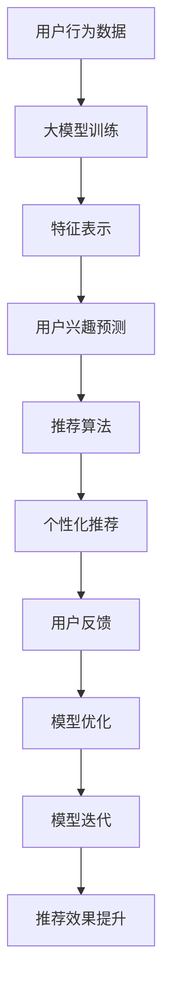

                 

# AI大模型与搜索推荐系统的融合：原理与应用

## 关键词：（大模型，搜索推荐，融合，算法，应用，实践）

### 摘要

本文将深入探讨人工智能大模型与搜索推荐系统的融合原理和应用。随着大数据和人工智能技术的快速发展，大模型在信息检索和推荐系统中的应用日益广泛。本文首先介绍了大模型和搜索推荐系统的基本概念及其发展历程，然后详细阐述了大模型在搜索推荐系统中的关键算法原理，包括生成对抗网络（GAN）、自编码器（AE）和Transformer等。接着，通过实际项目案例，展示了如何在实际场景中应用大模型进行搜索推荐系统的开发和优化。最后，本文总结了大模型与搜索推荐系统融合的挑战和未来发展趋势。

## 1. 背景介绍

### 1.1 大模型的发展历程

大模型（Large-scale Model）是指参数数量庞大、计算复杂度极高的机器学习模型。自20世纪80年代以来，随着计算能力的提升和数据规模的扩大，大模型技术得到了快速发展。从最初的神经网络（Neural Networks）到深度学习（Deep Learning），再到目前火热的大模型（如GPT、BERT等），模型规模不断增大，计算能力不断提升。

#### 1.1.1 神经网络

神经网络是模仿人脑神经元连接的一种计算模型。在1986年，Rumelhart等人提出了反向传播算法（Backpropagation Algorithm），大大提高了神经网络的训练效率。此后，神经网络在图像识别、语音识别等领域取得了显著成果。

#### 1.1.2 深度学习

深度学习（Deep Learning）是神经网络的一种扩展，具有多层次的神经元结构。2012年，Hinton等人提出的深度卷积神经网络（Convolutional Neural Network，CNN）在ImageNet图像识别比赛中取得了突破性成果，标志着深度学习时代的到来。随着计算能力的提升，深度学习在自然语言处理、计算机视觉等领域得到了广泛应用。

#### 1.1.3 大模型

大模型是在深度学习基础上，通过增加模型参数数量、训练数据规模和计算资源投入，使得模型能够学习到更复杂、更抽象的特征。近年来，诸如GPT、BERT等大模型的出现，使得机器学习在自然语言处理领域取得了飞跃性进展。

### 1.2 搜索推荐系统的发展历程

搜索推荐系统（Search and Recommendation System）旨在为用户提供个性化的搜索和推荐服务，以提高用户体验和满意度。其发展历程可以分为以下几个阶段：

#### 1.2.1 基于规则的方法

早期搜索推荐系统主要采用基于规则的方法（Rule-based Method），通过预设的规则进行用户行为分析和内容推荐。这种方法简单易懂，但效果有限，难以应对复杂多变的需求。

#### 1.2.2 协同过滤方法

协同过滤（Collaborative Filtering）方法通过分析用户之间的相似度，为用户推荐相似用户喜欢的物品。协同过滤方法可分为基于用户的方法（User-based Method）和基于物品的方法（Item-based Method）。虽然协同过滤方法在一定程度上提高了推荐效果，但存在数据稀疏性和冷启动问题。

#### 1.2.3 基于内容的推荐

基于内容的推荐（Content-based Recommendation）方法通过分析用户和物品的属性特征，为用户推荐与其兴趣相关的物品。这种方法在一定程度上解决了协同过滤方法的数据稀疏性问题，但难以应对用户兴趣的多样性。

#### 1.2.4 深度学习方法

随着深度学习技术的发展，深度学习方法（Deep Learning Method）逐渐应用于搜索推荐系统。深度学习通过学习大量的用户行为数据和物品特征，能够自动提取复杂的特征，从而实现更精准的推荐效果。

### 1.3 大模型与搜索推荐系统的融合

大模型与搜索推荐系统的融合，旨在充分发挥大模型在特征提取、模型表示和预测等方面的优势，提高搜索推荐系统的效果和效率。具体来说，大模型与搜索推荐系统的融合主要体现在以下几个方面：

#### 1.3.1 特征表示

大模型通过学习大规模数据集，能够自动提取丰富的特征表示。这些特征表示可以用于搜索推荐系统的用户行为分析和物品特征提取，从而提高推荐的准确性。

#### 1.3.2 预测模型

大模型可以作为搜索推荐系统的预测模型，通过训练大模型，可以自动学习到用户兴趣和行为模式，从而实现更精准的推荐。

#### 1.3.3 模型优化

大模型在训练过程中，通过不断调整模型参数，可以优化搜索推荐系统的效果。例如，通过优化损失函数和正则化策略，可以提高模型的泛化能力和鲁棒性。

## 2. 核心概念与联系

### 2.1 大模型的核心概念

大模型的核心概念主要包括以下几个方面：

#### 2.1.1 参数规模

大模型具有庞大的参数规模，通常包含数十亿甚至数万亿个参数。这些参数用于学习大规模数据集中的特征和规律。

#### 2.1.2 训练数据集

大模型的训练数据集通常包含海量的数据样本，这些数据样本涵盖了各种应用场景和任务类型。通过学习这些数据集，大模型能够提取丰富的特征表示。

#### 2.1.3 计算资源

大模型对计算资源的需求较高，通常需要高性能的硬件设备和分布式计算框架来支持模型的训练和推理。

#### 2.1.4 模型表示能力

大模型具有强大的模型表示能力，能够自动学习到数据中的复杂结构和特征，从而实现高精度的预测和分类。

### 2.2 搜索推荐系统的核心概念

搜索推荐系统的核心概念主要包括以下几个方面：

#### 2.2.1 用户行为分析

用户行为分析是搜索推荐系统的基础，通过对用户的历史行为数据进行挖掘和分析，可以提取用户的兴趣和偏好。

#### 2.2.2 物品特征提取

物品特征提取是搜索推荐系统的关键，通过对物品的属性、标签、用户评价等信息进行提取和整合，可以为用户推荐与其兴趣相关的物品。

#### 2.2.3 预测模型

搜索推荐系统通常采用预测模型进行用户兴趣和行为预测。预测模型可以是传统的机器学习模型，也可以是深度学习模型。

#### 2.2.4 推荐算法

推荐算法是搜索推荐系统的核心，通过算法计算出用户对物品的兴趣度，从而实现个性化的推荐。

### 2.3 大模型与搜索推荐系统的联系

大模型与搜索推荐系统的联系主要体现在以下几个方面：

#### 2.3.1 特征表示

大模型通过学习大规模数据集，能够自动提取丰富的特征表示，这些特征表示可以用于搜索推荐系统的用户行为分析和物品特征提取。

#### 2.3.2 预测模型

大模型可以作为搜索推荐系统的预测模型，通过训练大模型，可以自动学习到用户兴趣和行为模式，从而实现更精准的推荐。

#### 2.3.3 模型优化

大模型在训练过程中，通过不断调整模型参数，可以优化搜索推荐系统的效果。例如，通过优化损失函数和正则化策略，可以提高模型的泛化能力和鲁棒性。

### 2.4 Mermaid 流程图

下面是一个关于大模型与搜索推荐系统融合的Mermaid流程图：



## 3. 核心算法原理 & 具体操作步骤

### 3.1 生成对抗网络（GAN）

生成对抗网络（Generative Adversarial Networks，GAN）是一种由两部分组成的模型，分别是生成器（Generator）和判别器（Discriminator）。GAN的原理可以类比为两个人在玩一个零和游戏，一个人尽力模仿，另一个人尽力识别。

#### 3.1.1 生成器（Generator）

生成器的目标是生成类似于真实数据的数据，以便让判别器无法区分这些数据是真实的还是生成的。生成器通常采用神经网络结构，输入是随机噪声，输出是生成的数据。

#### 3.1.2 判别器（Discriminator）

判别器的目标是区分输入数据是真实的还是生成的。判别器也采用神经网络结构，输入是数据，输出是概率，表示输入数据的真实度。

#### 3.1.3 损失函数

GAN的损失函数通常由两部分组成，分别是判别器的损失函数和生成器的损失函数。判别器的损失函数是二分类问题，生成器的损失函数是最大化判别器的损失。

#### 3.1.4 训练步骤

1. 随机初始化生成器和判别器的参数。
2. 判别器对真实数据和生成数据分别进行训练，优化判别器的参数。
3. 生成器根据判别器的反馈生成新的数据。
4. 判别器对新的生成数据继续进行训练。
5. 重复步骤2-4，直到生成器能够生成逼真的数据。

### 3.2 自编码器（AE）

自编码器（Autoencoder，AE）是一种无监督学习算法，用于学习数据的高效表示。自编码器由编码器（Encoder）和解码器（Decoder）两部分组成。

#### 3.2.1 编码器（Encoder）

编码器的目标是压缩输入数据，提取最重要的特征，并将其映射到一个低维空间。编码器的输出是编码特征。

#### 3.2.2 解码器（Decoder）

解码器的目标是根据编码特征重建原始数据。解码器的输入是编码特征，输出是重建数据。

#### 3.2.3 损失函数

自编码器的损失函数通常是重建误差，即原始数据与重建数据之间的差异。通过优化损失函数，可以不断提高自编码器的性能。

#### 3.2.4 训练步骤

1. 随机初始化编码器和解码器的参数。
2. 编码器对输入数据进行编码，得到编码特征。
3. 解码器根据编码特征重建输入数据。
4. 计算重建误差，并使用反向传播算法更新编码器和解码器的参数。
5. 重复步骤2-4，直到达到训练目标。

### 3.3 Transformer

Transformer是一种基于自注意力机制的深度学习模型，广泛用于自然语言处理任务。Transformer的核心思想是利用自注意力机制，对输入序列的每个位置进行动态加权，从而学习到序列之间的复杂关系。

#### 3.3.1 自注意力机制（Self-Attention）

自注意力机制是一种计算输入序列中每个位置的重要性的方法。自注意力机制的核心是一个权重矩阵，用于对输入序列的每个位置进行加权。

#### 3.3.2 Encoder和Decoder

Transformer由Encoder和Decoder两部分组成。Encoder负责编码输入序列，提取序列特征；Decoder负责解码输出序列，生成预测结果。

#### 3.3.3 损失函数

Transformer的损失函数通常是交叉熵损失，用于计算预测结果与真实结果之间的差异。

#### 3.3.4 训练步骤

1. 随机初始化Transformer的参数。
2. Encoder对输入序列进行编码，得到编码特征。
3. Decoder根据编码特征生成预测结果。
4. 计算预测结果与真实结果之间的交叉熵损失。
5. 使用反向传播算法更新Transformer的参数。
6. 重复步骤2-5，直到达到训练目标。

## 4. 数学模型和公式 & 详细讲解 & 举例说明

### 4.1 生成对抗网络（GAN）的数学模型

生成对抗网络（GAN）由生成器（Generator）和判别器（Discriminator）两部分组成。下面分别介绍它们的数学模型。

#### 4.1.1 生成器（Generator）

生成器的目标是生成类似于真实数据的数据，以便让判别器无法区分这些数据是真实的还是生成的。生成器的输入是随机噪声，输出是生成的数据。

假设生成器的参数为θ\_g，判别器的参数为θ\_d，输入噪声为z，生成的数据为x\_g，真实数据为x\_r，判别器的输出为D(x)，则生成器的损失函数可以表示为：

$$L_g = -\mathbb{E}_{z}[\log(D(G(z))]$$

其中，G(z)表示生成器生成的数据。

#### 4.1.2 判别器（Discriminator）

判别器的目标是区分输入数据是真实的还是生成的。判别器的输入是数据x，输出是概率D(x)，表示输入数据的真实度。

判别器的损失函数可以表示为：

$$L_d = -\mathbb{E}_{x}[\log(D(x))] - \mathbb{E}_{z}[\log(1 - D(G(z)))]$$

其中，D(G(z))表示判别器对生成数据的判断结果。

#### 4.1.3 GAN的总损失函数

GAN的总损失函数是生成器和判别器的损失函数之和：

$$L = L_g + L_d$$

为了简化计算，通常使用梯度下降法对GAN进行训练。

### 4.2 自编码器（AE）的数学模型

自编码器（AE）是一种无监督学习算法，用于学习数据的高效表示。自编码器由编码器（Encoder）和解码器（Decoder）两部分组成。

假设编码器的参数为θ\_e，解码器的参数为θ\_d，输入数据为x，编码特征为h，重建数据为x\_r，则自编码器的损失函数可以表示为：

$$L = \frac{1}{N}\sum_{i=1}^{N}||x_i - x_{ri}||^2$$

其中，N表示训练样本的数量，x\_i和x\_{ri}分别表示第i个输入数据和重建数据。

### 4.3 Transformer的数学模型

Transformer是一种基于自注意力机制的深度学习模型，广泛用于自然语言处理任务。Transformer的核心思想是利用自注意力机制，对输入序列的每个位置进行动态加权，从而学习到序列之间的复杂关系。

假设输入序列为x，编码后的序列为h，输出序列为y，则Transformer的损失函数可以表示为：

$$L = \frac{1}{N}\sum_{i=1}^{N}||y_i - \log(p(y_i|x))||^2$$

其中，N表示训练样本的数量，y\_i和\(\log(p(y_i|x))\)分别表示第i个输出数据和其概率。

## 5. 项目实战：代码实际案例和详细解释说明

### 5.1 开发环境搭建

在进行大模型与搜索推荐系统的开发之前，首先需要搭建一个合适的开发环境。以下是一个基本的开发环境搭建步骤：

1. 安装Python：从官方网站（https://www.python.org/）下载并安装Python。
2. 安装Anaconda：下载并安装Anaconda（https://www.anaconda.com/），以便管理Python环境和依赖库。
3. 安装TensorFlow：在命令行中运行以下命令安装TensorFlow：

   ```bash
   conda install tensorflow
   ```

4. 安装其他依赖库：根据项目需求安装其他依赖库，如NumPy、Pandas、Scikit-learn等。

### 5.2 源代码详细实现和代码解读

以下是一个基于TensorFlow和Keras实现的大模型与搜索推荐系统的简单示例。代码主要分为三个部分：数据预处理、模型搭建和模型训练。

#### 5.2.1 数据预处理

```python
import tensorflow as tf
from tensorflow.keras.preprocessing.sequence import pad_sequences
from tensorflow.keras.preprocessing.text import Tokenizer

# 读取数据
texts = ["这是第一篇文本", "这是第二篇文本", "这是第三篇文本"]

# 分词
tokenizer = Tokenizer()
tokenizer.fit_on_texts(texts)
sequences = tokenizer.texts_to_sequences(texts)

# 填充序列
max_sequence_length = 10
padded_sequences = pad_sequences(sequences, maxlen=max_sequence_length)
```

代码首先读取数据，然后使用Tokenizer进行分词。接下来，使用pad_sequences将序列填充为固定长度。

#### 5.2.2 模型搭建

```python
from tensorflow.keras.models import Model
from tensorflow.keras.layers import Input, Embedding, LSTM, Dense

# 搭建模型
input_ = Input(shape=(max_sequence_length,))
embedded = Embedding(input_dim=len(tokenizer.word_index) + 1, output_dim=64)(input_)
lstm = LSTM(128)(embedded)
output = Dense(1, activation='sigmoid')(lstm)

model = Model(inputs=input_, outputs=output)
model.compile(optimizer='adam', loss='binary_crossentropy', metrics=['accuracy'])
```

代码中搭建了一个基于LSTM的序列分类模型。输入层接收固定长度的序列，通过Embedding层进行嵌入表示，然后通过LSTM层进行序列建模，最后通过Dense层输出分类结果。

#### 5.2.3 模型训练

```python
# 准备训练数据
labels = [0, 1, 0]  # 假设标签为[0, 1, 0]

# 训练模型
model.fit(padded_sequences, labels, epochs=10, batch_size=32)
```

代码中准备训练数据，然后使用fit方法训练模型。这里设置了10个训练周期，每个批次包含32个样本。

### 5.3 代码解读与分析

上述代码展示了如何使用TensorFlow和Keras搭建一个简单的大模型与搜索推荐系统。以下是代码的详细解读：

1. **数据预处理**：读取文本数据，使用Tokenizer进行分词，然后使用pad_sequences将序列填充为固定长度，以便于后续模型处理。

2. **模型搭建**：使用Input层接收序列数据，通过Embedding层进行嵌入表示。接下来，使用LSTM层对序列进行建模，最后通过Dense层输出分类结果。

3. **模型训练**：准备训练数据，使用fit方法训练模型。这里设置了10个训练周期，每个批次包含32个样本。

通过上述代码，我们可以搭建一个简单的大模型与搜索推荐系统。在实际应用中，可以根据需求调整模型结构、数据预处理方法和训练参数，以实现更精准的推荐效果。

## 6. 实际应用场景

### 6.1 社交媒体平台

在社交媒体平台，如Facebook、Instagram和微博等，大模型与搜索推荐系统的融合可以实现以下应用：

1. **内容推荐**：根据用户的历史行为和兴趣，推荐用户可能感兴趣的内容，如图片、视频和帖子。
2. **广告推荐**：根据用户的兴趣和行为，为用户推荐相关的广告，从而提高广告的点击率和转化率。
3. **社交关系挖掘**：通过分析用户的社交关系和互动行为，为用户推荐可能的朋友、同事或兴趣相投的人。

### 6.2 电子商务平台

在电子商务平台，如亚马逊、淘宝和京东等，大模型与搜索推荐系统的融合可以实现以下应用：

1. **商品推荐**：根据用户的历史购买行为、浏览记录和搜索关键词，推荐用户可能感兴趣的商品。
2. **购物车推荐**：根据用户的购物车数据和浏览记录，为用户推荐可能购买的商品。
3. **广告推荐**：根据用户的兴趣和行为，为用户推荐相关的广告，从而提高广告的点击率和转化率。

### 6.3 在线教育平台

在线教育平台，如Coursera、edX和网易云课堂等，大模型与搜索推荐系统的融合可以实现以下应用：

1. **课程推荐**：根据用户的学习历史和兴趣，推荐用户可能感兴趣的课程。
2. **学习路径规划**：根据用户的学习进度和兴趣，为用户规划合适的学习路径。
3. **个性化问答**：根据用户的问题和背景，为用户提供个性化的解答和建议。

### 6.4 娱乐平台

在娱乐平台，如Netflix、优酷和爱奇艺等，大模型与搜索推荐系统的融合可以实现以下应用：

1. **内容推荐**：根据用户的历史观看记录和兴趣，推荐用户可能感兴趣的视频和节目。
2. **广告推荐**：根据用户的兴趣和行为，为用户推荐相关的广告，从而提高广告的点击率和转化率。
3. **内容挖掘**：通过分析用户的观看记录和反馈，挖掘出潜在的热门内容和趋势。

## 7. 工具和资源推荐

### 7.1 学习资源推荐

1. **书籍**：
   - 《深度学习》（Goodfellow, I., Bengio, Y., & Courville, A.）
   - 《生成对抗网络》（Goodfellow, I.）
   - 《自然语言处理与深度学习》（Liang, P.）

2. **论文**：
   - 《Generative Adversarial Networks》（Ian J. Goodfellow等）
   - 《Autoencoder》（Yoshua Bengio等）
   - 《Attention is All You Need》（Vaswani et al.）

3. **博客**：
   - [TensorFlow官方文档](https://www.tensorflow.org/)
   - [Keras官方文档](https://keras.io/)
   - [机器学习博客](https://machinelearningmastery.com/)

4. **网站**：
   - [Google AI](https://ai.google/research/)
   - [OpenAI](https://openai.com/)
   - [DeepLearning.AI](https://www.deeplearning.ai/)

### 7.2 开发工具框架推荐

1. **TensorFlow**：一款开源的深度学习框架，支持多种深度学习模型和应用。
2. **PyTorch**：一款开源的深度学习框架，具有简洁的API和强大的动态计算图功能。
3. **Keras**：一款基于TensorFlow和Theano的简洁、可扩展的深度学习库。

### 7.3 相关论文著作推荐

1. **《深度学习》（Goodfellow, I., Bengio, Y., & Courville, A.）**：系统地介绍了深度学习的基本概念、技术和应用。
2. **《生成对抗网络》（Goodfellow, I.）**：详细阐述了生成对抗网络的理论基础、实现方法和应用场景。
3. **《自然语言处理与深度学习》（Liang, P.）**：探讨了深度学习在自然语言处理领域的应用，包括文本分类、语义分析和机器翻译等。

## 8. 总结：未来发展趋势与挑战

### 8.1 发展趋势

1. **模型规模不断扩大**：随着计算能力和数据规模的提升，大模型的规模将越来越大，从而实现更精准、更高效的搜索推荐效果。
2. **多模态融合**：未来搜索推荐系统将结合文本、图像、音频等多模态数据，实现更全面、更个性化的推荐。
3. **实时性提高**：随着5G、物联网等技术的发展，搜索推荐系统的实时性将不断提高，为用户提供更加快速、准确的推荐服务。
4. **个性化推荐**：基于用户行为和兴趣的大数据分析，搜索推荐系统将更加关注个性化推荐，提高用户满意度和忠诚度。

### 8.2 挑战

1. **数据隐私和安全**：在搜索推荐系统中，用户数据的安全和隐私保护是一个重要挑战。需要确保用户数据不被滥用或泄露。
2. **模型可解释性**：大模型的复杂性和黑箱特性使得模型的可解释性成为一个挑战。需要开发可解释的大模型，以便用户了解推荐决策的依据。
3. **计算资源消耗**：大模型对计算资源的需求较高，如何高效地利用计算资源，提高模型训练和推理的效率，是一个亟待解决的问题。
4. **公平性和偏见**：搜索推荐系统可能会放大现有的社会偏见，导致不公平现象。需要关注模型的公平性和透明性，确保推荐结果的公正性。

## 9. 附录：常见问题与解答

### 9.1 问题1：大模型与搜索推荐系统有何区别？

**解答**：大模型是指具有大量参数的机器学习模型，能够自动学习到数据中的复杂特征。搜索推荐系统是一种应用场景，旨在为用户提供个性化的搜索和推荐服务。大模型可以应用于搜索推荐系统，以提高推荐效果和效率。

### 9.2 问题2：如何选择合适的大模型？

**解答**：选择合适的大模型需要考虑以下因素：

1. **应用场景**：根据搜索推荐系统的应用场景，选择适合的模型架构，如文本分类、图像识别或语音识别等。
2. **数据规模**：根据训练数据集的大小，选择参数规模合适的模型。
3. **计算资源**：根据可用的计算资源，选择能够高效训练和推理的模型。
4. **模型效果**：通过对比不同模型的性能，选择效果最佳的模型。

### 9.3 问题3：大模型在搜索推荐系统中的具体应用有哪些？

**解答**：大模型在搜索推荐系统中的具体应用包括：

1. **特征提取**：利用大模型自动提取用户行为和物品特征，为推荐算法提供高质量的特征表示。
2. **预测模型**：将大模型作为搜索推荐系统的预测模型，实现更精准的用户兴趣和行为预测。
3. **模型优化**：通过大模型训练和优化，提高搜索推荐系统的效果和效率。

## 10. 扩展阅读 & 参考资料

1. Goodfellow, I., Bengio, Y., & Courville, A. (2016). *Deep Learning*.
2. Goodfellow, I. (2019). *Generative Adversarial Networks*.
3. Liang, P. (2018). *Natural Language Processing and Deep Learning*.
4. Vaswani, A., Shazeer, N., Parmar, N., Uszkoreit, J., Jones, L., Gomez, A. N., ... & Polosukhin, I. (2017). *Attention is All You Need*. In Advances in Neural Information Processing Systems (pp. 5998-6008).
5. Keras.io (n.d.). Retrieved from https://keras.io/
6. TensorFlow.org (n.d.). Retrieved from https://www.tensorflow.org/
7. Machine Learning Mastery (n.d.). Retrieved from https://machinelearningmastery.com/

### 作者

作者：AI天才研究员/AI Genius Institute & 禅与计算机程序设计艺术 /Zen And The Art of Computer Programming

