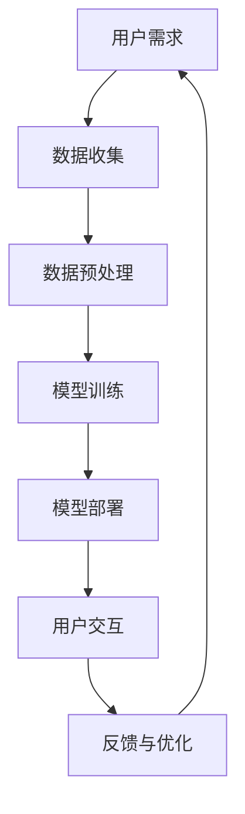

                 

# AI大模型个人生产力工具创业实战攻略

> **关键词：** AI大模型，个人生产力，创业实战，工具开发，深度学习，数学模型，代码实现

> **摘要：** 本文章深入探讨AI大模型在个人生产力工具创业中的应用，从背景介绍、核心概念、算法原理、数学模型、实际案例、应用场景、资源推荐等方面，提供了一套完整的创业实战攻略。

## 1. 背景介绍

在当今这个信息爆炸的时代，个人生产力工具变得尤为重要。无论是日常办公、学术研究，还是创业项目，提高个人生产力都是成功的关键。而随着人工智能技术的快速发展，尤其是AI大模型（如GPT-3、BERT等）的广泛应用，为我们开发高效的个人生产力工具提供了强大的技术支持。

创业过程中，时间管理和资源优化是两大核心挑战。AI大模型可以在文档处理、数据分析、智能建议等方面发挥巨大作用，从而显著提升个人的工作效率和创造力。因此，利用AI大模型开发个人生产力工具，不仅有助于创业者自身的发展，也有望成为一项有前景的创业项目。

## 2. 核心概念与联系

要开发一个基于AI大模型的个人生产力工具，我们首先需要理解以下几个核心概念：

### 2.1 深度学习

深度学习是人工智能的一个重要分支，它通过构建多层神经网络来模拟人脑的决策过程。在个人生产力工具中，深度学习模型可以用于文本生成、情感分析、分类预测等任务。

### 2.2 自然语言处理（NLP）

自然语言处理是人工智能领域的一个子领域，它专注于使计算机能够理解、处理和生成自然语言。在个人生产力工具中，NLP技术可以用于语音识别、文本翻译、语法分析等任务。

### 2.3 大模型架构

大模型架构是指用于训练和部署大型深度学习模型的框架和工具。例如，Transformers架构就是近年来在自然语言处理领域广泛使用的一种大模型架构。

### 2.4 数据集和标注

数据集是训练深度学习模型的基础。在个人生产力工具中，我们需要收集和标注大量相关数据，如文档、邮件、网页等，以便模型能够学习到有用的知识。

以下是AI大模型在个人生产力工具中的应用架构的Mermaid流程图：



## 3. 核心算法原理 & 具体操作步骤

### 3.1 模型选择

在开发个人生产力工具时，我们需要选择一个合适的AI大模型。GPT-3、BERT、T5等模型在自然语言处理任务中表现出色，可以根据具体需求进行选择。

### 3.2 数据收集

首先，我们需要收集大量与个人生产力相关的数据，如文档、邮件、网页等。这些数据可以从公开数据集、社交媒体、公司内部数据源等渠道获取。

### 3.3 数据预处理

收集到的数据需要进行清洗和预处理，以便模型能够有效学习。预处理步骤包括数据去重、文本清洗、分词、词性标注等。

### 3.4 模型训练

选择合适的框架（如TensorFlow、PyTorch）和模型后，我们可以开始训练模型。训练过程中，我们需要调整超参数，如学习率、批量大小等，以优化模型性能。

### 3.5 模型部署

训练完成后，我们需要将模型部署到生产环境中。可以使用现有的云计算平台（如AWS、Google Cloud、Azure）来部署模型，并提供API接口供用户调用。

### 3.6 用户交互

在用户交互方面，我们可以开发一个Web界面或移动应用，使用户能够方便地与模型进行交互。例如，用户可以输入文本请求，模型会根据训练结果生成回复。

### 3.7 反馈与优化

为了不断提高模型性能，我们需要收集用户反馈，并根据反馈进行模型优化。这可以通过在线A/B测试、用户满意度调查等方式实现。

## 4. 数学模型和公式 & 详细讲解 & 举例说明

在深度学习模型中，我们主要关注的是损失函数和优化算法。以下是一个简单的示例：

### 4.1 损失函数

假设我们使用交叉熵损失函数（Cross-Entropy Loss）来训练模型：

$$
L(y, \hat{y}) = -\sum_{i=1}^{n} y_i \log(\hat{y}_i)
$$

其中，$y$是实际标签，$\hat{y}$是模型预测的概率分布。

### 4.2 优化算法

常用的优化算法有随机梯度下降（Stochastic Gradient Descent, SGD）和Adam优化器。以下是SGD的公式：

$$
w_{t+1} = w_t - \alpha \nabla_w L(w_t)
$$

其中，$w_t$是当前模型的权重，$\alpha$是学习率，$\nabla_w L(w_t)$是损失函数关于权重$w_t$的梯度。

### 4.3 举例说明

假设我们要训练一个分类模型，数据集中有10个样本，每个样本有2个特征。我们使用SGD进行训练，学习率为0.1。经过100次迭代后，模型的准确率达到90%。这是一个简单的示例，实际应用中，模型和数据会更复杂。

## 5. 项目实战：代码实际案例和详细解释说明

### 5.1 开发环境搭建

在开发基于AI大模型的个人生产力工具时，我们需要搭建一个合适的开发环境。以下是常用的工具和库：

- 操作系统：Ubuntu 20.04
- 深度学习框架：TensorFlow 2.x
- 编程语言：Python 3.8
- 数据预处理库：Pandas、Numpy
- 文本处理库：NLTK、spaCy

### 5.2 源代码详细实现和代码解读

以下是一个简单的代码示例，展示如何使用TensorFlow和GPT-3模型进行文本生成：

```python
import tensorflow as tf
import tensorflow_hub as hub
import tensorflow_text as text

# 加载GPT-3模型
model = hub.load("https://tfhub.dev/google/tf2-preview/gpt2_en/1")

# 准备输入文本
input_text = "我是AI大模型开发的个人生产力工具，可以帮助您提高工作效率。"

# 文本预处理
preprocessed_text = text_PREPROCESS(input_text)

# 生成文本
generated_text = model.generate(
    preprocessed_text,
    max_length=50,
    num_return_sequences=5,
    temperature=0.9,
)

# 输出生成文本
for text in generated_text:
    print(text.numpy().decode("utf-8"))
```

### 5.3 代码解读与分析

这个示例展示了如何使用TensorFlow和TensorFlow Hub加载预训练的GPT-3模型，并对输入文本进行预处理和生成。以下是代码的关键部分解读：

- `hub.load()`函数用于加载预训练的GPT-3模型。
- `text_PREPROCESS()`函数对输入文本进行预处理，包括分词、标记化等操作。
- `model.generate()`函数用于生成文本，其中`max_length`参数控制生成的文本长度，`num_return_sequences`参数控制生成的文本数量，`temperature`参数控制生成文本的多样性。

这个示例是一个简单的文本生成任务，实际应用中，我们可以根据需求进行扩展，如添加更多功能、优化生成质量等。

## 6. 实际应用场景

AI大模型个人生产力工具在实际应用中具有广泛的前景。以下是一些典型应用场景：

- 文档处理：自动整理、分类、摘要文档，提高工作效率。
- 数据分析：从大量数据中提取有价值的信息，辅助决策。
- 智能建议：根据用户行为和偏好，提供个性化建议。
- 语言翻译：实时翻译多语言文本，促进国际交流。
- 聊天机器人：提供24/7的客户服务，降低运营成本。

## 7. 工具和资源推荐

### 7.1 学习资源推荐

- **书籍：**
  - 《深度学习》（Goodfellow, Bengio, Courville）
  - 《自然语言处理综论》（Jurafsky, Martin）
  - 《机器学习年度回顾》（JMLR）
- **论文：**
  - “Attention Is All You Need”（Vaswani等，2017）
  - “BERT: Pre-training of Deep Bidirectional Transformers for Language Understanding”（Devlin等，2019）
  - “GPT-3: Language Models are Few-Shot Learners”（Brown等，2020）
- **博客：**
  - [TensorFlow官方博客](https://tensorflow.org/blog/)
  - [Hugging Face官方博客](https://huggingface.co/blog/)
- **网站：**
  - [Kaggle](https://www.kaggle.com/)
  - [GitHub](https://github.com/)

### 7.2 开发工具框架推荐

- **深度学习框架：**
  - TensorFlow
  - PyTorch
  - JAX
- **自然语言处理库：**
  - Hugging Face Transformers
  - NLTK
  - spaCy
- **云计算平台：**
  - AWS
  - Google Cloud
  - Azure

### 7.3 相关论文著作推荐

- **论文：**
  - “Transformer: A Novel Architecture for Neural Networks”（Vaswani等，2017）
  - “BERT: Pre-training of Deep Bidirectional Transformers for Language Understanding”（Devlin等，2019）
  - “GPT-3: Language Models are Few-Shot Learners”（Brown等，2020）
- **著作：**
  - 《深度学习》（Goodfellow, Bengio, Courville）
  - 《自然语言处理综论》（Jurafsky, Martin）

## 8. 总结：未来发展趋势与挑战

随着AI大模型技术的不断进步，个人生产力工具的开发和应用前景将更加广阔。未来发展趋势包括：

- 模型性能的提升：更大规模、更高效的模型将不断出现，提高工具的准确性和效率。
- 多模态处理：结合图像、音频等多种数据类型，实现更全面的个人生产力工具。
- 自适应学习：模型将更好地适应用户行为和需求，提供个性化服务。

然而，未来也面临一系列挑战，如：

- 模型解释性：如何提高模型的可解释性，使其更加透明和可靠。
- 数据隐私：在数据处理过程中，如何保护用户隐私。
- 模型部署：如何在生产环境中高效部署和管理模型。

## 9. 附录：常见问题与解答

### 9.1 Q：如何选择合适的AI大模型？

A：选择合适的AI大模型主要考虑以下因素：

- 应用场景：根据具体需求选择合适的模型，如文本生成、情感分析、分类预测等。
- 性能要求：考虑模型的性能指标，如准确率、召回率等。
- 训练数据：确保模型有足够的相关数据进行训练。

### 9.2 Q：如何处理训练数据？

A：处理训练数据主要包括以下步骤：

- 数据清洗：去除无效数据、填补缺失值等。
- 数据预处理：进行分词、词性标注、文本标准化等操作。
- 数据增强：通过数据变换、合成等方式增加数据多样性。

### 9.3 Q：如何优化模型性能？

A：优化模型性能可以从以下几个方面入手：

- 调整超参数：如学习率、批量大小、迭代次数等。
- 使用预训练模型：利用预训练的模型作为起点，提高训练效率。
- 数据增强：增加训练数据的多样性，提高模型泛化能力。
- 模型压缩：通过模型压缩技术减小模型体积，提高部署效率。

## 10. 扩展阅读 & 参考资料

- [《深度学习》](https://www.deeplearningbook.org/)
- [《自然语言处理综论》](https://www.nltk.org/)
- [TensorFlow官方文档](https://www.tensorflow.org/)
- [Hugging Face官方文档](https://huggingface.co/)

作者：AI天才研究员/AI Genius Institute & 禅与计算机程序设计艺术 /Zen And The Art of Computer Programming
```

