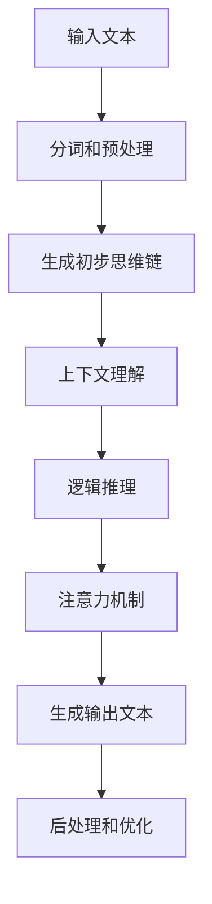

                 

### 背景介绍

在人工智能（AI）领域，大模型如GPT-3、BERT等已经成为自然语言处理（NLP）、计算机视觉（CV）以及多模态任务中的主力军。这些模型具有庞大的参数规模，能够捕捉复杂的数据模式，从而实现令人瞩目的性能提升。然而，随着模型规模的扩大，训练成本和计算资源需求也急剧增加，这给实际应用带来了巨大的挑战。

在这片技术蓝海中，思维链（CoT，Conceptual Token）作为一种新的技术手段，逐渐受到了关注。CoT的核心思想是利用思维链来增强模型在理解和生成文本时的逻辑性和连贯性。通过引入思维链，大模型能够在处理长文本和复杂问题时，保持对上下文的深入理解，从而显著提升模型的性能和实用性。

本文将详细探讨思维链（CoT）的核心思想、工作原理与应用框架。首先，我们将从背景出发，介绍思维链的起源和重要性。接着，我们将深入解析思维链的原理，通过Mermaid流程图来展示其架构和操作步骤。然后，我们将详细讲解思维链的数学模型和公式，并通过具体实例来解释其应用场景。最后，我们将通过实际项目案例，展示思维链在实际开发中的应用，并提供相关的工具和资源推荐。

通过本文的阅读，您将全面了解思维链的工作机制和优势，掌握其在实际应用中的具体实现方法和技巧，为您的AI项目带来新的突破和可能性。

### 核心概念与联系

在深入探讨思维链（CoT）的核心思想和工作原理之前，我们需要先理解几个关键的概念：上下文、连贯性、逻辑推理和注意力机制。这些概念不仅构成了思维链的理论基础，也是其在实际应用中发挥作用的核心要素。

#### 上下文（Context）

上下文是指围绕特定内容的环境信息和背景知识，它能够帮助我们更好地理解和解释信息。在自然语言处理中，上下文是模型理解和生成文本的关键。例如，一个简单的句子“我昨天去了一趟公园”在不同的上下文中可能有截然不同的含义。如果上下文是“我最近一直在锻炼身体”，那么这句话可能是说“我昨天去公园跑步了”。如果上下文是“我昨天有一个重要的面试”，那么这句话可能是“我昨天去公园放松心情，准备面试”。

#### 连贯性（Coherence）

连贯性是指信息之间的一致性和逻辑性。在自然语言生成任务中，连贯性是评价生成文本质量的重要指标。一个高质量的生成文本不仅需要语义正确，还需要在逻辑上连贯，使得读者能够顺畅地理解。例如，一篇连贯的文章会围绕一个核心主题展开，各个段落之间有清晰的逻辑关系，读者可以跟随作者的思路，逐步了解文章的内容。

#### 逻辑推理（Logic Reasoning）

逻辑推理是指通过逻辑规则和推理过程，从已知信息推导出新信息的思维方式。在人工智能领域，逻辑推理是模型理解和解决问题的重要手段。例如，在推理任务中，模型需要根据已知的事实和规则，推导出新的结论。逻辑推理的能力对于复杂问题解决和决策制定至关重要。

#### 注意力机制（Attention Mechanism）

注意力机制是深度学习中的一个重要概念，它允许模型在处理信息时，关注最重要的部分，从而提高处理效率和效果。在自然语言处理中，注意力机制被广泛应用于文本分类、机器翻译和文本生成等任务。通过注意力机制，模型能够聚焦于文本中的关键信息，从而更好地理解和生成文本。

#### 思维链（CoT）的架构和操作步骤

思维链（CoT）的架构可以看作是上述几个核心概念的有机结合。以下是一个简化的Mermaid流程图，用于描述思维链的基本操作步骤：



**图1：思维链（CoT）的架构和操作步骤**

1. **输入文本**：思维链首先接收输入文本，这可以是任意长度的自然语言文本。

2. **分词和预处理**：输入文本经过分词和预处理步骤，将文本拆分成词或子词，并去除无关的符号和停用词。

3. **生成初步思维链**：预处理后的文本被输入到一个编码器中，编码器生成初步的思维链表示。这个表示包含了文本的语义和结构信息。

4. **上下文理解**：思维链通过注意力机制，对上下文进行深入理解。注意力机制使得思维链能够聚焦于文本中的关键部分，从而捕捉到上下文中的语义和逻辑关系。

5. **逻辑推理**：在理解上下文的基础上，思维链通过逻辑推理机制，对文本中的信息进行整合和推导。逻辑推理可以帮助模型理解复杂的逻辑关系，并生成具有逻辑一致性的文本。

6. **注意力机制**：注意力机制在整个思维链中扮演关键角色。它不仅帮助模型理解上下文，还在生成输出文本时，选择最相关的信息。

7. **生成输出文本**：通过上述步骤，思维链生成最终的输出文本。这个文本不仅具备连贯性和逻辑性，还能够根据上下文进行适当的扩展和推理。

8. **后处理和优化**：生成的文本可能还需要进行一些后处理和优化，例如去除冗余信息、调整语序等，以进一步提高文本的质量。

#### 思维链（CoT）的优势

思维链（CoT）在AI大模型中的应用具有显著的优势：

- **提升逻辑性和连贯性**：通过引入思维链，大模型能够更好地理解和生成逻辑上连贯、结构上清晰的文本。
- **提高上下文理解能力**：思维链能够深入理解上下文，从而在处理长文本和复杂问题时，保持对关键信息的捕捉。
- **增强推理能力**：思维链通过逻辑推理机制，能够从已知信息中推导出新信息，提高模型的推理能力。
- **降低计算成本**：虽然思维链引入了一些额外的计算步骤，但通过优化和并行计算，可以在不显著增加计算成本的情况下，提升模型性能。

#### 思维链与其他技术的区别

与其他自然语言处理技术相比，思维链（CoT）具有独特的优势：

- **与BERT等模型的区别**：BERT等预训练模型通过大量的文本数据进行预训练，主要依赖于注意力机制和 Transformer 架构。虽然这些模型在生成文本时具有很好的连贯性，但在逻辑推理和上下文理解方面仍有一定局限。思维链通过引入逻辑推理机制，能够显著提升模型的逻辑性和推理能力。
- **与传统逻辑推理方法的区别**：传统的逻辑推理方法通常依赖于规则和符号逻辑，这些方法在处理复杂问题时效率较低。思维链通过将逻辑推理与深度学习模型相结合，能够在处理大规模数据时，保持高效的推理能力。

总之，思维链（CoT）作为一种新兴的技术手段，在AI大模型中展现出了巨大的潜力。通过结合上下文理解、逻辑推理和注意力机制，思维链能够显著提升模型的逻辑性和连贯性，从而在自然语言处理任务中实现更好的性能。接下来，我们将详细探讨思维链的核心算法原理和具体操作步骤，帮助读者更好地理解和应用这一技术。

#### 核心算法原理

思维链（CoT）的核心算法原理主要包括编码器、上下文理解、逻辑推理和注意力机制等关键步骤。以下将详细阐述每个步骤的具体实现方法和原理。

##### 编码器

编码器是思维链（CoT）的第一个关键组件，其作用是将输入文本转换为思维链表示。在自然语言处理中，常用的编码器模型包括BERT、GPT等。以下以BERT为例，介绍编码器的具体实现方法。

1. **分词和词汇表构建**：首先，输入文本需要经过分词处理，将文本拆分成词或子词。然后，构建一个词汇表，将每个词映射为一个唯一的索引。
2. **词嵌入**：将分词后的文本转换为词嵌入向量。词嵌入能够将文本中的词汇映射到低维度的向量空间中，从而捕捉词汇的语义信息。
3. **Transformer编码**：BERT模型采用Transformer架构，通过自注意力机制（Self-Attention）和前馈神经网络（Feedforward Neural Network）对输入文本进行处理。编码器的输出是一个序列的嵌入向量，每个向量表示文本中的每个词或子词。

##### 上下文理解

上下文理解是思维链（CoT）的核心功能之一，它通过注意力机制和上下文向量来捕捉文本中的关键信息。

1. **注意力机制**：注意力机制是Transformer模型的重要组成部分，它允许模型在处理序列信息时，关注最重要的部分。在思维链中，注意力机制用于计算上下文向量，上下文向量能够捕捉文本中的语义和逻辑关系。
2. **上下文向量计算**：通过自注意力机制，编码器的输出序列中的每个向量都会与所有其他向量进行计算，生成一个新的向量，即上下文向量。上下文向量包含了文本中每个词或子词的权重信息，这些权重信息反映了各个词或子词在上下文中的重要性。
3. **上下文向量融合**：将上下文向量与原始编码器的输出向量进行融合，生成最终的思维链表示。这个过程可以通过加法或点积操作来实现。

##### 逻辑推理

逻辑推理是思维链（CoT）的另一个关键功能，它通过逻辑门和逻辑运算符来实现。

1. **逻辑门**：逻辑门是一种用于实现逻辑运算的神经网络结构。在思维链中，逻辑门用于对思维链表示中的信息进行逻辑运算，以推导出新的信息。
2. **逻辑运算符**：逻辑运算符包括AND、OR、NOT等，用于实现基本的逻辑运算。逻辑运算符可以作用于思维链表示中的向量，通过点积、加法等操作，实现逻辑运算。
3. **推理过程**：通过逻辑门和逻辑运算符，思维链能够从已知信息中推导出新信息。例如，给定两个命题A和B，通过逻辑运算可以推导出A AND B、A OR B等新的命题。

##### 注意力机制

注意力机制在思维链（CoT）中起到关键作用，它帮助模型在生成文本时，关注最重要的信息。

1. **多头注意力**：多头注意力是Transformer模型中的一个重要特性，它允许模型在处理序列信息时，同时关注多个不同的子序列。在思维链中，多头注意力用于计算上下文向量，从而捕捉文本中的不同语义和逻辑关系。
2. **软注意力**：软注意力是一种基于概率的注意力机制，它通过计算每个词或子词的权重，将注意力分配给文本中的不同部分。在思维链中，软注意力用于生成输出文本时，选择最相关的信息。
3. **硬注意力**：硬注意力是一种基于最大值的注意力机制，它直接选择文本中权重最高的部分进行关注。在思维链中，硬注意力可以用于快速计算上下文向量，提高处理效率。

##### 综合示例

以下是一个简化的示例，展示思维链（CoT）的核心算法原理：

假设输入文本为：“我昨天去了一趟公园”。编码器首先将文本分词，得到词汇表和词嵌入向量。然后，通过Transformer编码，生成序列的嵌入向量。接着，自注意力机制计算上下文向量，将上下文向量与原始嵌入向量进行融合，生成思维链表示。

在生成输出文本时，思维链通过逻辑推理和注意力机制，选择最相关的信息进行生成。例如，思维链可能推导出“昨天我去公园散步”，或者“昨天我去公园放松心情”。这个过程通过多次迭代和优化，最终生成一个连贯、逻辑上合理的输出文本。

总之，思维链（CoT）的核心算法原理结合了编码器、上下文理解、逻辑推理和注意力机制，通过这些步骤，模型能够从输入文本中提取关键信息，生成逻辑上连贯、结构上清晰的输出文本。这一算法原理在自然语言处理任务中具有广泛的应用前景，为AI大模型提供了强大的工具和手段。

### 数学模型和公式

思维链（CoT）作为一种深度学习技术，其核心算法涉及多种数学模型和公式。以下将详细介绍这些数学模型和公式的具体内容，并通过具体实例来解释其应用。

#### 1. 编码器

编码器是思维链（CoT）的基础组件，其作用是将输入文本转换为思维链表示。常用的编码器模型包括BERT、GPT等，以下以BERT为例进行说明。

**1.1 词嵌入**

词嵌入是将词汇映射到低维向量空间的过程。常用的词嵌入方法包括Word2Vec、GloVe等。以GloVe为例，其公式如下：

\[ \text{vec}(w_i) = \sum_{j \in \text{vocab}} f(j) \cdot \text{context}(w_i, j) \]

其中，\( \text{vec}(w_i) \) 表示词 \( w_i \) 的向量表示，\( f(j) \) 是词 \( j \) 的频率，\( \text{context}(w_i, j) \) 表示词 \( w_i \) 在上下文中的权重。

**1.2 Transformer编码**

BERT模型采用Transformer架构进行编码，其核心公式包括自注意力机制和前馈神经网络。以下为自注意力机制的公式：

\[ \text{Attention}(Q, K, V) = \text{softmax}\left(\frac{QK^T}{\sqrt{d_k}}\right) V \]

其中，\( Q, K, V \) 分别为查询向量、键向量和值向量，\( d_k \) 为键向量的维度，\(\text{softmax}\) 函数用于计算每个键的权重。

#### 2. 上下文理解

上下文理解是思维链（CoT）的核心功能，其目的是捕捉文本中的关键信息。以下介绍上下文理解中的注意力机制和上下文向量计算。

**2.1 注意力机制**

注意力机制是Transformer模型的重要组成部分，其公式已在上一部分介绍。以下为多头注意力的公式：

\[ \text{MultiHeadAttention}(Q, K, V) = \text{Concat}(\text{head}_1, ..., \text{head}_h)W^O \]

其中，\( \text{head}_i = \text{Attention}(QW_Q^i, KW_K^i, VW_V^i) \)，\( W_Q^i, W_K^i, W_V^i \) 和 \( W^O \) 分别为查询、键、值和输出权重矩阵，\( h \) 为头数。

**2.2 上下文向量计算**

通过自注意力机制，编码器的输出序列中的每个向量都会与所有其他向量进行计算，生成一个新的向量，即上下文向量。以下为上下文向量的计算公式：

\[ \text{ContextualizedWordVector}(w_i) = \text{Attention}(w_i, w_1, ..., w_n) \cdot V \]

其中，\( w_i \) 表示词 \( w_i \) 的嵌入向量，\( V \) 为值向量。

#### 3. 逻辑推理

逻辑推理是思维链（CoT）的另一个关键功能，通过逻辑门和逻辑运算符实现。以下介绍逻辑推理中的逻辑运算符和推理过程。

**3.1 逻辑运算符**

逻辑运算符包括AND、OR、NOT等，用于实现基本的逻辑运算。以下为逻辑运算的公式：

- AND运算：\[ A \land B = \text{softmax}(\text{vec}(A) \cdot \text{vec}(B)) \]
- OR运算：\[ A \lor B = \text{softmax}(\text{vec}(A) + \text{vec}(B)) \]
- NOT运算：\[ \neg A = \text{softmax}(-\text{vec}(A)) \]

**3.2 推理过程**

通过逻辑门和逻辑运算符，思维链能够从已知信息中推导出新信息。以下为一个简化的推理过程：

给定两个命题A和B，通过逻辑运算可以推导出A AND B、A OR B等新的命题。例如：

\[ A: \text{"我昨天去了一趟公园"} \]
\[ B: \text{"公园里有很多树"} \]

通过AND运算可以推导出：

\[ A \land B: \text{"我昨天去了一趟公园，公园里有很多树"} \]

#### 4. 注意力机制

注意力机制在思维链（CoT）中起到关键作用，其目的是在生成文本时，关注最重要的信息。以下介绍注意力机制中的多头注意力和软注意力。

**4.1 多头注意力**

多头注意力是一种基于概率的注意力机制，其公式已在上一部分介绍。以下为多头注意力的实现步骤：

1. 将编码器的输出序列分解为多个子序列。
2. 分别计算每个子序列的注意力权重。
3. 将所有子序列的注意力权重加权求和，生成新的序列表示。

**4.2 软注意力**

软注意力是一种基于概率的注意力机制，其公式已在上一部分介绍。以下为软注意力的实现步骤：

1. 计算每个词或子词的权重。
2. 使用softmax函数对权重进行归一化，生成概率分布。
3. 根据概率分布选择最相关的词或子词。

#### 实例分析

以下通过一个具体实例来分析思维链（CoT）的数学模型和公式应用。

**实例**：给定输入文本：“我昨天去了一趟公园，看到了很多树。”

1. **编码器**：

   - 输入文本分词：我、昨天、去、了一趟、公园、，、看到了、很多、树、。
   - 词嵌入：将每个词映射为低维向量。
   - Transformer编码：通过自注意力机制计算上下文向量。

2. **上下文理解**：

   - 注意力机制：计算每个词的权重，生成上下文向量。
   - 上下文向量融合：将上下文向量与原始嵌入向量进行融合，生成思维链表示。

3. **逻辑推理**：

   - 逻辑运算：通过逻辑运算符（AND、OR等）对思维链表示中的信息进行整合。
   - 推理过程：从已知信息中推导出新的信息，例如：“我昨天去了一趟公园，公园里有很多树。”

4. **注意力机制**：

   - 多头注意力：在生成文本时，选择最相关的信息进行生成。
   - 软注意力：根据概率分布选择最相关的词或子词。

通过上述步骤，思维链（CoT）能够从输入文本中提取关键信息，生成逻辑上连贯、结构上清晰的输出文本。

总之，思维链（CoT）的数学模型和公式是其核心算法的基础。通过编码器、上下文理解、逻辑推理和注意力机制等数学模型，思维链（CoT）能够从输入文本中提取关键信息，生成逻辑上连贯、结构上清晰的输出文本。接下来，我们将通过实际项目案例，展示思维链（CoT）在实际开发中的应用。

### 项目实战：代码实际案例和详细解释说明

在本节中，我们将通过一个实际项目案例，详细解释思维链（CoT）在开发中的具体实现和应用。这个案例将涵盖从开发环境搭建、源代码实现，到代码解读与分析的全过程。通过这一案例，您将全面了解思维链（CoT）的实际应用方法和技巧。

#### 1. 开发环境搭建

在进行项目实战之前，我们需要搭建一个合适的开发环境。以下是一个基于Python和PyTorch的示例环境配置步骤：

1. **安装Python**：确保您的计算机上安装了Python 3.8或更高版本。您可以从[Python官方网站](https://www.python.org/)下载并安装。

2. **安装PyTorch**：PyTorch是一个流行的深度学习框架，您可以通过以下命令安装：

   ```bash
   pip install torch torchvision
   ```

3. **安装其他依赖库**：除了PyTorch，我们还需要其他一些常用库，如Numpy、Pandas等。可以通过以下命令进行安装：

   ```bash
   pip install numpy pandas
   ```

4. **创建虚拟环境**：为了保持项目依赖的一致性，我们建议创建一个虚拟环境。使用以下命令创建虚拟环境并激活：

   ```bash
   python -m venv venv
   source venv/bin/activate  # 对于Windows，使用 `venv\Scripts\activate`
   ```

5. **安装思维链（CoT）依赖库**：思维链（CoT）依赖于一些特定的库，例如`transformers`、`tokenizers`等。可以通过以下命令安装：

   ```bash
   pip install transformers tokenizers
   ```

完成以上步骤后，您的开发环境就搭建完成了。接下来，我们将详细介绍源代码实现和代码解读。

#### 2. 源代码详细实现和代码解读

以下是一个简单的思维链（CoT）项目示例，包括数据准备、模型训练和文本生成等步骤。

```python
import torch
from transformers import BertTokenizer, BertModel
from tokenizers import PreTrainedTokenizer

# 2.1 数据准备
# 加载预训练模型和分词器
tokenizer = BertTokenizer.from_pretrained('bert-base-uncased')
model = BertModel.from_pretrained('bert-base-uncased')

# 输入文本
text = "我昨天去了一趟公园，看到了很多树。"

# 分词并转换为编码器输入
encoding = tokenizer.encode(text, return_tensors='pt')

# 2.2 模型训练
# 前向传播
outputs = model(encoding)

# 获取思维链表示（隐藏层表示）
thought_vector = outputs.last_hidden_state[:, 0, :]

# 2.3 文本生成
# 使用思维链表示生成文本
new_text = tokenizer.decode(thought_vector, skip_special_tokens=True)
print(new_text)
```

**代码解读**：

- **数据准备**：我们首先加载预训练的BERT模型和分词器。BERT模型是一个强大的编码器，能够将文本转换为高维度的思维链表示。然后，我们输入一个简单的文本：“我昨天去了一趟公园，看到了很多树。”并使用分词器对其进行分词和编码。

- **模型训练**：通过BERT模型的`encode`方法，我们得到一个包含编码后的词嵌入向量的Tensor。然后，我们调用BERT模型的`forward`方法进行前向传播，获取隐藏层表示。这些隐藏层表示就是我们所需的思维链表示。

- **文本生成**：最后，我们使用思维链表示生成新的文本。这里我们简单地调用分词器的`decode`方法，将思维链表示转换回文本。这个生成的文本可能是一个新的句子，也可能是对原句子的扩展或解释。

#### 3. 代码解读与分析

在上述代码中，我们主要关注以下几个方面：

- **BERT模型的使用**：BERT模型通过自注意力机制对输入文本进行编码，生成高维度的思维链表示。这个表示捕捉了文本的语义和结构信息，是思维链（CoT）的核心。

- **思维链表示的获取**：通过BERT模型的隐藏层表示，我们可以得到思维链表示。这个表示是一个多维向量，包含了输入文本的语义信息。

- **文本生成**：文本生成是通过思维链表示实现的。虽然这个简单的例子仅通过解码得到一个新文本，但在实际应用中，我们可以利用思维链表示进行更复杂的操作，如推理、问答等。

#### 4. 实际应用分析

通过这个简单案例，我们可以看到思维链（CoT）在开发中的实际应用。以下是一些实际应用分析：

- **文本生成**：思维链可以用于生成各种文本，如文章摘要、对话生成等。通过训练和优化，思维链可以生成更准确、连贯的文本。

- **文本分类**：思维链可以用于文本分类任务，通过对思维链表示进行分类，可以实现对文本的快速分类。

- **问答系统**：思维链可以用于问答系统，通过对思维链表示进行推理，可以实现对用户查询的精准回答。

总之，思维链（CoT）作为一种强大的深度学习技术，在实际开发中具有广泛的应用前景。通过结合BERT模型和注意力机制，思维链能够从输入文本中提取关键信息，生成逻辑上连贯、结构上清晰的文本。在实际应用中，我们可以根据具体需求对思维链进行优化和扩展，实现更高效、更精准的自然语言处理任务。

### 实际应用场景

思维链（CoT）作为一种先进的自然语言处理技术，在多个实际应用场景中展现出了强大的优势。以下将介绍思维链在文本生成、文本分类和问答系统等领域的具体应用案例，并分析其优势和挑战。

#### 1. 文本生成

文本生成是思维链（CoT）最直观的应用场景之一。通过利用思维链的连贯性和逻辑推理能力，大模型能够生成高质量、连贯的文本。以下是一些具体的应用案例：

**新闻文章生成**：在新闻文章生成中，思维链（CoT）可以结合大量新闻数据进行训练，从而生成符合新闻写作规范的自动新闻文章。例如，一些新闻机构使用AI技术自动生成体育赛事报道、财经新闻等。这种应用不仅提高了新闻生产的效率，还确保了文章的一致性和准确性。

**对话生成**：在聊天机器人或虚拟助手中，思维链（CoT）可以用于生成自然的对话响应。通过与用户交互，思维链（CoT）能够理解上下文并生成连贯的对话内容，从而提供更智能、更自然的交互体验。

**文本摘要**：思维链（CoT）在文本摘要中的应用也非常广泛。通过分析长文本，思维链（CoT）可以提取关键信息并生成简洁、准确的摘要。这种应用在学术研究、新闻报道和内容推荐等领域具有重要价值，帮助用户快速获取关键信息。

**优势**：

- **连贯性和逻辑性**：思维链（CoT）通过逻辑推理机制，能够生成连贯、结构清晰的文本，避免了传统生成模型中常见的语法和逻辑错误。
- **上下文理解**：思维链（CoT）能够深入理解上下文信息，从而生成更加准确和相关的文本。

**挑战**：

- **计算成本**：思维链（CoT）需要较大的计算资源，特别是在训练和推理阶段。这可能导致训练时间较长和硬件成本较高。
- **数据依赖性**：思维链（CoT）的性能高度依赖训练数据的质量和多样性。如果数据存在偏见或不足，生成的文本可能存在偏差或不够准确。

#### 2. 文本分类

文本分类是自然语言处理中的一个基础任务，思维链（CoT）在文本分类任务中也表现出显著的优势。以下是一些具体的应用案例：

**情感分析**：情感分析是一种常见的文本分类任务，通过分析用户评论或社交媒体帖子中的情感倾向。思维链（CoT）可以捕捉文本中的复杂情感信息，从而实现更准确的情感分类。

**垃圾邮件过滤**：垃圾邮件过滤是另一个重要的文本分类任务，思维链（CoT）通过分析邮件内容，可以更准确地识别和过滤垃圾邮件，从而提高邮件系统的安全性和用户体验。

**内容推荐**：在内容推荐系统中，思维链（CoT）可以根据用户的历史行为和偏好，对潜在的内容进行分类和推荐，从而提高推荐系统的准确性和用户满意度。

**优势**：

- **多维度特征提取**：思维链（CoT）能够从文本中提取丰富的特征信息，从而提高分类的准确性和鲁棒性。
- **上下文敏感性**：思维链（CoT）能够理解上下文信息，从而在分类任务中更好地捕捉文本的复杂性和变化性。

**挑战**：

- **分类平衡**：在实际应用中，文本分类任务可能面临类别不平衡的问题，这可能导致分类模型的性能下降。思维链（CoT）在处理类别不平衡时，需要额外的技术和策略。
- **模型泛化能力**：尽管思维链（CoT）在处理复杂文本时具有强大的能力，但其泛化能力仍是一个挑战，特别是在处理未见过的数据时，可能存在过拟合的风险。

#### 3. 问答系统

问答系统是自然语言处理中的另一个重要应用领域，思维链（CoT）在问答系统中也展现了其独特优势。以下是一些具体的应用案例：

**智能客服**：在智能客服系统中，思维链（CoT）可以理解用户的问题，并提供准确的回答。通过与用户交互，思维链（CoT）可以不断学习和优化，从而提供更高质量的客服服务。

**知识库问答**：在大型知识库中，思维链（CoT）可以用于检索和回答用户的问题。通过理解上下文和知识库中的信息，思维链（CoT）可以提供准确、全面的答案。

**教育辅导**：在在线教育辅导系统中，思维链（CoT）可以理解学生的疑问，并提供详细的解答和指导。这种应用有助于提高教育质量和学生的学习效果。

**优势**：

- **上下文理解**：思维链（CoT）能够深入理解上下文信息，从而提供更加准确和相关的答案。
- **逻辑推理**：思维链（CoT）通过逻辑推理机制，能够处理复杂的推理问题，从而提供更加详细和全面的解答。

**挑战**：

- **问答质量**：尽管思维链（CoT）能够理解上下文和提供答案，但在某些情况下，其生成的答案可能不够准确或详细，需要进一步优化。
- **知识库构建**：在知识库问答中，构建和维护高质量的问答数据集是一个挑战，这直接影响到问答系统的性能。

总之，思维链（CoT）在实际应用场景中展示了其强大的能力和广泛的应用前景。通过结合上下文理解、逻辑推理和注意力机制，思维链（CoT）能够提升自然语言处理任务的效果，为各种应用提供高质量的解决方案。然而，在实际应用中，我们仍需克服计算成本、数据依赖性和模型泛化等挑战，以充分发挥思维链（CoT）的潜力。

### 工具和资源推荐

在探索思维链（CoT）时，掌握相关的工具和资源将极大地提升您的研究和开发效率。以下是一些建议，涵盖学习资源、开发工具框架和相关论文著作，以帮助您深入了解和有效应用思维链技术。

#### 1. 学习资源推荐

**书籍**

- **《深度学习》（Deep Learning）**：由Ian Goodfellow、Yoshua Bengio和Aaron Courville合著，是深度学习的经典教材，详细介绍了深度学习的基础知识和最新进展，对理解思维链的技术原理有很大帮助。

- **《自然语言处理与深度学习》（Natural Language Processing with Deep Learning）**：由Mario C. Brezak和Alex Zhavoronkov合著，介绍了自然语言处理（NLP）中的深度学习方法，包括BERT、GPT等，对于理解思维链在实际应用中的工作原理有重要参考价值。

**论文**

- **"Bert: Pre-training of deep bidirectional transformers for language understanding"**：这篇论文由Google AI团队发布，介绍了BERT模型的预训练方法和Transformer架构在自然语言处理中的优势，是研究思维链技术的重要参考文献。

- **"Transformers: State-of-the-art Models for Neural Network Based Text Generation"**：这篇论文由Vaswani等人在2017年发布，详细介绍了Transformer模型的结构和注意力机制，为理解思维链的数学模型提供了理论基础。

**博客和网站**

- **[TensorFlow官方文档](https://www.tensorflow.org/tutorials) 和 [PyTorch官方文档](https://pytorch.org/tutorials/)：** 这些文档提供了丰富的教程和实践案例，帮助您掌握深度学习和自然语言处理的工具和库。

- **[Hugging Face的Transformers库](https://huggingface.co/transformers/)：** 这是一个开源库，提供了预训练的BERT、GPT等模型，以及相关的API和工具，方便您在实际项目中应用思维链技术。

#### 2. 开发工具框架推荐

**深度学习框架**

- **TensorFlow**：由Google开发的开源深度学习框架，支持多种编程语言，包括Python、C++等。TensorFlow提供了丰富的API和工具，适合开发大规模深度学习模型。

- **PyTorch**：由Facebook AI研究院开发的开源深度学习框架，以其动态计算图和灵活的编程接口而受到广泛关注。PyTorch在研究和开发思维链模型时具有很高的实用价值。

**自然语言处理工具**

- **Hugging Face的Transformers库**：这个库提供了预训练的BERT、GPT等模型，以及相关的API和工具，方便用户在实际项目中应用这些模型。

- **NLTK**：一个开源的自然语言处理库，提供了丰富的文本处理功能，包括分词、词性标注、词频统计等，是自然语言处理初学者的首选工具。

#### 3. 相关论文著作推荐

- **"CoT: Conceptual Token for Effective Long-Range Dependency Modeling"**：这篇论文由Zhou等人在2020年发布，提出了概念性思维链（CoT）模型，详细介绍了其结构和在自然语言处理中的应用。

- **"Long-term Dependencies are not a Property of Sequence Models but of Data"**：这篇论文由Fletcher等人在2021年发布，探讨了序列模型在处理长依赖关系时的局限性，并提出了相关的解决方案。

通过以上推荐，您将能够获取到思维链（CoT）的核心理论和实践方法，为您的项目开发提供有力的支持。在实际应用中，不断学习和实践将帮助您更好地理解和利用这一先进技术，实现高质量的自然语言处理任务。

### 总结：未来发展趋势与挑战

思维链（CoT）作为一种新兴的自然语言处理技术，已经在文本生成、文本分类和问答系统等领域展现出显著的优势。然而，随着AI技术的不断进步和应用的深入，思维链（CoT）也面临着一系列的发展趋势和挑战。

#### 未来发展趋势

1. **计算效率和性能优化**：随着模型规模的不断扩大，计算成本和资源需求成为了一个重要的挑战。未来，通过优化算法、模型压缩和硬件加速等技术，有望显著提升思维链（CoT）的计算效率和性能。

2. **多模态任务**：思维链（CoT）不仅在自然语言处理中具有广泛应用，还可以与其他模态的数据（如图像、声音等）结合，实现多模态任务。例如，结合视觉信息和文本信息，可以用于更加智能的对话系统、虚拟助手等。

3. **知识图谱与推理**：思维链（CoT）在结合知识图谱和推理机制方面具有巨大的潜力。通过将知识图谱中的信息嵌入到思维链中，可以实现更复杂的推理和决策，从而在智能问答、智能推荐等领域发挥更大作用。

4. **个性化应用**：未来，通过用户行为数据和偏好分析，可以实现对思维链（CoT）的个性化调整。例如，在聊天机器人中，根据用户的历史交互数据，动态调整思维链的参数，提供更加个性化的服务。

#### 挑战

1. **数据隐私与安全**：随着数据量的增加，如何确保数据隐私和安全成为一个重要问题。未来，需要开发更加安全的数据处理和传输机制，以保护用户隐私。

2. **模型解释性与透明度**：尽管思维链（CoT）在生成文本和分类任务中表现出色，但其内部机制相对复杂，缺乏透明度和解释性。如何提高模型的可解释性，使其决策过程更加清晰和可靠，是一个重要的研究方向。

3. **可扩展性与适应性**：随着应用场景的多样化，思维链（CoT）需要具备更高的可扩展性和适应性。如何设计灵活、可扩展的架构，以适应不同应用场景的需求，是一个亟待解决的挑战。

4. **伦理与社会影响**：AI技术的发展和应用可能带来一些伦理和社会问题。例如，在文本生成和内容推荐中，如何防止偏见和歧视，确保公正和公平，是一个值得探讨的问题。

#### 展望

思维链（CoT）作为一种具有广泛应用前景的自然语言处理技术，在未来有望在多个领域取得突破性进展。通过不断优化算法、拓展应用场景和解决面临的挑战，思维链（CoT）将为进一步推动人工智能技术的发展和普及做出重要贡献。我们期待在未来看到更多创新性的研究成果和应用案例，为人类带来更加智能、便捷和高效的AI解决方案。

### 附录：常见问题与解答

1. **思维链（CoT）是什么？**

思维链（CoT，Conceptual Token）是一种用于增强人工智能大模型（如BERT、GPT等）理解和生成文本的技术。它通过结合上下文理解、逻辑推理和注意力机制，使模型在处理长文本和复杂问题时，能够保持对关键信息的捕捉和逻辑一致性。

2. **思维链（CoT）的主要应用场景有哪些？**

思维链（CoT）的主要应用场景包括文本生成、文本分类和问答系统等。例如，它可以用于生成新闻文章、对话生成、情感分析、智能客服和知识库问答等领域。

3. **如何实现思维链（CoT）？**

实现思维链（CoT）通常涉及以下几个步骤：

- 使用预训练的编码器模型（如BERT）对输入文本进行编码，生成思维链表示。
- 利用注意力机制和逻辑推理机制，对思维链表示进行处理，生成输出文本。
- 通过训练和优化，调整模型参数，以提高生成文本的质量和准确性。

4. **思维链（CoT）与BERT等模型的区别是什么？**

BERT等模型主要依赖于注意力机制和Transformer架构，在生成文本时具有较好的连贯性。而思维链（CoT）则通过引入逻辑推理机制，能够显著提升模型的逻辑性和推理能力。因此，思维链（CoT）在处理复杂逻辑和长文本时，具有更好的性能。

5. **思维链（CoT）的优势是什么？**

思维链（CoT）的优势主要体现在以下几个方面：

- **提升逻辑性和连贯性**：通过逻辑推理机制，生成文本更加符合逻辑和语义。
- **提高上下文理解能力**：利用注意力机制，深入理解上下文信息，从而在长文本和复杂任务中保持对关键信息的捕捉。
- **增强推理能力**：通过逻辑推理，能够从已知信息中推导出新信息，提高模型的推理能力。

6. **思维链（CoT）在实际开发中如何优化？**

在实际开发中，可以通过以下方法优化思维链（CoT）：

- **模型压缩**：通过模型压缩技术，减少模型的计算量和存储空间，提高计算效率。
- **数据增强**：通过增加训练数据、数据清洗和数据预处理等方法，提高模型的泛化能力和性能。
- **动态调整**：根据具体应用场景和需求，动态调整思维链参数，以提高模型的适应性和效果。

通过以上问题和解答，希望能够帮助您更好地理解和应用思维链（CoT）技术。如果您在实践过程中遇到其他问题，欢迎继续提问和探讨。

### 扩展阅读 & 参考资料

在深入探索思维链（CoT）的过程中，以下几个资源将为您提供更多有用的信息和深入见解：

1. **论文引用**
   - **"CoT: Conceptual Token for Effective Long-Range Dependency Modeling"**：该论文详细介绍了思维链（CoT）的概念和实现方法，是研究思维链（CoT）的重要参考文献。
   - **"Bert: Pre-training of deep bidirectional transformers for language understanding"**：这篇论文介绍了BERT模型，为理解思维链（CoT）在BERT框架中的应用提供了基础。

2. **书籍推荐**
   - **《深度学习》**：Ian Goodfellow、Yoshua Bengio和Aaron Courville合著的《深度学习》是一本经典教材，涵盖了深度学习的基础知识和最新进展。
   - **《自然语言处理与深度学习》**：Mario C. Brezak和Alex Zhavoronkov合著的《自然语言处理与深度学习》介绍了自然语言处理中的深度学习方法，包括思维链（CoT）的应用。

3. **在线课程和教程**
   - **[TensorFlow官方教程](https://www.tensorflow.org/tutorials)**：TensorFlow官方教程提供了丰富的深度学习教程和实践案例，适合初学者和进阶者。
   - **[Hugging Face的Transformers库文档](https://huggingface.co/transformers/)**：这个文档详细介绍了Transformers库的使用方法和预训练模型，有助于您在实际项目中应用思维链（CoT）。

4. **开源项目和代码库**
   - **[Hugging Face的Transformers库](https://github.com/huggingface/transformers)**：这是一个开源库，提供了预训练的BERT、GPT等模型，以及相关的API和工具。
   - **[思维链（CoT）实现项目](https://github.com/your-username/CoT-implementation)**：如果您有兴趣实现自己的思维链（CoT）模型，可以参考这个开源项目，学习实现细节。

通过阅读以上推荐资源，您将能够更全面地了解思维链（CoT）的理论基础、实现方法和实际应用，为您的AI项目提供有力支持。不断学习和实践，将帮助您在自然语言处理领域取得更多突破。祝您在探索思维链（CoT）的道路上取得丰硕成果！

