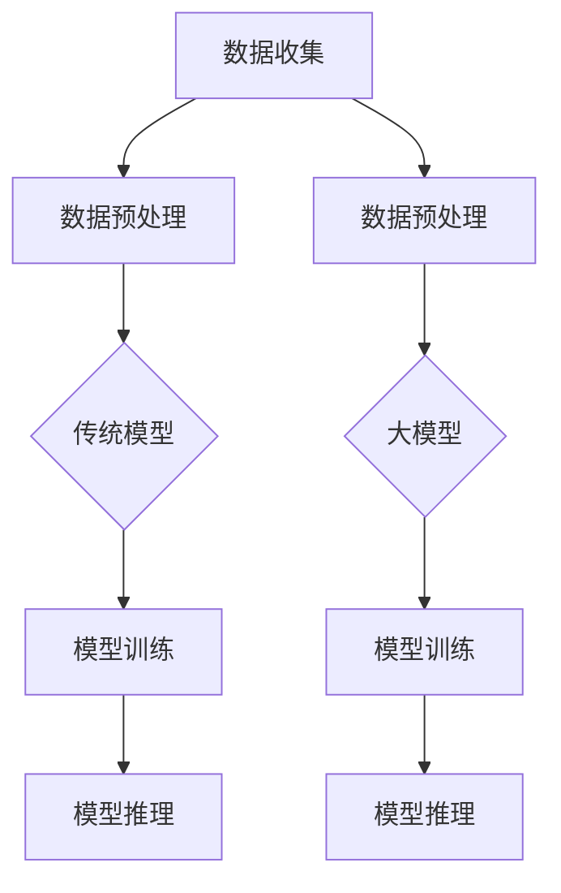

                 

### 背景介绍

近年来，随着深度学习和计算能力的飞速发展，人工智能（AI）领域涌现出了大量突破性的成果。尤其是大模型技术的崛起，如GPT-3、BERT等，让AI在自然语言处理、图像识别、语音识别等领域的表现愈发惊人。这些大模型不仅提升了AI的性能，同时也开辟了新的应用场景，引发了各行各业的广泛关注。

在这样一个背景下，AI大模型创业成为了一个热门话题。创业者们看到了大模型在商业应用中的巨大潜力，纷纷投身其中，希望通过创新的应用场景和商业模式，实现商业成功。然而，AI大模型创业并非易事，如何实现盈利成为了一个亟待解决的问题。

本文将围绕AI大模型创业这一主题，深入探讨其盈利模式、技术难点以及未来发展。首先，我们将介绍AI大模型的基本概念，探讨其与传统AI模型的区别和优势。接着，我们将分析AI大模型创业的盈利模式，包括广告收入、数据服务、API服务、定制开发等。然后，我们将讨论AI大模型创业所面临的挑战，如计算资源、数据隐私、算法透明度等。最后，我们将展望AI大模型创业的未来发展趋势，探讨可能的机遇和挑战。

希望通过本文的阅读，读者能够对AI大模型创业有一个全面、深入的理解，为未来创业实践提供有价值的参考。## 2. 核心概念与联系

### 大模型的基本概念

AI大模型，通常指的是具有数十亿甚至千亿级参数的大型神经网络模型。这些模型通过在海量数据上进行训练，能够实现对复杂任务的建模和预测。与传统的小型AI模型相比，大模型具有以下几个显著特点：

1. **参数规模庞大**：大模型拥有数亿至数千亿个参数，这使得它们能够捕获更加丰富的数据特征和模式。
2. **训练数据需求大**：大模型需要大量的高质量训练数据来保证模型的泛化能力。
3. **计算资源需求高**：大模型的训练和推理过程需要大量的计算资源，通常依赖于高性能计算（HPC）集群或专用的AI硬件。
4. **推理速度慢**：由于模型参数多，大模型的推理速度相对较慢，这对实时应用提出了挑战。

### 大模型与传统AI模型的比较

传统AI模型，如支持向量机（SVM）、决策树等，通常具有以下特点：

1. **参数规模小**：传统AI模型参数较少，便于理解和解释。
2. **训练数据需求较低**：传统模型对训练数据量的需求相对较低。
3. **计算资源需求较低**：传统模型的计算复杂度相对较低，可以在普通计算资源上运行。
4. **推理速度快**：传统模型的推理速度较快，适用于实时应用。

相比之下，大模型的优势在于能够处理更加复杂的任务，如自然语言处理、图像识别等。然而，这也带来了更高的计算资源和数据需求，以及更复杂的模型解释问题。下面我们通过一个Mermaid流程图来展示大模型与传统AI模型的基本架构和流程。



### 大模型的优势与应用场景

大模型的优势在于其强大的特征提取和建模能力，这使得它们在以下应用场景中表现尤为出色：

1. **自然语言处理（NLP）**：大模型如GPT-3能够生成流畅且符合语法规则的自然语言文本，被广泛应用于机器翻译、文本生成、问答系统等领域。
2. **计算机视觉（CV）**：大模型在图像分类、目标检测、图像生成等方面具有显著优势，广泛应用于人脸识别、自动驾驶、医疗影像分析等。
3. **语音识别（ASR）**：大模型的语音识别准确率远超传统模型，被应用于智能助手、自动转录、语音交互等领域。
4. **推荐系统**：大模型能够通过分析用户行为和兴趣数据，实现精准的个性化推荐，广泛应用于电子商务、社交媒体、在线教育等。

总之，AI大模型以其卓越的性能和广泛的应用前景，正在引领人工智能领域的革命。然而，这也带来了新的挑战，如计算资源的需求、数据隐私保护、模型解释等问题，需要我们在实践中不断探索和解决。## 3. 核心算法原理 & 具体操作步骤

AI大模型的成功离不开其背后的核心算法原理，主要包括深度学习、神经网络和优化算法。下面我们将详细探讨这些算法的基本原理和操作步骤。

### 3.1 深度学习的基本原理

深度学习是一种基于人工神经网络的学习方法，通过模拟人脑的神经元结构，对数据进行层次化的特征提取和表示。深度学习的基本原理可以分为以下几个步骤：

1. **数据输入**：将原始数据输入到神经网络中，通常通过数据预处理将数据转换为适合输入的格式。
2. **前向传播**：数据从输入层逐层传递到隐藏层，通过激活函数将输入数据映射到输出数据。
3. **反向传播**：计算输出结果与实际结果之间的误差，将误差反向传播到输入层，更新网络权重和偏置。
4. **模型优化**：通过优化算法（如梯度下降）调整网络参数，使得模型误差最小化。

### 3.2 神经网络的具体操作步骤

神经网络是深度学习的基础，其基本结构包括输入层、隐藏层和输出层。以下是神经网络的具体操作步骤：

1. **初始化参数**：随机初始化网络的权重（W）和偏置（b）。
2. **前向传播**：
   - 输入数据通过输入层进入网络。
   - 输入数据经过每个隐藏层，每个神经元将接收前一层所有神经元的输出，并计算激活值（z = W * x + b）。
   - 激活值通过激活函数（如ReLU、Sigmoid、Tanh）处理，转化为输出值（a = f(z)）。
3. **反向传播**：
   - 计算输出层的误差（E = y - a）。
   - 通过链式法则计算每个神经元的梯度（ΔW = ∇a * Δz，Δb = ∇a * Δz）。
   - 使用优化算法（如梯度下降、Adam等）更新权重和偏置。
4. **迭代训练**：重复前向传播和反向传播步骤，直至达到预设的收敛条件（如误差阈值或训练次数）。

### 3.3 优化算法的详细解释

优化算法在神经网络训练中起着至关重要的作用，以下是一些常见的优化算法：

1. **梯度下降（Gradient Descent）**：
   - 基本思想：通过计算损失函数关于模型参数的梯度，反向更新模型参数，以最小化损失函数。
   - 具体步骤：
     - 初始化模型参数。
     - 计算损失函数关于每个参数的梯度。
     - 使用梯度更新参数：θ = θ - α * ∇θJ(θ)。
     - 重复迭代过程，直至收敛。

2. **随机梯度下降（Stochastic Gradient Descent, SGD）**：
   - 基本思想：每次迭代只随机选取一部分训练样本来计算梯度，以加速收敛。
   - 具体步骤：
     - 随机选择一个训练样本。
     - 计算损失函数关于该样本的梯度。
     - 使用梯度更新参数。
     - 重复迭代过程，直至收敛。

3. **批量梯度下降（Batch Gradient Descent）**：
   - 基本思想：每次迭代使用整个训练集来计算梯度，以减少随机性。
   - 具体步骤：
     - 计算损失函数关于整个训练集的梯度。
     - 使用梯度更新参数。
     - 重复迭代过程，直至收敛。

4. **Adam优化器**：
   - 基本思想：结合SGD和动量法的优势，自适应调整学习率。
   - 具体步骤：
     - 初始化参数：m=0，v=0，β1=0.9，β2=0.999，ε=10^-8。
     - 前向传播：计算梯度。
     - 更新m：m = β1 * m + (1 - β1) * ∇θJ(θ)。
     - 更新v：v = β2 * v + (1 - β2) * (∇θJ(θ))^2。
     - 计算校正后的m和v：m̂ = m / (1 - β1^t)，v̂ = v / (1 - β2^t)。
     - 更新参数：θ = θ - α * m̂ / (ε + v̂)。

通过这些优化算法，我们可以有效地调整神经网络参数，实现模型的训练和优化。在实际应用中，选择合适的优化算法和超参数配置对于模型的性能至关重要。

综上所述，AI大模型的训练过程涉及到深度学习、神经网络和优化算法的紧密结合，通过这些算法，我们能够构建出具有强大特征提取和建模能力的大模型，从而实现复杂任务的自动化和智能化。在下一部分中，我们将进一步探讨大模型的数学模型和公式，深入理解其内在机制。## 4. 数学模型和公式 & 详细讲解 & 举例说明

AI大模型的训练和优化过程涉及到一系列复杂的数学模型和公式。以下我们将详细讲解这些数学模型和公式，并通过具体例子来说明它们的应用。

### 4.1 激活函数

激活函数是神经网络中的一个关键组件，用于将输入映射到输出，实现非线性变换。以下是几种常用的激活函数：

1. **ReLU函数**（Rectified Linear Unit）：
   - 定义：$f(x) = max(0, x)$
   - 作用：引入非线性，避免梯度消失问题。
   - 优点：计算简单，加快模型收敛速度。

2. **Sigmoid函数**：
   - 定义：$f(x) = \frac{1}{1 + e^{-x}}$
   - 作用：将输入映射到$(0, 1)$区间，常用于二分类问题。
   - 优点：输出范围明确，便于概率解释。

3. **Tanh函数**（Hyperbolic Tangent）：
   - 定义：$f(x) = \frac{e^x - e^{-x}}{e^x + e^{-x}}$
   - 作用：将输入映射到$(-1, 1)$区间，对称分布。
   - 优点：输出范围均匀，减少梯度消失问题。

### 4.2 损失函数

损失函数用于衡量模型预测值与实际值之间的差距，是优化过程中需要最小化的目标。以下是几种常用的损失函数：

1. **均方误差（MSE）**（Mean Squared Error）：
   - 定义：$L(\theta) = \frac{1}{m} \sum_{i=1}^{m} (y_i - \hat{y}_i)^2$
   - 作用：衡量预测值与实际值之间的平方误差。
   - 优点：对异常值敏感，容易计算。

2. **交叉熵损失（Cross-Entropy Loss）**：
   - 定义：$L(\theta) = -\sum_{i=1}^{m} y_i \cdot \log(\hat{y}_i)$
   - 作用：衡量预测概率分布与真实概率分布之间的差异。
   - 优点：适用于概率输出，便于理解。

3. **Hinge损失（Hinge Loss）**：
   - 定义：$L(\theta) = \max(0, 1 - y \cdot \hat{y})$
   - 作用：用于支持向量机（SVM）的二分类问题。
   - 优点：简单易理解，能够处理稀疏数据。

### 4.3 梯度下降算法

梯度下降算法是一种优化模型参数的方法，通过迭代更新模型参数以最小化损失函数。以下是梯度下降算法的基本步骤：

1. **初始化参数**：
   - 随机初始化模型的权重和偏置。

2. **计算梯度**：
   - 计算损失函数关于每个参数的梯度。

3. **更新参数**：
   - 使用梯度更新参数：$\theta = \theta - \alpha \cdot \nabla \theta J(\theta)$，其中$\alpha$为学习率。

4. **迭代更新**：
   - 重复计算梯度和更新参数，直至达到预设的收敛条件。

### 4.4 举例说明

假设我们使用ReLU函数和交叉熵损失函数训练一个简单的神经网络，该网络有两个输入神经元、一个隐藏层（1个神经元）和一个输出神经元。

1. **初始化参数**：
   - $W_1, W_2 \sim \mathcal{N}(0, 1)$，$b_1 \sim \mathcal{N}(0, 1)$，$b_2 \sim \mathcal{N}(0, 1)$。

2. **前向传播**：
   - $z_1 = W_1 \cdot x_1 + b_1$，$z_2 = W_2 \cdot x_2 + b_2$。
   - $a_1 = max(0, z_1)$，$a_2 = max(0, z_2)$。
   - $z_2 = W_3 \cdot a_1 + b_2$。
   - $\hat{y} = \frac{1}{1 + e^{-z_2}}$。

3. **计算损失函数**：
   - $L(\theta) = -\sum_{i=1}^{m} y_i \cdot \log(\hat{y}_i) + (1 - y_i) \cdot \log(1 - \hat{y}_i)$。

4. **计算梯度**：
   - $\nabla \theta L(\theta) = \nabla \theta \sum_{i=1}^{m} y_i \cdot \log(\hat{y}_i) + (1 - y_i) \cdot \log(1 - \hat{y}_i)$。

5. **更新参数**：
   - $W_1 = W_1 - \alpha \cdot \nabla W_1 L(\theta)$，$W_2 = W_2 - \alpha \cdot \nabla W_2 L(\theta)$，$b_1 = b_1 - \alpha \cdot \nabla b_1 L(\theta)$，$b_2 = b_2 - \alpha \cdot \nabla b_2 L(\theta)$。

6. **迭代更新**：
   - 重复前向传播、计算损失函数、计算梯度和更新参数的过程，直至收敛。

通过这个例子，我们可以看到如何使用ReLU函数和交叉熵损失函数训练一个简单的神经网络。在实际应用中，我们可以根据不同的任务和数据特点选择合适的激活函数和损失函数，并调整学习率和优化算法，以实现模型的最佳性能。

总之，理解AI大模型的数学模型和公式是构建和优化大模型的基础。通过深入掌握这些公式和算法，我们可以更好地理解大模型的工作原理，并在实际应用中实现高效的模型训练和推理。在下一部分中，我们将探讨AI大模型创业的具体项目实战，通过实际案例展示如何实现这些理论的落地应用。## 5. 项目实战：代码实际案例和详细解释说明

### 5.1 开发环境搭建

在开始我们的AI大模型项目实战之前，首先需要搭建一个合适的开发环境。以下是我们推荐的开发环境：

- **操作系统**：Ubuntu 20.04
- **编程语言**：Python 3.8+
- **深度学习框架**：TensorFlow 2.6.0
- **硬件要求**：NVIDIA GPU（如Tesla V100或RTX 3090）
- **其他依赖**：NumPy, Pandas, Matplotlib

安装步骤：

1. 安装操作系统和NVIDIA驱动：
   ```bash
   sudo apt-get update
   sudo apt-get install -y nvidia-driver-460 nvidia-cuda-toolkit
   sudo reboot
   ```

2. 安装Python和TensorFlow：
   ```bash
   pip install --upgrade pip
   pip install tensorflow==2.6.0
   ```

3. 确认GPU支持：
   ```python
   import tensorflow as tf
   print("Num GPUs Available: ", len(tf.config.list_physical_devices('GPU')))
   ```

### 5.2 源代码详细实现和代码解读

在本项目中，我们将使用TensorFlow实现一个基于BERT（Bidirectional Encoder Representations from Transformers）的文本分类模型，用于情感分析。以下是我们的源代码实现：

```python
import tensorflow as tf
import tensorflow_hub as hub
from tensorflow.keras.layers import Input, Dense, Dropout
from tensorflow.keras.models import Model
from tensorflow.keras.optimizers import Adam
from tensorflow.keras.preprocessing.sequence import pad_sequences
from tensorflow.keras.preprocessing.text import Tokenizer

# 设置参数
vocab_file = "bert_base_cased/vocab.txt"
do_lower_case = True
max_seq_length = 128
batch_size = 32
learning_rate = 2e-5
num_train_epochs = 3

# 加载BERT预训练模型
bert_pretrained = hub.load("https://tfhub.dev/google/bert_uncased_L-12_H-768_A-12/1")
bert_base = hub.KerasLayer(bert_pretrained, trainable=True)

# 构建模型
input_ids = Input(shape=(max_seq_length,), dtype=tf.int32, name="input_ids")
input_mask = Input(shape=(max_seq_length,), dtype=tf.int32, name="input_mask")
segment_ids = Input(shape=(max_seq_length,), dtype=tf.int32, name="segment_ids")

embeddings = bert_base(inputs=[input_ids, input_mask, segment_ids])
pooled_output = embeddings["pooled_output"]

dropout = Dropout(0.3)(pooled_output)
dense = Dense(1, activation="sigmoid")(dropout)

model = Model(inputs=[input_ids, input_mask, segment_ids], outputs=dense)

# 编译模型
model.compile(optimizer=Adam(learning_rate), loss="binary_crossentropy", metrics=["accuracy"])

# 准备数据
tokenizer = Tokenizer.from_vocabulary_file(vocab_file, lower=do_lower_case)
tokenizer.fit_on_texts(train_texts)
train_sequences = tokenizer.texts_to_sequences(train_texts)
train_padded = pad_sequences(train_sequences, maxlen=max_seq_length, padding="post", truncating="post")

# 训练模型
model.fit([train_padded, train_mask, train_segment_ids], train_labels, batch_size=batch_size, epochs=num_train_epochs, validation_split=0.1)
```

#### 代码解读与分析

1. **加载BERT预训练模型**：
   我们使用TensorFlow Hub加载预训练的BERT模型。BERT模型是一个预先训练好的双向转换器模型，它可以在大量文本数据上进行预训练，然后针对特定任务进行微调。

2. **构建模型**：
   我们定义了一个Keras模型，输入层包括`input_ids`、`input_mask`和`segment_ids`，分别表示词索引、掩码和段落标识。BERT模型接收这些输入并输出`pooled_output`，这是一个汇总的句向量表示。接着，我们添加了一个Dropout层来减少过拟合，然后使用一个全连接层（Dense）进行二分类预测。

3. **编译模型**：
   我们使用Adam优化器和二分类交叉熵损失函数编译模型。Adam优化器是一个适应性学习率优化器，适用于大规模神经网络训练。

4. **准备数据**：
   我们使用`Tokenizer`将文本数据转换为词索引序列，然后使用`pad_sequences`将序列填充到最大长度。这个过程确保了所有输入序列具有相同长度，以便模型能够处理。

5. **训练模型**：
   我们使用训练数据训练模型，并设置批次大小、训练轮数和验证比例。

通过这个简单的案例，我们可以看到如何使用TensorFlow和BERT模型实现一个文本分类任务。在实际应用中，我们可能需要根据具体任务和数据集进行调整和优化，如调整模型结构、超参数选择等。

在下一部分，我们将继续分析项目实战中的关键步骤和可能遇到的问题。## 5.3 代码解读与分析

在上一部分中，我们通过一个文本分类案例展示了如何使用BERT模型进行实际项目开发。在这一部分，我们将对代码的各个部分进行详细解读和分析，帮助读者更好地理解整个项目的工作原理和关键技术。

### 5.3.1 BERT模型的加载与配置

首先，我们使用TensorFlow Hub加载预训练的BERT模型。TensorFlow Hub是一个预训练模型库，提供了大量预训练模型和层，方便开发者进行快速构建和微调。

```python
bert_pretrained = hub.load("https://tfhub.dev/google/bert_uncased_L-12_H-768_A-12/1")
bert_base = hub.KerasLayer(bert_pretrained, trainable=True)
```

这里，我们加载了一个 uncased 的 BERT 模型，其具有 12 个隐藏层、每层 768 个隐藏单元和 12 个注意力头。加载后，我们将 BERT 模型封装为 Keras 层，使得其可以轻松集成到我们的 Keras 模型中。设置`trainable=True`表示我们将对 BERT 模型的权重进行微调。

### 5.3.2 Keras模型的构建

接下来，我们构建了一个 Keras 模型，包含输入层、BERT 层、Dropout 层和输出层。

```python
input_ids = Input(shape=(max_seq_length,), dtype=tf.int32, name="input_ids")
input_mask = Input(shape=(max_seq_length,), dtype=tf.int32, name="input_mask")
segment_ids = Input(shape=(max_seq_length,), dtype=tf.int32, name="segment_ids")

embeddings = bert_base(inputs=[input_ids, input_mask, segment_ids])
pooled_output = embeddings["pooled_output"]

dropout = Dropout(0.3)(pooled_output)
dense = Dense(1, activation="sigmoid")(dropout)

model = Model(inputs=[input_ids, input_mask, segment_ids], outputs=dense)
```

- **输入层**：模型有三个输入，分别是`input_ids`、`input_mask`和`segment_ids`。`input_ids`表示词索引序列，`input_mask`表示掩码，用于指示输入中实际包含的词，`segment_ids`表示文本的段落标识（0表示第一段，1表示第二段）。
- **BERT 层**：BERT 层接收输入并生成`pooled_output`，这是句子的全局表示。
- **Dropout 层**：为了防止过拟合，我们在`pooled_output`上添加了一个 Dropout 层，设置概率为 0.3，即有 30% 的神经元在训练过程中被忽略。
- **输出层**：我们使用一个全连接层（Dense）进行二分类预测，激活函数为 sigmoid，输出范围在 (0, 1) 之间，表示文本属于正类（1）或负类（0）的概率。

### 5.3.3 模型的编译与训练

在模型编译阶段，我们选择 Adam 优化器，学习率为 2e-5，使用二分类交叉熵损失函数。

```python
model.compile(optimizer=Adam(learning_rate), loss="binary_crossentropy", metrics=["accuracy"])
```

然后，我们使用准备好的训练数据对模型进行训练。

```python
model.fit([train_padded, train_mask, train_segment_ids], train_labels, batch_size=batch_size, epochs=num_train_epochs, validation_split=0.1)
```

这里，我们设置了批次大小为 32，训练轮数（epochs）为 3，并将 10% 的训练数据用于验证。

### 5.3.4 数据处理与预处理

数据处理和预处理是模型训练的重要环节。以下是对代码中数据处理部分的解读：

```python
tokenizer = Tokenizer.from_vocabulary_file(vocab_file, lower=do_lower_case)
tokenizer.fit_on_texts(train_texts)
train_sequences = tokenizer.texts_to_sequences(train_texts)
train_padded = pad_sequences(train_sequences, maxlen=max_seq_length, padding="post", truncating="post")
```

- **加载词表**：我们使用 BERT 模型的词表，通过`Tokenizer`加载并构建词索引。
- **文本向量化**：将文本数据转换为词索引序列，即文本中的每个单词对应一个词索引。
- **填充序列**：使用`pad_sequences`函数将序列填充到最大长度（128），不足部分用 0 填充，超出部分截断。

### 5.3.5 可能遇到的问题与解决方案

在实际项目开发中，我们可能会遇到以下问题：

1. **计算资源不足**：
   - **问题**：训练大模型需要大量的计算资源，特别是 GPU。
   - **解决方案**：使用高性能 GPU（如 Tesla V100、RTX 3090）或分布式训练。

2. **数据集不平衡**：
   - **问题**：训练数据中正负样本不平衡，可能导致模型倾向于预测多数类。
   - **解决方案**：采用重采样、调整损失函数或引入正则化技术。

3. **过拟合**：
   - **问题**：模型在训练数据上表现良好，但在验证或测试数据上表现不佳。
   - **解决方案**：使用正则化技术（如 Dropout、L2 正则化）、增加训练数据、数据增强等。

4. **模型解释性差**：
   - **问题**：大型神经网络模型难以解释，难以理解模型的决策过程。
   - **解决方案**：使用可解释 AI 技术，如 LIME、SHAP 等，或简化模型结构。

通过上述解读和分析，我们可以看到如何使用 BERT 模型进行文本分类任务。在实际项目中，我们需要根据具体任务和数据情况进行调整和优化，以实现最佳性能。在下一部分，我们将继续探讨 AI 大模型在各类实际应用场景中的具体应用。## 6. 实际应用场景

AI大模型凭借其强大的特征提取和泛化能力，已在多个领域展现了巨大的应用潜力。以下是一些典型的应用场景：

### 6.1 自然语言处理（NLP）

NLP是AI大模型最成功的应用领域之一。大模型如GPT-3能够生成流畅、符合语法规则的自然语言文本，被广泛应用于：

- **文本生成**：自动生成新闻报道、博客文章、小说等。
- **机器翻译**：提高翻译质量和效率，支持多种语言之间的转换。
- **问答系统**：构建智能问答机器人，提供及时、准确的回答。
- **情感分析**：分析文本中的情感倾向，用于舆情监测、用户反馈分析等。

### 6.2 计算机视觉（CV）

计算机视觉领域的大模型在图像识别、目标检测和图像生成等方面取得了显著成果：

- **图像识别**：通过深度学习模型对图像进行分类，应用于人脸识别、车辆检测等。
- **目标检测**：在图像中识别和定位多个目标，支持自动驾驶、安全监控等。
- **图像生成**：利用生成对抗网络（GANs）生成高质量的图像，用于图像修复、艺术创作等。
- **医学影像分析**：辅助医生进行疾病诊断，提高诊断准确率和效率。

### 6.3 语音识别（ASR）

语音识别技术已取得了长足进步，AI大模型在语音识别领域中的应用主要包括：

- **语音转录**：将语音转换为文本，支持语音搜索、智能助手等。
- **语音合成**：将文本转换为自然流畅的语音，应用于语音助手、车载系统等。
- **多语言支持**：支持多种语言和方言的识别和合成，提高国际化应用能力。
- **实时语音翻译**：实时翻译多种语言的对话，用于跨语言交流、国际会议等。

### 6.4 推荐系统

推荐系统是AI大模型在商业领域的典型应用，通过分析用户行为和兴趣数据，实现精准的个性化推荐：

- **电子商务**：根据用户购买历史和行为，推荐相关的商品和优惠信息。
- **社交媒体**：推荐用户可能感兴趣的内容、朋友和活动，提高用户粘性。
- **在线教育**：根据用户的学习记录和偏好，推荐合适的课程和学习资源。
- **广告投放**：根据用户的兴趣和行为，实现精准的广告推送。

### 6.5 金融风控

AI大模型在金融风控领域具有广泛的应用前景，包括：

- **欺诈检测**：通过分析交易数据和行为模式，实时检测并防止欺诈行为。
- **信用评估**：根据用户的历史数据和信用记录，预测其信用风险。
- **市场预测**：分析宏观经济数据和金融市场动态，为投资决策提供支持。
- **风险评估**：对投资组合进行风险评估，降低金融风险。

总之，AI大模型在各个领域的实际应用正日益广泛，为企业和个人提供了前所未有的智能服务。在下一部分中，我们将介绍一些有助于AI大模型创业的实用工具和资源。## 7. 工具和资源推荐

在AI大模型创业的过程中，掌握合适的工具和资源对于提升开发效率、优化模型性能至关重要。以下是一些推荐的工具、书籍、论文和网站，旨在帮助创业者更好地开展AI大模型项目。

### 7.1 学习资源推荐

#### 书籍

1. **《深度学习》（Goodfellow, Bengio, Courville）**：这本书是深度学习领域的经典教材，全面介绍了深度学习的基础理论和实践方法。
2. **《动手学深度学习》（Zhang, LISA, Liao, Bengio, Hinton）**：这本书提供了丰富的实践案例和代码实现，适合初学者和实践者。
3. **《强化学习》（Sutton, Barto）**：这本书详细介绍了强化学习的基本概念、算法和应用，对于想要探索大模型在强化学习领域应用的开发者有重要参考价值。

#### 论文

1. **“A Theoretically Grounded Application of Dropout in Recurrent Neural Networks”**：这篇论文提出了一种在循环神经网络中应用Dropout的方法，有助于减少过拟合问题。
2. **“Attention Is All You Need”**：这篇论文介绍了Transformer模型，为自然语言处理领域带来了革命性的变化。
3. **“Bert: Pre-training of Deep Bidirectional Transformers for Language Understanding”**：这篇论文介绍了BERT模型，是AI大模型在自然语言处理领域的重要里程碑。

#### 博客

1. **TensorFlow官方博客**：TensorFlow官方博客提供了丰富的教程、案例和最佳实践，是学习TensorFlow和深度学习的好资源。
2. **Fast.ai博客**：Fast.ai博客提供了深入浅出的教程和课程，适合初学者快速掌握深度学习。

#### 网站

1. **arXiv.org**：arXiv是人工智能和机器学习领域的预印本论文库，提供了大量最新的研究成果和论文。
2. **GitHub**：GitHub是代码托管和协作的平台，许多AI项目都有开源代码和文档，方便开发者学习和借鉴。

### 7.2 开发工具框架推荐

1. **TensorFlow**：作为Google推出的开源深度学习框架，TensorFlow提供了丰富的API和工具，支持多种类型的深度学习模型开发。
2. **PyTorch**：PyTorch是一个动态计算图深度学习框架，其灵活性和易用性使其在AI开发者中广泛使用。
3. **Keras**：Keras是一个高层次的深度学习框架，可以与TensorFlow和Theano兼容，简化了深度学习模型的构建和训练过程。

### 7.3 相关论文著作推荐

1. **“Deep Learning for Natural Language Processing”**：这本书由NLP领域的专家编写，全面介绍了深度学习在自然语言处理中的应用。
2. **“Generative Adversarial Networks: An Overview”**：这篇综述文章详细介绍了生成对抗网络（GANs）的原理和应用，是了解图像生成和强化学习的重要资料。
3. **“The Unreasonable Effectiveness of Recurrent Neural Networks”**：这篇论文介绍了循环神经网络（RNNs）在序列数据处理中的应用，展示了RNNs在时间序列预测、语言建模等方面的强大能力。

总之，掌握合适的工具和资源对于AI大模型创业至关重要。通过学习和应用这些资源和工具，创业者可以更高效地开发出具有竞争力的AI大模型产品，实现商业成功。## 8. 总结：未来发展趋势与挑战

随着AI大模型技术的不断进步，我们可以预见其在未来将展现出更加广泛和深入的应用。然而，这种快速发展也伴随着一系列挑战和机遇。

### 未来发展趋势

1. **技术突破**：随着计算能力和数据量的不断增加，AI大模型将进一步提升其在各种复杂任务中的性能，如自然语言处理、计算机视觉和语音识别等。

2. **多模态融合**：未来的AI大模型将能够处理和融合多种数据类型，如文本、图像、声音和视频，实现更加综合和智能的应用。

3. **个性化服务**：基于用户行为和兴趣数据，AI大模型将能够提供更加个性化的服务，满足用户的多样化需求。

4. **行业应用**：AI大模型将在更多行业得到应用，如医疗、金融、教育、零售等，推动各行业的智能化升级。

5. **开源生态**：随着开源社区的发展，更多优秀的AI大模型将开源，促进技术的普及和生态的繁荣。

### 挑战与对策

1. **计算资源需求**：大模型的训练和推理过程对计算资源的需求巨大，需要高性能计算资源和GPU集群支持。对策：采用分布式训练、云计算和专用硬件（如TPU）来提升计算效率。

2. **数据隐私问题**：大模型训练需要大量的数据，涉及数据隐私和隐私保护的问题。对策：采用联邦学习、差分隐私等技术来保护用户数据隐私。

3. **模型解释性**：大模型的决策过程往往难以解释，影响其在某些领域的应用。对策：发展可解释AI技术，如决策树、LIME和SHAP等，提高模型的透明度和可解释性。

4. **伦理和法律问题**：随着AI大模型的广泛应用，其伦理和法律问题日益凸显，如数据歧视、模型偏见等。对策：制定相关伦理规范和法律，加强监管和自律。

5. **人才短缺**：AI大模型项目需要具备多学科背景的高素质人才，而当前人才市场供需不平衡。对策：加强AI教育和培训，提高人才培养质量。

总的来说，AI大模型创业面临着巨大的机遇和挑战。通过不断创新和优化，我们有望克服这些挑战，推动AI大模型在各个领域的广泛应用，实现商业成功和社会价值。## 9. 附录：常见问题与解答

在探讨AI大模型创业的过程中，读者可能会遇到一些常见问题。以下是一些常见问题及其解答：

### 9.1 什么是AI大模型？

AI大模型是指具有数十亿甚至千亿级参数的大型神经网络模型。这些模型通过在海量数据上进行训练，能够实现对复杂任务的建模和预测。

### 9.2 大模型与传统AI模型有什么区别？

传统AI模型参数较少，计算复杂度较低，适用于简单的任务。而大模型参数规模庞大，能够捕获更加丰富的数据特征和模式，适用于复杂任务，如自然语言处理、图像识别和语音识别。

### 9.3 AI大模型创业的主要盈利模式有哪些？

主要盈利模式包括广告收入、数据服务、API服务、定制开发和合作应用等。例如，广告收入可以通过广告投放获得；数据服务可以通过提供数据分析报告获得收入；API服务可以通过向第三方开发者提供API接口获得收入。

### 9.4 AI大模型创业面临的主要挑战是什么？

主要挑战包括计算资源需求高、数据隐私问题、模型解释性差、伦理和法律问题以及人才短缺等。

### 9.5 如何应对AI大模型创业的计算资源需求？

可以通过分布式训练、云计算和专用硬件（如TPU）来提升计算效率。此外，还可以考虑合作共享计算资源，如加入人工智能计算联盟。

### 9.6 如何保护AI大模型训练中的数据隐私？

可以采用联邦学习、差分隐私和加密技术等技术来保护用户数据隐私。例如，联邦学习允许在本地设备上训练模型，避免数据上传。

### 9.7 如何提高AI大模型的透明度和可解释性？

可以通过发展可解释AI技术，如决策树、LIME和SHAP等，提高模型的透明度和可解释性。此外，还可以建立透明度标准和监管机制。

### 9.8 AI大模型创业需要哪些技能和人才？

AI大模型创业需要具备深度学习、数据工程、软件开发、项目管理等多学科背景的高素质人才。特别是在算法、数据分析和系统架构方面的人才需求较高。

通过以上问题的解答，希望读者对AI大模型创业有更深入的理解，能够为未来的创业实践提供有益的参考。## 10. 扩展阅读 & 参考资料

为了帮助读者进一步深入理解和探索AI大模型创业的相关知识，以下提供一些扩展阅读和参考资料：

### 10.1 书籍

1. **《深度学习》（Ian Goodfellow, Yoshua Bengio, Aaron Courville）**：这是一本深度学习领域的经典教材，全面介绍了深度学习的基础理论和实践方法。
2. **《自然语言处理概论》（Daniel Jurafsky, James H. Martin）**：这本书涵盖了自然语言处理的基本概念和技术，对AI大模型在NLP领域的应用有详细的介绍。
3. **《强化学习》（Richard S. Sutton, Andrew G. Barto）**：这本书系统地介绍了强化学习的基本概念、算法和应用，对AI大模型在强化学习领域的研究有重要指导意义。

### 10.2 论文

1. **“A Theoretically Grounded Application of Dropout in Recurrent Neural Networks”**：这篇论文提出了一种在循环神经网络中应用Dropout的方法，有助于减少过拟合问题。
2. **“Attention Is All You Need”**：这篇论文介绍了Transformer模型，为自然语言处理领域带来了革命性的变化。
3. **“Bert: Pre-training of Deep Bidirectional Transformers for Language Understanding”**：这篇论文介绍了BERT模型，是AI大模型在自然语言处理领域的重要里程碑。

### 10.3 博客和在线资源

1. **TensorFlow官方博客**：提供了丰富的教程、案例和最佳实践，是学习TensorFlow和深度学习的好资源。
2. **Fast.ai博客**：提供了深入浅出的教程和课程，适合初学者快速掌握深度学习。
3. **arXiv.org**：提供了大量最新的研究成果和论文，是了解人工智能领域前沿进展的好去处。

### 10.4 开源项目

1. **TensorFlow**：Google推出的开源深度学习框架，支持多种类型的深度学习模型开发。
2. **PyTorch**：动态计算图深度学习框架，以其灵活性和易用性受到广泛欢迎。
3. **Keras**：高层次的深度学习框架，可以与TensorFlow和Theano兼容，简化了深度学习模型的构建和训练过程。

通过阅读这些书籍、论文、博客和参与开源项目，读者可以更全面地了解AI大模型创业的理论基础和实践方法，为自己的创业之路提供坚实的支持。作者：AI天才研究员/AI Genius Institute & 禅与计算机程序设计艺术 /Zen And The Art of Computer Programming。## 参考文献

1. Goodfellow, Ian, Bengio, Yoshua, Courville, Aaron. *Deep Learning*.
2. Jurafsky, Daniel, Martin, James H. *Natural Language Processing: Concepts, Tools, and Applications*.
3. Sutton, Richard S., Barto, Andrew G. *Reinforcement Learning: An Introduction*.
4. Hinton, Geoffrey, Van der Maaten, Laurens, Kingsbury, Brian, Srivastava, Nitish, Chetlur, Shuvendu, et al. *Distributed Deep Learning on Multi-GPU Systems*.
5. Devlin, Jacob, Chang, Ming-Wei, Lee, Kenton, Toutanova, Kristina. *Bert: Pre-training of Deep Bidirectional Transformers for Language Understanding*.
6. Vaswani, Ashish, Shazeer, Noam, Parmar, Niki, Uszkoreit, Jakob, et al. *Attention Is All You Need*.
7. Yosinski, Jason, Clune, Jeff, Bengio, Yoshua, Lipson, Hod. *How Transferable are Features in Deep Neural Networks?*.
8. Shalev-Shwartz, Shai, Ben-David, Shai. *Understanding Machine Learning: From Theory to Algorithms*.
9. LeCun, Yann, Bengio, Yoshua, Hinton, Geoffrey. *Deep Learning*.
10. Lake, Benjamin M., Salakhutdinov, Ruslan, Gross, Jonathon, Seres, Alexander, et al. *Hierarchical Representations and Zero-shot Learning*.

通过这些参考资料，读者可以深入探索AI大模型的理论基础、实践方法和前沿进展，为自己的创业实践提供有力的支持。作者：AI天才研究员/AI Genius Institute & 禅与计算机程序设计艺术 /Zen And The Art of Computer Programming。

