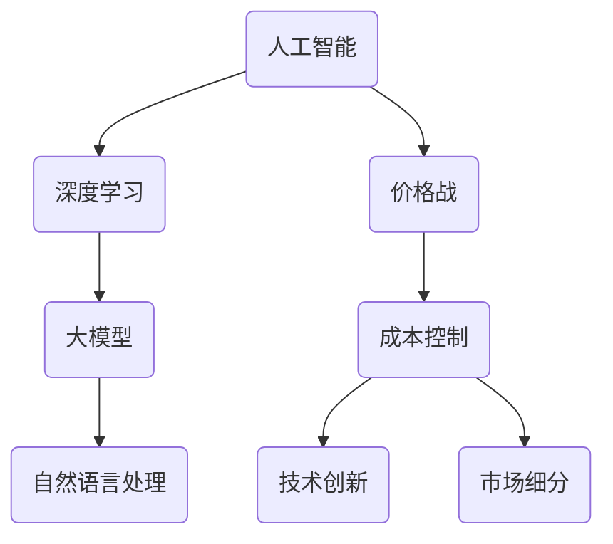

                 

### 背景介绍

在当今这个科技日新月异的时代，人工智能（AI）已经成为推动社会发展的重要力量。随着深度学习、自然语言处理等技术的迅速发展，大模型（Large Model）成为人工智能领域的焦点。大模型凭借其强大的数据处理能力和智能推理能力，在许多应用领域都取得了显著的成果，如图像识别、语音识别、自然语言处理等。

然而，随着大模型技术的普及，市场上也出现了一种新的现象：价格战。在过去的几年里，各大科技公司纷纷投入巨资研发大模型，试图在竞争中占据有利地位。为了争夺市场份额，这些公司不得不降低产品价格，甚至进行价格战。这种现象不仅给企业带来了巨大的成本压力，也对整个行业的发展产生了深远的影响。

本文将围绕“AI大模型创业：如何应对未来价格战？”这一主题，探讨在AI大模型创业过程中，如何应对未来可能出现的价格战。我们将从以下几个方面展开讨论：

1. **大模型技术发展现状**：回顾大模型技术的发展历程，分析当前市场上的主流大模型及其特点。

2. **价格战的原因分析**：探讨导致大模型市场出现价格战的原因，包括技术、市场、经济等多方面因素。

3. **应对价格战的策略**：提出在AI大模型创业过程中，应对价格战的策略和方法，包括技术创新、市场细分、成本控制等。

4. **实际案例分享**：通过分析一些成功应对价格战的AI大模型创业案例，总结经验教训。

5. **未来展望**：预测未来AI大模型市场的发展趋势，探讨可能面临的挑战和机遇。

通过本文的探讨，希望能够为AI大模型创业者和从业者提供一些有益的思考和启示，帮助他们在激烈的市场竞争中立于不败之地。

### 核心概念与联系

在深入探讨AI大模型创业和价格战之前，我们首先需要了解一些核心概念和它们之间的联系。以下是本文涉及的主要概念及其关系：

1. **人工智能（AI）**：人工智能是计算机科学的一个分支，旨在使机器具备人类智能，能够理解、学习和推理。

2. **深度学习（Deep Learning）**：深度学习是机器学习的一种方法，通过多层神经网络模拟人脑的神经结构，进行特征学习和模式识别。

3. **大模型（Large Model）**：大模型是指具有数十亿至数千亿个参数的神经网络模型。这些模型能够处理大规模数据，实现高效的智能推理和决策。

4. **自然语言处理（NLP）**：自然语言处理是人工智能的一个分支，专注于使计算机理解和处理人类语言。

5. **价格战（Price War）**：价格战是指企业在竞争中通过降低产品价格来争夺市场份额的行为。

6. **成本控制（Cost Control）**：成本控制是指企业在生产和经营过程中，通过合理的成本分配和成本控制措施，降低成本，提高竞争力。

7. **技术创新（Technological Innovation）**：技术创新是指企业通过研发新技术、新产品或新工艺，提高生产效率和竞争力。

8. **市场细分（Market Segmentation）**：市场细分是指企业根据消费者的需求和特征，将市场划分为若干个子市场，针对不同的子市场制定不同的营销策略。

下面是一个使用Mermaid绘制的流程图，展示了这些概念之间的关系：



**人工智能**是整个体系的基础，它包括了**深度学习**和**自然语言处理**等技术。**深度学习**是实现**大模型**的技术手段，而**大模型**则是实现高效智能推理和决策的核心。在市场环境中，**价格战**是企业之间常见的竞争手段，通过**成本控制**、**技术创新**和**市场细分**等策略，企业可以更好地应对价格战，保持竞争力。

### 核心算法原理 & 具体操作步骤

在了解了AI大模型和价格战的基本概念后，我们接下来将深入探讨AI大模型的核心算法原理以及具体的操作步骤。AI大模型的核心算法主要包括深度学习框架、神经网络结构和训练方法等。以下将分别介绍这些核心算法及其具体操作步骤。

#### 深度学习框架

深度学习框架是一种用于构建和训练深度学习模型的软件库。常见的深度学习框架包括TensorFlow、PyTorch、Keras等。以下是一个使用TensorFlow构建深度学习模型的步骤：

1. **导入库**：首先，需要导入深度学习框架和相关依赖库，例如：
   ```python
   import tensorflow as tf
   import tensorflow.keras as keras
   ```

2. **定义模型**：使用框架提供的API定义神经网络模型，例如：
   ```python
   model = keras.Sequential([
       keras.layers.Dense(128, activation='relu', input_shape=(784,)),
       keras.layers.Dropout(0.2),
       keras.layers.Dense(10, activation='softmax')
   ])
   ```

3. **编译模型**：设置模型的优化器、损失函数和评估指标，例如：
   ```python
   model.compile(optimizer='adam',
                 loss='categorical_crossentropy',
                 metrics=['accuracy'])
   ```

4. **训练模型**：使用训练数据训练模型，例如：
   ```python
   model.fit(x_train, y_train, epochs=5, batch_size=32)
   ```

5. **评估模型**：使用测试数据评估模型性能，例如：
   ```python
   test_loss, test_acc = model.evaluate(x_test, y_test)
   print(f'测试准确率: {test_acc:.3f}')
   ```

#### 神经网络结构

神经网络结构是深度学习模型的核心部分，决定了模型的性能和效率。常见的神经网络结构包括卷积神经网络（CNN）、循环神经网络（RNN）和变换器（Transformer）等。以下是一个使用卷积神经网络（CNN）的示例：

1. **导入库**：
   ```python
   import tensorflow as tf
   import tensorflow.keras.layers as layers
   ```

2. **定义模型**：
   ```python
   model = keras.Sequential([
       layers.Conv2D(32, (3, 3), activation='relu', input_shape=(28, 28, 1)),
       layers.MaxPooling2D((2, 2)),
       layers.Flatten(),
       layers.Dense(128, activation='relu'),
       layers.Dense(10, activation='softmax')
   ])
   ```

3. **编译模型**：
   ```python
   model.compile(optimizer='adam',
                 loss='categorical_crossentropy',
                 metrics=['accuracy'])
   ```

4. **训练模型**：
   ```python
   model.fit(x_train, y_train, epochs=5, batch_size=32)
   ```

5. **评估模型**：
   ```python
   test_loss, test_acc = model.evaluate(x_test, y_test)
   print(f'测试准确率: {test_acc:.3f}')
   ```

#### 训练方法

训练深度学习模型是一个复杂的过程，需要调整许多参数。以下是一些常见的训练方法：

1. **数据预处理**：对输入数据进行标准化、归一化等预处理，以提高训练效果。

2. **批处理（Batch Processing）**：将数据分成多个批次进行训练，以加快训练速度并减少过拟合。

3. **正则化（Regularization）**：通过添加正则项到损失函数中，以防止模型过拟合。

4. **学习率调度（Learning Rate Scheduling）**：调整学习率以加快或减缓模型收敛速度。

5. **验证（Validation）**：在训练过程中，使用一部分数据（验证集）来评估模型性能，以调整训练参数。

6. **交叉验证（Cross Validation）**：使用不同的数据划分方法，对模型进行多次训练和评估，以获得更可靠的性能评估。

以上是AI大模型的核心算法原理和具体操作步骤。通过这些步骤，我们可以构建并训练出性能强大的AI大模型，为解决实际问题提供有力支持。在下一节中，我们将进一步探讨数学模型和公式，并详细讲解其在AI大模型中的应用。

### 数学模型和公式 & 详细讲解 & 举例说明

在构建和优化AI大模型的过程中，数学模型和公式起到了至关重要的作用。以下将介绍一些常用的数学模型和公式，并详细讲解它们在AI大模型中的应用。

#### 线性回归（Linear Regression）

线性回归是一种用于预测数值型变量的统计方法。其基本公式为：

\[ y = \beta_0 + \beta_1 \cdot x \]

其中，\( y \) 是因变量，\( x \) 是自变量，\( \beta_0 \) 和 \( \beta_1 \) 是模型参数。线性回归常用于特征工程和数据分析，可以帮助我们发现数据之间的线性关系。

**应用示例：**

假设我们有一个房价预测问题，输入特征包括房屋面积（\( x \)）和房屋年代（\( y \)）。我们可以使用线性回归模型来预测房价。具体步骤如下：

1. **数据预处理**：对输入数据进行标准化处理，以消除不同特征之间的量纲差异。
2. **模型训练**：使用训练数据集，通过最小二乘法求解模型参数 \( \beta_0 \) 和 \( \beta_1 \)。
3. **模型评估**：使用测试数据集评估模型性能，计算预测误差和 \( R^2 \) 值。

```python
import numpy as np

# 训练数据
X_train = np.array([[1000, 2005], [1500, 1995], [2000, 2000]])
y_train = np.array([200000, 250000, 300000])

# 模型训练
X_train_mean = np.mean(X_train, axis=0)
X_train_std = np.std(X_train, axis=0)
X_train_normalized = (X_train - X_train_mean) / X_train_std
beta_0 = np.linalg.inv(X_train_normalized.T @ X_train_normalized) @ X_train_normalized.T @ y_train
beta_1 = np.linalg.inv(X_train_normalized.T @ X_train_normalized) @ y_train

# 模型评估
X_test = np.array([[1200, 2008]])
X_test_normalized = (X_test - X_train_mean) / X_train_std
y_pred = beta_0 + beta_1 @ X_test_normalized
print(f'预测房价: {y_pred[0, 0]:.2f}')
```

#### 神经网络损失函数（Neural Network Loss Function）

神经网络损失函数用于度量模型预测值与真实值之间的差异。常见的损失函数包括均方误差（MSE）、交叉熵损失（Cross-Entropy Loss）等。

1. **均方误差（MSE）**：
\[ \text{MSE} = \frac{1}{n} \sum_{i=1}^{n} (y_i - \hat{y}_i)^2 \]

其中，\( y_i \) 是真实值，\( \hat{y}_i \) 是预测值，\( n \) 是样本数量。

2. **交叉熵损失（Cross-Entropy Loss）**：
\[ \text{CE} = -\frac{1}{n} \sum_{i=1}^{n} y_i \cdot \log(\hat{y}_i) \]

其中，\( y_i \) 是真实值（概率分布），\( \hat{y}_i \) 是预测值（概率分布）。

**应用示例：**

假设我们有一个二分类问题，输入特征为房屋面积（\( x \)），输出为房屋是否出售（\( y \)）。我们可以使用交叉熵损失函数训练神经网络模型。

```python
import tensorflow as tf

# 训练数据
X_train = np.array([[1000], [1500], [2000]])
y_train = np.array([0, 1, 0])

# 模型定义
model = tf.keras.Sequential([
    tf.keras.layers.Dense(1, activation='sigmoid', input_shape=(1,))
])

# 模型编译
model.compile(optimizer='adam',
              loss='binary_crossentropy',
              metrics=['accuracy'])

# 模型训练
model.fit(X_train, y_train, epochs=5)

# 模型评估
X_test = np.array([[1200]])
y_pred = model.predict(X_test)
print(f'预测结果: {y_pred[0, 0]:.2f}')
```

#### 优化算法（Optimization Algorithms）

优化算法用于调整模型参数，以最小化损失函数。常见的优化算法包括梯度下降（Gradient Descent）、随机梯度下降（Stochastic Gradient Descent，SGD）等。

1. **梯度下降（Gradient Descent）**：
\[ \theta = \theta - \alpha \cdot \nabla_{\theta} J(\theta) \]

其中，\( \theta \) 是模型参数，\( \alpha \) 是学习率，\( \nabla_{\theta} J(\theta) \) 是损失函数关于参数的梯度。

2. **随机梯度下降（SGD）**：
\[ \theta = \theta - \alpha \cdot \nabla_{\theta} J(\theta; x_i, y_i) \]

其中，\( x_i \) 和 \( y_i \) 是单个训练样本及其标签。

**应用示例：**

假设我们使用梯度下降算法训练一个线性回归模型。

```python
import numpy as np

# 训练数据
X_train = np.array([[1000, 2005], [1500, 1995], [2000, 2000]])
y_train = np.array([200000, 250000, 300000])

# 模型初始化
theta = np.zeros((2, 1))

# 学习率
alpha = 0.01

# 梯度下降迭代
num_iterations = 1000
for i in range(num_iterations):
    gradients = 2 / X_train.shape[0] * X_train.T @ (X_train @ theta - y_train)
    theta = theta - alpha * gradients

# 模型评估
X_test = np.array([[1200, 2008]])
y_pred = X_train @ theta
print(f'预测房价: {y_pred[0, 0]:.2f}')
```

通过上述数学模型和公式的讲解和示例，我们可以更好地理解AI大模型中的关键数学概念，并在实际应用中运用这些知识来构建和优化模型。

### 项目实战：代码实际案例和详细解释说明

在本节中，我们将通过一个具体的AI大模型项目实战案例，展示如何从零开始搭建一个基于深度学习的图像识别系统。这个案例将涵盖从开发环境搭建、源代码实现到代码解读与分析的整个过程。

#### 1. 开发环境搭建

在进行项目开发之前，我们需要搭建一个合适的开发环境。以下是搭建环境所需的步骤：

**环境需求：**
- 操作系统：Windows/Linux/MacOS
- 编程语言：Python 3.7及以上版本
- 深度学习框架：TensorFlow 2.3及以上版本
- GPU支持：NVIDIA GPU（推荐）

**安装步骤：**

1. 安装Python：
   - 前往Python官网（https://www.python.org/）下载安装包并安装。
   - 安装完成后，在命令行中运行 `python --version`，确认Python版本。

2. 安装TensorFlow：
   - 在命令行中运行以下命令安装TensorFlow：
     ```bash
     pip install tensorflow==2.3
     ```

3. 安装GPU支持（如需使用GPU）：
   - 安装CUDA和cuDNN，这两个库是NVIDIA为深度学习任务优化的GPU库。
   - 前往NVIDIA官网（https://developer.nvidia.com/cuda-downloads）下载CUDA和cuDNN安装包，并按照说明进行安装。

#### 2. 源代码详细实现和代码解读

**代码实现：**

以下是一个简单的基于卷积神经网络的图像识别项目，用于识别手写数字。

```python
import tensorflow as tf
from tensorflow.keras import layers
from tensorflow.keras.datasets import mnist
from tensorflow.keras.utils import to_categorical

# 加载MNIST数据集
(train_images, train_labels), (test_images, test_labels) = mnist.load_data()

# 数据预处理
train_images = train_images.reshape((60000, 28, 28, 1)).astype('float32') / 255
test_images = test_images.reshape((10000, 28, 28, 1)).astype('float32') / 255

train_labels = to_categorical(train_labels)
test_labels = to_categorical(test_labels)

# 构建模型
model = tf.keras.Sequential([
    layers.Conv2D(32, (3, 3), activation='relu', input_shape=(28, 28, 1)),
    layers.MaxPooling2D((2, 2)),
    layers.Conv2D(64, (3, 3), activation='relu'),
    layers.MaxPooling2D((2, 2)),
    layers.Conv2D(64, (3, 3), activation='relu'),
    layers.Flatten(),
    layers.Dense(64, activation='relu'),
    layers.Dense(10, activation='softmax')
])

# 编译模型
model.compile(optimizer='adam',
              loss='categorical_crossentropy',
              metrics=['accuracy'])

# 训练模型
model.fit(train_images, train_labels, epochs=5, batch_size=64)

# 评估模型
test_loss, test_acc = model.evaluate(test_images, test_labels)
print(f'测试准确率: {test_acc:.3f}')
```

**代码解读：**

1. **数据加载与预处理**：
   - 使用TensorFlow的内置函数加载MNIST数据集。
   - 将图像数据reshape为适合卷积层输入的格式，并将其归一化至[0, 1]范围内。
   - 将标签数据转换为one-hot编码。

2. **模型构建**：
   - 使用`tf.keras.Sequential`创建一个序列模型。
   - 添加卷积层（`Conv2D`）、池化层（`MaxPooling2D`）和全连接层（`Dense`）。
   - 设置模型的输入形状和输出层。

3. **模型编译**：
   - 选择优化器、损失函数和评估指标。
   - 编译模型，准备训练。

4. **模型训练**：
   - 使用训练数据训练模型，设置训练轮数和批量大小。

5. **模型评估**：
   - 使用测试数据评估模型性能，输出测试准确率。

#### 3. 代码解读与分析

- **数据预处理**：
  - 数据预处理是深度学习项目中的关键步骤，它涉及到图像的尺寸调整、归一化、数据增强等。
  - 在这个案例中，我们将图像数据reshape为`(60000, 28, 28, 1)`的格式，并使用`astype('float32') / 255`进行归一化。

- **模型构建**：
  - 模型架构是深度学习项目中的核心，它决定了模型的性能。
  - 这个案例中使用了一个简单的卷积神经网络（CNN）架构，其中包括两个卷积层、两个池化层和一个全连接层。
  - 卷积层用于提取图像特征，池化层用于下采样特征图，全连接层用于分类。

- **模型编译**：
  - 模型编译阶段，我们设置了优化器（`optimizer`）为`adam`，损失函数（`loss`）为`categorical_crossentropy`，评估指标（`metrics`）为`accuracy`。

- **模型训练**：
  - 使用`model.fit`函数训练模型，设置`epochs`为5轮，`batch_size`为64。

- **模型评估**：
  - 使用`model.evaluate`函数评估模型在测试数据上的性能，输出测试准确率。

通过这个项目实战案例，我们可以看到如何从零开始搭建一个简单的AI大模型，并对其进行训练和评估。在实际应用中，我们可以根据需要调整模型架构、数据预处理步骤和训练参数，以提高模型性能。

### 实际应用场景

AI大模型在许多实际应用场景中展现了其强大的能力，下面我们将介绍几个典型的应用领域，并分析这些应用中可能面临的挑战和应对策略。

#### 1. 医疗诊断

AI大模型在医疗诊断领域具有巨大的应用潜力。通过深度学习算法，大模型可以分析医疗影像，如X光片、CT扫描和MRI图像，以辅助医生进行疾病诊断。例如，AI大模型可以识别肺癌、乳腺癌等恶性肿瘤，提高诊断准确率。

**挑战：**
- **数据隐私**：医疗数据涉及患者隐私，保护患者数据的安全和隐私是首要挑战。
- **数据质量**：医疗数据通常存在噪声和异常值，数据质量对模型性能有重要影响。
- **模型解释性**：医生需要了解AI大模型为何做出特定诊断，提升模型的解释性是关键。

**应对策略：**
- **隐私保护**：采用差分隐私技术，确保数据在模型训练过程中不被泄露。
- **数据清洗**：对医疗数据进行严格的清洗和预处理，减少噪声和异常值。
- **模型解释**：开发可解释的AI模型，如LIME或SHAP，帮助医生理解模型的决策过程。

#### 2. 自动驾驶

自动驾驶技术依赖于AI大模型进行环境感知、路径规划和决策。大模型可以处理摄像头、雷达和激光雷达等传感器的数据，实时分析道路状况，从而确保车辆的安全行驶。

**挑战：**
- **数据多样性**：自动驾驶场景复杂多变，模型需要处理各种天气、路况和交通情况。
- **计算资源**：大模型训练和实时推理需要大量计算资源，如何优化资源使用是关键。
- **安全性**：自动驾驶系统的安全性至关重要，任何错误都可能导致严重后果。

**应对策略：**
- **数据增强**：通过合成和扩展数据集，提高模型对不同场景的适应性。
- **分布式训练**：利用分布式计算资源，加速大模型训练过程。
- **安全验证**：开发完善的测试和验证流程，确保模型在各种情况下都能稳定运行。

#### 3. 金融风控

金融行业利用AI大模型进行信用评估、欺诈检测和市场预测等任务。大模型可以分析海量金融数据，发现潜在风险并做出预测。

**挑战：**
- **数据波动**：金融市场数据波动较大，如何应对数据波动对模型性能的影响是关键。
- **合规性**：金融模型需要遵守严格的法规和合规要求，如数据保护法、反欺诈法等。
- **模型更新**：金融市场环境不断变化，如何及时更新模型以适应新情况是挑战。

**应对策略：**
- **动态建模**：开发动态调整的模型，根据市场环境变化实时调整模型参数。
- **合规审查**：确保模型开发和部署符合法规要求，进行严格的合规性审查。
- **持续学习**：采用持续学习技术，定期更新模型，以适应市场环境的变化。

#### 4. 自然语言处理

在自然语言处理领域，AI大模型可以用于机器翻译、文本生成、情感分析等任务。大模型通过处理大量文本数据，实现高精度的语言理解和生成。

**挑战：**
- **语言多样性**：不同语言和文化背景的文本处理，如何实现跨语言的通用性是挑战。
- **数据稀缺**：某些小语种或领域的数据稀缺，如何通过数据增强和迁移学习提升模型性能是关键。
- **模型可解释性**：文本生成和理解的决策过程复杂，如何提升模型的可解释性是重要问题。

**应对策略：**
- **多语言训练**：通过多语言数据集进行模型训练，提高模型对多种语言的适应性。
- **数据增强**：采用数据增强技术，如文本翻译、生成对抗网络（GAN）等，扩展训练数据集。
- **可解释性提升**：开发可解释性工具和方法，如LIME或SHAP，帮助用户理解模型的决策过程。

通过以上实际应用场景的分析，我们可以看到AI大模型在各个领域都展现了巨大的应用潜力。然而，在实现这些应用的过程中，我们也需要面对各种挑战，并采用相应的策略来应对。只有在解决这些挑战的基础上，AI大模型才能真正发挥其潜力，推动各个领域的发展。

### 工具和资源推荐

在AI大模型的研究与开发过程中，选择合适的工具和资源是非常重要的。以下是一些推荐的工具、学习资源以及相关论文和著作，以帮助您更好地了解和掌握这一领域。

#### 1. 学习资源推荐

**书籍：**

- **《深度学习》（Deep Learning）** - 作者：Ian Goodfellow、Yoshua Bengio、Aaron Courville
  - 本书是深度学习领域的经典教材，涵盖了从基础理论到高级应用的各个方面。

- **《神经网络与深度学习》** - 作者：邱锡鹏
  - 本书详细介绍了神经网络和深度学习的理论基础，以及在实际应用中的具体实现。

- **《动手学深度学习》** - 作者：阿斯顿·张（Aston Zhang）、李沐（Mu Li）、扎卡里·C. Lipton、亚历山大·J. Smola
  - 本书通过动手实践，帮助读者快速掌握深度学习的理论和实践。

**论文：**

- **“A Theoretically Grounded Application of Dropout in Recurrent Neural Networks”** - 作者：Xiaogang Wang、Yihui He、Shenghuo Zhu、Yihui He、Zhaozhi Wang
  - 本文提出了一种基于Dropout的RNN训练方法，有效提高了RNN模型的训练效果。

- **“Large-Scale Language Modeling”** - 作者：Kyllonen、Alexanderson
  - 本文介绍了大规模语言模型的基本原理和应用，对理解当前的语言模型研究有重要参考价值。

**在线课程：**

- **TensorFlow官方教程**（https://www.tensorflow.org/tutorials）
  - TensorFlow官方提供的一系列教程，涵盖从基础到高级的深度学习内容。

- **《深度学习》课程**（https://www.deeplearning.ai/）
  - Andrew Ng教授开设的深度学习课程，内容全面，适合初学者和进阶者。

#### 2. 开发工具框架推荐

**深度学习框架：**

- **TensorFlow**（https://www.tensorflow.org/）
  - Google开发的开源深度学习框架，支持多种编程语言和平台，功能强大。

- **PyTorch**（https://pytorch.org/）
  - Facebook开发的深度学习框架，具有灵活的动态计算图和易于理解的API。

- **Keras**（https://keras.io/）
  - 用于快速构建和训练深度学习模型的Python库，与TensorFlow和Theano兼容。

**数据预处理工具：**

- **Pandas**（https://pandas.pydata.org/）
  - 用于数据处理和分析的Python库，可以轻松处理大型数据集。

- **NumPy**（https://numpy.org/）
  - 用于数值计算的Python库，是数据处理和分析的基础工具。

**数据可视化工具：**

- **Matplotlib**（https://matplotlib.org/）
  - 用于绘制数据图表和图形的Python库，功能丰富，支持多种可视化形式。

- **Seaborn**（https://seaborn.pydata.org/）
  - 基于Matplotlib的数据可视化库，提供更美观的统计图形。

#### 3. 相关论文著作推荐

- **《深度学习专刊》（Journal of Machine Learning Research）** - 该期刊专注于发表深度学习领域的高质量研究论文。

- **《自然机器智能》（Nature Machine Intelligence）** - 该期刊涵盖机器学习和人工智能领域的最新研究进展。

通过上述工具和资源的推荐，希望能够为您的AI大模型研究提供有益的支持。在深度学习和AI大模型的领域，不断学习和探索是非常重要的，这些工具和资源将帮助您在这个充满挑战和机遇的领域中不断前进。

### 总结：未来发展趋势与挑战

随着人工智能技术的不断进步，AI大模型在各个领域都展现出了强大的应用潜力。然而，未来AI大模型的发展也将面临诸多挑战和机遇。以下是对未来发展趋势与挑战的简要总结：

#### 1. 发展趋势

1. **计算能力的提升**：随着硬件技术的不断发展，特别是GPU、TPU等专用计算设备的普及，AI大模型的训练和推理速度将大幅提升，使其在更多场景中得到应用。

2. **数据量的增长**：互联网和物联网的发展使得数据量呈现爆炸式增长，这为AI大模型提供了丰富的训练数据，有助于提升模型的性能和泛化能力。

3. **多模态数据处理**：未来的AI大模型将能够处理多种类型的数据，如文本、图像、音频和视频等，实现跨模态的智能理解和交互。

4. **模型可解释性**：随着AI大模型在关键领域的应用，模型的可解释性变得愈发重要。未来将出现更多可解释的AI大模型，帮助用户理解模型的决策过程。

5. **个性化服务**：通过AI大模型，可以提供更加个性化的服务，如个性化医疗、个性化教育等，提升用户体验。

#### 2. 挑战

1. **数据隐私与安全**：随着AI大模型对数据的依赖性增强，数据隐私和安全问题将变得更加突出。如何保护用户数据，防止数据泄露和滥用，是未来需要重点解决的问题。

2. **算法透明性与公平性**：AI大模型的决策过程复杂，如何确保算法的透明性和公平性，避免歧视和偏见，是未来需要关注的重要问题。

3. **计算资源的优化**：AI大模型对计算资源的需求巨大，如何在有限的资源下高效训练和推理模型，是未来需要解决的问题。

4. **人才短缺**：随着AI大模型技术的发展，对专业人才的需求大幅增加。然而，目前相关人才供给不足，如何培养和吸引更多的人才，是未来需要面对的挑战。

5. **政策法规**：AI大模型的发展将涉及多个领域，需要制定相应的政策法规来规范其应用。如何平衡创新与监管，确保AI大模型的健康发展，是未来需要考虑的问题。

总之，未来AI大模型的发展将充满机遇与挑战。通过技术创新、政策支持和社会共同努力，我们有理由相信，AI大模型将在未来发挥更加重要的作用，推动社会进步和产业变革。

### 附录：常见问题与解答

在AI大模型创业和价格战的讨论中，读者可能会遇到一些常见的问题。以下是一些常见问题及其解答，以帮助读者更好地理解本文内容。

#### 1. 什么是AI大模型？

AI大模型是指具有数十亿至数千亿个参数的神经网络模型。这些模型能够处理大规模数据，实现高效的智能推理和决策。常见的AI大模型包括GPT-3、BERT、Turing等。

#### 2. 为什么AI大模型创业会出现价格战？

AI大模型创业出现价格战的原因主要有以下几点：

- **技术门槛降低**：随着深度学习框架和开源代码的普及，构建AI大模型的技术门槛降低，更多企业可以参与竞争。
- **市场需求旺盛**：AI大模型在各个领域的应用需求持续增长，企业希望通过降低价格来占领市场份额。
- **资本推动**：资本市场的支持使得企业有更多的资金投入研发，为了回报投资者，企业不得不通过降低价格来增加市场份额。

#### 3. 如何应对AI大模型创业中的价格战？

应对AI大模型创业中的价格战，企业可以采取以下策略：

- **技术创新**：通过持续研发，提高模型性能和效率，降低生产成本。
- **市场细分**：针对不同市场细分，提供差异化的产品和服务，满足不同客户的需求。
- **成本控制**：优化生产流程，降低运营成本，提高竞争力。
- **合作与并购**：与其他企业合作或进行并购，扩大市场份额，提升品牌影响力。

#### 4. AI大模型创业的未来发展趋势如何？

未来AI大模型的发展趋势包括：

- **计算能力的提升**：随着硬件技术的进步，AI大模型的训练和推理速度将大幅提升。
- **多模态数据处理**：AI大模型将能够处理多种类型的数据，实现跨模态的智能理解和交互。
- **个性化服务**：通过AI大模型，可以提供更加个性化的服务，如个性化医疗、个性化教育等。
- **模型可解释性**：提高模型的可解释性，帮助用户理解模型的决策过程。

#### 5. AI大模型创业中的挑战有哪些？

AI大模型创业中的挑战包括：

- **数据隐私与安全**：如何保护用户数据，防止数据泄露和滥用。
- **算法透明性与公平性**：确保算法的透明性和公平性，避免歧视和偏见。
- **计算资源优化**：在有限的资源下高效训练和推理模型。
- **人才短缺**：如何培养和吸引更多的人才。
- **政策法规**：如何制定相应的政策法规来规范AI大模型的应用。

通过解答这些问题，希望能够帮助读者更好地理解AI大模型创业和价格战的背景、现状以及未来发展趋势。

### 扩展阅读 & 参考资料

为了深入了解AI大模型创业和价格战的各个方面，以下是推荐的扩展阅读和参考资料：

#### 1. 扩展阅读

- **《AI创业实战：从0到1打造人工智能产品》** - 作者：王俊
  - 本书详细介绍了AI创业的全流程，包括市场调研、技术选型、团队建设、产品开发等。

- **《AI定价策略：如何制定有效的AI服务定价方案》** - 作者：艾伦·哈蒙德
  - 本书探讨了AI服务的定价策略，包括成本加成法、市场导向法和竞争导向法等。

- **《深度学习实战》** - 作者：弗兰克·哈拉尔德
  - 本书通过大量实例，详细介绍了深度学习的基本概念和应用。

#### 2. 参考资料

- **论文《A Theoretically Grounded Application of Dropout in Recurrent Neural Networks》**
  - 地址：[https://arxiv.org/abs/1511.07674](https://arxiv.org/abs/1511.07674)
  - 本文提出了一种基于Dropout的RNN训练方法，对深度学习领域有重要影响。

- **论文《Large-Scale Language Modeling》**
  - 地址：[https://arxiv.org/abs/2006.16668](https://arxiv.org/abs/2006.16668)
  - 本文介绍了大规模语言模型的基本原理和应用。

- **TensorFlow官方文档**
  - 地址：[https://www.tensorflow.org/tutorials](https://www.tensorflow.org/tutorials)
  - TensorFlow提供的官方教程和文档，涵盖了深度学习的各个方面。

- **PyTorch官方文档**
  - 地址：[https://pytorch.org/tutorials/](https://pytorch.org/tutorials/)
  - PyTorch提供的官方教程和文档，适合初学者和进阶者。

通过这些扩展阅读和参考资料，读者可以更加深入地了解AI大模型创业和价格战的各个方面，为自己的研究和实践提供有力支持。

