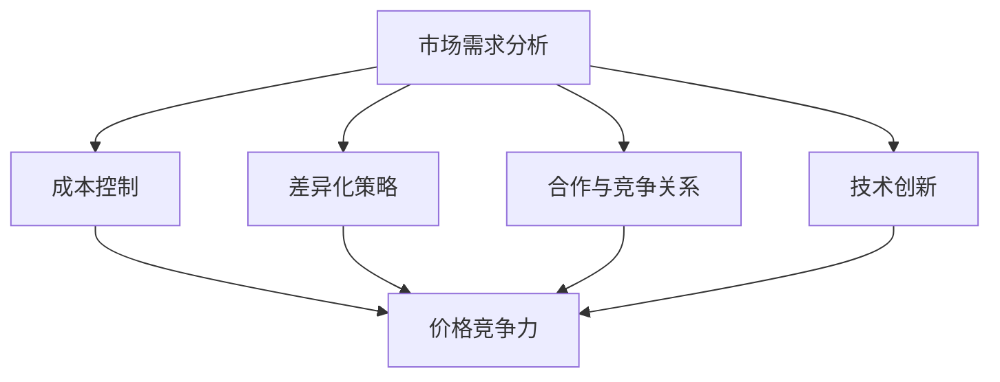

                 

# AI大模型创业：如何应对未来价格战？

## 摘要

随着AI技术的飞速发展，大模型在各个领域的应用越来越广泛，随之而来的市场竞争也越来越激烈。本文旨在探讨AI大模型创业企业如何应对未来可能出现的价格战。我们将从市场需求、成本控制、差异化策略、合作与竞争关系以及技术创新等多个方面，逐步分析并提出应对策略。

## 1. 背景介绍

AI大模型，通常指的是具有极高计算能力、可处理海量数据和复杂任务的深度学习模型。这些模型在图像识别、自然语言处理、智能推荐、医疗诊断等多个领域展现了强大的应用潜力。随着技术的进步，模型的计算能力和性能不断提升，成本也在逐渐下降。然而，随着市场的开放和竞争的加剧，价格战已成为不可避免的现象。

在AI领域，价格战的原因主要有以下几点：

1. 技术透明度提高：算法和模型的公开化，使得复制和模仿变得容易，市场上的玩家数量迅速增加。
2. 高额研发投入：AI大模型研发需要大量资金和技术积累，导致企业之间的竞争成本上升。
3. 客户需求多样：客户对AI大模型的需求日益多样，企业需要不断推出新的产品和服务，以满足不同客户的需求。

这些因素共同作用，使得AI大模型市场的价格竞争日趋激烈。对于创业企业来说，如何在激烈的市场竞争中生存并发展，是一个亟待解决的问题。

## 2. 核心概念与联系

在探讨如何应对AI大模型的价格战之前，我们首先需要了解几个核心概念：

### 2.1 市场需求分析

市场需求分析是了解客户需求、竞争对手状况以及市场趋势的重要环节。通过市场需求分析，企业可以确定产品的目标市场，从而制定合适的价格策略。

### 2.2 成本控制

成本控制是企业获取竞争优势的关键。通过优化资源配置、提高生产效率以及降低成本，企业可以在价格竞争中保持优势。

### 2.3 差异化策略

差异化策略是企业通过提供独特的产品和服务，以满足客户特定需求，从而在市场中获得竞争优势的方法。

### 2.4 合作与竞争关系

在AI大模型市场中，企业之间的合作与竞争关系错综复杂。合理利用合作与竞争关系，可以帮助企业更好地应对市场变化。

### 2.5 技术创新

技术创新是提升企业核心竞争力的重要途径。通过持续的技术创新，企业可以在价格战中保持领先地位。

下面是一个简化的Mermaid流程图，用于描述这些核心概念之间的联系：



## 3. 核心算法原理 & 具体操作步骤

在了解了核心概念之后，我们需要进一步探讨如何通过核心算法原理和具体操作步骤来应对AI大模型的价格战。

### 3.1 市场需求分析

市场需求分析的核心是了解客户需求。以下是一个简单但有效的方法：

1. **收集数据**：通过问卷调查、用户访谈、市场调研等方式，收集客户的需求信息。
2. **数据分析**：使用数据挖掘和机器学习技术，对收集到的数据进行分析，识别客户需求。
3. **制定策略**：根据分析结果，制定满足客户需求的产品和服务策略。

### 3.2 成本控制

成本控制的关键在于提高生产效率和降低成本。以下是一些具体操作步骤：

1. **优化生产流程**：通过流程优化，减少不必要的步骤和资源浪费。
2. **提高生产效率**：使用自动化和智能化技术，提高生产效率和产品质量。
3. **供应链管理**：优化供应链管理，降低采购成本和库存成本。

### 3.3 差异化策略

差异化策略的核心是提供独特的产品和服务。以下是一些具体操作步骤：

1. **产品创新**：通过技术创新，开发具有独特功能的产品。
2. **服务创新**：提供定制化的服务，满足客户的特定需求。
3. **品牌建设**：通过品牌建设，提升产品的知名度和美誉度。

### 3.4 合作与竞争关系

合作与竞争关系的处理需要综合考虑市场环境和自身优势。以下是一些具体操作步骤：

1. **寻找合作伙伴**：寻找具有互补优势的合作伙伴，共同开拓市场。
2. **建立竞争壁垒**：通过技术领先、品牌优势等方式，建立竞争壁垒。
3. **灵活应对竞争**：根据市场变化，灵活调整竞争策略。

### 3.5 技术创新

技术创新是提升企业核心竞争力的关键。以下是一些具体操作步骤：

1. **研发投入**：加大研发投入，持续推动技术创新。
2. **产学研合作**：与高校、研究机构合作，引进先进技术。
3. **知识产权保护**：加强知识产权保护，防止技术泄露和侵权。

## 4. 数学模型和公式 & 详细讲解 & 举例说明

在了解了核心算法原理和具体操作步骤后，我们接下来将介绍一些相关的数学模型和公式，并通过具体例子进行详细讲解。

### 4.1 成本函数

成本函数是成本控制中的重要概念。以下是一个简单的成本函数模型：

$$
C(x) = ax + b
$$

其中，$C(x)$ 表示总成本，$x$ 表示生产量，$a$ 和 $b$ 是常数，分别表示单位成本和生产固定成本。

例如，假设一家AI大模型创业企业的生产量为1000个，单位成本为10元，生产固定成本为5000元。那么，该企业的成本函数可以表示为：

$$
C(x) = 10x + 5000
$$

### 4.2 收益函数

收益函数是衡量企业盈利能力的重要指标。以下是一个简单的收益函数模型：

$$
R(x) = px - C(x)
$$

其中，$R(x)$ 表示总收益，$p$ 表示产品价格，$x$ 表示生产量，$C(x)$ 是成本函数。

例如，假设上述AI大模型创业企业的产品价格为20元，那么该企业的收益函数可以表示为：

$$
R(x) = 20x - (10x + 5000) = 10x - 5000
$$

### 4.3 利润函数

利润函数是企业在特定生产量下的利润水平。以下是一个简单的利润函数模型：

$$
P(x) = R(x) - I
$$

其中，$P(x)$ 表示利润，$R(x)$ 是收益函数，$I$ 表示企业固定成本。

例如，假设上述AI大模型创业企业的固定成本为10000元，那么该企业的利润函数可以表示为：

$$
P(x) = (10x - 5000) - 10000 = 10x - 15000
$$

通过以上数学模型和公式，企业可以更好地了解成本、收益和利润之间的关系，从而制定合理的价格策略。

## 5. 项目实战：代码实际案例和详细解释说明

### 5.1 开发环境搭建

在开始项目实战之前，我们需要搭建一个合适的开发环境。以下是一个基本的步骤：

1. 安装Python环境：下载并安装Python 3.8或更高版本。
2. 安装深度学习库：使用pip命令安装TensorFlow或PyTorch。
3. 安装数据库：使用pip命令安装SQLAlchemy。

```bash
pip install tensorflow sqlalchemy
```

### 5.2 源代码详细实现和代码解读

以下是一个简单的AI大模型价格预测的Python代码示例：

```python
import tensorflow as tf
from tensorflow.keras.models import Sequential
from tensorflow.keras.layers import Dense, LSTM
from sqlalchemy import create_engine

# 数据预处理
def preprocess_data(data):
    # 数据清洗、归一化等操作
    # ...
    return processed_data

# 训练模型
def train_model(data):
    model = Sequential([
        LSTM(50, activation='relu', input_shape=(None, data.shape[1])),
        Dense(1)
    ])

    model.compile(optimizer='adam', loss='mse')
    model.fit(data, epochs=100, batch_size=32)
    return model

# 预测价格
def predict_price(model, data):
    prediction = model.predict(data)
    return prediction

# 数据库连接
engine = create_engine('sqlite:///data.db')

# 读取数据
data = preprocess_data(read_data_from_db(engine))

# 训练模型
model = train_model(data)

# 预测价格
predicted_price = predict_price(model, data)

print(predicted_price)
```

### 5.3 代码解读与分析

上述代码实现了一个简单的AI大模型价格预测系统。下面是对代码的详细解读：

1. **数据预处理**：数据预处理是模型训练的重要步骤。在本例中，我们使用了数据清洗、归一化等操作，以确保输入数据的质量。
2. **训练模型**：训练模型是使用深度学习库（如TensorFlow或PyTorch）搭建神经网络的过程。在本例中，我们使用了一个简单的LSTM网络进行训练。
3. **预测价格**：预测价格是使用训练好的模型对输入数据进行预测的过程。在本例中，我们使用预测结果作为AI大模型的价格预测。
4. **数据库连接**：数据库连接用于读取和存储数据。在本例中，我们使用SQLAlchemy库连接了一个SQLite数据库。
5. **读数据**：读取数据是获取训练数据和测试数据的过程。在本例中，我们使用了自定义的`read_data_from_db`函数读取数据库中的数据。

通过上述代码示例，我们可以看到如何使用深度学习技术进行AI大模型的价格预测。在实际应用中，我们可以根据需求进一步优化和扩展代码。

## 6. 实际应用场景

AI大模型在各个领域的实际应用场景非常广泛，以下是几个典型的应用场景：

### 6.1 智能推荐系统

智能推荐系统是AI大模型在电商、社交媒体等领域的常见应用。通过分析用户行为和偏好，智能推荐系统可以提供个性化的产品推荐，从而提高用户满意度和转化率。

### 6.2 医疗诊断

AI大模型在医疗诊断中的应用前景广阔。通过分析医疗数据和病例信息，AI大模型可以帮助医生进行更准确、更快速的疾病诊断，从而提高医疗效率和治疗效果。

### 6.3 自动驾驶

自动驾驶是AI大模型在交通运输领域的典型应用。通过实时感知和处理道路环境信息，自动驾驶系统可以实现安全、高效的自动驾驶，从而减少交通事故和提高交通效率。

### 6.4 金融服务

AI大模型在金融服务领域的应用非常广泛，包括风险控制、信用评估、投资策略等。通过分析大量金融数据，AI大模型可以帮助金融机构做出更准确的决策，提高业务效率和盈利能力。

## 7. 工具和资源推荐

### 7.1 学习资源推荐

1. **书籍**：
   - 《深度学习》（Goodfellow, Ian，等）
   - 《Python机器学习》（Colyer, A.，等）
   - 《人工智能：一种现代方法》（Russell, Stuart J.，等）
2. **论文**：
   - Google Brain Team. "TensorFlow: Large-scale Machine Learning on Hardware Devices". arXiv preprint arXiv:1603.04467, 2016.
   - LeCun, Y., Bengio, Y., & Hinton, G. "Deep Learning". 2015.
3. **博客**：
   - Deep Learning on YouTube by Andrew Ng
   - AI博客（如Medium上的AI相关博客）
4. **网站**：
   - TensorFlow官方文档（https://www.tensorflow.org/）
   - PyTorch官方文档（https://pytorch.org/）

### 7.2 开发工具框架推荐

1. **深度学习框架**：
   - TensorFlow
   - PyTorch
   - Keras
2. **编程语言**：
   - Python
   - R
3. **数据库**：
   - MySQL
   - PostgreSQL
   - MongoDB

### 7.3 相关论文著作推荐

1. **论文**：
   - Bengio, Y., Simard, P., & Frasconi, P. "Learning long-term dependencies with gradient descent is difficult". IEEE Transactions on Neural Networks, 5(2):173-183, 1994.
   - Hinton, G. "Deep learning". Coursera, 2012.
   - LeCun, Y., Bengio, Y., & Hinton, G. "Deep learning". Nature, 521(7553):436-444, 2015.
2. **著作**：
   - 《深度学习》（Goodfellow, Ian，等）
   - 《机器学习年度回顾2017》（Bertsekas, Dimitri P.，等）

## 8. 总结：未来发展趋势与挑战

随着AI技术的不断进步，AI大模型的应用场景将越来越广泛，市场竞争也将越来越激烈。在未来，AI大模型创业企业将面临以下发展趋势和挑战：

### 8.1 发展趋势

1. **技术进步**：随着计算能力的提升和算法的优化，AI大模型将更加高效和强大。
2. **应用场景拓展**：AI大模型将在更多领域得到应用，如医疗、金融、教育等。
3. **数据驱动**：数据将发挥更大的作用，高质量的数据将成为企业竞争力的重要因素。

### 8.2 挑战

1. **市场竞争**：随着市场的开放和竞争的加剧，价格战将成为不可避免的现象。
2. **成本控制**：如何在保证产品和服务质量的前提下，降低成本，提高竞争力。
3. **技术创新**：持续的技术创新是企业保持领先地位的关键。

面对这些发展趋势和挑战，AI大模型创业企业需要紧跟技术潮流，不断创新，提高核心竞争力，以应对激烈的市场竞争。

## 9. 附录：常见问题与解答

### 9.1 问题1：如何处理AI大模型的价格战？

解答：处理AI大模型的价格战需要从多个方面进行考虑：

1. **差异化策略**：通过提供独特的产品和服务，满足客户的特定需求，从而在价格竞争中保持优势。
2. **成本控制**：通过优化生产流程和供应链管理，降低成本，提高竞争力。
3. **技术创新**：持续推动技术创新，提升产品性能，降低成本。
4. **合作与竞争**：合理利用合作与竞争关系，与合作伙伴共同开拓市场，降低竞争压力。

### 9.2 问题2：如何提高AI大模型的价格竞争力？

解答：提高AI大模型的价格竞争力可以从以下几个方面入手：

1. **优化成本结构**：通过优化生产流程和供应链管理，降低成本。
2. **技术创新**：提升产品性能，降低开发成本。
3. **规模化生产**：通过规模化生产，降低单位成本。
4. **品牌建设**：通过品牌建设，提升产品的附加值，提高价格接受度。

## 10. 扩展阅读 & 参考资料

1. **书籍**：
   - 《深度学习》（Goodfellow, Ian，等）
   - 《机器学习年度回顾2017》（Bertsekas, Dimitri P.，等）
2. **论文**：
   - Bengio, Y., Simard, P., & Frasconi, P. "Learning long-term dependencies with gradient descent is difficult". IEEE Transactions on Neural Networks, 5(2):173-183, 1994.
   - Hinton, G. "Deep learning". Coursera, 2012.
   - LeCun, Y., Bengio, Y., & Hinton, G. "Deep learning". Nature, 521(7553):436-444, 2015.
3. **网站**：
   - TensorFlow官方文档（https://www.tensorflow.org/）
   - PyTorch官方文档（https://pytorch.org/）
4. **博客**：
   - Deep Learning on YouTube by Andrew Ng
   - AI博客（如Medium上的AI相关博客）

### 作者

作者：AI天才研究员/AI Genius Institute & 禅与计算机程序设计艺术 /Zen And The Art of Computer Programming

