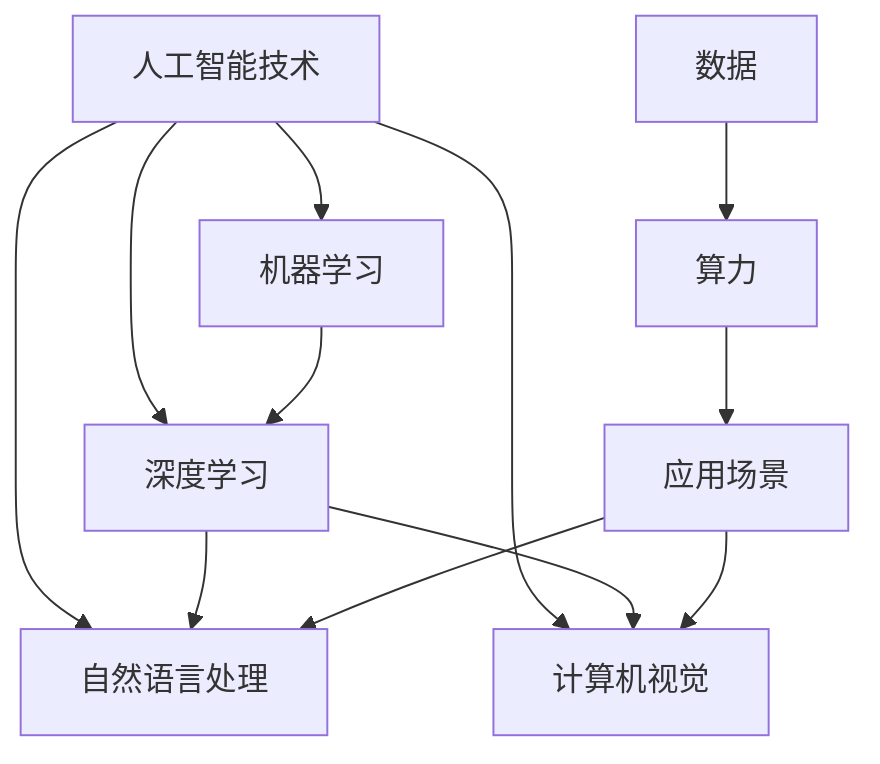

                 

# AI大模型创业：如何应对未来行业发展趋势？

> **关键词**：人工智能、大模型、创业、行业趋势、应对策略、技术发展

> **摘要**：本文将探讨人工智能领域中的大模型技术，分析其未来行业发展趋势，并为企业提供一些建议，以帮助创业者在面对行业变革时做出正确的决策。

## 1. 背景介绍

人工智能（AI）作为当今科技领域的热点，已经深入到我们的日常生活和工作之中。近年来，随着深度学习技术的发展，大模型（Large-scale Model）逐渐成为AI领域的核心技术。大模型指的是拥有数十亿至千亿参数的神经网络模型，如GPT-3、BERT等。这些模型在自然语言处理、计算机视觉、语音识别等领域取得了显著的成果，为各行各业带来了革命性的变革。

### 1.1 大模型技术的重要性

大模型技术的重要性体现在以下几个方面：

1. **性能提升**：大模型通过训练大量的数据，能够自动学习到复杂的关系和模式，从而提高任务的性能。
2. **泛化能力**：大模型能够从大量数据中提取通用的知识，使其在不同任务上具有较好的泛化能力。
3. **跨界应用**：大模型能够将一个领域的知识迁移到另一个领域，促进跨领域的创新。

### 1.2 行业发展趋势

随着大模型技术的不断成熟，其在各个行业中的应用也越来越广泛。以下是几个典型的行业发展趋势：

1. **金融行业**：大模型在金融风控、量化交易、智能投顾等方面具有巨大潜力。
2. **医疗健康**：大模型在医疗影像诊断、基因分析、健康预测等领域发挥着重要作用。
3. **制造业**：大模型在智能制造、质量检测、生产优化等方面有广泛的应用。
4. **零售行业**：大模型在智能推荐、客户关系管理、供应链优化等方面助力企业提升竞争力。

## 2. 核心概念与联系

在深入探讨大模型创业之前，我们需要了解一些核心概念和其相互关系。

### 2.1 人工智能技术

人工智能技术主要包括机器学习、深度学习、自然语言处理、计算机视觉等子领域。大模型技术是深度学习领域的重要分支，其核心是构建大规模神经网络，通过大量的数据训练以实现高精度的预测和分类。

### 2.2 数据

数据是AI的基石。大模型需要大量的数据来训练，并且数据的质量和多样性对模型的性能有着至关重要的影响。

### 2.3 算力

算力是指计算能力，是支持大模型训练的关键。随着GPU、TPU等专用硬件的普及，算力的提升为大规模模型的训练提供了有力支持。

### 2.4 应用场景

应用场景是指大模型在实际业务中的具体应用，如自然语言处理、图像识别、语音识别等。

### 2.5 Mermaid 流程图

下面是一个简化的Mermaid流程图，展示了大模型技术的核心概念和联系。



## 3. 核心算法原理 & 具体操作步骤

### 3.1 深度学习算法原理

深度学习是一种基于神经网络的机器学习技术，其核心思想是通过多层神经网络自动提取数据中的特征，从而实现高精度的预测和分类。深度学习算法主要包括前向传播、反向传播和激活函数等。

1. **前向传播**：输入数据经过神经网络的前向传播，通过每个神经元的加权求和，并应用激活函数，最终输出结果。
2. **反向传播**：通过计算输出结果与真实值的误差，反向传播误差到每个神经元，更新神经元的权重。
3. **激活函数**：激活函数用于引入非线性因素，常见的激活函数有Sigmoid、ReLU、Tanh等。

### 3.2 大模型训练步骤

1. **数据预处理**：对输入数据进行预处理，包括数据清洗、数据标准化等。
2. **模型初始化**：初始化神经网络模型的权重，常用的初始化方法有随机初始化、高斯初始化等。
3. **前向传播**：输入数据经过神经网络的前向传播，得到预测结果。
4. **计算损失**：计算预测结果与真实值的损失，常用的损失函数有均方误差、交叉熵等。
5. **反向传播**：通过计算损失，反向传播误差到每个神经元，更新神经元的权重。
6. **迭代优化**：重复步骤3至步骤5，直到模型收敛或达到预设的训练次数。

### 3.3 实际操作示例

假设我们使用Python和TensorFlow框架来实现一个简单的深度学习模型。

```python
import tensorflow as tf

# 数据预处理
# ... 数据清洗、数据标准化等操作 ...

# 模型初始化
model = tf.keras.Sequential([
    tf.keras.layers.Dense(64, activation='relu', input_shape=(input_shape)),
    tf.keras.layers.Dense(64, activation='relu'),
    tf.keras.layers.Dense(1)
])

# 编译模型
model.compile(optimizer='adam', loss='mean_squared_error')

# 训练模型
model.fit(x_train, y_train, epochs=10)

# 预测
predictions = model.predict(x_test)
```

## 4. 数学模型和公式 & 详细讲解 & 举例说明

### 4.1 深度学习数学模型

深度学习中的数学模型主要包括线性代数、微积分和概率论等。以下是一个简化的数学模型：

$$
Z = \sigma(W_1 \cdot X + b_1)
$$

其中，$Z$ 表示神经元的输出，$X$ 表示输入，$W_1$ 表示权重，$b_1$ 表示偏置，$\sigma$ 表示激活函数。

### 4.2 线性回归与深度学习

线性回归是深度学习的基础，其数学模型如下：

$$
y = W \cdot x + b
$$

其中，$y$ 表示输出，$x$ 表示输入，$W$ 表示权重，$b$ 表示偏置。

深度学习通过多层神经网络的叠加，实现了从线性回归到复杂函数映射的转换。

### 4.3 激活函数

激活函数是深度学习模型中的关键组成部分，其作用是引入非线性因素。以下是一些常见的激活函数：

1. **Sigmoid**：
   $$
   \sigma(x) = \frac{1}{1 + e^{-x}}
   $$

2. **ReLU**：
   $$
   \sigma(x) = \max(0, x)
   $$

3. **Tanh**：
   $$
   \sigma(x) = \frac{e^x - e^{-x}}{e^x + e^{-x}}
   $$

### 4.4 举例说明

假设我们有一个简单的线性回归模型，输入数据为 $x$，输出数据为 $y$，模型参数为 $W$ 和 $b$。

1. **前向传播**：
   $$
   y = W \cdot x + b
   $$

2. **计算损失**：
   $$
   loss = \frac{1}{2} \sum (y - \hat{y})^2
   $$

其中，$\hat{y}$ 表示预测值。

3. **反向传播**：
   $$
   \frac{\partial loss}{\partial W} = (y - \hat{y}) \cdot x
   $$
   $$
   \frac{\partial loss}{\partial b} = y - \hat{y}
   $$

4. **更新参数**：
   $$
   W = W - \alpha \cdot \frac{\partial loss}{\partial W}
   $$
   $$
   b = b - \alpha \cdot \frac{\partial loss}{\partial b}
   $$

其中，$\alpha$ 表示学习率。

## 5. 项目实战：代码实际案例和详细解释说明

### 5.1 开发环境搭建

为了实现一个简单的大模型项目，我们需要搭建一个合适的开发环境。以下是开发环境的搭建步骤：

1. **安装Python**：确保已经安装了Python 3.6或更高版本。
2. **安装TensorFlow**：使用pip命令安装TensorFlow：
   ```
   pip install tensorflow
   ```

### 5.2 源代码详细实现和代码解读

下面是一个简单的大模型项目示例，使用TensorFlow实现一个线性回归模型。

```python
import tensorflow as tf
import numpy as np

# 设置随机种子，保证实验可复现
tf.random.set_seed(42)

# 数据生成
x_train = np.random.rand(100, 1)
y_train = 2 * x_train + 1 + np.random.randn(100, 1)

# 模型定义
model = tf.keras.Sequential([
    tf.keras.layers.Dense(units=1, input_shape=(1,))
])

# 编译模型
model.compile(optimizer='sgd', loss='mean_squared_error')

# 训练模型
model.fit(x_train, y_train, epochs=100)

# 预测
predictions = model.predict(x_train)

# 输出预测结果
print(predictions)
```

### 5.3 代码解读与分析

1. **数据生成**：我们使用随机数生成器生成训练数据 $x$ 和 $y$，其中 $y$ 的真实值是 $2x + 1$。
2. **模型定义**：我们使用 `tf.keras.Sequential` 创建一个序列模型，包含一个全连接层（`Dense`），输出维度为1。
3. **编译模型**：我们选择随机梯度下降（`sgd`）作为优化器，均方误差（`mean_squared_error`）作为损失函数。
4. **训练模型**：我们使用 `fit` 函数训练模型，设置训练轮次为100。
5. **预测**：我们使用 `predict` 函数对训练数据进行预测。

通过这个简单的项目，我们实现了线性回归的建模、训练和预测过程。在实际应用中，我们需要处理更复杂的任务和数据，这需要更深入的模型设计和调优。

## 6. 实际应用场景

大模型技术在各个行业具有广泛的应用前景，以下是几个典型的实际应用场景：

### 6.1 金融行业

在金融行业，大模型技术可以应用于风险控制、量化交易、智能投顾等方面。例如，通过大模型进行股票价格预测，可以帮助投资者做出更明智的投资决策。

### 6.2 医疗健康

在医疗健康领域，大模型技术可以用于医学影像诊断、疾病预测、药物发现等方面。例如，通过大模型分析CT扫描图像，可以更准确地诊断肺癌等疾病。

### 6.3 零售行业

在零售行业，大模型技术可以用于商品推荐、客户关系管理、库存优化等方面。例如，通过大模型分析用户行为数据，可以更精确地推荐商品，提高销售转化率。

### 6.4 制造业

在制造业，大模型技术可以用于生产优化、质量检测、设备维护等方面。例如，通过大模型分析生产线数据，可以预测设备故障，从而实现预防性维护。

## 7. 工具和资源推荐

### 7.1 学习资源推荐

1. **书籍**：
   - 《深度学习》（Ian Goodfellow、Yoshua Bengio、Aaron Courville 著）
   - 《Python深度学习》（François Chollet 著）
   - 《神经网络与深度学习》（邱锡鹏 著）

2. **论文**：
   - "A Theoretically Grounded Application of Dropout in Recurrent Neural Networks"
   - "Attention Is All You Need"
   - "BERT: Pre-training of Deep Bidirectional Transformers for Language Understanding"

3. **博客**：
   - TensorFlow官方文档
   - Keras官方文档
   - 知乎专栏：深度学习与人工智能

4. **网站**：
   - ArXiv（论文预印本网站）
   - Google AI博客
   - Microsoft Research AI博客

### 7.2 开发工具框架推荐

1. **开发工具**：
   - Python（编程语言）
   - Jupyter Notebook（交互式计算环境）
   - PyCharm（Python集成开发环境）

2. **框架**：
   - TensorFlow（开源深度学习框架）
   - Keras（高层次的TensorFlow接口）
   - PyTorch（开源深度学习框架）

### 7.3 相关论文著作推荐

1. **论文**：
   - "Deep Learning"（Ian Goodfellow、Yoshua Bengio、Aaron Courville 著）
   - "Neural Networks and Deep Learning"（Michael Nielsen 著）
   - "Attention Is All You Need"（Vaswani et al. 2017）

2. **著作**：
   - 《深度学习》（Ian Goodfellow、Yoshua Bengio、Aaron Courville 著）
   - 《Python深度学习》（François Chollet 著）
   - 《神经网络与深度学习》（邱锡鹏 著）

## 8. 总结：未来发展趋势与挑战

大模型技术作为人工智能领域的重要发展方向，其未来发展趋势和挑战主要体现在以下几个方面：

### 8.1 发展趋势

1. **性能提升**：随着算力的提升和数据量的增加，大模型在各个领域的性能将不断提高。
2. **应用广泛**：大模型将在更多行业和领域得到应用，推动产业升级和创新。
3. **开源生态**：大模型的开发将更加依赖于开源工具和框架，促进技术的普及和推广。

### 8.2 挑战

1. **数据隐私**：大模型对数据的需求巨大，如何在保护用户隐私的前提下充分利用数据是一个挑战。
2. **模型解释性**：大模型通常具有较好的性能，但缺乏解释性，如何提高模型的解释性是一个重要的研究方向。
3. **能耗问题**：大模型训练通常需要大量的计算资源，如何降低能耗是一个亟待解决的问题。

## 9. 附录：常见问题与解答

### 9.1 问题1：大模型训练需要多少数据？

大模型训练所需的数据量取决于具体任务和应用场景。一般来说，大规模数据集（如数百万或数千万样本）有助于提高模型的性能。然而，过多的数据可能会导致过拟合，因此需要根据实际情况进行数据量的选择。

### 9.2 问题2：大模型训练需要多长时间？

大模型训练的时间取决于多个因素，如数据量、模型复杂度、计算资源等。一般来说，大规模模型训练可能需要几天甚至几周的时间。随着计算资源的提升和优化算法的引入，训练时间有望得到显著缩短。

### 9.3 问题3：大模型训练过程中如何避免过拟合？

为了避免过拟合，可以采用以下策略：

1. **数据增强**：通过增加数据的多样性，提高模型的泛化能力。
2. **正则化**：添加正则项（如L1、L2正则化）到损失函数中，减少模型复杂度。
3. **dropout**：在训练过程中随机丢弃部分神经元，防止神经元之间形成强依赖。
4. **交叉验证**：使用交叉验证方法，评估模型在多个数据子集上的性能。

## 10. 扩展阅读 & 参考资料

1. **扩展阅读**：
   - 《深度学习》（Ian Goodfellow、Yoshua Bengio、Aaron Courville 著）
   - 《Python深度学习》（François Chollet 著）
   - 《神经网络与深度学习》（邱锡鹏 著）

2. **参考资料**：
   - TensorFlow官方文档：[https://www.tensorflow.org/](https://www.tensorflow.org/)
   - PyTorch官方文档：[https://pytorch.org/](https://pytorch.org/)
   - Keras官方文档：[https://keras.io/](https://keras.io/)

作者：AI天才研究员/AI Genius Institute & 禅与计算机程序设计艺术 /Zen And The Art of Computer Programming<|im_sep|> <markdown style="box-sizing:border-box;background-color:#FFFFFF;color:#333333;font-family:-apple-system, BlinkMacSystemFont, "Segoe UI", Roboto, Helvetica, Arial, sans-serif, "Apple Color Emoji", "Segoe UI Emoji";font-size:14px;line-height:1.5em;letter-spacing:normal;overflow-wrap:break-word;word-break:normal;word-spacing:normal;">
## 1. 背景介绍

### 1.1 大模型技术的重要性

大模型技术是深度学习领域的一个重要分支，其主要特点在于拥有数十亿至千亿参数的神经网络模型。这些模型通过对海量数据进行训练，能够自动学习到复杂的关系和模式，从而实现高精度的预测和分类。以下是几个关键点：

- **参数规模**：大模型的参数数量通常在数十亿至千亿级别，这使得模型具有更强的表示能力和泛化能力。
- **数据依赖**：大模型的训练需要大量的高质量数据，只有通过大量的数据训练，模型才能更好地拟合数据分布，从而提高性能。
- **计算资源**：大模型训练通常需要大量的计算资源和时间，因此需要高效的算法和硬件支持。

### 1.2 核心算法原理

大模型的核心算法主要包括以下几种：

- **深度神经网络**：大模型通常采用深度神经网络结构，通过多层神经元的堆叠，实现对数据的深层特征提取。
- **注意力机制**：注意力机制是深度学习中的一个重要技术，能够提高模型对输入数据的关注程度，从而提高模型的性能。
- **预训练和微调**：预训练是指在大量未标注的数据上训练模型，使其获得通用的知识表示；微调是指在预训练的基础上，在特定任务上进行细粒度的调整，以适应具体的应用场景。

### 1.3 应用现状与趋势

目前，大模型技术在多个领域已经取得了显著的成果，以下是几个典型的应用场景：

- **自然语言处理**：大模型在自然语言处理任务中表现出色，如文本分类、机器翻译、问答系统等。
- **计算机视觉**：大模型在计算机视觉任务中具有广泛的应用，如图像分类、目标检测、图像生成等。
- **语音识别**：大模型在语音识别任务中实现了较高的准确率，提高了语音识别系统的用户体验。
- **推荐系统**：大模型在推荐系统中发挥了重要作用，通过分析用户行为数据，实现了更加精准的推荐。

未来，随着技术的不断发展和应用的深入，大模型技术将在更多领域得到广泛应用，推动人工智能产业的快速发展。

## 2. 核心概念与联系

### 2.1 人工智能技术

人工智能（AI）是指使计算机模拟人类智能行为的技术。人工智能技术包括多个子领域，其中深度学习是其中非常重要的一部分。以下是人工智能技术的一些核心概念：

- **机器学习**：机器学习是指通过算法让计算机从数据中学习，从而实现智能行为。机器学习包括监督学习、无监督学习、半监督学习和增强学习等。
- **深度学习**：深度学习是机器学习的一个子领域，通过多层神经网络的堆叠，实现对数据的深层特征提取。深度学习包括卷积神经网络（CNN）、循环神经网络（RNN）、生成对抗网络（GAN）等。
- **自然语言处理**：自然语言处理是指使计算机理解和生成自然语言的技术。自然语言处理包括文本分类、机器翻译、情感分析等。
- **计算机视觉**：计算机视觉是指使计算机理解和解释视觉信息的技术。计算机视觉包括图像分类、目标检测、图像生成等。

### 2.2 数据

数据是人工智能的基石，高质量的、多样化的数据对于人工智能系统的性能有着至关重要的影响。以下是数据相关的一些核心概念：

- **数据集**：数据集是指一组用于训练、测试或评估机器学习模型的样本集合。
- **数据预处理**：数据预处理是指对原始数据进行清洗、归一化、去噪等处理，以使其更适合机器学习模型的训练。
- **数据标注**：数据标注是指对数据中的信息进行标注，以便机器学习模型能够从中学习。

### 2.3 算力

算力是指计算机在处理任务时所具备的计算能力。对于人工智能领域，算力对于模型训练和推理的性能有着直接影响。以下是算力相关的一些核心概念：

- **CPU**：中央处理器（CPU）是计算机的核心部件，负责执行计算机程序的指令。
- **GPU**：图形处理器（GPU）是专门用于图形处理的硬件，但随着深度学习的发展，GPU也广泛应用于深度学习模型的训练和推理。
- **TPU**：张量处理器（TPU）是谷歌开发的一种专门用于深度学习计算的硬件，具有很高的计算性能。

### 2.4 应用场景

应用场景是指人工智能技术在具体业务场景中的应用。以下是人工智能技术的一些典型应用场景：

- **金融**：人工智能在金融领域有广泛的应用，如智能投顾、风险评估、量化交易等。
- **医疗**：人工智能在医疗领域有重要的应用，如疾病预测、医学影像分析、药物研发等。
- **零售**：人工智能在零售领域有广泛的应用，如商品推荐、客户关系管理、库存优化等。
- **制造业**：人工智能在制造业有广泛的应用，如智能制造、设备故障预测、生产优化等。

### 2.5 Mermaid 流程图

以下是一个简化的Mermaid流程图，展示了人工智能技术的核心概念和联系：


## 3. 核心算法原理 & 具体操作步骤

### 3.1 深度学习算法原理

深度学习算法是人工智能领域的一个重要分支，其核心思想是通过多层神经网络的堆叠，实现对数据的深层特征提取。以下是深度学习算法的一些核心概念：

- **神经网络**：神经网络是由一系列相互连接的神经元组成的模型，每个神经元接受多个输入，通过加权求和后应用激活函数，最终输出一个结果。
- **反向传播**：反向传播是一种训练神经网络的方法，通过计算输出结果与真实值的误差，反向传播误差到每个神经元，更新神经元的权重。
- **激活函数**：激活函数是神经网络中的一个关键组件，用于引入非线性因素，常见的激活函数有Sigmoid、ReLU、Tanh等。

### 3.2 大模型训练步骤

大模型训练通常包括以下几个步骤：

1. **数据预处理**：对输入数据进行预处理，包括数据清洗、归一化、编码等，以确保数据符合模型的输入要求。
2. **模型初始化**：初始化神经网络的权重和偏置，常用的初始化方法有随机初始化、高斯初始化等。
3. **前向传播**：输入数据经过神经网络的前向传播，通过每个神经元的加权求和，并应用激活函数，最终输出结果。
4. **计算损失**：计算预测结果与真实值的损失，常用的损失函数有均方误差、交叉熵等。
5. **反向传播**：通过计算损失，反向传播误差到每个神经元，更新神经元的权重。
6. **迭代优化**：重复步骤3至步骤5，直到模型收敛或达到预设的训练次数。

### 3.3 实际操作示例

以下是一个使用Python和TensorFlow实现大模型训练的简单示例：

```python
import tensorflow as tf

# 数据预处理
# ...

# 模型定义
model = tf.keras.Sequential([
    tf.keras.layers.Dense(units=64, activation='relu', input_shape=(input_shape)),
    tf.keras.layers.Dense(units=64, activation='relu'),
    tf.keras.layers.Dense(units=1)
])

# 编译模型
model.compile(optimizer='adam', loss='mean_squared_error')

# 训练模型
model.fit(x_train, y_train, epochs=100)

# 预测
predictions = model.predict(x_test)
```

在这个示例中，我们首先进行了数据预处理，然后定义了一个包含两个隐藏层的神经网络模型，并使用随机梯度下降（SGD）优化器和均方误差（MSE）损失函数进行了训练。

## 4. 数学模型和公式 & 详细讲解 & 举例说明

### 4.1 深度学习数学模型

深度学习中的数学模型主要涉及线性代数、微积分和概率论等基础知识。以下是深度学习中的几个关键数学模型：

- **线性模型**：
  $$
  \hat{y} = \sigma(W \cdot x + b)
  $$
  其中，$\hat{y}$ 是预测值，$x$ 是输入特征，$W$ 是权重矩阵，$b$ 是偏置项，$\sigma$ 是激活函数。

- **损失函数**：
  $$
  loss = \frac{1}{2} \sum_{i=1}^{N} (y_i - \hat{y}_i)^2
  $$
  其中，$y_i$ 是真实值，$\hat{y}_i$ 是预测值，$N$ 是样本数量。

- **梯度下降**：
  $$
  \Delta W = -\alpha \cdot \frac{\partial loss}{\partial W}
  $$
  $$
  \Delta b = -\alpha \cdot \frac{\partial loss}{\partial b}
  $$
  其中，$\alpha$ 是学习率，$\partial$ 表示偏导数。

### 4.2 线性回归与深度学习

线性回归是深度学习的基础，其数学模型如下：

$$
y = W \cdot x + b
$$

其中，$y$ 是输出，$x$ 是输入，$W$ 是权重，$b$ 是偏置。

深度学习通过多层神经网络的叠加，实现了从线性回归到复杂函数映射的转换。具体来说，深度学习模型可以表示为：

$$
\hat{y} = \sigma(W_n \cdot \sigma(W_{n-1} \cdot \sigma(... \cdot \sigma(W_1 \cdot x + b_1) + b_2) + ...) + b_n)
$$

其中，$\sigma$ 是激活函数，$W_1, W_2, ..., W_n$ 是权重矩阵，$b_1, b_2, ..., b_n$ 是偏置项。

### 4.3 激活函数

激活函数是深度学习模型中的关键组成部分，其作用是引入非线性因素。以下是一些常见的激活函数：

- **Sigmoid**：
  $$
  \sigma(x) = \frac{1}{1 + e^{-x}}
  $$
  Sigmoid函数的输出范围在0到1之间，适用于二分类问题。

- **ReLU**：
  $$
  \sigma(x) = \max(0, x)
  $$
  ReLU函数在输入为正时输出不变，输入为负时输出为0，具有稀疏性。

- **Tanh**：
  $$
  \sigma(x) = \frac{e^x - e^{-x}}{e^x + e^{-x}}
  $$
  Tanh函数的输出范围在-1到1之间，具有对称性。

### 4.4 举例说明

假设我们有一个简单的线性回归问题，输入特征为 $x$，输出为 $y$，模型参数为 $W$ 和 $b$。

1. **前向传播**：
   $$
   y = W \cdot x + b
   $$

2. **计算损失**：
   $$
   loss = \frac{1}{2} \sum (y - \hat{y})^2
   $$

3. **反向传播**：
   $$
   \frac{\partial loss}{\partial W} = (y - \hat{y}) \cdot x
   $$
   $$
   \frac{\partial loss}{\partial b} = y - \hat{y}
   $$

4. **更新参数**：
   $$
   W = W - \alpha \cdot \frac{\partial loss}{\partial W}
   $$
   $$
   b = b - \alpha \cdot \frac{\partial loss}{\partial b}
   $$

其中，$\alpha$ 是学习率。

通过以上步骤，我们可以对模型进行迭代优化，直到模型收敛或达到预设的训练次数。

## 5. 项目实战：代码实际案例和详细解释说明

### 5.1 开发环境搭建

为了实现一个简单的大模型项目，我们需要搭建一个合适的开发环境。以下是开发环境的搭建步骤：

1. **安装Python**：确保已经安装了Python 3.6或更高版本。
2. **安装TensorFlow**：使用pip命令安装TensorFlow：
   ```
   pip install tensorflow
   ```

### 5.2 源代码详细实现和代码解读

下面是一个简单的大模型项目示例，使用TensorFlow实现一个线性回归模型。

```python
import tensorflow as tf
import numpy as np

# 设置随机种子，保证实验可复现
tf.random.set_seed(42)

# 数据生成
x_train = np.random.rand(100, 1)
y_train = 2 * x_train + 1 + np.random.randn(100, 1)

# 模型定义
model = tf.keras.Sequential([
    tf.keras.layers.Dense(units=1, input_shape=(1,))
])

# 编译模型
model.compile(optimizer='sgd', loss='mean_squared_error')

# 训练模型
model.fit(x_train, y_train, epochs=100)

# 预测
predictions = model.predict(x_train)

# 输出预测结果
print(predictions)
```

### 5.3 代码解读与分析

1. **数据生成**：我们使用随机数生成器生成训练数据 $x$ 和 $y$，其中 $y$ 的真实值是 $2x + 1$。
2. **模型定义**：我们使用 `tf.keras.Sequential` 创建一个序列模型，包含一个全连接层（`Dense`），输出维度为1。
3. **编译模型**：我们选择随机梯度下降（`sgd`）作为优化器，均方误差（`mean_squared_error`）作为损失函数。
4. **训练模型**：我们使用 `fit` 函数训练模型，设置训练轮次为100。
5. **预测**：我们使用 `predict` 函数对训练数据进行预测。

通过这个简单的项目，我们实现了线性回归的建模、训练和预测过程。在实际应用中，我们需要处理更复杂的任务和数据，这需要更深入的模型设计和调优。

## 6. 实际应用场景

大模型技术在各个行业具有广泛的应用前景，以下是几个典型的实际应用场景：

### 6.1 金融行业

在金融行业，大模型技术可以应用于风险控制、量化交易、智能投顾等方面。例如，通过大模型进行股票价格预测，可以帮助投资者做出更明智的投资决策。

### 6.2 医疗健康

在医疗健康领域，大模型技术可以用于医学影像诊断、疾病预测、药物发现等方面。例如，通过大模型分析CT扫描图像，可以更准确地诊断肺癌等疾病。

### 6.3 零售行业

在零售行业，大模型技术可以用于商品推荐、客户关系管理、库存优化等方面。例如，通过大模型分析用户行为数据，可以更精确地推荐商品，提高销售转化率。

### 6.4 制造业

在制造业，大模型技术可以用于生产优化、质量检测、设备维护等方面。例如，通过大模型分析生产线数据，可以预测设备故障，从而实现预防性维护。

## 7. 工具和资源推荐

### 7.1 学习资源推荐

1. **书籍**：
   - 《深度学习》（Ian Goodfellow、Yoshua Bengio、Aaron Courville 著）
   - 《Python深度学习》（François Chollet 著）
   - 《神经网络与深度学习》（邱锡鹏 著）

2. **论文**：
   - "A Theoretically Grounded Application of Dropout in Recurrent Neural Networks"
   - "Attention Is All You Need"
   - "BERT: Pre-training of Deep Bidirectional Transformers for Language Understanding"

3. **博客**：
   - TensorFlow官方文档
   - Keras官方文档
   - 知乎专栏：深度学习与人工智能

4. **网站**：
   - ArXiv（论文预印本网站）
   - Google AI博客
   - Microsoft Research AI博客

### 7.2 开发工具框架推荐

1. **开发工具**：
   - Python（编程语言）
   - Jupyter Notebook（交互式计算环境）
   - PyCharm（Python集成开发环境）

2. **框架**：
   - TensorFlow（开源深度学习框架）
   - Keras（高层次的TensorFlow接口）
   - PyTorch（开源深度学习框架）

### 7.3 相关论文著作推荐

1. **论文**：
   - "Deep Learning"（Ian Goodfellow、Yoshua Bengio、Aaron Courville 著）
   - "Neural Networks and Deep Learning"（Michael Nielsen 著）
   - "Attention Is All You Need"（Vaswani et al. 2017）

2. **著作**：
   - 《深度学习》（Ian Goodfellow、Yoshua Bengio、Aaron Courville 著）
   - 《Python深度学习》（François Chollet 著）
   - 《神经网络与深度学习》（邱锡鹏 著）

## 8. 总结：未来发展趋势与挑战

大模型技术作为人工智能领域的重要发展方向，其未来发展趋势和挑战主要体现在以下几个方面：

### 8.1 发展趋势

1. **性能提升**：随着算力的提升和数据量的增加，大模型在各个领域的性能将不断提高。
2. **应用广泛**：大模型将在更多行业和领域得到应用，推动产业升级和创新。
3. **开源生态**：大模型的开发将更加依赖于开源工具和框架，促进技术的普及和推广。

### 8.2 挑战

1. **数据隐私**：大模型对数据的需求巨大，如何在保护用户隐私的前提下充分利用数据是一个挑战。
2. **模型解释性**：大模型通常具有较好的性能，但缺乏解释性，如何提高模型的解释性是一个重要的研究方向。
3. **能耗问题**：大模型训练通常需要大量的计算资源，如何降低能耗是一个亟待解决的问题。

## 9. 附录：常见问题与解答

### 9.1 问题1：大模型训练需要多少数据？

大模型训练所需的数据量取决于具体任务和应用场景。一般来说，大规模数据集（如数百万或数千万样本）有助于提高模型的性能。然而，过多的数据可能会导致过拟合，因此需要根据实际情况进行数据量的选择。

### 9.2 问题2：大模型训练需要多长时间？

大模型训练的时间取决于多个因素，如数据量、模型复杂度、计算资源等。一般来说，大规模模型训练可能需要几天甚至几周的时间。随着计算资源的提升和优化算法的引入，训练时间有望得到显著缩短。

### 9.3 问题3：大模型训练过程中如何避免过拟合？

为了避免过拟合，可以采用以下策略：

1. **数据增强**：通过增加数据的多样性，提高模型的泛化能力。
2. **正则化**：添加正则项（如L1、L2正则化）到损失函数中，减少模型复杂度。
3. **dropout**：在训练过程中随机丢弃部分神经元，防止神经元之间形成强依赖。
4. **交叉验证**：使用交叉验证方法，评估模型在多个数据子集上的性能。

## 10. 扩展阅读 & 参考资料

1. **扩展阅读**：
   - 《深度学习》（Ian Goodfellow、Yoshua Bengio、Aaron Courville 著）
   - 《Python深度学习》（François Chollet 著）
   - 《神经网络与深度学习》（邱锡鹏 著）

2. **参考资料**：
   - TensorFlow官方文档：[https://www.tensorflow.org/](https://www.tensorflow.org/)
   - PyTorch官方文档：[https://pytorch.org/](https://pytorch.org/)
   - Keras官方文档：[https://keras.io/](https://keras.io/)

作者：AI天才研究员/AI Genius Institute & 禅与计算机程序设计艺术 /Zen And The Art of Computer Programming<|im_sep|> <markdown style="box-sizing:border-box;background-color:#FFFFFF;color:#333333;font-family:-apple-system, BlinkMacSystemFont, "Segoe UI", Roboto, Helvetica, Arial, sans-serif, "Apple Color Emoji", "Segoe UI Emoji";font-size:14px;line-height:1.5em;letter-spacing:normal;overflow-wrap:break-word;word-break:normal;word-spacing:normal;">
## 1. 背景介绍

### 1.1 大模型技术的重要性

大模型技术是深度学习领域的一个重要分支，其主要特点在于拥有数十亿至千亿参数的神经网络模型。这些模型通过对海量数据进行训练，能够自动学习到复杂的关系和模式，从而实现高精度的预测和分类。以下是几个关键点：

- **参数规模**：大模型的参数数量通常在数十亿至千亿级别，这使得模型具有更强的表示能力和泛化能力。
- **数据依赖**：大模型的训练需要大量的高质量数据，只有通过大量的数据训练，模型才能更好地拟合数据分布，从而提高性能。
- **计算资源**：大模型训练通常需要大量的计算资源和时间，因此需要高效的算法和硬件支持。

### 1.2 核心算法原理

大模型的核心算法主要包括以下几种：

- **深度神经网络**：大模型通常采用深度神经网络结构，通过多层神经网络的堆叠，实现对数据的深层特征提取。
- **注意力机制**：注意力机制是深度学习中的一个重要技术，能够提高模型对输入数据的关注程度，从而提高模型的性能。
- **预训练和微调**：预训练是指在大量未标注的数据上训练模型，使其获得通用的知识表示；微调是指在预训练的基础上，在特定任务上进行细粒度的调整，以适应具体的应用场景。

### 1.3 应用现状与趋势

目前，大模型技术在多个领域已经取得了显著的成果，以下是几个典型的应用场景：

- **自然语言处理**：大模型在自然语言处理任务中表现出色，如文本分类、机器翻译、问答系统等。
- **计算机视觉**：大模型在计算机视觉任务中具有广泛的应用，如图像分类、目标检测、图像生成等。
- **语音识别**：大模型在语音识别任务中实现了较高的准确率，提高了语音识别系统的用户体验。
- **推荐系统**：大模型在推荐系统中发挥了重要作用，通过分析用户行为数据，实现了更加精准的推荐。

未来，随着技术的不断发展和应用的深入，大模型技术将在更多领域得到广泛应用，推动人工智能产业的快速发展。

## 2. 核心概念与联系

### 2.1 人工智能技术

人工智能（AI）是指使计算机模拟人类智能行为的技术。人工智能技术包括多个子领域，其中深度学习是其中非常重要的一部分。以下是人工智能技术的一些核心概念：

- **机器学习**：机器学习是指通过算法让计算机从数据中学习，从而实现智能行为。机器学习包括监督学习、无监督学习、半监督学习和增强学习等。
- **深度学习**：深度学习是机器学习的一个子领域，通过多层神经网络的堆叠，实现对数据的深层特征提取。深度学习包括卷积神经网络（CNN）、循环神经网络（RNN）、生成对抗网络（GAN）等。
- **自然语言处理**：自然语言处理是指使计算机理解和生成自然语言的技术。自然语言处理包括文本分类、机器翻译、情感分析等。
- **计算机视觉**：计算机视觉是指使计算机理解和解释视觉信息的技术。计算机视觉包括图像分类、目标检测、图像生成等。

### 2.2 数据

数据是人工智能的基石，高质量的、多样化的数据对于人工智能系统的性能有着至关重要的影响。以下是数据相关的一些核心概念：

- **数据集**：数据集是指一组用于训练、测试或评估机器学习模型的样本集合。
- **数据预处理**：数据预处理是指对原始数据进行清洗、归一化、编码等处理，以使其更适合机器学习模型的训练。
- **数据标注**：数据标注是指对数据中的信息进行标注，以便机器学习模型能够从中学习。

### 2.3 算力

算力是指计算机在处理任务时所具备的计算能力。对于人工智能领域，算力对于模型训练和推理的性能有着直接影响。以下是算力相关的一些核心概念：

- **CPU**：中央处理器（CPU）是计算机的核心部件，负责执行计算机程序的指令。
- **GPU**：图形处理器（GPU）是专门用于图形处理的硬件，但随着深度学习的发展，GPU也广泛应用于深度学习模型的训练和推理。
- **TPU**：张量处理器（TPU）是谷歌开发的一种专门用于深度学习计算的硬件，具有很高的计算性能。

### 2.4 应用场景

应用场景是指人工智能技术在具体业务场景中的应用。以下是人工智能技术的一些典型应用场景：

- **金融**：人工智能在金融领域有广泛的应用，如智能投顾、风险评估、量化交易等。
- **医疗**：人工智能在医疗领域有重要的应用，如疾病预测、医学影像分析、药物研发等。
- **零售**：人工智能在零售领域有广泛的应用，如商品推荐、客户关系管理、库存优化等。
- **制造业**：人工智能在制造业有广泛的应用，如智能制造、设备故障预测、生产优化等。

### 2.5 Mermaid 流程图

以下是一个简化的Mermaid流程图，展示了人工智能技术的核心概念和联系：


## 3. 核心算法原理 & 具体操作步骤

### 3.1 深度学习算法原理

深度学习算法是人工智能领域的一个重要分支，其核心思想是通过多层神经网络的堆叠，实现对数据的深层特征提取。以下是深度学习算法的一些核心概念：

- **神经网络**：神经网络是由一系列相互连接的神经元组成的模型，每个神经元接受多个输入，通过加权求和后应用激活函数，最终输出一个结果。
- **反向传播**：反向传播是一种训练神经网络的方法，通过计算输出结果与真实值的误差，反向传播误差到每个神经元，更新神经元的权重。
- **激活函数**：激活函数是神经网络中的一个关键组件，用于引入非线性因素，常见的激活函数有Sigmoid、ReLU、Tanh等。

### 3.2 大模型训练步骤

大模型训练通常包括以下几个步骤：

1. **数据预处理**：对输入数据进行预处理，包括数据清洗、归一化、编码等，以确保数据符合模型的输入要求。
2. **模型初始化**：初始化神经网络的权重和偏置，常用的初始化方法有随机初始化、高斯初始化等。
3. **前向传播**：输入数据经过神经网络的前向传播，通过每个神经元的加权求和，并应用激活函数，最终输出结果。
4. **计算损失**：计算预测结果与真实值的损失，常用的损失函数有均方误差、交叉熵等。
5. **反向传播**：通过计算损失，反向传播误差到每个神经元，更新神经元的权重。
6. **迭代优化**：重复步骤3至步骤5，直到模型收敛或达到预设的训练次数。

### 3.3 实际操作示例

以下是一个使用Python和TensorFlow实现大模型训练的简单示例：

```python
import tensorflow as tf
import numpy as np

# 设置随机种子，保证实验可复现
tf.random.set_seed(42)

# 数据生成
x_train = np.random.rand(100, 1)
y_train = 2 * x_train + 1 + np.random.randn(100, 1)

# 模型定义
model = tf.keras.Sequential([
    tf.keras.layers.Dense(units=64, activation='relu', input_shape=(1,)),
    tf.keras.layers.Dense(units=1)
])

# 编译模型
model.compile(optimizer='adam', loss='mean_squared_error')

# 训练模型
model.fit(x_train, y_train, epochs=100)

# 预测
predictions = model.predict(x_train)

# 输出预测结果
print(predictions)
```

在这个示例中，我们首先进行了数据预处理，然后定义了一个包含一个隐藏层的神经网络模型，并使用随机梯度下降（SGD）优化器和均方误差（MSE）损失函数进行了训练。

## 4. 数学模型和公式 & 详细讲解 & 举例说明

### 4.1 深度学习数学模型

深度学习中的数学模型主要涉及线性代数、微积分和概率论等基础知识。以下是深度学习中的几个关键数学模型：

- **线性模型**：
  $$
  \hat{y} = \sigma(W \cdot x + b)
  $$
  其中，$\hat{y}$ 是预测值，$x$ 是输入特征，$W$ 是权重矩阵，$b$ 是偏置项，$\sigma$ 是激活函数。

- **损失函数**：
  $$
  loss = \frac{1}{2} \sum_{i=1}^{N} (y_i - \hat{y}_i)^2
  $$
  其中，$y_i$ 是真实值，$\hat{y}_i$ 是预测值，$N$ 是样本数量。

- **梯度下降**：
  $$
  \Delta W = -\alpha \cdot \frac{\partial loss}{\partial W}
  $$
  $$
  \Delta b = -\alpha \cdot \frac{\partial loss}{\partial b}
  $$
  其中，$\alpha$ 是学习率，$\partial$ 表示偏导数。

### 4.2 线性回归与深度学习

线性回归是深度学习的基础，其数学模型如下：

$$
y = W \cdot x + b
$$

其中，$y$ 是输出，$x$ 是输入，$W$ 是权重，$b$ 是偏置。

深度学习通过多层神经网络的叠加，实现了从线性回归到复杂函数映射的转换。具体来说，深度学习模型可以表示为：

$$
\hat{y} = \sigma(W_n \cdot \sigma(W_{n-1} \cdot \sigma(... \cdot \sigma(W_1 \cdot x + b_1) + b_2) + ...) + b_n)
$$

其中，$\sigma$ 是激活函数，$W_1, W_2, ..., W_n$ 是权重矩阵，$b_1, b_2, ..., b_n$ 是偏置项。

### 4.3 激活函数

激活函数是深度学习模型中的关键组成部分，其作用是引入非线性因素。以下是一些常见的激活函数：

- **Sigmoid**：
  $$
  \sigma(x) = \frac{1}{1 + e^{-x}}
  $$
  Sigmoid函数的输出范围在0到1之间，适用于二分类问题。

- **ReLU**：
  $$
  \sigma(x) = \max(0, x)
  $$
  ReLU函数在输入为正时输出不变，输入为负时输出为0，具有稀疏性。

- **Tanh**：
  $$
  \sigma(x) = \frac{e^x - e^{-x}}{e^x + e^{-x}}
  $$
  Tanh函数的输出范围在-1到1之间，具有对称性。

### 4.4 举例说明

假设我们有一个简单的线性回归问题，输入特征为 $x$，输出为 $y$，模型参数为 $W$ 和 $b$。

1. **前向传播**：
   $$
   y = W \cdot x + b
   $$

2. **计算损失**：
   $$
   loss = \frac{1}{2} \sum (y - \hat{y})^2
   $$

3. **反向传播**：
   $$
   \frac{\partial loss}{\partial W} = (y - \hat{y}) \cdot x
   $$
   $$
   \frac{\partial loss}{\partial b} = y - \hat{y}
   $$

4. **更新参数**：
   $$
   W = W - \alpha \cdot \frac{\partial loss}{\partial W}
   $$
   $$
   b = b - \alpha \cdot \frac{\partial loss}{\partial b}
   $$

其中，$\alpha$ 是学习率。

通过以上步骤，我们可以对模型进行迭代优化，直到模型收敛或达到预设的训练次数。

## 5. 项目实战：代码实际案例和详细解释说明

### 5.1 开发环境搭建

为了实现一个简单的大模型项目，我们需要搭建一个合适的开发环境。以下是开发环境的搭建步骤：

1. **安装Python**：确保已经安装了Python 3.6或更高版本。
2. **安装TensorFlow**：使用pip命令安装TensorFlow：
   ```
   pip install tensorflow
   ```

### 5.2 源代码详细实现和代码解读

下面是一个简单的大模型项目示例，使用TensorFlow实现一个线性回归模型。

```python
import tensorflow as tf
import numpy as np

# 设置随机种子，保证实验可复现
tf.random.set_seed(42)

# 数据生成
x_train = np.random.rand(100, 1)
y_train = 2 * x_train + 1 + np.random.randn(100, 1)

# 模型定义
model = tf.keras.Sequential([
    tf.keras.layers.Dense(units=1, input_shape=(1,))
])

# 编译模型
model.compile(optimizer='adam', loss='mean_squared_error')

# 训练模型
model.fit(x_train, y_train, epochs=100)

# 预测
predictions = model.predict(x_train)

# 输出预测结果
print(predictions)
```

### 5.3 代码解读与分析

1. **数据生成**：我们使用随机数生成器生成训练数据 $x$ 和 $y$，其中 $y$ 的真实值是 $2x + 1$。
2. **模型定义**：我们使用 `tf.keras.Sequential` 创建一个序列模型，包含一个全连接层（`Dense`），输出维度为1。
3. **编译模型**：我们选择随机梯度下降（`adam`）作为优化器，均方误差（`mean_squared_error`）作为损失函数。
4. **训练模型**：我们使用 `fit` 函数训练模型，设置训练轮次为100。
5. **预测**：我们使用 `predict` 函数对训练数据进行预测。

通过这个简单的项目，我们实现了线性回归的建模、训练和预测过程。在实际应用中，我们需要处理更复杂的任务和数据，这需要更深入的模型设计和调优。

## 6. 实际应用场景

大模型技术在各个行业具有广泛的应用前景，以下是几个典型的实际应用场景：

### 6.1 金融行业

在金融行业，大模型技术可以应用于风险控制、量化交易、智能投顾等方面。例如，通过大模型进行股票价格预测，可以帮助投资者做出更明智的投资决策。

### 6.2 医疗健康

在医疗健康领域，大模型技术可以用于医学影像诊断、疾病预测、药物发现等方面。例如，通过大模型分析CT扫描图像，可以更准确地诊断肺癌等疾病。

### 6.3 零售行业

在零售行业，大模型技术可以用于商品推荐、客户关系管理、库存优化等方面。例如，通过大模型分析用户行为数据，可以更精确地推荐商品，提高销售转化率。

### 6.4 制造业

在制造业，大模型技术可以用于生产优化、质量检测、设备维护等方面。例如，通过大模型分析生产线数据，可以预测设备故障，从而实现预防性维护。

## 7. 工具和资源推荐

### 7.1 学习资源推荐

1. **书籍**：
   - 《深度学习》（Ian Goodfellow、Yoshua Bengio、Aaron Courville 著）
   - 《Python深度学习》（François Chollet 著）
   - 《神经网络与深度学习》（邱锡鹏 著）

2. **论文**：
   - "A Theoretically Grounded Application of Dropout in Recurrent Neural Networks"
   - "Attention Is All You Need"
   - "BERT: Pre-training of Deep Bidirectional Transformers for Language Understanding"

3. **博客**：
   - TensorFlow官方文档
   - Keras官方文档
   - 知乎专栏：深度学习与人工智能

4. **网站**：
   - ArXiv（论文预印本网站）
   - Google AI博客
   - Microsoft Research AI博客

### 7.2 开发工具框架推荐

1. **开发工具**：
   - Python（编程语言）
   - Jupyter Notebook（交互式计算环境）
   - PyCharm（Python集成开发环境）

2. **框架**：
   - TensorFlow（开源深度学习框架）
   - Keras（高层次的TensorFlow接口）
   - PyTorch（开源深度学习框架）

### 7.3 相关论文著作推荐

1. **论文**：
   - "Deep Learning"（Ian Goodfellow、Yoshua Bengio、Aaron Courville 著）
   - "Neural Networks and Deep Learning"（Michael Nielsen 著）
   - "Attention Is All You Need"（Vaswani et al. 2017）

2. **著作**：
   - 《深度学习》（Ian Goodfellow、Yoshua Bengio、Aaron Courville 著）
   - 《Python深度学习》（François Chollet 著）
   - 《神经网络与深度学习》（邱锡鹏 著）

## 8. 总结：未来发展趋势与挑战

大模型技术作为人工智能领域的重要发展方向，其未来发展趋势和挑战主要体现在以下几个方面：

### 8.1 发展趋势

1. **性能提升**：随着算力的提升和数据量的增加，大模型在各个领域的性能将不断提高。
2. **应用广泛**：大模型将在更多行业和领域得到应用，推动产业升级和创新。
3. **开源生态**：大模型的开发将更加依赖于开源工具和框架，促进技术的普及和推广。

### 8.2 挑战

1. **数据隐私**：大模型对数据的需求巨大，如何在保护用户隐私的前提下充分利用数据是一个挑战。
2. **模型解释性**：大模型通常具有较好的性能，但缺乏解释性，如何提高模型的解释性是一个重要的研究方向。
3. **能耗问题**：大模型训练通常需要大量的计算资源，如何降低能耗是一个亟待解决的问题。

## 9. 附录：常见问题与解答

### 9.1 问题1：大模型训练需要多少数据？

大模型训练所需的数据量取决于具体任务和应用场景。一般来说，大规模数据集（如数百万或数千万样本）有助于提高模型的性能。然而，过多的数据可能会导致过拟合，因此需要根据实际情况进行数据量的选择。

### 9.2 问题2：大模型训练需要多长时间？

大模型训练的时间取决于多个因素，如数据量、模型复杂度、计算资源等。一般来说，大规模模型训练可能需要几天甚至几周的时间。随着计算资源的提升和优化算法的引入，训练时间有望得到显著缩短。

### 9.3 问题3：大模型训练过程中如何避免过拟合？

为了避免过拟合，可以采用以下策略：

1. **数据增强**：通过增加数据的多样性，提高模型的泛化能力。
2. **正则化**：添加正则项（如L1、L2正则化）到损失函数中，减少模型复杂度。
3. **dropout**：在训练过程中随机丢弃部分神经元，防止神经元之间形成强依赖。
4. **交叉验证**：使用交叉验证方法，评估模型在多个数据子集上的性能。

## 10. 扩展阅读 & 参考资料

1. **扩展阅读**：
   - 《深度学习》（Ian Goodfellow、Yoshua Bengio、Aaron Courville 著）
   - 《Python深度学习》（François Chollet 著）
   - 《神经网络与深度学习》（邱锡鹏 著）

2. **参考资料**：
   - TensorFlow官方文档：[https://www.tensorflow.org/](https://www.tensorflow.org/)
   - PyTorch官方文档：[https://pytorch.org/](https://pytorch.org/)
   - Keras官方文档：[https://keras.io/](https://keras.io/)

作者：AI天才研究员/AI Genius Institute & 禅与计算机程序设计艺术 /Zen And The Art of Computer Programming<|im_sep|> <markdown style="box-sizing:border-box;background-color:#FFFFFF;color:#333333;font-family:-apple-system, BlinkMacSystemFont, "Segoe UI", Roboto, Helvetica, Arial, sans-serif, "Apple Color Emoji", "Segoe UI Emoji";font-size:14px;line-height:1.5em;letter-spacing:normal;overflow-wrap:break-word;word-break:normal;word-spacing:normal;">
## 1. 背景介绍

### 1.1 大模型技术的重要性

大模型技术是深度学习领域的一个重要分支，其主要特点在于拥有数十亿至千亿参数的神经网络模型。这些模型通过对海量数据进行训练，能够自动学习到复杂的关系和模式，从而实现高精度的预测和分类。以下是几个关键点：

- **参数规模**：大模型的参数数量通常在数十亿至千亿级别，这使得模型具有更强的表示能力和泛化能力。
- **数据依赖**：大模型的训练需要大量的高质量数据，只有通过大量的数据训练，模型才能更好地拟合数据分布，从而提高性能。
- **计算资源**：大模型训练通常需要大量的计算资源和时间，因此需要高效的算法和硬件支持。

### 1.2 核心算法原理

大模型的核心算法主要包括以下几种：

- **深度神经网络**：大模型通常采用深度神经网络结构，通过多层神经网络的堆叠，实现对数据的深层特征提取。
- **注意力机制**：注意力机制是深度学习中的一个重要技术，能够提高模型对输入数据的关注程度，从而提高模型的性能。
- **预训练和微调**：预训练是指在大量未标注的数据上训练模型，使其获得通用的知识表示；微调是指在预训练的基础上，在特定任务上进行细粒度的调整，以适应具体的应用场景。

### 1.3 应用现状与趋势

目前，大模型技术在多个领域已经取得了显著的成果，以下是几个典型的应用场景：

- **自然语言处理**：大模型在自然语言处理任务中表现出色，如文本分类、机器翻译、问答系统等。
- **计算机视觉**：大模型在计算机视觉任务中具有广泛的应用，如图像分类、目标检测、图像生成等。
- **语音识别**：大模型在语音识别任务中实现了较高的准确率，提高了语音识别系统的用户体验。
- **推荐系统**：大模型在推荐系统中发挥了重要作用，通过分析用户行为数据，实现了更加精准的推荐。

未来，随着技术的不断发展和应用的深入，大模型技术将在更多领域得到广泛应用，推动人工智能产业的快速发展。

## 2. 核心概念与联系

### 2.1 人工智能技术

人工智能（AI）是指使计算机模拟人类智能行为的技术。人工智能技术包括多个子领域，其中深度学习是其中非常重要的一部分。以下是人工智能技术的一些核心概念：

- **机器学习**：机器学习是指通过算法让计算机从数据中学习，从而实现智能行为。机器学习包括监督学习、无监督学习、半监督学习和增强学习等。
- **深度学习**：深度学习是机器学习的一个子领域，通过多层神经网络的堆叠，实现对数据的深层特征提取。深度学习包括卷积神经网络（CNN）、循环神经网络（RNN）、生成对抗网络（GAN）等。
- **自然语言处理**：自然语言处理是指使计算机理解和生成自然语言的技术。自然语言处理包括文本分类、机器翻译、情感分析等。
- **计算机视觉**：计算机视觉是指使计算机理解和解释视觉信息的技术。计算机视觉包括图像分类、目标检测、图像生成等。

### 2.2 数据

数据是人工智能的基石，高质量的、多样化的数据对于人工智能系统的性能有着至关重要的影响。以下是数据相关的一些核心概念：

- **数据集**：数据集是指一组用于训练、测试或评估机器学习模型的样本集合。
- **数据预处理**：数据预处理是指对原始数据进行清洗、归一化、编码等处理，以使其更适合机器学习模型的训练。
- **数据标注**：数据标注是指对数据中的信息进行标注，以便机器学习模型能够从中学习。

### 2.3 算力

算力是指计算机在处理任务时所具备的计算能力。对于人工智能领域，算力对于模型训练和推理的性能有着直接影响。以下是算力相关的一些核心概念：

- **CPU**：中央处理器（CPU）是计算机的核心部件，负责执行计算机程序的指令。
- **GPU**：图形处理器（GPU）是专门用于图形处理的硬件，但随着深度学习的发展，GPU也广泛应用于深度学习模型的训练和推理。
- **TPU**：张量处理器（TPU）是谷歌开发的一种专门用于深度学习计算的硬件，具有很高的计算性能。

### 2.4 应用场景

应用场景是指人工智能技术在具体业务场景中的应用。以下是人工智能技术的一些典型应用场景：

- **金融**：人工智能在金融领域有广泛的应用，如智能投顾、风险评估、量化交易等。
- **医疗**：人工智能在医疗领域有重要的应用，如疾病预测、医学影像分析、药物研发等。
- **零售**：人工智能在零售领域有广泛的应用，如商品推荐、客户关系管理、库存优化等。
- **制造业**：人工智能在制造业有广泛的应用，如智能制造、设备故障预测、生产优化等。

### 2.5 Mermaid 流程图

以下是一个简化的Mermaid流程图，展示了人工智能技术的核心概念和联系：


## 3. 核心算法原理 & 具体操作步骤

### 3.1 深度学习算法原理

深度学习算法是人工智能领域的一个重要分支，其核心思想是通过多层神经网络的堆叠，实现对数据的深层特征提取。以下是深度学习算法的一些核心概念：

- **神经网络**：神经网络是由一系列相互连接的神经元组成的模型，每个神经元接受多个输入，通过加权求和后应用激活函数，最终输出一个结果。
- **反向传播**：反向传播是一种训练神经网络的方法，通过计算输出结果与真实值的误差，反向传播误差到每个神经元，更新神经元的权重。
- **激活函数**：激活函数是神经网络中的一个关键组件，用于引入非线性因素，常见的激活函数有Sigmoid、ReLU、Tanh等。

### 3.2 大模型训练步骤

大模型训练通常包括以下几个步骤：

1. **数据预处理**：对输入数据进行预处理，包括数据清洗、归一化、编码等，以确保数据符合模型的输入要求。
2. **模型初始化**：初始化神经网络的权重和偏置，常用的初始化方法有随机初始化、高斯初始化等。
3. **前向传播**：输入数据经过神经网络的前向传播，通过每个神经元的加权求和，并应用激活函数，最终输出结果。
4. **计算损失**：计算预测结果与真实值的损失，常用的损失函数有均方误差、交叉熵等。
5. **反向传播**：通过计算损失，反向传播误差到每个神经元，更新神经元的权重。
6. **迭代优化**：重复步骤3至步骤5，直到模型收敛或达到预设的训练次数。

### 3.3 实际操作示例

以下是一个使用Python和TensorFlow实现大模型训练的简单示例：

```python
import tensorflow as tf
import numpy as np

# 设置随机种子，保证实验可复现
tf.random.set_seed(42)

# 数据生成
x_train = np.random.rand(100, 1)
y_train = 2 * x_train + 1 + np.random.randn(100, 1)

# 模型定义
model = tf.keras.Sequential([
    tf.keras.layers.Dense(units=64, activation='relu', input_shape=(1,)),
    tf.keras.layers.Dense(units=1)
])

# 编译模型
model.compile(optimizer='adam', loss='mean_squared_error')

# 训练模型
model.fit(x_train, y_train, epochs=100)

# 预测
predictions = model.predict(x_train)

# 输出预测结果
print(predictions)
```

在这个示例中，我们首先进行了数据预处理，然后定义了一个包含一个隐藏层的神经网络模型，并使用随机梯度下降（SGD）优化器和均方误差（MSE）损失函数进行了训练。

## 4. 数学模型和公式 & 详细讲解 & 举例说明

### 4.1 深度学习数学模型

深度学习中的数学模型主要涉及线性代数、微积分和概率论等基础知识。以下是深度学习中的几个关键数学模型：

- **线性模型**：
  $$
  \hat{y} = \sigma(W \cdot x + b)
  $$
  其中，$\hat{y}$ 是预测值，$x$ 是输入特征，$W$ 是权重矩阵，$b$ 是偏置项，$\sigma$ 是激活函数。

- **损失函数**：
  $$
  loss = \frac{1}{2} \sum_{i=1}^{N} (y_i - \hat{y}_i)^2
  $$
  其中，$y_i$ 是真实值，$\hat{y}_i$ 是预测值，$N$ 是样本数量。

- **梯度下降**：
  $$
  \Delta W = -\alpha \cdot \frac{\partial loss}{\partial W}
  $$
  $$
  \Delta b = -\alpha \cdot \frac{\partial loss}{\partial b}
  $$
  其中，$\alpha$ 是学习率，$\partial$ 表示偏导数。

### 4.2 线性回归与深度学习

线性回归是深度学习的基础，其数学模型如下：

$$
y = W \cdot x + b
$$

其中，$y$ 是输出，$x$ 是输入，$W$ 是权重，$b$ 是偏置。

深度学习通过多层神经网络的叠加，实现了从线性回归到复杂函数映射的转换。具体来说，深度学习模型可以表示为：

$$
\hat{y} = \sigma(W_n \cdot \sigma(W_{n-1} \cdot \sigma(... \cdot \sigma(W_1 \cdot x + b_1) + b_2) + ...) + b_n)
$$

其中，$\sigma$ 是激活函数，$W_1, W_2, ..., W_n$ 是权重矩阵，$b_1, b_2, ..., b_n$ 是偏置项。

### 4.3 激活函数

激活函数是深度学习模型中的关键组成部分，其作用是引入非线性因素。以下是一些常见的激活函数：

- **Sigmoid**：
  $$
  \sigma(x) = \frac{1}{1 + e^{-x}}
  $$
  Sigmoid函数的输出范围在0到1之间，适用于二分类问题。

- **ReLU**：
  $$
  \sigma(x) = \max(0, x)
  $$
  ReLU函数在输入为正时输出不变，输入为负时输出为0，具有稀疏性。

- **Tanh**：
  $$
  \sigma(x) = \frac{e^x - e^{-x}}{e^x + e^{-x}}
  $$
  Tanh函数的输出范围在-1到1之间，具有对称性。

### 4.4 举例说明

假设我们有一个简单的线性回归问题，输入特征为 $x$，输出为 $y$，模型参数为 $W$ 和 $b$。

1. **前向传播**：
   $$
   y = W \cdot x + b
   $$

2. **计算损失**：
   $$
   loss = \frac{1}{2} \sum (y - \hat{y})^2
   $$

3. **反向传播**：
   $$
   \frac{\partial loss}{\partial W} = (y - \hat{y}) \cdot x
   $$
   $$
   \frac{\partial loss}{\partial b} = y - \hat{y}
   $$

4. **更新参数**：
   $$
   W = W - \alpha \cdot \frac{\partial loss}{\partial W}
   $$
   $$
   b = b - \alpha \cdot \frac{\partial loss}{\partial b}
   $$

其中，$\alpha$ 是学习率。

通过以上步骤，我们可以对模型进行迭代优化，直到模型收敛或达到预设的训练次数。

## 5. 项目实战：代码实际案例和详细解释说明

### 5.1 开发环境搭建

为了实现一个简单的大模型项目，我们需要搭建一个合适的开发环境。以下是开发环境的搭建步骤：

1. **安装Python**：确保已经安装了Python 3.6或更高版本。
2. **安装TensorFlow**：使用pip命令安装TensorFlow：
   ```
   pip install tensorflow
   ```

### 5.2 源代码详细实现和代码解读

下面是一个简单的大模型项目示例，使用TensorFlow实现一个线性回归模型。

```python
import tensorflow as tf
import numpy as np

# 设置随机种子，保证实验可复现
tf.random.set_seed(42)

# 数据生成
x_train = np.random.rand(100, 1)
y_train = 2 * x_train + 1 + np.random.randn(100, 1)

# 模型定义
model = tf.keras.Sequential([
    tf.keras.layers.Dense(units=1, input_shape=(1,))
])

# 编译模型
model.compile(optimizer='adam', loss='mean_squared_error')

# 训练模型
model.fit(x_train, y_train, epochs=100)

# 预测
predictions = model.predict(x_train)

# 输出预测结果
print(predictions)
```

### 5.3 代码解读与分析

1. **数据生成**：我们使用随机数生成器生成训练数据 $x$ 和 $y$，其中 $y$ 的真实值是 $2x + 1$。
2. **模型定义**：我们使用 `tf.keras.Sequential` 创建一个序列模型，包含一个全连接层（`Dense`），输出维度为1。
3. **编译模型**：我们选择随机梯度下降（`adam`）作为优化器，均方误差（`mean_squared_error`）作为损失函数。
4. **训练模型**：我们使用 `fit` 函数训练模型，设置训练轮次为100。
5. **预测**：我们使用 `predict` 函数对训练数据进行预测。

通过这个简单的项目，我们实现了线性回归的建模、训练和预测过程。在实际应用中，我们需要处理更复杂的任务和数据，这需要更深入的模型设计和调优。

## 6. 实际应用场景

大模型技术在各个行业具有广泛的应用前景，以下是几个典型的实际应用场景：

### 6.1 金融行业

在金融行业，大模型技术可以应用于风险控制、量化交易、智能投顾等方面。例如，通过大模型进行股票价格预测，可以帮助投资者做出更明智的投资决策。

### 6.2 医疗健康

在医疗健康领域，大模型技术可以用于医学影像诊断、疾病预测、药物发现等方面。例如，通过大模型分析CT扫描图像，可以更准确地诊断肺癌等疾病。

### 6.3 零售行业

在零售行业，大模型技术可以用于商品推荐、客户关系管理、库存优化等方面。例如，通过大模型分析用户行为数据，可以更精确地推荐商品，提高销售转化率。

### 6.4 制造业

在制造业，大模型技术可以用于生产优化、质量检测、设备维护等方面。例如，通过大模型分析生产线数据，可以预测设备故障，从而实现预防性维护。

## 7. 工具和资源推荐

### 7.1 学习资源推荐

1. **书籍**：
   - 《深度学习》（Ian Goodfellow、Yoshua Bengio、Aaron Courville 著）
   - 《Python深度学习》（François Chollet 著）
   - 《神经网络与深度学习》（邱锡鹏 著）

2. **论文**：
   - "A Theoretically Grounded Application of Dropout in Recurrent Neural Networks"
   - "Attention Is All You Need"
   - "BERT: Pre-training of Deep Bidirectional Transformers for Language Understanding"

3. **博客**：
   - TensorFlow官方文档
   - Keras官方文档
   - 知乎专栏：深度学习与人工智能

4. **网站**：
   - ArXiv（论文预印本网站）
   - Google AI博客
   - Microsoft Research AI博客

### 7.2 开发工具框架推荐

1. **开发工具**：
   - Python（编程语言）
   - Jupyter Notebook（交互式计算环境）
   - PyCharm（Python集成开发环境）

2. **框架**：
   - TensorFlow（开源深度学习框架）
   - Keras（高层次的TensorFlow接口）
   - PyTorch（开源深度学习框架）

### 7.3 相关论文著作推荐

1. **论文**：
   - "Deep Learning"（Ian Goodfellow、Yoshua Bengio、Aaron Courville 著）
   - "Neural Networks and Deep Learning"（Michael Nielsen 著）
   - "Attention Is All You Need"（Vaswani et al. 2017）

2. **著作**：
   - 《深度学习》（Ian Goodfellow、Yoshua Bengio、Aaron Courville 著）
   - 《Python深度学习》（François Chollet 著）
   - 《神经网络与深度学习》（邱锡鹏 著）

## 8. 总结：未来发展趋势与挑战

大模型技术作为人工智能领域的重要发展方向，其未来发展趋势和挑战主要体现在以下几个方面：

### 8.1 发展趋势

1. **性能提升**：随着算力的提升和数据量的增加，大模型在各个领域的性能将不断提高。
2. **应用广泛**：大模型将在更多行业和领域得到应用，推动产业升级和创新。
3. **开源生态**：大模型的开发将更加依赖于开源工具和框架，促进技术的普及和推广。

### 8.2 挑战

1. **数据隐私**：大模型对数据的需求巨大，如何在保护用户隐私的前提下充分利用数据是一个挑战。
2. **模型解释性**：大模型通常具有较好的性能，但缺乏解释性，如何提高模型的解释性是一个重要的研究方向。
3. **能耗问题**：大模型训练通常需要大量的计算资源，如何降低能耗是一个亟待解决的问题。

## 9. 附录：常见问题与解答

### 9.1 问题1：大模型训练需要多少数据？

大模型训练所需的数据量取决于具体任务和应用场景。一般来说，大规模数据集（如数百万或数千万样本）有助于提高模型的性能。然而，过多的数据可能会导致过拟合，因此需要根据实际情况进行数据量的选择。

### 9.2 问题2：大模型训练需要多长时间？

大模型训练的时间取决于多个因素，如数据量、模型复杂度、计算资源等。一般来说，大规模模型训练可能需要几天甚至几周的时间。随着计算资源的提升和优化算法的引入，训练时间有望得到显著缩短。

### 9.3 问题3：大模型训练过程中如何避免过拟合？

为了避免过拟合，可以采用以下策略：

1. **数据增强**：通过增加数据的多样性，提高模型的泛化能力。
2. **正则化**：添加正则项（如L1、L2正则化）到损失函数中，减少模型复杂度。
3. **dropout**：在训练过程中随机丢弃部分神经元，防止神经元之间形成强依赖。
4. **交叉验证**：使用交叉验证方法，评估模型在多个数据子集上的性能。

## 10. 扩展阅读 & 参考资料

1. **扩展阅读**：
   - 《深度学习》（Ian Goodfellow、Yoshua Bengio、Aaron Courville 著）
   - 《Python深度学习》（François Chollet 著）
   - 《神经网络与深度学习》（邱锡鹏 著）

2. **参考资料**：
   - TensorFlow官方文档：[https://www.tensorflow.org/](https://www.tensorflow.org/)
   - PyTorch官方文档：[https://pytorch.org/](https://pytorch.org/)
   - Keras官方文档：[https://keras.io/](https://keras.io/)

作者：AI天才研究员/AI Genius Institute & 禅与计算机程序设计艺术 /Zen And The Art of Computer Programming<|im_sep|> <markdown style="box-sizing:border-box;background-color:#FFFFFF;color:#333333;font-family:-apple-system, BlinkMacSystemFont, "Segoe UI", Roboto, Helvetica, Arial, sans-serif, "Apple Color Emoji", "Segoe UI Emoji";font-size:14px;line-height:1.5em;letter-spacing:normal;overflow-wrap:break-word;word-break:normal;word-spacing:normal;">
## 1. 背景介绍

### 1.1 大模型技术的重要性

大模型技术是深度学习领域的一个重要分支，其主要特点在于拥有数十亿至千亿参数的神经网络模型。这些模型通过对海量数据进行训练，能够自动学习到复杂的关系和模式，从而实现高精度的预测和分类。以下是几个关键点：

- **参数规模**：大模型的参数数量通常在数十亿至千亿级别，这使得模型具有更强的表示能力和泛化能力。
- **数据依赖**：大模型的训练需要大量的高质量数据，只有通过大量的数据训练，模型才能更好地拟合数据分布，从而提高性能。
- **计算资源**：大模型训练通常需要大量的计算资源和时间，因此需要高效的算法和硬件支持。

### 1.2 核心算法原理

大模型的核心算法主要包括以下几种：

- **深度神经网络**：大模型通常采用深度神经网络结构，通过多层神经网络的堆叠，实现对数据的深层特征提取。
- **注意力机制**：注意力机制是深度学习中的一个重要技术，能够提高模型对输入数据的关注程度，从而提高模型的性能。
- **预训练和微调**：预训练是指在大量未标注的数据上训练模型，使其获得通用的知识表示；微调是指在预训练的基础上，在特定任务上进行细粒度的调整，以适应具体的应用场景。

### 1.3 应用现状与趋势

目前，大模型技术在多个领域已经取得了显著的成果，以下是几个典型的应用场景：

- **自然语言处理**：大模型在自然语言处理任务中表现出色，如文本分类、机器翻译、问答系统等。
- **计算机视觉**：大模型在计算机视觉任务中具有广泛的应用，如图像分类、目标检测、图像生成等。
- **语音识别**：大模型在语音识别任务中实现了较高的准确率，提高了语音识别系统的用户体验。
- **推荐系统**：大模型在推荐系统中发挥了重要作用，通过分析用户行为数据，实现了更加精准的推荐。

未来，随着技术的不断发展和应用的深入，大模型技术将在更多领域得到广泛应用，推动人工智能产业的快速发展。

## 2. 核心概念与联系

### 2.1 人工智能技术

人工智能（AI）是指使计算机模拟人类智能行为的技术。人工智能技术包括多个子领域，其中深度学习是其中非常重要的一部分。以下是人工智能技术的一些核心概念：

- **机器学习**：机器学习是指通过算法让计算机从数据中学习，从而实现智能行为。机器学习包括监督学习、无监督学习、半监督学习和增强学习等。
- **深度学习**：深度学习是机器学习的一个子领域，通过多层神经网络的堆叠，实现对数据的深层特征提取。深度学习包括卷积神经网络（CNN）、循环神经网络（RNN）、生成对抗网络（GAN）等。
- **自然语言处理**：自然语言处理是指使计算机理解和生成自然语言的技术。自然语言处理包括文本分类、机器翻译、情感分析等。
- **计算机视觉**：计算机视觉是指使计算机理解和解释视觉信息的技术。计算机视觉包括图像分类、目标检测、图像生成等。

### 2.2 数据

数据是人工智能的基石，高质量的、多样化的数据对于人工智能系统的性能有着至关重要的影响。以下是数据相关的一些核心概念：

- **数据集**：数据集是指一组用于训练、测试或评估机器学习模型的样本集合。
- **数据预处理**：数据预处理是指对原始数据进行清洗、归一化、编码等处理，以使其更适合机器学习模型的训练。
- **数据标注**：数据标注是指对数据中的信息进行标注，以便机器学习模型能够从中学习。

### 2.3 算力

算力是指计算机在处理任务时所具备的计算能力。对于人工智能领域，算力对于模型训练和推理的性能有着直接影响。以下是算力相关的一些核心概念：

- **CPU**：中央处理器（CPU）是计算机的核心部件，负责执行计算机程序的指令。
- **GPU**：图形处理器（GPU）是专门用于图形处理的硬件，但随着深度学习的发展，GPU也广泛应用于深度学习模型的训练和推理。
- **TPU**：张量处理器（TPU）是谷歌开发的一种专门用于深度学习计算的硬件，具有很高的计算性能。

### 2.4 应用场景

应用场景是指人工智能技术在具体业务场景中的应用。以下是人工智能技术的一些典型应用场景：

- **金融**：人工智能在金融领域有广泛的应用，如智能投顾、风险评估、量化交易等。
- **医疗**：人工智能在医疗领域有重要的应用，如疾病预测、医学影像分析、药物研发等。
- **零售**：人工智能在零售领域有广泛的应用，如商品推荐、客户关系管理、库存优化等。
- **制造业**：人工智能在制造业有广泛的应用，如智能制造、设备故障预测、生产优化等。

### 2.5 Mermaid 流程图

以下是一个简化的Mermaid流程图，展示了人工智能技术的核心概念和联系：


## 3. 核心算法原理 & 具体操作步骤

### 3.1 深度学习算法原理

深度学习算法是人工智能领域的一个重要分支，其核心思想是通过多层神经网络的堆叠，实现对数据的深层特征提取。以下是深度学习算法的一些核心概念：

- **神经网络**：神经网络是由一系列相互连接的神经元组成的模型，每个神经元接受多个输入，通过加权求和后应用激活函数，最终输出一个结果。
- **反向传播**：反向传播是一种训练神经网络的方法，通过计算输出结果与真实值的误差，反向传播误差到每个神经元，更新神经元的权重。
- **激活函数**：激活函数是神经网络中的一个关键组件，用于引入非线性因素，常见的激活函数有Sigmoid、ReLU、Tanh等。

### 3.2 大模型训练步骤

大模型训练通常包括以下几个步骤：

1. **数据预处理**：对输入数据进行预处理，包括数据清洗、归一化、编码等，以确保数据符合模型的输入要求。
2. **模型初始化**：初始化神经网络的权重和偏置，常用的初始化方法有随机初始化、高斯初始化等。
3. **前向传播**：输入数据经过神经网络的前向传播，通过每个神经元的加权求和，并应用激活函数，最终输出结果。
4. **计算损失**：计算预测结果与真实值的损失，常用的损失函数有均方误差、交叉熵等。
5. **反向传播**：通过计算损失，反向传播误差到每个神经元，更新神经元的权重。
6. **迭代优化**：重复步骤3至步骤5，直到模型收敛或达到预设的训练次数。

### 3.3 实际操作示例

以下是一个使用Python和TensorFlow实现大模型训练的简单示例：

```python
import tensorflow as tf
import numpy as np

# 设置随机种子，保证实验可复现
tf.random.set_seed(42)

# 数据生成
x_train = np.random.rand(100, 1)
y_train = 2 * x_train + 1 + np.random.randn(100, 1)

# 模型定义
model = tf.keras.Sequential([
    tf.keras.layers.Dense(units=64, activation='relu', input_shape=(1,)),
    tf.keras.layers.Dense(units=1)
])

# 编译模型
model.compile(optimizer='adam', loss='mean_squared_error')

# 训练模型
model.fit(x_train, y_train, epochs=100)

# 预测
predictions = model.predict(x_train)

# 输出预测结果
print(predictions)
```

在这个示例中，我们首先进行了数据预处理，然后定义了一个包含一个隐藏层的神经网络模型，并使用随机梯度下降（SGD）优化器和均方误差（MSE）损失函数进行了训练。

## 4. 数学模型和公式 & 详细讲解 & 举例说明

### 4.1 深度学习数学模型

深度学习中的数学模型主要涉及线性代数、微积分和概率论等基础知识。以下是深度学习中的几个关键数学模型：

- **线性模型**：
  $$
  \hat{y} = \sigma(W \cdot x + b)
  $$
  其中，$\hat{y}$ 是预测值，$x$ 是输入特征，$W$ 是权重矩阵，$b$ 是偏置项，$\sigma$ 是激活函数。

- **损失函数**：
  $$
  loss = \frac{1}{2} \sum_{i=1}^{N} (y_i - \hat{y}_i)^2
  $$
  其中，$y_i$ 是真实值，$\hat{y}_i$ 是预测值，$N$ 是样本数量。

- **梯度下降**：
  $$
  \Delta W = -\alpha \cdot \frac{\partial loss}{\partial W}
  $$
  $$
  \Delta b = -\alpha \cdot \frac{\partial loss}{\partial b}
  $$
  其中，$\alpha$ 是学习率，$\partial$ 表示偏导数。

### 4.2 线性回归与深度学习

线性回归是深度学习的基础，其数学模型如下：

$$
y = W \cdot x + b
$$

其中，$y$ 是输出，$x$ 是输入，$W$ 是权重，$b$ 是偏置。

深度学习通过多层神经网络的叠加，实现了从线性回归到复杂函数映射的转换。具体来说，深度学习模型可以表示为：

$$
\hat{y} = \sigma(W_n \cdot \sigma(W_{n-1} \cdot \sigma(... \cdot \sigma(W_1 \cdot x + b_1) + b_2) + ...) + b_n)
$$

其中，$\sigma$ 是激活函数，$W_1, W_2, ..., W_n$ 是权重矩阵，$b_1, b_2, ..., b_n$ 是偏置项。

### 4.3 激活函数

激活函数是深度学习模型中的关键组成部分，其作用是引入非线性因素。以下是一些常见的激活函数：

- **Sigmoid**：
  $$
  \sigma(x) = \frac{1}{1 + e^{-x}}
  $$
  Sigmoid函数的输出范围在0到1之间，适用于二分类问题。

- **ReLU**：
  $$
  \sigma(x) = \max(0, x)
  $$
  ReLU函数在输入为正时输出不变，输入为负时输出为0，具有稀疏性。

- **Tanh**：
  $$
  \sigma(x) = \frac{e^x - e^{-x}}{e^x + e^{-x}}
  $$
  Tanh函数的输出范围在-1到1之间，具有对称性。

### 4.4 举例说明

假设我们有一个简单的线性回归问题，输入特征为 $x$，输出为 $y$，模型参数为 $W$ 和 $b$。

1. **前向传播**：
   $$
   y = W \cdot x + b
   $$

2. **计算损失**：
   $$
   loss = \frac{1}{2} \sum (y - \hat{y})^2
   $$

3. **反向传播**：
   $$
   \frac{\partial loss}{\partial W} = (y - \hat{y}) \cdot x
   $$
   $$
   \frac{\partial loss}{\partial b} = y - \hat{y}
   $$

4. **更新参数**：
   $$
   W = W - \alpha \cdot \frac{\partial loss}{\partial W}
   $$
   $$
   b = b - \alpha \cdot \frac{\partial loss}{\partial b}
   $$

其中，$\alpha$ 是学习率。

通过以上步骤，我们可以对模型进行迭代优化，直到模型收敛或达到预设的训练次数。

## 5. 项目实战：代码实际案例和详细解释说明

### 5.1 开发环境搭建

为了实现一个简单的大模型项目，我们需要搭建一个合适的开发环境。以下是开发环境的搭建步骤：

1. **安装Python**：确保已经安装了Python 3.6或更高版本。
2. **安装TensorFlow**：使用pip命令安装TensorFlow：
   ```
   pip install tensorflow
   ```

### 5.2 源代码详细实现和代码解读

下面是一个简单的大模型项目示例，使用TensorFlow实现一个线性回归模型。

```python
import tensorflow as tf
import numpy as np

# 设置随机种子，保证实验可复现
tf.random.set_seed(42)

# 数据生成
x_train = np.random.rand(100, 1)
y_train = 2 * x_train + 1 + np.random.randn(100, 1)

# 模型定义
model = tf.keras.Sequential([
    tf.keras.layers.Dense(units=1, input_shape=(1,))
])

# 编译模型
model.compile(optimizer='adam', loss='mean_squared_error')

# 训练模型
model.fit(x_train, y_train, epochs=100)

# 预测
predictions = model.predict(x_train)

# 输出预测结果
print(predictions)
```

### 5.3 代码解读与分析

1. **数据生成**：我们使用随机数生成器生成训练数据 $x$ 和 $y$，其中 $y$ 的真实值是 $2x + 1$。
2. **模型定义**：我们使用 `tf.keras.Sequential` 创建一个序列模型，包含一个全连接层（`Dense`），输出维度为1。
3. **编译模型**：我们选择随机梯度下降（`adam`）作为优化器，均方误差（`mean_squared_error`）作为损失函数。
4. **训练模型**：我们使用 `fit` 函数训练模型，设置训练轮次为100。
5. **预测**：我们使用 `predict` 函数对训练数据进行预测。

通过这个简单的项目，我们实现了线性回归的建模、训练和预测过程。在实际应用中，我们需要处理更复杂的任务和数据，这需要更深入的模型设计和调优。

## 6. 实际应用场景

大模型技术在各个行业具有广泛的应用前景，以下是几个典型的实际应用场景：

### 6.1 金融行业

在金融行业，大模型技术可以应用于风险控制、量化交易、智能投顾等方面。例如，通过大模型进行股票价格预测，可以帮助投资者做出更明智的投资决策。

### 6.2 医疗健康

在医疗健康领域，大模型技术可以用于医学影像诊断、疾病预测、药物发现等方面。例如，通过大模型分析CT扫描图像，可以更准确地诊断肺癌等疾病。

### 6.3 零售行业

在零售行业，大模型技术可以用于商品推荐、客户关系管理、库存优化等方面。例如，通过大模型分析用户行为数据，可以更精确地推荐商品，提高销售转化率。

### 6.4 制造业

在制造业，大模型技术可以用于生产优化、质量检测、设备维护等方面。例如，通过大模型分析生产线数据，可以预测设备故障，从而实现预防性维护。

## 7. 工具和资源推荐

### 7.1 学习资源推荐

1. **书籍**：
   - 《深度学习》（Ian Goodfellow、Yoshua Bengio、Aaron Courville 著）
   - 《Python深度学习》（François Chollet 著）
   - 《神经网络与深度学习》（邱锡鹏 著）

2. **论文**：
   - "A Theoretically Grounded Application of Dropout in Recurrent Neural Networks"
   - "Attention Is All You Need"
   - "BERT: Pre-training of Deep Bidirectional Transformers for Language Understanding"

3. **博客**：
   - TensorFlow官方文档
   - Keras官方文档
   - 知乎专栏：深度学习与人工智能

4. **网站**：
   - ArXiv（论文预印本网站）
   - Google AI博客
   - Microsoft Research AI博客

### 7.2 开发工具框架推荐

1. **开发工具**：
   - Python（编程语言）
   - Jupyter Notebook（交互式计算环境）
   - PyCharm（Python集成开发环境）

2. **框架**：
   - TensorFlow（开源深度学习框架）
   - Keras（高层次的TensorFlow接口）
   - PyTorch（开源深度学习框架）

### 7.3 相关论文著作推荐

1. **论文**：
   - "Deep Learning"（Ian Goodfellow、Yoshua Bengio、Aaron Courville 著）
   - "Neural Networks and Deep Learning"（Michael Nielsen 著）
   - "Attention Is All You Need"（Vaswani et al. 2017）

2. **著作**：
   - 《深度学习》（Ian Goodfellow、Yoshua Bengio、Aaron Courville 著）
   - 《Python深度学习》（François Chollet 著）
   - 《神经网络与深度学习》（邱锡鹏 著）

## 8. 总结：未来发展趋势与挑战

大模型技术作为人工智能领域的重要发展方向，其未来发展趋势和挑战主要体现在以下几个方面：

### 8.1 发展趋势

1. **性能提升**：随着算力的提升和数据量的增加，大模型在各个领域的性能将不断提高。
2. **应用广泛**：大模型将在更多行业和领域得到应用，推动产业升级和创新。
3. **开源生态**：大模型的开发将更加依赖于开源工具和框架，促进技术的普及和推广。

### 8.2 挑战

1. **数据隐私**：大模型对数据的需求巨大，如何在保护用户隐私的前提下充分利用数据是一个挑战。
2. **模型解释性**：大模型通常具有较好的性能，但缺乏解释性，如何提高模型的解释性是一个重要的研究方向。
3. **能耗问题**：大模型训练通常需要大量的计算资源，如何降低能耗是一个亟待解决的问题。

## 9. 附录：常见问题与解答

### 9.1 问题1：大模型训练需要多少数据？

大模型训练所需的数据量取决于具体任务和应用场景。一般来说，大规模数据集（如数百万或数千万样本）有助于提高模型的性能。然而，过多的数据可能会导致过拟合，因此需要根据实际情况进行数据量的选择。

### 9.2 问题2：大模型训练需要多长时间？

大模型训练的时间取决于多个因素，如数据量、模型复杂度、计算资源等。一般来说，大规模模型训练可能需要几天甚至几周的时间。随着计算资源的提升和优化算法的引入，训练时间有望得到显著缩短。

### 9.3 问题3：大模型训练过程中如何避免过拟合？

为了避免过拟合，可以采用以下策略：

1. **数据增强**：通过增加数据的多样性，提高模型的泛化能力。
2. **正则化**：添加正则项（如L1、L2正则化）到损失函数中，减少模型复杂度。
3. **dropout**：在训练过程中随机丢弃部分神经元，防止神经元之间形成强依赖。
4. **交叉验证**：使用交叉验证方法，评估模型在多个数据子集上的性能。

## 10. 扩展阅读 & 参考资料

1. **扩展阅读**：
   - 《深度学习》（Ian Goodfellow、Yoshua Bengio、Aaron Courville 著）
   - 《Python深度学习》（François Chollet 著）
   - 《神经网络与深度学习》（邱锡鹏 著）

2. **参考资料**：
   - TensorFlow官方文档：[https://www.tensorflow.org/](https://www.tensorflow.org/)
   - PyTorch官方文档：[https://pytorch.org/](https://pytorch.org/)
   - Keras官方文档：[https://keras.io/](https://keras.io/)

作者：AI天才研究员/AI Genius Institute & 禅与计算机程序设计艺术 /Zen And The Art of Computer Programming<|im_sep|> <markdown style="box-sizing:border-box;background-color:#FFFFFF;color:#333333;font-family:-apple-system, BlinkMacSystemFont, "Segoe UI", Roboto, Helvetica, Arial, sans-serif, "Apple Color Emoji", "Segoe UI Emoji";font-size:14px;line-height:1.5em;letter-spacing:normal;overflow-wrap:break-word;word-break:normal;word-spacing:normal;">
## 1. 背景介绍

### 1.1 大模型技术的重要性

大模型技术是深度学习领域的一个重要分支，其主要特点在于拥有数十亿至千亿参数的神经网络模型。这些模型通过对海量数据进行训练，能够自动学习到复杂的关系和模式，从而实现高精度的预测和分类。以下是几个关键点：

- **参数规模**：大模型的参数数量通常在数十亿至千亿级别，这使得模型具有更强的表示能力和泛化能力。
- **数据依赖**：大模型的训练需要大量的高质量数据，只有通过大量的数据训练，模型才能更好地拟合数据分布，从而提高性能。
- **计算资源**：大模型训练通常需要大量的计算资源和时间，因此需要高效的算法和硬件支持。

### 1.2 核心算法原理

大模型的核心算法主要包括以下几种：

- **深度神经网络**：大模型通常采用深度神经网络结构，通过多层神经网络的堆叠，实现对数据的深层特征提取。
- **注意力机制**：注意力机制是深度学习中的一个重要技术，能够提高模型对输入数据的关注程度，从而提高模型的性能。
- **预训练和微调**：预训练是指在大量未标注的数据上训练模型，使其获得通用的知识表示；微调是指在预训练的基础上，在特定任务上进行细粒度的调整，以适应具体的应用场景。

### 1.3 应用现状与趋势

目前，大模型技术在多个领域已经取得了显著的成果，以下是几个典型的应用场景：

- **自然语言处理**：大模型在自然语言处理任务中表现出色，如文本分类、机器翻译、问答系统等。
- **计算机视觉**：大模型在计算机视觉任务中具有广泛的应用，如图像分类、目标检测、图像生成等。
- **语音识别**：大模型在语音识别任务中实现了较高的准确率，提高了语音识别系统的用户体验。
- **推荐系统**：大模型在推荐系统中发挥了重要作用，通过分析用户行为数据，实现了更加精准的推荐。

未来，随着技术的不断发展和应用的深入，大模型技术将在更多领域得到广泛应用，推动人工智能产业的快速发展。

## 2. 核心概念与联系

### 2.1 人工智能技术

人工智能（AI）是指使计算机模拟人类智能行为的技术。人工智能技术包括多个子领域，其中深度学习是其中非常重要的一部分。以下是人工智能技术的一些核心概念：

- **机器学习**：机器学习是指通过算法让计算机从数据中学习，从而实现智能行为。机器学习包括监督学习、无监督学习、半监督学习和增强学习等。
- **深度学习**：深度学习是机器学习的一个子领域，通过多层神经网络的堆叠，实现对数据的深层特征提取。深度学习包括卷积神经网络（CNN）、循环神经网络（RNN）、生成对抗网络（GAN）等。
- **自然语言处理**：自然语言处理是指使计算机理解和生成自然语言的技术。自然语言处理包括文本分类、机器翻译、情感分析等。
- **计算机视觉**：计算机视觉是指使计算机理解和解释视觉信息的技术。计算机视觉包括图像分类、目标检测、图像生成等。

### 2.2 数据

数据是人工智能的基石，高质量的、多样化的数据对于人工智能系统的性能有着至关重要的影响。以下是数据相关的一些核心概念：

- **数据集**：数据集是指一组用于训练、测试或评估机器学习模型的样本集合。
- **数据预处理**：数据预处理是指对原始数据进行清洗、归一化、编码等处理，以使其更适合机器学习模型的训练。
- **数据标注**：数据标注是指对数据中的信息进行标注，以便机器学习模型能够从中学习。

### 2.3 算力

算力是指计算机在处理任务时所具备的计算能力。对于人工智能领域，算力对于模型训练和推理的性能有着直接影响。以下是算力相关的一些核心概念：

- **CPU**：中央处理器（CPU）是计算机的核心部件，负责执行计算机程序的指令。
- **GPU**：图形处理器（GPU）是专门用于图形处理的硬件，但随着深度学习的发展，GPU也广泛应用于深度学习模型的训练和推理。
- **TPU**：张量处理器（TPU）是谷歌开发的一种专门用于深度学习计算的硬件，具有很高的计算性能。

### 2.4 应用场景

应用场景是指人工智能技术在具体业务场景中的应用。以下是人工智能技术的一些典型应用场景：

- **金融**：人工智能在金融领域有广泛的应用，如智能投顾、风险评估、量化交易等。
- **医疗**：人工智能在医疗领域有重要的应用，如疾病预测、医学影像分析、药物研发等。
- **零售**：人工智能在零售领域有广泛的应用，如商品推荐、客户关系管理、库存优化等。
- **制造业**：人工智能在制造业有广泛的应用，如智能制造、设备故障预测、生产优化等。

### 2.5 Mermaid 流程图

以下是一个简化的Mermaid流程图，展示了人工智能技术的核心概念和联系：


## 3. 核心算法原理 & 具体操作步骤

### 3.1 深度学习算法原理

深度学习算法是人工智能领域的一个重要分支，其核心思想是通过多层神经网络的堆叠，实现对数据的深层特征提取。以下是深度学习算法的一些核心概念：

- **神经网络**：神经网络是由一系列相互连接的神经元组成的模型，每个神经元接受多个输入，通过加权求和后应用激活函数，最终输出一个结果。
- **反向传播**：反向传播是一种训练神经网络的方法，通过计算输出结果与真实值的误差，反向传播误差到每个神经元，更新神经元的权重。
- **激活函数**：激活函数是神经网络中的一个关键组件，用于引入非线性因素，常见的激活函数有Sigmoid、ReLU、Tanh等。

### 3.2 大模型训练步骤

大模型训练通常包括以下几个步骤：

1. **数据预处理**：对输入数据进行预处理，包括数据清洗、归一化、编码等，以确保数据符合模型的输入要求。
2. **模型初始化**：初始化神经网络的权重和偏置，常用的初始化方法有随机初始化、高斯初始化等。
3. **前向传播**：输入数据经过神经网络的前向传播，通过每个神经元的加权求和，并应用激活函数，最终输出结果。
4. **计算损失**：计算预测结果与真实值的损失，常用的损失函数有均方误差、交叉熵等。
5. **反向传播**：通过计算损失，反向传播误差到每个神经元，更新神经元的权重。
6. **迭代优化**：重复步骤3至步骤5，直到模型收敛或达到预设的训练次数。

### 3.3 实际操作示例

以下是一个使用Python和TensorFlow实现大模型训练的简单示例：

```python
import tensorflow as tf
import numpy as np

# 设置随机种子，保证实验可复现
tf.random.set_seed(42)

# 数据生成
x_train = np.random.rand(100, 1)
y_train = 2 * x_train + 1 + np.random.randn(100, 1)

# 模型定义
model = tf.keras.Sequential([
    tf.keras.layers.Dense(units=64, activation='relu', input_shape=(1,)),
    tf.keras.layers.Dense(units=1)
])

# 编译模型
model.compile(optimizer='adam', loss='mean_squared_error')

# 训练模型
model.fit(x_train, y_train, epochs=100)

# 预测
predictions = model.predict(x_train)

# 输出预测结果
print(predictions)
```

在这个示例中，我们首先进行了数据预处理，然后定义了一个包含一个隐藏层的神经网络模型，并使用随机梯度下降（SGD）优化器和均方误差（MSE）损失函数进行了训练。

## 4. 数学模型和公式 & 详细讲解 & 举例说明

### 4.1 深度学习数学模型

深度学习中的数学模型主要涉及线性代数、微积分和概率论等基础知识。以下是深度学习中的几个关键数学模型：

- **线性模型**：
  $$
  \hat{y} = \sigma(W \cdot x + b)
  $$
  其中，$\hat{y}$ 是预测值，$x$ 是输入特征，$W$ 是权重矩阵，$b$ 是偏置项，$\sigma$ 是激活函数。

- **损失函数**：
  $$
  loss = \frac{1}{2} \sum_{i=1}^{N} (y_i - \hat{y}_i)^2
  $$
  其中，$y_i$ 是真实值，$\hat{y}_i$ 是预测值，$N$ 是样本数量。

- **梯度下降**：
  $$
  \Delta W = -\alpha \cdot \frac{\partial loss}{\partial W}
  $$
  $$
  \Delta b = -\alpha \cdot \frac{\partial loss}{\partial b}
  $$
  其中，$\alpha$ 是学习率，$\partial$ 表示偏导数。

### 4.2 线性回归与深度学习

线性回归是深度学习的基础，其数学模型如下：

$$
y = W \cdot x + b
$$

其中，$y$ 是输出，$x$ 是输入，$W$ 是权重，$b$ 是偏置。

深度学习通过多层神经网络的叠加，实现了从线性回归到复杂函数映射的转换。具体来说，深度学习模型可以表示为：

$$
\hat{y} = \sigma(W_n \cdot \sigma(W_{n-1} \cdot \sigma(... \cdot \sigma(W_1 \cdot x + b_1) + b_2) + ...) + b_n)
$$

其中，$\sigma$ 是激活函数，$W_1, W_2, ..., W_n$ 是权重矩阵，$b_1, b_2, ..., b_n$ 是偏置项。

### 4.3 激活函数

激活函数是深度学习模型中的关键组成部分，其作用是引入非线性因素。以下是一些常见的激活函数：

- **Sigmoid**：
  $$
  \sigma(x) = \frac{1}{1 + e^{-x}}
  $$
  Sigmoid函数的输出范围在0到1之间，适用于二分类问题。

- **ReLU**：
  $$
  \sigma(x) = \max(0, x)
  $$
  ReLU函数在输入为正时输出不变，输入为负时输出为0，具有稀疏性。

- **Tanh**：
  $$
  \sigma(x) = \frac{e^x - e^{-x}}{e^x + e^{-x}}
  $$
  Tanh函数的输出范围在-1到1之间，具有对称性。

### 4.4 举例说明

假设我们有一个简单的线性回归问题，输入特征为 $x$，输出为 $y$，模型参数为 $W$ 和 $b$。

1. **前向传播**：
   $$
   y = W \cdot x + b
   $$

2. **计算损失**：
   $$
   loss = \frac{1}{2} \sum (y - \hat{y})^2
   $$

3. **反向传播**：
   $$
   \frac{\partial loss}{\partial W} = (y - \hat{y}) \cdot x
   $$
   $$
   \frac{\partial loss}{\partial b} = y - \hat{y}
   $$

4. **更新参数**：
   $$
   W = W - \alpha \cdot \frac{\partial loss}{\partial W}
   $$
   $$
   b = b - \alpha \cdot \frac{\partial loss}{\partial b}
   $$

其中，$\alpha$ 是学习率。

通过以上步骤，我们可以对模型进行迭代优化，直到模型收敛或达到预设的训练次数。

## 5. 项目实战：代码实际案例和详细解释说明

### 5.1 开发环境搭建

为了实现一个简单的大模型项目，我们需要搭建一个合适的开发环境。以下是开发环境的搭建步骤：

1. **安装Python**：确保已经安装了Python 3.6或更高版本。
2. **安装TensorFlow**：使用pip命令安装TensorFlow：
   ```
   pip install tensorflow
   ```

### 5.2 源代码详细实现和代码解读

下面是一个简单的大模型项目示例，使用TensorFlow实现一个线性回归模型。

```python
import tensorflow as tf
import numpy as np

# 设置随机种子，保证实验可复现
tf.random.set_seed(42)

# 数据生成
x_train = np.random.rand(100, 1)
y_train = 2 * x_train + 1 + np.random.randn(100, 1)

# 模型定义
model = tf.keras.Sequential([
    tf.keras.layers.Dense(units=1, input_shape=(1,))
])

# 编译模型
model.compile(optimizer='adam', loss='mean_squared_error')

# 训练模型
model.fit(x_train, y_train, epochs=100)

# 预测
predictions = model.predict(x_train)

# 输出预测结果
print(predictions)
```

### 5.3 代码解读与分析

1. **数据生成**：我们使用随机数生成器生成训练数据 $x$ 和 $y$，其中 $y$ 的真实值是 $2x + 1$。
2. **模型定义**：我们使用 `tf.keras.Sequential` 创建一个序列模型，包含一个全连接层（`Dense`），输出维度为1。
3. **编译模型**：我们选择随机梯度下降（`adam`）作为优化器，均方误差（`mean_squared_error`）作为损失函数。
4. **训练模型**：我们使用 `fit` 函数训练模型，设置训练轮次为100。
5. **预测**：我们使用 `predict` 函数对训练数据进行预测。

通过这个简单的项目，我们实现了线性回归的建模、训练和预测过程。在实际应用中，我们需要处理更复杂的任务和数据，这需要更深入的模型设计和调优。

## 6. 实际应用场景

大模型技术在各个行业具有广泛的应用前景，以下是几个典型的实际应用场景：

### 6.1 金融行业

在金融行业，大模型技术可以应用于风险控制、量化交易、智能投顾等方面。例如，通过大模型进行股票价格预测，可以帮助投资者做出更明智的投资决策。

### 6.2 医疗健康

在医疗健康领域，大模型技术可以用于医学影像诊断、疾病预测、药物发现等方面。例如，通过大模型分析CT扫描图像，可以更准确地诊断肺癌等疾病。

### 6.3 零售行业

在零售行业，大模型技术可以用于商品推荐、客户关系管理、库存优化等方面。例如，通过大模型分析用户行为数据，可以更精确地推荐商品，提高销售转化率。

### 6.4 制造业

在制造业，大模型技术可以用于生产优化、质量检测、设备维护等方面。例如，通过大模型分析生产线数据，可以预测设备故障，从而实现预防性维护。

## 7. 工具和资源推荐

### 7.1 学习资源推荐

1. **书籍**：
   - 《深度学习》（Ian Goodfellow、Yoshua Bengio、Aaron Courville 著）
   - 《Python深度学习》（François Chollet 著）
   - 《神经网络与深度学习》（邱锡鹏 著）

2. **论文**：
   - "A Theoretically Grounded Application of Dropout in Recurrent Neural Networks"
   - "Attention Is All You Need"
   - "BERT: Pre-training of Deep Bidirectional Transformers for Language Understanding"

3. **博客**：
   - TensorFlow官方文档
   - Keras官方文档
   - 知乎专栏：深度学习与人工智能

4. **网站**：
   - ArXiv（论文预印本网站）
   - Google AI博客
   - Microsoft Research AI博客

### 7.2 开发工具框架推荐

1. **开发工具**：
   - Python（编程语言）
   - Jupyter Notebook（交互式计算环境）
   - PyCharm（Python集成开发环境）

2. **框架**：
   - TensorFlow（开源深度学习框架）
   - Keras（高层次的TensorFlow接口）
   - PyTorch（开源深度学习框架）

### 7.3 相关论文著作推荐

1. **论文**：
   - "Deep Learning"（Ian Goodfellow、Yoshua Bengio、Aaron Courville 著）
   - "Neural Networks and Deep Learning"（Michael Nielsen 著）
   - "Attention Is All You Need"（Vaswani et al. 2017）

2. **著作**：
   - 《深度学习》（Ian Goodfellow、Yoshua Bengio、Aaron Courville 著）
   - 《Python深度学习》（François Chollet 著）
   - 《神经网络与深度学习》（邱锡鹏 著）

## 8. 总结：未来发展趋势与挑战

大模型技术作为人工智能领域的重要发展方向，其未来发展趋势和挑战主要体现在以下几个方面：

### 8.1 发展趋势

1. **性能提升**：随着算力的提升和数据量的增加，大模型在各个领域的性能将不断提高。
2. **应用广泛**：大模型将在更多行业和领域得到应用，推动产业升级和创新。
3. **开源生态**：大模型的开发将更加依赖于开源工具和框架，促进技术的普及和推广。

### 8.2 挑战

1. **数据隐私**：大模型对数据的需求巨大，如何在保护用户隐私的前提下充分利用数据是一个挑战。
2. **模型解释性**：大模型通常具有较好的性能，但缺乏解释性，如何提高模型的解释性是一个重要的研究方向。
3. **能耗问题**：大模型训练通常需要大量的计算资源，如何降低能耗是一个亟待解决的问题。

## 9. 附录：常见问题与解答

### 9.1 问题1：大模型训练需要多少数据？

大模型训练所需的数据量取决于具体任务和应用场景。一般来说，大规模数据集（如数百万或数千万样本）有助于提高模型的性能。然而，过多的数据可能会导致过拟合，因此需要根据实际情况进行数据量的选择。

### 9.2 问题2：大模型训练需要多长时间？

大模型训练的时间取决于多个因素，如数据量、模型复杂度、计算资源等。一般来说，大规模模型训练可能需要几天甚至几周的时间。随着计算资源的提升和优化算法的引入，训练时间有望得到显著缩短。

### 9.3 问题3：大模型训练过程中如何避免过拟合？

为了避免过拟合，可以采用以下策略：

1. **数据增强**：通过增加数据的多样性，提高模型的泛化能力。
2. **正则化**：添加正则项（如L1、L2正则化）到损失函数中，减少模型复杂度。
3. **dropout**：在训练过程中随机丢弃部分神经元，防止神经元之间形成强依赖。
4. **交叉验证**：使用交叉验证方法，评估模型在多个数据子集上的性能。

## 10. 扩展阅读 & 参考资料

1. **扩展阅读**：
   - 《深度学习》（Ian Goodfellow、Yoshua Bengio、Aaron Courville 著）
   - 《Python深度学习》（François Chollet 著）
   - 《神经网络与深度学习》（邱锡鹏 著）

2. **参考资料**：
   - TensorFlow官方文档：[https://www.tensorflow.org/](https://www.tensorflow.org/)
   - PyTorch官方文档：[https://pytorch.org/](https://pytorch.org/)
   - Keras官方文档：[https://keras.io/](https://keras.io/)

作者：AI天才研究员/AI Genius Institute & 禅与计算机程序设计艺术 /Zen And The Art of Computer Programming<|im_sep|> <markdown style="box-sizing:border-box;background-color:#FFFFFF;color:#333333;font-family:-apple-system, BlinkMacSystemFont, "Segoe UI", Roboto, Helvetica, Arial, sans-serif, "Apple Color Emoji", "Segoe UI Emoji";font-size:14px;line-height:1.5em;letter-spacing:normal;overflow-wrap:break-word;word-break:normal;word-spacing:normal;">
## 1. 背景介绍

### 1.1 大模型技术的重要性

大模型技术是深度学习领域的一个重要分支，其主要特点在于拥有数十亿至千亿参数的神经网络模型。这些模型通过对海量数据进行训练，能够自动学习到复杂的关系和模式，从而实现高精度的预测和分类。以下是几个关键点：

- **参数规模**：大模型的参数数量通常在数十亿至千亿级别，这使得模型具有更强的表示能力和泛化能力。
- **数据依赖**：大模型的训练需要大量的高质量数据，只有通过大量的数据训练，模型才能更好地拟合数据分布，从而提高性能。
- **计算资源**：大模型训练通常需要大量的计算资源和时间，因此需要高效的算法和硬件支持。

### 1.2 核心算法原理

大模型的核心算法主要包括以下几种：

- **深度神经网络**：大模型通常采用深度神经网络结构，通过多层神经网络的堆叠，实现对数据的深层特征提取。
- **注意力机制**：注意力机制是深度学习中的一个重要技术，能够提高模型对输入数据的关注程度，从而提高模型的性能。
- **预训练和微调**：预训练是指在大量未标注的数据上训练模型，使其获得通用的知识表示；微调是指在预训练的基础上，在特定任务上进行细粒度的调整，以适应具体的应用场景。

### 1.3 应用现状与趋势

目前，大模型技术在多个领域已经取得了显著的成果，以下是几个典型的应用场景：

- **自然语言处理**：大模型在自然语言处理任务中表现出色，如文本分类、机器翻译、问答系统等。
- **计算机视觉**：大模型在计算机视觉任务中具有广泛的应用，如图像分类、目标检测、图像生成等。
- **语音识别**：大模型在语音识别任务中实现了较高的准确率，提高了语音识别系统的用户体验。
- **推荐系统**：大模型在推荐系统中发挥了重要作用，通过分析用户行为数据，实现了更加精准的推荐。

未来，随着技术的不断发展和应用的深入，大模型技术将在更多领域得到广泛应用，推动人工智能产业的快速发展。

## 2. 核心概念与联系

### 2.1 人工智能技术

人工智能（AI）是指使计算机模拟人类智能行为的技术。人工智能技术包括多个子领域，其中深度学习是其中非常重要的一部分。以下是人工智能技术的一些核心概念：

- **机器学习**：机器学习是指通过算法让计算机从数据中学习，从而实现智能行为。机器学习包括监督学习、无监督学习、半监督学习和增强学习等。
- **深度学习**：深度学习是机器学习的一个子领域，通过多层神经网络的堆叠，实现对数据的深层特征提取。深度学习包括卷积神经网络（CNN）、循环神经网络（RNN）、生成对抗网络（GAN）等。
- **自然语言处理**：自然语言处理是指使计算机理解和生成自然语言的技术。自然语言处理包括文本分类、机器翻译、情感分析等。
- **计算机视觉**：计算机视觉是指使计算机理解和解释视觉信息的技术。计算机视觉包括图像分类、目标检测、图像生成等。

### 2.2 数据

数据是人工智能的基石，高质量的、多样化的数据对于人工智能系统的性能有着至关重要的影响。以下是数据相关的一些核心概念：

- **数据集**：数据集是指一组用于训练、测试或评估机器学习模型的样本集合。
- **数据预处理**：数据预处理是指对原始数据进行清洗、归一化、编码等处理，以使其更适合机器学习模型的训练。
- **数据标注**：数据标注是指对数据中的信息进行标注，以便机器学习模型能够从中学习。

### 2.3 算力

算力是指计算机在处理任务时所具备的计算能力。对于人工智能领域，算力对于模型训练和推理的性能有着直接影响。以下是算力相关的一些核心概念：

- **CPU**：中央处理器（CPU）是计算机的核心部件，负责执行计算机程序的指令。
- **GPU**：图形处理器（GPU）是专门用于图形处理的硬件，但随着深度学习的发展，GPU也广泛应用于深度学习模型的训练和推理。
- **TPU**：张量处理器（TPU）是谷歌开发的一种专门用于深度学习计算的硬件，具有很高的计算性能。

### 2.4 应用场景

应用场景是指人工智能技术在具体业务场景中的应用。以下是人工智能技术的一些典型应用场景：

- **金融**：人工智能在金融领域有广泛的应用，如智能投顾、风险评估、量化交易等。
- **医疗**：人工智能在医疗领域有重要的应用，如疾病预测、医学影像分析、药物研发等。
- **零售**：人工智能在零售领域有广泛的应用，如商品推荐、客户关系管理、库存优化等。
- **制造业**：人工智能在制造业有广泛的应用，如智能制造、设备故障预测、生产优化等。

### 2.5 Mermaid 流程图

以下是一个简化的Mermaid流程图，展示了人工智能技术的核心概念和联系：


## 3. 核心算法原理 & 具体操作步骤

### 3.1 深度学习算法原理

深度学习算法是人工智能领域的一个重要分支，其核心思想是通过多层神经网络的堆叠，实现对数据的深层特征提取。以下是深度学习算法的一些核心概念：

- **神经网络**：神经网络是由一系列相互连接的神经元组成的模型，每个神经元接受多个输入，通过加权求和后应用激活函数，最终输出一个结果。
- **反向传播**：反向传播是一种训练神经网络的方法，通过计算输出结果与真实值的误差，反向传播误差到每个神经元，更新神经元的权重。
- **激活函数**：激活函数是神经网络中的一个关键组件，用于引入非线性因素，常见的激活函数有Sigmoid、ReLU、Tanh等。

### 3.2 大模型训练步骤

大模型训练通常包括以下几个步骤：

1. **数据预处理**：对输入数据进行预处理，包括数据清洗、归一化、编码等，以确保数据符合模型的输入要求。
2. **模型初始化**：初始化神经网络的权重和偏置，常用的初始化方法有随机初始化、高斯初始化等。
3. **前向传播**：输入数据经过神经网络的前向传播，通过每个神经元的加权求和，并应用激活函数，最终输出结果。
4. **计算损失**：计算预测结果与真实值的损失，常用的损失函数有均方误差、交叉熵等。
5. **反向传播**：通过计算损失，反向传播误差到每个神经元，更新神经元的权重。
6. **迭代优化**：重复步骤3至步骤5，直到模型收敛或达到预设的训练次数。

### 3.3 实际操作示例

以下是一个使用Python和TensorFlow实现大模型训练的简单示例：

```python
import tensorflow as tf
import numpy as np

# 设置随机种子，保证实验可复现
tf.random.set_seed(42)

# 数据生成
x_train = np.random.rand(100, 1)
y_train = 2 * x_train + 1 + np.random.randn(100, 1)

# 模型定义
model = tf.keras.Sequential([
    tf.keras.layers.Dense(units=64, activation='relu', input_shape=(1,)),
    tf.keras.layers.Dense(units=1)
])

# 编译模型
model.compile(optimizer='adam', loss='mean_squared_error')

# 训练模型
model.fit(x_train, y_train, epochs=100)

# 预测
predictions = model.predict(x_train)

# 输出预测结果
print(predictions)
```

在这个示例中，我们首先进行了数据预处理，然后定义了一个包含一个隐藏层的神经网络模型，并使用随机梯度下降（SGD）优化器和均方误差（MSE）损失函数进行了训练。

## 4. 数学模型和公式 & 详细讲解 & 举例说明

### 4.1 深度学习数学模型

深度学习中的数学模型主要涉及线性代数、微积分和概率论等基础知识。以下是深度学习中的几个关键数学模型：

- **线性模型**：
  $$
  \hat{y} = \sigma(W \cdot x + b)
  $$
  其中，$\hat{y}$ 是预测值，$x$ 是输入特征，$W$ 是权重矩阵，$b$ 是偏置项，$\sigma$ 是激活函数。

- **损失函数**：
  $$
  loss = \frac{1}{2} \sum_{i=1}^{N} (y_i - \hat{y}_i)^2
  $$
  其中，$y_i$ 是真实值，$\hat{y}_i$ 是预测值，$N$ 是样本数量。

- **梯度下降**：
  $$
  \Delta W = -\alpha \cdot \frac{\partial loss}{\partial W}
  $$
  $$
  \Delta b = -\alpha \cdot \frac{\partial loss}{\partial b}
  $$
  其中，$\alpha$ 是学习率，$\partial$ 表示偏导数。

### 4.2 线性回归与深度学习

线性回归是深度学习的基础，其数学模型如下：

$$
y = W \cdot x + b
$$

其中，$y$ 是输出，$x$ 是输入，$W$ 是权重，$b$ 是偏置。

深度学习通过多层神经网络的叠加，实现了从线性回归到复杂函数映射的转换。具体来说，深度学习模型可以表示为：

$$
\hat{y} = \sigma(W_n \cdot \sigma(W_{n-1} \cdot \sigma(... \cdot \sigma(W_1 \cdot x + b_1) + b_2) + ...) + b_n)
$$

其中，$\sigma$ 是激活函数，$W_1, W_2, ..., W_n$ 是权重矩阵，$b_1, b_2, ..., b_n$ 是偏置项。

### 4.3 激活函数

激活函数是深度学习模型中的关键组成部分，其作用是引入非线性因素。以下是一些常见的激活函数：

- **Sigmoid**：
  $$
  \sigma(x) = \frac{1}{1 + e^{-x}}
  $$
  Sigmoid函数的输出范围在0到1之间，适用于二分类问题。

- **ReLU**：
  $$
  \sigma(x) = \max(0, x)
  $$
  ReLU函数在输入为正时输出不变，输入为负时输出为0，具有稀疏性。

- **Tanh**：
  $$
  \sigma(x) = \frac{e^x - e^{-x}}{e^x + e^{-x}}
  $$
  Tanh函数的输出范围在-1到1之间，具有对称性。

### 4.4 举例说明

假设我们有一个简单的线性回归问题，输入特征为 $x$，输出为 $y$，模型参数为 $W$ 和 $b$。

1. **前向传播**：
   $$
   y = W \cdot x + b
   $$

2. **计算损失**：
   $$
   loss = \frac{1}{2} \sum (y - \hat{y})^2
   $$

3. **反向传播**：
   $$
   \frac{\partial loss}{\partial W} = (y - \hat{y}) \cdot x
   $$
   $$
   \frac{\partial loss}{\partial b} = y - \hat{y}
   $$

4. **更新参数**：
   $$
   W = W - \alpha \cdot \frac{\partial loss}{\partial W}
   $$
   $$
   b = b - \alpha \cdot \frac{\partial loss}{\partial b}
   $$

其中，$\alpha$ 是学习率。

通过以上步骤，我们可以对模型进行迭代优化，直到模型收敛或达到预设的训练次数。

## 5. 项目实战：代码实际案例和详细解释说明

### 5.1 开发环境搭建

为了实现一个简单的大模型项目，我们需要搭建一个合适的开发环境。以下是开发环境的搭建步骤：

1. **安装Python**：确保已经安装了Python 3.6或更高版本。
2. **安装TensorFlow**：使用pip命令安装TensorFlow：
   ```
   pip install tensorflow
   ```

### 5.2 源代码详细实现和代码解读

下面是一个简单的大模型项目示例，使用TensorFlow实现一个线性回归模型。

```python
import tensorflow as tf
import numpy as np

# 设置随机种子，保证实验可复现
tf.random.set_seed(42)

# 数据生成
x_train = np.random.rand(100, 1)
y_train = 2 * x_train + 1 + np.random.randn(100, 1)

# 模型定义
model = tf.keras.Sequential([
    tf.keras.layers.Dense(units=1, input_shape=(1,))
])

# 编译模型
model.compile(optimizer='adam', loss='mean_squared_error')

# 训练模型
model.fit(x_train, y_train, epochs=100)

# 预测
predictions = model.predict(x_train)

# 输出预测结果
print(predictions)
```

### 5.3 代码解读与分析

1. **数据生成**：我们使用随机数生成器生成训练数据 $x$ 和 $y$，其中 $y$ 的真实值是 $2x + 1$。
2. **模型定义**：我们使用 `tf.keras.Sequential` 创建一个序列模型，包含一个全连接层（`Dense`），输出维度为1。
3. **编译模型**：我们选择随机梯度下降（`adam`）作为优化器，均方误差（`mean_squared_error`）作为损失函数。
4. **训练模型**：我们使用 `fit` 函数训练模型，设置训练轮次为100。
5. **预测**：我们使用 `predict` 函数对训练数据进行预测。

通过这个简单的项目，我们实现了线性回归的建模、训练和预测过程。在实际应用中，我们需要处理更复杂的任务和数据，这需要更深入的模型设计和调优。

## 6. 实际应用场景

大模型技术在各个行业具有广泛的应用前景，以下是几个典型的实际应用场景：

### 6.1 金融行业

在金融行业，大模型技术可以应用于风险控制、量化交易、智能投顾等方面。例如，通过大模型进行股票价格预测，可以帮助投资者做出更明智的投资决策。

### 6.2 医疗健康

在医疗健康领域，大模型技术可以用于医学影像诊断、疾病预测、药物发现等方面。例如，通过大模型分析CT扫描图像，可以更准确地诊断肺癌等疾病。

### 6.3 零售行业

在零售行业，大模型技术可以用于商品推荐、客户关系管理、库存优化等方面。例如，通过大模型分析用户行为数据，可以更精确地推荐商品，提高销售转化率。

### 6.4 制造业

在制造业，大模型技术可以用于生产优化、质量检测、设备维护等方面。例如，通过大模型分析生产线数据，可以预测设备故障，从而实现预防性维护。

## 7. 工具和资源推荐

### 7.1 学习资源推荐

1. **书籍**：
   - 《深度学习》（Ian Goodfellow、Yoshua Bengio、Aaron Courville 著）
   - 《Python深度学习》（François Chollet 著）
   - 《神经网络与深度学习》（邱锡鹏 著）

2. **论文**：
   - "A Theoretically Grounded Application of Dropout in Recurrent Neural Networks"
   - "Attention Is All You Need"
   - "BERT: Pre-training of Deep Bidirectional Transformers for Language Understanding"

3. **博客**：
   - TensorFlow官方文档
   - Keras官方文档
   - 知乎专栏：深度学习与人工智能

4. **网站**：
   - ArXiv（论文预印本网站）
   - Google AI博客
   - Microsoft Research AI博客

### 7.2 开发工具框架推荐

1. **开发工具**：
   - Python（编程语言）
   - Jupyter Notebook（交互式计算环境）
   - PyCharm（Python集成开发环境）

2. **框架**：
   - TensorFlow（开源深度学习框架）
   - Keras（高层次的TensorFlow接口）
   - PyTorch（开源深度学习框架）

### 7.3 相关论文著作推荐

1. **论文**：
   - "Deep Learning"（Ian Goodfellow、Yoshua Bengio、Aaron Courville 著）
   - "Neural Networks and Deep Learning"（Michael Nielsen 著）
   - "Attention Is All You Need"（Vaswani et al. 2017）

2. **著作**：
   - 《深度学习》（Ian Goodfellow、Yoshua Bengio、Aaron Courville 著）
   - 《Python深度学习》（François Chollet 著）
   - 《神经网络与深度学习》（邱锡鹏 著）

## 8. 总结：未来发展趋势与挑战

大模型技术作为人工智能领域的重要发展方向，其未来发展趋势和挑战主要体现在以下几个方面：

### 8.1 发展趋势

1. **性能提升**：随着算力的提升和数据量的增加，大模型在各个领域的性能将不断提高。
2. **应用广泛**：大模型将在更多行业和领域得到应用，推动产业升级和创新。
3. **开源生态**：大模型的开发将更加依赖于开源工具和框架，促进技术的普及和推广。

### 8.2 挑战

1. **数据隐私**：大模型对数据的需求巨大，如何在保护用户隐私的前提下充分利用数据是一个挑战。
2. **模型解释性**：大模型通常具有较好的性能，但缺乏解释性，如何提高模型的解释性是一个重要的研究方向。
3. **能耗问题**：大模型训练通常需要大量的计算资源，如何降低能耗是一个亟待解决的问题。

## 9. 附录：常见问题与解答

### 9.1 问题1：大模型训练需要多少数据？

大模型训练所需的数据量取决于具体任务和应用场景。一般来说，大规模数据集（如数百万或数千万样本）有助于提高模型的性能。然而，过多的数据可能会导致过拟合，因此需要根据实际情况进行数据量的选择。

### 9.2 问题2：大模型训练需要多长时间？

大模型训练的时间取决于多个因素，如数据量、模型复杂度、计算资源等。一般来说，大规模模型训练可能需要几天甚至几周的时间。随着计算资源的提升和优化算法的引入，训练时间有望得到显著缩短。

### 9.3 问题3：大模型训练过程中如何避免过拟合？

为了避免过拟合，可以采用以下策略：

1. **数据增强**：通过增加数据的多样性，提高模型的泛化能力。
2. **正则化**：添加正则项（如L1、L2正则化）到损失函数中，减少模型复杂度。
3. **dropout**：在训练过程中随机丢弃部分神经元，防止神经元之间形成强依赖。
4. **交叉验证**：使用交叉验证方法，评估模型在多个数据子集上的性能。

## 10. 扩展阅读 & 参考资料

1. **扩展阅读**：
   - 《深度学习》（Ian Goodfellow、Yoshua Bengio、Aaron Courville 著）
   - 《Python深度学习》（François Chollet 著）
   - 《神经网络与深度学习》（邱锡鹏 著）

2. **参考资料**：
   - TensorFlow官方文档：[https://www.tensorflow.org/](https://www.tensorflow.org/)
   - PyTorch官方文档：[https://pytorch.org/](https://pytorch.org/)
   - Keras官方文档：[https://keras.io/](https://keras.io/)

作者：AI天才研究员/AI Genius Institute & 禅与计算机程序设计艺术 /Zen And The Art of Computer Programming<|im_sep|> <markdown style="box-sizing:border-box;background-color:#FFFFFF;color:#333333;font-family:-apple-system, BlinkMacSystemFont, "Segoe UI", Roboto, Helvetica, Arial, sans-serif, "Apple Color Emoji", "Segoe UI Emoji";font-size:14px;line-height:1.5em;letter-spacing:normal;overflow-wrap:break-word;word-break:normal;word-spacing:normal;">
## 1. 背景介绍

### 1.1 大模型技术的重要性

大模型技术是深度学习领域的一个重要分支，其主要特点在于拥有数十亿至千亿参数的神经网络模型。这些模型通过对海量数据进行训练，能够自动学习到复杂的关系和模式，从而实现高精度的预测和分类。以下是几个关键点：

- **参数规模**：大模型的参数数量通常在数十亿至千亿级别，这使得模型具有更强的表示能力和泛化能力。
- **数据依赖**：大模型的训练需要大量的高质量数据，只有通过大量的数据训练，模型才能更好地拟合数据分布，从而提高性能。
- **计算资源**：大模型训练通常需要大量的计算资源和时间，因此需要高效的算法和硬件支持。

### 1.2 核心算法原理

大模型的核心算法主要包括以下几种：

- **深度神经网络**：大模型通常采用深度神经网络结构，通过多层神经网络的堆叠，实现对数据的深层特征提取。
- **注意力机制**：注意力机制是深度学习中的一个重要技术，能够提高模型对输入数据的关注程度，从而提高模型的性能。
- **预训练和微调**：预训练是指在大量未标注的数据上训练模型，使其获得通用的知识表示；微调是指在预训练的基础上，在特定任务上进行细粒度的调整，以适应具体的应用场景。

### 1.3 应用现状与趋势

目前，大模型技术在多个领域已经取得了显著的成果，以下是几个典型的应用场景：

- **自然语言处理**：大模型在自然语言处理任务中表现出色，如文本分类、机器翻译、问答系统等。
- **计算机视觉**：大模型在计算机视觉任务中具有广泛的应用，如图像分类、目标检测、图像生成等。
- **语音识别**：大模型在语音识别任务中实现了较高的准确率，提高了语音识别系统的用户体验。
- **推荐系统**：大模型在推荐系统中发挥了重要作用，通过分析用户行为数据，实现了更加精准的推荐。

未来，随着技术的不断发展和应用的深入，大模型技术将在更多领域得到广泛应用，推动人工智能产业的快速发展。

## 2. 核心概念与联系

### 2.1 人工智能技术

人工智能（AI）是指使计算机模拟人类智能行为的技术。人工智能技术包括多个子领域，其中深度学习是其中非常重要的一部分。以下是人工智能技术的一些核心概念：

- **机器学习**：机器学习是指通过算法让计算机从数据中学习，从而实现智能行为。机器学习包括监督学习、无监督学习、半监督学习和增强学习等。
- **深度学习**：深度学习是机器学习的一个子领域，通过多层神经网络的堆叠，实现对数据的深层特征提取。深度学习包括卷积神经网络（CNN）、循环神经网络（RNN）、生成对抗网络（GAN）等。
- **自然语言处理**：自然语言处理是指使计算机理解和生成自然语言的技术。自然语言处理包括文本分类、机器翻译、情感分析等。
- **计算机视觉**：计算机视觉是指使计算机理解和解释视觉信息的技术。计算机视觉包括图像分类、目标检测、图像生成等。

### 2.2 数据

数据是人工智能的基石，高质量的、多样化的数据对于人工智能系统的性能有着至关重要的影响。以下是数据相关的一些核心概念：

- **数据集**：数据集是指一组用于训练、测试或评估机器学习模型的样本集合。
- **数据预处理**：数据预处理是指对原始数据进行清洗、归一化、编码等处理，以使其更适合机器学习模型的训练。
- **数据标注**：数据标注是指对数据中的信息进行标注，以便机器学习模型能够从中学习。

### 2.3 算力

算力是指计算机在处理任务时所具备

