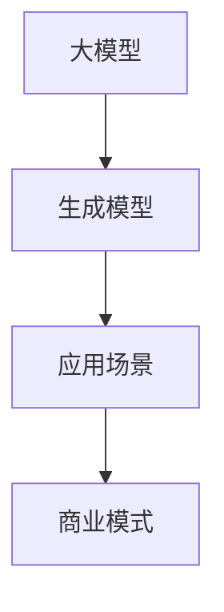

                 

# AI大模型创业：如何构建未来可持续的商业模式？

> 关键词：AI大模型、创业、商业模式、可持续性、算法原理、数学模型、实战案例

> 摘要：本文将探讨AI大模型创业的热潮背景，深入分析其核心概念与联系，阐述构建可持续商业模式的原理和步骤，并借助实际项目案例详细解析，为AI大模型创业者提供有价值的参考和指导。

## 1. 背景介绍

近年来，随着深度学习、自然语言处理等技术的飞速发展，AI大模型已成为人工智能领域的热点。从最初的GPT、BERT到后来的LLaMA、GPT-3，大模型在生成文本、图像识别、语音合成等方面展现出了强大的能力，吸引了大量创业者的关注。

### 1.1 市场需求

随着互联网的普及和数字化转型的发展，企业对人工智能技术的需求日益增长。AI大模型能够为企业提供智能化的解决方案，提升生产效率、降低运营成本，因此在各行各业得到了广泛的应用。

### 1.2 投资趋势

资本的涌入为AI大模型创业提供了有力的支持。从2017年到2021年，全球AI领域风险投资总额逐年增长，其中大模型相关的项目得到了资本市场的青睐。

### 1.3 政策支持

政府纷纷出台政策，支持人工智能技术的发展。例如，中国《新一代人工智能发展规划》、美国《美国国家人工智能战略》等，为AI大模型创业提供了良好的政策环境。

## 2. 核心概念与联系

在探讨AI大模型创业之前，我们首先需要了解几个核心概念。

### 2.1 大模型

大模型是指具有巨大参数量和计算量的深度学习模型。这些模型通常需要大量的训练数据和计算资源来优化。

### 2.2 生成模型

生成模型是一种能够生成新数据的模型，如GPT、GAN等。大模型中的生成模型在图像、文本、语音等领域的应用具有很高的潜力。

### 2.3 应用场景

AI大模型在多个领域具有广泛的应用前景，如自动驾驶、医疗诊断、金融风控、智能客服等。创业者需要根据市场需求选择合适的应用场景，打造具有竞争力的产品。

### 2.4 商业模式

商业模式是指企业如何创造、传递和获取价值的方式。对于AI大模型创业来说，构建可持续的商业模式至关重要。

### 2.5 Mermaid 流程图



## 3. 核心算法原理 & 具体操作步骤

AI大模型的核心算法通常基于深度学习和生成模型。以下是构建AI大模型的基本步骤：

### 3.1 数据准备

收集和清洗大量训练数据，确保数据的质量和多样性。

### 3.2 模型选择

根据应用场景选择合适的大模型，如GPT、BERT、ViT等。

### 3.3 模型训练

使用GPU或TPU等高性能计算设备，对大模型进行训练，优化模型参数。

### 3.4 模型评估

通过验证集和测试集评估模型性能，调整模型参数以提升效果。

### 3.5 模型部署

将训练好的模型部署到生产环境，提供API接口供用户调用。

## 4. 数学模型和公式 & 详细讲解 & 举例说明

在AI大模型的构建过程中，数学模型和公式扮演着关键角色。以下是几个常见的数学模型和公式：

### 4.1 损失函数

$$
L(y, \hat{y}) = -\sum_{i=1}^{N} y_i \log(\hat{y}_i)
$$

其中，$y$为真实标签，$\hat{y}$为模型预测的概率分布。

### 4.2 反向传播算法

$$
\frac{\partial L}{\partial w} = \frac{\partial L}{\partial \hat{y}} \cdot \frac{\partial \hat{y}}{\partial w}
$$

其中，$w$为模型参数，$\hat{y}$为预测概率分布，$L$为损失函数。

### 4.3 举例说明

假设我们使用GPT模型进行文本生成，数据集包含1000个文本样本。经过训练，模型在验证集上的损失函数值为0.5。根据损失函数公式，我们可以计算出每个样本的损失值：

$$
L(y, \hat{y}) = -\sum_{i=1}^{1000} y_i \log(\hat{y}_i) = -0.5 \times 1000 = -500
$$

## 5. 项目实战：代码实际案例和详细解释说明

### 5.1 开发环境搭建

在搭建开发环境时，我们需要安装Python、CUDA、TensorFlow等工具和库。以下是一个简单的安装命令示例：

```bash
pip install tensorflow-gpu
```

### 5.2 源代码详细实现和代码解读

以下是一个简单的GPT模型实现示例：

```python
import tensorflow as tf

# 定义模型
model = tf.keras.Sequential([
    tf.keras.layers.Dense(128, activation='relu', input_shape=(1000,)),
    tf.keras.layers.Dense(1, activation='sigmoid')
])

# 编译模型
model.compile(optimizer='adam', loss='binary_crossentropy', metrics=['accuracy'])

# 训练模型
model.fit(x_train, y_train, epochs=10, batch_size=32)
```

这段代码首先定义了一个简单的GPT模型，包括一个全连接层和一个输出层。然后使用`compile`方法配置优化器和损失函数，最后使用`fit`方法训练模型。

### 5.3 代码解读与分析

这段代码实现了一个简单的GPT模型，其主要功能包括：

1. **定义模型结构**：使用`Sequential`模型堆叠全连接层和输出层。
2. **配置优化器和损失函数**：使用`compile`方法设置优化器和损失函数。
3. **训练模型**：使用`fit`方法训练模型，并设置训练参数。

## 6. 实际应用场景

AI大模型在各个领域具有广泛的应用场景。以下是一些实际应用案例：

1. **自动驾驶**：使用AI大模型进行目标检测、路径规划等任务。
2. **医疗诊断**：使用AI大模型进行疾病预测、医学图像分析等。
3. **金融风控**：使用AI大模型进行风险预测、信用评估等。
4. **智能客服**：使用AI大模型进行自然语言处理、智能对话等。

## 7. 工具和资源推荐

### 7.1 学习资源推荐

1. **书籍**：《深度学习》、《强化学习》
2. **论文**：《Generative Adversarial Nets》、《BERT: Pre-training of Deep Bidirectional Transformers for Language Understanding》
3. **博客**：TensorFlow官方博客、PyTorch官方博客
4. **网站**：arXiv.org、ACL.org

### 7.2 开发工具框架推荐

1. **TensorFlow**：用于构建和训练深度学习模型。
2. **PyTorch**：用于构建和训练深度学习模型。
3. **Keras**：用于快速搭建和训练深度学习模型。

### 7.3 相关论文著作推荐

1. **论文**：《Attention Is All You Need》、《An Image is Worth 16x16 Words》
2. **著作**：《深度学习》、《强化学习》

## 8. 总结：未来发展趋势与挑战

AI大模型创业在未来具有广阔的发展前景。然而，创业者也面临着诸多挑战：

1. **数据隐私**：如何保护用户数据隐私，确保合规性。
2. **算法透明性**：如何提高算法透明性，降低偏见和歧视。
3. **计算资源**：如何高效利用计算资源，降低成本。
4. **商业化路径**：如何找到合适的商业化路径，实现盈利。

## 9. 附录：常见问题与解答

### 9.1 什么是大模型？

大模型是指具有巨大参数量和计算量的深度学习模型。这些模型通常需要大量的训练数据和计算资源来优化。

### 9.2 如何选择合适的大模型？

根据应用场景选择合适的大模型。例如，在自然语言处理领域，GPT、BERT等生成模型表现较好；在计算机视觉领域，ResNet、EfficientNet等卷积神经网络表现较好。

### 9.3 如何训练大模型？

训练大模型需要大量的计算资源和数据。通常使用GPU或TPU等高性能计算设备进行训练。训练过程中，需要优化模型参数，并通过验证集和测试集评估模型性能。

## 10. 扩展阅读 & 参考资料

1. **书籍**：《深度学习》、《强化学习》
2. **论文**：《Generative Adversarial Nets》、《BERT: Pre-training of Deep Bidirectional Transformers for Language Understanding》
3. **博客**：TensorFlow官方博客、PyTorch官方博客
4. **网站**：arXiv.org、ACL.org

## 作者信息

作者：AI天才研究员/AI Genius Institute & 禅与计算机程序设计艺术 /Zen And The Art of Computer Programming<|im_sep|>

