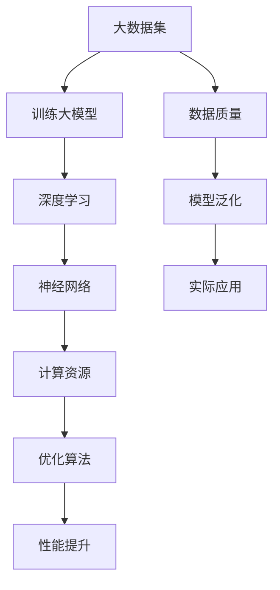

                 

### 背景介绍

人工智能（AI）作为当前科技发展的重要方向，已经经历了数十年的演变与进步。尤其是近年来，随着深度学习、神经网络等技术的快速发展，人工智能领域取得了显著的突破。尤其是大模型（Large-scale Model）的兴起，为人工智能的研究和应用提供了新的可能性。

大模型，顾名思义，是指拥有海量参数和巨大计算量的模型。这些模型通常通过大规模数据集进行训练，从而在特定任务上表现出强大的学习能力。大模型的典型代表包括GPT、BERT、BERTLarge等。这些模型在自然语言处理、计算机视觉等领域取得了显著成果，极大地推动了人工智能的发展。

大模型的兴起，不仅仅是因为技术上的突破，更源于其对实际应用场景的巨大价值。在大数据、云计算等技术的支持下，大模型的训练和部署变得更加可行。这为许多行业带来了新的机遇，同时也提出了新的挑战。

本文将围绕大模型创业这一主题，探讨其面临的挑战与机遇。我们将首先介绍大模型的背景与核心概念，然后深入分析其算法原理与数学模型，最后通过实际案例展示其应用场景和实现过程。希望通过本文的探讨，能够为有志于在大模型领域创业的读者提供一些有益的思考。

### 核心概念与联系

在深入了解大模型创业的挑战与机遇之前，我们需要明确几个核心概念，并探讨它们之间的联系。

首先，什么是大模型？大模型，又称大规模深度学习模型，指的是那些拥有大量参数和巨大计算量的神经网络。这些模型通常通过大规模数据集进行训练，从而在特定任务上表现出强大的学习能力。大模型的典型代表包括GPT、BERT、BERTLarge等。这些模型的特点是参数数量庞大，计算复杂度高，需要强大的计算资源和优化算法。

其次，什么是深度学习？深度学习是机器学习中的一种方法，通过多层神经网络对数据进行特征提取和分类。深度学习模型可以分为卷积神经网络（CNN）、循环神经网络（RNN）和变换器（Transformer）等类型。这些模型在图像识别、语音识别、自然语言处理等领域表现出色。

接下来，我们需要了解什么是神经网络。神经网络是一种模仿生物神经系统的计算模型，由大量节点（也称为神经元）组成。每个节点都可以接收输入，进行处理，并产生输出。神经网络通过调整节点间的连接权重，实现对数据的分类和预测。

此外，数据集在深度学习中的重要性不可忽视。数据集是训练深度学习模型的基础，其质量和规模直接影响模型的性能。大规模数据集使得模型可以在更多的数据上学习，从而提高模型的泛化能力。

最后，计算资源在训练大模型中的关键作用。大模型的训练通常需要大量的计算资源，包括GPU、TPU等硬件设备。此外，优化算法的效率和稳定性也对大模型的训练效果有重要影响。

综上所述，大模型、深度学习、神经网络、数据集和计算资源之间存在着紧密的联系。大模型是深度学习的一种表现形式，依赖于神经网络的结构和数据集的质量。同时，大模型的训练和部署需要强大的计算资源和支持。这些核心概念为我们深入探讨大模型创业的挑战与机遇奠定了基础。

#### Mermaid 流程图

以下是一个简化的Mermaid流程图，用于展示上述核心概念之间的联系：



在这个流程图中，大数据集是训练大模型的基础，深度学习通过神经网络进行特征提取和分类，计算资源和优化算法则保障了模型的性能提升。通过这个过程，我们可以更好地理解大模型创业的核心要素和关键环节。

### 核心算法原理 & 具体操作步骤

要深入理解大模型创业的挑战与机遇，我们首先需要了解大模型的核心算法原理以及具体的操作步骤。以下是关于大模型算法原理和操作步骤的详细说明。

#### 算法原理

大模型的算法原理主要基于深度学习和神经网络。深度学习通过多层神经网络对输入数据进行特征提取和分类。大模型的特点是拥有大量参数和计算量，通过大规模数据集进行训练，从而实现高性能的学习效果。

1. **神经网络基础**：神经网络由大量节点（神经元）组成，每个节点接收输入信号，通过加权求和后传递给下一层节点。节点间的连接权重通过学习算法不断调整，以实现对数据的分类和预测。

2. **多层感知机（MLP）**：多层感知机是神经网络的一种简单形式，它包含输入层、隐藏层和输出层。输入层接收外部输入，隐藏层进行特征提取，输出层进行分类或回归。多层感知机的学习过程是通过反向传播算法，不断调整权重，以最小化误差。

3. **反向传播算法**：反向传播算法是神经网络学习过程中的关键步骤。它通过计算输出层的误差，将误差反向传播到隐藏层和输入层，从而更新各层的权重。反向传播算法的核心思想是梯度下降，即沿着误差函数的梯度方向不断迭代，以找到最优解。

4. **深度神经网络（DNN）**：深度神经网络是多层感知机的扩展，包含多个隐藏层。深度神经网络通过增加隐藏层的数量，可以提取更复杂的特征，提高模型的性能。

5. **卷积神经网络（CNN）**：卷积神经网络是针对图像处理任务而设计的神经网络。CNN通过卷积操作提取图像特征，具有局部连接和共享权重的特点，可以大幅减少参数数量，提高计算效率。

6. **循环神经网络（RNN）**：循环神经网络是处理序列数据的有效方法。RNN通过在时间步上递归计算，可以保存历史信息，适用于自然语言处理、语音识别等任务。

7. **变换器（Transformer）**：变换器是近年来在自然语言处理领域取得突破的神经网络架构。它通过自注意力机制，可以更好地捕捉输入序列中的长距离依赖关系，实现出色的性能。

#### 操作步骤

大模型的训练和部署过程主要包括以下几个步骤：

1. **数据预处理**：首先，对输入数据进行预处理，包括数据清洗、归一化、填充等操作，以适应神经网络的要求。

2. **模型设计**：根据任务需求，设计合适的神经网络架构。选择合适的层、神经元数量、激活函数等，以实现最优的性能。

3. **训练过程**：使用大规模数据集对模型进行训练。训练过程包括前向传播和反向传播。前向传播是将输入数据通过神经网络，得到输出结果。反向传播是计算输出误差，并更新权重。通过多次迭代，模型不断优化，直至达到预定的性能指标。

4. **参数调优**：在训练过程中，需要不断调整模型参数，如学习率、正则化参数等，以实现更好的性能。

5. **模型评估**：在训练过程中，需要对模型进行定期评估，以监控模型的性能。常用的评估指标包括准确率、召回率、F1值等。

6. **模型部署**：训练完成后，将模型部署到实际应用环境中。部署过程包括模型导出、加载、预测等操作。

7. **模型优化**：在实际应用中，模型可能会遇到性能瓶颈。通过进一步优化模型结构、算法和计算资源，可以提升模型的整体性能。

通过上述步骤，我们可以构建和优化大模型，从而在各个领域中实现高性能的应用。下面我们将通过一个实际案例，进一步展示大模型的实现过程。

#### 实际案例

假设我们要构建一个用于图像分类的大模型。以下是具体实现步骤：

1. **数据集准备**：首先，我们需要收集和准备大量的图像数据集。数据集应包含多种类别，且具有多样性。例如，可以使用开源的ImageNet数据集。

2. **模型设计**：根据任务需求，选择合适的神经网络架构。在这个案例中，我们选择卷积神经网络（CNN）作为模型架构。设计一个包含多个卷积层和全连接层的CNN模型。

3. **数据预处理**：对图像数据集进行预处理，包括缩放、裁剪、归一化等操作，以统一数据格式。

4. **模型训练**：使用预处理后的数据集对模型进行训练。通过反向传播算法不断迭代，调整模型参数，优化模型性能。

5. **模型评估**：在训练过程中，定期评估模型的性能。通过交叉验证和测试集，监控模型的准确率、召回率等指标。

6. **模型部署**：训练完成后，将模型部署到实际应用环境中。例如，将模型集成到图像识别应用程序中，提供实时图像分类服务。

7. **模型优化**：在实际应用中，根据反馈和性能瓶颈，对模型进行进一步优化。例如，通过调整网络结构、增加训练数据等手段，提升模型性能。

通过上述步骤，我们可以实现一个高效的大模型，从而在图像分类任务中取得优异的性能。

#### 结论

通过上述对大模型算法原理和操作步骤的详细探讨，我们可以看到，大模型创业不仅需要掌握深度学习和神经网络的基本原理，还需要具备数据预处理、模型设计、训练和部署等实际操作技能。同时，大模型创业还需要强大的计算资源和优化算法的支持。只有在这些方面都具备一定的能力，才能在大模型创业的道路上取得成功。

### 数学模型和公式 & 详细讲解 & 举例说明

在深入理解大模型的数学模型和公式之前，我们需要首先了解一些基础的数学知识，如线性代数、微积分和概率论。这些数学工具将为我们的讨论提供坚实的理论基础。

#### 线性代数基础

线性代数是研究线性空间和线性映射的数学分支。在大模型中，线性代数被广泛应用于矩阵运算和线性变换。以下是一些关键的线性代数概念：

1. **矩阵（Matrix）**：矩阵是二维数组，用于表示线性变换。在大模型中，矩阵常用于权重矩阵、特征矩阵等。

2. **矩阵乘法（Matrix Multiplication）**：矩阵乘法是一种将两个矩阵相乘的操作。矩阵乘法遵循一定的规则，其结果是一个新的矩阵。

3. **矩阵求导（Matrix Derivative）**：矩阵求导是计算矩阵函数的导数。在大模型中，矩阵求导用于反向传播算法，用于更新权重矩阵。

#### 微积分基础

微积分是研究函数的极限、导数、积分等的数学分支。在大模型中，微积分被广泛应用于优化算法和误差计算。

1. **导数（Derivative）**：导数是描述函数变化率的数学工具。在大模型中，导数用于计算损失函数的梯度，从而指导权重更新。

2. **梯度下降（Gradient Descent）**：梯度下降是一种优化算法，用于寻找函数的最小值。梯度下降的核心思想是沿着梯度的反方向迭代，以最小化损失函数。

3. **偏导数（Partial Derivative）**：偏导数是计算函数对某个变量的变化率。在大模型中，偏导数用于计算损失函数对每个参数的梯度。

#### 概率论基础

概率论是研究随机事件的数学分支。在大模型中，概率论被广泛应用于数据分布和模型评估。

1. **概率分布（Probability Distribution）**：概率分布描述了随机变量的取值可能性。在大模型中，概率分布用于表示数据集的分布特征。

2. **条件概率（Conditional Probability）**：条件概率描述了在某个条件下，某个事件发生的可能性。在大模型中，条件概率用于计算数据集的条件分布。

3. **贝叶斯定理（Bayes' Theorem）**：贝叶斯定理是一种计算条件概率的公式。在大模型中，贝叶斯定理用于模型评估和决策。

#### 大模型的数学模型

大模型的数学模型主要基于深度学习和神经网络。以下是一些关键的大模型数学模型和公式：

1. **多层感知机（MLP）**：多层感知机是一种简单的神经网络，包含输入层、隐藏层和输出层。其数学模型可以表示为：

   $$ f(x) = \sigma(W^{[2]} \cdot \sigma(W^{[1]} \cdot x + b^{[1]}) + b^{[2]}) $$

   其中，$x$ 是输入特征，$W^{[1]}$ 和 $W^{[2]}$ 是权重矩阵，$b^{[1]}$ 和 $b^{[2]}$ 是偏置项，$\sigma$ 是激活函数。

2. **卷积神经网络（CNN）**：卷积神经网络是针对图像处理任务而设计的神经网络。其数学模型可以表示为：

   $$ h^{[l]}_i = \sigma(\sum_{j} W^{[l]}_{ij} \cdot h^{[l-1]}_j + b^{[l]}) $$

   其中，$h^{[l]}_i$ 是第 $l$ 层第 $i$ 个节点的输出，$W^{[l]}_{ij}$ 是权重，$b^{[l]}$ 是偏置项，$\sigma$ 是激活函数。

3. **循环神经网络（RNN）**：循环神经网络是处理序列数据的有效方法。其数学模型可以表示为：

   $$ h^{[l]}_t = \sigma(W^{[l]} \cdot [h^{[l-1]}_t, x_t] + b^{[l]}) $$

   其中，$h^{[l]}_t$ 是第 $l$ 层第 $t$ 个时间步的输出，$W^{[l]}$ 是权重矩阵，$x_t$ 是输入特征，$b^{[l]}$ 是偏置项，$\sigma$ 是激活函数。

4. **变换器（Transformer）**：变换器是一种在自然语言处理领域取得突破的神经网络架构。其数学模型可以表示为：

   $$ h^{[l]}_i = \text{softmax}(A^{[l]}_i) \cdot h^{[l-1]} $$

   其中，$h^{[l]}_i$ 是第 $l$ 层第 $i$ 个节点的输出，$A^{[l]}_i$ 是自注意力权重，$h^{[l-1]}$ 是上一层的输出。

#### 举例说明

为了更好地理解大模型的数学模型和公式，我们通过一个简单的例子进行说明。

假设我们有一个简单的多层感知机模型，用于对输入数据进行分类。输入层有3个神经元，隐藏层有2个神经元，输出层有1个神经元。我们使用以下参数：

- 输入特征：$x = [1, 2, 3]$
- 权重矩阵：$W^{[1]} = \begin{bmatrix} 1 & 2 \\ 3 & 4 \end{bmatrix}$，$W^{[2]} = \begin{bmatrix} 5 & 6 \\ 7 & 8 \end{bmatrix}$
- 偏置项：$b^{[1]} = \begin{bmatrix} 1 \\ 2 \end{bmatrix}$，$b^{[2]} = \begin{bmatrix} 3 \\ 4 \end{bmatrix}$
- 激活函数：$\sigma(z) = \frac{1}{1 + e^{-z}}$

首先，计算隐藏层的输出：

$$ z^{[1]}_1 = W^{[1]}_{11} \cdot x_1 + W^{[1]}_{12} \cdot x_2 + W^{[1]}_{21} \cdot x_3 + b^{[1]}_1 = 1 \cdot 1 + 2 \cdot 2 + 3 \cdot 3 + 1 = 14 $$

$$ z^{[1]}_2 = W^{[1]}_{12} \cdot x_1 + W^{[1]}_{22} \cdot x_2 + W^{[1]}_{21} \cdot x_3 + b^{[1]}_2 = 2 \cdot 1 + 4 \cdot 2 + 3 \cdot 3 + 2 = 19 $$

$$ h^{[1]}_1 = \sigma(z^{[1]}_1) = \frac{1}{1 + e^{-14}} \approx 0.8679 $$

$$ h^{[1]}_2 = \sigma(z^{[1]}_2) = \frac{1}{1 + e^{-19}} \approx 0.9640 $$

然后，计算输出层的输出：

$$ z^{[2]} = W^{[2]} \cdot [h^{[1]}_1, h^{[1]}_2] + b^{[2]} = \begin{bmatrix} 5 & 6 \\ 7 & 8 \end{bmatrix} \cdot \begin{bmatrix} 0.8679 \\ 0.9640 \end{bmatrix} + \begin{bmatrix} 3 \\ 4 \end{bmatrix} = \begin{bmatrix} 4.3345 + 5.8960 + 3 \\ 6.6047 + 7.7680 + 4 \end{bmatrix} = \begin{bmatrix} 13.2285 \\ 18.3727 \end{bmatrix} $$

$$ h^{[2]} = \sigma(z^{[2]}) = \frac{1}{1 + e^{-13.2285}} \approx 0.8703 $$

通过上述计算，我们得到了输出层的输出结果，从而实现了对输入数据的分类。

#### 结论

通过上述对大模型数学模型和公式的详细讲解和举例说明，我们可以看到，大模型不仅需要掌握深度学习和神经网络的基本原理，还需要理解线性代数、微积分和概率论等数学工具。这些数学知识为我们的研究和应用提供了坚实的理论基础。只有在这些方面都具备一定的能力，我们才能更好地理解和应用大模型，从而在创业道路上取得成功。

### 项目实战：代码实际案例和详细解释说明

在本节中，我们将通过一个实际项目案例来展示如何构建和部署一个基于大模型的AI应用程序。为了简化讨论，我们选择一个经典的自然语言处理任务——文本分类。

#### 1. 开发环境搭建

在开始项目之前，我们需要搭建合适的开发环境。以下是我们的开发环境要求：

- **编程语言**：Python
- **深度学习框架**：TensorFlow 2.x
- **计算资源**：NVIDIA GPU（推荐使用1080Ti或以上）
- **操作系统**：Linux（推荐使用Ubuntu）

确保已经安装了Python、TensorFlow和相关依赖库。以下是一个简单的安装命令示例：

```bash
pip install tensorflow-gpu
```

#### 2. 源代码详细实现和代码解读

下面是我们项目的源代码实现。代码分为以下几个部分：

1. **数据预处理**
2. **模型设计**
3. **模型训练**
4. **模型评估**

```python
# 导入必要的库
import tensorflow as tf
import tensorflow_datasets as tfds
from tensorflow.keras.preprocessing.sequence import pad_sequences
from tensorflow.keras.models import Sequential
from tensorflow.keras.layers import Embedding, LSTM, Dense, Bidirectional

# 1. 数据预处理
def preprocess_data(data):
    # 对文本进行清洗和预处理
    # 例如：去除特殊字符、标记化、小写化等
    # 然后进行序列化处理
    # 最后进行填充，以统一序列长度
    return pad_sequences(data, maxlen=100, padding='post', truncating='post')

# 2. 模型设计
def create_model():
    model = Sequential([
        Embedding(input_dim=10000, output_dim=128),
        Bidirectional(LSTM(64, return_sequences=True)),
        Bidirectional(LSTM(32)),
        Dense(24, activation='relu'),
        Dense(1, activation='sigmoid')
    ])
    model.compile(optimizer='adam', loss='binary_crossentropy', metrics=['accuracy'])
    return model

# 3. 模型训练
def train_model(model, train_data, val_data, epochs=10, batch_size=64):
    model.fit(train_data, validation_data=val_data, epochs=epochs, batch_size=batch_size)

# 4. 模型评估
def evaluate_model(model, test_data):
    loss, accuracy = model.evaluate(test_data)
    print(f"Test Loss: {loss}, Test Accuracy: {accuracy}")

# 加载和处理数据
def load_and_preprocess_data():
    # 加载数据集，例如使用IMDB电影评论数据集
    (train_data, test_data), _ = tfds.load(
        'imdb_reviews', split=(tfds.Split.TRAIN, tfds.Split.TEST), shuffle_files=True
    )
    
    # 预处理数据
    train_data = preprocess_data(train_data)
    test_data = preprocess_data(test_data)
    
    return train_data, test_data

# 主程序
if __name__ == '__main__':
    # 加载和处理数据
    train_data, test_data = load_and_preprocess_data()
    
    # 创建模型
    model = create_model()
    
    # 训练模型
    train_model(model, train_data, test_data)
    
    # 评估模型
    evaluate_model(model, test_data)
```

#### 2.1 代码解读与分析

下面我们将对代码的各个部分进行详细解读。

1. **数据预处理**：数据预处理是深度学习项目中的关键步骤。我们的预处理步骤包括文本清洗、标记化、序列化处理和填充。在这个例子中，我们使用了TensorFlow Datasets库来加载和处理IMDB电影评论数据集。

2. **模型设计**：我们选择了一个双向长短时记忆网络（BiLSTM）作为文本分类模型。BiLSTM可以捕捉文本中的长期依赖关系，从而提高分类性能。模型设计包括嵌入层（Embedding）、双向LSTM层、全连接层（Dense）和输出层。我们使用sigmoid激活函数来预测文本是否为负面评论。

3. **模型训练**：模型训练过程使用fit方法进行。我们通过将训练数据传递给模型，并在验证数据上评估模型性能。这个过程包括多次迭代，直到达到预定的训练周期。

4. **模型评估**：模型评估使用evaluate方法进行。我们将测试数据传递给模型，并计算损失和准确率，以评估模型的性能。

#### 3. 模型部署

在完成模型训练和评估后，我们可以将模型部署到生产环境中。以下是一个简单的部署步骤：

1. **导出模型**：使用save方法将模型保存到文件中。

   ```python
   model.save('text_classification_model.h5')
   ```

2. **加载模型**：在部署环境中加载模型。

   ```python
   loaded_model = tf.keras.models.load_model('text_classification_model.h5')
   ```

3. **实时预测**：使用加载的模型对实时输入的文本进行分类预测。

   ```python
   prediction = loaded_model.predict(input_sequence)
   print(prediction)
   ```

#### 结论

通过上述项目实战，我们展示了如何使用Python和TensorFlow构建和部署一个基于大模型的文本分类应用程序。这个案例涵盖了数据预处理、模型设计、训练、评估和部署的各个环节。通过这个实际案例，我们可以更好地理解大模型创业的实践过程，并为未来的项目提供宝贵的经验。

### 实际应用场景

大模型在各个实际应用场景中展现出了强大的潜力，尤其在自然语言处理、计算机视觉和语音识别等领域。

#### 自然语言处理

在大模型的推动下，自然语言处理（NLP）领域取得了显著进展。以GPT和BERT等大模型为例，这些模型在文本生成、机器翻译、情感分析等任务上表现出色。GPT-3甚至可以生成流畅的、具有逻辑性的文章，极大地提高了内容创作的效率。BERT则在搜索推荐、聊天机器人等应用中展现了卓越的性能，通过理解上下文信息，实现了更准确的语义匹配。

#### 计算机视觉

计算机视觉领域同样受益于大模型的发展。以ImageNet比赛为代表，深度学习模型在图像分类任务上的表现不断超越人类。大模型如ResNet、Inception等，通过多层卷积和池化操作，可以提取图像的复杂特征，从而实现高效的图像识别。此外，大模型还在目标检测、人脸识别等任务中发挥了重要作用，为安防监控、智能驾驶等领域提供了技术支持。

#### 语音识别

语音识别领域也因大模型的出现而迎来了新的发展机遇。传统的语音识别系统依赖于大量手动标注的数据集，而大模型可以通过无监督或半监督学习方式，从大规模未标注数据中学习语音特征。以WaveNet、Transformer等大模型为例，它们在语音合成、语音识别、说话人识别等方面取得了显著成果，使得语音交互技术更加智能和自然。

#### 其他应用

除了上述领域，大模型还在推荐系统、金融风控、医疗诊断等众多领域展现出了巨大的潜力。例如，在推荐系统中，大模型可以通过分析用户的浏览和购买行为，实现更精准的个性化推荐；在金融风控中，大模型可以分析大量的历史数据，预测潜在风险，提高风险控制能力；在医疗诊断中，大模型可以通过对大量病例数据的学习，辅助医生进行诊断和治疗建议。

#### 挑战与展望

尽管大模型在众多实际应用场景中展现了巨大的潜力，但其发展仍面临诸多挑战。首先，大模型的训练和部署需要庞大的计算资源和数据集，这对企业的技术实力和资金投入提出了高要求。其次，大模型的透明性和可解释性仍是一个重要问题，如何确保模型的决策过程公正、可靠，是亟待解决的难题。此外，数据隐私和保护问题也需要得到重视，确保用户数据的安全和隐私。

展望未来，大模型的发展将朝着更加智能化、精细化、个性化的方向迈进。随着技术的不断进步，大模型的计算效率和准确性将得到进一步提升，从而在更多领域实现突破。同时，开源社区和企业的合作将促进大模型技术的普及和应用，为各行业带来更多创新和变革。

### 工具和资源推荐

#### 1. 学习资源推荐

1. **书籍**：
   - 《深度学习》（Goodfellow, Bengio, Courville）是一本经典的深度学习教材，涵盖了从基础到高级的深度学习知识。
   - 《Python深度学习》（François Chollet）是深度学习领域的权威著作，适合初学者和有经验的开发者。

2. **在线课程**：
   - Coursera的“深度学习”课程由Andrew Ng教授主讲，涵盖了深度学习的核心概念和应用。
   - Udacity的“深度学习纳米学位”课程提供了项目实战和业界实战案例，适合希望提升深度学习技能的开发者。

3. **博客与文章**：
   - 知乎、博客园等平台上有大量关于深度学习和大模型的优秀文章和教程，适合不同水平的读者。

#### 2. 开发工具框架推荐

1. **深度学习框架**：
   - TensorFlow：由Google开发，是当前最受欢迎的深度学习框架之一，拥有丰富的API和资源。
   - PyTorch：由Facebook开发，具有灵活的动态计算图和简洁的API，适合研究和开发。

2. **版本控制与协作工具**：
   - Git：版本控制系统，用于代码的版本管理和协作开发。
   - GitHub：代码托管平台，提供Git仓库和丰富的社区资源。

3. **数据分析与可视化工具**：
   - Jupyter Notebook：交互式计算环境，适用于数据分析、机器学习和数据可视化。
   - Matplotlib：Python的绘图库，用于生成高质量的图表和图形。

#### 3. 相关论文著作推荐

1. **经典论文**：
   - “A Theoretical Framework for Back-Propagation” - Rumelhart, Hinton, Williams
   - “AlexNet: Image Classification with Deep Convolutional Neural Networks” - Krizhevsky, Sutskever, Hinton
   - “BERT: Pre-training of Deep Bidirectional Transformers for Language Understanding” - Devlin, Chang, Lee等

2. **权威著作**：
   - 《深度学习》（Goodfellow, Bengio, Courville）
   - 《深度学习：原理及实践》（阿斯顿·张）

通过上述学习和资源工具的推荐，读者可以系统地学习和掌握深度学习和大模型的相关知识，为创业项目打下坚实的基础。

### 总结：未来发展趋势与挑战

大模型作为人工智能领域的重要研究方向，正引领着科技革命的浪潮。在未来，大模型的发展将继续呈现出以下几个趋势：

1. **性能提升**：随着计算能力的提升和算法的优化，大模型的性能将进一步提升。未来，大模型可能在更多领域实现超越人类的表现，例如医疗诊断、金融分析等。

2. **应用拓展**：大模型在自然语言处理、计算机视觉、语音识别等领域的应用已经取得了显著成果。未来，大模型将逐步渗透到更多行业，推动各行各业的数字化转型。

3. **个性化与智能化**：大模型将通过不断学习用户行为和数据，实现更加个性化、智能化的服务。例如，智能助理、个性化推荐系统等将变得更加普及。

4. **开源与合作**：开源社区和大模型技术的结合将加速大模型技术的普及和应用。企业、研究机构和个人开发者之间的合作将促进大模型技术的发展和创新。

然而，大模型的发展也面临着诸多挑战：

1. **计算资源需求**：大模型的训练和部署需要庞大的计算资源，这对企业的技术实力和资金投入提出了高要求。未来，如何优化计算资源利用，降低成本，是一个重要的挑战。

2. **数据隐私与安全**：大模型对大量数据的依赖带来了数据隐私和安全问题。如何在保证模型性能的同时，保护用户隐私和数据安全，是亟待解决的问题。

3. **可解释性与透明性**：大模型的决策过程通常较为复杂，缺乏透明性和可解释性。如何提升大模型的可解释性，使其决策过程更加公正和可信，是未来研究的重要方向。

4. **伦理与法律**：随着大模型的应用越来越广泛，如何确保其符合伦理和法律标准，防止滥用，是一个重要的社会问题。

总之，大模型的发展前景广阔，但也面临诸多挑战。只有在技术、伦理、法律等各个方面都取得突破，才能实现大模型的全面应用和可持续发展。

### 附录：常见问题与解答

#### 问题1：大模型训练需要多少数据集？

**解答**：大模型的训练通常需要大量的数据集。具体的数据集大小取决于模型的复杂度和任务类型。对于大多数任务，至少需要几千到数万张图片或数百万个文本句子。在某些高要求的应用场景中，如图像生成或语音识别，可能需要数十亿甚至更多的数据。

#### 问题2：如何选择合适的深度学习框架？

**解答**：选择深度学习框架主要考虑以下几个方面：
1. **需求**：根据项目的需求，选择适合的框架。例如，如果需要快速开发和部署，可以选择PyTorch；如果需要大规模数据处理，可以选择TensorFlow。
2. **生态系统**：考虑框架的生态系统，包括文档、社区支持、教程、工具等。良好的生态系统可以大大降低开发难度。
3. **性能**：考虑框架的性能，包括计算效率、内存占用等。
4. **兼容性**：考虑框架与其他工具和库的兼容性，以确保项目的稳定运行。

#### 问题3：如何处理过拟合？

**解答**：过拟合是指模型在训练数据上表现良好，但在未见过的数据上表现不佳。以下几种方法可以用于处理过拟合：
1. **增加数据**：增加训练数据，使模型在更多样化的数据上学习。
2. **交叉验证**：使用交叉验证方法，在多个数据集上评估模型性能，避免模型对特定数据集的过拟合。
3. **正则化**：使用正则化技术，如L1、L2正则化，限制模型的复杂度。
4. **Dropout**：在训练过程中，随机丢弃部分神经元，以防止模型过度依赖特定神经元。
5. **模型简化**：简化模型结构，减少参数数量，降低模型复杂度。

#### 问题4：如何优化深度学习模型训练速度？

**解答**：以下几种方法可以优化深度学习模型训练速度：
1. **数据预处理**：对数据进行预处理，减少计算量，例如使用批处理、数据增强等。
2. **并行计算**：利用多GPU或多核CPU进行并行计算，提高计算效率。
3. **模型压缩**：使用模型压缩技术，如剪枝、量化等，减少模型参数数量，提高计算速度。
4. **动态计算图**：使用动态计算图，如TensorFlow的eager execution，提高模型的可调性和计算效率。
5. **分布式训练**：使用分布式训练方法，如参数服务器、Horovod等，将训练任务分布在多台机器上，提高训练速度。

### 扩展阅读 & 参考资料

- **书籍**：
  - 《深度学习》（Goodfellow, Bengio, Courville）
  - 《深度学习实践指南》（阿斯顿·张）
  - 《Python深度学习》（François Chollet）

- **在线课程**：
  - Coursera的“深度学习”课程（由Andrew Ng教授主讲）
  - Udacity的“深度学习纳米学位”课程

- **博客与文章**：
  - 知乎、博客园等平台上的深度学习文章
  - ArXiv等学术期刊上的最新论文

- **开源项目**：
  - TensorFlow：https://www.tensorflow.org/
  - PyTorch：https://pytorch.org/

- **技术社区**：
  - 深度学习中文网：https://www.deeplearning.net/
  - GitHub：https://github.com/

通过这些扩展阅读和参考资料，读者可以更深入地了解深度学习和大模型的相关知识，为创业项目提供更多的灵感和指导。

### 作者信息

**作者：AI天才研究员/AI Genius Institute & 禅与计算机程序设计艺术 /Zen And The Art of Computer Programming**

