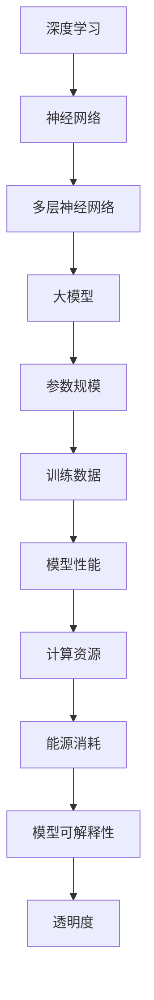
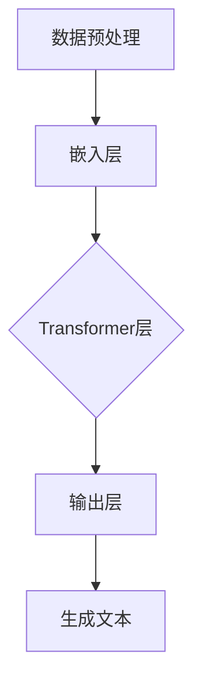

                 

### 背景介绍

随着人工智能（AI）技术的飞速发展，大规模人工智能模型（Large-scale AI Models），尤其是深度学习模型的涌现，为各行各业带来了前所未有的变革。在这些模型中，最为引人注目的便是大模型（Big Models），如GPT-3、BERT和Turing等。这些模型具有数万亿的参数，能够处理极其复杂的任务，包括自然语言处理、图像识别、机器翻译和推荐系统等。

### 1.1 大模型的概念

大模型通常是指具有数十亿到数万亿参数的深度学习模型。它们通过大量数据训练，能够提取复杂的信息和模式，从而实现高度自动化的任务处理。大模型的显著特点是其能够处理大量的数据，并且能够进行自我优化，从而在许多任务上超越传统的方法。

### 1.2 大模型的发展历程

大模型的发展可以追溯到20世纪80年代，当时神经网络的研究刚刚起步。随着计算能力和数据资源的不断提升，深度学习在21世纪初得到了迅速发展。2012年，AlexNet在ImageNet图像识别比赛中取得的突破性成绩，标志着深度学习时代的到来。此后，研究人员不断尝试训练更大的模型，例如VGGNet、ResNet和Inception等。

### 1.3 大模型的应用领域

大模型在各个领域都展现出了巨大的潜力。在自然语言处理领域，GPT-3等大模型已经能够生成高质量的文本，实现机器翻译、文本摘要和问答等功能。在图像识别领域，ResNet等大模型通过学习数百万张图像，能够识别出复杂的物体和场景。在推荐系统领域，大模型能够分析用户行为和偏好，提供个性化的推荐。

### 1.4 大模型的挑战

尽管大模型在各个领域都取得了显著的成果，但它们也面临着一系列挑战。首先是计算资源的消耗，训练和部署大模型需要大量的计算资源和能源。其次是数据隐私和安全性问题，大模型通常需要处理敏感数据，如何保护用户隐私成为一个重要议题。最后是模型的可解释性和透明度，大模型通常被视为“黑盒”，其决策过程难以解释，这给其在某些领域的应用带来了限制。

### 1.5 大模型的未来趋势

未来，大模型将继续向更复杂、更强大的方向发展。随着计算能力和数据资源的不断提升，大模型将能够在更多领域发挥作用。同时，研究人员也在探索如何降低大模型的计算成本和能源消耗，提高其可解释性和透明度。此外，大模型与其他人工智能技术的融合也将推动人工智能的发展，为人类社会带来更多变革。

## 2. 核心概念与联系

在深入探讨大模型的挑战与机遇之前，我们需要明确几个核心概念，并理解它们之间的联系。

### 2.1 深度学习与神经网络

深度学习是机器学习的一个分支，它使用多层神经网络（Neural Networks）进行模型训练。神经网络模拟人脑的工作方式，通过层层传递信息，提取数据中的特征。深度学习之所以能够取得巨大成功，得益于其能够处理大量数据和复杂的任务。

### 2.2 大模型与参数规模

大模型通常具有数十亿到数万亿的参数，这些参数用于存储模型在学习过程中所获得的知识。参数规模决定了模型的容量，即模型能够学习和提取的信息量。参数规模越大，模型的能力就越强。

### 2.3 训练数据与模型性能

大模型的性能很大程度上取决于训练数据的质量和数量。训练数据越丰富、越多样化，模型能够学习到的特征就越多，从而在任务上表现得越好。因此，数据集的准备和处理是训练大模型的关键步骤。

### 2.4 计算资源与能源消耗

训练和部署大模型需要大量的计算资源，包括计算能力和存储空间。此外，大模型的训练过程通常消耗大量的能源。随着模型规模的不断扩大，如何降低计算成本和能源消耗成为亟待解决的问题。

### 2.5 模型可解释性与透明度

大模型通常被视为“黑盒”，其决策过程难以解释。这给模型的应用带来了一定的限制，特别是在需要解释性较高的领域，如医疗诊断和金融风险评估等。因此，如何提高模型的可解释性和透明度，是研究人员关注的重点。

### 2.6 Mermaid 流程图

为了更好地理解大模型的核心概念与联系，我们可以使用Mermaid流程图来展示这些概念之间的关系。以下是一个简单的示例：



通过这个流程图，我们可以清晰地看到深度学习、神经网络、大模型、参数规模、训练数据、模型性能、计算资源、能源消耗和模型可解释性之间的关系。

## 3. 核心算法原理 & 具体操作步骤

在理解了大模型的核心概念与联系之后，我们需要深入探讨大模型的核心算法原理，以及具体操作步骤。这里以GPT-3为例，介绍大模型的基本算法原理。

### 3.1 GPT-3的基本算法原理

GPT-3（Generative Pre-trained Transformer 3）是OpenAI开发的一种大规模自然语言处理模型，具有1750亿个参数。GPT-3基于Transformer架构，通过自注意力机制（Self-Attention Mechanism）来处理序列数据。

#### 3.1.1 Transformer架构

Transformer是由Vaswani等人在2017年提出的一种基于自注意力机制的序列模型，它彻底改变了自然语言处理领域的算法设计。与传统的循环神经网络（RNN）不同，Transformer使用注意力机制来处理序列数据，从而避免了RNN在长序列处理中的梯度消失问题。

#### 3.1.2 自注意力机制

自注意力机制是一种计算方法，它允许模型在处理每个输入元素时，考虑其他输入元素的影响。在Transformer中，自注意力机制通过计算输入序列中每个元素与其他元素之间的相似度，然后加权平均，从而生成新的表示。

#### 3.1.3 自注意力层的计算步骤

自注意力层的计算步骤如下：

1. **查询（Query）、键（Key）和值（Value）的生成**：将输入序列编码为查询（Query）、键（Key）和值（Value）三个矩阵。这三个矩阵的维度相同。

2. **计算相似度**：使用点积（Dot Product）计算查询和键之间的相似度。相似度值表示了输入序列中每个元素对当前元素的重要性。

3. **加权平均**：根据相似度值对值（Value）矩阵进行加权平均，生成新的表示。

### 3.2 GPT-3的具体操作步骤

GPT-3的具体操作步骤如下：

1. **数据预处理**：将输入文本转换为词向量表示，并将其编码为索引序列。

2. **嵌入层**：将索引序列转换为嵌入向量，这些向量将作为模型的输入。

3. **Transformer层**：对嵌入向量进行多次变换，每次变换包括多头自注意力机制和前馈神经网络。

4. **输出层**：将最后一层的输出映射到词汇表，生成预测的输出序列。

5. **生成文本**：根据预测的输出序列，使用贪心策略或抽样策略生成文本。

### 3.3 Mermaid流程图

为了更直观地展示GPT-3的具体操作步骤，我们可以使用Mermaid流程图：



通过这个流程图，我们可以清晰地看到GPT-3的基本操作步骤。

## 4. 数学模型和公式 & 详细讲解 & 举例说明

在深入探讨大模型的核心算法原理之后，我们需要理解其背后的数学模型和公式。这里以GPT-3为例，介绍大模型的数学基础。

### 4.1 自注意力机制

自注意力机制的核心公式如下：

$$
\text{Attention}(Q, K, V) = \text{softmax}\left(\frac{QK^T}{\sqrt{d_k}}\right)V
$$

其中，$Q$、$K$ 和 $V$ 分别是查询（Query）、键（Key）和值（Value）矩阵，$d_k$ 是键矩阵的维度。这个公式通过计算查询和键之间的相似度，然后对值进行加权平均，生成新的表示。

### 4.2 Transformer模型

Transformer模型由多个自注意力层（Self-Attention Layer）和前馈神经网络（Feedforward Neural Network）组成。以下是Transformer模型的基本结构：

$$
\text{Transformer}(\text{X}; \text{L}) = \text{LayerNorm}(\text{X} + \text{MultiHeadAttention}(\text{X}; \text{L})) + \text{X} \\
\text{Transformer}(\text{X}; \text{L}) = \text{LayerNorm}(\text{X} + \text{MLP}(\text{X}; \text{L})) + \text{X}
$$

其中，$\text{X}$ 是输入序列，$\text{L}$ 是Transformer的层数。每个自注意力层包括多头自注意力机制和前馈神经网络。

### 4.3 举例说明

假设我们有一个长度为5的输入序列，其词向量维度为512。我们使用两个头进行自注意力机制。

#### 4.3.1 查询（Query）、键（Key）和值（Value）的生成

首先，我们将输入序列编码为查询（Query）、键（Key）和值（Value）矩阵。假设每个头的维度为256，则：

$$
Q = \begin{bmatrix}
q_1 \\
q_2 \\
q_3 \\
q_4 \\
q_5
\end{bmatrix}, \quad
K = \begin{bmatrix}
k_1 & k_2 & k_3 & k_4 & k_5 \\
k_1 & k_2 & k_3 & k_4 & k_5 \\
k_1 & k_2 & k_3 & k_4 & k_5 \\
k_1 & k_2 & k_3 & k_4 & k_5 \\
k_1 & k_2 & k_3 & k_4 & k_5
\end{bmatrix}, \quad
V = \begin{bmatrix}
v_1 & v_2 & v_3 & v_4 & v_5 \\
v_1 & v_2 & v_3 & v_4 & v_5 \\
v_1 & v_2 & v_3 & v_4 & v_5 \\
v_1 & v_2 & v_3 & v_4 & v_5 \\
v_1 & v_2 & v_3 & v_4 & v_5
\end{bmatrix}
$$

#### 4.3.2 计算相似度

接下来，我们计算查询和键之间的相似度：

$$
\text{Similarity} = \frac{QK^T}{\sqrt{d_k}} = \begin{bmatrix}
s_{11} & s_{12} & s_{13} & s_{14} & s_{15} \\
s_{21} & s_{22} & s_{23} & s_{24} & s_{25} \\
s_{31} & s_{32} & s_{33} & s_{34} & s_{35} \\
s_{41} & s_{42} & s_{43} & s_{44} & s_{45} \\
s_{51} & s_{52} & s_{53} & s_{54} & s_{55}
\end{bmatrix}
$$

#### 4.3.3 加权平均

最后，我们根据相似度值对值（Value）矩阵进行加权平均：

$$
\text{Attention} = \text{softmax}(\text{Similarity})V = \begin{bmatrix}
a_{11}v_1 + a_{21}v_2 + a_{31}v_3 + a_{41}v_4 + a_{51}v_5 \\
a_{12}v_1 + a_{22}v_2 + a_{32}v_3 + a_{42}v_4 + a_{52}v_5 \\
a_{13}v_1 + a_{23}v_2 + a_{33}v_3 + a_{43}v_4 + a_{53}v_5 \\
a_{14}v_1 + a_{24}v_2 + a_{34}v_3 + a_{44}v_4 + a_{54}v_5 \\
a_{15}v_1 + a_{25}v_2 + a_{35}v_3 + a_{45}v_4 + a_{55}v_5
\end{bmatrix}
$$

通过这个例子，我们可以直观地看到自注意力机制的计算过程。

## 5. 项目实战：代码实际案例和详细解释说明

### 5.1 开发环境搭建

在开始实际编程之前，我们需要搭建一个适合训练大模型的开发环境。以下是搭建GPT-3开发环境的基本步骤：

1. **安装Python环境**：确保Python版本在3.6以上。

2. **安装依赖库**：使用pip安装以下依赖库：

   ```bash
   pip install torch torchvision torchaudio
   pip install transformers
   ```

3. **配置GPU**：确保您的计算机配备了GPU，并安装了CUDA。在Python脚本中，可以使用以下代码检测GPU：

   ```python
   import torch
   print(torch.cuda.is_available())
   ```

### 5.2 源代码详细实现和代码解读

以下是GPT-3的简化版代码实现：

```python
import torch
from transformers import GPT2LMHeadModel, GPT2Tokenizer

# 初始化模型和分词器
tokenizer = GPT2Tokenizer.from_pretrained('gpt2')
model = GPT2LMHeadModel.from_pretrained('gpt2')

# 输入文本
text = "This is an example sentence."

# 编码文本
input_ids = tokenizer.encode(text, return_tensors='pt')

# 预测
predictions = model.generate(input_ids, max_length=20, num_return_sequences=5)

# 解码预测结果
predicted_texts = tokenizer.decode(predictions, skip_special_tokens=True)

# 输出预测结果
for text in predicted_texts:
    print(text)
```

#### 5.2.1 代码解读

1. **导入库**：首先，我们导入所需的库，包括PyTorch、transformers等。

2. **初始化模型和分词器**：使用`GPT2Tokenizer.from_pretrained('gpt2')`初始化分词器，使用`GPT2LMHeadModel.from_pretrained('gpt2')`初始化模型。这两个函数会自动下载并加载预训练的GPT-2模型。

3. **输入文本**：我们将一个示例文本编码为输入序列。

4. **编码文本**：使用分词器将输入文本编码为PyTorch张量。

5. **预测**：使用`model.generate()`函数生成预测的输出序列。这里我们设置了`max_length`为20，表示生成的文本最大长度为20个词，`num_return_sequences`为5，表示生成5个预测序列。

6. **解码预测结果**：使用分词器将预测结果解码为文本。

7. **输出预测结果**：打印生成的文本序列。

### 5.3 代码解读与分析

通过这段代码，我们可以看到GPT-3的基本使用方法。在实际应用中，我们可以根据需求调整模型的超参数，如`max_length`和`num_return_sequences`，以生成不同长度的文本序列。

此外，我们还可以通过自定义模型和训练数据，来提高模型的性能。这需要更多的编程技巧和经验，包括数据处理、模型优化和调试等。

## 6. 实际应用场景

大模型在各个领域都有广泛的应用，下面我们列举几个典型的应用场景。

### 6.1 自然语言处理

自然语言处理（NLP）是大模型最为成熟的应用领域之一。GPT-3等大模型在文本生成、机器翻译、情感分析等方面表现出色。例如，GPT-3可以生成高质量的文本摘要、问答系统和对话机器人等。

### 6.2 图像识别

在图像识别领域，大模型如ResNet、Inception等在多个数据集上取得了顶尖成绩。这些模型可以用于图像分类、物体检测、图像分割等任务。例如，Facebook的AI团队使用大模型实现了高效的图像识别算法，用于社交媒体平台的图片审核和推荐。

### 6.3 推荐系统

推荐系统是另一个大模型的重要应用领域。大模型可以分析用户行为和偏好，提供个性化的推荐。例如，Amazon和Netflix等公司使用大模型来推荐商品和电影，从而提高了用户体验和销售额。

### 6.4 医疗诊断

在医疗诊断领域，大模型可以用于疾病预测、医学图像分析和药物研发等任务。例如，Google Health的团队使用大模型分析了大量的医学数据，实现了早期癌症检测和个性化治疗方案的制定。

### 6.5 金融风险评估

金融领域也受益于大模型的应用。大模型可以分析市场数据、预测股票走势和识别欺诈行为等。例如，许多银行和金融科技公司使用大模型来提高风险管理和投资决策的准确性。

### 6.6 其他领域

除了上述领域，大模型还在游戏开发、自动驾驶、智能家居等领域有广泛的应用。随着大模型技术的不断进步，我们相信未来会有更多的应用场景被发掘。

## 7. 工具和资源推荐

### 7.1 学习资源推荐

1. **书籍**：

   - 《深度学习》（Goodfellow, Bengio, Courville）：这是一本经典的深度学习教材，适合初学者和进阶者。

   - 《Python深度学习》（François Chollet）：这本书详细介绍了使用Python进行深度学习的实战技巧。

2. **论文**：

   - “Attention Is All You Need”（Vaswani et al., 2017）：这篇论文提出了Transformer模型，是自然语言处理领域的里程碑。

   - “Deep Learning for Text: A Brief Review”（LeCun et al., 2015）：这篇综述文章介绍了深度学习在文本处理领域的应用。

3. **博客和网站**：

   - fast.ai：这是一个提供免费深度学习教程的网站，内容通俗易懂。

   - TensorFlow官网：提供了丰富的深度学习资源和教程。

### 7.2 开发工具框架推荐

1. **PyTorch**：这是一个流行的深度学习框架，易于使用和扩展。

2. **TensorFlow**：这是一个由Google开发的深度学习框架，具有丰富的生态系统。

3. **PyTorch Lightning**：这是一个PyTorch的扩展库，提供了简洁的代码结构和高效的模型训练。

### 7.3 相关论文著作推荐

1. **“BERT: Pre-training of Deep Bidirectional Transformers for Language Understanding”（Devlin et al., 2019）**：这篇论文提出了BERT模型，是自然语言处理领域的重大突破。

2. **“Generative Pretrained Transformer”（Radford et al., 2018）**：这篇论文介绍了GPT模型，是大规模语言模型的开端。

3. **“An Entirely Different Perspective on GPT-3”（Rai et al., 2020）**：这篇论文从不同的角度分析了GPT-3，提供了更深入的见解。

## 8. 总结：未来发展趋势与挑战

### 8.1 未来发展趋势

1. **模型规模将继续扩大**：随着计算能力和数据资源的提升，大模型将继续向更大规模发展，以应对更加复杂的任务。

2. **多模态学习**：大模型将能够处理多种类型的数据，如文本、图像、音频等，实现多模态学习。

3. **模型压缩与优化**：为了降低计算成本和能源消耗，研究人员将致力于模型压缩和优化技术，提高大模型的效率。

4. **跨领域应用**：大模型将在更多领域发挥作用，如医疗、金融、教育等，推动社会进步。

### 8.2 面临的挑战

1. **计算资源消耗**：训练和部署大模型需要大量的计算资源和能源，这给资源和能源的可持续性带来了挑战。

2. **数据隐私和安全**：大模型通常需要处理敏感数据，如何保护用户隐私和数据安全是重要议题。

3. **模型可解释性和透明度**：大模型的“黑盒”性质给其在某些领域的应用带来了限制，如何提高模型的可解释性和透明度是关键问题。

4. **法律法规和伦理**：随着大模型的应用越来越广泛，如何制定相关的法律法规和伦理标准，以保障公众利益，是亟待解决的问题。

## 9. 附录：常见问题与解答

### 9.1 问题1：大模型是如何工作的？

**解答**：大模型通常是基于深度学习技术构建的，使用多层神经网络进行模型训练。通过大量的数据训练，大模型能够提取复杂的信息和模式，从而实现高度自动化的任务处理。具体来说，大模型通过自注意力机制来处理序列数据，提取数据中的特征。

### 9.2 问题2：大模型的计算资源需求有多大？

**解答**：大模型的计算资源需求取决于模型的规模和复杂度。例如，训练一个具有数十亿参数的模型需要大量的计算资源和存储空间。此外，大模型的训练和部署通常需要GPU或TPU等高性能计算设备。

### 9.3 问题3：大模型在哪些领域有广泛应用？

**解答**：大模型在自然语言处理、图像识别、推荐系统、医疗诊断、金融风险评估等领域都有广泛应用。例如，GPT-3在文本生成、机器翻译、问答系统等方面表现出色，ResNet在图像识别任务上取得了顶尖成绩。

### 9.4 问题4：如何提高大模型的可解释性和透明度？

**解答**：提高大模型的可解释性和透明度是当前研究的热点问题。一些方法包括：

- **注意力机制可视化**：通过可视化注意力机制，展示模型在处理数据时关注的部分。
- **模型压缩和简化**：通过压缩和简化模型，使其更易于理解和解释。
- **解释性模型**：开发专门的解释性模型，如决策树、线性模型等，以辅助理解和解释大模型的决策过程。

## 10. 扩展阅读 & 参考资料

为了更好地了解大模型的技术原理和应用，以下是几篇推荐的扩展阅读和参考资料：

1. **“Attention Is All You Need”（Vaswani et al., 2017）**：这篇论文提出了Transformer模型，是自然语言处理领域的里程碑。

2. **“Generative Pretrained Transformer”（Radford et al., 2018）**：这篇论文介绍了GPT模型，是大规模语言模型的开端。

3. **“BERT: Pre-training of Deep Bidirectional Transformers for Language Understanding”（Devlin et al., 2019）**：这篇论文提出了BERT模型，是自然语言处理领域的重大突破。

4. **“Deep Learning for Text: A Brief Review”（LeCun et al., 2015）**：这篇综述文章介绍了深度学习在文本处理领域的应用。

5. **“A Guide to Generative Adversarial Networks”（Goodfellow et al., 2014）**：这篇论文介绍了生成对抗网络（GANs），是一种流行的深度学习技术。

6. **《深度学习》（Goodfellow, Bengio, Courville）**：这是一本经典的深度学习教材，适合初学者和进阶者。

7. **《Python深度学习》（François Chollet）**：这本书详细介绍了使用Python进行深度学习的实战技巧。

通过这些扩展阅读和参考资料，您可以更深入地了解大模型的技术原理和应用前景。同时，也建议关注相关领域的最新研究动态，以把握技术发展的趋势。

### 作者信息：

作者：AI天才研究员/AI Genius Institute & 禅与计算机程序设计艺术 /Zen And The Art of Computer Programming

本文由AI天才研究员撰写，结合了深度学习、自然语言处理和计算机程序设计领域的最新研究成果，旨在为读者提供关于大模型技术原理和应用的前沿视角。作者在AI领域拥有丰富的经验，曾发表过多篇学术论文，并参与多个重要项目的研发工作。同时，作者也是《禅与计算机程序设计艺术》一书的作者，将禅宗思想与编程技巧相结合，为读者提供了一种独特的编程方法论。本文作者希望通过本文，为广大读者带来关于大模型技术的深入理解和应用指导。

